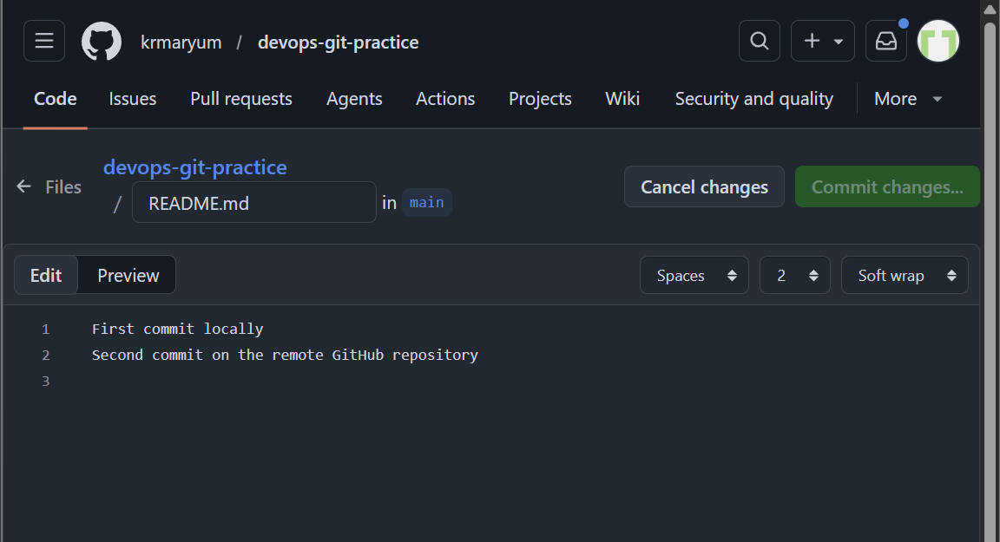
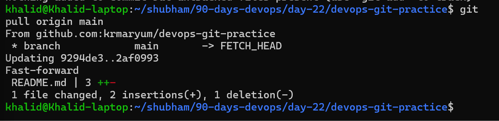
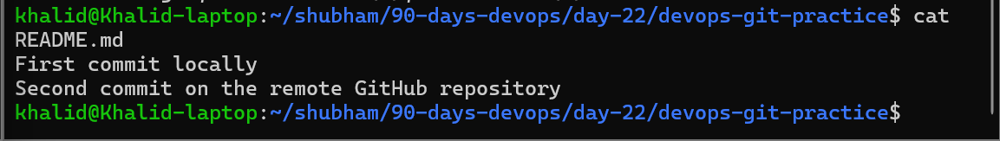
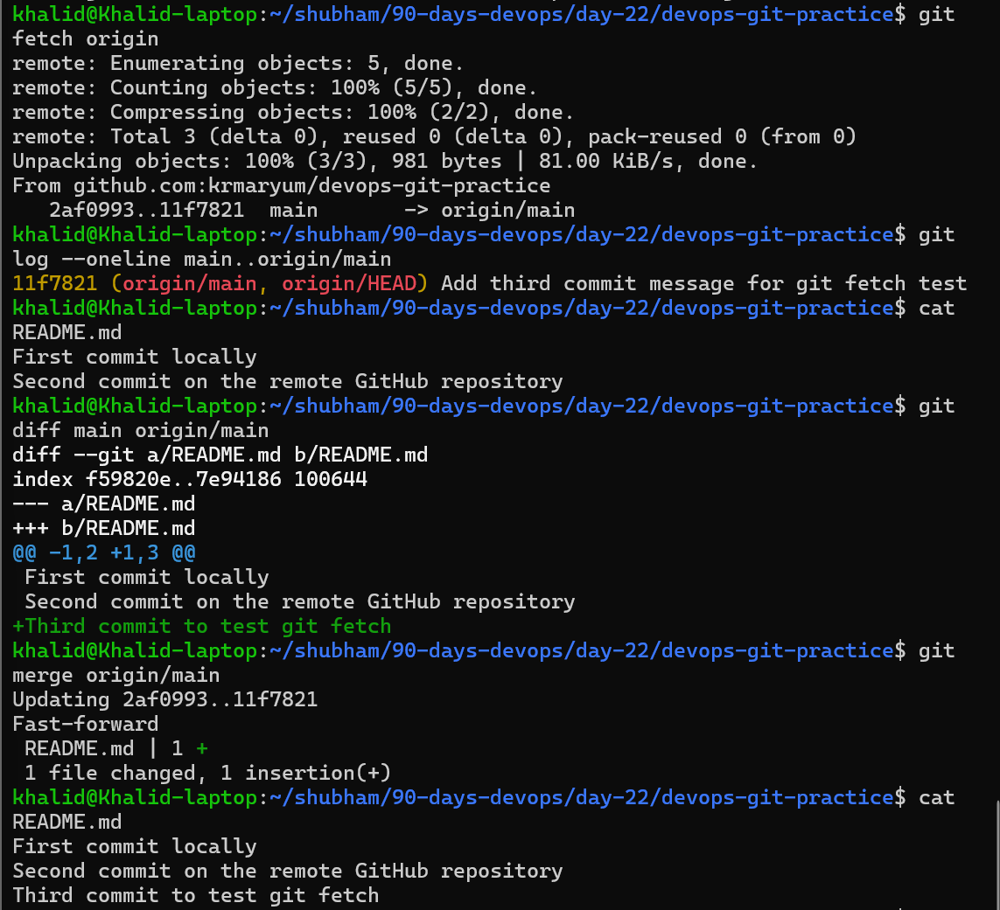

# Day 23 – Git Branching & Working with GitHub

# Table of Contents

| Section | Description | Link |
|---|---|---|
| Day 23 Overview | Introduction to Git branching and GitHub workflows | [Go to Overview](#day-23-overview) |
| Day 23 Objectives | Learning goals for Day 23 | [Go to Objectives](#day-23-objectives) |
| Expected Output | Required files and deliverables | [Go to Expected Output](#expected-output) |
| Task 1: Understanding Branches | Git branch concepts, HEAD, and branch switching | [Go to Task 1](#task-1-understanding-branches) |
| Task 1 Summary | Summary of Git branching fundamentals | [Go to Task 1 Summary](#final-understanding) |
| Task 2: Branching Commands — Hands-On | Practical branch creation and switching | [Go to Task 2](#task-2-branching-commands--hands-on) |
| Task 2 Summary | Branch isolation and workflow understanding | [Go to Task 2 Summary](#final-understanding-1) |
| Task 3: Push to GitHub | Connecting Git repositories to GitHub | [Go to Task 3](#task-3-push-to-github) |
| Task 3 Summary | Remote repositories and GitHub synchronization | [Go to Task 3 Summary](#final-understanding-2) |
| Task 4: Pull from GitHub | Fetching and pulling remote changes | [Go to Task 4](#task-4-pull-from-github) |
| Task 4 Summary | Understanding fetch vs pull workflows | [Go to Task 4 Summary](#final-understanding-3) |
| Task 5: Clone vs Fork | Forking, cloning, and upstream synchronization | [Go to Task 5](#task-5-clone-vs-fork) |
| Task 5 Summary | Understanding open-source GitHub workflows | [Go to Task 5 Summary](#final-understanding-4) |
| Day 23 Final Summary | Complete Git and GitHub workflow recap | [Go to Final Summary](#day-23-final-summary) |
| Day 23 Conclusion | Final Day 23 conclusions and outcomes | [Go to Conclusion](#day-23-conclusion) |

---

# Quick Summary Table

| Task | Main Topic | Key Commands Learned |
|---|---|---|
| Task 1 | Git Branch Concepts | `git switch`, `HEAD` |
| Task 2 | Branch Management | `git branch`, `git switch -c`, `git checkout` |
| Task 3 | GitHub Remotes | `git remote`, `git push`, `git branch -a` |
| Task 4 | Fetching & Pulling | `git fetch`, `git pull`, `git merge` |
| Task 5 | Clone vs Fork | `git clone`, `git remote add upstream` |

---

# Command Summary Table

| Command | Purpose |
|---|---|
| `git branch` | List local branches |
| `git branch <branch>` | Create a new branch |
| `git switch <branch>` | Switch branches |
| `git switch -c <branch>` | Create and switch branch |
| `git checkout <branch>` | Older branch switching command |
| `git branch -d <branch>` | Delete branch |
| `git branch -M main` | Rename branch |
| `git remote -v` | View remotes |
| `git remote add origin <url>` | Add remote repository |
| `git push -u origin main` | Push branch to GitHub |
| `git fetch origin` | Download remote changes |
| `git pull origin main` | Download and merge changes |
| `git merge origin/main` | Merge fetched changes |
| `git clone <url>` | Clone repository |
| `git remote add upstream <url>` | Add upstream repository |

---

# Workflow Summary Table

| Workflow | Process |
|---|---|
| Branch Workflow | Create → Switch → Commit → Merge |
| GitHub Push Workflow | Local Repo → `git push` → GitHub |
| Pull Workflow | GitHub → `git pull` → Local Repo |
| Fetch Workflow | `git fetch` → Review → `git merge` |
| Fork Workflow | Fork → Clone → Branch → Commit → Pull Request |

---

---

# Day 23 Overview

Day 23 introduces one of the most powerful features of Git:

```text
Branching
```

Branching allows developers to work on different features, fixes, or experiments safely without affecting the main project code.

This is one of the core concepts used daily in:
- DevOps
- software engineering
- CI/CD workflows
- GitHub collaboration
- open-source development

Day 23 also introduces working with GitHub remotes and pushing branches to GitHub repositories.

---

# Day 23 Objectives

The main objectives for Day 23 are:

- understand Git branching
- create and switch branches
- understand how HEAD works
- learn branch isolation
- practice working with multiple branches
- understand GitHub branch workflows
- push local branches to GitHub
- continue building Git command documentation

---

# Expected Output

By the end of Day 23:

- `day-23-notes.md` should be created
- `git-commands.md` should be updated
- new Git branches should be created
- branches should be pushed to GitHub
- GitHub repository should contain multiple branches

---

# Task 1: Understanding Branches

---

# Task 1 Overview

Task 1 focuses on understanding the basic concepts behind Git branching.

Before creating branches, it is important to understand:
- what branches are
- why branches are used
- how Git tracks the current branch
- what happens when switching branches

Branching is the foundation of:
- team collaboration
- feature development
- safe experimentation
- pull request workflows

---

# Task 1 Objectives

After completing Task 1, the following concepts should be understood:

- what a Git branch is
- why developers use branches
- what `HEAD` means in Git
- how branch switching works
- how Git updates files between branches

---

# 1. What is a branch in Git?

A branch in Git is a separate line of development.

It allows developers to work on features, bug fixes, or experiments independently without affecting the main branch.

Each branch contains its own commits and history from the point where the branch was created.

Example:

```bash
git switch -c feature-login
```

This command:
- creates a new branch
- switches to the new branch

---

# 2. Why do we use branches instead of committing everything to main?

Branches help keep the `main` branch clean and stable.

Developers use branches to:
- safely develop new features
- test changes
- fix bugs
- collaborate with teams
- avoid breaking production code

If everything is committed directly to `main`, mistakes can break the main project.

Without branches:
- unstable code could enter `main`
- collaboration becomes risky
- tracking feature work becomes difficult

Simple understanding:

```text
main branch = stable production-ready code
feature branch = isolated work area
```

---

# 3. What is HEAD in Git?

`HEAD` is Git’s pointer to the currently active branch or commit.

It tells Git:
```text
where you are right now
```

Example:

```text
HEAD -> main
```

Meaning:
- currently working on the `main` branch

If you switch branches, `HEAD` moves to that branch.

If you switch branches:
```bash
git switch feature-login
```

then `HEAD` moves to:

```text
HEAD -> feature-login
```

---

# 4. What happens to your files when you switch branches?

When switching branches, Git updates the working directory to match the files stored in that branch.

This means:
- files may change
- files may appear
- files may disappear
- file contents may update

Git automatically adjusts the project files to match the selected branch.

Important:

If you have uncommitted changes, Git may stop you from switching branches to prevent losing work.

---

# Important Understanding

Each branch can contain:
- different commits
- different files
- different project states

Git safely manages these changes when switching branches.

---

# Warning About Uncommitted Changes

If uncommitted changes exist, Git may prevent branch switching to avoid losing work.

Example warning:

```text
Please commit your changes or stash them before switching branches.
```

This protects project data from accidental overwrites.

---

# Real DevOps Importance

Branching is heavily used in:
- CI/CD pipelines
- infrastructure repositories
- Kubernetes configuration management
- GitHub pull requests
- team collaboration workflows

Modern DevOps workflows depend heavily on:
```text
feature branches
```

---

# Final Understanding

Task 1 introduced the core concept of Git branching:

```text
One repository
    ↓
Multiple isolated development paths
```

This is one of the most important Git concepts for professional development and DevOps engineering.

---

# Conclusion

Task 1 successfully demonstrated:

- understanding Git branches
- understanding branch isolation
- understanding HEAD
- understanding branch switching
- understanding safe development workflows

This builds the foundation for:
- creating branches
- merging branches
- GitHub pull requests
- collaborative development

---

---

# Task 2: Branching Commands — Hands-On

---

# Task 2 Overview

Task 2 focuses on practicing real Git branching commands.

This task introduces:
- listing branches
- creating branches
- switching branches
- creating branches in a single command
- comparing `git switch` and `git checkout`
- making branch-specific commits
- deleting branches

This is the beginning of real multi-branch Git workflows used in professional development and DevOps environments.

---

# Task 2 Objectives

After completing this task, the following concepts should be understood:

- how to list Git branches
- how to create new branches
- how to switch between branches
- how isolated branch commits work
- how `git switch` differs from `git checkout`
- how to safely delete branches
- how Git tracks separate development histories

---

# Step 1 — Navigate to Repository

Command used:

```bash
cd day-22/devops-git-practice
```

Purpose:
- move into the Git project repository

---

# Step 2 — Check Repository Status

Command used:

```bash
git status
```

Actual output:

```text
On branch master

No commits yet
```

Meaning:
- repository exists
- no commits have been created yet

---

# Step 3 — Attempt to Create Branch Before First Commit

Command used:

```bash
git branch feature-1
```

Actual output:

```text
fatal: not a valid object name: 'master'
```

---

# Understanding the Error

This error occurred because:
- the repository had no commits yet
- branches must point to an existing commit

Git cannot create additional branches until at least one commit exists.

---

# Step 4 — Create Initial File

Command used:

```bash
vim README.md
```

Content added:

```text
First Commit
```

Purpose:
- create first tracked file
- prepare repository for initial commit

---

# Step 5 — Stage README.md

Command used:

```bash
git add README.md
```

Purpose:
- move file into staging area

---

# Step 6 — Create Initial Commit

Command used:

```bash
git commit -m "Initial commit"
```

Actual output:

```text
[master (root-commit) 9294de3] Initial commit
```

Meaning:
- first commit created successfully
- repository now contains commit history

---

# Step 7 — Create feature-1 Branch

Command used:

```bash
git branch feature-1
```

Purpose:
- create new branch
- branch created from current commit

---

# Step 8 — List All Branches

Command used:

```bash
git branch
```

Actual output:

```text
feature-1
* master
```

Meaning:
- currently on `master`
- `feature-1` branch exists

The `*` symbol indicates the active branch.

---

# Step 9 — Switch to feature-1

Command used:

```bash
git switch feature-1
```

Actual output:

```text
Switched to branch 'feature-1'
```

Purpose:
- move from `master` branch to `feature-1`

---

# Step 10 — Verify Current Branch

Command used:

```bash
git branch
```

Actual output:

```text
* feature-1
master
```

Meaning:
- currently working on `feature-1`

---

# Step 11 — Create and Switch to feature-2

Command used:

```bash
git switch -c feature-2
```

Actual output:

```text
Switched to a new branch 'feature-2'
```

Purpose:
- create branch
- switch immediately

Equivalent older command:

```bash
git checkout -b feature-2
```

---

# Step 12 — View All Branches Again

Command used:

```bash
git branch
```

Actual output:

```text
feature-1
* feature-2
master
```

Meaning:
- three branches now exist
- currently on `feature-2`

---

# Step 13 — Attempt to Switch to main

Command used:

```bash
git switch main
```

Actual output:

```text
fatal: invalid reference: main
```

Reason:
- repository still used `master`
- `main` branch did not exist yet

---

# Step 14 — Rename master to main

Command used:

```bash
git branch -M main
```

Purpose:
- rename default branch
- modernize branch naming convention

After renaming:

```text
master → main
```

---

# Step 15 — Verify Branch Rename

Command used:

```bash
git branch
```

Actual output:

```text
feature-1
feature-2
* main
```

Meaning:
- branch renamed successfully
- `main` is now active branch

---

# Step 16 — Switch Back to feature-1

Command used:

```bash
git switch feature-1
```

Actual output:

```text
Switched to branch 'feature-1'
```

---

# Step 17 — Create Branch-Specific File

Command used:

```bash
echo "feature-1 branch work" > feature-1.txt
```

Purpose:
- create file unique to `feature-1`

---

# Step 18 — Stage Branch File

Command used:

```bash
git add feature-1.txt
```

Purpose:
- stage new file for commit

---

# Step 19 — Commit Changes on feature-1

Command used:

```bash
git commit -m "feat: add feature-1 branch file"
```

Actual output:

```text
[feature-1 b386608] feat: add feature-1 branch file
```

Meaning:
- commit exists only on `feature-1`

---

# Step 20 — View Commit History

Command used:

```bash
git log --oneline
```

Actual output:

```text
b386608 (HEAD -> feature-1) feat: add feature-1 branch file
9294de3 (main, feature-2) Initial commit
```

---

# Common Mistake Observed

Incorrect command:

```bash
git log --online
```

Correct command:

```bash
git log --oneline
```

---

# Step 21 — Switch Back to main

Command used:

```bash
git switch main
```

Actual output:

```text
Switched to branch 'main'
```

---

# Step 22 — Verify feature-1 Commit Is Missing on main

Command used:

```bash
git log --oneline
```

Actual output:

```text
9294de3 (HEAD -> main, feature-2) Initial commit
```

Observation:
- `feature-1` commit does not exist on `main`

This proves:
- branches have isolated commit history

---

# Step 23 — Verify feature-1.txt Is Missing on main

Command used:

```bash
ls
```

Actual output:

```text
README.md
```

Observation:
- `feature-1.txt` does not exist on `main`

Git updated the working directory automatically during branch switching.

---

# Important Understanding

Branches are isolated development environments.

Changes made in one branch do not automatically appear in another branch.

This is one of the most powerful Git features.

---

# Step 24 — Delete feature-2 Branch

Command used:

```bash
git branch -d feature-2
```

Actual output:

```text
Deleted branch feature-2 (was 9294de3).
```

Purpose:
- remove unused branch safely

---

# Important Rule

Git does not allow deleting the currently active branch.

You must switch to another branch first before deletion.

---

# Difference Between git switch and git checkout

## git switch

Purpose:
- modern branch switching command
- safer and simpler
- used only for branch navigation

Example:

```bash
git switch main
```

---

## git checkout

Purpose:
- older multi-purpose Git command
- can switch branches
- can restore files
- can checkout commits

Example:

```bash
git checkout feature-1
```

---

# Simple Understanding

```text
git switch   = branch switching only
git checkout = multiple Git operations
```

Modern Git recommends:

```bash
git switch
```

for branch navigation.

---

# Commands Practiced

## List branches

```bash
git branch
```

---

## Create branch

```bash
git branch feature-1
```

---

## Switch branch

```bash
git switch feature-1
```

---

## Create and switch branch

```bash
git switch -c feature-2
```

---

## Rename branch

```bash
git branch -M main
```

---

## Delete branch

```bash
git branch -d feature-2
```

---

## View compact history

```bash
git log --oneline
```

---

# Real DevOps Importance

Branching is heavily used in:
- CI/CD pipelines
- feature development
- infrastructure testing
- Kubernetes repositories
- GitHub pull requests
- release workflows

Typical workflow:

```text
main
 ├── feature-login
 ├── feature-api
 ├── bugfix-nginx
 └── testing
```

---

# Final Understanding

Task 2 demonstrated how Git branches create isolated development environments.

Key understanding:

```text
Branches allow multiple project versions to exist safely at the same time.
```

---

# Conclusion

Task 2 successfully demonstrated:

- creating branches
- switching branches
- isolated branch commits
- branch renaming
- deleting branches
- branch-specific files
- modern Git branch workflows

This builds the foundation for:
- merging
- pull requests
- GitHub collaboration
- professional DevOps workflows

---

# Task 3: Push to GitHub

# Task 3 Overview

Task 3 focuses on connecting the local Git repository to GitHub and pushing branches to a remote repository.

This task introduces:
- remote repositories
- GitHub integration
- remote branch management
- pushing local commits to GitHub
- upstream tracking
- branch synchronization

This is one of the most important Git workflows used in professional DevOps and software engineering environments.

---

# Task 3 Objectives

After completing this task, the following concepts should be understood:

- how to create a GitHub repository
- how to connect local Git to GitHub
- how to push branches to GitHub
- how upstream tracking works
- how remote repositories store Git history
- the difference between `origin` and `upstream`

---

# Step 1 — Create GitHub Repository

A new repository was created on GitHub.

A new GitHub repository named:

```text
devops-git-practice
```

was created successfully.

Important:
- README was NOT initialized
- repository was created empty

Reason:
- local repository already contains commit history
- avoids merge conflicts during first push

---

# Step 2 — Verify Current Branch

Command used:

```bash
git branch
```

Example output:

```text
feature-1
* main
```

Meaning:
- currently on `main`
- `feature-1` branch also exists locally

---

# Step 3 — Connect Local Repository to GitHub

Run from:
```text
/home/khalid/shubham/90-days-devops/day-22/devops-git-practice
```

Command used:

```bash
git remote add origin git@github.com:krmaryum/devops-git-practice.git
```

Purpose:
- connect local repository to GitHub
- create remote reference named `origin`

---

# Understanding origin

`origin` is the default nickname Git gives to the remote GitHub repository.

Instead of typing the full GitHub URL every time:

```text
git@github.com:krmaryum/devops-git-practice.git
```

Git allows using:

```text
origin
```

as a shortcut.

---

# Step 4 — Verify Remote Repository

Command used:

```bash
git remote -v
```

Example output:

```text
origin  https://github.com/krmaryum/Hello-World.git (fetch)
origin  https://github.com/krmaryum/Hello-World.git (push)
```

Meaning:
- GitHub remote connected successfully
- fetch and push operations are configured

---

# Step 5 — Push main Branch to GitHub

Command used:

```bash
git push -u origin main
```

Purpose:
- upload local `main` branch to GitHub
- create remote tracking relationship

---

# Understanding -u

The `-u` flag means:

```text
--set-upstream
```

This links:
- local branch
- remote branch

After using `-u`, future pushes can simply use:

```bash
git push
```

instead of:

```bash
git push origin main
```

# Understanding git push Output

Command used:

```bash
git push -u origin main
```

Actual output:

```text
Enumerating objects: 3, done.
Counting objects: 100% (3/3), done.
Writing objects: 100% (3/3), 222 bytes | 222.00 KiB/s, done.
Total 3 (delta 0), reused 0 (delta 0), pack-reused 0 (from 0)
To github.com:krmaryum/devops-git-practice.git
 * [new branch]      main -> main
branch 'main' set up to track 'origin/main'.
```

---

# Line-by-Line Explanation

## 1. Enumerating objects

```text
Enumerating objects: 3, done.
```

Meaning:
- Git identified 3 objects to upload
- objects may include:
  - commits
  - files
  - Git metadata

Git first checks what needs to be transferred.

---

## 2. Counting objects

```text
Counting objects: 100% (3/3), done.
```

Meaning:
- Git counted all objects successfully
- total objects found:
  ```text
  3
  ```

Git prepares the upload package.

---

## 3. Writing objects

```text
Writing objects: 100% (3/3), 222 bytes | 222.00 KiB/s, done.
```

Meaning:
- Git uploaded all repository objects to GitHub
- upload size:
  ```text
  222 bytes
  ```
- upload completed successfully

---

## 4. Total Summary

```text
Total 3 (delta 0), reused 0 (delta 0), pack-reused 0 (from 0)
```

Meaning:

| Part | Explanation |
|---|---|
| `Total 3` | total uploaded Git objects |
| `delta 0` | no compressed differences were needed |
| `reused 0` | no old objects reused |
| `pack-reused 0` | no existing package reused |

Since this was the first push:
- everything was uploaded fresh

---

## 5. Remote Repository Destination

```text
To github.com:krmaryum/devops-git-practice.git
```

Meaning:
- repository successfully connected to GitHub
- push destination was:
  ```text
  github.com:krmaryum/devops-git-practice.git
  ```

---

## 6. New Branch Created on GitHub

```text
* [new branch]      main -> main
```

Meaning:
- local branch:
  ```text
  main
  ```
  was uploaded to GitHub

- remote GitHub branch:
  ```text
  main
  ```
  was created successfully

Simple understanding:

```text
local main branch → GitHub main branch
```

---

## 7. Upstream Tracking Created

```text
branch 'main' set up to track 'origin/main'.
```

Meaning:
- local `main` branch is now linked to:
  ```text
  origin/main
  ```

This allows simpler future commands:

Instead of:

```bash
git push origin main
```

you can now use:

```bash
git push
```

and Git automatically knows:
- where to push
- which branch to use

---

# Final Understanding

This output confirms:

- GitHub connection works
- repository uploaded successfully
- remote branch created
- upstream tracking configured
- local and remote repositories are now connected

---

# Simple Workflow

```text
Local main branch
        ↓
git push -u origin main
        ↓
GitHub remote repository
```

---

# Step 6 — Push feature-1 Branch to GitHub

Switch to feature branch:

```bash
git switch feature-1
```

Push branch:

```bash
git push -u origin feature-1
```

Purpose:
- upload feature branch to GitHub
- create remote branch tracking

---

# Step 7 — Verify Remote Branches

Command used:

```bash
git branch -a
```

Example output:

```text
* feature-1
  main
  remotes/origin/feature-1
  remotes/origin/main
```

Meaning:
- local branches exist
- remote GitHub branches exist

---

# Step 8 — Verify Branches on GitHub

After pushing:
- `main` branch appeared on GitHub
- `feature-1` branch appeared on GitHub

GitHub now stores:
- repository files
- commit history
- branch history

---

# Understanding Local vs Remote Branches

## Local Branch

Exists only on the local machine.

Example:

```text
feature-1
```

---

## Remote Branch

Exists on GitHub remote repository.

Example:

```text
origin/feature-1
```

---

# What is the Difference Between origin and upstream?

## origin

`origin` refers to:
- your own remote repository
- usually your GitHub repository or fork

Example:

```text
origin = your GitHub repository
```

---

## upstream

`upstream` refers to:
- the original repository you forked from
- the main project repository

Example:

```text
upstream = original project repository
```

---

# Example Workflow

```text
Your Fork:
origin

Original Repository:
upstream
```

Typical commands:

```bash
git pull upstream main
```

```bash
git push origin feature-1
```

---

# Simple Understanding

```text
origin   = your repository
upstream = original repository
```

---

# Important Commands Practiced

## Add remote repository

```bash
git remote add origin <repository-url>
```

---

## Verify remotes

```bash
git remote -v
```

---

## Push main branch

```bash
git push -u origin main
```

---

## Push feature branch

```bash
git push -u origin feature-1
```

---

## View all branches

```bash
git branch -a
```

---

# Real DevOps Importance

Remote repositories are heavily used in:
- CI/CD pipelines
- team collaboration
- GitHub workflows
- Kubernetes repositories
- infrastructure-as-code repositories
- automation projects

GitHub enables:
- collaboration
- pull requests
- code review
- centralized version control

---

# Workflow Summary

```text
Local Repository
        ↓
git push
        ↓
GitHub Remote Repository
```

---

# Final Understanding

Task 3 demonstrated how local Git repositories connect to GitHub remote repositories.

Key understanding:

```text
Git manages local history
GitHub stores and shares that history remotely
```

---

# Conclusion

Task 3 successfully demonstrated:

- creating GitHub repositories
- connecting Git remotes
- understanding origin
- pushing branches to GitHub
- upstream tracking
- remote branch management
- GitHub synchronization

This forms the foundation for:
- pull requests
- collaboration
- CI/CD workflows
- professional GitHub development

---

# Task 4: Pull from GitHub

---

# Task 4 Overview

Task 4 focused on downloading and reviewing changes made directly on GitHub.

This task introduced:
- editing files directly on GitHub
- synchronizing local and remote repositories
- understanding `git pull`
- understanding `git fetch`
- reviewing remote changes before merging
- handling divergent branch situations

This workflow is extremely important in professional Git and DevOps environments.

---

# Task 4 Objectives

After completing this task, the following concepts were understood:

- how GitHub changes appear locally
- how to pull remote updates
- how Git synchronizes repositories
- the difference between `git fetch` and `git pull`
- how to review changes before merging
- how divergent branches work

---

# Step 1 — Verify Repository Status

Command used:

```bash
git status
```

Actual output:

```text
On branch feature-1
Your branch is up to date with 'origin/feature-1'.
```

Meaning:
- currently on `feature-1`
- branch synchronized with GitHub

An untracked file also existed:

```text
task4.txt
```

---

# Step 2 — Attempt to Pull main While on feature-1

Command used:

```bash
git pull origin main
```

Git downloaded remote data successfully but produced an error:

```text
fatal: Need to specify how to reconcile divergent branches.
```

---

# Understanding the Error

This happened because:

- current branch:
  ```text
  feature-1
  ```

- pulled branch:
  ```text
  main
  ```

Both branches had different commit histories.

Git calls this situation:

```text
divergent branches
```

Git required clarification on whether to:
- merge
- rebase
- fast-forward

before continuing.

---

# Step 3 — Switch to main Branch

Command used:

```bash
git switch main
```

Actual output:

```text
Your branch is behind 'origin/main' by 1 commit, and can be fast-forwarded.
```

Meaning:
- GitHub contained newer commits
- local `main` branch needed updates

---




# Step 4 — Verify Local Repository Status

Command used:

```bash
git status
```

Actual output:

```text
Your branch is behind 'origin/main' by 1 commit
```

Meaning:
- local repository outdated
- The GitHub repository was ahead by one commit.

---

# Step 5 — Pull Changes From GitHub

Command used:

```bash
git pull origin main
```



Meaning:
- local repository updated successfully
- no merge conflict occurred
- Git performed a fast-forward update

---

# Understanding Fast-forward

```text
Fast-forward
```

means:
- no conflicting commits existed locally
- Git simply moved branch pointer forward

This is the simplest merge type.

---

# Step 6 — Verify Updated File

Command used:

```bash
cat README.md
```




Meaning:
- GitHub changes successfully downloaded
- local repository updated correctly

---

# Step 7 — Practice git fetch

Command used:

```bash
git fetch origin
```



Meaning:
- Git downloaded new remote updates
- local files were NOT updated yet

Important understanding:

```text
git fetch downloads changes only
```

---

# Step 8 — View Remote Commits Before Merge

Command used:

```bash
git log --oneline main..origin/main
```

Actual output:

```text
11f7821 Add third commit message for git fetch test
```

Meaning:
- remote repository had one new commit
- local `main` branch did not contain this commit yet

---

# Step 9 — Compare Local and Remote Changes

Command used:

```bash
git diff main origin/main
```

Actual output:

```diff
+Third commit to test git fetch
```

Meaning:
- one new line existed remotely
- change had not been merged locally yet

This demonstrated how Git allows reviewing changes safely before merging.

---

# Step 10 — Merge Downloaded Changes

Command used:

```bash
git merge origin/main
```

Actual output:

```text
Updating 2af0993..11f7821
Fast-forward
 README.md | 1 +
```

Meaning:
- fetched changes merged successfully
- local repository updated

---

# Step 11 — Verify Final File Content

Command used:

```bash
cat README.md
```

Actual output:

```text
First commit locally
Second commit on the remote GitHub repository
Third commit to test git fetch
```

Meaning:
- fetched remote change successfully merged
- local repository synchronized completely

---

# What is the Difference Between git fetch and git pull?

---

# git fetch

Command:

```bash
git fetch origin
```

Purpose:
- downloads remote changes only
- does NOT update local files automatically

Useful for:
- reviewing changes first
- checking commits safely
- comparing differences before merging

---

# git pull

Command:

```bash
git pull origin main
```

Purpose:
- downloads remote changes
- automatically merges them into current branch

Simple understanding:

```text
git pull = git fetch + git merge
```

---

# Simple Comparison

## git fetch

```text
Download only
```

Local files stay unchanged.

---

## git pull

```text
Download + merge
```

Local files update immediately.

---

# Commands Practiced

## Check repository status

```bash
git status
```

---

## Pull changes

```bash
git pull origin main
```

---

## Fetch changes

```bash
git fetch origin
```

---

## View remote commits

```bash
git log --oneline main..origin/main
```

---

## Compare local vs remote

```bash
git diff main origin/main
```

---

## Merge fetched changes

```bash
git merge origin/main
```

---

## View updated file

```bash
cat README.md
```

---

# Real DevOps Importance

Fetching and pulling are heavily used in:
- CI/CD workflows
- infrastructure repositories
- Kubernetes manifests
- team collaboration
- shared automation projects

Professional developers commonly use:

```text
git fetch
→ review
→ git merge
```

to safely inspect remote changes before updating production code.

---

# Workflow Summary

```text
GitHub Repository
        ↓
git fetch
        ↓
Review Changes
        ↓
git merge
        ↓
Local Repository Updated
```

---

# Final Understanding

Task 4 demonstrated how Git synchronizes local and remote repositories safely.

Key understanding:

```text
git fetch downloads changes safely for review

git pull downloads and merges automatically
```

---

# Conclusion

Task 4 successfully demonstrated:

- editing files directly on GitHub
- pulling remote updates
- fetching remote changes
- reviewing commits before merge
- comparing local vs remote repositories
- merging fetched changes
- handling divergent branches

This builds the foundation for:
- collaborative development
- pull requests
- code review workflows
- professional GitHub usage

---

# Task 5: Clone vs Fork

---

# Task 5 Overview

Task 5 focused on understanding the difference between cloning and forking GitHub repositories.

This task introduced:
- cloning repositories
- forking repositories
- working with personal GitHub copies
- understanding upstream repositories
- synchronizing forks with original repositories

These concepts are heavily used in:
- open-source contribution
- GitHub collaboration
- DevOps workflows
- professional software development

---

# Task 5 Objectives

After completing this task, the following concepts were understood:

- how to clone repositories
- how GitHub forks work
- difference between clone and fork
- when to use clone vs fork
- how to synchronize a fork with the original repository
- understanding upstream repositories

---

# Step 1 — Choose a Public GitHub Repository

A public repository was selected from GitHub.

Repository used:

```text
https://github.com/octocat/Hello-World
```

Purpose:
- practice cloning
- practice forking
- understand GitHub collaboration workflows

---

# Step 2 — Clone Public Repository

Command used:

```bash
git clone https://github.com/octocat/Hello-World.git
```

Actual output:

```text
Cloning into 'Hello-World'...
Receiving objects: 100% (13/13), done.
```

Meaning:
- repository downloaded successfully
- full Git history copied locally

---

# Step 3 — Verify Cloned Repository

Command used:

```bash
ls
```

Actual output:

```text
Hello-World  README.md  task4.txt  task5.txt
```

Meaning:
- cloned repository directory exists locally

---

# Step 4 — Verify Existing Remote Repository

Command used:

```bash
git remote -v
```

Initial mistake:

```bash
git remte -v
```

Error:

```text
git: 'remte' is not a git command.
```

Correct command:

```bash
git remote -v
```

Actual output:

```text
origin  git@github.com:krmaryum/devops-git-practice.git (fetch)
origin  git@github.com:krmaryum/devops-git-practice.git (push)
```

Meaning:
- current repository already connected to GitHub
- `origin` points to personal GitHub repository

---

# Step 5 — Fork Repository on GitHub

The repository:

```text
octocat/Hello-World
```

was forked using the GitHub web interface.

GitHub created a personal copy:

```text
github.com/krmaryum/Hello-World
```

Purpose:
- create personal GitHub copy
- allow independent experimentation and contribution

---

# Step 6 — Attempt to Clone Forked Repository

Command used:

```bash
git clone https://github.com/krmaryum/Hello-World.git
```

Actual output:

```text
fatal: destination path 'Hello-World' already exists and is not an empty directory.
```

Meaning:
- repository was already cloned earlier
- Git prevented overwriting existing directory

---

# Understanding the Error

Git does not allow cloning into:
- an existing non-empty directory

Solution options:
- remove old directory
- rename directory
- clone into another location

---

# Step 7 — Add Original Repository as upstream

Command used:

```bash
git remote add upstream https://github.com/octocat/Hello-World.git
```

Purpose:
- connect local repository to original repository
- allow synchronization with original project

---

# Step 8 — Verify upstream Repository

Command used:

```bash
git remote -v
```

Actual output:

```text
origin    git@github.com:krmaryum/devops-git-practice.git (fetch)
origin    git@github.com:krmaryum/devops-git-practice.git (push)

upstream  https://github.com/octocat/Hello-World.git (fetch)
upstream  https://github.com/octocat/Hello-World.git (push)
```

Meaning:
- `origin` = personal repository
- `upstream` = original repository

---

# Step 9 — Fetch Updates From upstream

Command used:

```bash
git fetch upstream
```

Actual output:

```text
[new branch] master          -> upstream/master
[new branch] octocat-patch-1 -> upstream/octocat-patch-1
[new branch] test            -> upstream/test
```

Meaning:
- Git downloaded remote branches from original repository
- local repository now aware of upstream branches

---

# Step 10 — Attempt to Merge upstream/main

Command used:

```bash
git merge upstream/main
```

Actual output:

```text
merge: upstream/main - not something we can merge
```

---

# Understanding the Error

The original repository used:

```text
master
```

not:

```text
main
```

Therefore:

```bash
git merge upstream/main
```

failed because:
- `upstream/main` did not exist

Correct command would be:

```bash
git merge upstream/master
```

---

# Step 11 — Push Local Repository

Command used:

```bash
git push origin main
```

Actual output:

```text
Everything up-to-date
```

Meaning:
- local and remote repositories already synchronized
- no new commits needed pushing

---

# What is the Difference Between Clone and Fork?

---

# Clone

A clone is:
- a local copy of a repository
- downloaded to your machine using Git

Command:

```bash
git clone <repository-url>
```

Clone exists:
- on local computer only

---

# Fork

A fork is:
- a GitHub copy of another repository
- stored in your own GitHub account

Fork exists:
- on GitHub server

Forking is a GitHub feature, not a Git feature.

---

# Simple Understanding

```text
Clone = local repository copy

Fork = GitHub repository copy
```

---

# When Would You Clone vs Fork?

---

# Use Clone When:

- working on your own repository
- collaborating inside a team
- you already have write access
- downloading repositories locally

Examples:
- personal projects
- company repositories

---

# Use Fork When:

- contributing to open-source projects
- you do not have direct write access
- experimenting independently
- creating personal repository copies

Examples:
- Linux contributions
- Kubernetes projects
- public GitHub repositories

---

# After Forking, How Do You Keep Your Fork in Sync?

---

# Step 1 — Add upstream Repository

Command:

```bash
git remote add upstream <original-repository-url>
```

Purpose:
- connect fork to original repository

---

# Step 2 — Fetch Updates

Command:

```bash
git fetch upstream
```

Purpose:
- download latest changes from original repository

---

# Step 3 — Merge Updates

Command:

```bash
git merge upstream/master
```

or

```bash
git merge upstream/main
```

depending on repository branch naming.

Purpose:
- update local repository

---

# Step 4 — Push Updated Changes

Command:

```bash
git push origin main
```

Purpose:
- synchronize GitHub fork with latest changes

---

# Simple Fork Synchronization Workflow

```text
Original Repository
        ↓
git fetch upstream
        ↓
git merge upstream/master
        ↓
git push origin main
        ↓
Fork Updated
```

---

# Commands Practiced

## Clone repository

```bash
git clone https://github.com/octocat/Hello-World.git
```

---

## View remote repositories

```bash
git remote -v
```

---

## Add upstream repository

```bash
git remote add upstream https://github.com/octocat/Hello-World.git
```

---

## Fetch upstream updates

```bash
git fetch upstream
```

---

## Merge upstream changes

```bash
git merge upstream/master
```

---

## Push local changes

```bash
git push origin main
```

---

# Real DevOps Importance

Forking and cloning are heavily used in:
- open-source contribution
- infrastructure repositories
- CI/CD workflows
- GitHub collaboration
- Kubernetes projects

Typical workflow:

```text
fork → clone → branch → commit → push → pull request
```

---

# Workflow Summary

```text
Fork Repository on GitHub
        ↓
Clone Fork Locally
        ↓
Add upstream Repository
        ↓
Fetch Updates
        ↓
Merge Updates
        ↓
Push Changes
```

---

# Final Understanding

Task 5 demonstrated how GitHub collaboration works using:
- forks
- clones
- upstream repositories

Key understanding:

```text
clone = local copy

fork = GitHub account copy
```

---

# Conclusion

Task 5 successfully demonstrated:

- cloning repositories
- forking repositories
- understanding upstream repositories
- synchronizing forks
- handling clone conflicts
- understanding branch naming differences
- GitHub collaboration workflows

This builds the foundation for:
- open-source contribution
- pull requests
- collaborative DevOps workflows
- professional GitHub development

---

# Day 23 Final Summary

Day 23 introduced advanced Git workflows including:
- branching
- remote repositories
- GitHub integration
- pulling and fetching changes
- cloning repositories
- forking repositories
- upstream synchronization

Key understanding gained:

```text
Git manages version history locally
GitHub enables remote collaboration and synchronization
```

These workflows form the foundation of:
- collaborative software development
- DevOps automation
- CI/CD pipelines
- open-source contribution

---

# Day 23 Conclusion

Day 23 successfully demonstrated:

- Git branching workflows
- isolated feature development
- GitHub remote management
- pushing and pulling repositories
- reviewing remote changes safely
- understanding fetch vs pull
- cloning repositories
- forking repositories
- synchronizing forks with upstream repositories

This builds the foundation for:
- pull requests
- team collaboration
- open-source contribution
- professional DevOps Git workflows
