# Day 24 Overview

| Section                                | Summary                                                                                                                                          | Link                                                                              |
| -------------------------------------- | ------------------------------------------------------------------------------------------------------------------------------------------------ | --------------------------------------------------------------------------------- |
| Day 24 Overview                        | Introduction to advanced Git workflows including merge, rebase, stash, squash merge, and cherry-pick used in DevOps and real-world collaboration | [Go to Overview](#day-24-overview)                                                |
| Day 24 Objectives                      | Learning goals and expected outcomes for advanced Git operations                                                                                 | [Go to Objectives](#day-24-objectives)                                            |
| Command Summary Table                  | Quick reference of all important Git commands practiced during Day 24                                                                            | [Go to Command Summary](#command-summary-table)                                   |
| Task 1 — Git Merge                     | Hands-on practice for merge workflows, fast-forward merge, merge commits, and merge conflicts                                                    | [Go to Task 1](#task-1--git-merge)                                                |
| Task 1 — Fast-Forward Merge            | Understanding how Git performs simple pointer movement merges                                                                                    | [Go to Fast-Forward Merge](#understanding-fast-forward-merge)                     |
| Task 1 — Merge Commit                  | Understanding merge commits and branch divergence                                                                                                | [Go to Merge Commit](#what-is-a-merge-commit)                                     |
| Task 1 — Merge Conflict                | Intentional conflict creation and manual conflict resolution                                                                                     | [Go to Merge Conflict](#what-is-a-merge-conflict)                                 |
| Task 2 — Git Rebase                    | Hands-on rebase workflow and linear Git history management                                                                                       | [Go to Task 2](#task-2-git-rebase-hands-on)                                       |
| Task 2 — Rebase vs Merge               | Comparison between merge history and rebase history                                                                                              | [Go to Rebase vs Merge](#how-is-rebase-history-different-from-merge)              |
| Task 2 — Rebase Risks                  | Why rebasing shared commits is dangerous                                                                                                         | [Go to Rebase Risks](#why-should-you-never-rebase-shared-commits)                 |
| Task 3 — Squash Merge vs Regular Merge | Comparison of squash merge and normal merge workflows                                                                                            | [Go to Task 3](#day-24--task-3-squash-commit-vs-merge-commit)                     |
| Task 3 — Squash Merge                  | Combining multiple commits into one clean commit                                                                                                 | [Go to Squash Merge](#what-does-squash-merge-do)                                  |
| Task 3 — Regular Merge                 | Preserving complete branch commit history                                                                                                        | [Go to Regular Merge](#part-b--regular-merge-practice)                            |
| Task 4 — Git Stash                     | Temporary storage of unfinished work and context switching                                                                                       | [Go to Task 4](#task-4-git-stash-hands-on)                                        |
| Task 4 — Stash Pop vs Apply            | Difference between restoring and removing stash entries                                                                                          | [Go to Stash Pop vs Apply](#difference-between-git-stash-pop-and-git-stash-apply) |
| Task 4 — Real-World Stash Usage        | Practical developer workflows using Git stash                                                                                                    | [Go to Real-World Usage](#real-world-use-cases-for-git-stash)                     |
| Task 5 — Git Cherry-Pick               | Selective commit transfer between branches                                                                                                       | [Go to Task 5](#day-24--task-5-git-cherry-pick-hands-on)                          |
| Task 5 — Cherry-Pick Workflow          | Applying only one selected commit to another branch                                                                                              | [Go to Cherry-Pick Workflow](#what-does-cherry-pick-do)                           |
| Task 5 — Cherry-Pick Risks             | Understanding conflicts and dependency issues during cherry-pick                                                                                 | [Go to Cherry-Pick Risks](#what-can-go-wrong-with-cherry-picking)                 |
| Day 24 Final Understanding             | Summary of all advanced Git workflows practiced during Day 24                                                                                    | [Go to Final Understanding](#final-understanding)                                 |
| Day 24 Conclusion                      | Final conclusion and overall Git learning outcome                                                                                                | [Go to Conclusion](#conclusion)                                                   |


Day 24 introduces advanced Git workflows used in real-world development and DevOps teams.

Until now, you learned:

- repositories
- commits
- branching
- pushing to GitHub

Now the focus is:
```text
How branches come back together
```
and how developers safely:
- combine work
- move commits between branches
- temporarily save unfinished work
- manage conflicts
- maintain clean history 

These are professional Git skills used daily in:
- DevOps engineering
- CI/CD workflows
- software teams
- GitHub collaboration
- production release workflows

---

# Day 24 Objectives
By the end of Day 24, you should understand:
- how Git merge works
- fast-forward merge vs merge commit
- what merge conflicts are
- how Git rebase works
- how to use Git stash
- how cherry-pick works
- how to visualize Git history
- how developers safely context-switch between tasks

---

# Expected Output

By the end of Day 24:
- day-24-notes.md should be created
- git-commands.md should be updated
- merge operations should be practiced
- merge conflicts should be tested
- stash operations should be practiced
- cherry-pick should be tested
- all changes should be committed and pushed to GitHub

---

# Command Summary Table

| Command                           | Purpose                                  |
| --------------------------------- | ---------------------------------------- |
| `git merge <branch>`              | Merge branch into current branch         |
| `git log --oneline --graph --all` | Visualize branch history                 |
| `git rebase <branch>`             | Reapply commits on top of another branch |
| `git stash`                       | Save unfinished work temporarily         |
| `git stash list`                  | View saved stashes                       |
| `git stash pop`                   | Restore latest stash                     |
| `git stash push -m "msg"`         | Create named stash                       |
| `git cherry-pick <commit>`        | Copy specific commit to another branch   |

---

# Workflow Summary
```text
Feature Branch
       ↓
git merge / git rebase
       ↓
main branch updated
```

# Task 1 — Git Merge

## Overview

This hands-on task covers:

- Creating branches
- Switching branches
- Creating files
- Staging changes
- Making commits
- Performing fast-forward merge
- Creating merge commit
- Visualizing Git history
- Creating merge conflicts

Merging is one of the most important Git workflows used in:
- pull requests
- GitHub collaboration
- CI/CD pipelines
- production deployments

---

# Objectives

After completing Task 1, you should understand:
- how Git merges branches
- fast-forward merge behavior
- merge commits
- merge conflicts
- Git branch history visualization

---

# Step 1 — Check Existing Branches

```bash
git branch
```

Output:

```text
feature-1
* main
```

---

# Step 2 — Check Repository Status

```bash
git status
```

Output:

```text
On branch main
Untracked files:
README.md
task1.txt
```

---

# Step 3 — Create feature-login Branch

```bash
git switch -c feature-login
```

Output:

```text
Switched to a new branch 'feature-login'
```
Purpose:
- create isolated feature branch
- begin separate development work

---

# Step 4 — Verify Current Branch

```bash
git branch
```

Output:

```text
feature-1
* feature-login
main
```

---

# Step 5 — Create login.txt File

```bash
echo "Login page created" > login.txt
```

---

# Step 6 — View File Content

```bash
cat login.txt
```

Output:

```text
Login page created
```

---

# Step 7 — Stage login.txt

```bash
git add login.txt
```

---

# Step 8 — Commit Login Feature

```bash
git commit -m "feat: add login page"
```

Output:

```text
[feature-login] feat: add login page
```

---

# Step 9 — Add Login Validation

```bash
echo "Login validation added" >> login.txt
```

---

# Step 10 — Verify Updated File

```bash
cat login.txt
```

Output:

```text
Login page created
Login validation added
```

---

# Step 11 — Stage Updated File

```bash
git add login.txt
```

---

# Step 12 — Commit Validation

```bash
git commit -m "feat: add login validation"
```

---

# Step 13 — Switch Back to main Branch

```bash
git switch main
```

---

# Step 14 — Merge feature-login into main

```bash
git merge feature-login
```

Output:

```text
Fast-forward
```

---

# Understanding Fast-Forward Merge

If no new commits exist on `main`, Git performs:
```text
Fast-forward merge
```
Meaning:
- Git simply moves the branch pointer forward
- no separate merge commit created

Visualization:
```text
main
  \
   feature-login
```
After merge:
```text
main → latest feature-login commit
```

---

# Step 15 — View Git History

```bash
git log --oneline --graph --all
```

Purpose:

- visualize branches
- visualize commits
- understand Git history

---

# What is a Fast-Forward Merge?
A fast-forward merge happens when:
- target branch has no new commits
- Git can move branch pointer directly forward

No merge commit is needed.

Simple understanding:
```text
No branch divergence = fast-forward merge
```

# Step 16 — Create feature-signup Branch

```bash
git switch -c feature-signup
```

---

# Step 17 — Create signup.txt

```bash
echo "Signup page created" > signup.txt
```

---

# Step 18 — Verify signup.txt

```bash
cat signup.txt
```

Output:

```text
Signup page created
```

---

# Step 19 — Stage signup.txt

```bash
git add signup.txt
```

---

# Step 20 — Commit Signup Feature

```bash
git commit -m "feat: add signup page"
```

---

# Step 21 — Switch Back to main

```bash
git switch main
```

---

# Step 22 — Update README.md
Add another commit:
```bash
echo "Main branch update" >> README.md
```

---

# Step 23 — Verify README.md

```bash
cat README.md
```

---

# Step 24 — Stage README.md

```bash
git add README.md
```

---

# Step 25 — Commit README Update

```bash
git commit -m "docs: update README"
```
Now:
- main has new commit
- feature-signup has separate commit

Branches diverged.

---

# Step 26 — Merge feature-signup into main

```bash
git merge feature-signup
```

This created a merge commit because:
```text
Merge commit
```

- main branch already had new commits
- feature-signup also had commits

Git histories diverged.

---

# What is a Merge Commit?

A merge commit is created when:

both branches contain unique commits
Git must combine separate histories

Visualization:
```text

       feature-signup
      /
main
      \
       new main commit

Git creates a special commit joining both histories.
```

Unlike fast-forward merge, a separate merge commit is created.

---

# Step 27 — Verify Merge Graph

```bash
git log --oneline --graph --all
```

You observed:

- branch divergence
- merge commit
- complete Git history

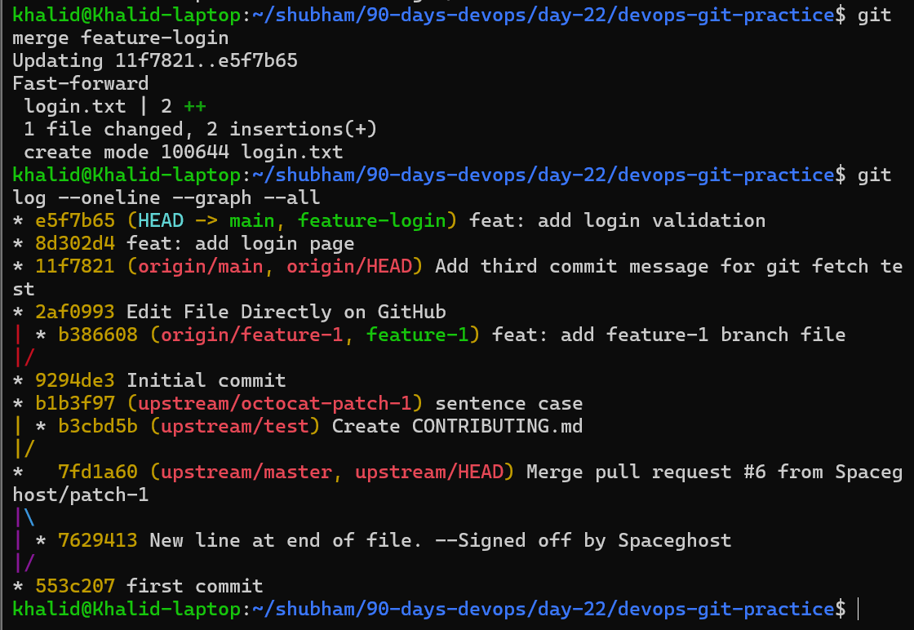


---

# What is a Merge Conflict?

A merge conflict happens when:

- two branches modify the same line
- Git cannot decide which version to keep automatically

Git stops the merge and asks the developer to resolve it manually.

---

## Intentional Merge Conflict Practice

---

# Step 28 — Create conflict-test Branch

```bash
git switch -c conflict-test
```

---

# Step 29 — Modify README.md in Branch

```bash
echo "This is branch version" >> README.md
```

---

# Step 30 — Stage README.md

```bash
git add README.md
```

---

# Step 31 — Commit Branch Change

```bash
git commit -m "modify README in branch"
```

---

# Step 32 — Switch Back to main

```bash
git switch main
```

---

# Step 33 — Modify README.md in main

```bash
echo "This is main version" >> README.md
```

---

# Step 34 — Stage README.md

```bash
git add README.md
```

---

# Step 35 — Commit Main Change

```bash
git commit -m "modify README in main"
```

---

# Step 36 — Merge conflict-test into main

```bash
git merge conflict-test
```

Output:

```text
CONFLICT (content): Merge conflict in README.md
Automatic merge failed
```

---

# What is Merge Conflict?

Merge conflict occurs when:

- same file edited in multiple branches
- Git cannot decide which change to keep

Git asks developer to resolve manually.

---

# How to Resolve Conflict

## Understanding Conflict Markers

Open README.md

You will see:

```text
<<<<<<< HEAD
This is main version
=======
This is branch version
>>>>>>> conflict-test
```
Meaning:

- upper section = current branch
- lower section = incoming branch

Developer must:

- manually edit file
- remove markers
- keep desired content

Edit file manually.

Example resolved version:

```text
This is main version
This is branch version
```

Then run:

```bash
git add README.md
git commit -m "resolve merge conflict"
```

---

# Important Git Commands Practiced

| Command | Purpose |
|---|---|
| git branch | view branches |
| git switch | switch branches |
| git switch -c | create new branch |
| git add | stage files |
| git commit | create commit |
| git merge | merge branches |
| git log --graph | visualize history |
| git status | check repository state |

---

# Final Understanding

This task demonstrated:

- branch creation
- feature development workflow
- fast-forward merge
- merge commits
- merge conflict handling
- Git history visualization

Key understanding:
```text
Git merges branches automatically when possible,
but asks for help when conflicts exist.
```

---

# Answers for Notes Section
## What is a fast-forward merge?

A fast-forward merge occurs when the target branch has no new commits and Git can simply move the branch pointer forward without creating a merge commit.

## When does Git create a merge commit instead?

Git creates a merge commit when both branches contain unique commits and their histories have diverged.

## What is a merge conflict?

A merge conflict occurs when Git cannot automatically combine changes because the same line of the same file was modified differently in multiple branches.


---

These workflows are essential in:

- DevOps
- GitHub collaboration
- CI/CD pipelines
- software team workflows

---

# Conclusion

Task 1 successfully covered advanced Git merge workflows from beginner to intermediate level using real hands-on practice.

---

# Task 2: Git Rebase Hands-On

# Overview

Task 2 introduces Git Rebase.

Rebase is used to:

- replay commits
- move commits onto another branch
- create cleaner Git history
- avoid unnecessary merge commits

This workflow is commonly used in:

- DevOps workflows
- GitHub collaboration
- CI/CD pipelines
- pull request cleanup
- software development teams

Unlike merge, rebase creates a:
```text
linear commit history
```
which makes history easier to read and maintain.

---

# Task 2 Objectives

After completing Task 2, the following concepts should be understood:

- how Git rebase works
- how commits are replayed
- difference between merge vs rebase
- how rebase changes history
- how to visualize rebased history
- when to use rebase
- why rebasing shared commits is dangerous

---

# Main Concepts Covered

| Concept          | Description                             |
| ---------------- | --------------------------------------- |
| Rebase           | Replay commits on top of another branch |
| Linear History   | Cleaner straight-line commit history    |
| Commit Rewriting | Rebase creates new commit hashes        |
| Rebase Conflict  | Conflict during commit replay           |
| History Cleanup  | Used before merging feature branches    |

---

# Rebase Workflow Summary

```text
main branch updated
        ↓
feature branch rebased onto main
        ↓
feature commits replayed on top
```

---

# Step 1 — Ensure Repository is Clean

```bash
git status
```
If it says you still have a merge conflict, finish or abort it.

To abort the conflict and return clean:

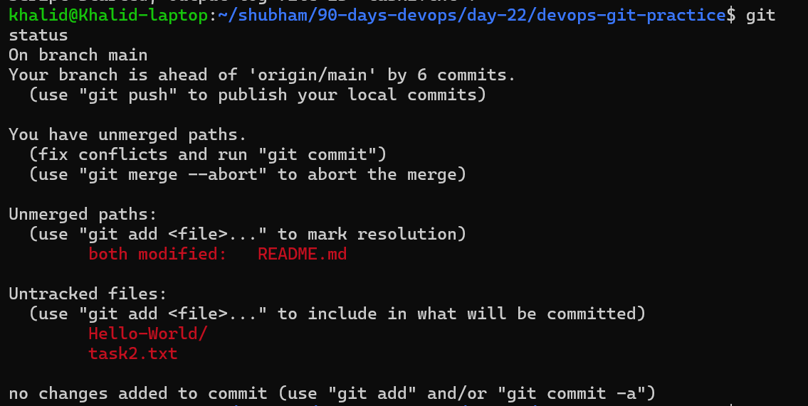

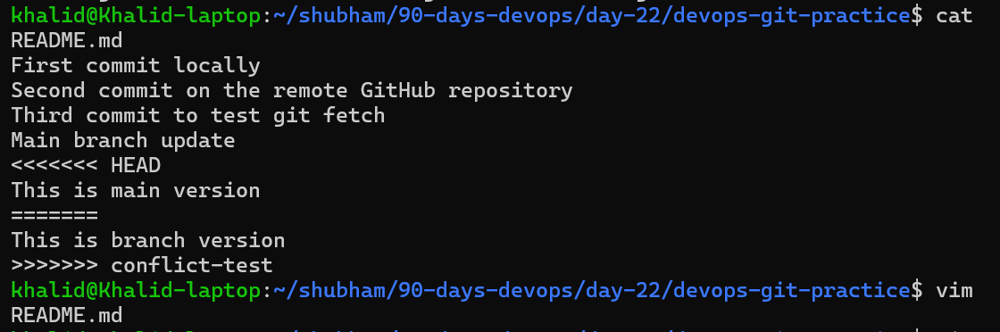

```bash
git merge --abort
```

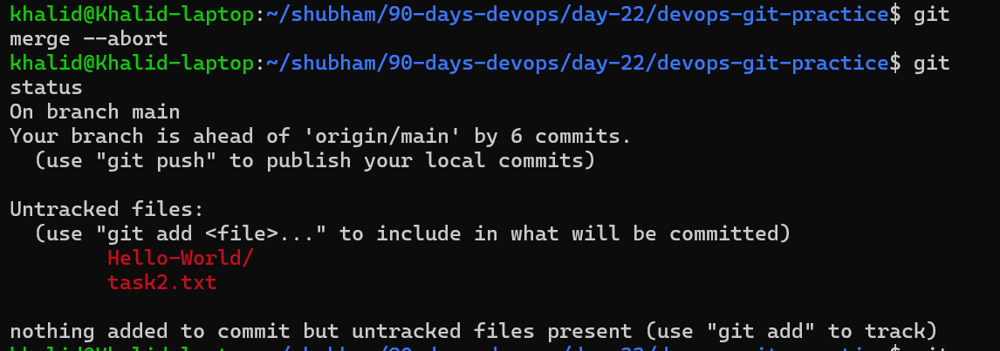

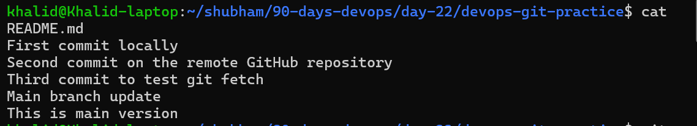

---

Then verify:
```bash
git status
git branch
```
Once clean, start Task 2:

# Step 2 — Switch to main

```bash
git switch main
```

---

# Step 3 — Create feature-dashboard Branch

```bash
git switch -c feature-dashboard
```

---

Create 3 commits:
```bash
echo "Dashboard layout created" > dashboard.txt
git add dashboard.txt
git commit -m "feat: add dashboard layout"

echo "Dashboard widgets added" >> dashboard.txt
git add dashboard.txt
git commit -m "feat: add dashboard widgets"

echo "Dashboard filters added" >> dashboard.txt
git add dashboard.txt
git commit -m "feat: add dashboard filters"
```


---

# Step 13 — Switch Back to main

```bash
git switch main
```

---

# Step 14 — Update README.md

```bash
echo "Main update before rebase" >> README.md
```

---

# Step 15 — Stage README.md

```bash
git add README.md
```

---

# Step 16 — Commit Main Update

```bash
git commit -m "docs: update README before rebase"
```

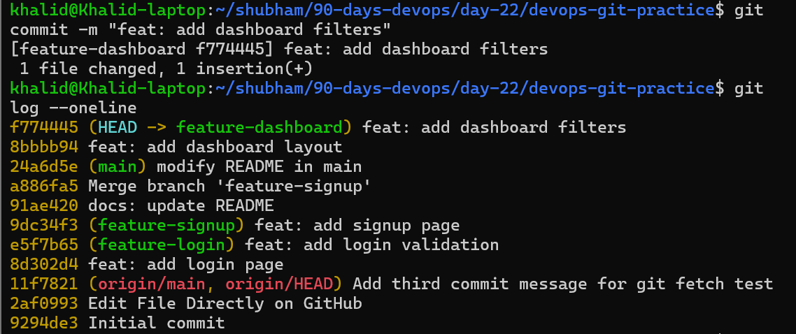

---

Now rebase

# Step 17 — Switch to feature-dashboard

```bash
git switch feature-dashboard
```

---

# Step 18 — Rebase feature-dashboard onto main

```bash
git rebase main
```

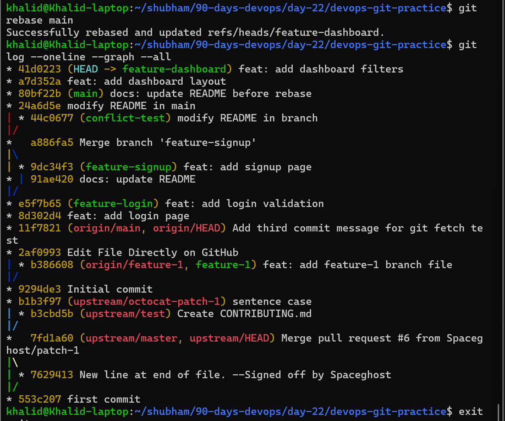

---

# What Does Rebase Actually Do?

Rebase:
- temporarily removes feature commits
- moves branch to latest main commit
- reapplies commits one by one

This creates clean linear history.

---

# Step 19 — Visualize Git History

```bash
git log --oneline --graph --all
```

---

# How is Rebase History Different From Merge?

## Merge History

```text
main ------
      \    \
       \----merge commit
```

Merge preserves branch structure.

---

## Rebase History

```text
main -------- feature commits
```

Rebase creates straight linear history.

---

# What Does Rebase Actually Do to Your Commits?
Rebase takes commits from the feature branch and replays them on top of the latest commit from another branch, usually `main`.

Rebase:
- replays commits
- creates new commit hashes
- places commits on top of another branch

---

# How is the history different from a merge?
Rebase creates a cleaner, straight-line history. Merge keeps the branch structure and may create a merge commit.

---

# Why Should You Never Rebase Shared Commits?

Because:
- rebase rewrites history
- commit hashes change
- collaborators may already have old commits

This can cause:
- conflicts
- duplicate commits
- collaboration problems

Safe rule:

```text
Rebase local commits only
```

---

# When Should You Use Rebase vs Merge?

## Use Rebase When:

- cleaning local history
- preparing pull requests
- maintaining linear history

## Use Merge When:

- combining shared branches
- preserving exact history
- collaborating in teams

---

# Important Commands Practiced

| Command | Purpose |
|---|---|
| git rebase main | replay commits |
| git log --graph | visualize history |
| git rebase --abort | cancel rebase |
| git rebase --continue | continue rebase |
| git switch | switch branches |

---

# Final Understanding

This task demonstrated:

- Git rebase workflow
- linear history creation
- merge vs rebase differences
- rewritten commit hashes
- professional Git history management

---

# Conclusion

Task 2 successfully covered Git Rebase hands-on practice using practical branch workflows.


---

# Day 24 — Task 3: Squash Commit vs Merge Commit

# Task 3 Overview

Task 3 compares:
```text
squash merge vs regular merge
```
You’ll learn how Git history changes when many small commits are combined into one commit versus preserved as separate commits.


Task 3 introduces the difference between squash merge and regular merge.

Squash merge combines multiple commits into one clean commit, while regular merge preserves complete branch history.

These workflows are commonly used in:
- GitHub pull requests
- DevOps workflows
- CI/CD pipelines
- software development teams

---

# Task 3 Objectives

After completing Task 3, you should understand:

- what squash merge does
- how squash merge affects history
- difference between squash merge and regular merge
- when to use squash merge
- trade-offs of squashing commits
- how Git history changes after merging

---

# Part A — Squash Merge Practice

# Step 1 — Switch to main

```bash
git switch main
```

# Step 2 — Verify Clean Repository

```bash
git status
```

# Step 3 — Create feature-profile Branch

```bash
git switch -c feature-profile
```
Add small commits:
step 4 to 15
```bash
echo "Profile page created" > profile.txt
git add profile.txt
git commit -m "feat: add profile page"

echo "Fix profile typo" >> profile.txt
git add profile.txt
git commit -m "fix: correct profile typo"

echo "Improve profile formatting" >> profile.txt
git add profile.txt
git commit -m "style: improve profile formatting"

echo "Add profile avatar section" >> profile.txt
git add profile.txt
git commit -m "feat: add profile avatar section"
```

# Step 16 — Switch Back to main
Switch back and squash merge:

```bash
git switch main
git merge --squash feature-profile
git status
git commit -m "feat: add profile feature"
```

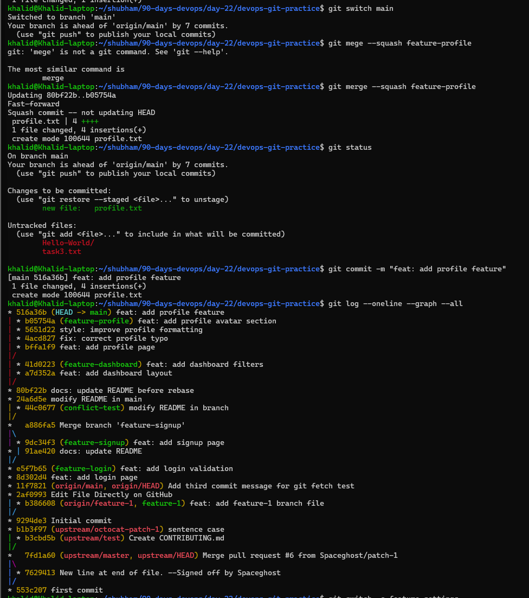


# Step 20 — Check Git History

```bash
git log --oneline --graph --all
```

Observation:

```text
Only one new commit appears on main branch.
```

---

# What Does Squash Merge Do?

Squash merge:
- combines all commits into one commit
- creates cleaner Git history
- removes unnecessary small commits

---

# Part B — Regular Merge Practice

# Step 21 — Create feature-settings Branch

```bash
git switch -c feature-settings
```
Add 3 commits

step 22 to 30
```bash
echo "Settings page created" > settings.txt
git add settings.txt
git commit -m "feat: add settings page"

echo "Add notification settings" >> settings.txt
git add settings.txt
git commit -m "feat: add notification settings"

echo "Add privacy settings" >> settings.txt
git add settings.txt
git commit -m "feat: add privacy settings"
```

Switch back and merge normally:

# Step 31 — Switch Back to main

```bash
git switch main
```

# Step 32 — Perform Regular Merge

```bash
git merge feature-settings
```

# Step 33 — check Git History

```bash
git log --oneline --graph --all
```

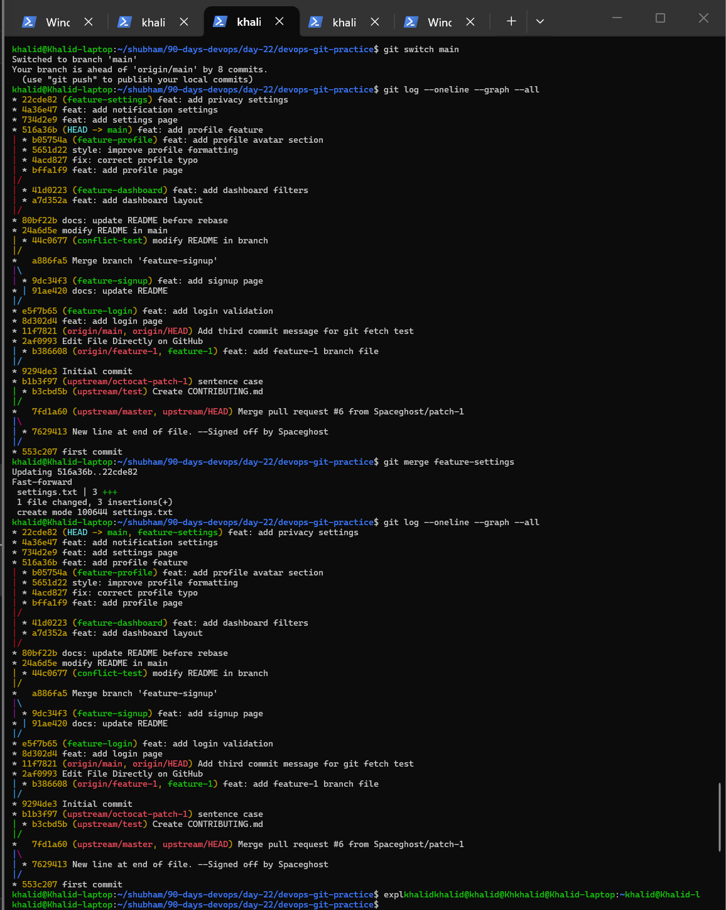


Observation:

```text
Regular merge keeps the individual commits from feature-settings.
All individual commits from feature-settings are preserved.
```

---

# Notes Answers

## What does squash merging do?

Squash merging combines all commits from a feature branch into one single commit on the target branch.

## When would you use squash merge vs regular merge?

Use squash merge when:
- feature branch contains many small commits
- you want cleaner history

Use regular merge when:
- detailed commit history matters
- team collaboration requires full tracking

## What is the trade-off of squashing?

Squashing creates cleaner history but removes detailed commit-by-commit history.

---

# Important Commands Practiced

| Command | Purpose |
|---|---|
| git merge --squash | squash merge branch |
| git merge | regular merge |
| git log --graph | visualize history |
| git switch | switch branches |

---

# Final Understanding

This task demonstrated:
- squash merge workflow
- regular merge workflow
- clean vs detailed history
- merge strategy comparison

---

## Task 3 Final Observation

For `feature-profile`, I used `git merge --squash feature-profile`.
Git combined all small profile commits into one commit on `main`:

- `feat: add profile feature`

For `feature-settings`, I used a regular merge:

```bash
git merge feature-settings
```
This was a fast-forward merge. Git kept all 3 commits from `feature-settings` on `main`:

- `feat: add settings page`
- `feat: add notification settings`
- `feat: add privacy settings`

This showed that squash merge creates one clean commit, while regular merge keeps the individual commits.

---

# Conclusion

Task 3 successfully covered squash merge vs regular merge using practical Git workflows.

---

# Task 4: Git Stash Hands-On

# Task 4 Overview

Task 4 introduces 
```text
Git Stash
```
Git stash is used to temporarily save unfinished work without creating a commit.

This is extremely useful when:
- switching tasks quickly
- handling urgent bug fixes
- changing branches temporarily
- pausing incomplete feature work

Instead of committing unfinished code, stash allows developers to safely store work-in-progress and restore it later.

---

# Task 4 Objectives

After completing Task 4, you should understand:

- how Git stash works
- how to temporarily save changes
- how to switch branches safely with unfinished work
- how to restore stashed changes
- difference between stash pop vs stash apply
- how multiple stashes are managed
- how stash is used in real-world workflows

---

# Main Concepts Covered

| Concept           | Description                          |
| ----------------- | ------------------------------------ |
| Git Stash         | Temporarily save uncommitted changes |
| Work-in-Progress  | Pause unfinished development         |
| Stash List        | View saved stashes                   |
| Stash Apply       | Restore stash without deleting       |
| Stash Pop         | Restore stash and remove it          |
| Context Switching | Move between urgent tasks            |


# Step 1 — Ensure Clean Repository

```bash
git status
```
Purpose:

- verify repository state before starting

---

# Step 2 — Start Unfinished Changes
Create temporary work:

```bash
echo "Temporary dashboard changes" >> dashboard.txt
```

Check status:

```bash
git status
```

Observation:

```text
dashboard.txt modified but not committed
```

---

# Step 3 — Try Switching Branches
Attempt branch switch:
```bash
git switch feature-login
```

Possible result:

```text
Git may prevent switching if changes would be overwritten.
```
This simulates real-world interruption during development.

---

Because dashboard.txt was a new untracked file, normal git stash did not save it.

I used `git stash push -u -m "dashboard work in progress"` to include untracked files.

`-u` means:

```text
include untracked files
```

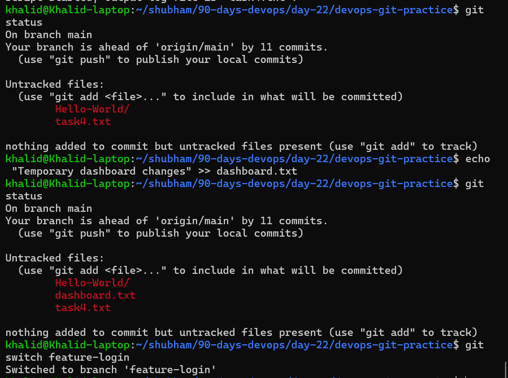

Also Git let you switch branches because the untracked file did not conflict with files on `feature-login`.


```bash
git switch main
```

Now stash the untracked file too:
```bash
git stash push -u -m "dashboard work in progress"
```
Check:
```bash
git status
```
Now `dashboard.txt` should disappear from status.

View stash:
```bash
git stash list
```

Output example:
```text
Saved working directory and index state
```
Purpose:

- temporarily save unfinished work
- clean working directory

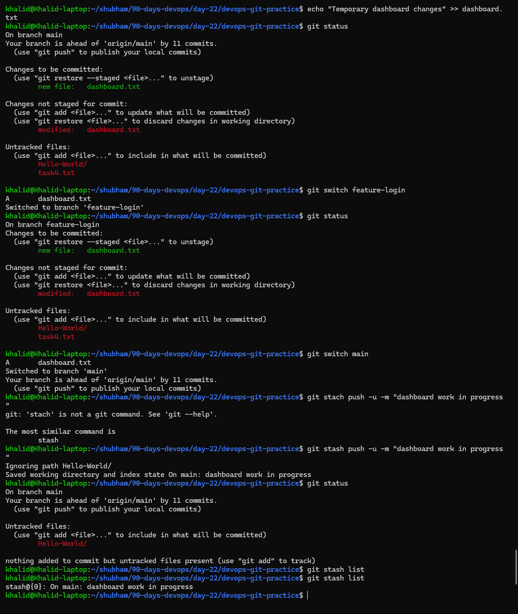

---

# Step 6 — Switch to Another Branch

```bash
git switch feature-login
```
Now you can safely work elsewhere.
Example:

---

# Step 7 — Simulate Other Work

```bash
echo "Hotfix update" >> login.txt
git add login.txt
git commit -m "fix: add urgent login hotfix"
```
Purpose:

- simulate urgent task handling

---

# Step 8 — Return to Previous Branch

```bash
git switch main
```

or

```bash
git switch feature-dashboard
```

---

# Step 9 — View Saved Stashes

```bash
git stash list
```

Example:

```text
stash@{0}: On main: dashboard work in progress
```

---

# Step 10 — Restore Stashed Changes
Using pop:

```bash
git stash pop
```

Purpose:
- restore changes
- remove stash entry automatically

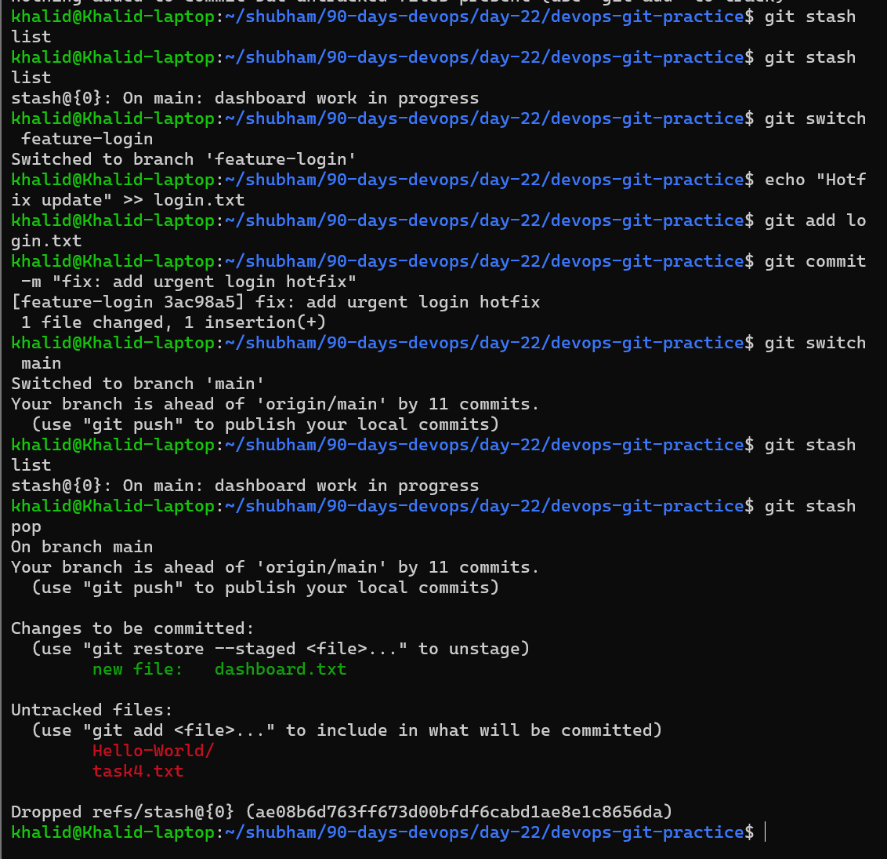

---

# Step 11 — Verify Restored Changes

```bash
git status
```
Observation:
```text
previous uncommitted changes restored
```

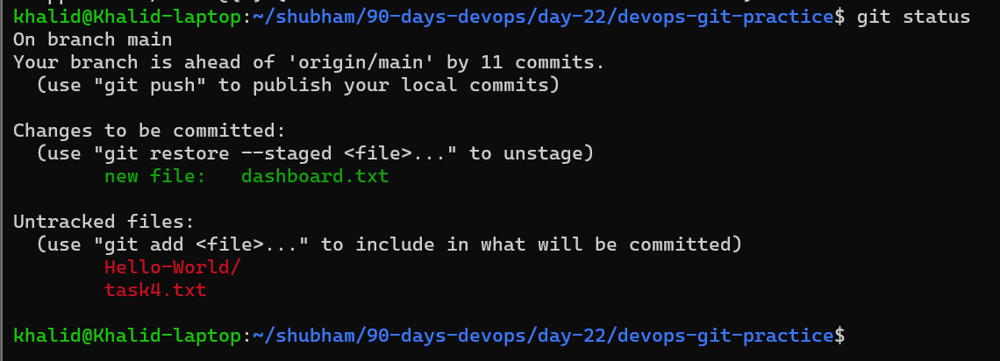

---

# Step 12 — Create Multiple Stashes
Example:
```bash
git stash push -m "first stash"
```

```bash
git stash push -m "second stash"
```

```bash
git stash push -m "third stash"
```

---

# Step 13 — View All Stashes

```bash
git stash list
```

Example:

```text
stash@{0}: third stash
stash@{1}: second stash
stash@{2}: first stash
```

---

# Step 14 — Apply Specific Stash

```bash
git stash apply stash@{1}
```
Purpose:

- restore selected stash
- keep stash entry saved in list
---

# What is Git Stash?

Git stash temporarily stores:

- modified files
- staged changes
- unfinished work

without creating a commit.

It acts like a temporary storage area for incomplete work.

---

# Difference Between git stash pop and git stash apply

## git stash pop
```text
Restore + Remove stash
```

- applies stashed changes
- deletes stash entry afterward

## git stash apply
```text
Restore + Keep stash
```

- applies stashed changes
- keeps stash entry in stash list

Useful when:

- reusing same stash multiple times
- testing changes safely

---

# Real-World Use Cases for Git Stash

Git stash is commonly used when:

- urgent production bug appears
- developer must quickly switch branches
- unfinished work should not be committed
- testing another feature temporarily
- pull latest changes without committing incomplete code

```text
Example workflow:

Working on Feature A
        ↓
Urgent Bug Appears
        ↓
git stash
        ↓
Switch Branch + Fix Bug
        ↓
Return and Restore Work
```
---

# Important Commands Practiced

| Command             | Purpose                  |
| ------------------- | ------------------------ |
| `git stash`         | save current changes     |
| `git stash push -m` | stash with message       |
| `git stash list`    | view stashes             |
| `git stash pop`     | restore and remove stash |
| `git stash apply`   | restore without deleting |
| `git switch`        | switch branches          |
| `git status`        | check repository state   |


---

# Final Understanding

This task demonstrated:

- temporary work storage
- safe context switching
- stash restoration
- multiple stash management
- real-world developer workflows

Git stash is one of the most practical Git tools for daily development work.

---

# Conclusion

Task 4 successfully covered Git stash workflows including saving unfinished work, restoring changes, handling multiple stashes, and real-world task switching scenarios.

---

# Day 24 — Task 5: Git Cherry-Pick Hands-On

# Task 5 Overview

Task 5 introduces
```text
Git Cherry-Pick
```
Cherry-pick allows developers to:
- copy a specific commit
- apply selected changes to another branch
- avoid merging the entire branch

This is useful when:
- only one bug fix is needed
- one commit must be moved to production
- specific changes should be reused
- full branch merge is unnecessary

Unlike merge or rebase, 
```text
cherry-pick copies individual commits 
```
instead of complete branch history.

---

# Task 5 Objectives

After completing Task 5, you should understand:

- how cherry-pick works
- how to copy specific commits
- how to find commit hashes
- how Git applies selected commits
- when cherry-pick is useful
- risks of cherry-picking

---

# Main Concepts Covered

| Concept                 | Description                |
| ----------------------- | -------------------------- |
| Cherry-Pick             | Copy selected commit       |
| Commit Hash             | Unique commit identifier   |
| Partial Change Transfer | Apply only desired changes |
| Hotfix Workflow         | Move urgent fixes quickly  |
| Duplicate Commits       | Possible cherry-pick issue |


---

# Step 1 — Switch to main

```bash
git switch main
```

Verify repository:

```bash
git status
```

---

# Step 2 — Create feature-hotfix Branch

```bash
git switch -c feature-hotfix
```
Purpose:

- create hotfix development branch

---

# Step 3 — Create First Commit

```bash
echo "Hotfix step 1" > hotfix.txt
git add hotfix.txt
git commit -m "fix: add hotfix step 1"
```

---

# Step 4 — Create Second Commit

```bash
echo "Critical production fix" >> hotfix.txt
git add hotfix.txt
git commit -m "fix: critical production bug"
```

---

# Step 5 — Create Third Commit

```bash
echo "Extra cleanup update" >> hotfix.txt
git add hotfix.txt
git commit -m "chore: cleanup hotfix"
```

---

# Step 6 — View Commit History

```bash
git log --oneline
```

```text
688ba52 (HEAD -> feature-hotfix) chore: cleanup hotfix
7109f3b fix: critical production bug
7389c91 fix: add hotfix step 1
22cde82 (main, feature-settings) feat: add privacy settings
```
Important:

Copy only the second commit hash.

```text
7109f3b
```
---

# Step 7 — Switch Back to main

```bash
git switch main
```

---

# Step 8 — Cherry-Pick Second Commit

```bash
git cherry-pick 7109f3b
```
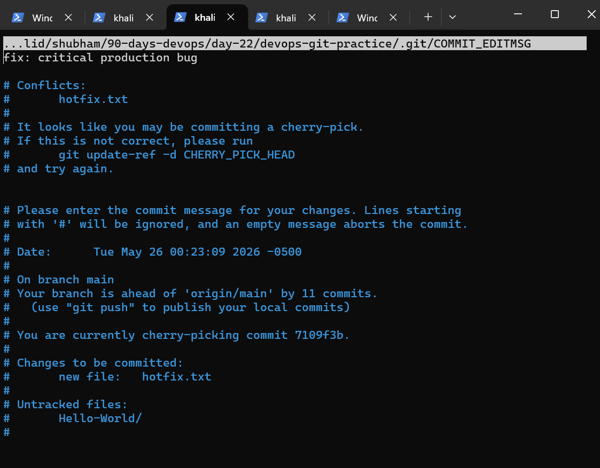

```text
Cherry-pick conflict resolved successfully
```
Git has opened the commit message editor for the cherry-pick commit.

The commit message is already correct:
```text
fix: critical production bug
```
After exiting, Git will finish:

```bash
git cherry-pick --continue
```

Replace:
- `7109f3b`
    with your actual commit hash.

Purpose:
- apply only one selected commit
- avoid merging full branch

---

# Step 9 — Verify Git History

```bash
git log --oneline --graph --all
```

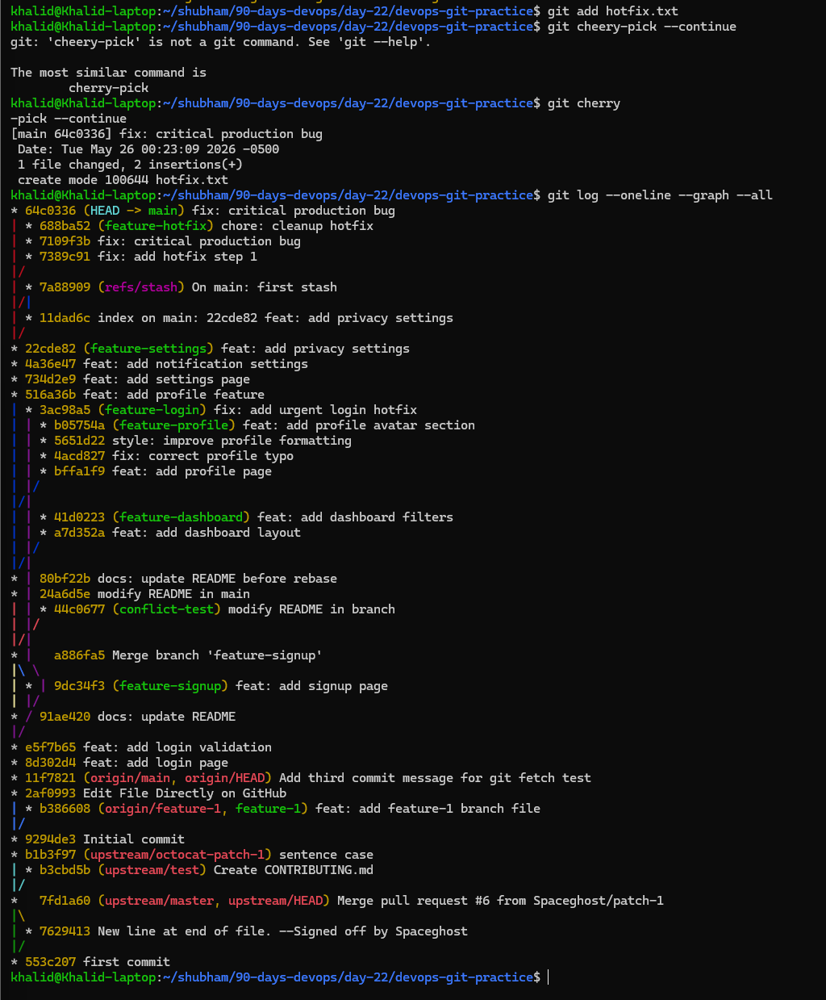


Your log proves:
```text
64c0336 (HEAD -> main) fix: critical production bug
```
was added to `main`.

And the original `feature-hotfix` branch still has all 3 commits:
```text
688ba52 chore: cleanup hotfix
7109f3b fix: critical production bug
7389c91 fix: add hotfix step 1
```
Important observation:
```text
Original commit: 7109f3b
Cherry-picked commit on main: 64c0336
```
That means cherry-pick copied the change and created a new commit hash on `main`.

## Task 5 Final Observation

I cherry-picked only the second commit from `feature-hotfix`:

```bash
git cherry-pick 7109f3b
```

A conflict happened because the second commit depended on the first commit that created `hotfix.txt`.

After resolving the conflict and continuing, Git created a new commit on main:

64c0336 fix: critical production bug

The original branch still kept all three commits, but main received only the selected cherry-picked change.

Observation:

```text
Only the selected commit appears on main.
```

---

# What Does Cherry-Pick Do?

Cherry-pick:
- copies a specific commit
- applies it onto another branch
- creates a new commit with same changes

It does not merge full branch history.

---

# Real-World Example

Example workflow:
```text

Production bug fixed on testing branch
        ↓
Only urgent fix needed in production
        ↓
Cherry-pick specific commit
        ↓
Avoid merging unfinished work
```

---

# When Would You Use Cherry-Pick?

Cherry-pick is useful when:
- only one fix is needed
- moving hotfixes to production
- copying useful commits between branches
- avoiding full branch merges
- backporting fixes to older versions

---

# What Can Go Wrong With Cherry-Picking?

Possible problems:
- merge conflicts
- duplicate commits
- inconsistent history
- dependency issues between commits

Example:

- selected commit may depend on earlier commits
- cherry-picking alone may break functionality

---

# Important Commands Practiced

| Command                  | Purpose              |
| ------------------------ | -------------------- |
| `git cherry-pick <hash>` | copy specific commit |
| `git log --oneline`      | view commit hashes   |
| `git log --graph`        | visualize history    |
| `git switch`             | switch branches      |
| `git commit`             | create commits       |


---

# Final Understanding

This task demonstrated:

- selective commit transfer
- hotfix workflows
- commit hash usage
- isolated change movement
- advanced Git branch management

Cherry-pick is extremely useful for production fixes and selective change management.

---

# Conclusion

Task 5 successfully covered Git cherry-pick workflows including selective commit application, commit history verification, and real-world hotfix scenarios.

---

# Day 24 Final Summary

Day 24 covered advanced Git workflows used in professional development environments.

I practiced:
- fast-forward merge
- merge commits
- merge conflicts
- rebase workflows
- squash merge
- stash operations
- cherry-pick workflows

I also learned how Git history changes depending on different workflows and how developers safely manage branches, hotfixes, and unfinished work in real-world projects.