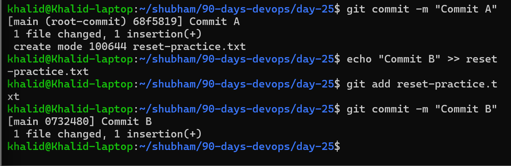
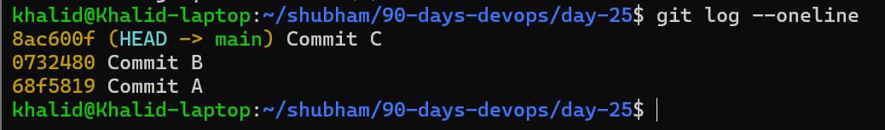
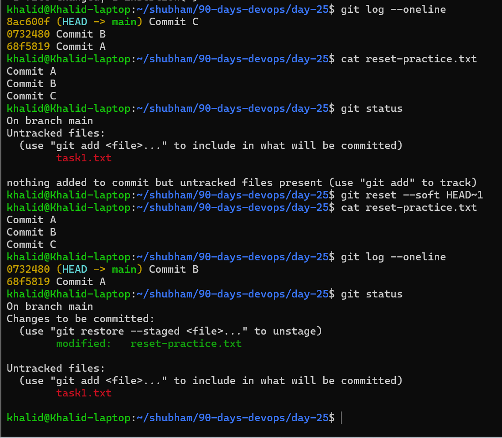
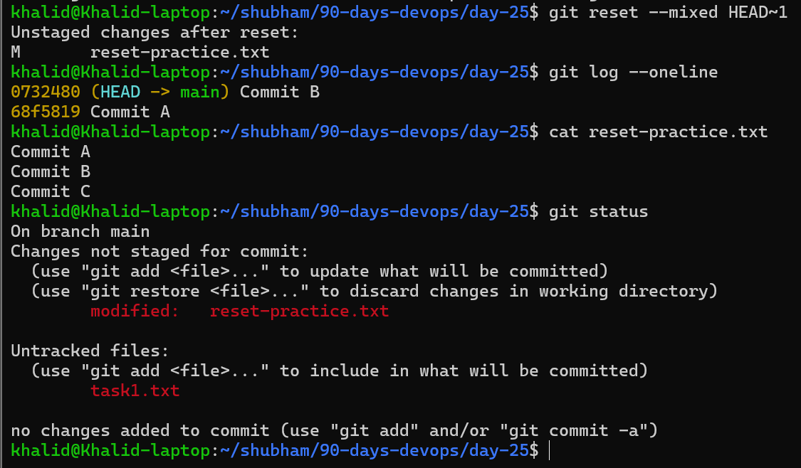
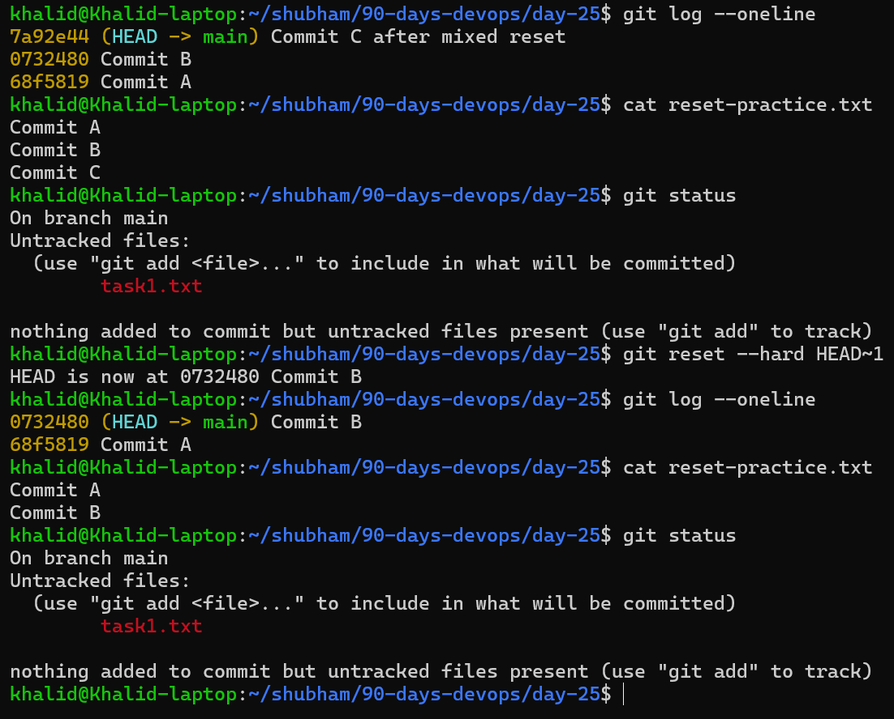
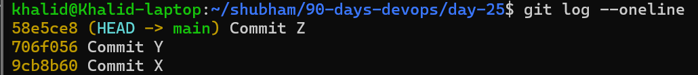
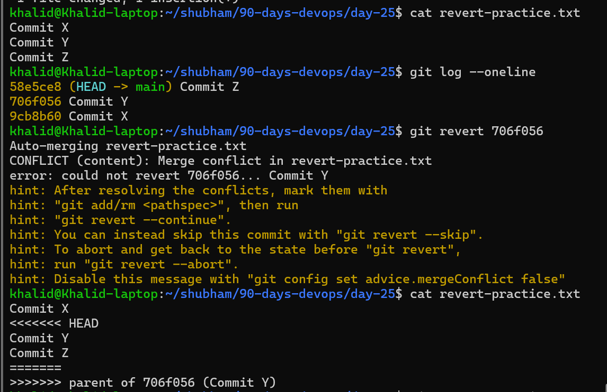
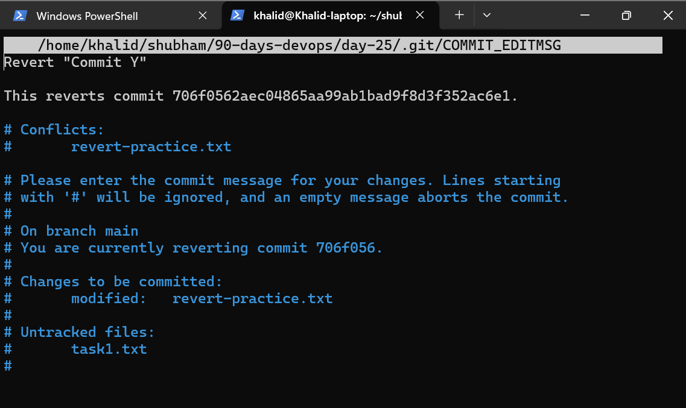
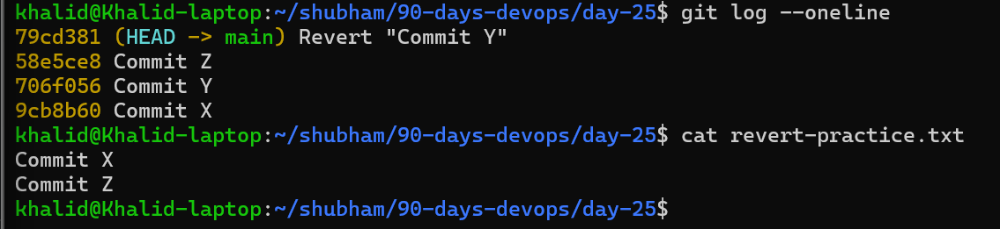

# Day 25 – Git Reset vs Revert & Branching Strategies

# Table of Contents

| Task | Summary | Quick Link |
|---|---|---|
| Day 25 Overview | Introduction to Git Reset, Revert, and Branching Strategies | [Go to Day 25 Overview](#day-25--git-reset-vs-revert--branching-strategies) |
| Task 1 – Git Reset | Practice `git reset --soft`, `--mixed`, and `--hard` and understand their differences | [Go to Task 1](#task-1-git-reset--hands-on) |
| Task 2 – Git Revert | Practice reverting commits safely and handling revert conflicts | [Go to Task 2](#task-2-git-revert--hands-on) |
| Task 3 – Reset vs Revert Summary | Compare `git reset` and `git revert` using tables and use cases | [Go to Task 3](#task-3-reset-vs-revert--summary) |
| Task 4 – Branching Strategies | Learn GitFlow, GitHub Flow, and Trunk-Based Development | [Go to Task 4](#task-4-branching-strategies) |
| Task 5 – Git Commands Reference | Update Git commands reference for Days 22–25 | [Go to Task 5](#task-5-git-commands-reference--days-2225) |
| GitFlow | Understand GitFlow branching model and release workflow | [Go to GitFlow](#1-gitflow) |
| GitHub Flow | Understand lightweight GitHub Flow workflow | [Go to GitHub Flow](#2-github-flow) |
| Trunk-Based Development | Learn continuous integration workflow with short-lived branches | [Go to Trunk-Based Development](#3-trunk-based-development) |
| Reset vs Revert Comparison | Quick comparison table for reset and revert commands | [Go to Reset vs Revert](#git-reset-vs-git-revert-comparison) |
| Helpful Recovery Command | Learn how `git reflog` helps recover lost commits | [Go to git reflog](#important-note) |

## Day 25 Overview

Today’s focus is learning how to safely undo mistakes in Git and understand how real engineering teams organize branches for collaboration.

Git mistakes are common: wrong commits, broken changes, accidental staging, or code committed to the wrong branch. The goal is to understand which undo command to use and when.

## Day 25 Objectives

By the end of this day, I should be able to:

- Understand the difference between `git reset` and `git revert`
- Use `git reset --soft`, `--mixed`, and `--hard`
- Know which reset option is destructive
- Understand when not to rewrite Git history
- Learn why `git reflog` is useful as a safety net
- Explore common branching strategies used by engineering teams

---

# Task 1: Git Reset — Hands-On

## Task Overview

In this task, I practiced using different types of `git reset` to undo commits. I created three commits: A, B, and C, then tested how Git behaves when resetting one commit back using `--soft`, `--mixed`, and `--hard`.

## Task Objectives

- Create multiple commits for testing
- Understand how `git reset --soft` affects commits and staging
- Understand how `git reset --mixed` affects commits and working directory
- Understand how `git reset --hard` affects commits and file changes
- Learn when each reset mode should be used safely

## Hands-On Steps

### Step 1: Create three commits

```bash
echo "Commit A" > reset-practice.txt
git add reset-practice.txt
git commit -m "Commit A"

echo "Commit B" >> reset-practice.txt
git add reset-practice.txt
git commit -m "Commit B"

echo "Commit C" >> reset-practice.txt
git add reset-practice.txt
git commit -m "Commit C"
```



[1st-commit-VS-2nd-commit](md/git-commit-output-explanation.md)

Check commit history:
```bash
git log --oneline
```




## git reset --soft

Command used:
```bash
git reset --soft HEAD~1
```
## What happened?

The latest commit was removed from commit history, but the changes from that commit stayed staged.

This means the commit was undone, but the changes were still ready to be committed again.

Check status:
```bash
git status
```
## Observation

`--soft` only moves the HEAD pointer back. It does not unstage or delete the changes.




## Re-commit
```bash
git commit -m "Commit C again after soft reset"
```

---

## git reset --mixed

Command used:
```bash
git reset --mixed HEAD~1
```

## What happened?

The latest commit was removed from commit history, and the changes became unstaged.

The changes were still present in the working directory, but they were no longer staged.

Check status:
```bash
git status
```




## Observation

`--mixed` moves HEAD back and unstages the changes, but it keeps the file changes.

## Re-stage and re-commit
```bash
git add reset-practice.txt
git commit -m "Commit C again after mixed reset"
```

---

## git reset --hard

Command used:
```bash
git reset --hard HEAD~1
```

## What happened?

The latest commit was removed from commit history, and the file changes from that commit were deleted from the working directory.

Check status:
```bash
git status
```




## Observation

`--hard` moves HEAD back, clears the staging area, and removes the working directory changes.

This is destructive because the changes disappear from the visible working tree.

---

# Answers
## What is the difference between --soft, --mixed, and --hard?

| Reset Type | Commit Removed? | Changes Staged? | Changes Kept in Working Directory? |
| ---------- | --------------: | --------------: | ---------------------------------: |
| `--soft`   |             Yes |             Yes |                                Yes |
| `--mixed`  |             Yes |              No |                                Yes |
| `--hard`   |             Yes |              No |                                 No |

## Which one is destructive and why?

`git reset --hard` is destructive because it removes the commit and also deletes the related changes from the working directory.

If those changes are not saved somewhere else, they can be lost. However, git reflog may help recover the previous commit if needed.

## When would you use each one?
Use `git reset --soft`

Use this when I want to undo a commit but keep all changes staged.

Example:
```bash
git reset --soft HEAD~1
```
Good for fixing a commit message or combining changes into a new commit.

**Use** `git reset --mixed`

Use this when I want to undo a commit and review the changes before staging again.

Example:
```bash
git reset --mixed HEAD~1
```
Good for reorganizing files before recommitting.

**Use** `git reset --hard`

Use this when I want to completely discard the latest commit and its changes.

Example:
```bash
git reset --hard HEAD~1
```
Good only when I am sure I do not need the changes anymore.

Uncommitted changes can be permanently lost after a hard reset if they are not recoverable through reflog.

## Should you ever use git reset on commits that are already pushed?

Usually, no.

Using `git reset` on pushed commits rewrites history. This can cause problems for other developers who already pulled the commits.

For pushed commits, `git revert` is safer because it creates a new commit that undoes the previous changes without rewriting history.

If reset is absolutely necessary on a pushed branch, it should only be done after team communication and with caution.

## Important Note

`git reflog` is useful because it records where HEAD has been. Even after a reset, I may be able to recover a lost commit using:
```bash
git reflog
```

---

# Task 2: Git Revert — Hands-On

## Task Overview

In this task, I practiced using `git revert` to undo a specific commit without removing it from history. I created three commits: X, Y, and Z, then reverted the middle commit Y.

## Task Objectives

- Create three new commits for revert practice
- Revert a middle commit safely
- Understand how `git revert` changes project history
- Compare `git revert` with `git reset`
- Learn why revert is safer for shared branches

---

## Hands-On Steps

### Step 1: Create three commits

```bash
echo "Commit X" > revert-practice.txt
git add revert-practice.txt
git commit -m "Commit X"

echo "Commit Y" >> revert-practice.txt
git add revert-practice.txt
git commit -m "Commit Y"

echo "Commit Z" >> revert-practice.txt
git add revert-practice.txt
git commit -m "Commit Z"
```

Check commit history:
```bash
git log --oneline
```


Then revert Commit Y:
```bash
git revert <commit-y-hash>
```
Example:
```bash
git revert 706f056
```




## What happened?

Git created a new commit that reversed the changes introduced by Commit Y.

Commit Y was not deleted. Instead, Git added another commit on top of the history to undo Y’s changes.



The conflict happened because Commit Z was created after Commit Y and modified the same file. Git needed manual confirmation about which changes to keep.

Just save and exit. (ctrl+x)

```bash
git add revert-practice.txt
git revert --continue
```

## Check Git Log
```bash
git log --oneline
```



The file now contains only Commit X and Commit Z, proving that Commit Y was successfully reverted.

### Is commit Y still in the history?

Yes, Commit Y is still visible in the Git history.

`git revert` does not remove old commits. It keeps history intact and adds a new commit that cancels out the selected commit.


# Answers
## How is git revert different from git reset?

`git reset` moves the branch pointer backward and can remove commits from visible history.

`git revert` does not remove commits. It creates a new commit that undoes the changes from a previous commit.

| Command      | What it does                         | History rewritten? | Safe for shared branches? |
| ------------ | ------------------------------------ | -----------------: | ------------------------: |
| `git reset`  | Moves HEAD back to a previous commit |                Yes |                Usually No |
| `git revert` | Creates a new commit to undo changes |                 No |                       Yes |

## Why is revert considered safer than reset for shared branches?

`git revert` is safer because it preserves commit history.

On shared branches, other developers may already have pulled the commits. If I use `git reset`, it rewrites history and can create conflicts or confusion for the team.

With `git revert`, everyone keeps the same history, and the undo action is clearly recorded as a new commit.

## When would you use revert vs reset?
### Use `git revert`

Use `git revert` when the commit has already been pushed or shared with others.

Example:
```bash
git revert <commit-hash>
```

Good for undoing changes on shared branches like `main`, `develop`, or team feature branches.

### Use `git reset`

Use reset when working locally and the commits have not been pushed yet.

Example:
```bash
git reset --soft HEAD~1
```
Good for cleaning up local commits, fixing mistakes, or reorganizing work before pushing.

## Observation

`git revert` is safer for team collaboration because it does not rewrite history. It keeps the original commit and adds a new commit that reverses the change.

This makes the project history easier to understand and safer for shared repositories.


Run this carefully for reverting middle commit:

```bash
git log --oneline
git revert <hash-of-Commit-Y>
git log --oneline
```

Be careful: reverting the middle commit may cause a conflict if commit Z depends on the same lines changed by Y.

---

# Task 3: Reset vs Revert — Summary

## Task Overview

In this task, I compared `git reset` and `git revert` to understand how each command behaves when undoing changes in Git.

Both commands can undo mistakes, but they work differently and are used in different situations.

## Task Objectives

- Compare `git reset` and `git revert`
- Understand how each command affects commit history
- Learn which command is safer for shared branches
- Identify the best use cases for reset and revert

---

# Git Reset vs Git Revert Comparison

| Feature | `git reset` | `git revert` |
|---|---|---|
| **What it does** | Moves HEAD to a previous commit and can remove commits from current history | Creates a new commit that undoes changes from an earlier commit |
| **Removes commit from history?** | Yes | No |
| **Safe for shared/pushed branches?** | Usually No | Yes |
| **Rewrites Git history?** | Yes | No |
| **Creates a new commit?** | No | Yes |
| **Best used when** | Working locally before pushing commits | Undoing changes on shared or pushed branches |
| **Can destroy uncommitted work?** | Yes, especially with `--hard` | No |
| **Common use case** | Cleaning up local commits or undoing mistakes before push | Safely undoing bad commits in team projects |

---

# Key Difference

`git reset` changes commit history by moving the branch pointer backward.

`git revert` preserves history and adds a new commit to reverse previous changes.

---

# Final Observation

- Use `git reset` for local cleanup and history rewriting before pushing.
- Use `git revert` when working with shared repositories and pushed commits.
- `git revert` is safer for collaboration because it does not rewrite Git history.
- `git reset --hard` should be used carefully because it can permanently remove changes.

---

# Task 4: Branching Strategies

[in roman Urdu](md/task4-branching-strategies-simple-roman-urdu.md)

## Task Overview

In this task, I researched common Git branching strategies used by engineering teams. Branching strategies help teams manage features, releases, bug fixes, and collaboration in a clean way.

## Task Objectives

- Understand GitFlow
- Understand GitHub Flow
- Understand Trunk-Based Development
- Compare when each strategy is useful
- Learn which strategy fits different team sizes and release styles

---

# 1. GitFlow

## How it works

GitFlow uses multiple long-lived branches such as `main` and `develop`, along with temporary branches like `feature`, `release`, and `hotfix`.

- `main` stores production-ready code
- `develop` stores ongoing development work
- `feature` branches are created from `develop`
- `release` branches prepare code for production
- `hotfix` branches fix urgent production issues

GitFlow is useful for projects with scheduled releases and versioned production deployments.

## Simple Flow

```txt
main:     A ----------- M ----------- H
             \         /             /
develop:      D ----- D ----- D -----
                \     \       \
feature:         F     F       F
release:               R -----/
hotfix:                         H
```

## When/where it is used

GitFlow is commonly used in large teams, enterprise projects, and products with planned release cycles.

## Pros

- Clear separation between development and production
- Good for scheduled releases
- Supports hotfixes for production issues
- Organized for large teams

## Cons

- More complex than other workflows
- Many branches to manage
- Slower for teams shipping frequently
- Can create merge conflicts if branches live too long

---

# 2. GitHub Flow

## How it works

GitHub Flow is simpler. It usually has one main branch and short-lived feature branches.

The `main` branch should always be deployable. Developers create a branch from `main`, make changes, open a pull request, review the code, and merge back into `main`.

## Simple Flow

```txt
main:     A ---- B ---- C ---- D
            \        /
feature:     F ---- F
```

## When/where it is used

GitHub Flow is commonly used by startups, web applications, SaaS teams, and projects that deploy frequently.

## Pros

- Simple and easy to understand
- Fast development workflow
- Good for continuous deployment
- Pull requests make review easy

## Cons

- Less structured for scheduled releases
- Requires strong testing and CI/CD
- Main branch must stay stable
- Not ideal if multiple release versions are maintained

---

# 3. Trunk-Based Development

## How it works

Trunk-Based Development uses one main branch, often called `main` or `trunk`. Developers commit directly to it or use very short-lived branches.

The goal is to integrate small changes frequently instead of keeping large feature branches open for a long time.

## Simple Flow

```txt
main/trunk:  A -- B -- C -- D -- E -- F
              \_/ \_/ \_/
             small short-lived branches
```

## When/where it is used

Trunk-Based Development is used by teams practicing CI/CD, DevOps, and fast software delivery.

## Pros

- Very fast integration
- Reduces long-running merge conflicts
- Works well with CI/CD pipelines
- Encourages small, frequent commits

## Cons

- Requires strong automated testing
- Needs discipline from developers
- Feature flags may be needed for incomplete work
- Risky if main branch is not protected

---

# Answers

## Which strategy would you use for a startup shipping fast?

For a startup shipping fast, I would use **GitHub Flow**.

Reason: It is simple, lightweight, and works well with frequent deployments. Developers can create feature branches, open pull requests, review changes, and merge quickly into `main`.

## Which strategy would you use for a large team with scheduled releases?

For a large team with scheduled releases, I would use **GitFlow**.

Reason: GitFlow has separate branches for development, releases, and hotfixes. This makes it better for planned release cycles and larger teams.

## Which one does your favorite open-source project use?

Example: Kubernetes

Kubernetes uses a `main` development branch and separate release branches for different versions. This is closer to a release-branch workflow used by large open-source projects.

## Final Observation

- GitFlow is best for structured releases.
- GitHub Flow is best for simple and fast delivery.
- Trunk-Based Development is best for CI/CD and frequent integration.
- The best branching strategy depends on team size, release speed, and project complexity.

---

# Task 5: Git Commands Reference – Days 22–25

## 1. Setup & Config

```bash
git --version
git config --global user.name "Your Name"
git config --global user.email "your-email@example.com"
git config --global --list
git config --global init.defaultBranch main
```

| Command | Purpose |
|---|---|
| `git --version` | Check installed Git version |
| `git config --global user.name` | Set Git username |
| `git config --global user.email` | Set Git email |
| `git config --global --list` | View Git configuration |
| `git config --global init.defaultBranch main` | Set default branch name to main |

---

## 2. Basic Workflow

```bash
git init
git status
git add file.txt
git add .
git commit -m "message"
git log
git log --oneline
git diff
git diff --staged
```

| Command | Purpose |
|---|---|
| `git init` | Initialize a Git repository |
| `git status` | Check working tree status |
| `git add file.txt` | Stage a specific file |
| `git add .` | Stage all changes |
| `git commit -m "message"` | Commit staged changes |
| `git log` | View commit history |
| `git log --oneline` | View short commit history |
| `git diff` | See unstaged changes |
| `git diff --staged` | See staged changes |

---

## 3. Branching

```bash
git branch
git branch feature-login
git checkout feature-login
git checkout -b feature-login
git switch feature-login
git switch -c feature-login
git branch -d feature-login
git branch -m main
```

| Command | Purpose |
|---|---|
| `git branch` | List branches |
| `git branch branch-name` | Create a new branch |
| `git checkout branch-name` | Switch to a branch |
| `git checkout -b branch-name` | Create and switch to a branch |
| `git switch branch-name` | Switch to a branch |
| `git switch -c branch-name` | Create and switch to a branch |
| `git branch -d branch-name` | Delete a merged branch |
| `git branch -m main` | Rename current branch to main |

---

## 4. Remote Commands

```bash
git clone <repo-url>
git remote -v
git remote add origin <repo-url>
git push origin main
git push -u origin main
git pull origin main
git fetch origin
```

| Command | Purpose |
|---|---|
| `git clone <repo-url>` | Copy a remote repository locally |
| `git remote -v` | View connected remotes |
| `git remote add origin <repo-url>` | Add remote repository |
| `git push origin main` | Push commits to remote |
| `git push -u origin main` | Push and set upstream |
| `git pull origin main` | Fetch and merge remote changes |
| `git fetch origin` | Download remote changes without merging |

### Fork

A fork is a personal copy of someone else’s repository on GitHub.

Common fork workflow:

```bash
git clone <fork-url>
git remote add upstream <original-repo-url>
git fetch upstream
git merge upstream/main
git push origin main
```

---

## 5. Merging & Rebasing

### Merge

```bash
git switch main
git merge feature-branch
```

`git merge` combines changes from another branch into the current branch.

### Rebase

```bash
git switch feature-branch
git rebase main
```

`git rebase` moves commits from one branch and replays them on top of another branch.

| Command | Purpose |
|---|---|
| `git merge branch-name` | Merge another branch into current branch |
| `git rebase branch-name` | Reapply commits on top of another branch |
| `git merge --abort` | Cancel a merge conflict |
| `git rebase --abort` | Cancel a rebase conflict |
| `git rebase --continue` | Continue rebase after resolving conflict |

---

## 6. Stash & Cherry Pick

### Git Stash

```bash
git stash
git stash list
git stash apply
git stash pop
git stash drop
git stash clear
```

| Command | Purpose |
|---|---|
| `git stash` | Temporarily save uncommitted changes |
| `git stash list` | View saved stashes |
| `git stash apply` | Apply latest stash but keep it in stash list |
| `git stash pop` | Apply latest stash and remove it from stash list |
| `git stash drop` | Delete latest stash |
| `git stash clear` | Delete all stashes |

### Git Cherry Pick

```bash
git cherry-pick <commit-hash>
```

`git cherry-pick` applies a specific commit from one branch onto another branch.

Useful when I want only one commit instead of merging the whole branch.

---

## 7. Reset & Revert

### Git Reset

```bash
git reset --soft HEAD~1
git reset --mixed HEAD~1
git reset --hard HEAD~1
```

| Command | What it does |
|---|---|
| `git reset --soft HEAD~1` | Removes latest commit but keeps changes staged |
| `git reset --mixed HEAD~1` | Removes latest commit and unstages changes |
| `git reset --hard HEAD~1` | Removes latest commit and deletes changes from working directory |

`git reset --hard` is destructive because it can remove changes from the working directory.

### Git Revert

```bash
git revert <commit-hash>
```

`git revert` creates a new commit that undoes changes from an earlier commit.

It is safer for shared branches because it does not rewrite commit history.

### Reset vs Revert

| Feature | `git reset` | `git revert` |
|---|---|---|
| What it does | Moves HEAD back to an earlier commit | Creates a new commit that undoes an old commit |
| Removes commit from history? | Yes | No |
| Rewrites history? | Yes | No |
| Safe for pushed/shared branches? | Usually No | Yes |
| Best use case | Local cleanup before push | Undoing pushed commits safely |

---

## 8. Helpful Recovery Command

```bash
git reflog
```

`git reflog` shows where HEAD has been. It can help recover commits after reset mistakes.

