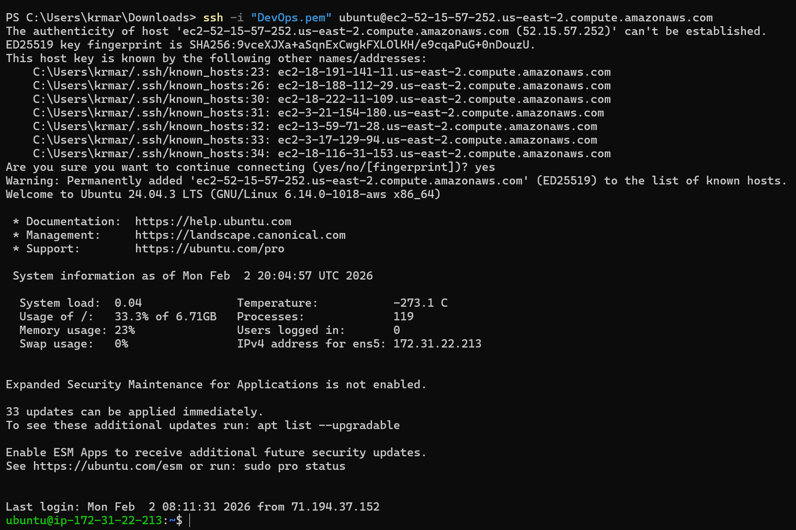
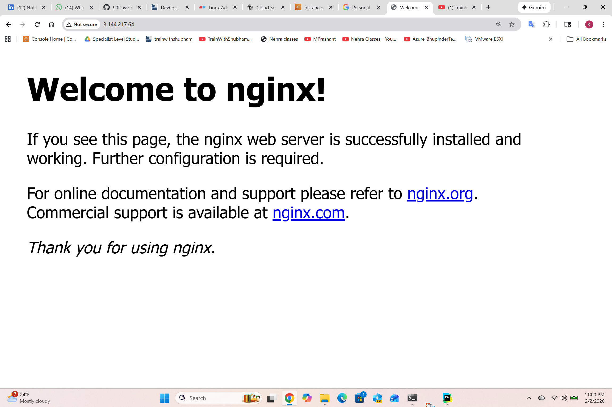

# Day 08 – Cloud Server Setup: Docker, Nginx & Web Deployment

## Server Details
- Provider: AWS EC2 
- OS: Ubuntu (version: Ubuntu 24.04.3 LTS)
- Instance Public IP: 52.15.57.252

---

## Commands Used

### Connect via SSH
- AWS:
  - `1- Open an SSH client.`
  - `2- Locate your private key file. The key used to launch this instance is DevOps.pem`
  - `3- Run this command, if necessary, to ensure your key is not publicly viewable.`
  ```bash
  chmod 400 "DevOps.pem"
  ```
  - `4- Connect to your instance using its Public DNS:`
  ```text
  ec2-52-15-57-252.us-east-2.compute.amazonaws.com
  ```
  #### Example:
  ```bash
  ssh -i "DevOps.pem" ubuntu@ec2-52-15-57-252.us-east-2.compute.amazonaws.com
  ```
#### Check SSH Service:
```bash
ssh
```
```bash
ssh -i "DevOps.pem" ubuntu@ec2-52-15-57-252.us-east-2.compute.amazonaws.com
```
## SSH Connection Screenshot

``
### System Update
- `sudo apt update -y`
- `sudo apt upgrade -y`
---
## Security Group / Firewall Configuration
- Enabled inbound rules:
  - SSH (22) from my IP
  - HTTP (80) from 0.0.0.0/0
- Verified web access:
  - Visited `http://<pub-ip>` and confirmed Nginx welcome page loads.
### Install & Verify Nginx
- `sudo apt install -y nginx`
- `sudo systemctl enable --now nginx`
- `sudo systemctl status nginx`
- `sudo nginx -t`
- `curl -I http://localhost`
```text
ubuntu@ip-172-31-22-213:~$ curl -I http://localhost
HTTP/1.1 200 OK
Server: nginx/1.24.0 (Ubuntu)
Date: Tue, 03 Feb 2026 04:47:45 GMT
Content-Type: text/html
Content-Length: 615
Last-Modified: Sun, 01 Feb 2026 18:02:11 GMT
Connection: keep-alive
ETag: "697f9523-267"
Accept-Ranges: bytes

ubuntu@ip-172-31-22-213:~$
```
## Nginx Welcome Page


## Install Docker and Verify.
- `sudo apt install -y docker.io`
- `sudo systemctl enable --now docker`
- `docker --version`
### Allow ubuntu user to run docker without sudo:
```bash
sudo usermod -aG docker $USER
newgrp docker
```


### Logs Extraction
- `sudo tail -n 20 /var/log/nginx/access.log`
- `sudo tail -n 20 /var/log/nginx/error.log`
- Create log file:
  - `sudo bash -c '{ echo "===== ACCESS LOG (last 20 lines) ====="; tail -n 20 /var/log/nginx/access.log; echo ""; echo "===== ERROR LOG (last 20 lines) ====="; tail -n 20 /var/log/nginx/error.log; } > /home/$SUDO_USER/nginx-logs.txt'`
- Verify:
  - `head -n 20 ~/nginx-logs.txt`
  - `tail -n 20 ~/nginx-logs.txt`

### Download Logs to Local
#### Create a downloads folder
#### - Step 1: Create folder inside web root
```bash
sudo mkdir /var/www/html/downloads
```
#### - Step 2: Copy file into it
```bash
sudo cp nginx-logs.txt /var/www/html/downloads/
```
#### - Step 3: Access it
```bash
http://3.144.217.64/downloads/nginx-logs.txt
```
  - Since the file is open in the browser:
  - Right-click anywhere on the page
  - Click “Save As…”

---

## Screenshots Captured
1. SSH connection to server (terminal)
2. Nginx welcome page accessible from browser using public IP
3. Log file contents shown in terminal (`nginx-logs.txt`)

---

## Challenges Faced
- Initially attempted to access the Nginx page using HTTPS instead of HTTP.
- Realized that Nginx was configured to serve traffic on port 80 using HTTP.
- Resolved the issue by accessing the service via `http://<public-ip>`, after which the Nginx welcome page loaded successfully.

---

## What I Learned
- How to provision a cloud VM and connect securely via SSH
- How to install and manage services using `systemctl`
- How security groups/firewalls control public access to ports like 80/22
- Where Nginx stores access/error logs and how to extract them for debugging

- How to expose and download static files using Nginx for verification purposes

