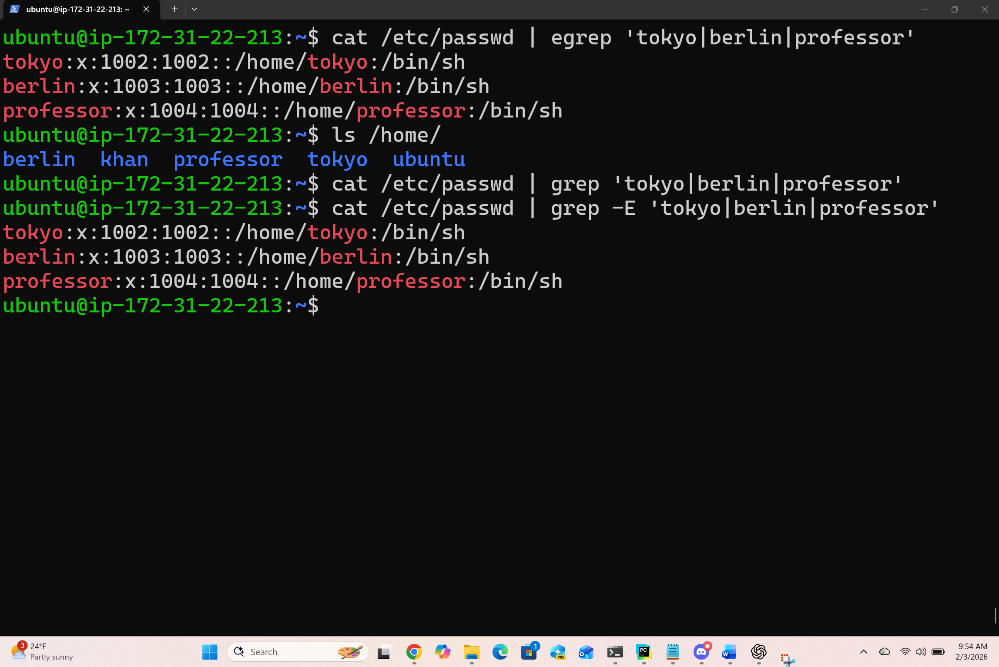
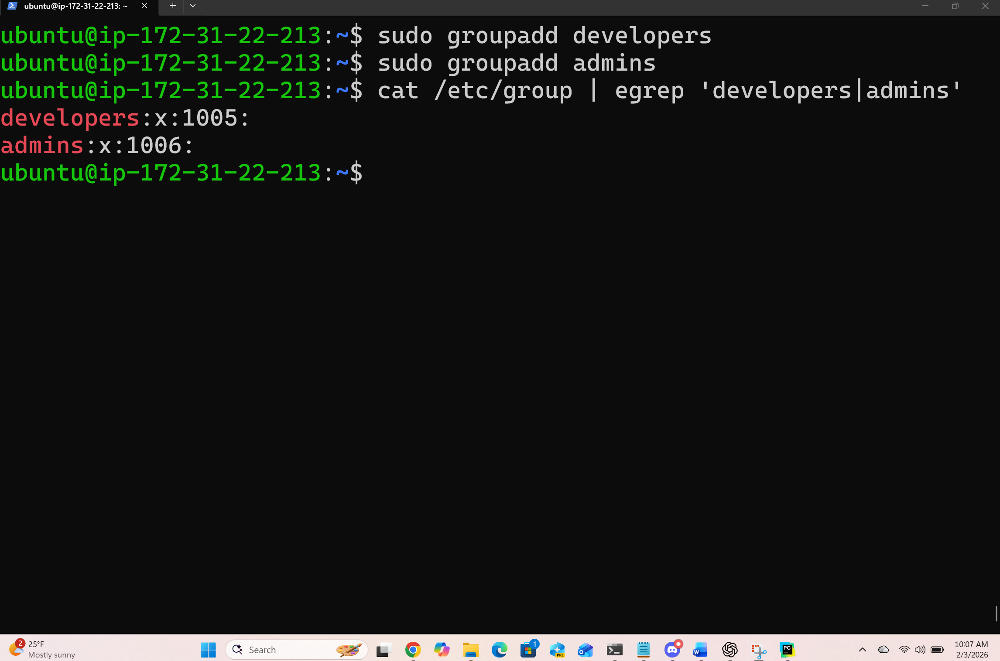
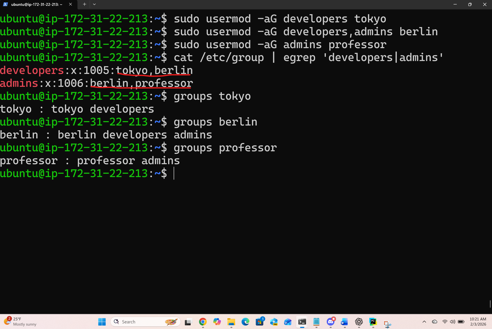

# Day 09 Challenge – Linux User & Group Management

## Users & Groups Created
- Users: tokyo, berlin, professor
- Groups: developers, admins, project-team

### Task 1: Create Users
Create Users with home directories:
```bash
sudo useradd -m tokyo
sudo useradd -m berlin
sudo useradd -m professor
```
Set passwords(passwd):
```bash
sudo passwd tokyo
sudo passwd berlin
sudo passwd professor
echo "tokyo:abc" | sudo chpasswd [for Ubuntu]
sudo echo "passwd" | passwd --stdn tokyo [for RHEL]
```
Verify users:
```bash
cat /etc/passwd | grep -E 'tokyo|berlin|professor'
ls /home/
```
#### Users' Verification Screenshot

---
## Group Assignments
- tokyo → developers, project-team
- berlin → developers, admins
- professor → admins

Task 2: Create Groups
```bash

```
```bash
sudo groupadd developers
sudo groupadd admins
```
#### Groups' Verification Screenshot


Task 3: Assign Users to Groups
- Assign group memberships
```bash
sudo usermod -aG developers tokyo
sudo usermod -aG developers,admins berlin
sudo usermod -aG admins professor
sudo usermod -aG project-team tokyo
```

## Directories Created
- /opt/dev-project → group: developers, permissions: 775
- /opt/team-workspace → group: project-team, permissions: 775

Task 4: Shared Directory (/opt/dev-project)
- Create directory
```bash
sudo mkdir /opt/dev-project
```
Set group owner
```bash
sudo chgrp developers /opt/dev-project
```
```text
ubuntu@ip-172-31-22-213:~$ ls -ld /opt/dev-project
drwxr-xr-x 2 root root 4096 Feb  3 16:26 /opt/dev-project
ubuntu@ip-172-31-22-213:~$ sudo chgrp developers /opt/dev-project
ubuntu@ip-172-31-22-213:~$ ls -ld /opt/dev-project
drwxr-xr-x 2 root developers 4096 Feb  3 16:26 /opt/dev-project
ubuntu@ip-172-31-22-213:~$
```
Set permissions (775)
```bash
sudo chmod 775 /opt/dev-project
```
```text
ubuntu@ip-172-31-22-213:~$ ls -ld /opt/dev-project
drwxr-xr-x 2 root developers 4096 Feb  3 16:26 /opt/dev-project
ubuntu@ip-172-31-22-213:~$ sudo chmod 775 /opt/dev-project
ubuntu@ip-172-31-22-213:~$ ls -ld /opt/dev-project
drwxrwxr-x 2 root developers 4096 Feb  3 16:26 /opt/dev-project
ubuntu@ip-172-31-22-213:~$
```
Test as users
```bash
sudo -u tokyo touch /opt/dev-project/tokyo.txt
sudo -u berlin touch /opt/dev-project/berlin.txt
```
```text
ubuntu@ip-172-31-22-213:~$ sudo -u tokyo touch /opt/dev-project/tokyo.txt
ubuntu@ip-172-31-22-213:~$ sudo -u berlin touch /opt/dev-project/berlin.txt
ubuntu@ip-172-31-22-213:~$ ls -l /opt/dev-project
total 0
-rw-rw-r-- 1 berlin berlin 0 Feb  3 16:40 berlin.txt
-rw-rw-r-- 1 tokyo  tokyo  0 Feb  3 16:40 tokyo.txt
ubuntu@ip-172-31-22-213:~$
```
Task 5: Team Workspace
- Create user & group
```bash
sudo groupadd project-team
sudo useradd -mG project-team nairobi
sudo passwd nairobi
sudo usermod -aG project-team tokyo
```
```text
ubuntu@ip-172-31-22-213:~$ cat /etc/group/ | grep project-team
cat: /etc/group/: Not a directory
ubuntu@ip-172-31-22-213:~$ cat /etc/group | grep 'project-team'
project-team:x:1007:nairobi
ubuntu@ip-172-31-22-213:~$ sudo usermod -aG project-team tokyo
ubuntu@ip-172-31-22-213:~$ cat /etc/group | grep 'project-team'
project-team:x:1007:nairobi,tokyo
```
Create directory
```bash
sudo mkdir /opt/team-workspace
sudo chgrp project-team /opt/team-workspace
sudo chmod 775 /opt/team-workspace
```
Verify
```bash
ls -ld /opt/team-workspace
cat /etc/group | grep project-team
```
```text
ubuntu@ip-172-31-22-213:~$ ls -ld /opt/team-workspace
drwxrwxr-x 2 root project-team 4096 Feb  3 17:03 /opt/team-workspace
ubuntu@ip-172-31-22-213:~$ cat /etc/group | grep project-team
project-team:x:1007:nairobi,tokyo
```

Test file creation
```bash
sudo -u nairobi touch /opt/team-workspace/nairobi.txt
ls -l /opt/team-workspace
```
```text
ubuntu@ip-172-31-22-213:~$ sudo chmod 775 /opt/team-workspace
ubuntu@ip-172-31-22-213:~$ sudo -u nairobi touch /opt/team-workspace/nairobi.txt
ubuntu@ip-172-31-22-213:~$ ls -l /opt/team-workspace
total 0
-rw-rw-r-- 1 nairobi nairobi 0 Feb  3 17:10 nairobi.txt
```

## Commands Used
- useradd -m
- passwd
- groupadd
- usermod -aG
- mkdir
- chgrp
- chmod
- groups
- sudo -u

## What I Learned
1. Groups control shared directory access in Linux.
2. chmod 775 allows group collaboration while restricting others.
3. sudo -u is useful for testing permissions without logging in.
