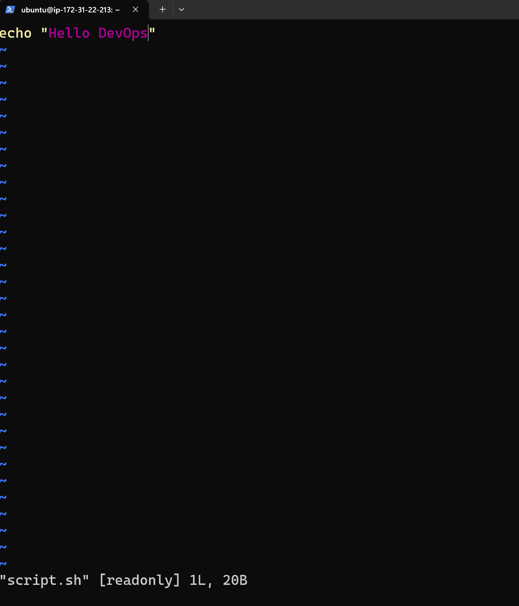

# Day 10 – File Permissions & File Operations Challenge

## Goal
Practice creating/reading files and understanding/modifying Linux permissions using:
- `touch`, `cat`, `echo`, `vim`
- `ls -l`
- `chmod`
- `head`, `tail`

---

## Task 1: Create Files

### 1) Create empty file `devops.txt`
```bash
touch devops.txt
ls
```
```text
ubuntu@ip-172-31-22-213:~$ touch devops.txt
ubuntu@ip-172-31-22-213:~$ ls -l
total 8
-rw-rw-r-- 1 ubuntu ubuntu    0 Feb  3 18:28 devops.txt
-rw-r--r-- 1 root   root   1068 Feb  3 05:43 nginx-logs.txt
-rw-rw-r-- 1 ubuntu ubuntu   30 Feb  2 05:30 notes.txt
```
### 2) Create notes.txt with content:
  - Using cat:
```bash
cat > notes.txt << 'EOF'
These are my DevOps notes for Day 10.
Learning file permissions and operations.
EOF
```
```text
ubuntu@ip-172-31-22-213:~$ cat > notes.txt << 'EOF'
These are my DevOps notes for Day 10.
Learning file permissions and operations.
EOF
ubuntu@ip-172-31-22-213:~$ cat notes.txt
These are my DevOps notes for Day 10.
Learning file permissions and operations.
ubuntu@ip-172-31-22-213:~$
```
### 3) Create script.sh using vim
```bash
vim script.sh
cat script.sh
ls -l
```
```text
echo "Hello DevOps"
total 12
-rw-rw-r-- 1 ubuntu ubuntu    0 Feb  3 18:28 devops.txt
-rw-r--r-- 1 root   root   1068 Feb  3 05:43 nginx-logs.txt
-rw-rw-r-- 1 ubuntu ubuntu   80 Feb  3 19:09 notes.txt
-rw-rw-r-- 1 ubuntu ubuntu   20 Feb  3 19:16 script.sh
```
---

## Task 2: Read Files
1. Read notes.txt using cat
```bash
cat notes.txt
```
```text
ubuntu@ip-172-31-22-213:~$ cat notes.txt
These are my DevOps notes for Day 10.
Learning file permissions and operations.
ubuntu@ip-172-31-22-213:~$
```
2.View script.sh in vim read-only mode
```bash
vim -R script.sh
```

``

3.Display first 5 lines of /etc/passwd 
```bash
head -n 5 /etc/passwd
```
```text
ubuntu@ip-172-31-22-213:~$ head -n 5 /etc/passwd
root:x:0:0:root:/root:/bin/bash
daemon:x:1:1:daemon:/usr/sbin:/usr/sbin/nologin
bin:x:2:2:bin:/bin:/usr/sbin/nologin
sys:x:3:3:sys:/dev:/usr/sbin/nologin
sync:x:4:65534:sync:/bin:/bin/sync
ubuntu@ip-172-31-22-213:~$
```
4.Display last 5 lines of /etc/passwd
```bash
tail -n 5 /etc/passwd
```
```text
ubuntu@ip-172-31-22-213:~$ tail -n 5 /etc/passwd
dnsmasq:x:999:65534:dnsmasq:/var/lib/misc:/usr/sbin/nologin
tokyo:x:1002:1002::/home/tokyo:/bin/sh
berlin:x:1003:1003::/home/berlin:/bin/sh
professor:x:1004:1004::/home/professor:/bin/sh
nairobi:x:1005:1008::/home/nairobi:/bin/sh
```
---
Task 3: Understand Permissions
Permission format
rwxrwxrwx = owner | group | others
r = read = 4
w = write = 2
x = execute = 1
Check permissions of your files
```bash
ls -l devops.txt notes.txt script.sh
```
```text
ubuntu@ip-172-31-22-213:~$ ls -l devops.txt notes.txt script.sh
-rw-rw-r-- 1 ubuntu ubuntu  0 Feb  3 18:28 devops.txt
-rw-rw-r-- 1 ubuntu ubuntu 80 Feb  3 19:09 notes.txt
-rw-rw-r-- 1 ubuntu ubuntu 20 Feb  3 19:16 script.sh
```
Answer: What are current permissions? Who can read/write/execute?
devops.txt
- Permissions: rw-rw-r-- (example: -rw-r--r--)
- Owner can: read [r] write [w] execute [-]
- Group can: read [r] write [w] execute [-]
Others can: read [r] write [-] execute [-]

notes.txt
Permissions: rw-rw-r--
- Owner can: read [r] write [w] execute [-]
- Group can: read [r] write [w] execute [-]
- Others can: read [r] write [-] execute [-]

script.sh
Permissions: rw-rw-r--
- Owner can: read [r] write [w] execute [-]
- Group can: read [r] write [w] execute [-]
- Others can: read [r] write [-] execute [-]

---
Task 4: Modify Permissions
1) Make script.sh executable and run it
```bash
chmod +x script.sh
ls -l script.sh
./script.sh
```
```text
ubuntu@ip-172-31-22-213:~$ ./script.sh
-bash: ./script.sh: Permission denied
ubuntu@ip-172-31-22-213:~$ chmod +x script.sh
ubuntu@ip-172-31-22-213:~$ ls -l script.sh
-rwxrwxr-x 1 ubuntu ubuntu 20 Feb  3 19:16 script.sh
ubuntu@ip-172-31-22-213:~$ ./script.sh
Hello DevOps
ubuntu@ip-172-31-22-213:~$
```
2) Set devops.txt to read-only (remove write for all)
```bash
ls -l devops.txt
chmod -r devops.txt
ls -l devops.txt
```
```text
ubuntu@ip-172-31-22-213:~$ ls -l devops.txt
-rw-rw-r-- 1 ubuntu ubuntu 0 Feb  3 18:28 devops.txt
ubuntu@ip-172-31-22-213:~$ chmod -r devops.txt
ubuntu@ip-172-31-22-213:~$ ls -l devops.txt
--w--w---- 1 ubuntu ubuntu 0 Feb  3 18:28 devops.txt
```
3) Set notes.txt to 640 (owner rw, group r, others none)
```bash
ls -l notes.txt
chmod 640 notes.txt
ls -l notes.txt
```
```text
ubuntu@ip-172-31-22-213:~$ ls -l notes.txt
-rw-rw-r-- 1 ubuntu ubuntu 80 Feb  3 19:09 notes.txt
ubuntu@ip-172-31-22-213:~$ chmod 640 notes.txt
ubuntu@ip-172-31-22-213:~$ ls -l notes.txt
-rw-r----- 1 ubuntu ubuntu 80 Feb  3 19:09 notes.txt
```
4) Create directory project/ with permissions 755
```bash
mkdir -p project
chmod 755 project
ls -ld project
```
```text
ubuntu@ip-172-31-22-213:~$ mkdir -p project
ubuntu@ip-172-31-22-213:~$ chmod 755 project/
ubuntu@ip-172-31-22-213:~$ ls -ld project/
drwxr-xr-x 2 ubuntu ubuntu 4096 Feb  4 04:54 project/
```
---
Task 5: Test Permissions
1) Try writing to a read-only file (devops.txt)
```bash
echo "Trying to write..." >> devops.txt
```
What happens?
```text
ubuntu@ip-172-31-22-213:~$ echo "Trying to write..." >> devops.txt
-bash: devops.txt: Permission denied
```
2) Try executing a file without execute permission
Remove execute permission, then try to run it:
```bash
chmod -x script.sh
ls -l script.sh
./script.sh
```
```text
ubuntu@ip-172-31-22-213:~$ chmod -x script.sh
ubuntu@ip-172-31-22-213:~$ ls -l script.sh
-rw-rw-r-- 1 ubuntu ubuntu 20 Feb  3 19:16 script.sh
ubuntu@ip-172-31-22-213:~$ ./script.sh
-bash: ./script.sh: Permission denied
```

