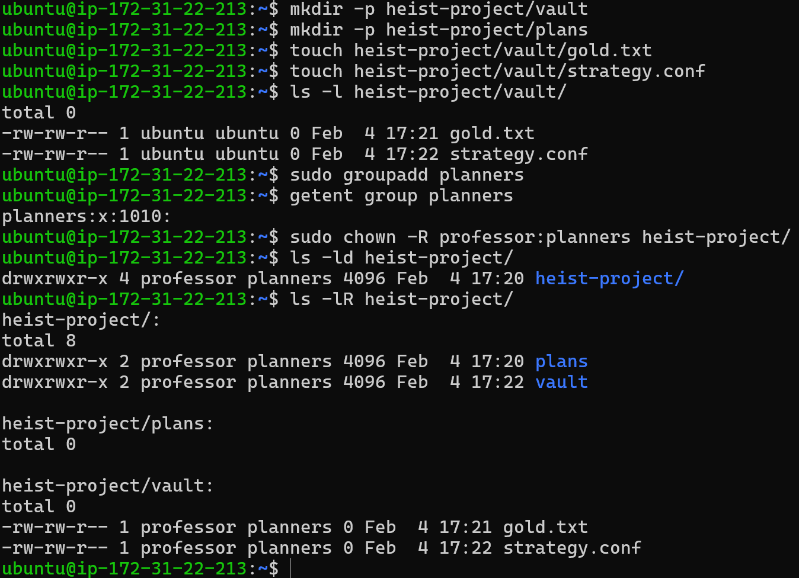
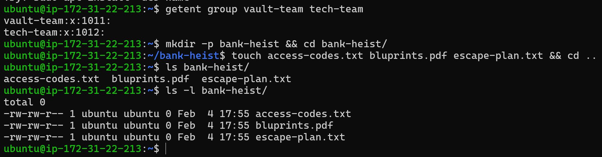
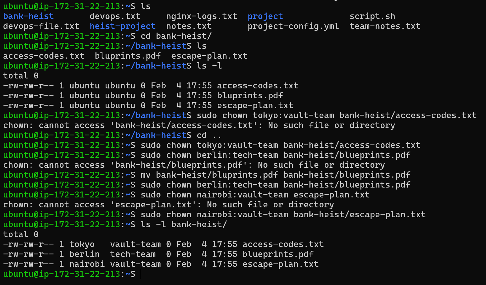

Day 11 – File Ownership Challenge (chown & chgrp)
- Objective
   - Learn and practice Linux file and directory ownership:
   - Understand user vs group ownership
   - Use chown and chgrp
   - Apply ownership recursively
   - Verify changes using ls -l and ls -lR
---
Task 1: Understanding Ownership
```bash
ls -l 
```
```text
ubuntu@ip-172-31-22-213:~$ ls -l
total 16
-r--r--r-- 1 ubuntu ubuntu    0 Feb  4 05:04 devops.txt
-rw-r--r-- 1 root   root   1068 Feb  3 05:43 nginx-logs.txt
-rw-r----- 1 ubuntu ubuntu   80 Feb  3 19:09 notes.txt
drwxr-xr-x 2 ubuntu ubuntu 4096 Feb  4 04:54 project
-rw-rw-r-- 1 ubuntu ubuntu   20 Feb  3 19:16 script.sh
```
### Columns Explained

| Field           | Meaning                     |
|-----------------|-----------------------------|
| drwxr-xr-x      | Directory permissions       |
| 2               | Number of links             |
| ubuntu (owner)  | User who owns the file      |
| ubuntu (group)  | Group that owns the file    |
| 4096            | File size                   |
| Feb 3           | Last modified               |
| project         | Directory name              |


Difference Between Owner and Group
- Owner: The user who created the file (or was assigned ownership)
- Group: A collection of users who may share access to the file
- Permissions can be set differently for owner, group, and others

---

Task 2: Basic chown Operations
- Step 1: Create File
```bash
touch devops-file.txt
ls -l devops-file.txt
```
```text
ubuntu@ip-172-31-22-213:~$ touch devops-file.txt
ubuntu@ip-172-31-22-213:~$ ls -l devops-file.txt
-rw-rw-r-- 1 ubuntu ubuntu 0 Feb  4 16:23 devops-file.txt
```
- Step 2: Change Owner
```bash
sudo chown tokyo devops-file.txt
ls -l devops-file.txt
```
```text
ubuntu@ip-172-31-22-213:~$ chown tokyo devops-file.txt
chown: changing ownership of 'devops-file.txt': Operation not permitted
ubuntu@ip-172-31-22-213:~$ sudo chown tokyo devops-file.txt
ubuntu@ip-172-31-22-213:~$ ls -l devops-file.txt
-rw-rw-r-- 1 tokyo ubuntu 0 Feb  4 16:23 devops-file.txt
ubuntu@ip-172-31-22-213:~$
```
```bash
sudo chown berlin devops-file.txt
ls -l devops-file.txt
```
```text
ubuntu@ip-172-31-22-213:~$ sudo chown berlin devops-file.txt
ubuntu@ip-172-31-22-213:~$ ls -l devops-file.txt
-rw-rw-r-- 1 berlin ubuntu 0 Feb  4 16:23 devops-file.txt
ubuntu@ip-172-31-22-213:~$
```
#### Ownership successfully changed

---

Task 3: Basic chgrp Operations
- Step 1: Create File
```bash
touch team-notes.txt
ls -l team-notes.txt
```
```text
ubuntu@ip-172-31-22-213:~$ touch team-notes.txt
ubuntu@ip-172-31-22-213:~$ sudo groupadd heist-team
ubuntu@ip-172-31-22-213:~$ ls -l team-notes.txt
-rw-rw-r-- 1 ubuntu ubuntu 0 Feb  4 16:55 team-notes.txt
ubuntu@ip-172-31-22-213:~$ getent group heist-team
heist-team:x:1009:
ubuntu@ip-172-31-22-213:~$ sudo chgrp heist-team team-notes.t
xt
ubuntu@ip-172-31-22-213:~$ ls -l team-notes.txt
-rw-rw-r-- 1 ubuntu heist-team 0 Feb  4 16:55 team-notes.txt
ubuntu@ip-172-31-22-213:~$
```
---

Task 4: Change Owner & Group Together
- Create File
```bash
touch project-config.yaml
sudo chown professor:heist-team project-config.yml
```
```text
ubuntu@ip-172-31-22-213:~$ touch project-config.yml
ubuntu@ip-172-31-22-213:~$ ls -l project-config.yml
-rw-rw-r-- 1 ubuntu ubuntu 0 Feb  4 17:03 project-config.yml
ubuntu@ip-172-31-22-213:~$ sudo chown professor:heist-team pr
oject-config.yml
ubuntu@ip-172-31-22-213:~$ ls -l project-config.yml
-rw-rw-r-- 1 professor heist-team 0 Feb  4 17:03 project-config.yml
ubuntu@ip-172-31-22-213:~$
```
---

Task 5: Recursive Ownership
- 1) Create Directory Structure
```bash
mkdir -p heist-project/vault
mkdir -p heist-project/plans
touch heist-project/vault/gold.txt
touch heist-project/plans/str
```
```text
ubuntu@ip-172-31-22-213:~$ mkdir -p heist-project/vault
ubuntu@ip-172-31-22-213:~$ mkdir -p heist-project/plans
ubuntu@ip-172-31-22-213:~$ touch heist-project/vault/gold.txt
ubuntu@ip-172-31-22-213:~$ touch heist-project/vault/strategy.conf
ubuntu@ip-172-31-22-213:~$ ls -l heist-project/vault/
total 0
-rw-rw-r-- 1 ubuntu ubuntu 0 Feb  4 17:21 gold.txt
-rw-rw-r-- 1 ubuntu ubuntu 0 Feb  4 17:22 strategy.conf
```
- 2) Create Group
```bash
sudo groupadd planners
getent group planners
```
```text
ubuntu@ip-172-31-22-213:~$ sudo groupadd planners
ubuntu@ip-172-31-22-213:~$ getent group planners
planners:x:1010:
```
- 3)Recursive Ownership Change (Change ownership of entire heist-project/ directory:)
```bash
chown -R professor:planners heist-project
ls -lR heist-project/
```
```text
ubuntu@ip-172-31-22-213:~$ sudo chown -R professor:planners heist-project/
ubuntu@ip-172-31-22-213:~$ ls -lR heist-project/
heist-project/:
total 8
drwxrwxr-x 2 professor planners 4096 Feb  4 17:20 plans
drwxrwxr-x 2 professor planners 4096 Feb  4 17:22 vault

heist-project/plans:
total 0

heist-project/vault:
total 0
-rw-rw-r-- 1 professor planners 0 Feb  4 17:21 gold.txt
-rw-rw-r-- 1 professor planners 0 Feb  4 17:22 strategy.con
ubuntu@ip-172-31-22-213:~$
```


---

Task 6: Practice Challenge
- 1) Create Group
```bash
sudo groupadd vault-team
sudo groupadd tech-team
getent group vault-team tech-team
```
```text
vault-team:x:1011:
tech-team:x:1012:
```
- 2)Create Directory & Files
```bash
mkdir -p bank-heist && cd bank-heist/
touch access-codes.txt bluprints.pdf escape-plan.txt && cd ..
```
```text
ubuntu@ip-172-31-22-213:~$ mkdir -p bank-heist && cd bank-heist/
ubuntu@ip-172-31-22-213:~/bank-heist$ touch access-codes.txt bluprints.pdf escape-plan.txt && cd ..
ubuntu@ip-172-31-22-213:~$ ls bank-heist/
access-codes.txt  bluprints.pdf  escape-plan.txt
ubuntu@ip-172-31-22-213:~$
```


- 3) Set Ownership
```bash
sudo chown tokyo:vault-team bank-heist/access-codes.txt
sudo chown berlin:tech-team bank-heist/blueprints.pdf
sudo chown nairobi:vault-team escape-plan.txt
```
```text
ubuntu@ip-172-31-22-213:~$ ls -l bank-heist/
total 0
-rw-rw-r-- 1 tokyo   vault-team 0 Feb  4 17:55 access-codes.txt
-rw-rw-r-- 1 berlin  tech-team  0 Feb  4 17:55 blueprints.pdf
-rw-rw-r-- 1 nairobi vault-team 0 Feb  4 17:55 escape-plan.txt
ubuntu@ip-172-31-22-213:~$
```

