# Day 13 – Linux Volume Management (LVM)
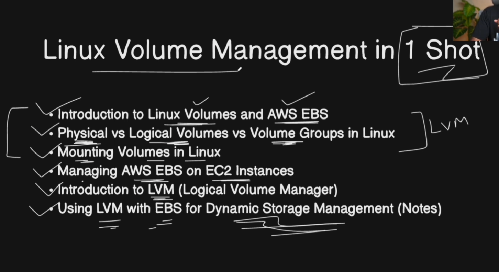
## Goal
Learn LVM to manage storage flexibly — create, extend, and mount volumes.

---

## Task 1: Check current storage (take screenshots) / Showing attached and usable devices/blocks/disks/volumes:
- Ist Command lsblk:
       - lsblk (List Block Devices) shows all storage devices attached to the system and their structure.
- When to use lsblk
To see:
- Disk & partition layout
- LVM structure
- Which disk is mounted where
- Works before and after mounting
```bash
lsblk
```
- 2nd Command df -h
         - df (Disk Free) shows used and available space of mounted file systems.
- When to use df -h
To check:
- Free disk space
- Used disk space
- Storage usage percentage
- Shows only mounted file systems
```bash
df -h
```
## Environment / Notes
- Switched to root using:
  - `sudo -i` (or `sudo su -`)
```bash
sudo -i
```

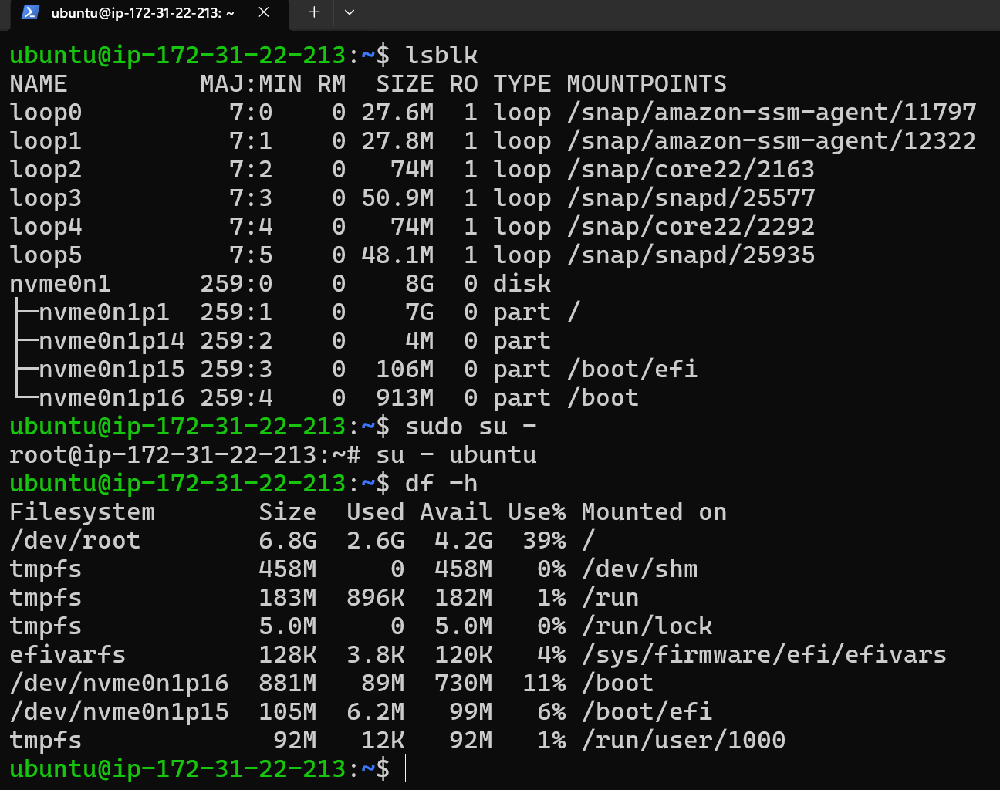

What is mount?
- In Linux, mount is used to attach a storage device or filesystem to a directory so that you can access its data.
- The mount command connects a filesystem (disk, partition, USB, or LVM) to a directory so it can be accessed by the system.
```bash
mount <device> <mount_point>
```
- Temporary Mount --> Done using mount ; Lost after reboot
- Permanent Mount --> Done using /etc/fstab ; Survives reboot

Create Volume in EC2:
- Go to EBS
- Create Volumes:
#### 1) 10G
#### 2) 12G
#### 3) 14G

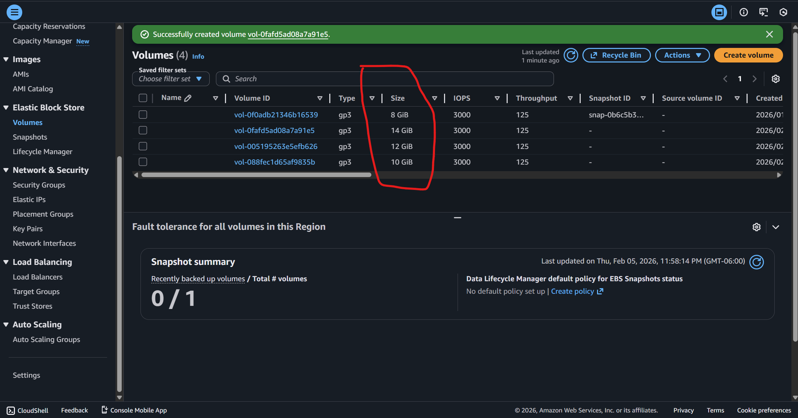

Now Attaching Process:
- select the volume 
- go to action attach volume and click
- select EC2 
- select device name start from sdf--sdh will translate into nvme1n1,nvme2n1,nvme3n1

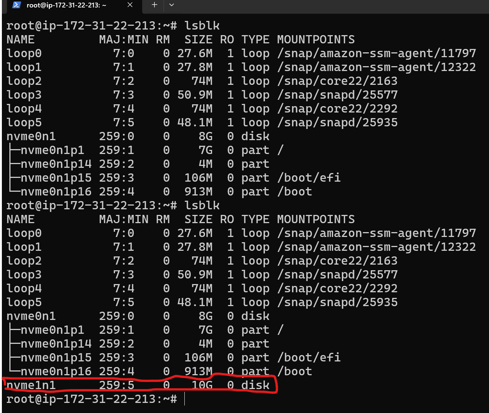

### Attached is Completed.

# Now LVM starts:


- Physical Volume (PV) --> A Physical Volume is the actual storage device used by LVM.
  - PV = real disk or partition
```bash
pvcreate /dev/sdb1(attached-disk-1) /dev/sdb2(attached-disk-2)
```

- Volume Group (VG) --> A Volume Group is a storage pool made by combining one or more Physical Volumes.
  - VG = collection (pool) of disks, It acts like a container of storage space.
  - LV = usable partition
```bash
vgcreate vg_data(given-name) /dev/sdb1(attached-disk)
```

  - add more disks later 
```bash
vgextend vg_data /dev/sdc1
```

- Logical Volume (LV) --> A Logical Volume is a virtual partition created from a Volume Group.
  - Format, Mount and Use to store data
```bash
lvcreate -L 5G -n lv_data vg_data
mkfs.ext4 /dev/vg_data/lv_data
mount /dev/vg_data/lv_data /data
```

## Task 2: Create Physical Volume (PV)
Inside lvm interactive shell, you can run LVM commands without prefixes, but standard shell commands won’t work., such as:
- pvs
- vgs
- lvs
- pvcreate
- vgcreate
- lvcreate
```bash
lvm
```
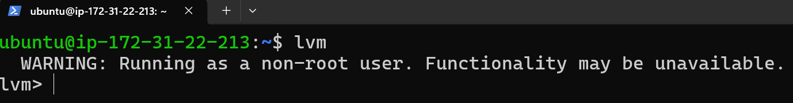

- Create Physical Volume (PV)
  - - i) show physical volume and Create physical volume from attached disks/bloks:
```bash
pvs
pvcreate /dev/nvme1n1 /dev/nvme2n1 /dev/nvme3n1
pvs
```


## Task 3: Create Volume Group (VG)
- Now Creating VG nvme1n1 + nvme2n1
```bash
vgcreate tws_vg /dev/nvme1n1 /dev/nvme2n1
vgs
```
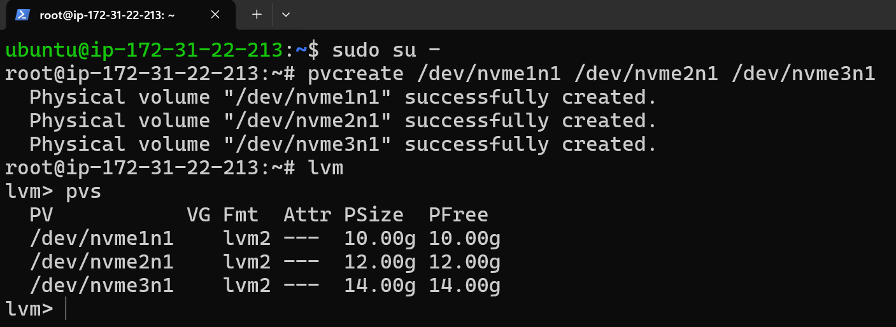

## Task 4: Create Logical Volume (LV 10 GiB)
  - lvcreate -L (size) -n (name) (volume-group)
```bash
lvcreate -L 10G -n tws_lv tws_vg
lvs
lsblk
```
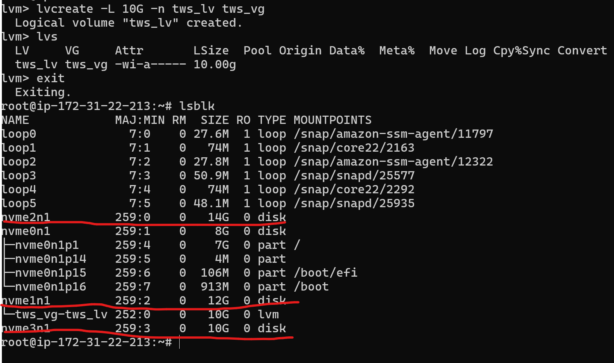

## Task 5: a) Format ( creat a file system)
   - mkfs.ext4 /dev/tws_vg/tws_lv
```bash
- mkfs.ext4 /dev/tws_vg/tws_lv
```
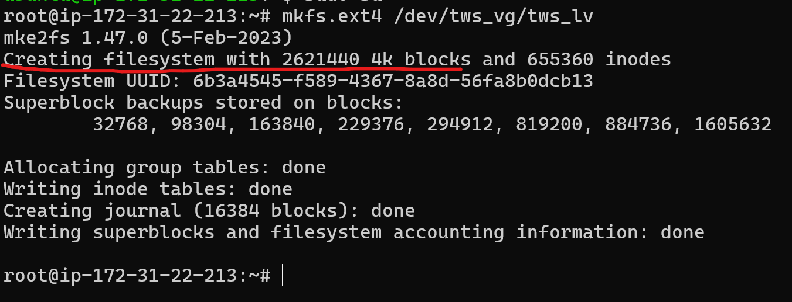
## Task 5: b) Mount in Linux?
In Linux, mount is used to attach a filesystem (disk, partition, USB, or LVM volume) to a directory so you can access its data.
Linux does not use drive letters like C: or D:.
Everything is accessed through directories.
Basic Syntax --> 
mkdir -p directory-ptah-with-name
mount <device> <mount_point>
```bash
mkdir -p /mnt/tws_lv_mount
ls -ld /mnt/tws_lv_mount
mount /dev/tws_vg/tws_lv /mnt/tws_lv_mount
```
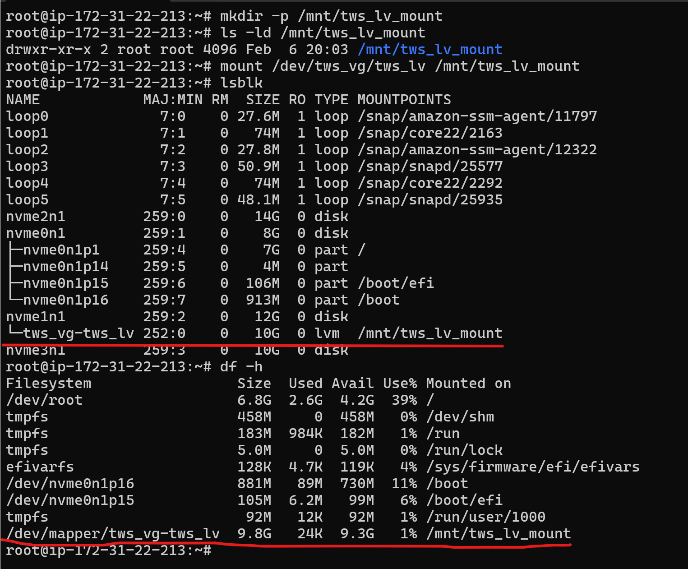

## Task 5 : c) Unmount disk/volume:
```bash
umount /mnt/tws_lv_mount
```
Note: attached --> not accessible ;  Mount --> accessible
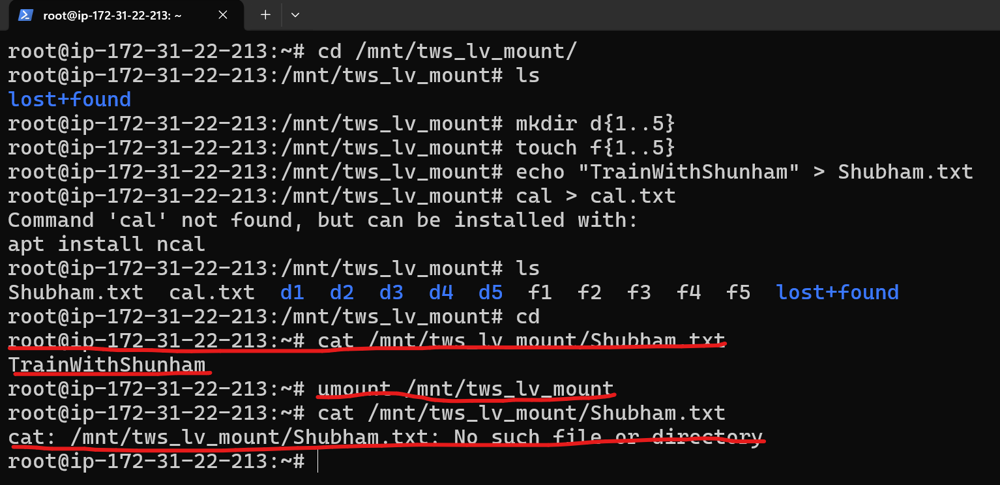

Data reaccess after remount:
```bash
mount /dev/tws_vg/tws_lv /mnt/tws_lv_mount/
```
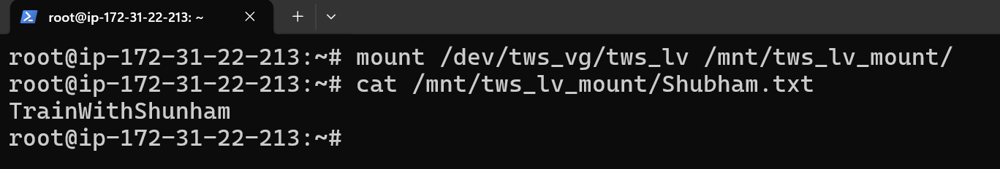

##  Task 6: Extend the volume (+5G) and grow filesystem OR EBS for Dynamic Storage Management:
- lvextend -L +(increased size) -r path/name
   - lvextend → grows the logical volume
   - -r → automatically runs resize2fs for ext4
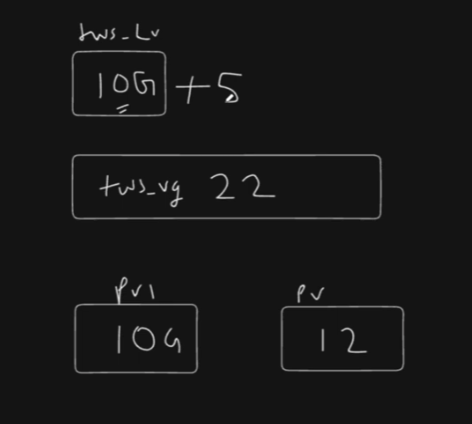
```bash
lvextend -L +5G -r /dev/tws_vg/tws_lv
 lsblk
```
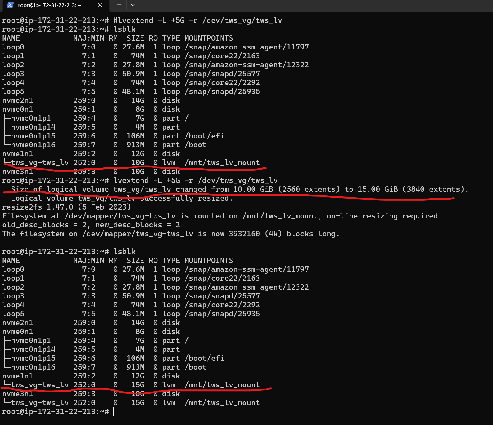
 
## Key takeaways from Day 13:
- LVM abstracts storage into layers (PV → VG → LV), making capacity planning far more flexible
- Filesystems can be resized online when LVM is used correctly
- Verifying changes with lsblk, lvs, and df -h is essential to avoid silent storage issues
- LVM is a foundational skill for managing cloud disks, databases, and application storage
- This hands-on session strengthened my understanding of dynamic storage management, which is crucial for Linux servers running in cloud environments like AWS.


