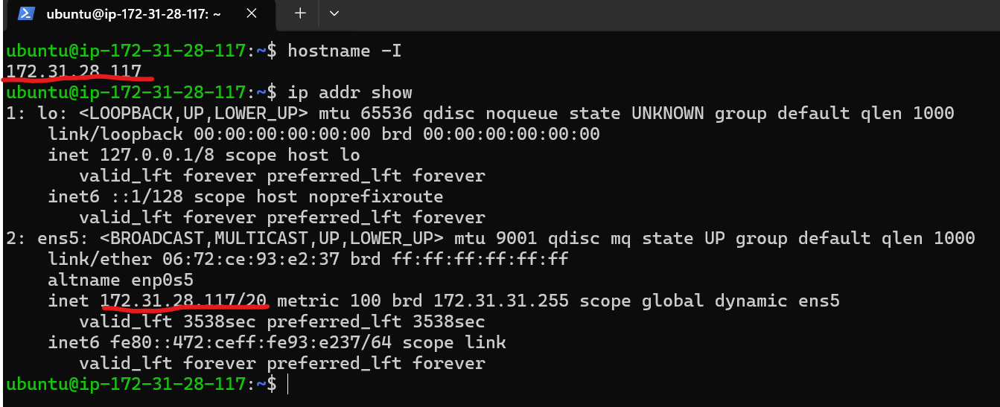
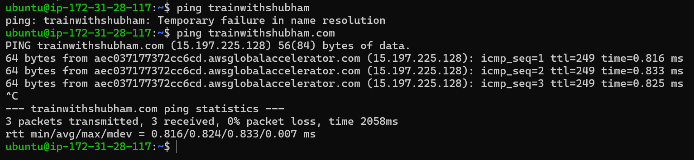
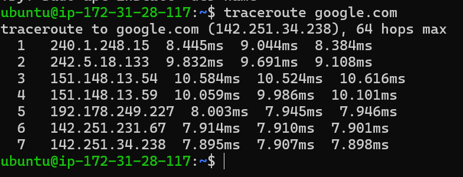
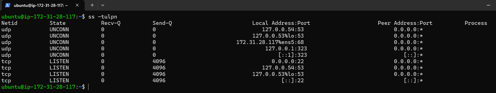
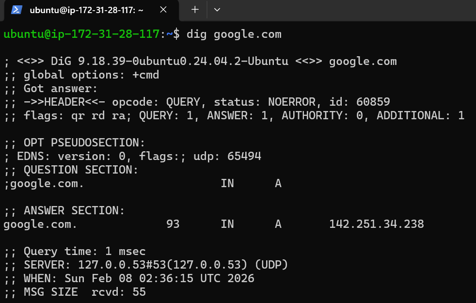
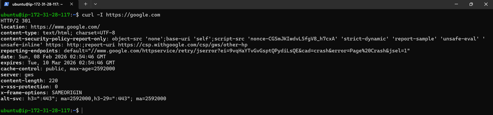
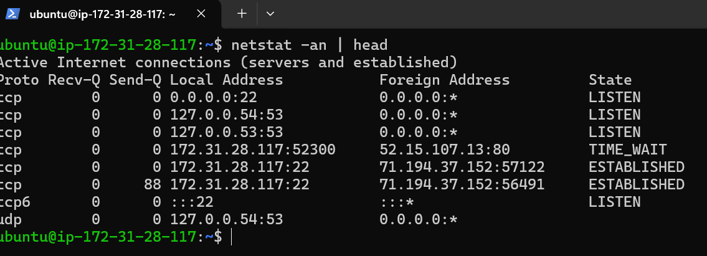
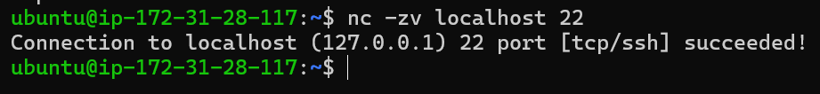

# Day 14 – Networking Fundamentals & Hands-on Checks

## Quick Concepts

### OSI vs TCP/IP Model
- **OSI (7 layers)**: Physical, Data Link, Network, Transport, Session, Presentation, Application.
- **TCP/IP (4 layers)**: Network Access, Internet, Transport, Application.
- TCP/IP groups OSI’s top 3 layers (Session, Presentation, Application) into a single **Application layer**.

### Protocol Placement
- **IP** → Network layer (OSI L3) / Internet layer (TCP/IP)
- **TCP / UDP** → Transport layer (OSI L4)
- **DNS** → Application layer (OSI L7)
- **HTTP / HTTPS** → Application layer (OSI L7)

### Real Example
- `curl https://example.com`
  - Application: HTTP/HTTPS  
  - Transport: TCP (port 443)  
  - Network: IP  

---

## Hands-on Checklist

### Identity
```bash
hostname -I
ip addr show
```

Observation: 
- Shows the IP address assigned to my system interface. Shows all IP addresses.
- Layer: Network Layer --> IP addressing is handled here
    - OSI → Layer 3
    - TCP/IP → Internet Layer

Why not a public IP?
- Public IPs are used for internet-facing access
- Private IPs are used for internal communication
- NAT or Load Balancer exposes services externally
---
### Reachability
```bash
ping trainwithshubham.com
```

Observation: 
- Ping to trainwithshubham failed due to DNS name resolution because it was not a fully qualified domain name. Ping to trainwithshubham.com succeeded after DNS resolved it to 15.197.225.128. ICMP replies showed low latency and 0% packet loss, confirming proper network connectivity.
- OSI: Application Layer (Layer 7) / TCP-IP: Application Layer --> DNS always lives here.
- ICMP ping Network (L3)

Why does this matter in real incidents?
- If ping fails before resolution → check DNS
- If ping fails after resolution → check network/firewall
- DNS issues are often misdiagnosed as network outages
---
### Path
```bash
traceroute google.com
```
(or `tracepath trainwithshubham`)

Observation:
- Traceroute shows packets traveling through multiple internal cloud network hops before reaching the destination. Initial hops belong to private and carrier-grade NAT IP ranges, indicating cloud provider routing. Several hops do not respond due to ICMP filtering, which is common in secured or CDN-backed environments. This does not indicate packet loss or failure.

OSI / TCP-IP Layer Mapping:

| Function          | Layer            |
| ----------------- | ---------------- |
| DNS resolution    | Application (L7) |
| Traceroute (ICMP) | Network (L3)     |
| Routing           | Network (L3)     |
| TTL decrement     | Network (L3)     |
---
### Ports
```bash
ss -tulpn
```

Observation:
- The ss -tulpn output shows multiple UDP and TCP sockets. SSH is listening on port 22 on all interfaces, confirming remote access capability. DNS services are bound to loopback interfaces on port 53, indicating local name resolution via systemd-resolved. DHCP client traffic is present on UDP port 68, confirming dynamic IP assignment. No unnecessary public-facing services are running. 
- What is NOT present (important observation)
     - No web server (80 / 443)
     - No database ports (3306, 5432)
     -  No public-facing services except SSH

OSI / TCP-IP Layer Mapping:

| Component           | Layer              |
| ------------------- | ------------------ |
| TCP / UDP           | Transport (OSI L4) |
| Port numbers        | Transport (L4)     |
| Services (SSH, DNS) | Application (L7)   |
| IP binding          | Network (L3)       |

---
### Name Resolution
```bash
dig google.com
```

Observation: dig (Domain Information Groper)
- The dig google.com command successfully resolved the domain to the IPv4 address 142.251.34.238 with a TTL of 93 seconds. The DNS query returned NOERROR and was answered in 1 ms using the local systemd-resolved stub resolver at 127.0.0.53. This confirms that DNS resolution is functioning correctly at the application layer.
OSI / TCP-IP Layer Mapping:

| Component  | Layer                |
| ---------- | -------------------- |
| DNS        | Application (OSI L7) |
| UDP 53     | Transport (OSI L4)   |
| IP routing | Network (OSI L3)     |

If DNS fails:
- Check /etc/resolv.conf
- Verify local resolver → ss -tulpn | grep 53
- Test external resolver → dig @8.8.8.8 google.com
- Check firewall blocking UDP 53

---
### HTTP Check
```bash
curl -I https://google.com
```

Observation:
- The curl -I https://google.com request returned an HTTP/2 301 Moved Permanently response, redirecting traffic to https://www.google.com/. This confirms successful HTTPS connectivity, proper application-layer behavior, and the presence of security and caching headers. The response was served by Google Web Server (gws).
OSI / TCP-IP Layer Mapping:

| Component    | Layer                      |
| ------------ | -------------------------- |
| HTTP / HTTPS | Application (OSI L7)       |
| TLS          | Presentation / Application |
| TCP (443)    | Transport (OSI L4)         |
| IP routing   | Network (OSI L3)           |

- 301 / 302 → Redirect (not an error)
- 200 → OK
- 403 → Permission / WAF issue
- 500 → Server-side application failure

---
### Connections Snapshot
```bash
netstat -an | head
```

Observation:  Observation: Shows active network connections, including listening and established sockets.
- The netstat -an output shows SSH listening on port 22 for both IPv4 and IPv6, confirming remote access capability. Local DNS services are bound to loopback interfaces on port 53. Multiple SSH connections are in the ESTABLISHED state, indicating active remote sessions. A TIME_WAIT entry shows a recently closed outbound HTTP connection, which is normal TCP behavior.
If users complain:
App is slow → check ESTABLISHED + Send-Q
Can’t connect → check LISTEN
Too many connections → look for excessive TIME_WAIT

---

## Mini Task – Port Probe & Interpret
### Identified Service
- SSH listening on port 22
Test
```bash
nc -zv localhost 22
```

- nc (netcat) → network connectivity testing tool
- This command checks whether a port is reachable, not whether you can log in.
Observation:
- The nc -zv localhost 22 command successfully connected to TCP port 22 on the local machine, confirming that the SSH service is running and reachable. This verifies local port availability at the transport layer without performing authentication.

If not reachable, next checks would be:
- Verify service status (systemctl status ssh)
- Check firewall rules (ufw status / iptables -L)

---
## Reflection
### Fastest Signal When Things Break
- ping → Quickly tells if the host is reachable at the network layer.

### Troubleshooting by Layer
- DNS failure → Inspect Application layer (DNS config, resolver).
- HTTP 500 error → Inspect Application layer (web server logs, backend service).

### Two Follow-up Checks in Real Incidents
- Check firewall rules and security groups.
- Inspect application and system logs for errors.

---
Key takeaways from Day 14:
- DNS issues often look like network issues — knowing the layer saves time
- ICMP (ping, traceroute) is essential for quick network validation
- Most cloud systems rely on private IPs + NAT, not public IPs
- ss and netstat provide instant visibility into what’s running and connected
- HTTP status codes (301, 200, 500) give fast application-layer signals
- Layer-based troubleshooting (L7 → L4 → L3) makes debugging systematic and efficient