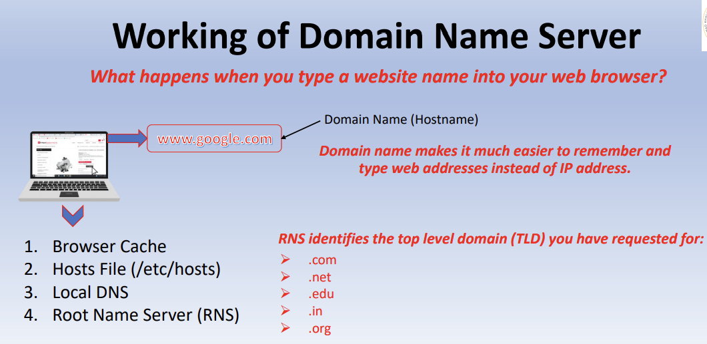
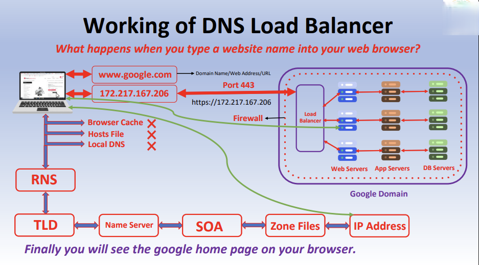
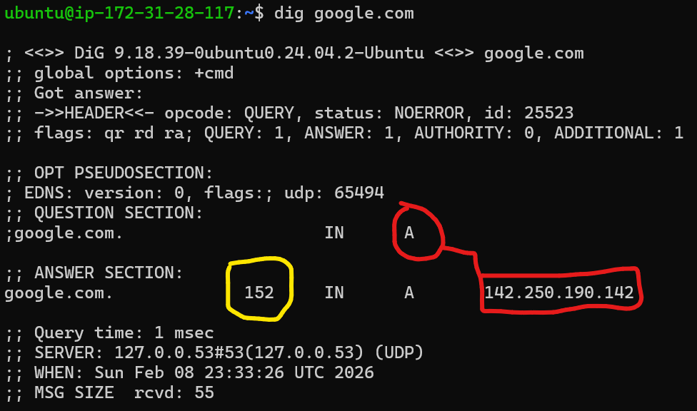
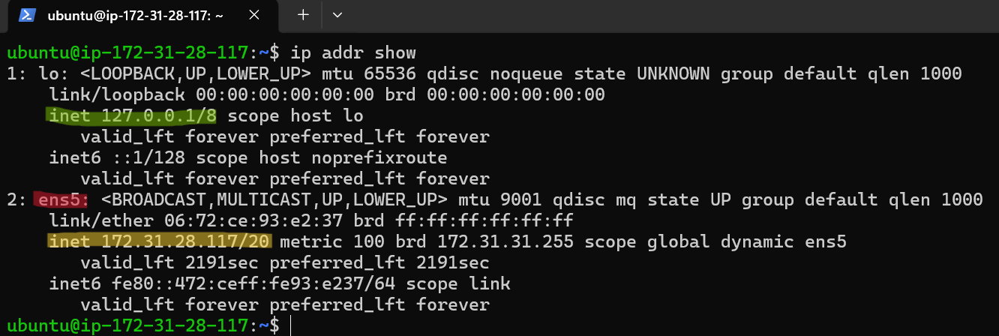

# Day 15 – Networking Concepts: DNS, IP, Subnets & Ports

## Task 1: DNS – How Names Become IPs

### i) What happens when you type google.com in a browser?
When a user types `google.com`, the system first checks the local DNS cache. If not found, it queries a DNS resolver, which contacts root servers, then TLD servers, and finally the authoritative DNS server for `google.com`. The DNS server returns the IP address, which the browser then uses to establish a network connection to the server.

,


### ii) DNS Record Types
- **A** – Maps a domain name to an IPv4 address  
- **AAAA** – Maps a domain name to an IPv6 address  
- **CNAME** – Alias that points one domain to another domain  
- **MX** – Specifies mail servers for a domain  
- **NS** – Specifies authoritative name servers for a domain  

### iii) Identify the A record and TTL from the output
```bash
dig google.com
```

### Identify: 
- The **A** record for google.com resolves to 142.250.190.142 with a TTL of 152 seconds.
- **TTL** (Time To Live) defines how long a DNS result is stored (cached) before it must be refreshed by querying the DNS server again.

---

## Task 2: IP Addressing
### i) What is an IPv4 address?
- An IPv4 address is a 32-bit numeric identifier used to uniquely identify a device on a network. It is written in dotted-decimal format, such as 192.168.1.10, and is divided into two logical parts: the network part and the host part.
     - **Network part**: This portion identifies the network or subnet the device belongs to. All devices within the same network share the same network part.
     - **Host part**: This portion identifies the specific device within that network. Each device must have a unique host part to avoid conflicts.
     - Together, the network part determines where the device is located, and the host part identifies which device it is on that network.
- Reserved IP Addresses (Special Purpose)
   - Loopback / Localhost (127.0.0.0/8)
       - Example: 127.0.0.1
       - Used by a system to communicate with itself
       - Helpful for testing local services without network access
   - Broadcast Address
       - Used to send data to all devices in a network
       - Example: In 192.168.1.0/24, the broadcast address is 192.168.1.255
       - Not assignable to any host
   - Network Address
       - Identifies the network itself
       - Example: 192.168.1.0 in a /24 network
       - Cannot be assigned to a device
   - Link-Local Addresses (169.254.0.0/16)
       - Automatically assigned when DHCP fails
       - Used for limited, local-only communication
### Quick Summary:
- Public IP → External access (internet-facing)
- Private IPs → Internal networks
   - These are commonly used in home networks, data centers, and cloud VPCs, often combined with NAT for internet access.
- Loopback → Same machine communication
- Network & Broadcast → Reserved for network operations
- Link-local → Fallback when no IP is assigned

### ii) Public vs Private IP:
- Public IP: Reachable over the internet (example: 8.8.8.8)
- Private IP: Used inside internal networks (example: 172.31.28.117)

### Private IP Ranges:
- 10.0.0.0 – 10.255.255.255
- 172.16.0.0 – 172.31.255.255
- 192.168.0.0 – 192.168.255.255
### iv) identify which of your IPs are private:
```bash
ip addr show
```

- The IP address 172.31.28.117 is a private IPv4 address assigned to the instance within a private network, while 127.0.0.1 is a loopback address used for local communication. No public IP is directly configured on the system.

---

## Task 3: CIDR & Subnetting:
### i) What does /24 mean in 192.168.1.0/24?
- /24 means the first 24 bits are used for the network portion, leaving 8 bits for host addresses.

### ii) How many usable hosts in a /24? A /16? A /28?
- Usable Hosts: 2^(32 − CIDR) − 2 , where two addresses are reserved for the **network** and **broadcast** addresses.
  - /24 → 254 usable hosts (2^8 -2 ) --> [n=(Pv4 total bits = 32) - CIDR(24 bits for network)]
  - /16 → 65,534 usable hosts (2^16 - 2)
  - /28 → 14 usable hosts (2^4 - 2)

### iii) Why do we subnet?
- Subnetting helps divide large networks into smaller segments to improve security, reduce broadcast traffic, and manage IP allocation efficiently.

### iv) CIDR Table

| CIDR | Subnet Mask     | Total IPs | Usable Hosts |
| ---- | --------------- | --------- | ------------ |
| /24  | 255.255.255.0   | 256       | 254          |
| /16  | 255.255.0.0     | 65,536    | 65,534       |
| /28  | 255.255.255.240 | 16        | 14           |

---

## Task 4: Ports – The Doors to Services

### i) What is a port? Why do we need them?
- A port is a logical endpoint that allows multiple services to run on the same IP address.
- Ports help the operating system direct traffic to the correct application.

### ii) Document these common ports:

| Port  | Service |
| ----- | ------- |
| 22    | SSH     |
| 80    | HTTP    |
| 443   | HTTPS   |
| 53    | DNS     |
| 3306  | MySQL   |
| 6379  | Redis   |
| 27017 | MongoDB |

### iii) Run ss -tulpn — match at least 2 listening ports to their services

- Which services are listening on which ports and by which process
```bash
ss -tulnp
ss -tulnp | egrep '22|53'
```


- SSH is listening on port 22, and DNS services are listening on port 53, confirming active network services on the system.

---

## Task 5: Putting It Together
### i) curl http://myapp.com:8080 — what concepts are involved?
- This involves DNS resolution (domain to IP), TCP transport, port 8080 for the application service, IP routing, and HTTP at the application layer.
- Protocol://hostname:port_number

 ### ii) Your app can't reach a database at 10.0.1.50:3306 — what would you check first?
- First check network reachability and port availability (security groups, firewall rules, and whether the database service is listening on port 3306).
- Commands
  - Check basic network reachability
```bash
ping 10.0.1.50
```
Confirms whether the database host is reachable at the network layer.

  - Check if the database port is reachable
```bash
nc -zv 10.0.1.50 3306
```
Verifies whether port 3306 (MySQL) is open and accessible.

  - Check if the database service is listening (on DB server)
```bash
ss -tulpn | grep 3306
```
Confirms whether MySQL is running and listening on port 3306.

---

## What I Learned (Key Takeaways):
- DNS is a multi-step process and failures often occur at the application layer
- CIDR and subnetting are essential for scalable and secure cloud networking
- Ports allow multiple services to coexist on a single IP
- Understanding these basics makes network troubleshooting faster and more structured