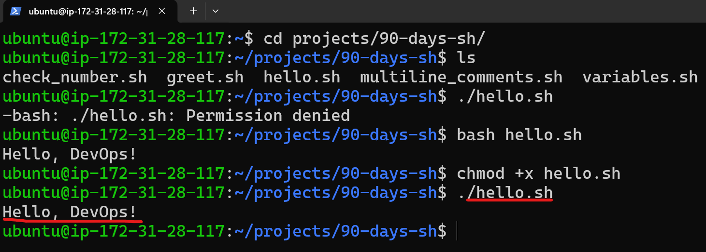
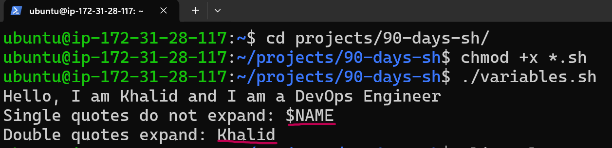
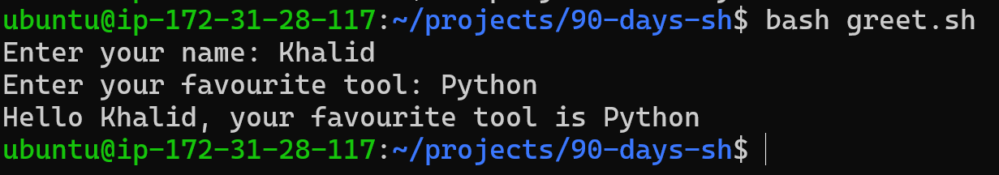
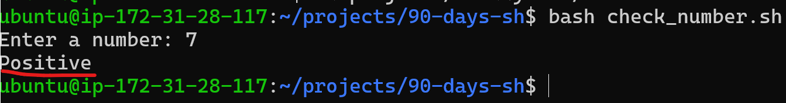
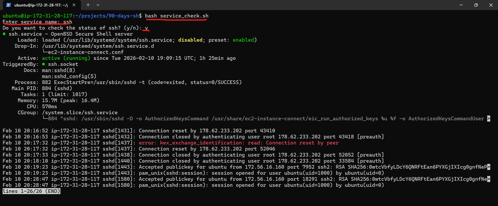

# Day 16 – Shell Scripting Basics

## Task 1: First Script (hello.sh)

```bash
vim hello.sh
```
### Script
```bash
#!/bin/bash
echo "Hello, DevOps!"
```


### Q. What happens if you remove the shebang line?
### A. Without the shebang, the script may run using the default shell (often /bin/sh) or fail if executed directly.

---

## Task 2: Variables (variables.sh)
```bash
vim variables.sh
```
### Script
```bash
#!/bin/bash
NAME="Khalid"
ROLE="DevOps Engineer"

echo "Hello, I am $NAME and I am a $ROLE"

echo 'Single quotes do not expand: $NAME'
echo "Double quotes expand: $NAME"
```

### Observation: Single quotes print variables literally, while double quotes expand variables.

## Task 3: User Input with read (greet.sh)
### Script
```bash
#!/bin/bash
read -p "Enter your name: " name
read -p "Enter your favourite tool: " tool
echo "Hello $name, your favourite tool is $tool"
```


---

## Task 4: If-Else Conditions
### i) vim check_number.sh
### Script
```bash
#!/bin/bash
read -p "Enter a number: " n

if (( n > 0 )); then
  echo "Positive"
elif (( n < 0 )); then
  echo "Negative"
else
  echo "Zero"
fi
```


### ii) vim file_check.sh
- Used file tests to check existence and write permission; if missing, searched in $HOME.
```bash
#!/bin/bash
read -p "Enter the name of the file: " file_name

if [ -f "$file_name" ]; then
  if [ -w "$file_name" ]; then
    echo "Type something. Press Ctrl+D to save and exit."
    cat >> "$file_name"
  else
    echo "The file does not have write permission." >&2
  fi
else
  echo "File not found. Searching in home directory..."
  find "$HOME" -type f -name "$file_name" 2>/dev/null
fi
```

---

## Task 5: Combine It All (service_check.sh)
### Script
```bash
#!/bin/bash
read -p "Enter service name: " service_name
read -p "Do you want to check the status of $service_name? (y/n): " choice

if [[ "$choice" == "y" || "$choice" == "Y" ]]; then
    systemctl status "$service_name"

    if systemctl is-active --quiet "$service_name"; then
        echo "$service_name is ACTIVE"
    else
        echo "$service_name is NOT active"
    fi

elif [[ "$choice" == "n" || "$choice" == "N" ]]; then
    echo "Skipped."
else
    echo "Invalid choice. Please enter y or n." >&2
    exit 1
fi
```


---

## What I learned (3 key points)
- The shebang decides which interpreter runs the script and affects portability.
- Variables expand in double quotes but not in single quotes.
- if/else + file/service checks help automate common admin tasks safely.
