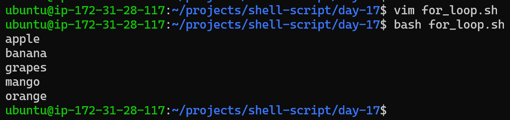
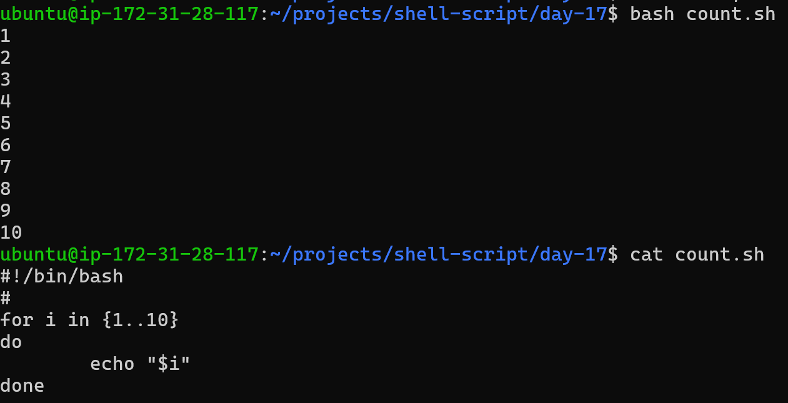
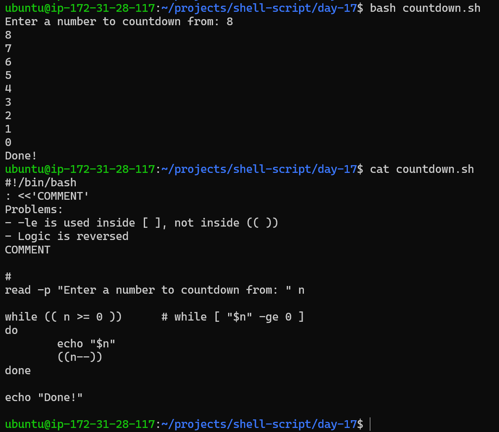
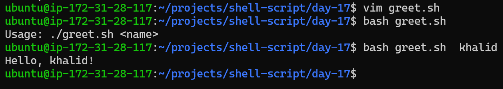
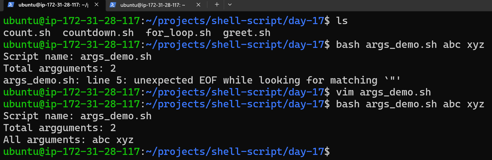
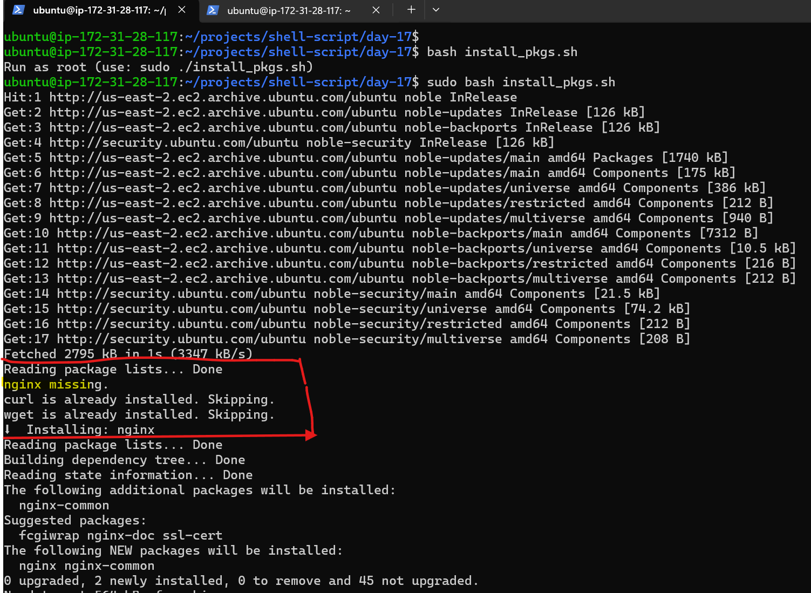
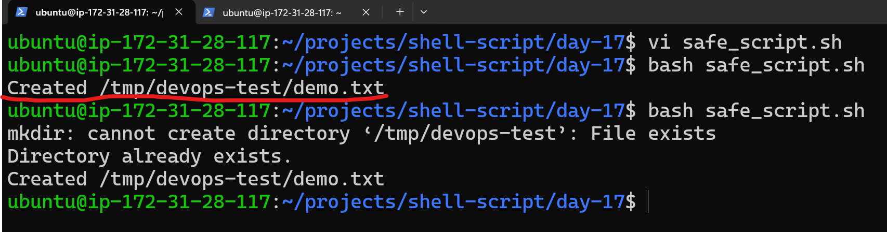
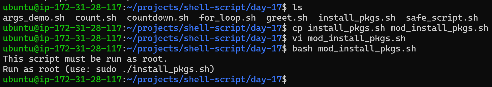

# Day 17 – Shell Scripting: Loops, Arguments & Error Handling

## Task 1: For Loop

### i) Create for_loop.sh that:
- Loops through a list of 5 fruits and prints each one.
### Script:
```bash
#!/bin/bash
fruits=("apple" "banana" "mango" "orange" "grapes")

for fruit in "${fruits[@]}"  # fruits = multi values variables ; [@] = whole list ; fruit = temporary variable
do
  echo "$fruit"              # $ = calling the variable ; "" = expends the variable
done
```


---

### ii) Create count.sh that:
- Prints numbers 1 to 10 using a for loop

### Script:
```bash
#!/bin/bash
#
for i in {1..10}
do
        echo "$i"
done
```


---

## Task 2: While Loop:
### Create countdown.sh that:
- Takes a number from the user
- Counts down to 0 using a while loop
- Prints "Done!" at the end
### Script:
```bash
#!/bin/bash
: <<'COMMENT'
Problems:
- -le is used inside [ ], not inside (( ))
- Logic is reversed
COMMENT

#
read -p "Enter a number to countdown from: " n

while (( n >= 0 ))      # while [ "$n" -ge 0 ]
do
        echo "$n"
        ((n--))
done

echo "Done!"
```


---

## Task 3: Command-Line Arguments

### i) Create greet.sh that:
- Accepts a name as $1
- Prints Hello, <name>!
- If no argument is passed, prints "Usage: ./greet.sh "

### Script:
```bash
#!/bin/bash
#
if (( $# < 1 ))     # $# → Number of command-line arguments passed to the script
then
        echo "Usage: $0 <name>" >&2
        exit 1
fi

echo "Hello, $1!"
```


### ii) Create args_demo.sh that:
- Prints total number of arguments ($#)
- Prints all arguments ($@)
- Prints the script name ($0)

### Script:
```bash
#!/bin/bash
#
echo "Script name: $0"
echo "Total argguments: $#"
echo "All arguments: $@"
```


---

## Task 4: Install Packages via Script
1. Create install_packages.sh that:
- Defines a list of packages: nginx, curl, wget
- Loops through the list
- Checks if each package is installed (use dpkg -s or rpm -q)
- Installs it if missing, skips if already present
- Prints status for each package
> Run as root: `sudo -i` or `sudo su`

### Script:
```bash
#!/bin/bash
#
: <<'EOF'
${array[*]} expands all elements into a single string, while ${array[@]} expands each element as a separate argument.
For commands like apt-get install, ${array[@]} is preferred to preserve argument boundaries.
EOF

set -e   # Exit immediately if any command fails (non-zero exit status).

# Root check (required)
if (( EUID != 0 )); then
  echo "Run as root (use: sudo ./install_pkgs.sh)" >&2
  exit 1
fi

apt-get update -y
packages=("nginx" "curl" "wget")
missing_pkgs=()

for pkg in "${packages[@]}"; do
  if dpkg -s "$pkg" &>/dev/null; then
    echo "$pkg is already installed. Skipping."
  else
    echo "$pkg missing."
    missing_pkgs+=("$pkg")  # Adds missing package to an array.
  fi
done

# Install all missing packages in one go
if (( ${#missing_pkgs[@]} > 0 )); then
  echo "Installing: ${missing_pkgs[*]}"   # Print as one string
  apt-get install -y "${missing_pkgs[@]}"   # Install as separate args
  echo "Installation complete."
else
  echo "All packages already installed."
fi
```



---

## Task 5: Error Handling
### i) Create safe_script.sh that:
Uses set -e at the top (exit on error)
Tries to create a directory /tmp/devops-test
Tries to navigate into it
Creates a file inside
Uses || operator to print an error if any step fails
Example:

mkdir /tmp/devops-test || echo "Directory already exists"

### Script:
```bash
#!/bin/bash
#
: <<'EOF'
command1 || command2
If command1 succeeds → command2 does NOT run.
If command1 fails → command2 runs.
EOF

set -e

mkdir /tmp/devops-test || echo "Directory already exists."

cd /tmp/devops-test || { echo "Failed to enter directory" >&2; exit 1; }

touch demo.txt || { echo "Failed to create file" >&2; exit 1; }

echo "Created /tmp/devops-test/demo.txt"
```



### ii) Modify your install_packages.sh to check if the script is being run as root — exit with a message if not.

### Script:
```bash
#!/bin/bash
#
: <<'EOF'
${array[*]} expands all elements into a single string, while ${array[@]} expands each element as a separate argument.
For commands like apt-get install, ${array[@]} is preferred to preserve argument boundaries.
EOF

set -e   # Exit immediately if any command fails (non-zero exit status).

# Root check (required)
if (( EUID != 0 )); then
  echo "This script must be run as root." >&2
  echo "Run as root (use: sudo ./install_pkgs.sh)" >&2
  exit 1
fi

apt-get update -y >/dev/null
packages=("nginx" "curl" "wget")
missing_pkgs=()

for pkg in "${packages[@]}"; do
  if dpkg -s "$pkg" &>/dev/null; then
    echo "$pkg is already installed. Skipping."
  else
    echo "$pkg missing."
    missing_pkgs+=("$pkg")  # Adds missing package to an array.
  fi
done

# Install all missing packages in one go
if (( ${#missing_pkgs[@]} > 0 )); then
  echo "⬇️ Installing: ${missing_pkgs[*]}"   # Print as one string
  apt-get install -y "${missing_pkgs[@]}"   # Install as separate args
  echo "Installation complete."
else
  echo "All packages already installed."
fi
```



---
What I learned:
- For and while loops help automate repetitive tasks and make scripts scalable.
- Command-line arguments ($1, $#, $@) make scripts reusable and flexible.
- Basic error handling (set -e, ||, root checks) prevents silent failures and makes scripts safer.

---
My scripts' folder link:
[Shell Scripts Folder](./day-17-shell-scripts/)

[Take Quiz about this Project: Just Download and Run it.](day-17-quiz.html)


