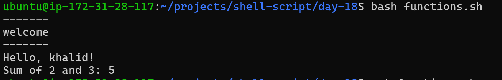
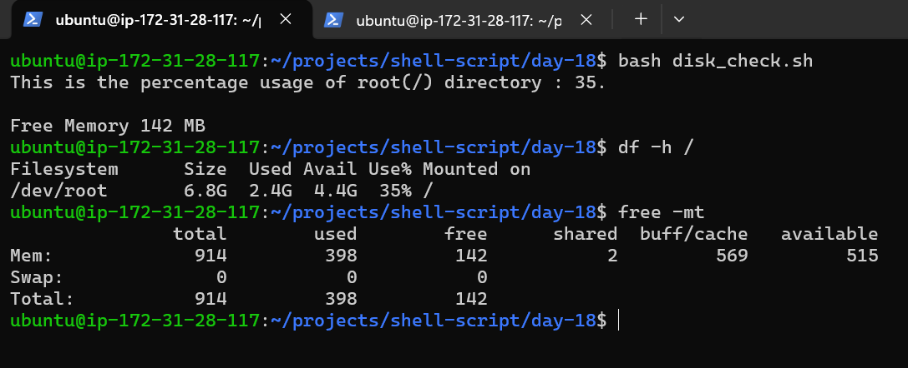
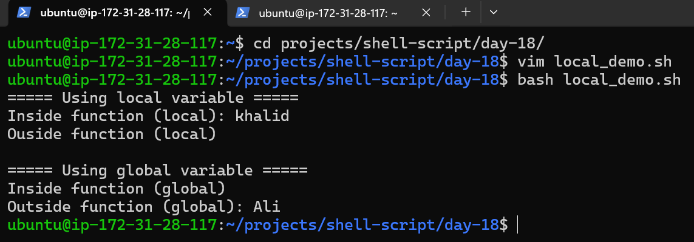
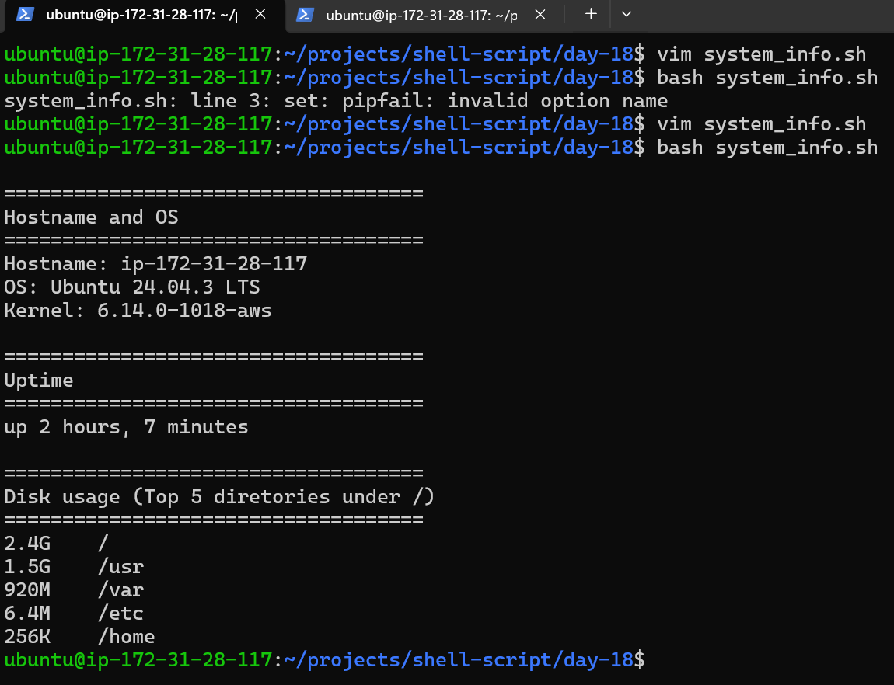

# Day 18 – Shell Scripting: Functions & Slightly Advanced Concepts

Today Tasks:
- Write and call functions
- Use set -euo pipefail for safer scripts
- Work with return values and local variables
- Build a slightly advanced script


## Task 1: Basic Functions (functions.sh)
Create functions.sh with:
- A function greet that takes a name as argument and prints Hello, <name>!
- A function add that takes two numbers and prints their sum
- Call both functions from the script

### Script

```bash
#!/bin/bash
#
# Creating a function To Greet the all arguments($@)
# Creating another func of addition
#
greet () {
        if [[ $# -eq 0 ]]; then
                echo "Usage: $0 [name1] [name2] [name3]"
                return 1
        fi

        for name in "$@"; do
                echo "-------"
                echo "welcome"
                echo "-------"
                echo "Hello, $name!"
        done
}

#greet "$@"

# "============================================="

add () {
        local a="$1"
        local b="$2"
        if [[ $# -ne 2 ]]; then
                echo "usage: $0 [number1] [number2]"
                return 1
        else
                echo "Sum of "$a" and "$b":" $(( a+b ))
        fi
}

greet khalid
add 2 3

```


---

## Task 2: Functions with Return Values
- Create disk_check.sh with:
- A function check_disk that checks disk usage of / using df -h
- A function check_memory that checks free memory using free -h
- A main section that calls both and prints the results

### Script

```bash
#!/bin/bash
#
check_disk () {
        DS=$(df -h / | awk 'NR==2 {print $5+0}')
        echo "This is the percentage usage of root(/) directory : "$DS"."
}

#==============================================

check_memory () {
        DM=$(free -mt | awk 'NR==4 {print $4}')
        echo "Free Memory "$DM MB""
}

main() {
  check_disk
  echo
  check_memory
}

main

```



.png)

---

## Task 3: Strict Mode — set -euo pipefail
- Create strict_demo.sh with set -euo pipefail at the top
   - Try using an undefined variable — what happens with set -u?
   - Try a command that fails — what happens with set -e?
   - Try a piped command where one part fails — what happens with set -o pipefail?

### Script:
```bash
#!/bin/bash
set -euo pipefail

echo "1) set -u demo (undefined variable):"
# echo "$NOT_DEFINED"

echo "$NAME"

echo "Output: unbound variable: NAME"
echo " set -u → error if using undefined variable"
echo
echo
echo
echo "2) set -e demo (failing command):"
# ls /path/does/not/exist
echo
echo "false Command"
echo "Still running"
echo "set -e → stop script if any command fails"
echo
echo
echo

echo "3) pipefail demo:"
# echo "hello" | grep "ZZZ" | wc -l

echo
echo "If you see this line, the failing demos are still commented."
```
- Document: What does each flag do?
  - set -e →          stop script if any command fails
  - set -u →          error if using undefined variable
  - set -o pipefail → ipeline fails if any part fails

---

## Task 4: Local Variables
- Create local_demo.sh with:
  - A function that uses local keyword for variables
  - Show that local variables don't leak outside the function
  - Compare with a function that uses regular variables

### Explanations:
- In Bash, variables are:
  - Global by default
  - Become local only if you use local inside a function

### Script
```bash
#!/bin/bash

echo "===== Using local variable ====="

local_example() {
    local name="Khalid"
    echo "Inside function (local): $name"
}

local_example

echo "Outside function (local): $name"

echo
echo "===== Using global variable ====="

global_example() {
    name="Ali"
    echo "Inside function (global): $name"
}

global_example

echo "Outside function (global): $name"
```



## Explanation:
### Local Variable:
```text
local name="Khalid"
```
- `local` restricts the variable to the function
- It exists only inside `local_example`
- Outside the function → it does not exist
That's why:
```text
Outside function (local):
```
Is empty.
### Global Variable (No local):
```text
name="Ali"
```
- No local
- Bash variables are global by default
- So after function runs → name still exists
That' why:
```javascript
Outside function (global): Ali
```
### Why This Matters
Without `local`, variables can:
- Accidentally overwrite other variables
- Cause hidden bugs
- Break larger scripts

---

## Task 5: Build a Script — System Info Reporter
### Create system_info.sh that uses functions for everything:
1. A function to print hostname and OS info
2. A function to print uptime
3. A function to print disk usage (top 5 by size)
4. A function to print memory usage
5. A function to print top 5 CPU-consuming processes
6. A main function that calls all of the above with section headers
7. Use set -euo pipefail at the top

Output should look clean and readable.
### Script:
```bash
#!/bin/bash    # Tells the system to run this script using Bash.

set -euo pipefail  # Enables strict error handling --> This makes the script safer and more predictable.

: <<'EOF'
print_header() Function
$1 = first argument passed to the function
local = variable exists only inside this function

EOF

print_header() {
        local title="$1"
        echo
        echo "===================================="
                      echo "$title"
        echo "===================================="
}

host_and_os() {
        print_header "Hostname and OS"
        echo "Hostname: $(hostname)"

        if [[ -r /etc/os-release ]]; then # -r → checks if a file is readable -r → checks if a file is readable
                . /etc/os-release # OR source /etc/os-release
: <<'SOURCE'
When you source a file:
Bash executes its contents in the current shell
Any variables defined in that file become available
NAME="Ubuntu"
VERSION="22.04.3 LTS (Jammy Jellyfish)"
ID=ubuntu
PRETTY_NAME="Ubuntu 22.04.3 LTS"
SOURCE
                echo "OS: ${PRETTY_NAME}"
        else
                echo "OS: Unknown (no /etc/os-release)"
        fi

        echo "Kernel: $(uname -r)"
}

print_uptime() {
        print_header "Uptime"
        if uptime -p >/dev/null 2>&1; then
                uptime -p
        else
                uptime
        fi
}

disk_top5() {
        print_header "Disk usage (Top 5 diretories under /)"
        # -x stay on one filesystem, -h human readable, --max-depth=1 top level folders
        # Permission errors are expected on some systems, so we silence them.
        du -xh / --max-depth=1 2>/dev/null | sort -hr | head -n 5
}

memory_usage() {
        print_header "Memory uasge"
        free -h
}

top_cpu_processes() {
        print_headre "Top 5 CPU-consuming proceees"
        # Show header + top 5 rows
        ps -eo pid,comm,%cpu,%mem --sort=-%cpu | head -n 6
}

main() {
        host_and_os
        print_uptime
        disk_top5
        memory_usage
        top_cpu_processes
}

main "$@"
```


---

## What I learned (3 key points)
1. Functions make scripts cleaner, reusable, and easier to maintain.
2. Strict mode (set -euo pipefail) helps catch failures early and prevents hidden bugs.
3. Local variables avoid accidental overwrites and make functions safer in larger scripts.

---
[day-18 scripts link:](day-18-scripts)

[day-18-MCQS-download it and solve](day-18-mcq.html)
