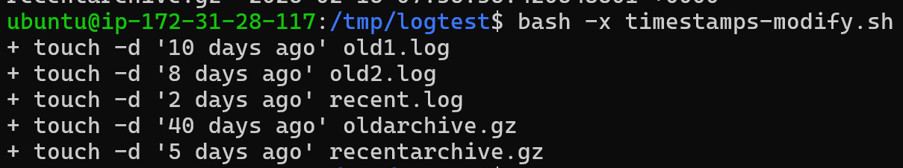
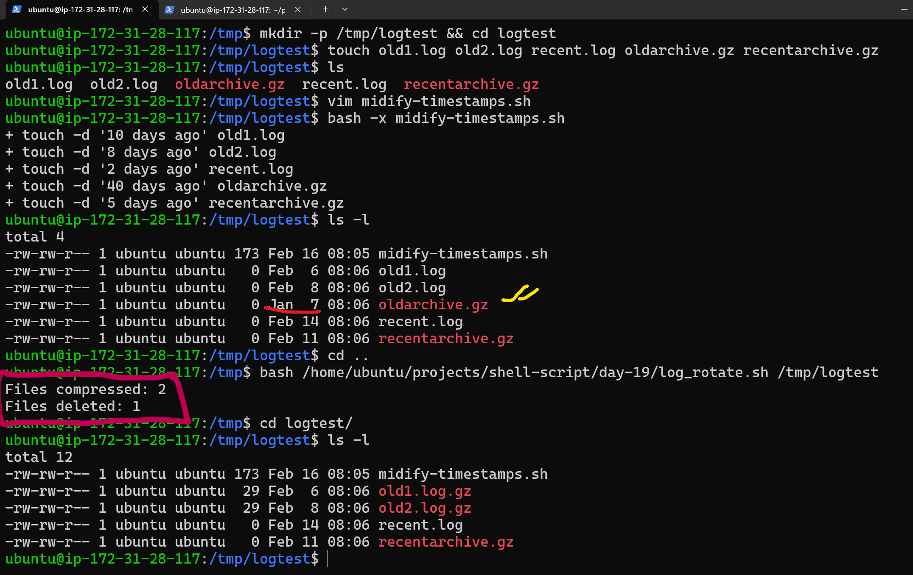
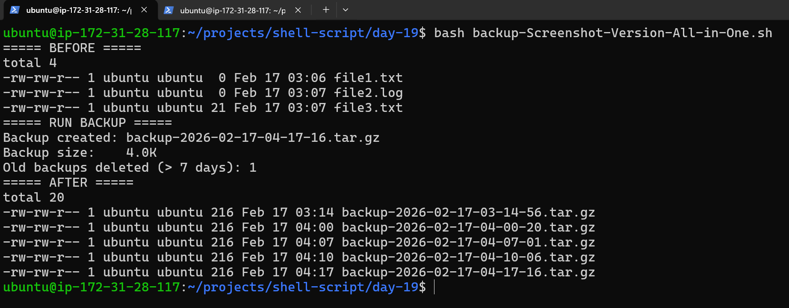

# Day 19 – Shell Scripting Project: Log Rotation, Backup & Crontab

## Task
Apply everything from Days 16–18 in real-world mini projects.

You will:
- Write a **log rotation** script
- Write a **server backup** script
- Schedule them with **crontab**

---

## Expected Output
- A markdown file: `day-19-project.md`
- All scripts you write during the tasks

---

## Challenge Tasks

### Task 1: Log Rotation Script
Create `log_rotate.sh` that:
1. Takes a log directory as an argument (e.g., `/var/log/myapp`)
2. Compresses `.log` files older than 7 days using `gzip`
3. Deletes `.gz` files older than 30 days
4. Prints how many files were compressed and deleted
5. Exits with an error if the directory doesn't exist

---
### Script
```bash
#!/usr/bin/env bash
set -euo pipefail

# ----------------------------
# log_rotate.sh
# Usage: ./log_rotate.sh /path/to/logdir
# ----------------------------

# Check if exactly one argument is provided
if [[ $# -ne 1 ]]; then
    echo "Usage: $0 <log_directory>" >&2
    exit 2
fi

LOG_DIR="$1"

# Check if the directory exists
if [[ ! -d "$LOG_DIR" ]]; then
    echo "Error: Directory does not exist." >&2
    exit 1
fi

# Count .log files older than 7 days and compress them
compressed_count=$(find "$LOG_DIR" -type f -name "*.log" -mtime +7 -print -exec gzip {} + | wc -l)

# Count .gz files older than 30 days and delete them
deleted_count=$(find "$LOG_DIR" -type f -name "*.gz" -mtime +30 -print -exec rm -f {} + | wc -l)

# Print results
echo "Files compressed: $compressed_count"
echo "Files deleted: $deleted_count"

exit 0
```
## Creating a simulate for the script
### Simulate-Script
```bash
# Creat Test directory then creates test files in it

mkdir -p /tmp/logtest && cd /tmp/logtest

touch old1.log old2.log recent.log oldarchive.gz recentarchive.gz

# Set Timestamps

touch -d "10 days ago" old1.log
touch -d "8 days ago" old2.log
touch -d "2 days ago" recent.log
touch -d "40 days ago" oldarchive.gz
touch -d "5 days ago" recentarchive.gz

ls -ls

exit 0
```
$bash -x timestamps-modify.sh




---
### Task 2: Server Backup Script
Create `backup.sh` that:
1. Takes a source directory and backup destination as arguments
2. Creates a timestamped `.tar.gz` archive (e.g., `backup-2026-02-08.tar.gz`)
3. Verifies the archive was created successfully
4. Prints archive name and size
5. Deletes backups older than 14 days from the destination
6. Handles errors — exit if source doesn't exist

### Script
```bash
#!/bin/bash
#
# Enable strict mode for safer scripting
# -e: exit on error
# -u: error on undefined variable
# -o pipefail: catch pipeline failures
set -euo pipefail

: <<'README'
Backup script with cleanup (delete backups older than N days)

Usage:
  ./backup.sh <path to your source> <path to backup folder>
README

usage() {
  echo "Usage: $0 <source_dir> <backup_dir>" >&2
  exit 1
}

# Validate required arguments (must be exactly 2)
(( $# == 2 )) || usage

# Script Arguments
source_dir="$1"   # Directory to back up
backup_dir="$2"   # Directory where backups will be stored

# Backup Settings
#timestamp="$(date '+%Y-%m-%d')"                        # Example: 2026-02-08
timestamp="$(date '+%Y-%m-%d-%H-%M-%S')"               # Example: 2026-02-08-10:45:59
backup_file="${backup_dir}/backup-${timestamp}.tar.gz" # Required format
retention_days=7                                      # Delete backups older than 7 days

# Ensure source directory exists; exit if not found
[[ -d "$source_dir" ]] || { echo "Source directory not found: $source_dir" >&2; exit 1; }

# Create backup directory if it doesn't exist
mkdir -p "$backup_dir"

create_backup() {
  # Create a .tar.gz archive of the source directory
  # -C makes the archive cleaner (stores relative paths, not full absolute paths)
  tar -czf "$backup_file" -C "$(dirname "$source_dir")" "$(basename "$source_dir")"    # List the contents of a gzip-compressed tar archive.

  # Verify the archive exists and is not empty
  if [[ ! -s "$backup_file" ]]; then
    echo "Error: Backup archive was not created successfully: $backup_file" >&2
    exit 1
  fi

  # Print archive name and size
  # Size (human readable)
  archive_size="$(du -h "$backup_file" | awk '{print $1}')"
  echo "Backup created: $(basename "$backup_file")"
  echo "Backup size:    $archive_size"
}

cleanup_old_backups() {
  # Delete backups older than retention_days
  # Also count how many were deleted
  deleted_count=$(find "$backup_dir" -type f -name "backup-*.tar.gz" -mtime +"$retention_days" -print -delete | wc -l)
  echo "Old backups deleted (> ${retention_days} days): $deleted_count"
}

main() {
  create_backup
  cleanup_old_backups
}

main
```
### Output


---

### Task 3: Crontab
1. Read: `crontab -l` — what's currently scheduled?
- It shows currently scheduled cron jobs for the user.

2. Understand cron syntax:
   ```
   * * * * *  command
   │ │ │ │ │
   │ │ │ │ └── Day of week (0-7)
   │ │ │ └──── Month (1-12)
   │ │ └────── Day of month (1-31)
   │ └──────── Hour (0-23)
   └────────── Minute (0-59)
   ```
Example:
```bash
0 2 * * * /path/script.sh
```
Means:

At minute 0

At hour 2

Every day

Every month

Every weekday

→ Runs daily at 2 AM.

4. Write cron entries (in your markdown, don't apply if unsure) for:
   - Run `log_rotate.sh` every day at 2 AM
   - Run `backup.sh` every Sunday at 3 AM
   - Run a health check script every 5 minutes
🕒 What is Cron?

Cron is a Linux scheduler that runs commands automatically at specified times.

Common use cases:

Daily backups

Weekly maintenance

Health checks every few minutes

### Cron Entries
```bash
# Run log_rotate.sh every day at 2 AM
0 2 * * * /home/ubuntu/projects/shell-script/day-19/log_rotate.sh /var/log/myapp >> /var/log/log_rotate.log 2>&1

# Run backup.sh every Sunday at 3 AM
0 3 * * 0 /home/ubuntu/projects/shell-script/day-19/backup.sh /path/source /path/backup >> /var/log/backup.log 2>&1

# Run health check script every 5 minutes
*/5 * * * * /home/ubuntu/projects/shell-script/day-19/health_check.sh >> /var/log/health_check.log 2>&1

```
---

## Task 4: Combine — Scheduled Maintenance Script
Create maintenance.sh that:

- Calls your log rotation function
- Calls your backup function
- Logs all output to /var/log/maintenance.log with timestamps
- Write the cron entry to run it daily at 1 AM

### Script
```bash
#!/usr/bin/env bash
set -euo pipefail

LOG_FILE="$HOME/maintenance.log"

# Function to log messages with timestamp
log() {
    echo "$(date '+%Y-%m-%d %H:%M:%S') - $1" >> "$LOG_FILE"
}

main() {

    log "===== Maintenance Job Started ====="

    # Run Log Rotation
    log "Running log rotation..."
    /home/ubuntu/projects/shell-script/day-19/log_rotate.sh /var/log/myapp >> "$LOG_FILE" 2>&1
    log "Log rotation completed."

    # Run Backup
    log "Running backup..."
    /home/ubuntu/projects/shell-script/day-19/backup.sh /path/source /path/backup >> "$LOG_FILE" 2>&1
    log "Backup completed."

    log "===== Maintenance Job Finished ====="
    echo "" >> "$LOG_FILE"
}

main
```

### Output
```text
2026-02-17 01:00:00 - ===== Maintenance Job Started =====
2026-02-17 01:00:01 - Running log rotation...
Files compressed: 2
Files deleted: 1
2026-02-17 01:00:05 - Log rotation completed.
2026-02-17 01:00:06 - Running backup...
Backup created: backup-2026-02-17.tar.gz
Backup size: 4.0K
Old backups deleted (> 7 days): 1
2026-02-17 01:00:10 - Backup completed.
2026-02-17 01:00:10 - ===== Maintenance Job Finished =====
```

### Cron Entry (Daily at 1 AM)
```bash
0 1 * * * /home/ubuntu/projects/shell-script/day-19/maintenance.sh
```
Meaning:
- Minute 0
- Hour 1
- Every day
- Every month
- Every weekday
- → Runs daily at 1 AM

---
## What I Learned (3 Key Points)

- Strict Mode Improves Reliability
    - Using set -euo pipefail prevents silent failures and makes scripts safer.

- File Validation is Critical
    - Always verify file existence and size (-d, -s) to ensure successful operations.

- Automation Requires Logging
    - Proper logging with timestamps is essential for debugging and production monitoring.

---

[day-19-scripts](day-19-shell-scripts)

[MCQS-day-19-Download and Solve](day-19-mcqs.html)

