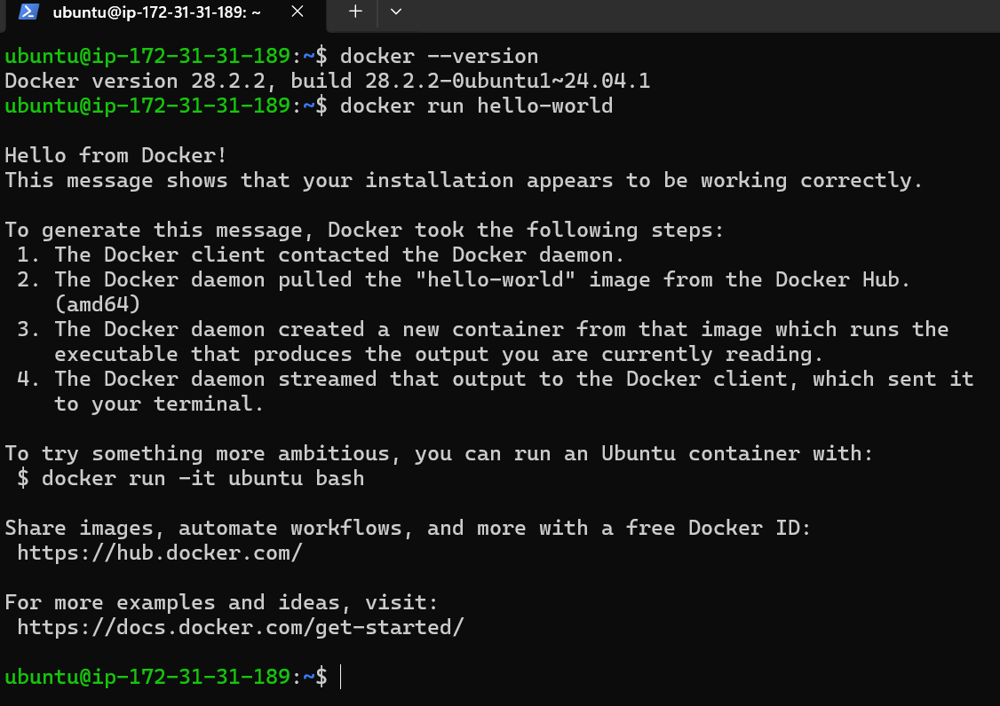
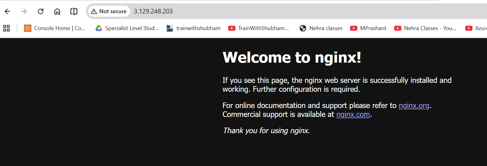

# Day 29 – Docker Basics

---

## Table of Contents

- [Task 1 – Docker Fundamentals](#task-1--docker-fundamentals)
- [Task 2 – Installation & First Run](#task-2--installation--first-run)
- [Task 3 – Running Real Containers](#task-3--running-real-containers)
- [Task 4 – Exploration](#task-4--exploration)
- [Task 5 – Cleanup](#task-5--cleanup)

---

# Task 1 – Docker Fundamentals


| Topic               | Key Points                                        |
| ------------------- | ------------------------------------------------- |
| Container           | Lightweight package with app + dependencies       |
| Why Containers      | Solve “It works on my machine” problem            |
| VM vs Container     | VMs include full OS, containers share host kernel |
| Docker Architecture | Client → Daemon → Registry → Image → Container    |


## 1. What is a Container and Why Do We Need Them? 
### A container is a lightweight, standalone package that includes:
- Application code
- Runtime
- System libraries
- Dependencies
It runs consistently across different environments.

### Why Do We Need Containers?
Before containers:
- Code worked on developer machines
- Failed in testing or production
- Environment differences caused issues

This was called:

“It works on my machine” problem.

Containers solve this by packaging everything the application needs to run, 

ensuring consistency across Development, Testing, and Production.

---

## 2. Containers vs Virtual Machines (Real Difference)
### Virtual Machines (VMs)
- Include a full Operating System
- Each VM runs on a hypervisor
- Heavy and resource-intensive
- Slow to start

Structure:

Hardware
→ Hypervisor
→ Guest OS
→ Application

---

### Containers
- Share the host OS kernel
- Do not include a full OS
- Lightweight and fast
- Start in seconds

Structure:

Hardware
→ Host OS
→ Docker Engine
→ Containers

---

### Key Difference

| Feature        | VM          | Container   |
| -------------- | ----------- | ----------- |
| OS Included    | Yes         | No          |
| Size           | Large (GBs) | Small (MBs) |
| Startup Time   | Minutes     | Seconds     |
| Performance    | Slower      | Faster      |
| Resource Usage | High        | Low         |

Containers are more efficient and better suited for microservices and cloud environments.

---

## 3. What is Docker Architecture?
### Docker follows a client-server architecture.
Main Components:

### Docker Client
- Command-line tool (docker)
- Sends commands to Docker Daemon
Example:
- `docker run`
- `docker build`

---

### Docker Daemon (dockerd)
- Background service
- Manages:
  - Images
  - Containers
  - Networks
  - Volumes

- Executes commands from client

---

### Docker Image
- Read-only template
- Blueprint used to create containers

---

### Docker Registry
- Stores Docker images
- Example: Docker Hub
- Can be public or private

---

## 4. Docker Architecture – In My Own Words

When I type a command like:
```code
docker run nginx
```
Here’s what happens:

1. The Docker Client sends the command.
2. The Docker Daemon receives it.
3. The daemon checks if the image exists locally.
4. If not, it pulls the image from a Docker Registry.
5. It creates a container from the image.
6. The container starts running.

So in simple terms:

Client → Daemon → Registry (if needed) → Image → Container

Docker acts like a manager that builds, stores, and runs application packages efficiently.

---
### Why This Matters for DevOps

Docker is the foundation of:
- CI/CD pipelines
- Kubernetes
- Microservices
- Cloud-native architecture

Without containers, modern DevOps workflows would not exist.

# Task 2 – Installation & First Run

| Command                  | Purpose                   |
| ------------------------ | ------------------------- |
| `docker --version`       | Check Docker installation |
| `docker info`            | Verify daemon is running  |
| `docker run hello-world` | Test container execution  |


### Step 1: Install Docker

### Ubuntu (Linux)
```bash
sudo apt update
sudo apt install docker.io -y
sudo systemctl enable --now docker
```
allow running without sudo
```bash
sudo usermod -aG docker $USER
newgrp docker
```
### Step 2: Verify Installation
```bash
docker --version
```
```text
ubuntu@ip-172-31-31-189:~$ docker --version
Docker version 28.2.2, build 28.2.2-0ubuntu1~24.04.1
ubuntu@ip-172-31-31-189:~$
```
This confirms Docker is installed successfully.

It can also verify daemon status:
```bash
docker info
```
If Docker daemon is not running, this command will show an error.

---

### Step 3: Run First Container

```bash
docker run hello-world
```

---

### What Happened Behind the Scenes?
When I ran:
```bash
docker run hello-world
```
Docker performed the following steps:
- The Docker Client sent the request to the Docker Daemon.
- The daemon checked if the hello-world image existed locally.
- Since it was not found, Docker pulled the image from Docker Hub.
- The daemon created a container from the image.
- The container ran and printed a success message.
- The container exited.

---

### Expected Output Message
```text
Hello from Docker!
This message shows that your installation appears to be working correctly.

To generate this message, Docker took the following steps:
 1. The Docker client contacted the Docker daemon.
```
This confirms:
- Docker Client is working
- Docker Daemon is running
- Docker can pull images from Docker Hub
- Containers can be created and executed



---

## What I Learned
- Docker uses a client-server architecture.
- Images are pulled automatically if not available locally.
- A container can run and exit immediately.
- The docker run command creates and starts a container.

---

# Task 3 – Running Real Containers

| Command                          | Purpose                                   |
| -------------------------------- | ----------------------------------------- |
| `docker run -d -p 8080:80 nginx` | Run Nginx in background with port mapping |
| `docker run -it ubuntu`          | Interactive Ubuntu container              |
| `docker ps`                      | List running containers                   |
| `docker ps -a`                   | List all containers                       |
| `docker stop <name>`             | Stop container                            |
| `docker rm <name>`               | Remove container                          |


### 1. Run an Nginx Container and Access It in Browser

Step 1: Run Nginx in Detached Mode with Port Mapping
```bash
docker run -d -p 80:80 --name my-nginx nginx
```
What This Means:
- -d → Run in detached mode (background)
- -p 80:80 → Map host port 80 to container port 80
- --name my-nginx → Assign custom name
- nginx → Image name

---

### Step 2: Open in Browser
```bash
http://3.129.248.203:80
```


That means:
- Container is running
- Port mapping works
- Docker networking is functioning

---

### 2. Run Ubuntu Container in Interactive Mode
```bash
docker run -it --name my-ubuntu ubuntu
```
### What This Means:

- -it → Interactive + terminal mode
- --name my-ubuntu → Name of container
- ubuntu → Base image

Docker will:
- Pull Ubuntu image (if not present)
- Start container
- Drop you into a shell
```text
root@container-id:/#
```
Now explore like a mini Linux machine:
```bash
ls
pwd
apt update
cat /etc/os-release
```
To exit:
```bash
exit
```


After exiting, the container stops.

---

### 3. List Running Containers
```bash
docker ps
```

This shows:
- Container ID
- Image
- Status
- Ports
- Names

---

### 4. List All Containers (Including Stopped)
```bash
docker ps -a
```
This shows:
- Running containers
- Stopped containers
- Exited containers

---

### 5. Stop and Remove a Container
Stop:
```bash
docker stop my-nginx
```
Remove:
```bash
docker rm my-nginx
```
If container is running and you want to force remove:
```bash
docker rm -f my-nginx
```

---

What I Learned
- Detached mode (-d) runs containers in background.
- Interactive mode (-it) allows shell access.
- Port mapping (-p) connects container to host.
- Containers must be stopped before removal.
- docker ps vs docker ps -a difference.

---

# Task 4 – Exploration

| Feature             | Command                       |
| ------------------- | ----------------------------- |
| Detached Mode       | `docker run -d nginx`         |
| Custom Name         | `--name my-container`         |
| Port Mapping        | `-p host:container`           |
| View Logs           | `docker logs <name>`          |
| Live Logs           | `docker logs -f <name>`       |
| Exec into Container | `docker exec -it <name> bash` |


---

### 1. . Run a Container in Detached Mode
```bash
docker run -d nginx
```
### What’s Different?
- -d = Detached mode
- Container runs in the background
- Terminal is not blocked
- You don’t see live logs immediately

To verify it’s running:
```bash
docker ps
```
### Difference from interactive mode:

- -it attaches your terminal
- -d runs silently in background

---

### 2. Give a Container a Custom Name
```bash
docker run -d --name web-server nginx
```
Instead of using random container IDs, you now refer to it by name:
```bash
docker stop web-server
docker rm web-server
```
This makes container management easier and more professional.

---

### 3. Map a Port from Container to Host
```bash
docker run -d -p 8080:80 --name nginx-port nginx
```

### What This Means:
- 8080 → Host port
- 80 → Container port

Now open:
```Code
http://localhost:8080
```
You should see the Nginx welcome page.

**Without -p**, the container runs but is not accessible from your browser.

---

### 4. Check Logs of a Running Container
```bash
docker logs nginx-port
```
To follow logs live:
```bash
docker logs -f nginx-port
```
This is useful when debugging applications.

---

### 5. Run a Command Inside a Running Container
```bash
docker exec -it nginx-port bash
```
Now you are inside the container.

Apply:
```bash
ls
cat /etc/os-release
```

To exit:
```bash
exit
```
Important:
- docker exec runs a command inside an already running container.
- This is different from docker run, which creates a new container.

---

## What I Learned in Task 4
- Detached mode runs containers in background.
- Naming containers makes management easier.
- Port mapping exposes services to host.
- Logs help debug running containers.
- `docker exec` allows access to running containers.

---

# Task 5 – Cleanup

| Task                        | Command                       |
| --------------------------- | ----------------------------- |
| Stop all running containers | `docker stop $(docker ps -q)` |
| Remove stopped containers   | `docker container prune`      |
| Remove unused images        | `docker image prune -a`       |
| Check disk usage            | `docker system df`            |
| Full cleanup (careful!)     | `docker system prune -a`      |


---

### 1. Stop All Running Containers (One Command)
```bash
docker stop $(docker ps -q)
```
What This Does:
- docker ps -q → Returns only container IDs of running containers
- $(...) → Passes those IDs into docker stop

This stops all running containers at once.

---

### 2. Remove All Stopped Containers
```bash
docker container prune
```
It will ask for confirmation:
```text
Are you sure you want to continue? [y/N]
```
Press y.

---

### Alternative (Manual Method)
```bash
docker rm $(docker ps -aq)
```
- docker ps -aq → Lists all container IDs (including stopped)

---

### 3. Remove Unused Images

Remove dangling images:
```bash
docker image prune
```
Remove all unused images:
```bash
docker image prune -a
```

---

### 4. Check Docker Disk Usage
```bash
docker system df
```
This shows:
- Space used by images
- Space used by containers
- Space used by volumes
- Reclaimable space

---

### Bonus: Clean Everything (Careful!)
```bash
docker system prune -a
```
Removes:
- Stopped containers
- Unused networks
- Dangling images
- Unused images (with -a)

⚠️ Use carefully in production environments.

---

# What I Learned in Task 5
- Docker consumes disk space quickly if not cleaned.
- Containers and images must be managed properly.
- Prune commands help maintain a clean system.
- DevOps engineers must regularly clean build environments.

---

# Day 29 Summary

Today I:
- Learned what containers are
- Understood Containers vs VMs
- Explored Docker architecture
- Installed Docker
- Ran my first container
- Used interactive and detached modes
- Managed container lifecycle
- Cleaned up Docker resources

