# Day 30 – Docker Images & Container Lifecycle

## Detailed Task Overview

## Detailed Task Overview

| Task | What I Did | What I Observed | Why It Matters |
|------|------------|----------------|----------------|
| [Task 1](#task-1--docker-images) | Pulled nginx, ubuntu, alpine | Alpine much smaller than Ubuntu | Minimal base images reduce attack surface and size |
| [Task 2](#task-2---image-layers) | Ran docker image history nginx | Some layers have size, some show 0B | Docker uses layered filesystem for caching and reuse |
| [Task 3](#task-3---container-lifecycle) | Practiced full container lifecycle | State changes visible via docker ps -a | Containers depend on main process lifecycle |
| [Task 4](#task-4---working-with-running-containers) | Executed commands inside running nginx container | Found IP (172.17.0.2), port mapping, no mounts | Containers run in isolated networks with optional volumes |
| [Task 5](#task-5---cleanup) | Cleaned up containers and images | docker system df shows reclaimed space | Proper cleanup prevents disk bloat |

## Goal
Understand how Docker images and containers work in practice:
- relationship between images and containers
- image layers + caching
- full container lifecycle
- inspection, logs, and cleanup

---

## 1) Images vs Containers (relationship)

**Image:** a read-only template (filesystem + metadata).  
**Container:** a running (or stopped) instance of an image with a writable layer.

---

# Task 1 – Docker Images

---

## 1. Pull an image
```bash
docker pull nginx
docker pull ubuntu
docker pull alpine
```
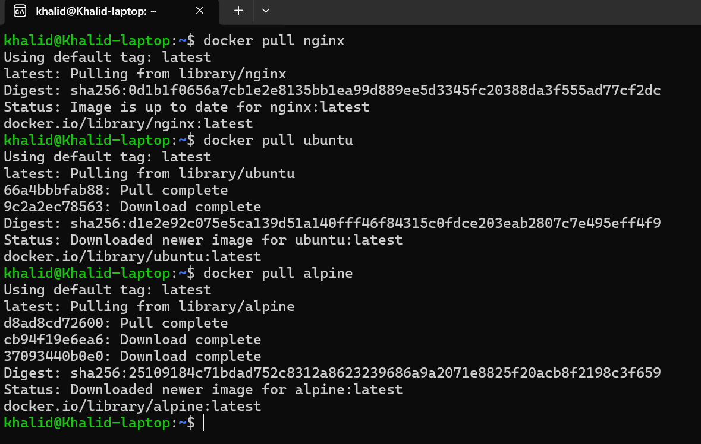

---

## 2. List All Images & Note Sizes
```bash
docker images
```
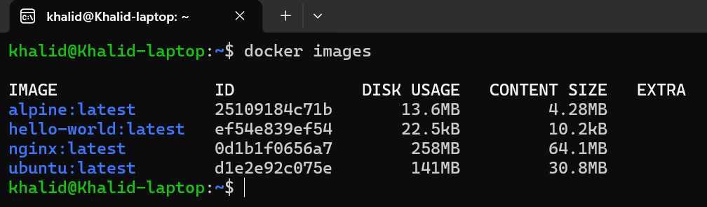

---

## 3. Compare Ubuntu vs Alpine (Why is Alpine Smaller?)

Here’s the key difference:

### Ubuntu
- Full-featured Linux distribution
- Includes many system libraries
- Uses glibc
- Designed for general-purpose OS usage
- Larger base system

### Alpine
- Minimal Linux distribution
- Uses musl libc instead of glibc
- Designed specifically for containers
- Very few preinstalled packages
- Much smaller attack surface
- Faster to download & start

### Why Alpine is much smaller:
- Fewer default packages
- Lightweight C library (musl)
- Built specifically for minimal container environments

That’s why you’ll often see Alpine used in production Dockerfiles.

---

## Inspect an Image
Let’s inspect Ubuntu:
```bash
docker inspect ubuntu --format 'ID={{.Id}}
Created={{.Created}}
OS/Arch={{.Os}}/{{.Architecture}}
Cmd={{.Config.Cmd}}
EnvCount={{len .Config.Env}}'
```
```text
ID=sha256:d1e2e92c075e5ca139d51a140fff46f84315c0fdce203eab2807c7e495eff4f9
Created=2026-02-10T16:52:29.863103331Z
OS/Arch=linux/arm64
Cmd=[/bin/bash]
EnvCount=1
```
When inspecting the ubuntu image, I observed:
- The image ID (SHA256 digest)
- Creation timestamp
- OS and architecture (linux/arm64)
- Default command (/bin/bash)
- Environment variables

This shows that images store metadata such as architecture, default startup command, and configuration details.

---

## Remove an image you no longer need
```bash
docker images
docker rmi hello-world
docker images
```


---

# Task 2 - Image Layers    

## 1. Run Image History
```bash
docker image history nginx
```


---

## What Do You See in docker image history nginx?

### Each Line = One Layer
Every line corresponds to:
- A Dockerfile instruction
- A filesystem or metadata change

For example in your output:
- 109MB → Base Debian layer
- 84.5MB → Installing nginx and packages
- COPY ... → Adding scripts
- CMD, ENV, EXPOSE, ENTRYPOINT → 0B metadata layers

---

## Why Some Layers Have Size and Some Show 0B
### Layers with Size (Filesystem Changes)
These modify the filesystem:
- `RUN apt install ...`
- `COPY file.sh ...`
- `ADD ...`

They add files → so they have measurable size.

Example :
```bash
109MB   debian base
84.5MB  RUN install nginx
16.4kB  COPY script
```
---

### 0B Layers (Metadata Only)

These modify image configuration but do NOT change files:
- CMD
- ENV
- EXPOSE
- ENTRYPOINT
- LABEL
- WORKDIR (usually)

They don’t add files → so they show 0B.

---
## What Are Layers?

Docker images are built from multiple read-only layers.
Each layer represents a change created by a Dockerfile instruction.
Layers are stacked on top of each other to form the final image.
When a container runs, Docker adds a writable layer on top.

---

## Why Does Docker Use Layers?
From nginx example, this becomes clear.

1️. Storage Efficiency

If another image uses Debian trixie:
- Docker reuses the 109MB layer
- It does not download it again

---

2. Build Caching

If developers change only one script:
- Docker rebuilds only that layer
- Reuses all previous layers

This makes builds much faster.

---

3. Faster Push & Pull

When pushing to Docker Hub:
- Only new layers are uploaded
- Existing layers are reused

---

4. Layer Sharing

Multiple images can share:
- Same base OS
- Same package layers

This reduces disk usage.

---

## Final Notes: 

Running docker image history nginx showed multiple layers.
Each line represents a Dockerfile instruction.
Some layers have size because they modify the filesystem (e.g., RUN, COPY).
Some layers show 0B because they only modify metadata (e.g., CMD, ENV, EXPOSE, WORKDIR).

Docker uses layers for:
- `caching`
- `storage efficiency`
- `faster builds`
- `shared base images`
- `faster image distribution`

---

# Task 3 - Container Lifecycle  

Using `ubuntu` for this demo.

## 1. Create a Container (Without Starting)
```bash
docker create --name day30-lifecycle ubuntu sleep 300
```
Why sleep 300?
- So when it starts, it doesn’t exit immediately.

Now check:
```bash
docker ps -a
```
```text
STATUS: Created
```
## 2. Start the Container
```bash
docker start day30-lifecycle
docker ps -a
```
## 3. Pause the Container:
```bash
docker pause day30-lifecycle
docker ps 
```
This freezes the container’s processes (CPU suspended).

## 4️. Unpause the Container
```bash
docker unpause day30-lifecycle
docker ps 
```
## 5. Stop the Container
```bash
docker stop day30-lifecycle
docker ps -a
```
Stop sends SIGTERM (graceful shutdown).

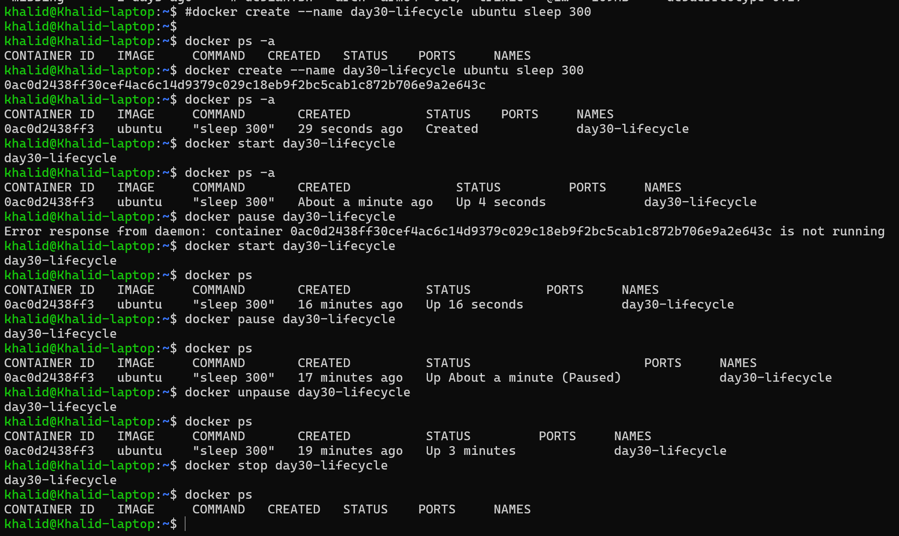

---

## 6️. Restart the Container
```bash
docker restart day30-lifecycle
docker ps -a
```
Restart = stop + start.

## 7️. Kill the Container
```bash
docker kill day30-lifecycle
docker ps -a
```
Kill sends SIGKILL (force stop).

Difference:
- stop = graceful
- kill = immediate

---

## 8️. Remove the Container
Make sure it’s stopped:

then Remove
```bash
docker rm day30-lifecycle
docker ps -a
```
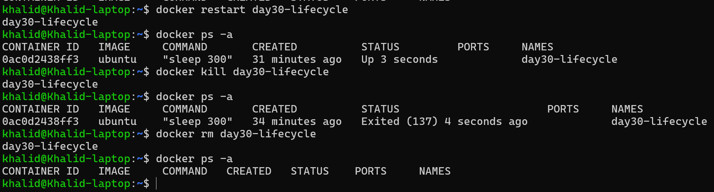


---

## A container lifecycle includes:
- create (container exists but not running)
- start (running state)
- pause (processes frozen)
- unpause (resumes execution)
- stop (graceful shutdown)
- restart (stop + start)
- kill (force stop)
- rm (remove container)
### I observed state changes using docker ps -a after each step.

### I practiced the full container lifecycle using docker ps -a to observe state changes.
- "`docker create` created the container in Created state (exists but not running)."
- "`docker start` moved it to Running (Up)."
- "`docker pause` froze processes and showed (Paused) in status."
- "`docker unpause` resumed execution back to Up."
- "`docker stop` gracefully stopped it to Exited."
- "`docker restart` performed stop + start, returning to Up."
- "`docker kill` force-stopped it and showed Exited (137)."
- "`docker rm` removed the container so it no longer appears in docker ps -a."

---
# Task 4 - Working with Running Containers 
1) Run an Nginx container in detached mode

Use a clear name + port mapping:
```bash
docker run -d --name day30-nginx -p 80:80 nginx
docker ps
```
Quick test:
```bash
curl -I http://localhost:80
```
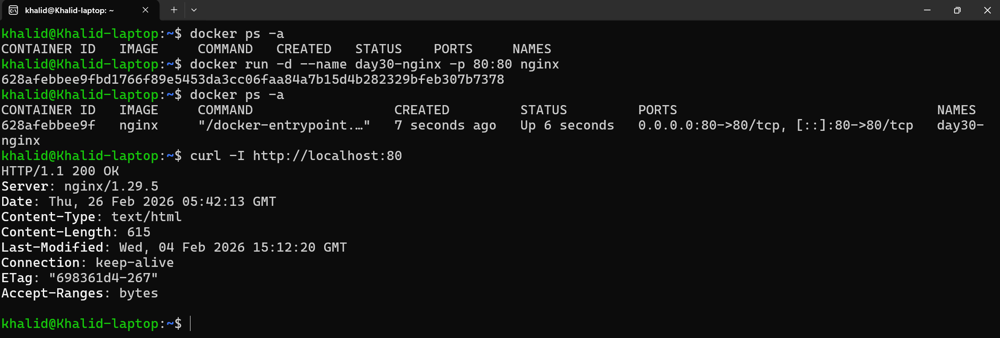

---

2) View its logs
```bash
docker logs day30-nginx
```
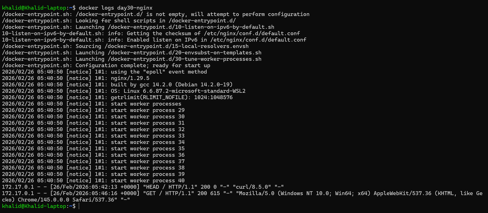

---

3) View real-time logs (follow mode)
```bash
docker logs -f day30-nginx
```
```bash
curl http://localhost:80 > /dev/null
```
(Press Ctrl+C to stop following.)
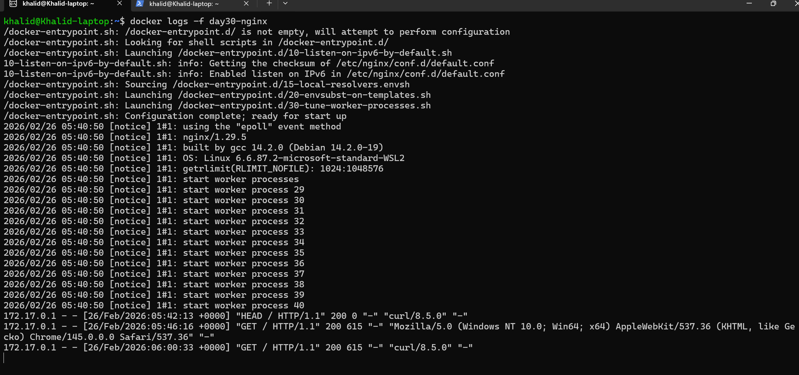

---

4) Exec into the container and explore filesystem

Start a shell inside the container:
```bash
docker exec -it day30-nginx /bin/sh
```
Inside the container, try:
```bash
ls /
ls -lah /usr/share/nginx/html
cat /etc/os-release
nginx -v
exit
```
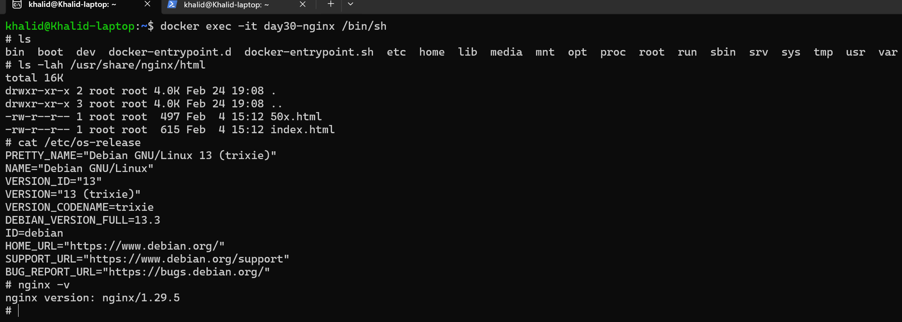

---

5) Run a single command inside the container (no interactive shell)
```bash
docker exec day30-nginx ls -lah /usr/share/nginx/html
```
check processes:
```bash
docker exec day30-nginx ps aux
```
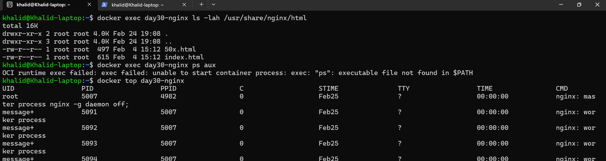

---
6) Inspect container: IP address, port mappings, mounts

B) IP address (formatted)
```bash
docker inspect -f '{{range .NetworkSettings.Networks}}{{.IPAddress}}{{end}}' day30-nginx
```

C) Port mappings (formatted)
```bash
docker port day30-nginx
```

D) Mounts (formatted)
```bash
docker inspect -f '{{json .Mounts}}' day30-nginx
```


prints [], that’s normal — it means no extra mounts/volumes were attached.

---

### I inspected the running nginx container and found:

- "IP Address: 172.17.0.2 (Docker bridge network)"
- "Port Mapping: Host 80 → Container 80"
- "Mounts: [] (no volumes attached)"

This shows that the container is running on Docker’s default bridge network and exposing port 80 to the host system.

---
## I Learned
- `-d` runs container in background
- `docker logs` shows container stdout/stderr
- `docker logs -f` streams logs live
- `docker exec -it` gives interactive shell
- `docker exec <cmd>` runs single command
- `docker inspect` reveals:
  - Networking
  - Port mappings
  - Volumes
  - Configuration
  - Metadata

---

# Task 5 - Cleanup 
1️. Stop All Running Containers (One Command)
```bash
docker stop $(docker ps -q)
```

What this does:
- docker ps -q → returns IDs of running containers
- docker stop $(...) → stops all of them

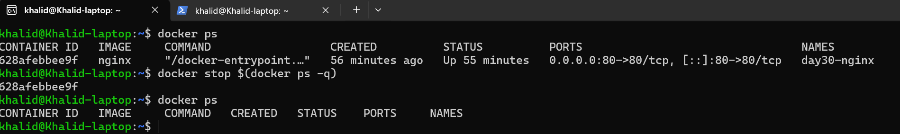

---

2️. Remove All Stopped Containers (One Command)
```bash
docker rm $(docker ps -aq)
```
What this does:
- docker ps -aq → returns IDs of all containers
- docker rm → removes them

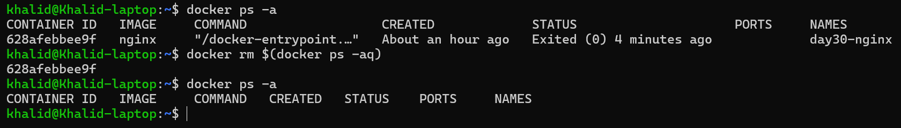

---

3️. Remove Unused Images

To remove dangling images:
```bash
docker image prune
```
To remove all unused images (stronger cleanup):
```bash
docker image prune -a
```

Or the all-in-one cleanup:
```bash
docker system prune
```
⚠️ This removes:
- stopped containers
- unused networks
- dangling images
- build cache


---

4️. Check Docker Disk Usage
```bash
docker system df
```
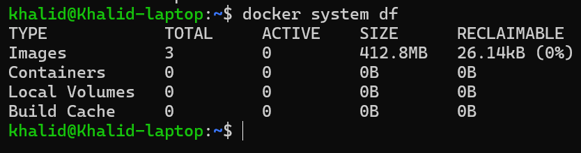

Tip (Very Useful)

If docker stop $(docker ps -q) gives an error when no containers are running, that’s normal — it just means there was nothing to stop.

---

## What I Learned in Task 5
- How to stop multiple containers at once
- How to remove containers in bulk
- Difference between:
  - image prune
  - system prune

- How to inspect Docker storage usage
- How to reclaim disk space safely

