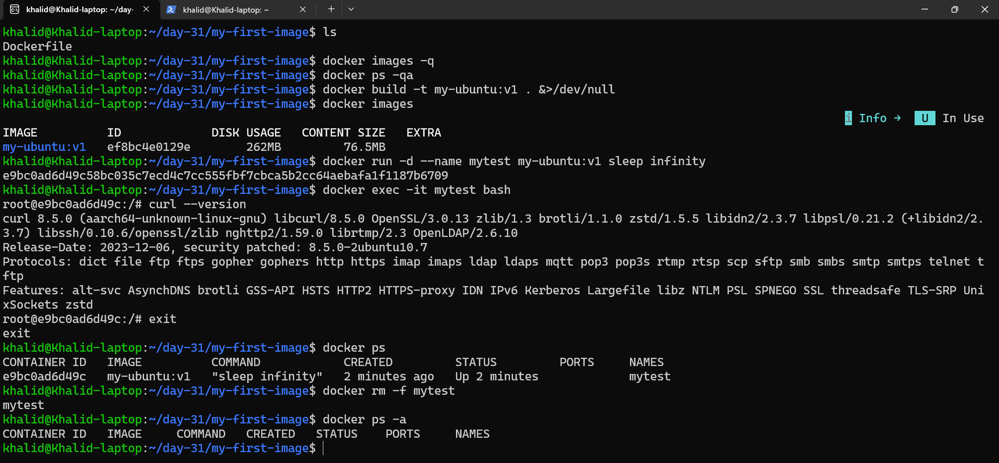
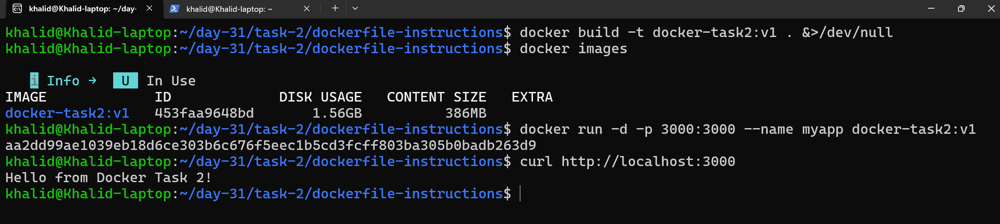
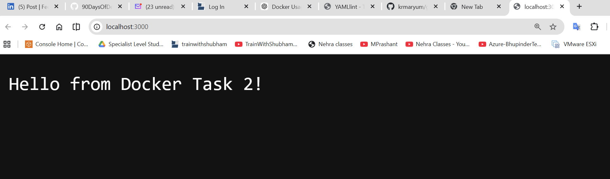
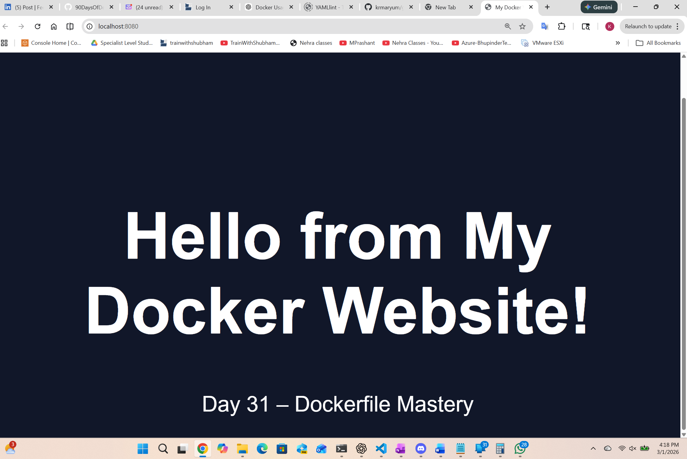
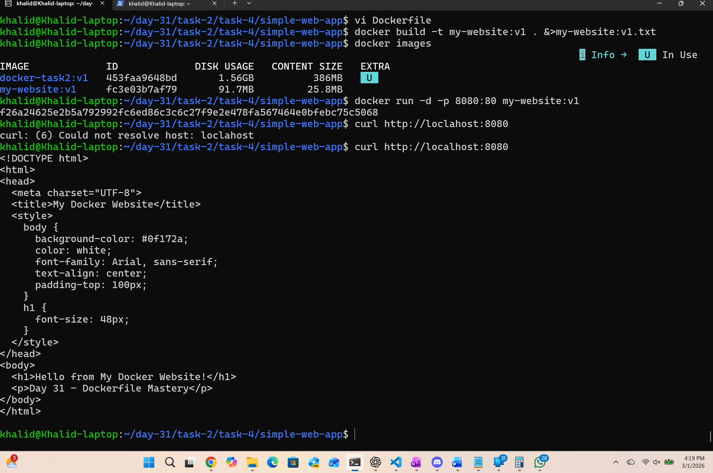
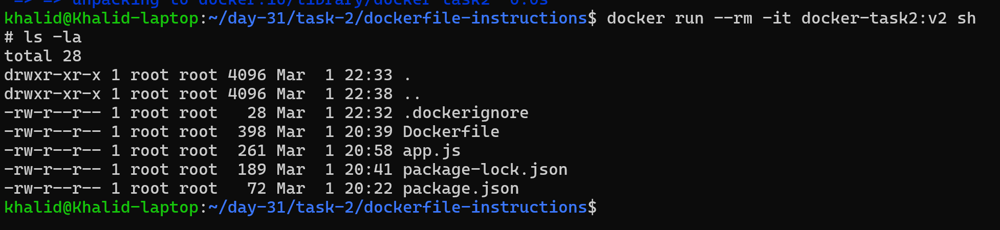

# Day 31 – Dockerfile: Build Your Own Images

## Task 1: My First Dockerfile

### What I built
- Created a custom Docker image using `ubuntu` as the base
- Installed `curl`
- Set the default command to print: `Hello from my custom image!`

### Files created
- `my-first-image/Dockerfile`

### Dockerfile
```dockerfile
# Use Ubuntu as base

FROM ubuntu:latest

# Avoid interactive prommpts during apt installs
# It forces package installation to run in non-interactive (automatic) mode — which is essential for reliable Docker builds.

ENV DEBIAN_FRONTEND=noninteractive

# Install curl
# Updates package metadata, Installs curl and Cleans up unnecessary cache.

RUN apt-get update && apt-get install -y curl && rm -rf /var/lib/apt/lists/*

# Default command prints the requried message

CMD ["echo", "Hello from my custom image!"]
```
Lists only the image IDs (quiet mode).
```bash
docker images -q
```
Lists IDs of all containers (running and stopped).
```bash
docker ps -qa
```
Builds the image with a tag and hides all build output (stdout + stderr).
```bash
docker build -t my-ubuntu:v1 . &>/dev/null
```
Shows all locally available Docker images.
```bash
docker images
```
uns a container in detached mode with a custom name and keeps it running indefinitely.
```bash
docker run -d --name mytest my-ubuntu:v1 sleep infinity
```
Opens an interactive bash shell inside the running container.
```bash
docker exec -it mytest bash
```
Shows currently running containers.
```bash
docker ps
```
Forcefully stops and removes the specified container.
```bash
docker rm -f mytest
```
Lists all containers, including stopped ones.
```bash
docker ps -a
```



---

## Task 2: Dockerfile Instructions

### Goal
Create a Dockerfile using:
- FROM
- RUN
- COPY
- WORKDIR
- EXPOSE
- CMD

### Result
Built a simple Node.js web server running on port 3000.

### Build
docker build -t docker-task2:v1 .

### Run
docker run -p 3000:3000 docker-task2:v1

---

### Folder Structure:
Inside 2026/day-31/ create:
```code
task-2/dockerfile-instructions/
  Dockerfile
  app.js
  package.json
  ```
  ---

### 1️. Create `app.js`
```JavaScript
const http = require("http");

const server = http.createServer((req, res) => {
  res.writeHead(200, { "Content-Type": "text/plain" });
  res.end("Hello from Docker Task 2!\n");
});

server.listen(3000, () => {
  console.log("Server running on port 3000");
});

```
### 2. Create `package.json`
```JSON
{
  "name": "docker-task-2",
  "version": "1.0.0",
  "main": "app.js"
}
```

---

### 3. Dockerfile (Uses ALL Required Instructions)
Create `dockerfile-instructions/Dockerfile`
```dockerfile
# FROM — Base image
FROM node:18

# WORKDIR — Set working directory inside container
WORKDIR /app

# COPY — Copy package files first (better layer caching)
COPY package.json package-lock.json ./

# RUN — Execute commands during build
RUN npm install

# COPY — Copy remaining files
COPY . .

# EXPOSE — Document the port the app uses
EXPOSE 3000

# CMD — Default command when container runs
CMD ["node", "app.js"]
```

---

Builds the Docker image with a tag and suppresses all build output.
```bash
docker build -t docker-task2:v1 . &>/dev/null
```
Runs the container in detached mode, maps port 3000, and assigns it a name.
```bash
docker run -d -p 3000:3000 --name myapp docker-task2:v1
```
Sends an HTTP request to verify the running application response.
```bash
curl http://localhost:3000
```




---

## What Each Line Does (Important — Understand This)
### FROM
Defines base image (Node 18 with Linux).

### WORKDIR
Creates and switches into /app directory inside container.

### COPY
Copies files from your host into the image.

### RUN
Executes commands during image build (creates image layers).

### EXPOSE
Documents the port the container listens on (does NOT publish it).

### CMD
Default command when container starts.

---

## Task 3: CMD vs ENTRYPOINT

### CMD
- Provides a default command
- Can be overridden at runtime
- Best for flexible containers

Example:
docker run image echo hi

### ENTRYPOINT
- Sets the main executable
- Arguments passed at runtime are appended
- Used when container should always run a specific program

Example:
ENTRYPOINT ["echo"]
docker run image hello
# becomes: echo hello

### When To Use Each

Use CMD:
- When you want a default behavior that users can override
- Development images
- Utility containers

Use ENTRYPOINT:
- When building production images
- When container should behave like a single executable
- CLI-style containers

## Real-World Rule
Use:
```Code
ENTRYPOINT → fixed executable
CMD → default arguments
```
Example pattern:
```dockerfile
ENTRYPOINT ["node"]
CMD ["app.js"]
```
This allows:
```Code
docker run image other.js
```

---

## Task 4: Build a Simple Web App Image

### Goal
Build a static website using Nginx and Docker.

### Steps
- Created custom index.html
- Used nginx:alpine as base image
- Copied HTML file into /usr/share/nginx/html/
- Built image: my-website:v1
- Ran container with port mapping

### Build
docker build -t my-website:v1 .

### Run
docker run -p 8080:80 my-website:v1

Access at:
http://localhost:8080

---

### Create index.html
```HTML
<!DOCTYPE html>
<html>
<head>
  <meta charset="UTF-8">
  <title>My Docker Website</title>
  <style>
    body {
      background-color: #0f172a;
      color: white;
      font-family: Arial, sans-serif;
      text-align: center;
      padding-top: 100px;
    }
    h1 {
      font-size: 48px;
    }
  </style>
</head>
<body>
  <h1>Hello from My Docker Website!</h1>
  <p>Day 31 – Dockerfile Mastery</p>
</body>
</html>
```
---

### 2. Create Dockerfile
```dockerfile
# Use lightweight Nginx base image
FROM nginx:alpine

# Remove default nginx static files
RUN rm -rf /usr/share/nginx/html/*

# Copy our custom HTML file into nginx web directory
COPY index.html /usr/share/nginx/html/

# Expose port 80 (documentation purpose)
EXPOSE 80

# Nginx already has default CMD, so we don't need to define one
```

---





---
---

## Task 5: .dockerignore

Created a .dockerignore file with:

node_modules
.git
*.md
.env

### Why?
To prevent unnecessary files from being sent in the build context.

### Verification
- Built image docker-task2:v2
- Confirmed ignored files are not present inside container
- Observed smaller build context size

## Real World Insight
`.dockerignore` is extremely important because:
- `node_modules` can be hundreds of MB
- `.git` exposes repo history
- `.env` may contain secrets
- Markdown/docs don’t belong in production images

Every serious production Dockerfile has .dockerignore.



---

## Task 6: Build Optimization

### Docker cache behavior
Docker builds images in layers. If a layer’s instruction and its inputs haven't changed, Docker reuses the cached layer instead of rebuilding it.

### Optimization applied
Reordered Dockerfile so that rarely changing steps (like installing dependencies) happen before frequently changing steps (like copying app source code).

### Why layer order matters for build speed
Because when one layer changes, Docker must rebuild that layer and every layer after it. Putting frequently changing lines last preserves cache for expensive steps (like `apt-get` or `npm install`) and makes rebuilds much faster.

### What Task 6 REALLY Wants
It wants you to:
1. Build an image
2. Change something small
3. Build again
4. Notice Docker using cache
5. Reorder Dockerfile to make rebuilds faster
6. Explain why order matters

“Docker builds images in layers…”

“If one layer changes, all layers after it rebuild…”

“Put frequently changing lines last…”

### Docker rebuilds from the changed layer downward.
