# Day 32 – Docker Volumes & Networking

Goal: fix two real-world problems in Docker: **data persistence** (volumes/bind mounts) and **container-to-container communication** (user-defined networks).

---

## Table of Contents

| Task | Link |
|-----|-----|
| Task 1 – The Problem (Ephemeral containers) | [Go to Task 1](## Task 1: The Problem (Ephemeral containers)) |
| Task 2 – Task 2: Fix persistence with a Named Volume | [Go to Task 2](## Task 2: Fix persistence with a Named Volume) |
| Task 3 – Task 3: Bind Mount (host path ↔ container path) | [Go to Task 3](## Task 3: Bind Mount (host path ↔ container path)) |
| Task 4 – Container Networking | [Go to Task 4](#task-4-container-networking) |
| Task 5 – Task 5: Custom Networks (containers talking to each other) | [Go to Task 5](## Task 5: Custom Networks (containers talking to each other)) |
| Task 6 – Task 6: Put It Together (Network + DB Volume + App Container) | [Go to Task 6](## Task 6: Put It Together (Network + DB Volume + App Container)) |

---

## Task 1: The Problem (Ephemeral containers)
“Ephemeral” means temporary.

Containers are considered ephemeral because their filesystem is temporary.
If a container is removed, all data stored inside the container is lost unless
it is stored in a Docker volume or bind mount.

They are not meant to run the main application. Instead, they are used to:
- Inspect a running Pod
- Execute troubleshooting commands
- Check logs
- Use diagnostic tools

Once the task is complete, the ephemeral container is removed.

### Example:
If a container in a Kubernetes Pod is failing and you cannot access it directly, you can attach an ephemeral container to debug the issue without restarting the Pod.

They are mainly used in Kubernetes environments for live debugging.

---

### 1A) Run Postgres **without** a volume

Start a Postgres container (no volume):

```bash
docker run -d --name pg-no-volume \
-e POSTGRES_PASSWORD=pass \
-p 5432:5432 \
postgres:16
```
So the credentials are:
- Username: `postgres`
- Password: `pass`

### If need to set a custom admin user
```bash
docker run -d --name pg-no-volume \
-e POSTGRES_USER=admin \
-e POSTGRES_PASSWORD=pass \
-p 5432:5432 \
postgres:16 
```
Now:
- Username: `admin`
- Password: `pass`

1. Enter the Postgres container interactive shell:
```bash
docker exec -it pg-no-volume psql -U postgres
```
postgres is the database username.
### Command parts
- `docker exec -it pg-no-volume` → run a command inside the running container
- `psql` → PostgreSQL command-line interface
- `-U postgres` → connect using the postgres user

2. Create the table:
```SQL
CREATE TABLE demo (
  id serial PRIMARY KEY,
  msg text
);
```

3. Insert rows:
```SQL
INSERT INTO demo (msg) VALUES ('hello'), ('docker');
```

4. View data:
```SQL
SELECT * FROM demo;
```

5. Exit psql:
```Code
\q
```

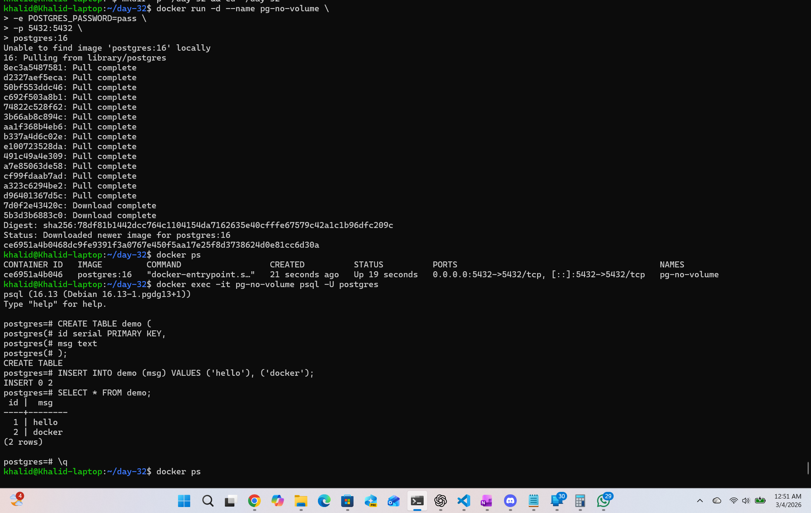


Stop + remove the container:

```bash
docker stop pg-no-volume
docker rm pg-no-volume
```
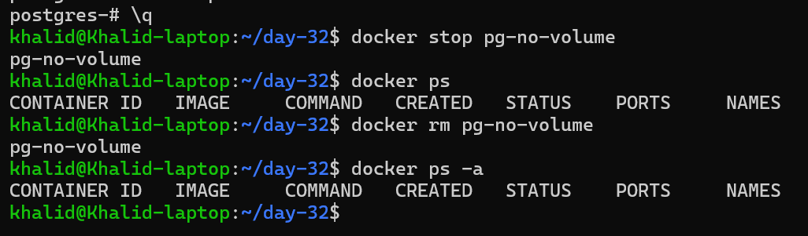


Run a *new* container again (still no volume):

```bash
docker run -d --name pg-no-volume-2   -e POSTGRES_PASSWORD=pass   -p 5432:5432   postgres:16
```

Try to read the table:

```bash
docker exec -it pg-no-volume-2 psql -U postgres -c "SELECT * FROM demo;"
```

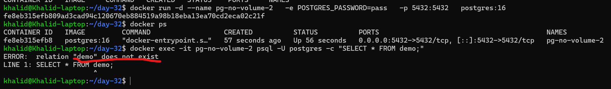

#### What happened and why?

- The table/rows were stored in the container’s **writable layer** (inside `/var/lib/postgresql/data` by default).
- When I removed the container (`docker rm`), Docker deleted that writable layer.
- A brand-new container starts with a brand-new writable layer → **data is gone**.

That’s why containers are considered **ephemeral**.

---


## Task 2: Fix persistence with a Named Volume

### 2A) Create a named volume
First, create a Docker volume that will persist database data.
```bash
docker volume create pgdata
```
Example output:
```bash
docker volume ls
OR
docker volume ls | grep pgdata
```
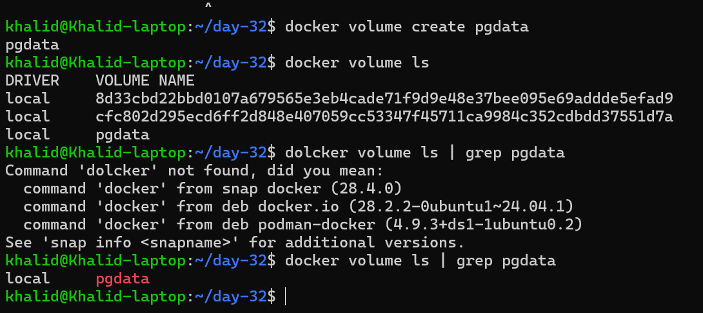

### 2B) Run Postgres with the named volume attached

First Remove the previous container
```bash
docker rm -f pg-no-volume-2 2>/dev/null || true
```
---

### `|| true`

If the previous command fails, ` || true` ensures the command still exits successfully.

---

Start a Brand New Container Using the Same Volume

```bash
docker run -d \
--name pg-with-volume \
-e POSTGRES_PASSWORD=pass \
-p 5432:5432 \
-v pgdata:/var/lib/postgresql/data \
postgres:16
```
Explanation:
- pgdata → named Docker volume
- /var/lib/postgresql/data → Postgres data directory inside container

---

2C) Create data again:

Open a Postgres shell:
```bash
docker exec -it pg-with-volume psql -U postgres
```

Create a table and insert some rows:
```SQL
CREATE TABLE users (
  id SERIAL PRIMARY KEY,
  name TEXT
);

INSERT INTO users (name) VALUES ('Alice'), ('Bob'), ('Charlie');

SELECT * FROM users;
```

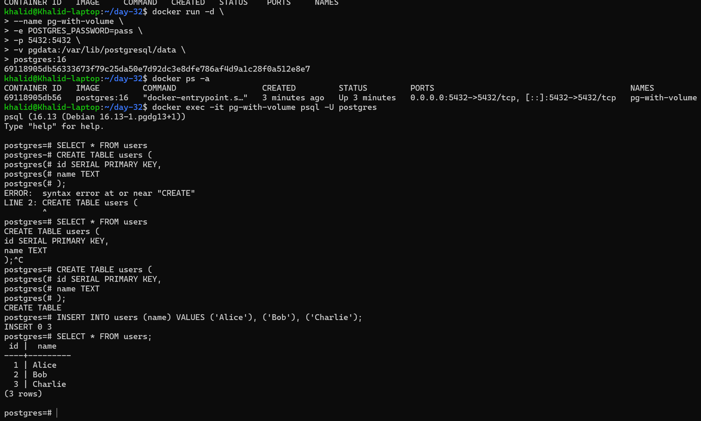

---

2D) Stop and Remove the Container

```bash
docker stop pg-with-volume
docker rm pg-with-volume
```
---

2E) Start a Brand new container **reusing the same volume**:

```bash
docker run -d \
--name pg-with-volume-2 \
-e POSTGRES_PASSWORD=pass \
-p 5432:5432 \
-v pgdata:/var/lib/postgresql/data \
postgres:16
```

2F) Verify the data still exists:

Connect again:

```bash
docker exec -it pg-with-volume-2 psql -U postgres -c "SELECT * FROM users;"
```

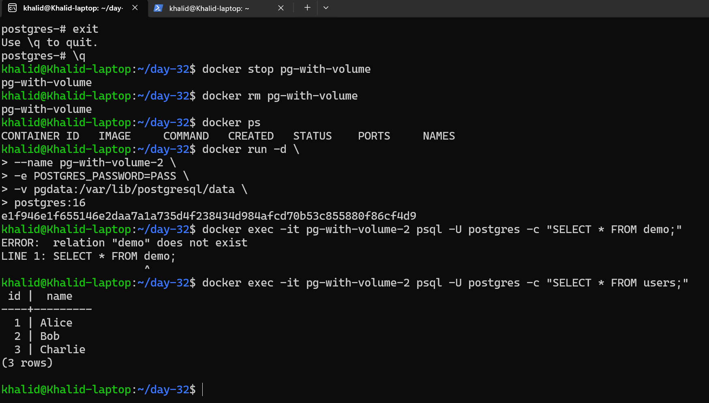

---

2G) Inspect the Volume
List volumes again:
```bash
docker volume ls | egrep pgdata
```
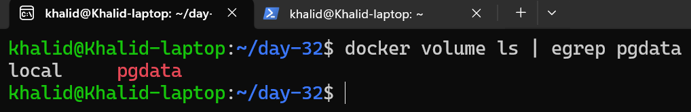

Inspect the volume:
```bash
docker volume inspect pgdata
```
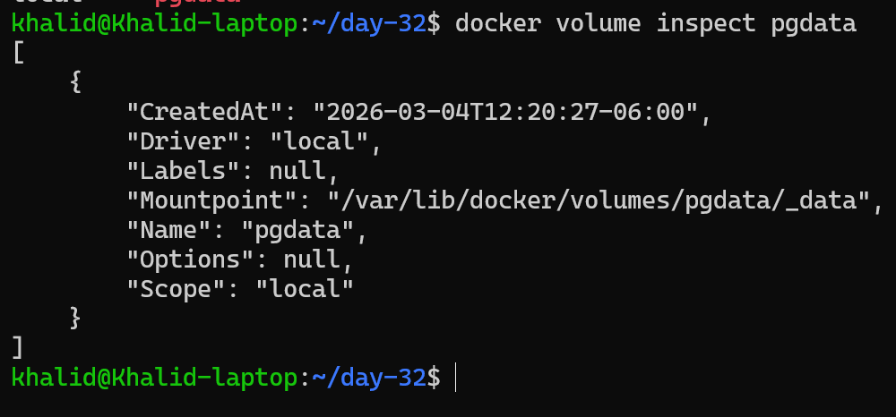

## Why this works

A **named volume** (`pgdata`) is stored and managed by Docker outside of the container’s writable layer.  
Removing/recreating containers does **not** delete the named volume unless you explicitly remove it:

```bash
docker volume rm pgdata
```
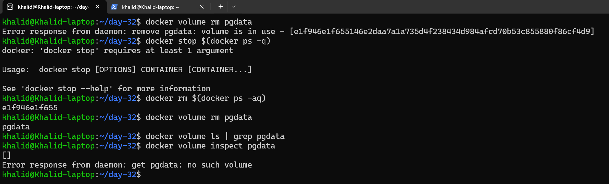

## Result

Yes — the data is still there.

This happens because:
- Docker volumes exist outside the container lifecycle
- Removing a container does not delete the volume
- When a new container attaches the same volume, it reuses the existing data

This is why volumes are essential for databases in Docker.

---

## Task 3: Bind Mount (host path ↔ container path)

Bind mounts are great when you want to edit files on the host and have changes appear instantly in the container.

A bind mount directly maps a folder from the host machine into the container.
Changes made on the host appear immediately inside the container.

Example: run Nginx serving a local HTML file.

#### 1. Create a Folder with an HTML File on the Host

First I create a folder on my host machine and add an `index.html` file.

```bash
mkdir -p mywebsite && cd mywebsite
```
Create the HTML file:
```bash
cat > mywebsite/index.html <<'EOF'
<h1>Hello from Docker Bind Mount</h1>
<p>If I edit this file on your laptop, Nginx updates immediately.</p>
EOF
```
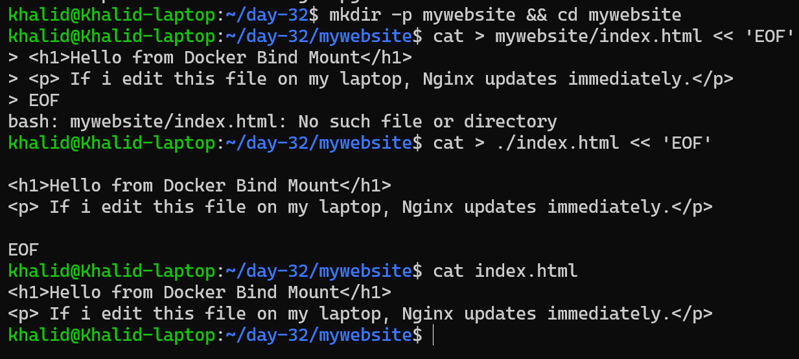

---

#### 2. Run an Nginx Container with a Bind Mount

Run an Nginx container and mount the host folder to the Nginx web directory.
```bash
docker run -d \
--name nginx-bind \
-p 8080:80 \
-v "$PWD/mywebsite":/usr/share/nginx/html:ro \
nginx:alpine
```
#### Explanation:
- $(pwd) → current folder on host machine
- /usr/share/nginx/html → default Nginx website directory
- -p 8080:80 → access site from browser on port 8080

---

#### 3. Access the Web Page
Open  browser and go to:

- http://localhost:8080

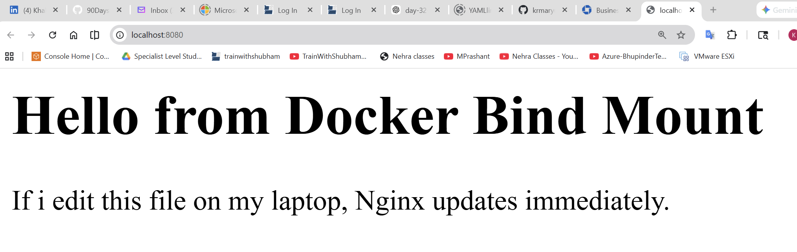

---

#### 4. Edit the HTML File on the Host
Modify the file on my host machine:

```bash
echo "<p>Edited at $(date)</p>" >> site/index.html
```
Refresh the browser.

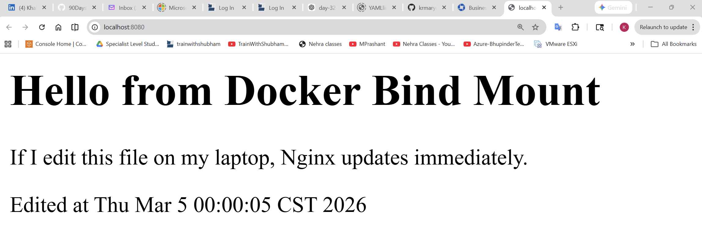

---

#### 5. Why This Works
Because the container is directly using the host folder, any changes made on the host appear instantly inside the container.

No container rebuild or restart is required.

---

### Difference Between Named Volumes and Bind Mounts

| Feature          | Named Volume                   | Bind Mount                       |
| ---------------- | ------------------------------ | -------------------------------- |
| Storage location | Managed by Docker              | Specific path on host            |
| Managed by       | Docker                         | User / host filesystem           |
| Typical use      | Databases, persistent app data | Development, live file editing   |
| Portability      | Works the same across systems  | Depends on host folder structure |
| Security         | More isolated                  | Direct host access               |

### Summary
- Named Volumes
  - Docker manages the storage location.
  - Best for databases and persistent container data.
- Bind Mounts
  - Directly map a host folder to the container.
  - Best for development and editing files in real time

### Key takeaway
- Use named volumes for production data persistence
- Use bind mounts for development workflows

---


## Task 5: Custom Networks (containers talking to each other)

By default, containers can communicate on the default bridge network, but **user-defined networks** provide:
- automatic DNS by container name
- cleaner isolation
- easier multi-container setups

#### 1. Create a custom/user-defined bridge network

```bash
docker network create my-app-net
```
Verify it exists:
```bash
docker network ls | grep my-app-net
```

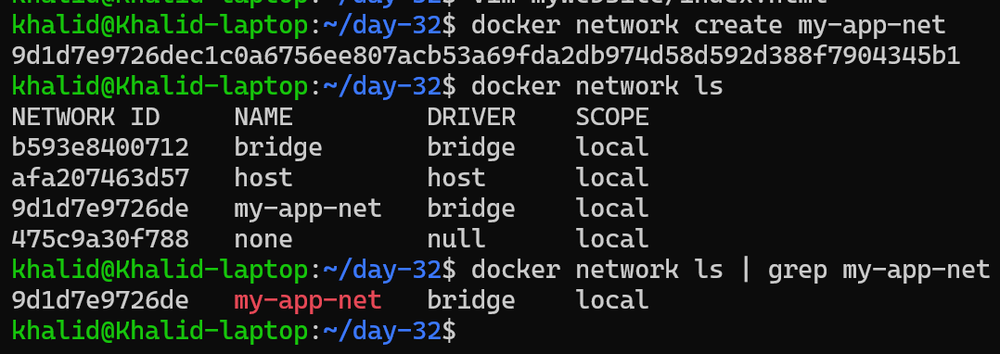

User-defined Docker networks include an embedded DNS server that automatically
resolves container names to their internal IP addresses.

### 2. Run two containers on the same network and ping by name

Run two lightweight(Alpine) containers:

```bash
docker run -d --name c1 --network my-app-net alpine sleep 1d
docker run -d --name c2 --network my-app-net alpine sleep 1d
```

---

#### 3. Ping each other by name
From `c1`, ping `c2`:

```bash
docker exec -it c1 ping -c 4 c2
```

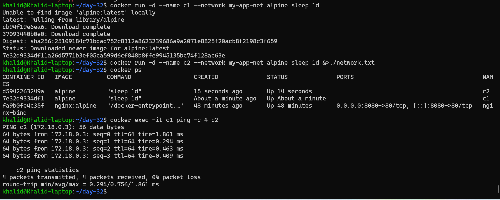

Notes: Why custom networking allows name-based communication but the default bridge doesn’t
- On a user-defined bridge network (like `my-app-net`), Docker enables an embedded DNS server.
  - That DNS automatically registers containers by name on that network.
  - So `c2` becomes a resolvable hostname for any container on `my-app-net`.

- On the default bridge network, Docker does not provide the same automatic DNS-based service discovery by container name.
  - Containers can usually talk via IP, but name → IP resolution is not reliably set up by default.
  - The old workaround was `--link`, but it’s deprecated.

In short: custom networks provide built-in DNS + service discovery, which is why ping `c2` works by name.

---

## Cleanup

```bash
docker rm -f box1 box2 nginx-bind pg-net 2>/dev/null || true
docker network rm day32-net 2>/dev/null || true
# keep pgdata if you want, or remove it:
# docker volume rm pgdata
```

---

## Task 6: Put It Together (Network + DB Volume + App Container)

#### 1. Create a custom network
```bash
docker network create my-app-net
docker network ls | grep my-app-net
```
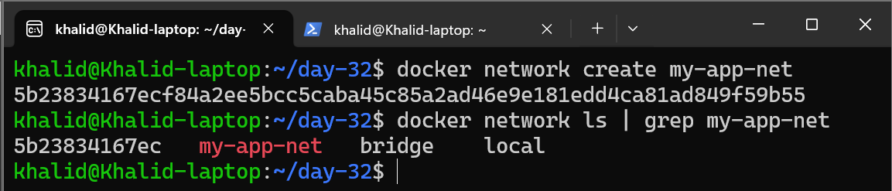

---

#### Create a named volume for DB data
```bash
docker volume create pgdata
docker volume ls | grep pgdata
```
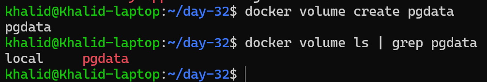

---

#### 3. Run a Postgres container on that network using the volume
```bash
docker run -d \
--network my-app-net \
-e POSTGRES_PASSWORD=pass \
-v pgdata:/var/lib/postgresql/data \
postgres:16
```
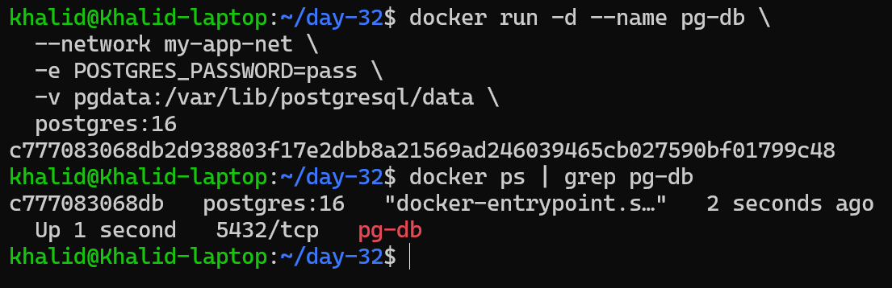

---

#### 4. Run an “app” container on the same network and reach DB by name

We’ll use a one-off container that has `psql` and acts like an app verifying DB connectivit

```bash
docker run --rm -it \
  --network my-app-net \
  postgres:16 \
  psql -h pg-db -U postgres -c "SELECT now();"
```

.png)

### This verifies: the app container can reach the database by container name (pg-db) thanks to Docker’s DNS on the user-defined network.

### Notes:
- The database (pg-db) is on my-app-net, and the volume pgdata persists its data.
- The “app” container can connect to pg-db using hostname pg-db because user-defined networks include Docker’s embedded DNS.
- The successful SELECT now() proves network reachability and correct name resolution.

## Summary (what I learned)

- **Without volumes**, container data disappears when the container is removed because it lives in the container’s writable layer.
- **Named volumes** persist independently from containers and are the standard way to keep database data.
- **Bind mounts** map host directories into containers, useful for live-editing and local dev.
- **User-defined networks** provide name-based discovery and clean container-to-container communication.

