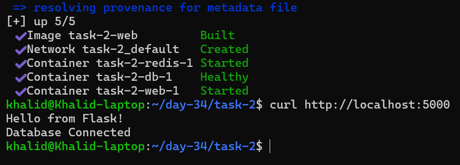
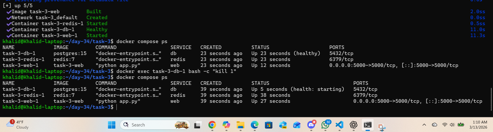
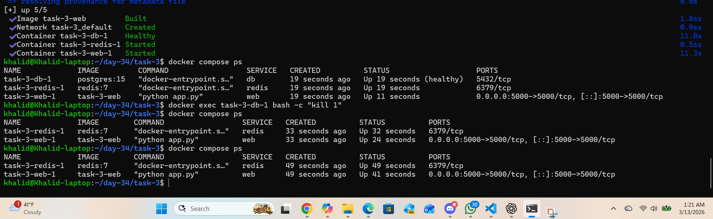
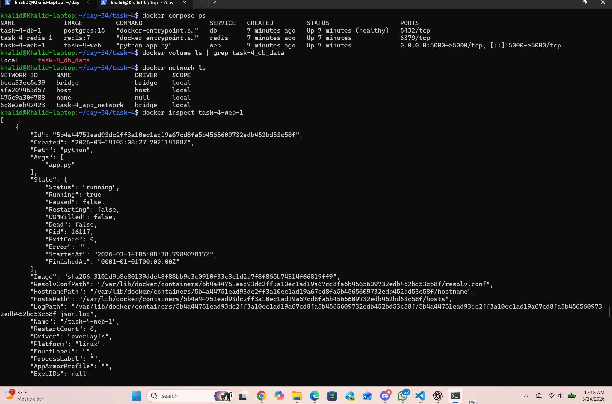

# Day 34 – Docker Compose: Real-World Multi-Container Apps

## Table of Contents

- [Task 1: Build Your Own App Stack](#task-1-build-your-own-app-stack)
- [Task 2: depends_on and Healthchecks](#task-2-depends_on-and-healthchecks)
- [Task 3: Restart Policies](#task-3-restart-policies)
- [Task 4: Named Networks and Volumes](#task-4-named-networks-and-volumes)
- [Task 5: Scaling](#task-5-scaling)

## Task 1: Build Your Own App Stack

## Service Architecture

The application consists of three services that communicate through the Docker network created by Docker Compose.

Web Service (Flask)
Handles HTTP requests and connects to both Redis and PostgreSQL.

PostgreSQL Service
Stores application data persistently using a Docker volume.

Redis Service
Provides fast in-memory caching to support the application.

Docker Compose automatically creates a network so services can reach each other using their service names:
- db
- redis

## Overview
In this task, I built a **3-service application stack** using Docker Compose.

The stack includes:
- A **Flask web app** – provides the web API and handles user requests.
- A **PostgreSQL database** A PostgreSQL service used to store and manage the application's persistent data.
- A **Redis cache** A Redis service used for fast in-memory caching to improve application performance.

This setup simulates a more real-world multi-container environment where services work together instead of running independently.

## Files Created

```text
2026/day-34/task-1
├── docker-compose.yml
└── app/
    ├── Dockerfile
    ├── requirements.txt
    └── app.py
```
---

### 1. docker-compose.yml
Create file: `2026/day-34/docker-compose.yml` 

with inline comments on nearly every line
[This file's explaination line by line](md/docker_compose_services_explanation.md)

[This is plain YAML file link](task-1-plain-files/docker-compose.yml)

```YAML
services:                               # Start the services section; all containers are defined here

  web:                                  # Define the web service (Flask app container)
    build: ./app                        # Build the web image from the ./app folder using its Dockerfile

    ports:                              # Define port mappings between host and container
      - 5000:5000                       # Map host port 5000 to container port 5000

    environment:                        # Define environment variables for the web container
      DB_HOST: db                       # Tell the Flask app to use the db service as the database host
      REDIS_HOST: redis                 # Tell the Flask app to use the redis service as the Redis host

  db:                                   # Define the database service
    image: postgres:15                  # Use the official PostgreSQL version 15 image

    environment:                        # Define environment variables used by PostgreSQL on startup
      POSTGRES_USER: postgres           # Create/use the PostgreSQL user named postgres
      POSTGRES_PASSWORD: postgres       # Set the password for the postgres user
      POSTGRES_DB: appdb                # Create a database named appdb when the container starts

  redis:                                # Define the Redis service
    image: redis:7                      # Use the official Redis version 7 image
```
### Very short summary
This file defines:
- web → Flask app
- db → PostgreSQL database
- redis → Redis cache

And it connects them using service names like:
- db
- redis

### 2. Dockerfile
Create file:
`2026/day-34/task-1/app/Dockerfile

[This file's explaination line by line](md/dockerfile_explanation)

[docker-compose-plain.yml](task-1-plain-files/docker-compose.yml)

```dockerfile
FROM python:3.11-slim
# Use the official Python 3.11 slim image as the base image (lightweight version)

WORKDIR /app
# Set the working directory inside the container to /app
# All subsequent commands will run inside this directory

COPY requirements.txt .
# Copy the requirements.txt file from the host machine
# into the container's current directory (/app)

RUN pip install --no-cache-dir -r requirements.txt
# Install Python dependencies listed in requirements.txt
# --no-cache-dir prevents pip from storing cache files to keep the image smaller

COPY . .
# Copy the entire project directory from the host machine
# into the container's /app directory

EXPOSE 5000
# Inform Docker that the container will listen on port 5000
# This is commonly used by Flask applications

CMD ["python", "app.py"]
# Define the default command that runs when the container starts
# This launches the Flask application by executing app.py
```
# Simple Mental Model

FROM → base environment\
WORKDIR → project directory\
COPY → move files into container\
RUN → install dependencies\
EXPOSE → document port\
CMD → start application\

### 3. requirements.txt
Create file:
`2026/day-34/task-1/app/requirements.txt`\
[This file's explaination line by line](md/requirements_explanation.md)

[requirements.txt plain](task-1-plain-files/requirements.txt)

```text
flask==3.0.3
# Flask web framework used to build the Python web application
# Handles HTTP requests, routes, and responses

psycopg2-binary==2.9.9
# PostgreSQL database adapter for Python
# Allows the Flask app to connect to and query the PostgreSQL database

redis==5.0.4
# Python client library for Redis
# Enables communication between the Flask app and Redis cache server
```
### Summary

    flask            → runs the web application
    psycopg2-binary  → connects Python to PostgreSQL
    redis            → connects Python to Redis

requirements.txt = list of Python packages needed by the project

### 4. Flask App
Create file:
`2026/day-34/task-1/app/app.py`
[This file's explaination line by line](md/flask_db_app_explanation.md)

[plain aap.py](task-1-plain-files/app.py)

```Python
from flask import Flask                                 # Import the Flask class used to create the web application

import psycopg2                                         # Import psycopg2 so Python can connect to PostgreSQL

import os                                               # Import the os module to read environment variables

app = Flask(__name__)                                   # Create the Flask application instance

db_host = os.getenv("DB_HOST", "db")                    # Read the DB_HOST environment variable,If DB_HOST is not set, use "db" as the default hostname

def check_db():                                         # Define a function that checks whether PostgreSQL is reachable
    try:                                                # Try to connect to the PostgreSQL database
        conn = psycopg2.connect(                        # Open a database connection using the settings below
            host=db_host,                               # Use the database host from the environment or the default value
            database="appdb",                           # Connect to the database named appdb
            user="postgres",                            # Use postgres as the database username
            password="postgres"                         # Use postgres as the database password
        )
        conn.close()                                    # Close the connection immediately after testing it
        return "Database Connected"                     # Return a success message if the connection works
    except Exception as e:                              # Catch any database connection error
        return f"Database Error: {e}"                   # Return the error message as text

@app.route("/")                                         # Register the home page route so this function handles requests to "/"
def home():                                             # Define the function for the home page
    db_status = check_db()                              # Call the database check function and store the result
    return f"Hello from Flask!\n{db_status}"          # Return a simple HTML response with a greeting and database status

if __name__ == "__main__":                              # Check whether this file is being run directly
    app.run(host="0.0.0.0", port=5000)                  # Start the Flask app on all network interfaces at port 5000
```
---
### Run command for Task 1
From inside the `2026/day-34/task-1` directory:
```bash
docker compose up --build -d
```

### Test the App
Open in browser:
```Plain text
http://localhost:5000
```


---

## Task 2: depends_on and Healthchecks

In this task, I updated the Docker Compose file so the web application starts only after the PostgreSQL database is fully ready.

### Changes made

- Added `depends_on` to the `web` service
- Added a healthcheck to the `db` service
- Used `condition: service_healthy` so the app waits for the database to be healthy

```yaml
depends_on:                               # Specifies that this service depends on another service
  db:                                     # The service this container depends on (PostgreSQL database)
    condition: service_healthy            # Wait until the database passes its healthcheck before starting
```

### Database healthcheck

```yaml
healthcheck:                              # Defines how Docker checks whether the container is healthy
  test: ["CMD-SHELL", "pg_isready -U postgres"]   # Command used to verify PostgreSQL is accepting connections
  interval: 10s                           # Run the healthcheck every 10 seconds
  timeout: 5s                             # If the check takes longer than 5 seconds, it is considered a failure
  retries: 5                              # Mark the container as unhealthy after 5 consecutive failures
```
### 1. `depends_on` Explanation
```YAML
depends_on:
  db:
    condition: service_healthy
```
`depends_on:`
- This tells Docker Compose that one service depends on another service.
- It controls the startup order of containers.

In this case, the web service depends on the database service.

`db:`
- This refers to the service name of the database container defined elsewhere in the Compose file.
- It means the current service should wait for the db service.

Example service name:
```YAML
services:
  db:
```

### condition: service_healthy

This is the important part.

It tells Docker Compose:

Do not start this service until the database container passes its healthcheck.

Without this, Docker only waits for the container to start, not for the database to be ready.

So the order becomes:
```text
Start DB container
↓
Run DB healthcheck
↓
If healthy → start web app
```

### `healthcheck` Explanation
This defines how Docker checks if a container is healthy.

Docker will repeatedly run a command to verify the service is working.

`test`
```YAML
test: ["CMD-SHELL", "pg_isready -U postgres"]
```
This tells Docker what command to run to test the container.

`pg_isready` is a PostgreSQL tool that checks:

Is the database accepting connections?

`-U postgres` means check using the postgres user.

If the command succeeds → container is healthy.

`timeout`
```YAML
timeout: 5s
```
If the healthcheck command takes longer than 5 seconds, Docker treats it as failed.

`retries`

```YAML
retries: 5
```
Docker allows 5 failed healthchecks before marking the container as unhealthy.

### 4️. Simple Mental Model

Think of it like this:
```text
Start database container
↓
Run healthcheck (pg_isready)
↓
If DB is ready → mark container healthy
↓
Start web container
```


```YAML
services:                               # Start the services section; all containers are defined here

  web:                                  # Define the web service (Flask app container)
    build: ./app                        # Build the web image from the ./app folder using its Dockerfile

    ports:                              # Define port mappings between host and container
      - 5000:5000                       # Map host port 5000 to container port 5000
    depends_on:                               # Specifies that this service depends on another service
      db:                                     # The service this container depends on (PostgreSQL database)
        condition: service_healthy            # Wait until the database passes its healthcheck before starting

    environment:                        # Define environment variables for the web container
      DB_HOST: db                       # Tell the Flask app to use the db service as the database host
      REDIS_HOST: redis                 # Tell the Flask app to use the redis service as the Redis host

  db:                                   # Define the database service
    image: postgres:15                  # Use the official PostgreSQL version 15 image

    environment:                        # Define environment variables used by PostgreSQL on startup
      POSTGRES_USER: postgres           # Create/use the PostgreSQL user named postgres
      POSTGRES_PASSWORD: postgres       # Set the password for the postgres user
      POSTGRES_DB: appdb                # Create a database named appdb when the container starts
    healthcheck:                        # Defines how Docker checks whether the container is healthy
      test: ["CMD-SHELL", "pg_isready -U postgres"]   # Command used to verify PostgreSQL is accepting connections
      interval: 10s                     # Run the healthcheck every 10 seconds
      timeout: 5s                       # If the check takes longer than 5 seconds, it is considered a failure
      retries: 5                        # Mark the container as unhealthy after 5 consecutive failures

  redis:                                # Define the Redis service
    image: redis:7                      # Use the official Redis version 7 image
```

### Test

I tested it with:
```bash
docker compose down
docker compose up --build -d
```


### Result:
- The database started first
- Docker Compose waited for the database healthcheck
- The web app started only after the database became healthy

### What this confirms about  Task 2
Successfully implemented:

✔ depends_on
✔ healthcheck on database
✔ condition: service_healthy
✔ Verified the startup order
✔ Tested the app connection

That is exactly what the task asked.

---

## Task 3: Restart Policies

## Restart Policies

Docker restart policies control how containers behave when they stop or crash.

### restart: always
The container is restarted automatically whenever it stops, regardless of the reason.

This is useful for:
- Databases
- Core backend services
- Critical infrastructure containers

### restart: on-failure
The container is restarted only when it exits with a non-zero error code.

This is useful for:
- Batch jobs
- Worker containers
- Processes that should retry only after failure

### When to use each

restart: always → long-running services like databases or web servers

restart: on-failure → jobs that should retry only when an error occurs

Create `docker-compose-plain-always.yml`
```YAML
version: "3.9"                                  # Specifies the Docker Compose file format version

services:                                        # Defines all services (containers) that Compose will run

  web:                                           # Web application service (Flask app)
    build: ./app                                 # Build the Docker image using the Dockerfile inside the ./app directory
    ports:                                       # Port mapping between host machine and container
      - "5000:5000"                              # Map host port 5000 to container port 5000 (accessible at http://localhost:5000)

    depends_on:                                  # Specifies service dependencies for startup order
      db:                                        # The web service depends on the database service
        condition: service_healthy               # Wait until the database passes its healthcheck before starting the web service

    environment:                                 # Environment variables passed into the web container
      DB_HOST: db                                # Hostname the web app uses to connect to PostgreSQL
      REDIS_HOST: redis                          # Hostname the web app uses to connect to the Redis cache


  db:                                            # Database service (PostgreSQL container)
    image: postgres:15                           # Use the official PostgreSQL image version 15
    restart: always                              # Restart the container automatically if it stops or crashes

    environment:                                 # Environment variables used to initialize PostgreSQL
      POSTGRES_USER: postgres                    # Default PostgreSQL username created when the container starts
      POSTGRES_PASSWORD: postgres                # Password for the PostgreSQL user (for development/testing)
      POSTGRES_DB: appdb                         # Database automatically created when PostgreSQL starts

    healthcheck:                                 # Defines how Docker checks whether PostgreSQL is ready
      test: ["CMD-SHELL", "pg_isready -U postgres"] # Command used to check if PostgreSQL is accepting connections
      interval: 10s                              # Run the healthcheck every 10 seconds
      timeout: 5s                                # If the check takes longer than 5 seconds, it is considered failed
      retries: 5                                 # Mark container unhealthy after 5 consecutive failed checks


  redis:                                         # Redis cache service
    image: redis:7                               # Use the official Redis image version 7 from Docker Hub
```

### Testing restart: always

First, I started the services:

```bash
docker compose down 
docker compose up --build -d
```
Then I verified the containers were running:
```bash
docker compose ps
```
To test the restart policy, I killed the main PostgreSQL process inside the container:
```bash
docker exec task-3-db-1 bash -c "kill 1"
```
After checking again with:
```bash
docker compose ps
```
the database container showed:
```Plain text
Up 3 seconds (health: starting)
```
This confirmed that Docker automatically restarted the database container.

### `restart: always`
- Restarts the container whenever it stops
- Useful for long-running services like:
  - databases
  - web servers
  - backend APIs

### `restart: on-failure`
- Restarts the container only if it exits with an error
- Useful for:
  - worker jobs
  - batch processing
  - retryable background tasks

### When to use each
- Use restart: always for critical services that should stay up continuously

- Use restart: on-failure for containers that should restart only when they crash

## Very simple difference

### `restart: always`
- restart no matter how it stopped


### `restart: on-failure`
- restart only when exit code is non-zero


---

## Task 4: Named Networks and Volumes

What Task 4 means

I need to:
- define my own named network instead of using Docker’s automatic default network
- define a named volume for PostgreSQL data
- add labels to services for organization and metadata

In this task, I updated the Compose file to use explicit networks, named volumes, and labels.

### Named Network
A custom network called `app_network` was defined and attached to all services.
This makes inter-service communication more explicit instead of relying on Docker Compose’s default network.

### Named Volume
A named volume called `db_data` was added for PostgreSQL data persistence.
This ensures database data remains available even if the database container is removed and recreated.

### Labels
Labels were added to each service for better organization and identification.
These labels help categorize services and projects in larger Docker environments.

```YAML
services:                                               # Defines all services (containers)

  web:                                                  # Web application service
    build: ./app                                        # Build the image from the Dockerfile inside ./app
    ports:                                              # Port mapping between host and container
      - "5000:5000"                                     # Expose the Flask app on localhost:5000

    depends_on:                                         # Defines service startup dependency
      db:                                               # Web depends on database service
        condition: service_healthy                      # Wait until database becomes healthy before starting

    environment:                                        # Environment variables passed to the web container
      DB_HOST: db                                       # Hostname for PostgreSQL service
      REDIS_HOST: redis                                 # Hostname for Redis service

    networks:                                           # Explicitly attach this service to a named network
      - app_network                                     # Web joins the custom app network

    labels:                                             # Metadata labels for better organization
      com.example.service: "web"                        # Label identifying this service as web
      com.example.project: "day-34-task-4"             # Label identifying the project


  db:                                                   # PostgreSQL database service
    image: postgres:15                                  # Use official PostgreSQL 15 image
    restart: on-failure                                 # Restart only if container exits with an error

    environment:                                        # PostgreSQL initialization variables
      POSTGRES_USER: postgres                           # Default PostgreSQL username
      POSTGRES_PASSWORD: postgres                       # Password for postgres user
      POSTGRES_DB: appdb                                # Database created automatically on startup

    healthcheck:                                        # Healthcheck to verify database readiness
      test: ["CMD-SHELL", "pg_isready -U postgres"]     # Checks if PostgreSQL is accepting connections
      interval: 10s                                     # Run check every 10 seconds
      timeout: 5s                                       # Fail if check takes longer than 5 seconds
      retries: 5                                        # Mark unhealthy after 5 failed attempts

    volumes:                                            # Persistent storage for database data
      - db_data:/var/lib/postgresql/data                # Mount named volume db_data into PostgreSQL data directory

    networks:                                           # Attach database service to the custom network
      - app_network                                     # DB joins the custom app network

    labels:                                             # Metadata labels for organization
      com.example.service: "db"                         # Label identifying this service as database
      com.example.project: "day-34-task-4"             # Label identifying the project


  redis:                                                # Redis cache service
    image: redis:7                                      # Use official Redis 7 image

    networks:                                           # Attach Redis to the custom network
      - app_network                                     # Redis joins the custom app network

    labels:                                             # Metadata labels for organization
      com.example.service: "redis"                      # Label identifying this service as cache
      com.example.project: "day-34-task-4"             # Label identifying the project


networks:                                               # Define custom networks explicitly
  app_network:                                          # Named bridge network for inter-service communication

volumes:                                                # Define named volumes explicitly
  db_data:                                              # Named volume used to persist PostgreSQL data
```
## What changed in Task 4
### 1. Explicit network
Before, Compose created a default network automatically.

Now I define my own:
```YAML
networks:
  app_network:
```
And attach services to it:
```YAML
networks:
  - app_network
```
This is better because it makes networking clear and intentional.

### 2. Named volume
We added:
```YAML
volumes:
  - db_data:/var/lib/postgresql/data
```
and defined it below:
```YAML
volumes:
  db_data:
```
This keeps PostgreSQL data even if the container is removed.

### 3. Labels
We added labels like:
```YAML
labels:
  com.example.service: "web"
  com.example.project: "day-34-task-4"
```
Labels are useful for:
- organizing containers
- filtering resources
- identifying services in larger projects

### How to run
```Bash
docker compose down
docker compose up --build -d
```
Check volumes:
```Bash
docker volume ls | grep task-4_db_data
```
Check networks:
```Bash
docker network ls
```
Inspect labels:
```Bash
docker inspect task-4-web-1
```
confirm your service labels.
```Bash
docker inspect task-4-web-1 | grep Labels -A 10
```
## Final test

Open the app:
```Plain text
http://localhost:5000
```
or:
```Bash
curl http://localhost:5000
```
```output
Hello from Flask!
Database Connected
```



---

## Task 5: Scaling

I tested scaling the web service using:

```bash
docker compose up -d --scale web=3
```
### What happened?

Docker Compose tried to start 3 replicas of the web service.

However, scaling did not work properly because the service uses this port mapping:
```YAML
ports:
  - "5000:5000"
  ```
Each web container tries to bind the same host port 5000, but only one container can use that port at a time.

### What breaks?

The extra replicas cannot start correctly because of a port binding conflict.

### Why simple scaling does not work with port mapping

Simple scaling does not work with fixed port mapping because all replicas try to use the same host port.

For example:
- `web-1` → tries to use host port 5000
- `web-2` → also tries to use host port 5000
- `web-3` → also tries to use host port 5000

Since only one service can bind to a host port at a time, scaling fails.

### Conclusion

Scaling works better when containers are placed behind a reverse proxy or load balancer, instead of exposing the same fixed host port directly from every replica.

---

## Simple one-line answer

**Why doesn’t simple scaling work with port mapping?**  
Because multiple replicas cannot bind the same host port like `5000:5000`.

---

## Small extra understanding

Scaling usually works properly when:

- containers are on the same Docker network
- no fixed host port is mapped on every replica
- an Nginx/load balancer sits in front

So for this bonus task, the main lesson is:

```text
Scaling app containers + fixed host port = port conflict
```

## Day 34 Summary

In this lab I practiced building a multi-container application using Docker Compose.

Key concepts learned:

- Creating multi-service applications with Docker Compose
- Using `depends_on` and `healthcheck` to manage service startup order
- Configuring restart policies for container reliability
- Creating named networks for controlled container communication
- Using named volumes to persist database data
- Adding labels for better service organization
- Understanding why simple scaling fails with fixed port mappings

This exercise helped demonstrate how Docker Compose can be used to manage production-like application stacks consisting of multiple dependent services.
