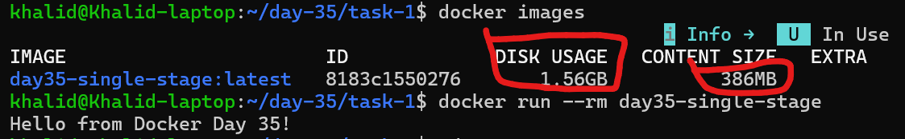
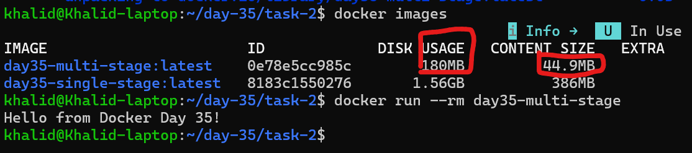
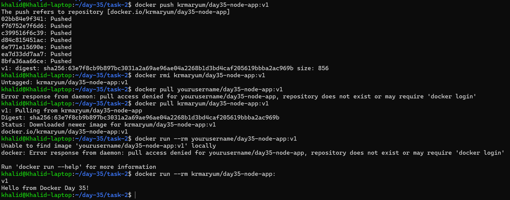
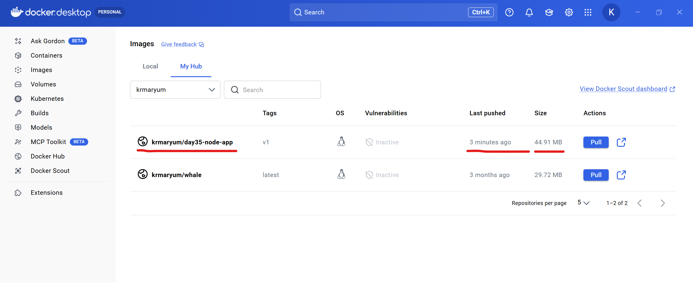
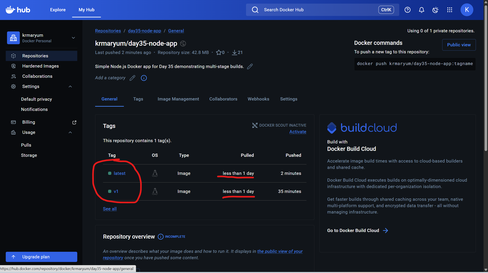
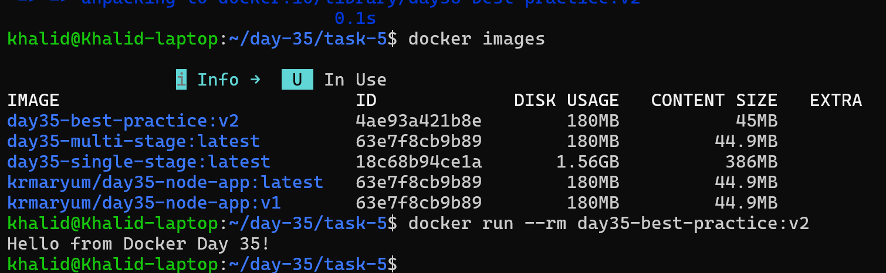

# Day 35 – Multi-Stage Builds & Docker Hub
Today's goal is to build optimized images and share them with the world.

Multi-stage builds are how real teams ship small, secure images. Docker Hub is how you distribute them. Both are interview favourites.

[Dockerfile stages Explanatione and multi stage](md/dockerfile_stages_explanation.md)

- [Task 2: Multi-Stage Build](#task-2--multi-stage-build)

- [Task 3: Push Image to Docker Hub](#task-3-push-image-to-docker-hub)

- [Task 4: Docker Hub Repository](#task-4-docker-hub-repository)

- [Task 5: Image Best Practices](#task-5-image-best-practices)

- [Final Results](#final-results)

## Key Differences

| Feature          | Single Stage | Multi Stage   |
| ---------------- | ------------ | ------------- |
| `FROM` count     | One          | Multiple      |
| Complexity       | Simple       | More advanced |
| Image size       | Larger       | Smaller       |
| Security         | Lower        | Higher        |
| Production usage | Rare         | Recommended   |

## When to Use Each
### Use Single-Stage when
- Learning Docker
- Small scripts
- Simple Node apps
- Quick testing
Example:
```text
node script.js
```
### Use Multi-Stage when
- Building production apps
- Compiling code
- Using build tools
- Reducing image size
- CI/CD pipelines

Examples:
- React
- Go
- Java
-Python builds
- Microservices

## Simple rule
```text
Single Stage  → Simple projects
Multi Stage   → Production applications
```

## Task 1: The Problem with Large Images

### Objective

Create a simple application, build a Docker image using a **single-stage Dockerfile**, and observe the **image size**. This will help us understand why multi-stage builds are important.

---

# Step 1: Create a Simple Node.js App

Create a project directory:

```bash
mkdir day-35 && cd day-35 && mkdir task-1 && cd task-1
```

Create `app.js`

```javascript
console.log("Hello from Docker Day 35!");
```

---

# Step 2: Create package.json

Run:

```bash
npm init -y
```
```text
khalid@Khalid-laptop:~/day-35/task-1$ npm init -y
Wrote to /home/khalid/day-35/task-1/package.json:

{
  "name": "day35/task-1/single-stage",
  "version": "1.0.0",
  "description": "",
  "main": "app.js",
  "scripts": {
    "test": "echo \"Error: no test specified\" && exit 1"
  },
  "keywords": [],
  "author": "",
  "license": "ISC"
}

Project structure:

```
day-35/task-1/
 ├── app.js
 └── package.json
```

---

# Step 3: Create a Single-Stage Dockerfile

Create a file named `Dockerfile`

```dockerfile
FROM node:18

WORKDIR /app

COPY package.json .
RUN npm install

COPY . .

CMD ["node", "app.js"]
```

Explanation:

* Uses the full **Node.js base image**
* Installs dependencies
* Copies application code
* Runs the Node application

This approach is simple but **creates large Docker images**.

---

# Step 4: Build the Image

Run the following command:

```bash
docker build -t day35-single-stage .
```

---

# Step 5: Check Image Size

Run:

```bash
docker images
```


Result observed:

REPOSITORY           TAG       IMAGE ID       SIZE
day35-single-stage   latest    8183c1550276   1.56GB

Image size observed:

Disk Usage: 1.56GB
Content Size: 386MB
---

# Step 6: Run the Container

```bash
docker run day35-single-stage
```

---

# Conclusion

The single-stage Docker build works correctly, but the image size(1.56GB) is relatively large.
This demonstrates the inefficiency of single-stage builds.
In the next task, we will use **multi-stage builds** to significantly reduce the image size and produce a more optimized Docker image..

---
## Task 2 – Multi-Stage Build

### Multi-stage Dockerfile

```dockerfile
# Stage 1: Build stage
FROM node:18 AS builder

WORKDIR /app

COPY package.json .
RUN npm install

COPY app.js .

# Stage 2
FROM node:18-alpine

WORKDIR /app

COPY --from=builder /app/package.json .
COPY --from=builder /app/node_modules ./node_modules
COPY --from=builder /app/app.js .

CMD ["node", "app.js"]
```
[Explanation of multistage Dockerfile](md/multi_stage_dockerfile_explanation.md)

Build the new image
```bash
docker build -t day35-multi-stage .
```
It shows now both images:
- day35-single-stage
- day35-multi-stage

The multi-stage one should be smaller than the single-stage one.



### Run the multi-stage container
```bash
docker run --rm day35-multi-stage
```
## Size comparison
Single-stage image size: **1.56GB**  
Multi-stage image size: **180MB**
Content size: **44.9MB**
### Why is the multi-stage image smaller?

The multi-stage image is smaller because the final image does not include everything used during the build process.  
In the first stage, dependencies are installed and the app is prepared.  
In the second stage, only the required runtime files are copied into a smaller base image.

This removes unnecessary build tools, cache, and extra files from the final image, making it lighter, faster to transfer, and more secure.

Single-stage image was large because it kept everything in one image:
- full node:18 base
- build layers
- npm install layer
- extra files not needed for runtime

Multi-stage image is smaller because:
- the builder stage is temporary
- the final stage uses node:18-alpine
- only the required app files are copied

This makes the final image more efficient, faster to download, and more secure.

---
## Task 3: Push Image to Docker Hub

### Login to Docker Hub

```bash
docker login
```

---

### Tag the Image

```bash
docker tag day35-multi-stage krmaryum/day35-node-app:v1
```

Example:

```bash
docker tag day35-multi-stage krmaryum/day35-node-app:v1
```

---

### Push the Image

```bash
docker push krmaryum/day35-node-app:v1
```

---

### Verify by Pulling the Image

Remove local image:

```bash
docker rmi khaliddev/day35-node-app:v1
```

Pull from Docker Hub:

```bash
docker pull krmaryum/day35-node-app:v1
```

Run the container:

```bash
docker run --rm khaliddev/day35-node-app:v1
```

Output:

```output
Hello from Docker Day 35!
```

---

### Result

The image was successfully pushed to Docker Hub and can now be pulled and run on any machine with Docker installed.





---

## Task 4: Docker Hub Repository

### Repository

Docker Hub Repository:

https://hub.docker.com/r/krmaryum/day35-node-app

The image pushed from the multi-stage build is available publicly.

---

### Repository Tags

The repository contains two tags:

| Tag    | Description                      |
| ------ | -------------------------------- |
| v1     | Version 1 of the image           |
| latest | Default version pulled by Docker |

---

### Pull a Specific Version

```bash
docker pull krmaryum/day35-node-app:v1
```

Run the container:

```bash
docker run --rm krmaryum/day35-node-app:v1
```

---

### Pull the Latest Version

```bash
docker pull krmaryum/day35-node-app:latest
```

Run the container:

```bash
docker run --rm krmaryum/day35-node-app:latest
```

---

### Default Behavior

If no tag is specified, Docker automatically pulls the `latest` tag.

Example:

```bash
docker pull krmaryum/day35-node-app
```

This is equivalent to:

```bash
docker pull krmaryum/day35-node-app:latest
```

---

### Understanding Versioning

Docker tags allow multiple versions of the same image to exist.

Example versioning scheme:

```
myapp:1.0
myapp:1.1
myapp:2.0
myapp:latest
```

This allows teams to control deployments and roll back to previous versions if needed.


---

## Task 5: Image Best Practices
### Improved Dockerfile
```Dockerfile
# Stage 1: Build stage
FROM node:18.20.4-alpine3.20 AS builder

WORKDIR /app

COPY package.json ./
RUN npm install

COPY app.js ./

# Stage 2: Runtime
FROM node:18.20.4-alpine3.20

WORKDIR /app

RUN addgroup -S appgroup && adduser -S appuser -G appgroup

COPY --from=builder /app/package.json ./
COPY --from=builder /app/node_modules ./node_modules
COPY --from=builder /app/app.js ./

USER appuser

CMD ["node", "app.js"]
```
## What Best Practices Are Applied Here
### 1. Minimal base image
We use:
```dockerfile
node:18.20.4-alpine3.20
```

instead of something heavier like Ubuntu or full Node images.

That makes the image much smaller.

### 2. Non-root user

We added:
```Dockerfile
RUN addgroup -S appgroup && adduser -S appuser -G appgroup
USER appuser
```
This improves security because the container does not run as root.

### 3. Combined RUN command
Instead of using multiple RUN instructions, we combine user creation into one command:
```Dockerfile
RUN addgroup -S appgroup && adduser -S appuser -G appgroup
```
That helps reduce layers.

### 4. Specific base image tag
We use a fixed version:
```dockerfile
node:18.20.4-alpine3.20
```
instead of:
```dockerfile
node:18-alpine
node:latest
```
This makes builds more stable and reproducible.

## Build the New Image
```Dockerfile
docker build -t day35-best-practice:v2 .
```

## Check Image Size
```bash
docker images
```
Images compare:
- day35-single-stage
- day35-multi-stage
- day35-best-practice:v2

## Run the New Image
```bash
docker run --rm day35-best-practice:v2
```


### Best practices applied
- Used a minimal Alpine-based image
- Used a specific version tag instead of latest
- Added a non-root user
- Combined commands to reduce layers

Size comparison
- Single-stage image: 1.56GB
- Multi-stage image: 180MB
- Best-practice image: 180MB

Why this is better

This image is better because it is smaller, more secure, and more predictable.

Using Alpine reduces image size.

Using a non-root user improves container security.

Using a fixed image tag makes builds reproducible.

Combining commands helps reduce unnecessary image layers.
