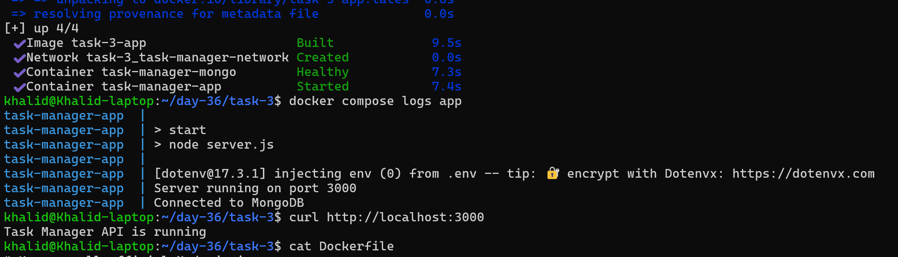
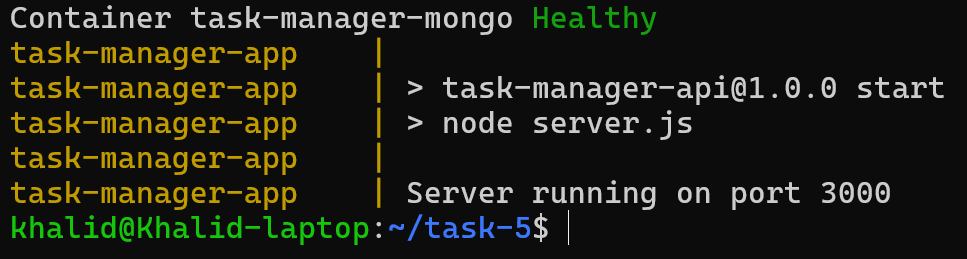
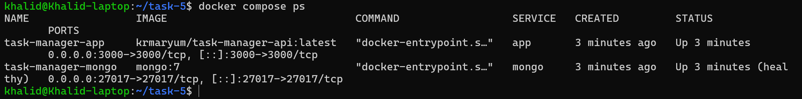
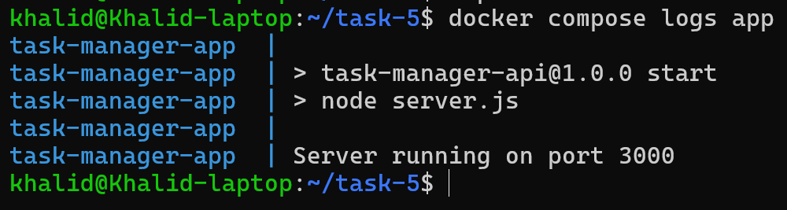
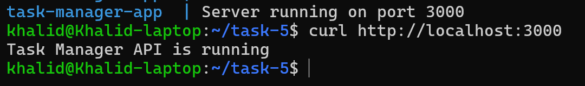
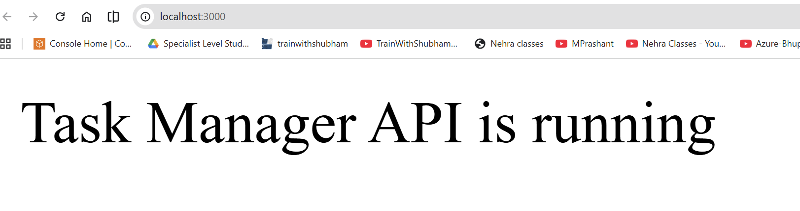

## Task 1: Pick Your App
**Pick: Node.js Express app with MongoDB**

**Why this is a strong choice**
- It feels like a real-world full-stack backend setup
- I’ll practice Dockerizing both the app and the database
- It fits perfectly with Docker Compose
- It is easier to ship end-to-end than Django for a first full Docker project
- I can clearly show networking, environment variables, volumes, and container startup

## Task 2: Write the Dockerfile
### 1. Create `Dockerfile`
```YAML
# Use a small official Node.js image
FROM node:20-alpine

# Set the working directory inside the container
WORKDIR /app

# Copy package files first to take advantage of Docker layer caching
COPY package*.json ./

# Install only production dependencies for a smaller image
RUN npm install --omit=dev

# Copy the rest of application code
COPY . .

# Create user/group and set permissions
RUN addgroup -S appgroup && \
    adduser -S appuser -G appgroup && \
    chown -R appuser:appgroup /app

# Switch to the non-root user
USER appuser

# Expose the application port
EXPOSE 3000

# Start the application
CMD ["npm", "start"]
```
[Dockerfile explanation](md/nodejs_dockerfile_explanation.md)

### 2. Create `.dockerignore`

```dockerignore
node_modules
npm-debug.log
Dockerfile
.dockerignore
.git
.gitignore
.env
```

### 3. Create `package.json`

```bash
npm init -y
```
```JSON
{
  "name": "task-manager-api",
  "version": "1.0.0",
  "description": "Simple Express app for Docker practice",
  "main": "server.js",
  "scripts": {
    "start": "node server.js"
  },
  "dependencies": {
    "express": "^4.19.2"
  }
}
```

### 4. Create `server.js`
```JavaScript
const express = require("express");

const app = express();
const PORT = 3000;

app.get("/", (req, res) => {
  res.send("Task Manager API is running");
});

app.listen(PORT, () => {
  console.log(`Server running on port ${PORT}`);
});
```

### 5. Build the image locally
```bash
docker build -t task-manager-api .
```

## Full Flow of the Container

### When Docker runs the container:

1️⃣ Start from node:20-alpine\
2️⃣ Set /app as working directory\
3️⃣ Copy package.json\
4️⃣ Install dependencies\
5️⃣ Copy app source code\
6️⃣ Create secure user\
7️⃣ Assign permissions\
8️⃣ Switch to non-root user\
9️⃣ Open port 3000\
🔟 Run npm start

## Result:
**A small, secure, production-ready Node.js container.**

### 6. Create a container named `task-manager-container`
```bash
docker run -d -p 3000:3000 --name task-manager-container task-manager-api
```
### 7. Then check it with:
```bash
docker ps
```
And view logs with:
```bash
docker logs task-manager-cont
```
```output
> task-manager-api@1.0.0 start
> node server.js
```
Then open:
```Plain text
http://localhost:3000
```
Should see:
```Plain text
Task Manager API is running
```
### Overview
For this project, I created a Dockerfile to containerize a Node.js Express Task Manager API. The goal was to build a lightweight, secure Docker image that can run the application consistently across environments.

Key goals:
- Use a small base image
- Use a non-root user for security
- Optimize build layers
- Exclude unnecessary files using .dockerignore

### Result
The Node.js application was successfully containerized and tested locally using Docker.

## Task 3: Add Docker Compose

For this step, I created a `docker-compose.yml` file to run both the Node.js Express app and MongoDB together.

### Services included
- **app**: built from the local `Dockerfile`
- **mongo**: official MongoDB image

### Features added
- **Custom network** for service communication
- **Named volume** for MongoDB data persistence
- **Environment variables** loaded from `.env`
- **Healthcheck** for MongoDB
- `depends_on` configured so the app waits for the database to become healthy

### .env
```env
PORT=3000
MONGO_URI=mongodb://mongo:27017/taskdb
```

### 1. Install MongoDB packages in a app
```bash
npm install mongoose dotenv
```
[Explanation of command npm install mongoose dotenv](md/npm_mongoose_dotenv_explanation.md)

### 2. Create `server.js`
```JavaScript
const express = require("express");
const mongoose = require("mongoose");
require("dotenv").config();

const app = express();
const PORT = process.env.PORT || 3000;

app.use(express.json());

mongoose
  .connect(process.env.MONGO_URI)
  .then(() => console.log("Connected to MongoDB"))
  .catch((err) => console.error("MongoDB connection error:", err));

app.get("/", (req, res) => {
  res.send("Task Manager API is running");
});

app.get("/health", (req, res) => {
  res.status(200).json({ status: "ok" });
});

app.listen(PORT, () => {
  console.log(`Server running on port ${PORT}`);
});
```
[Expalnation of `server.js`](md/express_mongodb_server_explanation.md)

### 4. Create `.env`
```env
PORT=3000
MONGO_URI=mongodb://mongo:27017/taskdb
```
Important:
- use mongo as hostname, because that will be the Compose service name
- do not use localhost here

[Explantion of `.env`](md/env_port_mongo_uri_explanation.md)

### 5. Create `docker-compose.yml`
```YAML
services:
  app:
    build: .
    container_name: task-manager-app
    ports:
      - "3000:3000"
    env_file:
      - .env
    depends_on:
      mongo:
        condition: service_healthy
    networks:
      - task-manager-network
    restart: unless-stopped

  mongo:
    image: mongo:7
    container_name: task-manager-mongo
    ports:
      - "27017:27017"
    volumes:
      - mongo_data:/data/db
    networks:
      - task-manager-network
    healthcheck:
      test: ["CMD", "mongosh", "--eval", "db.adminCommand('ping')"]
      interval: 10s
      timeout: 5s
      retries: 5
      start_period: 20s
    restart: unless-stopped

volumes:
  mongo_data:

networks:
  task-manager-network:
    driver: bridge
```
[Explanation of `Docker-compose.yml`](md/docker_compose_explanation.md)

### 6. Keep my `Dockerfile`
```YAML
# Use a small official Node.js image
FROM node:20-alpine

# Set the working directory inside the container
WORKDIR /app

# Copy package files first to take advantage of Docker layer caching
COPY package*.json ./

# Install only production dependencies for a smaller image
RUN npm install --omit=dev

# Copy the rest of application code
COPY . .

# Create user/group and set permissions
RUN addgroup -S appgroup && \
    adduser -S appuser -G appgroup && \
    chown -R appuser:appgroup /app

# Switch to the non-root user
USER appuser

# Expose the application port
EXPOSE 3000

# Start the application
CMD ["npm", "start"]
```
### 7. Rebuild and start everything
```bash
docker compose up --build -d
```
### 8. Verify it works
Check running containers:
```bash
docker compose ps
```
Check logs:
```bash
docker compose logs app
```


Test the app:
```bash
curl http://localhost:3000
```
### Perfect — Task 3 is working.

My logs confirm both parts are up:
- Server running on port 3000 → the app started successfully
- Connected to MongoDB → the app connected to the database successfully

That means Docker Compose setup is working together:
- app service
- MongoDB service
- `.env` variables
- custom network
- database healthcheck
- persistent volume

## Task 4: Ship the image
This task has 4 parts:
1. tag the image
2. push it to Docker Hub
3. share the Docker Hub link
4. create README.md

### 1. Tag the app image

---

## Task 4: Ship It

---

## Overview

In this step, I finalized the Dockerized application by:

* tagging the Docker image
* pushing it to Docker Hub
* sharing the public repository link
* creating a README file for usage instructions

---

## Docker Image Tagging

I tagged my local Docker image to match my Docker Hub repository:

```bash
docker tag task-manager-api krmaryum/task-manager-api:latest
```

This prepares the image for pushing to Docker Hub.

---

## Docker Hub Login

I logged into Docker Hub using:

```bash
docker login
```

---

## Push Image to Docker Hub

I pushed the tagged image using:

```bash
docker push krmaryum/task-manager-api:latest
```

This uploaded the image to my Docker Hub repository.

---

## Docker Hub Repository Link

The image is publicly available at:

```text
https://hub.docker.com/r/krmaryum/task-manager-api
```

The image can be pulled using:

```bash
docker pull krmaryum/task-manager-api:latest
```

---

## README.md

I created a `README.md` file in the project with the following content:

```markdown
# Task Manager API (Dockerized)

## What the app does

This is a simple Node.js Express API connected to MongoDB.

It demonstrates:
- Dockerizing a backend application
- Running multiple services using Docker Compose
- Connecting an app to a database inside containers

Endpoints:
- GET / → returns app status
- GET /health → returns health status

---

## How to run with Docker Compose

### Step 1: Clone the repository
git clone <my-repo-url>
cd <project-folder>

### Step 2: Create .env file
PORT=3000
MONGO_URI=mongodb://mongo:27017/taskdb

### Step 3: Start the application
docker compose up --build

Or run in background:
docker compose up --build -d

---

## Test the app

curl http://localhost:3000

Expected output:
Task Manager API is running

---

## Environment Variables

PORT=3000  
MONGO_URI=mongodb://mongo:27017/taskdb

---

## Docker Hub Image

https://hub.docker.com/r/krmaryum/task-manager-api
```

---

## Result

* Docker image successfully tagged
* Image pushed to Docker Hub
* Public repository created
* README.md added with usage instructions

The application is now fully containerized and shareable via Docker Hub.

---

## Task 5: Test the Whole Flow

### The goal is to prove your project works on a fresh machine state using:
- no local containers
- no local images
- image pulled from Docker Hub
- Compose used to run everything

Because the current docker-compose.yml likely uses build: **.**, we need to adjust it so the app is pulled from Docker Hub instead of built locally.

What Task 5 means

I am simulating this:

“Someone clones my project and runs Docker Compose. Does it work without rebuilding my app manually?”

That means my Compose file should use my pushed image:
```YAML
image: krmaryum/task-manager-api:latest
```
instead of:
```YAML
build: .
```

For this step, I tested the project from a fresh state.

### What I did
- Removed local containers
- Removed local images
- Used Docker Compose with the Docker Hub image
- Started the application again from scratch

### Verification
- Docker Compose pulled `krmaryum/task-manager-api:latest`
- MongoDB started successfully
- MongoDB passed its healthcheck
- The app container started successfully
- `curl http://localhost:3000` returned:

```text
Task Manager API is running
```

### Commands used

```bash
docker compose down -v
docker rm -f $(docker ps -aq) 2>/dev/null
docker rmi krmaryum/task-manager-api:latest
docker rmi task-manager-api:latest
docker compose up
```

### 1. Update `docker-compose.yml`
Open file:
```bash
vim docker-compose.yml
```
```YAML
services:
  app:
    image: krmaryum/task-manager-api:latest
    container_name: task-manager-app
    ports:
      - "3000:3000"
    env_file:
      - .env
    depends_on:
      mongo:
        condition: service_healthy
    networks:
      - task-manager-network
    restart: unless-stopped

  mongo:
    image: mongo:7
    container_name: task-manager-mongo
    ports:
      - "27017:27017"
    volumes:
      - mongo_data:/data/db
    networks:
      - task-manager-network
    healthcheck:
      test: ["CMD", "mongosh", "--eval", "db.adminCommand('ping')"]
      interval: 10s
      timeout: 5s
      retries: 5
      start_period: 20s
    restart: unless-stopped

volumes:
  mongo_data:

networks:
  task-manager-network:
    driver: bridge
```
**Important change**

The app service now uses:
```YAML
image: krmaryum/task-manager-api:latest
```
So Compose will pull from Docker Hub.

### 2.Make sure `.env` exists
`.env` should be:
```env
PORT=3000
MONGO_URI=mongodb://mongo:27017/taskdb
```
Check it
```bash
cat .env
```

### 3: Remove containers

Stop and remove the project containers:
```bash
docker compose down -v
```
Then remove any leftover containers:
```bash
docker rm -f $(docker ps -aq) 2>/dev/null
```

### 4: Remove local images
Remove the app image and optionally Mongo too:
```bash
docker rmi krmaryum/task-manager-api:latest
docker rmi mongo:7
```
And More Clear:
```bash
docker rmi task-manager-api:latest
```
To see what exists first:
```bash
docker images
```

### 5: Pull and run using only Compose
Now run:
```bash
docker compose up -d
```
This should:
- pull `krmaryum/task-manager-api:latest` from Docker Hub
- pull `mongo:7` if missing
- create the network
- create the volume
- start MongoDB
- wait for healthcheck
- start my app


### 6: Verify it works fresh
Run:
```bash
docker compose ps
```

Then:
```bash
docker compose logs app
```


Then test:
```bash
curl http://localhost:3000
```



## Verification
I verified that:
- Docker Compose pulled the app image from Docker Hub
- MongoDB started successfully
- the database healthcheck passed
- the app started correctly
- the app responded on http://localhost:3000
## Result
**The project worked successfully from a fresh setup using only the Compose file and the Docker Hub image.**
