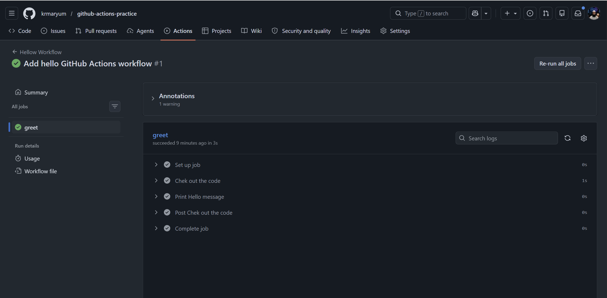
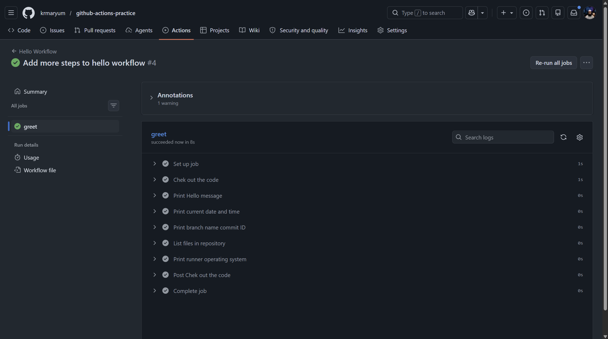
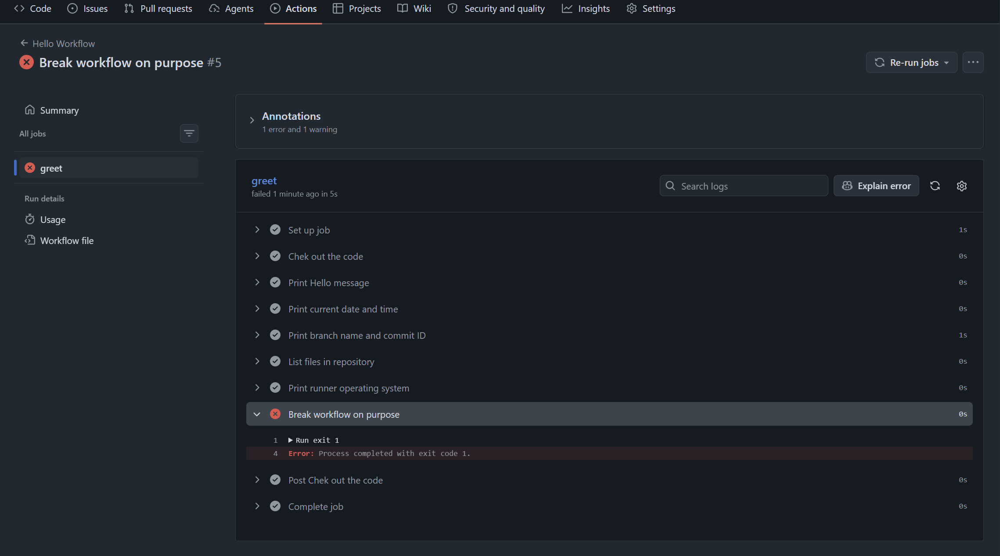
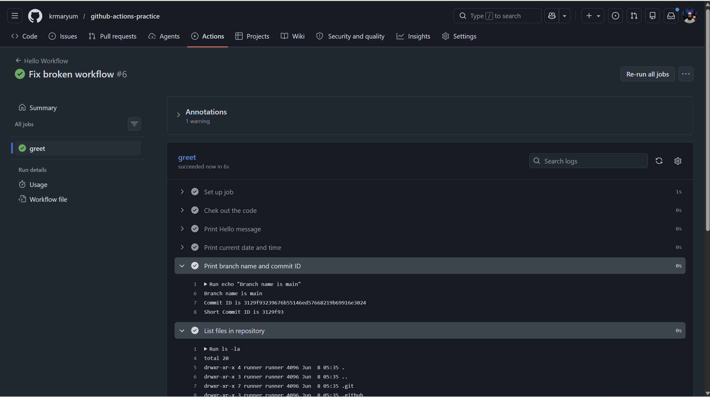

# Day 40 – Your First GitHub Actions Workflow

## Table of Contents

| Task | Topic |
|---|---|
| [Task 1](#challenge-task-1-set-up-github-actions-repository) | Set Up GitHub Actions Repository |
| [Task 2](#task-2-hello-workflow) | Hello Workflow |
| [Task 3](#task-3-understand-the-anatomy) | Understand the Anatomy |
| [Task 4](#task-4-add-more-steps) | Add More Steps |
| [Task 5](#task-5-break-it-on-purpose) | Break It On Purpose |

## Challenge Task 1: Set Up GitHub Actions Repository


> **Study Note Type:** Day 40 + Challenge Tasks
>
> **Main Topic:** Your First GitHub Actions Workflow
>
> **Task Focus:** Repository setup and `.github/workflows/` folder creation

---

## Day 40 Topic

**Day 40 – Your First GitHub Actions Workflow**

This day introduces GitHub Actions, which is GitHub’s built-in CI/CD automation service. The main idea is to understand how a pipeline is written, where it is stored, and how GitHub runs it automatically in the cloud.

---

## Day 40 Overview

Today you will start learning **GitHub Actions** by creating the basic setup for your first CI/CD workflow.

GitHub Actions is an automation tool built inside GitHub. It allows you to run commands automatically when something happens in your repository.

For example, GitHub Actions can run when:

- You push code to GitHub
- You open a pull request
- You merge code into the main branch
- You manually trigger a workflow

In Day 40, the main goal is to understand how a GitHub Actions workflow starts and where workflow files are stored.

Workflow files are written in YAML and are stored inside this folder:

```bash
.github/workflows/
```

GitHub automatically checks this folder. If it finds a workflow file inside this folder, GitHub can run it in the cloud.

---

## Day 40 Objectives

By the end of Day 40, you should understand:

| Objective | Meaning |
|---|---|
| GitHub Actions | CI/CD automation tool inside GitHub |
| Workflow | A pipeline written in YAML |
| `.github/workflows/` | Folder where workflow files are stored |
| Runner | Cloud machine provided by GitHub to run workflow jobs |
| Push Trigger | A workflow can run automatically when code is pushed |
| Actions Tab | GitHub page where workflow runs are visible |
| YAML File | File used to define the workflow steps |

---

# Task: 1 Statement

## Task Statement

Create the basic setup for your first GitHub Actions practice repository.

You need to:

1. Create a new public GitHub repository called `github-actions-practice`
2. Clone it locally
3. Create the folder structure:

```bash
.github/workflows/
```

---

## Task 1 Overview

In this task, you are not writing the workflow file yet.

The purpose of this task is only to prepare the repository and create the correct folder structure where workflow files will live later.

GitHub Actions workflow files must be placed inside:

```bash
.github/workflows/
```

If the workflow file is placed somewhere else, GitHub Actions will not detect it.

---

## Task 1 Objectives

After completing Task 1, you should be able to:

- Create a new GitHub repository
- Clone a GitHub repository locally
- Understand why `.github/workflows/` is important
- Create hidden folders from the command line
- Understand why Git does not track empty folders
- Add a `.gitkeep` file to preserve an empty folder structure
- Commit and push the setup to GitHub

---

## Task 1 Quick Summary

| Item | Details |
|---|---|
| Day | Day 40 |
| Main Topic | First GitHub Actions Workflow |
| Task | Task 1: Set Up |
| Repository Name | `github-actions-practice` |
| Required Folder | `.github/workflows/` |
| Temporary File | `.github/workflows/.gitkeep` |
| Final Goal | Prepare the repository for the first workflow file |

---

# Step 1: Create a New GitHub Repository

Open GitHub in your browser.

Go to:

```text
https://github.com
```

Then follow these steps:

1. Click the **+** icon in the top-right corner
2. Click **New repository**
3. Enter the repository name:

```bash
github-actions-practice
```

4. Select repository visibility:

```text
Public
```

5. README option:

```text
Optional, but recommended
```

6. `.gitignore` option:

```text
No
```

7. License option:

```text
No
```

8. Click **Create repository**

---

## Recommended Repository Settings

| Option | Recommended Value |
|---|---|
| Repository name | `github-actions-practice` |
| Visibility | Public |
| Add README | Optional, but recommended |
| Add `.gitignore` | No |
| Add license | No |

---

## Why Public Repository?

A public repository is useful for practice because:

- It is easy to access
- It is visible in your GitHub profile
- GitHub Actions can run normally
- You can share it as proof of practice
- It helps build your DevOps portfolio

---

# Step 2: Copy Repository URL

After creating the repository, GitHub will show you a repository URL.

You can clone using either HTTPS or SSH.

## HTTPS Example

```bash
https://github.com/YOUR-USERNAME/github-actions-practice.git
```

## SSH Example

```bash
git@github.com:YOUR-USERNAME/github-actions-practice.git
```

If your GitHub SSH key is already configured, SSH is better.

Example:

```bash
git@github.com:krmaryum/github-actions-practice.git
```

---

## HTTPS vs SSH

| Method | Example | Notes |
|---|---|---|
| HTTPS | `https://github.com/username/repo.git` | May ask for authentication |
| SSH | `git@github.com:username/repo.git` | Best after SSH key setup |

---

# Step 3: Go to Your Local Practice Folder

Open your terminal.

You can use:

- Git Bash
- PowerShell
- Windows Terminal
- WSL Ubuntu terminal

Go to the folder where you want to keep your practice repository.

Example in Git Bash:

```bash
cd /c/Linux/90DaysOfDevOps/2026
```

Example in WSL:

```bash
cd ~/90DaysOfDevOps/2026
```

If this folder does not exist, you can create it:

```bash
mkdir -p ~/90DaysOfDevOps/2026
cd ~/90DaysOfDevOps/2026
```

---

# Step 4: Clone the Repository Locally

Use the `git clone` command.

Syntax:

```bash
git clone REPOSITORY-URL
```

Example using SSH:

```bash
git clone git@github.com:YOUR-USERNAME/github-actions-practice.git
```

Example:

```bash
git clone git@github.com:krmaryum/github-actions-practice.git
```

Example using HTTPS:

```bash
git clone https://github.com/YOUR-USERNAME/github-actions-practice.git
```

---

## What Does `git clone` Do?

`git clone` copies the GitHub repository from the cloud to your local computer.

It downloads:

- Repository files
- Git history
- Remote connection
- Branch information

After cloning, you can work on the repository locally.

---

# Step 5: Enter the Repository Folder

After cloning, move inside the repository:

```bash
cd github-actions-practice
```

Check your current location:

```bash
pwd
```

Expected result should show something like:

```bash
/home/khalid/90DaysOfDevOps/2026/github-actions-practice
```

Or in Git Bash:

```bash
/c/Linux/90DaysOfDevOps/2026/github-actions-practice
```

---

# Step 6: Check Repository Files

Run:

```bash
ls
```

If you created the repository with a README file, you may see:

```bash
README.md
```

To see hidden files and folders, run:

```bash
ls -la
```

You should see the `.git` folder:

```bash
.git
```

---

## What is `.git`?

`.git` is a hidden folder created by Git.

It stores:

- Git history
- Commit information
- Branch information
- Remote repository details
- Git configuration for this repository

Do not delete the `.git` folder unless you want to remove Git tracking from the project.

---

# Step 7: Check Git Status

Run:

```bash
git status
```

If everything is clean, you may see:

```bash
On branch main
Your branch is up to date with 'origin/main'.

nothing to commit, working tree clean
```

This means:

- You are on the `main` branch
- Your local repository is connected to GitHub
- There are no new changes yet

---

# Step 8: Create GitHub Actions Folder Structure

Now create the folder where GitHub Actions workflow files will live.

Run:

```bash
mkdir -p .github/workflows
```

---

## Command Explanation

| Command Part | Meaning |
|---|---|
| `mkdir` | Make directory |
| `-p` | Create parent folders if they do not already exist |
| `.github` | Hidden GitHub configuration folder |
| `workflows` | Folder where GitHub Actions workflow YAML files live |

---

## Why `.github/workflows/`?

GitHub Actions only detects workflow files inside this folder:

```bash
.github/workflows/
```

Later, you will create a workflow file like this:

```bash
.github/workflows/hello.yml
```

GitHub will automatically read this file and show the workflow in the **Actions** tab.

---

# Step 9: Verify Folder Structure

Run:

```bash
ls -la
```

You should see:

```bash
.github
.git
README.md
```

Now check inside `.github`:

```bash
ls -la .github
```

Expected output:

```bash
workflows
```

Now check inside `.github/workflows`:

```bash
ls -la .github/workflows
```

At this stage, the folder may be empty.

---

# Step 10: Understand an Important Git Rule

Git does not track empty folders.

This means if you create this folder:

```bash
.github/workflows/
```

but there is no file inside it, Git may not show it in `git status`.

So if you run:

```bash
git status
```

You may still see:

```bash
nothing to commit, working tree clean
```

This does not mean the folder was not created. It only means Git is not tracking it because it is empty.

---

# Step 11: Add `.gitkeep` File

To make Git track the empty folder, create a temporary file called `.gitkeep`.

Run:

```bash
touch .github/workflows/.gitkeep
```

---

## What is `.gitkeep`?

`.gitkeep` is not an official Git command or feature.

It is a common practice used by developers to keep an empty folder inside Git.

Because Git does not track empty folders, we put `.gitkeep` inside the folder so Git can track the folder structure.

Later, when you create the real workflow file `hello.yml`, you can keep or remove `.gitkeep`.

---

# Step 12: Check Git Status Again

Run:

```bash
git status
```

Now you should see something like:

```bash
Untracked files:
  .github/
```

This means Git has detected a new folder/file.

---

# Step 13: Add the New File to Staging Area

Run:

```bash
git add .github/workflows/.gitkeep
```

---

## What Does `git add` Do?

`git add` moves changes from the working directory to the staging area.

The staging area means the changes are ready to be committed.

---

# Step 14: Check Status After Git Add

Run:

```bash
git status
```

You should see something like:

```bash
Changes to be committed:
  new file:   .github/workflows/.gitkeep
```

This means the file is ready for commit.

---

# Step 15: Commit the Changes

Run:

```bash
git commit -m "Set up GitHub Actions workflow directory"
```

---

## What Does `git commit` Do?

`git commit` saves your staged changes into Git history.

The message explains what change you made.

In this case, the commit message is:

```bash
Set up GitHub Actions workflow directory
```

This means you created the folder structure for GitHub Actions.

---

# Step 16: Push the Changes to GitHub

Run:

```bash
git push
```

If this is your first push and Git asks you to set upstream, run:

```bash
git push -u origin main
```

---

## What Does `git push` Do?

`git push` sends your local commits to the GitHub repository.

After pushing, your `.github/workflows/.gitkeep` file should be visible on GitHub.

---

# Step 17: Verify on GitHub

Go back to your GitHub repository in the browser.

Open:

```text
github-actions-practice
```

You should see the `.github` folder.

Open it:

```bash
.github
```

Then open:

```bash
workflows
```

You should see:

```bash
.gitkeep
```

This confirms that the folder structure was pushed successfully.

---

# Final Expected Folder Structure

At the end of Task 1, your repository should look like this:

```bash
github-actions-practice/
│
├── README.md
│
└── .github/
    └── workflows/
        └── .gitkeep
```

If you did not create a README, then the structure may look like this:

```bash
github-actions-practice/
│
└── .github/
    └── workflows/
        └── .gitkeep
```

---

# Commands Summary

```bash
# Go to your practice folder
cd ~/90DaysOfDevOps/2026

# Clone the repository
git clone git@github.com:YOUR-USERNAME/github-actions-practice.git

# Enter the repository
cd github-actions-practice

# Check status
git status

# Create GitHub Actions workflow folder
mkdir -p .github/workflows

# Verify folder
ls -la
ls -la .github
ls -la .github/workflows

# Add .gitkeep because Git does not track empty folders
touch .github/workflows/.gitkeep

# Check status again
git status

# Stage the file
git add .github/workflows/.gitkeep

# Commit the change
git commit -m "Set up GitHub Actions workflow directory"

# Push to GitHub
git push

# If needed, use this for first push
git push -u origin main
```

---

# Task 1 Completion Checklist

| Check | Requirement | Done |
|---|---|---|
| 1 | Public GitHub repository created | ✅ |
| 2 | Repository name is `github-actions-practice` | ✅ |
| 3 | Repository cloned locally | ✅ |
| 4 | Entered repository folder | ✅ |
| 5 | `.github/workflows/` folder created | ✅ |
| 6 | `.gitkeep` file added | ✅ |
| 7 | Changes committed | ✅ |
| 8 | Changes pushed to GitHub | ✅ |
| 9 | Folder verified on GitHub | ✅ |

---

# Common Mistakes

## Mistake 1: Creating the Folder in the Wrong Location

Wrong:

```bash
~/90DaysOfDevOps/2026/.github/workflows
```

Correct:

```bash
~/90DaysOfDevOps/2026/github-actions-practice/.github/workflows
```

You must be inside the repository folder before creating `.github/workflows/`.

---

## Mistake 2: Expecting Git to Track Empty Folders

Git does not track empty folders.

So this folder alone may not appear in Git:

```bash
.github/workflows/
```

Solution:

```bash
touch .github/workflows/.gitkeep
```

---

## Mistake 3: Wrong Folder Name

Wrong:

```bash
.github/workflow/
```

Correct:

```bash
.github/workflows/
```

The folder must be named:

```bash
workflows
```

with **s** at the end.

---

## Mistake 4: Wrong Repository Name

Wrong:

```bash
github-action-practice
```

Correct:

```bash
github-actions-practice
```

The required repository name is:

```bash
github-actions-practice
```

---

# Simple Explanation in Easy Words

GitHub Actions workflow files live inside this folder:

```bash
.github/workflows/
```

For Task 1, we only prepared this folder.

We created a new repository, cloned it locally, created the folder structure, added `.gitkeep`, committed the change, and pushed it to GitHub.

This setup is necessary because in the next task we will create the actual workflow file:

```bash
hello.yml
```

That file will contain the pipeline instructions.

---

# What Comes Next?

After Task 1, the next step will be to create your first workflow file:

```bash
.github/workflows/hello.yml
```

That file will tell GitHub Actions what to do when code is pushed to GitHub.

---

# Final Result of Task 1

Task 1 is completed when:

- Your GitHub repository exists
- It is public
- It is named `github-actions-practice`
- It is cloned on your local machine
- The folder `.github/workflows/` exists
- `.gitkeep` is inside the workflows folder
- The changes are committed and pushed to GitHub

At this point, your repository is ready for the next GitHub Actions task.

---

## Task 2: Hello Workflow

---

# Task 2 Overview

In Task 2, you will create your first workflow file:

```bash
.github/workflows/hello.yml
```

This workflow will:

1. Trigger on every push.
2. Create one job called `greet`.
3. Run on a GitHub-hosted Ubuntu runner.
4. Check out your repository code.
5. Print a hello message in the workflow logs.

---

# Task 2 Objectives

By the end of this task, you should be able to:

| Objective | Description |
|---|---|
| Create a workflow file | Create `hello.yml` inside `.github/workflows/` |
| Use a push trigger | Make the workflow run whenever code is pushed |
| Define a job | Create a job named `greet` |
| Choose a runner | Use `ubuntu-latest` as the runner |
| Use checkout action | Use `actions/checkout@v4` |
| Run a shell command | Use `run:` to print a message |
| Verify the run | Check the green pipeline in the Actions tab |

---

# Task Requirements

Create `.github/workflows/hello.yml` with a workflow that:

- Triggers on every push.
- Has one job called `greet`.
- Runs on `ubuntu-latest`.
- Has two steps:
  - Step 1: Check out the code using `actions/checkout@v4`.
  - Step 2: Print `Hello from GitHub Actions!`.
- Push it to GitHub.
- Go to the Actions tab and watch it run.
- Verify that it is green.
- Click into the job and read every step.

---

# Expected Output

After completing this task, you should have:

```bash
.github/workflows/hello.yml
```

Your GitHub Actions run should be green.

You should also see this message inside the workflow logs:

```text
Hello from GitHub Actions!
```

---

# Step 1: Go Inside Your Repository

Open your terminal and go inside your repository folder.

Example:

```bash
cd github-actions-practice
```

Check your current location:

```bash
pwd
```

Check Git status:

```bash
git status
```

This helps confirm that you are inside the correct Git repository.

---

# Step 2: Make Sure the Workflow Folder Exists

GitHub Actions workflow files must be inside this folder:

```bash
.github/workflows/
```

Check if the folder exists:

```bash
ls -la .github/workflows
```

If the folder does not exist, create it:

```bash
mkdir -p .github/workflows
```

Explanation:

| Command Part | Meaning |
|---|---|
| `mkdir` | Make directory |
| `-p` | Create parent folders if they do not already exist |
| `.github` | GitHub configuration folder |
| `workflows` | Folder where GitHub Actions workflow files live |

---

# Step 3: Create the Workflow File

Create the workflow file:

```bash
nano .github/workflows/hello.yml
```

Or open it in VS Code:

```bash
code .github/workflows/hello.yml
```

The file name must end with:

```text
.yml
```

Workflow files can also end with:

```text
.yaml
```

But in this task, we are using:

```text
hello.yml
```

---

# Step 4: Add the Workflow YAML

Paste this YAML into `.github/workflows/hello.yml`:

```yaml
name: Hello Workflow

on: push

jobs:
  greet:
    runs-on: ubuntu-latest

    steps:
      - name: Check out the code
        uses: actions/checkout@v4

      - name: Print Hello message
        run: echo "Hello from GitHub Actions!"
```

Save the file.

If using nano:

```text
CTRL + O
Enter
CTRL + X
```

### with inline comments
```yaml
# Workflow name shown in the GitHub Actions tab 

name: Hello Workflow

# This workflow will run every time you push code from main branch to the remote repository

on:
  push:
    branches:
      - main

# jobs define the work GitHub Actions will perform

jobs:
  greet:      # job name
    runs-on: ubuntu-latest # The job will run on a fresh Ubuntu Linux virtual machine


    steps: # Steps are the individual actions/commands inside the job
      - name: Check out the code  # Step 1: Download/checkout your repository code into the runner
        uses: actions/checkout@v4

      - name: Print Hello message  # Step 2: Run a shell command to print a message
        run: echo "Hello from GitHub Actions!!"
```

---

# Step 5: Check the File Content

Run:

```bash
cat .github/workflows/hello.yml
```

You should see:

```yaml
name: Hello Workflow

on: push

jobs:
  greet:
    runs-on: ubuntu-latest

    steps:
      - name: Check out the code
        uses: actions/checkout@v4

      - name: Print Hello message
        run: echo "Hello from GitHub Actions!"
```

---

# Step 6: Understand the YAML File

## `name: Hello Workflow`

```yaml
name: Hello Workflow
```

This is the workflow name.

This name appears in the GitHub Actions tab.

---

## `on: push`

```yaml
on: push
```

This means the workflow will run every time you push code to GitHub.

Example:

```bash
git push
```

When this command sends changes to GitHub, the workflow starts automatically.

---

## `jobs:`

```yaml
jobs:
```

This section defines the work that GitHub Actions should perform.

A workflow can have one job or many jobs.

---

## `greet:`

```yaml
greet:
```

This is the job name.

In this task, the required job name is:

```text
greet
```

---

## `runs-on: ubuntu-latest`

```yaml
runs-on: ubuntu-latest
```

This tells GitHub to run the job on an Ubuntu Linux machine.

You do not need to create this machine manually. GitHub provides the runner in the cloud.

When your workflow starts, GitHub gives you a fresh temporary machine:

But that machine does not automatically have your repo files.

---

## `steps:`

```yaml
steps:
```

Steps are the individual commands or actions inside a job.

In this workflow, there are two main steps:

1. Check out the repository code.
2. Print a hello message.

---

## `uses: actions/checkout@v4`

```yaml
uses: actions/checkout@v4
```

This uses a ready-made GitHub Action.

Instead of writing all commands yourself, you can use an existing action created by GitHub or the community.

`actions/checkout@v4` downloads your repository code into the runner.

Without checkout, the runner may not have access to your repository files.

| Part       | Meaning                       |
| ---------- | ----------------------------- |
| `uses`     | Use an existing GitHub Action |
| `actions`  | GitHub organization/account   |
| `checkout` | Action name                   |
| `@v4`      | Version 4 of that action      |

means:

“GitHub, please download my repository code into this runner so the workflow can work with it.”

---

## `run: echo "Hello from GitHub Actions!"`

```yaml
run: echo "Hello from GitHub Actions!"
```

This runs a shell command on the runner.

The command prints:

```text
Hello from GitHub Actions!
```

---

# Step 7: Check Git Status

Run:

```bash
git status
```

You should see something like:

```text
Untracked files:
  .github/workflows/hello.yml
```

Or if the file already existed:

```text
modified: .github/workflows/hello.yml
```

---

# Step 8: Add the Workflow File to Staging Area

Run:

```bash
git add .github/workflows/hello.yml
```

Check status again:

```bash
git status
```

Now the file should be staged.

---

# Step 9: Commit the Workflow File

Run:

```bash
git commit -m "Add hello GitHub Actions workflow"
```

Explanation:

| Command Part | Meaning |
|---|---|
| `git commit` | Saves the staged changes into Git history |
| `-m` | Adds a commit message |
| `"Add hello GitHub Actions workflow"` | Message explaining what was changed |

---

# Step 10: Push the Workflow to GitHub

Run:

```bash
git push
```

If this is the first push and Git asks for upstream branch, use:

```bash
git push -u origin main
```

After pushing, GitHub will automatically detect the workflow file and start the workflow run.

---

# Step 11: Open the GitHub Actions Tab

Go to your GitHub repository in the browser.

Open your repository:

```text
github-actions-practice
```

Click:

```text
Actions
```

You should see a workflow run named:

```text
Hello Workflow
```

Click the workflow run.

---

# Step 12: Open the Job

Inside the workflow run, click the job:

```text
greet
```

You should see steps similar to:

```text
Set up job
Check out the code
Print Hello message
Post Check out the code
Complete job
```

---

# Step 13: Verify the Green Pipeline

The workflow should show a green check mark.

This means the workflow passed successfully.

Expected status:

```text
Succeeded
```

Expected message in logs:

```text
Hello from GitHub Actions!
```

---




Example note:

```markdown
The screenshot shows that the `greet` job completed successfully with a green check mark.
```

---

# Verification Notes

In my GitHub Actions tab:

- The workflow ran successfully.
- The job name was `greet`.
- The workflow triggered after pushing `hello.yml`.
- GitHub checked out the repository code using `actions/checkout@v4`.
- GitHub printed `Hello from GitHub Actions!`.
- The final result was a green pipeline run.

---

# Task 2 Verification Answer

```markdown
## Task 2 Verification

The workflow ran successfully.

The job `greet` completed with a green check mark.

The workflow triggered after pushing the `hello.yml` file to GitHub.

Inside the job, GitHub first set up the runner, then checked out the repository code using `actions/checkout@v4`, then printed the message `Hello from GitHub Actions!`.

Final result: Successful green pipeline run.
```

---

# Final Folder Structure

After Task 2, your repository should look like this:

```bash
github-actions-practice/
│
└── .github/
    └── workflows/
        └── hello.yml
```

If you also used `.gitkeep` in Task 1, the structure may look like this:

```bash
github-actions-practice/
│
└── .github/
    └── workflows/
        ├── .gitkeep
        └── hello.yml
```

Once `hello.yml` exists, `.gitkeep` is no longer required. You can keep it or remove it.

To remove `.gitkeep`:

```bash
rm .github/workflows/.gitkeep
git add .github/workflows/.gitkeep
git commit -m "Remove unused gitkeep file"
git push
```

---

# Common Mistakes

## Mistake 1: Wrong folder location

Wrong:

```bash
workflows/hello.yml
```

Correct:

```bash
.github/workflows/hello.yml
```

---

## Mistake 2: Wrong file extension

Wrong:

```bash
hello.txt
```

Correct:

```bash
hello.yml
```

---

## Mistake 3: Incorrect indentation

YAML depends on indentation.

Correct:

```yaml
jobs:
  greet:
    runs-on: ubuntu-latest
```

Wrong:

```yaml
jobs:
greet:
runs-on: ubuntu-latest
```

---

## Mistake 4: Forgetting to push

The workflow will not run until the file is pushed to GitHub.

Required:

```bash
git push
```

---

## Mistake 5: Using tabs in YAML

YAML should use spaces, not tabs.

Use two spaces for indentation.

---

# Final Checklist

| Check | Status |
|---|---|
| Repository exists | Done |
| Repository cloned locally | Done |
| `.github/workflows/` folder exists | Done |
| `hello.yml` created | Done |
| Workflow has `on: push` | Done |
| Job name is `greet` | Done |
| Runner is `ubuntu-latest` | Done |
| Checkout step uses `actions/checkout@v4` | Done |
| Echo command prints hello message | Done |
| File added with `git add` | Done |
| File committed | Done |
| File pushed to GitHub | Done |
| Actions tab opened | Done |
| Job `greet` opened | Done |
| All steps reviewed | Done |
| Green pipeline verified | Done |

---

# Short Summary

In Task 2, I created my first GitHub Actions workflow file named `hello.yml`.

The workflow runs on every push, uses one job called `greet`, runs on `ubuntu-latest`, checks out the repository code, and prints:

```text
Hello from GitHub Actions!
```

After pushing the workflow file to GitHub, I opened the Actions tab and verified that the pipeline completed successfully with a green check mark.

---

# What I Learned

I learned that GitHub Actions workflows are written in YAML and stored inside:

```bash
.github/workflows/
```

I also learned that:

- `on:` defines when the workflow runs.
- `jobs:` defines the work to perform.
- `runs-on:` defines the runner machine.
- `steps:` defines the commands/actions inside a job.
- `uses:` uses a pre-built GitHub Action.
- `run:` executes a shell command.

This was my first successful GitHub Actions pipeline.

---

# Task 3: Understand the Anatomy

## GitHub Actions Workflow Anatomy

### `on:`
Defines the trigger. It tells GitHub when to run the workflow.  
Example: `on: push` means run the workflow whenever code is pushed.

### `jobs:`
Defines the work to be done in the workflow. A workflow can have one or multiple jobs.

### `runs-on:`
Defines the runner machine where the job will run.  
Example: `ubuntu-latest` means GitHub will run the job on an Ubuntu Linux machine.

### `steps:`
Defines the individual actions or commands inside a job. Steps run one by one.

### `uses:`
Uses a pre-built GitHub Action.  
Example: `actions/checkout@v4` downloads the repository code into the runner.

### `run:`
Runs a shell command on the runner.  
Example: `run: echo "Hello from GitHub Actions!"`

### `name:` on a step
Gives a readable name to a step so it is easy to understand in the GitHub Actions logs.

---

## Task 4: Add More Steps

---

## Day 40 Overview

Today you are learning how GitHub Actions workflows run automatically in the cloud.

In the earlier tasks, you created a repository, added the `.github/workflows/` folder, created your first `hello.yml` workflow, and verified that the workflow ran successfully with a green check mark.

In this task, you will improve your workflow by adding more steps. These steps will print useful information from the GitHub Actions runner and the workflow context.

---

## Day 40 Objectives

By the end of Day 40, you should understand:

| Concept | Meaning |
|---|---|
| GitHub Actions | CI/CD automation tool built into GitHub |
| Workflow | A YAML file that defines automation |
| Job | A group of steps that run on a runner |
| Step | One command or action inside a job |
| Runner | The machine that runs the workflow |
| GitHub Context | Built-in GitHub information available inside workflows |
| Runner Context | Built-in runner information available inside workflows |
| Actions Tab | Place where workflow runs and logs are checked |

---

# Task 4 Overview

In Task 4, you will update your existing workflow file:

```bash
.github/workflows/hello.yml
```

You will add more steps to print:

1. The current date and time.
2. The branch name that triggered the workflow.
3. The files in the repository.
4. The runner's operating system.

After updating the workflow, you will commit and push the changes. GitHub Actions will automatically start a new workflow run.

---

# Task 4 Objectives

By the end of this task, you should be able to:

| Objective | Description |
|---|---|
| Update an existing workflow | Modify `.github/workflows/hello.yml` |
| Add more workflow steps | Add extra `run:` commands |
| Print date and time | Use the `date` command |
| Print branch name | Use `${{ github.ref_name }}` |
| List repository files | Use `ls -la` |
| Print runner OS | Use `${{ runner.os }}` |
| Push changes | Trigger a new workflow run |
| Verify result | Check the green run in GitHub Actions |

---

# Task Requirements

Update `hello.yml` to also:

- Print the current date and time.
- Print the name of the branch that triggered the run.
- List the files in the repository.
- Print the runner's operating system.
- Push again.
- Watch the new run in the GitHub Actions tab.

---

# Expected Output

After completing this task, your workflow should show these steps in the GitHub Actions job logs:

```text
Check out the code
Print Hello message
Print current date and time
Print branch name
List files in repository
Print runner operating system
```

The workflow should complete successfully with a green check mark.

---

# Step 1: Go Inside Your Repository

Open your terminal and go inside your local repository:

```bash
cd github-actions-practice
```

Check your location:

```bash
pwd
```

Check Git status:

```bash
git status
```

This confirms you are inside the correct Git repository before editing the workflow file.

---

# Step 2: Open the Workflow File

Open your existing workflow file:

```bash
nano .github/workflows/hello.yml
```

Or open it in VS Code:

```bash
code .github/workflows/hello.yml
```

Your workflow file should be located here:

```bash
.github/workflows/hello.yml
```

---

# Step 3: Update `hello.yml`

Replace the old content with this updated workflow:

```yaml
name: Hello Workflow

on: push

jobs:
  greet:
    runs-on: ubuntu-latest

    steps:
      - name: Check out the code
        uses: actions/checkout@v4

      - name: Print Hello message
        run: echo "Hello from GitHub Actions!"

      - name: Print current date and time
        run: date

      - name: Print branch name and commit ID
        run: |
          echo "Branch name is ${{ github.ref_name }}"
          echo "Commit ID is ${{ github.sha }}"
          echo "Short Commit ID is ${GITHUB_SHA::7}"

      - name: List files in repository
        run: ls -la

      - name: Print runner operating system
        run: echo "Runner operating system is ${{ runner.os }}"
```

Save the file.

If using nano:

```text
CTRL + O
Enter
CTRL + X
```

---

# Step 4: Updated Workflow With Inline Comments

This version is for understanding only. You can keep your actual `hello.yml` clean, but these comments are useful for notes.

```yaml
# Workflow name shown in the GitHub Actions tab
name: Hello Workflow

# This workflow runs every time code is pushed to GitHub
on: push

# jobs define the work GitHub Actions will perform
jobs:
  greet: # Job name
    runs-on: ubuntu-latest # Run this job on a fresh Ubuntu Linux runner

    steps:
      # Step 1: Download repository code into the runner
      - name: Check out the code
        uses: actions/checkout@v4

      # Step 2: Print a hello message
      - name: Print Hello message
        run: echo "Hello from GitHub Actions!"

      # Step 3: Print the current date and time from the runner
      - name: Print current date and time
        run: date

      # Step 4: Print the branch name that triggered the workflow
      - name: Print branch name
        run: echo "Branch name is ${{ github.ref_name }}"

      # Step 5: List all files in the repository
      - name: List files in repository
        run: ls -la

      # Step 6: Print the operating system of the GitHub runner
      - name: Print runner operating system
        run: echo "Runner operating system is ${{ runner.os }}"
```

---

# Step 5: Check the File Content

Run:

```bash
cat .github/workflows/hello.yml
```

Confirm that your file contains the updated steps.

---

# Step 6: Understand the New Steps

## 1. Print Current Date and Time

```yaml
- name: Print current date and time
  run: date
```

The `date` command prints the current date and time from the GitHub runner.

The time may not match your local computer time because the runner is a cloud machine.

Example output:

```text
Mon Jun 8 01:30:25 UTC 2026
```

---

## 2. Print Branch Name

```yaml
- name: Print branch name
  run: echo "Branch name is ${{ github.ref_name }}"
```

`${{ github.ref_name }}` is a GitHub Actions context variable.

It shows the branch name that triggered the workflow.

Example output:

```text
Branch name is main
```

Simple meaning:

```text
github.ref_name = branch name or tag name that started the workflow
```

---

## 3. List Files in Repository

```yaml
- name: List files in repository
  run: ls -la
```

The `ls -la` command lists files and folders in the repository.

This step works because the workflow already used:

```yaml
uses: actions/checkout@v4
```

The checkout step downloads the repository code into the runner.

Without checkout, the runner may not have your repository files.

---

## 4. Print Runner Operating System

```yaml
- name: Print runner operating system
  run: echo "Runner operating system is ${{ runner.os }}"
```

`${{ runner.os }}` is a GitHub Actions runner context variable.

It shows the operating system of the runner.

Because the workflow uses:

```yaml
runs-on: ubuntu-latest
```

The output should be:

```text
Runner operating system is Linux
```

Simple meaning:

```text
runner.os = operating system of the GitHub Actions runner
```

---

# Step 7: Check Git Status

Run:

```bash
git status
```

You should see that `hello.yml` was modified:

```text
modified: .github/workflows/hello.yml
```

---

# Step 8: Add the Updated Workflow File

Run:

```bash
git add .github/workflows/hello.yml
```

Check status again:

```bash
git status
```

The file should now be staged.

---

# Step 9: Commit the Change

Run:

```bash
git commit -m "Add more steps to hello workflow"
```

Explanation:

| Command Part | Meaning |
|---|---|
| `git commit` | Saves the staged change in Git history |
| `-m` | Adds a commit message |
| `"Add more steps to hello workflow"` | Describes the workflow update |

---

# Step 10: Push to GitHub

Run:

```bash
git push
```

If Git asks for upstream branch, run:

```bash
git push -u origin main
```

After pushing, GitHub will automatically start a new workflow run because the workflow has:

```yaml
on: push
```

---

# Step 11: Open the GitHub Actions Tab

Go to your GitHub repository in the browser.

Open:

```text
github-actions-practice
```

Click:

```text
Actions
```

You should see a new workflow run.

The latest run should start automatically after your push.

---

# Step 12: Open the New Workflow Run

Click the latest workflow run.

Then click the job:

```text
greet
```

You should now see more steps than before:

```text
Set up job
Check out the code
Print Hello message
Print current date and time
Print branch name
List files in repository
Print runner operating system
Complete job
```

---

# Step 13: Verify Each Step

## Verify Date and Time

Open the step:

```text
Print current date and time
```

You should see output from:

```bash
date
```

## Verify Branch Name

Open the step:

```text
Print branch name
```

You should see something like:

```text
Branch name is main
```

## Verify Repository Files

Open the step:

```text
List files in repository
```

You should see files and folders from your repository.

Example:

```text
.github
README.md
```

The exact output depends on your repository files.

## Verify Runner Operating System

Open the step:

```text
Print runner operating system
```

You should see:

```text
Runner operating system is Linux
```

---

# Step 14: Confirm the Run is Green

The workflow should finish with a green check mark.

Expected final result:

```text
Succeeded
```

If it is green, Task 4 is complete.

---



---

# Task 4 Verification Notes

You can write this in your notes:

```markdown
## Task 4 Verification

I updated my `hello.yml` workflow and added more steps.

The workflow now prints:
- The current date and time
- The branch name
- The full commit ID
- The short commit ID
- The repository files
- The runner operating system

After pushing the updated workflow, GitHub Actions automatically started a new run.

The `greet` job completed successfully with a green check mark.
```

---

# Final Expected Workflow

```yaml
name: Hello Workflow

on: push

jobs:
  greet:
    runs-on: ubuntu-latest

    steps:
      - name: Check out the code
        uses: actions/checkout@v4

      - name: Print Hello message
        run: echo "Hello from GitHub Actions!"

      - name: Print current date and time
        run: date

      - name: Print branch name
        run: echo "Branch name is ${{ github.ref_name }}"

      - name: List files in repository
        run: ls -la

      - name: Print runner operating system
        run: echo "Runner operating system is ${{ runner.os }}"
```

---

# Final Folder Structure

Your repository should still have the workflow file here:

```bash
github-actions-practice/
│
└── .github/
    └── workflows/
        └── hello.yml
```

If you have screenshots for your notes, your structure may look like this:

```bash
github-actions-practice/
│
├── .github/
│   └── workflows/
│       └── hello.yml
│
└── screenshots/
    └── task-4-updated-green-run.png
```

---

# Common Mistakes

## Mistake 1: Forgetting checkout before listing files

If you use:

```yaml
run: ls -la
```

but do not use:

```yaml
uses: actions/checkout@v4
```

then your repository files may not appear.

---

## Mistake 2: Wrong GitHub variable syntax

Wrong:

```yaml
run: echo "Branch name is $github.ref_name"
```

Correct:

```yaml
run: echo "Branch name is ${{ github.ref_name }}"
```

---

## Mistake 3: Wrong runner variable syntax

Wrong:

```yaml
run: echo "Runner operating system is $runner.os"
```

Correct:

```yaml
run: echo "Runner operating system is ${{ runner.os }}"
```

---

## Mistake 4: Bad YAML indentation

Wrong:

```yaml
steps:
- name: Print branch name
run: echo "Branch name is ${{ github.ref_name }}"
```

Correct:

```yaml
steps:
  - name: Print branch name
    run: echo "Branch name is ${{ github.ref_name }}"
```

---

## Mistake 5: Forgetting to push

The workflow runs on GitHub only after pushing the change:

```bash
git push
```

---

# Final Checklist

| Check | Status |
|---|---|
| Opened `hello.yml` | Done |
| Added date and time step | Done |
| Added branch name step | Done |
| Added file listing step | Done |
| Added runner OS step | Done |
| Checked file with `cat` | Done |
| Checked Git status | Done |
| Added file with `git add` | Done |
| Committed workflow update | Done |
| Pushed to GitHub | Done |
| Opened Actions tab | Done |
| Opened latest workflow run | Done |
| Opened job `greet` | Done |
| Verified date and time output | Done |
| Verified branch name output | Done |
| Verified file listing output | Done |
| Verified runner OS output | Done |
| Confirmed green check mark | Done |

---

# Short Summary

In Task 4, I updated my `hello.yml` workflow and added more steps.

The workflow now prints the current date and time, branch name, repository files, and runner operating system.

After pushing the updated workflow to GitHub, a new workflow run started automatically and completed successfully.

---

# What I Learned

I learned that GitHub Actions can use both Linux commands and built-in GitHub variables.

Important examples:

```yaml
run: date
```

prints date and time.

```yaml
run: echo "Branch name is ${{ github.ref_name }}"
```

prints the branch name.

```yaml
run: ls -la
```

lists repository files.

```yaml
run: echo "Runner operating system is ${{ runner.os }}"
```

prints the runner operating system.

This task helped me understand how workflow steps can show useful information from the runner and GitHub context.

---

## Task 5: Break It On Purpose

---

## Day 40 Overview

Today you are learning how GitHub Actions workflows behave in real CI/CD situations.

In previous tasks, you created a working workflow and added more useful steps. Now you will intentionally break the workflow so you can understand what a failed pipeline looks like and how to read the error logs.

This is an important DevOps skill because pipelines do not always pass. A DevOps engineer must know how to find the failed step, read the logs, understand the error, and fix the workflow.

---

## Day 40 Objectives

By the end of Day 40, you should understand:

| Concept | Meaning |
|---|---|
| GitHub Actions | CI/CD automation tool built into GitHub |
| Workflow | YAML file that defines automation |
| Pipeline | Automated process that runs jobs and steps |
| Job | A group of steps running on a runner |
| Step | One command or action inside a job |
| Runner | Machine where the workflow runs |
| Failed Pipeline | A workflow run that ends with an error |
| Logs | Output that helps you troubleshoot workflow issues |
| Exit Code | Number that shows whether a command passed or failed |

---

# Task 5 Overview

In Task 5, you will intentionally break your workflow.

You will add a step that fails by using:

```bash
exit 1
```

Then you will push the workflow and observe the failure in the GitHub Actions tab.

After observing the failed pipeline, you will fix the workflow and push again. The final goal is to see the pipeline turn green again.

---

# Task 5 Objectives

By the end of this task, you should be able to:

| Objective | Description |
|---|---|
| Break a workflow intentionally | Add a step that fails |
| Understand failed runs | Identify the red failed pipeline |
| Read job logs | Open the failed job and failed step |
| Understand exit codes | Know that `exit 1` means failure |
| Fix a workflow | Remove or correct the failing step |
| Verify recovery | Push again and confirm the workflow turns green |

---

# Task Requirements

Task 5 requires you to:

1. Add a step that runs a command that will fail.
2. Push the workflow.
3. Observe what happens in the GitHub Actions tab.
4. Open the failed job logs.
5. Fix the workflow.
6. Push again.
7. Write in your notes:
   - What does a failed pipeline look like?
   - How do you read the error?

---

# Expected Output

You should see two workflow runs:

| Run | Expected Result |
|---|---|
| First run | Failed with red X |
| Second run | Successful with green check mark |

The failed run should show an error similar to:

```text
Process completed with exit code 1.
```

---

# Step 1: Go Inside Your Repository

Open your terminal and go inside your repository:

```bash
cd github-actions-practice
```

Check your current location:

```bash
pwd
```

Check Git status:

```bash
git status
```

Make sure you are inside the correct repository before editing the workflow file.

---

# Step 2: Open the Workflow File

Open your workflow file:

```bash
nano .github/workflows/hello.yml
```

Or open it in VS Code:

```bash
code .github/workflows/hello.yml
```

Your file should be located here:

```bash
.github/workflows/hello.yml
```

---

# Step 3: Add a Failing Step

Add this step near the end of your workflow:

```yaml
- name: Break workflow on purpose
  run: exit 1
```

This step will intentionally fail the workflow.

---

# Step 4: Example Broken Workflow

Your workflow may look like this after adding the failing step:

```yaml
name: Hello Workflow

on: push

jobs:
  greet:
    runs-on: ubuntu-latest

    steps:
      - name: Check out the code
        uses: actions/checkout@v4

      - name: Print Hello message
        run: echo "Hello from GitHub Actions!"

      - name: Print current date and time
        run: date

      - name: Print branch name and commit ID
        run: |
          echo "Branch name is ${{ github.ref_name }}"
          echo "Commit ID is ${{ github.sha }}"
          echo "Short Commit ID is ${GITHUB_SHA::7}"

      - name: List files in repository
        run: ls -la

      - name: Print runner operating system
        run: echo "Runner operating system is ${{ runner.os }}"

      - name: Break workflow on purpose
        run: exit 1
```

Save the file.

If using nano:

```text
CTRL + O
Enter
CTRL + X
```

---

# Step 5: What Does `exit 1` Mean?

In Linux and shell commands, every command returns an exit code.

| Exit Code | Meaning |
|---|---|
| `0` | Success |
| Non-zero, such as `1` | Failure |

This command:

```bash
exit 1
```

means:

```text
Stop this step and mark it as failed.
```

Because the step fails, the whole job fails. Because the job fails, the workflow run fails.

---

# Step 6: Check the File Content

Run:

```bash
cat .github/workflows/hello.yml
```

Confirm that the failing step exists:

```yaml
- name: Break workflow on purpose
  run: exit 1
```

---

# Step 7: Check Git Status

Run:

```bash
git status
```

You should see:

```text
modified: .github/workflows/hello.yml
```

---

# Step 8: Add the Broken Workflow File

Run:

```bash
git add .github/workflows/hello.yml
```

Check status again:

```bash
git status
```

The file should be staged.

---

# Step 9: Commit the Broken Workflow

Run:

```bash
git commit -m "Break workflow on purpose"
```

This commit intentionally adds a failing workflow step.

---

# Step 10: Push the Broken Workflow

Run:

```bash
git push
```

If Git asks for upstream branch, run:

```bash
git push -u origin main
```

Because the workflow has:

```yaml
on: push
```

GitHub Actions will automatically start a new run after this push.

---

# Step 11: Open the GitHub Actions Tab

Go to your GitHub repository in the browser.

Open your repository:

```text
github-actions-practice
```

Click:

```text
Actions
```

Open the latest workflow run.

This run should fail.

---

# Step 12: What Does a Failed Pipeline Look Like?

A failed pipeline usually shows:

```text
Red X
```

or:

```text
Failed
```

Inside the job, GitHub marks the failed step in red.

Example:

```text
Set up job ✅
Check out the code ✅
Print Hello message ✅
Print current date and time ✅
Print branch name and commit ID ✅
List files in repository ✅
Print runner operating system ✅
Break workflow on purpose ❌
Complete job ❌
```

The steps before the failed step can still be green.

The failed step is the point where the job stopped.

---

# Step 13: Open the Failed Job

Inside the failed workflow run, click the job:

```text
greet
```

Then find the failed step:

```text
Break workflow on purpose
```

Click or expand that step.

---

# Step 14: Read the Error

Inside the failed step logs, look at the last few lines.

You should see something like:

```text
Process completed with exit code 1.
```

This means the command failed.

In this task, the failure happened because we intentionally wrote:

```bash
exit 1
```

---

# Step 15: How to Read GitHub Actions Errors

When a pipeline fails, follow this process:

1. Open the GitHub repository.
2. Click the **Actions** tab.
3. Open the failed workflow run.
4. Click the failed job.
5. Look for the red failed step.
6. Expand the failed step.
7. Read the last few lines of the logs.
8. Identify the command that failed.
9. Fix the workflow or code.
10. Commit and push again.

Important rule:

```text
The most useful error is usually near the bottom of the failed step logs.
```

---

# Step 16: Fix the Workflow

Now open the workflow file again:

```bash
nano .github/workflows/hello.yml
```

Or:

```bash
code .github/workflows/hello.yml
```

Remove this failing step:

```yaml
- name: Break workflow on purpose
  run: exit 1
```

Your fixed workflow should look like this:

```yaml
name: Hello Workflow

on: push

jobs:
  greet:
    runs-on: ubuntu-latest

    steps:
      - name: Check out the code
        uses: actions/checkout@v4

      - name: Print Hello message
        run: echo "Hello from GitHub Actions!"

      - name: Print current date and time
        run: date

      - name: Print branch name and commit ID
        run: |
          echo "Branch name is ${{ github.ref_name }}"
          echo "Commit ID is ${{ github.sha }}"
          echo "Short Commit ID is ${GITHUB_SHA::7}"

      - name: List files in repository
        run: ls -la

      - name: Print runner operating system
        run: echo "Runner operating system is ${{ runner.os }}"
```

Save the file.

---

# Step 17: Check Git Status After Fix

Run:

```bash
git status
```

You should see:

```text
modified: .github/workflows/hello.yml
```

---

# Step 18: Add the Fixed Workflow

Run:

```bash
git add .github/workflows/hello.yml
```

---

# Step 19: Commit the Fix

Run:

```bash
git commit -m "Fix broken workflow"
```

---

# Step 20: Push the Fix

Run:

```bash
git push
```

GitHub Actions will start a new workflow run.

---

# Step 21: Verify the Fixed Pipeline

Go back to the GitHub Actions tab.

Open the latest workflow run.

This new run should be green.

Expected result:

```text
Successful green workflow run
```

This confirms that the broken step was removed and the pipeline is fixed.

---







---

# Notes: What Does a Failed Pipeline Look Like?

A failed pipeline shows a red X in the GitHub Actions tab.

Inside the workflow run, the failed job is marked as failed. Inside the job logs, the failed step is highlighted in red.

The steps before the failure may show green check marks, but the job fails when one step returns an error.

Example:

```text
Break workflow on purpose ❌
```

---

# Notes: How Do You Read the Error?

To read the error, open the failed workflow run from the Actions tab.

Then open the failed job and expand the failed step.

The last few lines of the failed step logs usually show the main error.

In this task, the error was:

```text
Process completed with exit code 1.
```

This means the command failed because it returned a non-zero exit code.

---

# Task 5 Verification Notes

Use this in your notes:

```markdown
## Task 5 Verification

I intentionally added a failing step to my GitHub Actions workflow:

```yaml
- name: Break workflow on purpose
  run: exit 1
```

After pushing the change, GitHub Actions started a new workflow run. The workflow failed and showed a red X in the Actions tab.

Inside the `greet` job, the failed step was marked in red. When I opened the failed step logs, I saw:

```text
Process completed with exit code 1.
```

This means the command failed because it returned a non-zero exit code.

After observing the failure, I removed the failing step, committed the fix, and pushed again. The new workflow run completed successfully with a green check mark.
```

---

# Final Expected Broken Step

This is the step used only for testing failure:

```yaml
- name: Break workflow on purpose
  run: exit 1
```

Do not keep this step permanently in the final working workflow.

---

# Final Expected Fixed Workflow

After completing the task, the final workflow should be working again:

```yaml
name: Hello Workflow

on: push

jobs:
  greet:
    runs-on: ubuntu-latest

    steps:
      - name: Check out the code
        uses: actions/checkout@v4

      - name: Print Hello message
        run: echo "Hello from GitHub Actions!"

      - name: Print current date and time
        run: date

      - name: Print branch name and commit ID
        run: |
          echo "Branch name is ${{ github.ref_name }}"
          echo "Commit ID is ${{ github.sha }}"
          echo "Short Commit ID is ${GITHUB_SHA::7}"

      - name: List files in repository
        run: ls -la

      - name: Print runner operating system
        run: echo "Runner operating system is ${{ runner.os }}"
```

---

# Common Mistakes

## Mistake 1: Thinking the whole workflow is wrong

When a pipeline fails, do not panic. Open the failed step and read the logs.

Usually only one command or step caused the issue.

---

## Mistake 2: Not checking the failed step

Do not only look at the red X. Open the job and expand the failed step.

That is where the actual error message appears.

---

## Mistake 3: Forgetting to push after fixing

After removing the failing step, you must commit and push again:

```bash
git add .github/workflows/hello.yml
git commit -m "Fix broken workflow"
git push
```

---

## Mistake 4: Using bad YAML indentation

Wrong:

```yaml
steps:
- name: Break workflow on purpose
run: exit 1
```

Correct:

```yaml
steps:
  - name: Break workflow on purpose
    run: exit 1
```

---

## Mistake 5: Leaving the broken step permanently

The failing step is only for learning.

Remove it after observing the failed pipeline.

---

# Final Checklist

| Check | Status |
|---|---|
| Opened `hello.yml` | Done |
| Added failing step | Done |
| Used `exit 1` | Done |
| Checked file content | Done |
| Added file with `git add` | Done |
| Committed broken workflow | Done |
| Pushed broken workflow | Done |
| Opened Actions tab | Done |
| Saw failed red pipeline | Done |
| Opened failed job | Done |
| Opened failed step logs | Done |
| Read `exit code 1` error | Done |
| Removed failing step | Done |
| Committed fix | Done |
| Pushed fix | Done |
| Saw green pipeline again | Done |
| Wrote failure notes | Done |

---

# Short Summary

In Task 5, I intentionally broke my GitHub Actions workflow by adding a step with `exit 1`.

After pushing the workflow, the pipeline failed and showed a red X in the Actions tab.

I opened the failed job, expanded the failed step, and found the error:

```text
Process completed with exit code 1.
```

Then I removed the failing step, committed the fix, and pushed again. The next workflow run completed successfully with a green check mark.

---

# What I Learned

I learned that a failed GitHub Actions pipeline shows a red X.

To troubleshoot the failure, I should open the failed workflow run, click the failed job, expand the failed step, and read the logs carefully.

I also learned that:

```bash
exit 0
```

means success.

```bash
exit 1
```

means failure.

This task helped me understand how to debug failed CI/CD pipelines.
