# Day 41 – Triggers & Matrix Builds

## Table of Contents

| Task                   | Topic                                    | Summary                                                                                                                                                        | Link                                                                                             |
| ---------------------- | ---------------------------------------- | -------------------------------------------------------------------------------------------------------------------------------------------------------------- | ------------------------------------------------------------------------------------------------ |
| Day Overview           | Triggers & Matrix Builds                 | Introduction to GitHub Actions triggers, scheduled workflows, manual workflows, and matrix builds.                                                             | [Go to Day Overview](#day-overview)                                                              |
| Day Objectives         | Learning Goals                           | Lists the main goals for Day 41, including PR triggers, cron triggers, manual triggers, matrix builds, exclude, and fail-fast.                                 | [Go to Day Objectives](#day-objectives)                                                          |
| Task 1                 | Pull Request Trigger                     | Created a workflow that runs when a pull request is opened, updated, or reopened against the `main` branch.                                                    | [Go to Task 1](#task-1-trigger-on-pull-request)                                                  |
| Task 1 Cleanup         | Pull Request Cleanup and Verification    | Cleaned up the PR test branch after merge by switching to `main`, pulling latest changes, deleting local and remote branches, and verifying clean repo status. | [Go to Task 1 Cleanup](#day-41--task-1-pull-request-trigger-cleanup-and-verification)            |
| Task 2                 | Scheduled Trigger Using Cron             | Created a scheduled workflow using cron syntax to run every day at midnight UTC. Also learned the cron expression for every Monday at 9 AM UTC.                | [Go to Task 2](#task-2-scheduled-trigger-using-cron-syntax)                                      |
| Task 3                 | Manual Trigger Using `workflow_dispatch` | Created a manually triggered workflow with an environment input for `staging` and `production`, then verified it from the GitHub Actions UI.                   | [Go to Task 3](#task-3-manual-trigger-using-workflow_dispatch)                                   |
| Task 4                 | Matrix Builds                            | Created a matrix workflow to test multiple Python versions, then extended it to run across multiple operating systems.                                         | [Go to Task 4](#task-4-matrix-builds)                                                            |
| Task 5                 | Exclude & Fail-Fast                      | Excluded one matrix combination, used `fail-fast: false`, intentionally failed one job, and observed that the remaining jobs continued.                        | [Go to Task 5](#task-5-exclude--fail-fast)                                                       |
| Task 5 Troubleshooting | Python Version Typo Issue                | Documented the typo issue where `3,11` was written instead of `3.11`, causing `actions/setup-python` to fail.                                                  | [Go to Task 5 Troubleshooting](#task-5-troubleshooting-note-python-version-typo-in-matrix-build) |
| Final Summary          | Day 41 Review                            | Summarizes all Day 41 concepts and commands learned from triggers, cron, manual runs, matrix, exclude, and fail-fast.                                          | [Go to Final Summary](#final-summary)                                                            |


## Day Overview

In Day 40, the GitHub Actions workflow was running on a simple `push` event.  
That means whenever code was pushed to GitHub, the workflow started automatically.

In Day 41, the focus is on learning different ways to start a GitHub Actions workflow.  
These starting points are called **triggers**.

A workflow can run when:

| Trigger Type | Meaning |
|---|---|
| `push` | Workflow runs when code is pushed |
| `pull_request` | Workflow runs when a pull request is opened or updated |
| `schedule` | Workflow runs automatically on a time schedule |
| `workflow_dispatch` | Workflow runs manually from the GitHub UI |
| `matrix` | Same job runs across multiple environments |

This day also introduces **matrix builds**.

A matrix build allows one job to run multiple times with different versions or environments.  
For example, one workflow can test code on:

- Ubuntu
- Windows
- macOS
- Python 3.9
- Python 3.10
- Python 3.11

This is very useful in real DevOps and CI/CD pipelines because teams need to test their code in different environments before deployment.

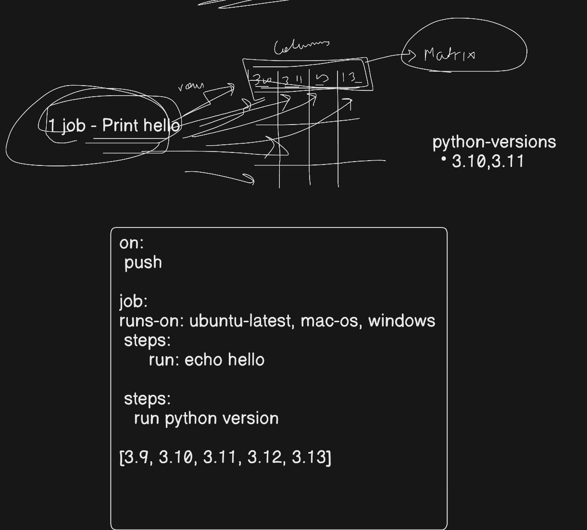


---

## Day Objectives

By the end of Day 41, I should be able to:

1. Understand what workflow triggers are in GitHub Actions.
2. Create a workflow that runs on a pull request.
3. Create a workflow that runs on a schedule using cron.
4. Create a workflow that runs manually using `workflow_dispatch`.
5. Create a matrix workflow that runs across multiple environments.
6. Exclude specific combinations from a matrix build.
7. Document each workflow YAML file.
8. Add screenshots of workflow runs.
9. Add `day-41-triggers.md` to the `2026/day-41/` folder.
10. Commit and push the work to my fork.

---

# Task 1: Trigger on Pull Request

## Task 1 Overview

In this task, I created a GitHub Actions workflow that runs automatically when a pull request is opened, updated, or reopened against the `main` branch.

This is important because in real-world DevOps projects, developers usually do not push changes directly to the `main` branch.

Instead, the common workflow is:

```text
Create a new branch
        ↓
Make changes
        ↓
Push the branch
        ↓
Open a pull request
        ↓
Run checks automatically
        ↓
Review and merge into main
```

A pull request workflow helps check code before it is merged into the main branch.

This improves code quality and prevents broken code from being merged into the main branch.

---

## Task 1 Objectives

After completing this task, I should understand:

1. How to create a GitHub Actions workflow file.
2. How to use the `pull_request` trigger.
3. How to run a workflow only when a pull request targets the `main` branch.
4. How to print the pull request branch name.
5. How to create a new Git branch.
6. How to push a branch to GitHub.
7. How to open a pull request.
8. How to verify the workflow from the Pull Request page.
9. How to verify the workflow from the Actions tab.

---

PR = Pull Request

Pull Request = Request to merge code from one branch into another branch

# Important Concept: What Is a Pull Request Trigger?

A **pull request trigger** starts a workflow when a pull request event happens.

Examples of pull request events:

| Event | Meaning |
|---|---|
| `opened` | A new pull request is created |
| `synchronize` | A new commit is pushed to the pull request branch |
| `reopened` | A closed pull request is opened again |

For this task, the workflow should run when a pull request is created or updated against the `main` branch.

---

# Step 1: Go to Your Repository

Open Git Bash, PowerShell, WSL, or VS Code terminal.

Go to your repository folder.

Example:

```bash
cd /c/Linux/90DaysOfDevOps/2026
```

Or if your repository is somewhere else:

```bash
cd path/to/github-actions-practice
```

Check the current Git status:

```bash
git status
```

Check the current branch:

```bash
git branch
```

Make sure you are on the branch where you want to add the workflow file.

Usually, the workflow file should first be added to `main`.

Switch to `main`:

```bash
git switch main
```

If `git switch` does not work, use:

```bash
git checkout main
```

---

# Step 2: Create the GitHub Actions Workflow Folder

GitHub Actions workflow files must be stored inside this folder:

```text
.github/workflows/
```

Create the folder:

```bash
mkdir -p .github/workflows
```

Explanation:

| Command | Meaning |
|---|---|
| `mkdir` | Make directory |
| `-p` | Create parent folders if they do not already exist |
| `.github/workflows` | Required folder for GitHub Actions workflow files |

---

# Step 3: Create the Pull Request Workflow File

Create a new workflow file named:

```text
pr-check.yml
```

Command:

```bash
touch .github/workflows/pr-check.yml
```

Open the file in VS Code:

```bash
code .github/workflows/pr-check.yml
```

If `code` command does not work, open the file manually from VS Code.

---

# Step 4: Add the Workflow YAML

Add this code inside `.github/workflows/pr-check.yml`:

```yaml
name: Pull Request Check

on:
  pull_request:
    branches:
      - main
    types:
      - opened
      - synchronize
      - reopened

jobs:
  pr-check:
    runs-on: ubuntu-latest

    steps:
      - name: Print PR branch name
        run: | 
          echo "PR check running for branch: ${{ github.head_ref }}"
```

---

# Step 5: Understand the YAML File

## Full YAML Explanation

| YAML Line | Explanation |
|---|---|
| `name: Pull Request Check` | This is the workflow name shown in the GitHub Actions tab |
| `on:` | Defines when the workflow should run |
| `pull_request:` | Runs the workflow on pull request events |
| `branches:` | Defines the target branch for the pull request |
| `- main` | Workflow runs only when the PR is targeting `main` |
| `types:` | Defines which pull request activities should trigger the workflow |
| `opened` | Runs when a pull request is created |
| `synchronize` | Runs when a new commit is pushed to the PR branch |
| `reopened` | Runs when a closed PR is opened again |
| `jobs:` | Defines the jobs in the workflow |
| `pr-check:` | Job name |
| `runs-on: ubuntu-latest` | Runs the job on an Ubuntu GitHub-hosted runner |
| `steps:` | Defines the steps inside the job |
| `name: Print PR branch name` | Name of the step |
| `run:` | Runs a shell command |
| `${{ github.head_ref }}` | Shows the source branch name of the pull request |

---

# Important Concept: `github.head_ref`

In a pull request workflow:

```yaml
${{ github.head_ref }}
```

means the source branch of the pull request.

Example:

If I create a pull request like this:

```text
day-41-pr-test  →  main
```

Then:

```text
github.head_ref = day-41-pr-test
```

So the workflow prints:

```text
PR check running for branch: day-41-pr-test
```

---

# Step 6: Save and Check Git Status

After saving the file, check Git status:

```bash
git status
```

You should see the new workflow file:

```text
.github/workflows/pr-check.yml
```

---

# Step 7: Add, Commit, and Push the Workflow File

Add the workflow file:

```bash
git add .github/workflows/pr-check.yml
```

Commit the workflow file:

```bash
git commit -m "Add pull request check workflow"
```

Push the workflow file:

```bash
git push
```

If your branch does not already track the remote branch, use:

```bash
git push -u origin main
```

---

# Step 8: Create a New Branch for Testing

Now create a new branch for testing the pull request workflow.

Command:

```bash
git switch -c day-41-pr-test
```

If `git switch` does not work, use:

```bash
git checkout -b day-41-pr-test
```

Explanation:

| Command | Meaning |
|---|---|
| `git switch -c` | Create and switch to a new branch |
| `day-41-pr-test` | Name of the new branch |

---

# Step 9: Make a Small Test Change

Create a small test file:

```bash
echo "Testing pull request trigger for Day 41" > day-41-pr-test.txt
```

Check status:

```bash
git status
```

You should see:

```text
day-41-pr-test.txt
```

as an untracked file.

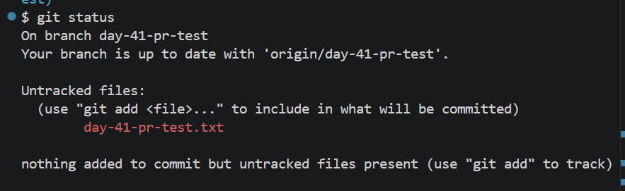


---

# Step 10: Commit the Test Change

Add the test file:

```bash
git add day-41-pr-test.txt
```

Commit the test file:

```bash
git commit -m "Test pull request trigger"
```

---

# Step 11: Push the Test Branch to GitHub

Push the new branch:

```bash
git push -u origin day-41-pr-test
```

Explanation:

| Command Part | Meaning |
|---|---|
| `git push` | Push local branch to GitHub |
| `-u` | Set upstream tracking |
| `origin` | Remote GitHub repository |
| `day-41-pr-test` | Branch name |

After this, GitHub knows about your new branch.

---

# Step 12: Open a Pull Request on GitHub

Now go to your GitHub repository in the browser.

You may see a message like:

```text
day-41-pr-test had recent pushes
```

Click:

```text
Compare & pull request
```

Make sure the pull request direction is:

```text
base: main
compare: day-41-pr-test
```

Meaning:

| Field | Meaning |
|---|---|
| `base: main` | Target branch where changes will be merged |
| `compare: day-41-pr-test` | Source branch that contains changes |

Then click:

```text
Create pull request
```

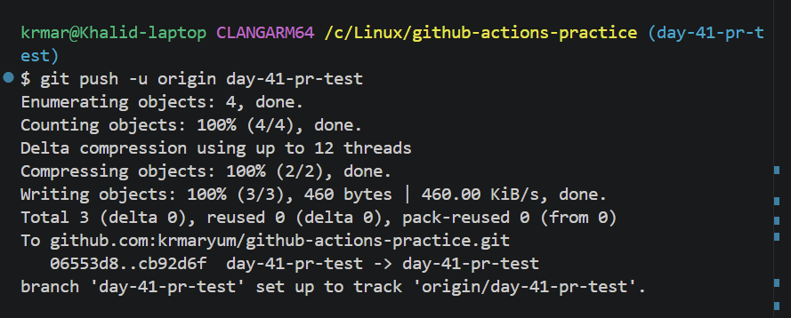

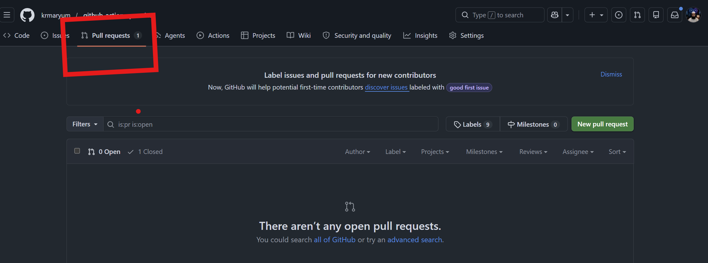

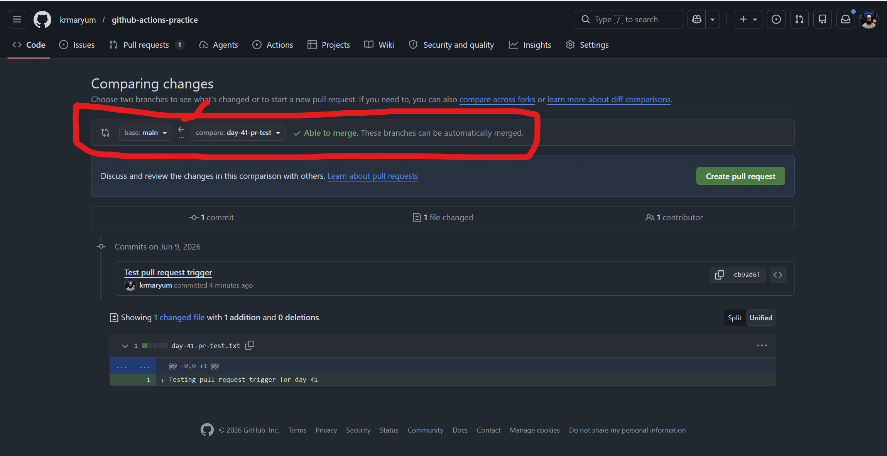

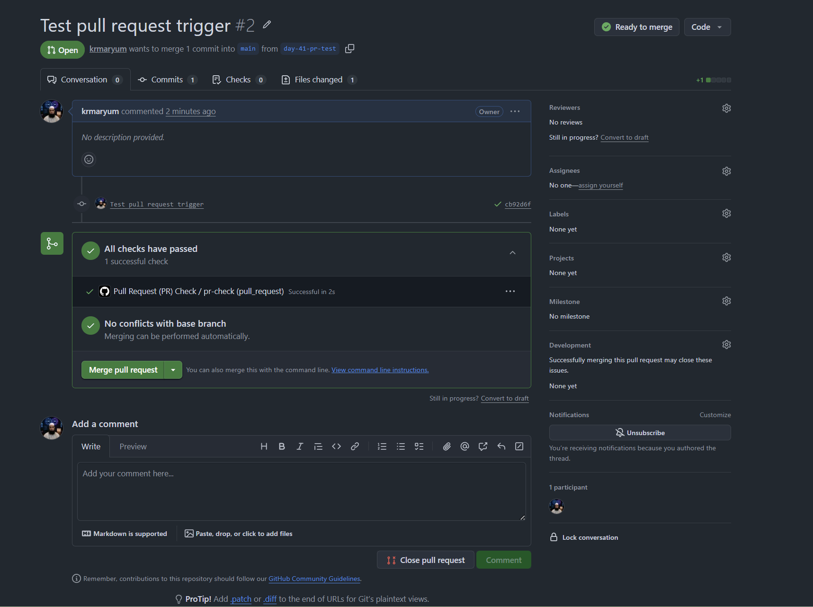

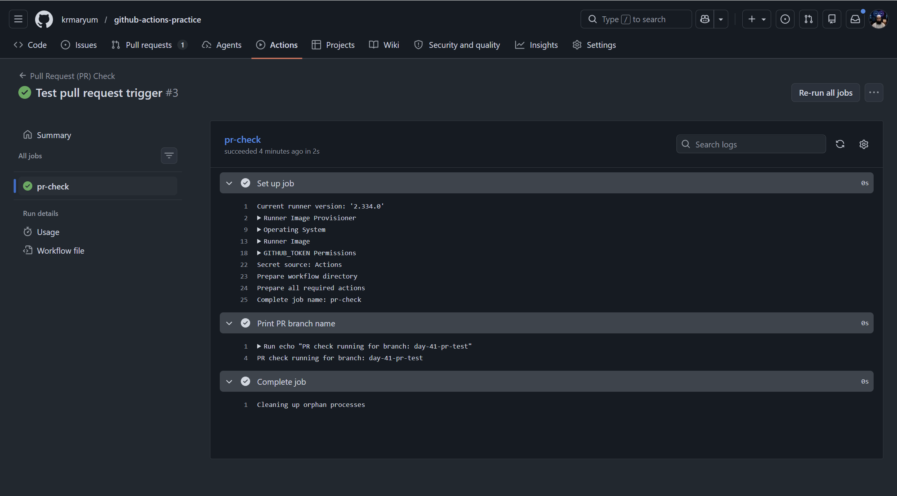

1. Pull Request page showing the workflow check.
2. Actions tab showing the workflow run.
3. Job log showing the printed branch name.

---

# Step 13: Watch the Workflow Run Automatically

After creating the pull request, GitHub Actions should start automatically.

You can verify it in two places:

## Place 1: Pull Request Page

On the pull request page, scroll down.

You should see a check like:

```text
Pull Request Check / pr-check
```

It may show one of these statuses:

| Status | Meaning |
|---|---|
| Queued | Workflow is waiting to start |
| In progress | Workflow is running |
| Successful | Workflow completed successfully |
| Failed | Workflow failed |

---

## Place 2: Actions Tab

Go to:

```text
Repository → Actions
```

Then click:

```text
Pull Request Check
```

Open the latest workflow run.

Click the job:

```text
pr-check
```

Open the step:

```text
Print PR branch name
```

Expected output:

```text
PR check running for branch: day-41-pr-test
```

---

# Step 14: Task 1 Verification Answer

Write this in your notes:

```markdown
## Task 1 Verification

Yes, the workflow showed up on the Pull Request page.

When I opened a pull request from `day-41-pr-test` into `main`, GitHub Actions automatically started the workflow named `Pull Request Check`.

The workflow ran the job `pr-check` on `ubuntu-latest`.

The output printed:

PR check running for branch: day-41-pr-test
```

---

# Common Mistakes and Fixes

## Mistake 1: Workflow Does Not Run

Possible reasons:

1. The pull request is not targeting `main`.
2. The workflow file is not inside `.github/workflows/`.
3. The file extension is wrong.
4. YAML indentation is wrong.
5. The workflow file was not pushed to GitHub.

Fix:

```bash
git status
git add .github/workflows/pr-check.yml
git commit -m "Fix PR workflow"
git push
```

---

## Mistake 2: Branch Name Does Not Print

Make sure this line is correct:

```yaml
run: echo "PR check running for branch: ${{ github.head_ref }}"
```

Do not use:

```yaml
github.ref_name
```

For pull request branch name, `github.head_ref` is better.

---

## Mistake 3: Pull Request Page Does Not Show Workflow

Check the Actions tab.

If the workflow exists in the Actions tab but not on the PR page, refresh the PR page.

Also make sure the PR is from:

```text
day-41-pr-test
```

to:

```text
main
```

---

# Final Task 1 Summary

In Task 1, I created a GitHub Actions workflow named:

```text
Pull Request Check
```

The workflow file was:

```text
.github/workflows/pr-check.yml
```

It used the `pull_request` trigger.

The workflow runs when a pull request is:

- opened
- updated with a new commit
- reopened

The workflow only runs when the pull request targets:

```text
main
```

The workflow prints the pull request branch name using:

```yaml
${{ github.head_ref }}
```

Example output:

```text
PR check running for branch: day-41-pr-test
```

This task helped me understand how DevOps teams use pull request checks before merging code into the main branch.

---

# Commands Summary

```bash
# Go to repository
cd /c/Linux/90DaysOfDevOps/2026

# Switch to main
git switch main

# Create workflow folder
mkdir -p .github/workflows

# Create workflow file
touch .github/workflows/pr-check.yml

# Open workflow file
code .github/workflows/pr-check.yml

# Check status
git status

# Add workflow file
git add .github/workflows/pr-check.yml

# Commit workflow file
git commit -m "Add pull request check workflow"

# Push workflow file
git push

# Create test branch
git switch -c day-41-pr-test

# Create test file
echo "Testing pull request trigger for Day 41" > day-41-pr-test.txt

# Add test file
git add day-41-pr-test.txt

# Commit test file
git commit -m "Test pull request trigger"

# Push test branch
git push -u origin day-41-pr-test
```

---

# Final Workflow File

File path:

```text
.github/workflows/pr-check.yml
```

Code:

```yaml
name: Pull Request Check

on:
  pull_request:
    branches:
      - main
    types:
      - opened
      - synchronize
      - reopened

jobs:
  pr-check:
    runs-on: ubuntu-latest

    steps:
      - name: Print PR branch name
        run: echo "PR check running for branch: ${{ github.head_ref }}"
```

---

# What to Submit for Task 1

For Task 1, I need to submit/document:

1. The workflow file:

```text
.github/workflows/pr-check.yml
```

2. The markdown notes file:

```text
2026/day-41/day-41-triggers.md
```

3. Screenshot of the workflow run.

4. Screenshot of the PR page showing the check.

5. Verification answer:

```text
Yes, it showed up on the PR page.
```

---

# Day 41 – Task 1: Pull Request Trigger Cleanup and Verification

## Overview

In this task, I created and tested a GitHub Actions workflow that runs automatically when a Pull Request is opened, updated, or reopened against the `main` branch.

After the Pull Request workflow ran successfully, I followed the proper cleanup steps:

1. Checked that my feature/test branch was clean
2. Switched back to the `main` branch
3. Pulled the latest merged changes from GitHub
4. Deleted the local test branch
5. Deleted the remote test branch from GitHub
6. Verified that only the `main` branch remained locally and remotely

This is a real DevOps practice because teams normally create a branch, open a Pull Request, run automated checks, merge the Pull Request, and then clean up the old branch.

---

## Why We Did These Steps

When working with Pull Requests, the normal workflow is:

```text
Create branch
    ↓
Make changes
    ↓
Push branch to GitHub
    ↓
Open Pull Request
    ↓
GitHub Actions runs checks
    ↓
Merge Pull Request into main
    ↓
Delete the temporary branch
    ↓
Update local main
```

The branch `day-41-pr-test` was only created to test the Pull Request trigger.  
After the Pull Request was merged, that branch was no longer needed.

---

# Step-by-Step Explanation

---

## Step 1: Checked the Test Branch Status

### Command

```bash
git status
```

### Output

```text
On branch day-41-pr-test
Your branch is up to date with 'origin/day-41-pr-test'.

nothing to commit, working tree clean
```

### Explanation

This confirmed that I was currently on the test branch:

```text
day-41-pr-test
```

It also showed:

```text
nothing to commit, working tree clean
```

That means:

- No files were modified
- No files were waiting to be committed
- The local branch and remote branch were synchronized
- It was safe to switch branches

### Important Point

Before switching branches or deleting branches, it is always good practice to run:

```bash
git status
```

This helps avoid losing uncommitted work.

---

## Step 2: Switched Back to the Main Branch

### Command

```bash
git switch main
```

### Output

```text
Switched to branch 'main'
Your branch is up to date with 'origin/main'.
```

### Explanation

This command moved me from the test branch back to the main branch.

Before:

```text
day-41-pr-test
```

After:

```text
main
```

The `main` branch is the main working branch of the repository.  
After a Pull Request is merged, we normally go back to `main`.

### Why This Step Is Important

We should not delete a branch while we are currently standing on that same branch.

So before deleting `day-41-pr-test`, I switched to:

```bash
main
```

---

## Step 3: Checked the Main Branch Status

### Command

```bash
git status
```

### Output

```text
On branch main
Your branch is up to date with 'origin/main'.

nothing to commit, working tree clean
```

### Explanation

This confirmed that I was now on the `main` branch.

It also confirmed:

- Local `main` was connected to `origin/main`
- There were no uncommitted changes
- The working directory was clean

At this point, it was safe to pull the latest changes from GitHub.

---

## Step 4: Pulled the Latest Main Branch from GitHub

### Command

```bash
git pull origin main
```

### Output

```text
remote: Enumerating objects: 1, done.
remote: Counting objects: 100% (1/1), done.
remote: Total 1 (delta 0), reused 0 (delta 0), pack-reused 0 (from 0)
Unpacking objects: 100% (1/1), 896 bytes | 448.00 KiB/s, done.
From github.com:krmaryum/github-actions-practice
 * branch            main       -> FETCH_HEAD
   42a73c3..0bbde83  main       -> origin/main
Updating 42a73c3..0bbde83
Fast-forward
```

### Explanation

This command downloaded the latest changes from GitHub's `main` branch and updated my local `main` branch.

This happened because the Pull Request was merged on GitHub.  
My local computer did not automatically know about that merge until I ran:

```bash
git pull origin main
```

### What `Fast-forward` Means

Git showed:

```text
Fast-forward
```

This means Git was able to move the local `main` branch forward directly to match the updated remote `main`.

In simple words:

```text
No conflict happened.
Git simply updated local main with the latest GitHub main.
```

---

## Step 5: Deleted the Local Test Branch

### Command

```bash
git branch -d day-41-pr-test
```

### Output

```text
warning: deleting branch 'day-41-pr-test' that has been merged to
         'refs/remotes/origin/day-41-pr-test', but not yet merged to HEAD
Deleted branch day-41-pr-test (was cb92d6f).
```

### Explanation

This command deleted the local branch:

```text
day-41-pr-test
```

The `-d` option means safe delete.

```bash
git branch -d branch-name
```

Git only deletes the branch safely if it believes the branch has already been merged.

### Why the Warning Appeared

Git showed this warning:

```text
warning: deleting branch 'day-41-pr-test' that has been merged to
         'refs/remotes/origin/day-41-pr-test', but not yet merged to HEAD
```

This warning means Git was saying:

```text
This branch looks merged into its remote tracking branch, but I am not fully sure it is merged into your current local HEAD.
```

In this case, it was not a problem because:

- The Pull Request had already passed checks
- The Pull Request was merged on GitHub
- I had already pulled the latest `main`
- The branch was only a test branch

After that, Git deleted it successfully:

```text
Deleted branch day-41-pr-test
```

### Important Point

If you are not sure whether a branch is merged, you can check with:

```bash
git branch --merged
```

If a branch appears in this list, it is merged into your current branch.

---

## Step 6: Deleted the Remote Test Branch from GitHub

### Command

```bash
git push origin --delete day-41-pr-test
```

### Output

```text
To github.com:krmaryum/github-actions-practice.git
 - [deleted]         day-41-pr-test
```

### Explanation

This deleted the remote branch from GitHub.

There are two types of branches:

| Branch Type | Example | Location |
|---|---|---|
| Local branch | `day-41-pr-test` | On my computer |
| Remote branch | `origin/day-41-pr-test` | On GitHub |

The previous command deleted the local branch only.

```bash
git branch -d day-41-pr-test
```

This command deleted the remote branch from GitHub:

```bash
git push origin --delete day-41-pr-test
```

### Why We Delete Remote Branches

After a Pull Request is merged, the temporary branch is usually no longer needed.

Deleting old branches keeps the repository clean and easier to manage.

---

## Step 7: Pulled Main Again to Confirm Everything Was Updated

### Command

```bash
git pull origin main
```

### Output

```text
From github.com:krmaryum/github-actions-practice
 * branch            main       -> FETCH_HEAD
Already up to date.
```

### Explanation

This command confirmed that local `main` and GitHub `main` were already synchronized.

The message:

```text
Already up to date.
```

means:

- No new changes were found on GitHub
- Local `main` already had the latest code
- The repository was fully updated

---

# Final Verification

After cleanup, I ran three verification commands.

---

## Verification 1: Checked Working Tree Status

### Command

```bash
git status
```

### Output

```text
On branch main
Your branch is up to date with 'origin/main'.

nothing to commit, working tree clean
```

### Explanation

This confirmed:

- I was on the `main` branch
- My local `main` was up to date with GitHub
- There were no uncommitted changes
- The working directory was clean

This is the best final state after completing a task.

---

## Verification 2: Checked Local Branches

### Command

```bash
git branch
```

### Output

```text
* main
```

### Explanation

This showed that only one local branch remained:

```text
main
```

The star `*` means this is the current active branch.

This confirmed that the local test branch was deleted successfully.

---

## Verification 3: Checked Remote Branches

### Command

```bash
git branch -r
```

### Output

```text
origin/main
```

### Explanation

This showed that only one remote branch remained:

```text
origin/main
```

This confirmed that the remote test branch was also deleted successfully from GitHub.

---

# Final Result

The final repository state was:

| Check | Result |
|---|---|
| Current branch | `main` |
| Working tree | Clean |
| Local branch list | Only `main` |
| Remote branch list | Only `origin/main` |
| PR workflow | Passed |
| PR branch | Deleted locally and remotely |

---

# What I Learned

In this task, I learned how to complete a Pull Request workflow properly.

I learned that after a Pull Request is merged:

1. Switch back to `main`
2. Pull the latest changes
3. Delete the local feature/test branch
4. Delete the remote feature/test branch
5. Verify the final repository status

---

# Important Commands Used

## Check current branch and file status

```bash
git status
```

## Switch to main branch

```bash
git switch main
```

## Pull latest main branch from GitHub

```bash
git pull origin main
```

## Delete local branch

```bash
git branch -d day-41-pr-test
```

## Delete remote branch

```bash
git push origin --delete day-41-pr-test
```

## List local branches

```bash
git branch
```

## List remote branches

```bash
git branch -r
```

---

# Simple Summary

I created a test branch for the Pull Request trigger.  
After the Pull Request check passed and the Pull Request was merged into `main`, I cleaned up the repository.

I switched back to `main`, pulled the latest changes, deleted the test branch from my computer, deleted the same branch from GitHub, and verified that only `main` and `origin/main` remained.

This confirmed that the Pull Request trigger task was completed successfully.

---

# Real DevOps Meaning

In real DevOps teams, developers do not usually push directly to the `main` branch.

They normally:

```text
Create feature branch
Open Pull Request
Run automated checks
Review code
Merge into main
Delete old branch
```

GitHub Actions helps automate the checking process.

This task showed how a Pull Request can automatically trigger a workflow and how to clean up the branch after the Pull Request is merged.


# Branch → Pull Request → GitHub Actions check → Merge → Pull latest main → Delete branches → Verify clean repo

---

# Task 2: Scheduled Trigger Using Cron Syntax

## Task Name

Task 2: Scheduled Trigger

---

## Task Requirement

Add a `schedule` trigger to any GitHub Actions workflow using cron syntax.

The workflow should run:

```text
Every day at midnight UTC
```

Also write in the notes:

```text
What is the cron expression for every Monday at 9 AM?
```

---

## Day 41 Task 2 Overview

In this task, I learned how to run a GitHub Actions workflow automatically at a specific time using the `schedule` trigger.

GitHub Actions uses cron syntax for scheduled workflows.

A scheduled workflow does not need a manual push every time.  
It can run automatically based on time.

Examples:

- Every day at midnight
- Every Monday at 9 AM
- Every hour
- Every week
- Every month

---

## Task 2 Objectives

By the end of this task, I should understand:

1. What a scheduled trigger is
2. What cron syntax means
3. How to create a scheduled GitHub Actions workflow
4. Why GitHub Actions uses UTC time
5. How to convert local time to UTC
6. How to write the cron expression for every day at midnight UTC
7. How to write the cron expression for every Monday at 9 AM UTC
8. How to add, commit, and push the workflow file
9. How to verify the workflow in the GitHub Actions tab

---

# 1. What Is a Scheduled Trigger?

A scheduled trigger is used to run a GitHub Actions workflow automatically at a specific time.

In GitHub Actions, the scheduled trigger is written like this:

```yaml
on:
  schedule:
    - cron: '0 0 * * *'
```

This means the workflow will run automatically according to the cron expression.

https://www.uptimia.com/cron-expression-generator

---

## Simple Explanation

A normal workflow may run when we push code:

```yaml
on: push
```

A Pull Request workflow may run when we open a Pull Request:

```yaml
on: pull_request
```

A scheduled workflow runs based on time:

```yaml
on:
  schedule:
    - cron: '0 0 * * *'
```

So scheduled workflows are useful for automatic jobs.

---

# 2. Real DevOps Use Cases of Scheduled Workflows

Scheduled workflows are very common in real DevOps environments.

They can be used for:

| Use Case | Example |
|---|---|
| Daily checks | Run health checks every night |
| Backups | Run backup jobs every day |
| Reports | Generate daily or weekly reports |
| Security scans | Run dependency scans every night |
| Cleanup jobs | Delete old logs or old artifacts |
| Testing | Run automated test suites every morning |
| Monitoring | Check if services are working |

---

# 3. What Is Cron Syntax?

Cron syntax is a time-based format used to schedule jobs.

In GitHub Actions, cron has 5 fields:

```text
minute hour day-of-month month day-of-week
```

Example:

```cron
0 0 * * *
```

This means:

```text
Run at minute 0, hour 0, every day, every month, every day of the week
```

---

## Cron Field Breakdown

| Field | Position | Example Value | Meaning |
|---|---|---|---|
| Minute | 1st field | `0` | At minute 0 |
| Hour | 2nd field | `0` | At hour 0 |
| Day of Month | 3rd field | `*` | Every day of the month |
| Month | 4th field | `*` | Every month |
| Day of Week | 5th field | `*` | Every day of the week |

---

# 4. Cron Expression for Every Day at Midnight UTC

The task asks to run the workflow:

```text
Every day at midnight UTC
```

Midnight means:

```text
00:00
```

So the cron expression is:

```cron
0 0 * * *
```

---

## Explanation of `0 0 * * *`

| Field | Value | Meaning |
|---|---|---|
| Minute | `0` | At minute 0 |
| Hour | `0` | At hour 0, midnight |
| Day of Month | `*` | Every day of the month |
| Month | `*` | Every month |
| Day of Week | `*` | Every day of the week |

So:

```cron
0 0 * * *
```

means:

```text
Run every day at 12:00 AM UTC
```

---

# 5. Important Point: GitHub Actions Uses UTC Time

GitHub Actions scheduled workflows always use UTC time.

This is very important.

GitHub does not use my laptop time, Windows time, WSL time, Chicago time, or Pakistan time directly.

It uses UTC.

So if I write:

```yaml
cron: '0 0 * * *'
```

GitHub will run the workflow at:

```text
12:00 AM UTC
```

Not necessarily at my local midnight.

---

## What Is UTC?

UTC stands for:

```text
Coordinated Universal Time
```

It is the global standard time used by servers, cloud platforms, pipelines, and automation tools.

Many DevOps systems use UTC because teams and servers may be located in different countries.

---

# 6. How to Handle UTC Time

```bash
date -u
```
Means: show UTC/world standard time

This is very important in Linux because servers, logs, cloud systems, GitHub Actions, Docker, Kubernetes, and cron jobs often use UTC time.

To handle UTC time, I need to convert my local time into UTC before writing the cron expression.

Simple method:

```text
Local time + time difference = UTC time
```

For example, if I want the workflow to run at my local midnight, I need to convert my local midnight to UTC.

---

## Example: Chicago / Palatine Time

Chicago and Palatine use Central Time.

During daylight saving time, the time zone is usually:

```text
CDT = UTC-5
```

That means Chicago/Palatine time is 5 hours behind UTC.

So:

```text
12:00 AM Chicago time + 5 hours = 5:00 AM UTC
```

If I want the workflow to run at midnight Chicago time during CDT, I would use:

```cron
0 5 * * *
```

But for this task, we do not need to convert because the task specifically says:

```text
midnight UTC
```

So we use:

```cron
0 0 * * *
```

---

## Important Note About Daylight Saving Time

Some locations change time during the year because of daylight saving time.

For example:

| Time Zone | UTC Difference |
|---|---|
| CST | UTC-6 |
| CDT | UTC-5 |

This means a workflow that matches local time during one part of the year may run one hour different during another part of the year.

Because GitHub scheduled workflows use UTC, we must be careful when planning local-time automation.

---

# 7. Create the Workflow File

Create a new workflow file:

```bash
.github/workflows/scheduled-trigger.yml
```

If the folder does not exist, create it:

```bash
mkdir -p .github/workflows
```

Then create the file:

```bash
touch .github/workflows/scheduled-trigger.yml
```

---

# 8. Add the Scheduled Workflow YAML

Open the file:

```bash
code .github/workflows/scheduled-trigger.yml
```

Add this code:

```yaml
name: Scheduled Trigger

on:
  schedule:
    - cron: '0 0 * * *'

jobs:
  scheduled-job:
    runs-on: ubuntu-latest

    steps:
      - name: Print scheduled workflow message
        run: |
          echo "This workflow runs every day at midnight UTC."
          echo "Current date and time:"
          date
```

---

# 9. Workflow YAML Explanation

## Workflow Name

```yaml
name: Scheduled Trigger
```

This is the name of the workflow that will appear in the GitHub Actions tab.

---

## Schedule Trigger

```yaml
on:
  schedule:
    - cron: '0 0 * * *'
```

This tells GitHub Actions to run the workflow automatically every day at midnight UTC.

---

## Job Name

```yaml
jobs:
  scheduled-job:
```

This creates one job named:

```text
scheduled-job
```

---

## Runner

```yaml
runs-on: ubuntu-latest
```

This means the job will run on GitHub-hosted Ubuntu runner.

---

## Workflow Step

```yaml
steps:
  - name: Print scheduled workflow message
```

This is the step name shown in the GitHub Actions log.

---

## Run Commands

```yaml
run: |
  echo "This workflow runs every day at midnight UTC."
  echo "Current date and time:"
  date
```

This prints a message and displays the current date/time in the runner.

The `date` command helps confirm when the workflow ran.

---

# 10. Check Git Status

After saving the file, run:

```bash
git status
```

Expected result:

```text
Untracked files:
  .github/workflows/scheduled-trigger.yml
```

or:

```text
Changes not staged for commit:
  modified: .github/workflows/scheduled-trigger.yml
```

This means Git detected the new or modified workflow file.

---

# 11. Add the Workflow File to Staging Area

Run:

```bash
git add .github/workflows/scheduled-trigger.yml
```

Then check status again:

```bash
git status
```

Expected result:

```text
Changes to be committed:
  new file: .github/workflows/scheduled-trigger.yml
```

---

# 12. Commit the Workflow File

Run:

```bash
git commit -m "Add scheduled trigger workflow"
```

This saves the workflow change in Git history.

---

# 13. Push the Workflow to GitHub

Run:

```bash
git push
```

If Git asks for upstream branch, use:

```bash
git push -u origin main
```

After pushing, the workflow file will be available on GitHub.

---

# 14. Verify in GitHub Actions

Go to the GitHub repository.

Open:

```text
Actions tab
```

Look for the workflow name:

```text
Scheduled Trigger
```

Important:

Scheduled workflows may not run immediately.

They run at the next scheduled time according to the cron expression.

For this task:

```cron
0 0 * * *
```

The workflow will run at the next midnight UTC.

---

# 15. Why It May Not Run Immediately

A scheduled trigger is different from a push trigger.

A push trigger runs when code is pushed.

A schedule trigger runs only when the scheduled time arrives.

So after pushing the workflow, I may see the workflow listed in GitHub Actions, but it may not have a run yet.

That is normal.

---

# 16. Optional: Add Manual Trigger for Testing

Sometimes we add `workflow_dispatch` so we can test the scheduled workflow manually.

Example:

```yaml
name: Scheduled Trigger

on:
  schedule:
    - cron: '0 0 * * *'
  workflow_dispatch:

jobs:
  scheduled-job:
    runs-on: ubuntu-latest

    steps:
      - name: Print scheduled workflow message
        run: |
          echo "This workflow runs every day at midnight UTC."
          echo "Current date and time:"
          date
```

---

## Why Add `workflow_dispatch`?

The schedule trigger may not run immediately.

By adding:

```yaml
workflow_dispatch:
```

I can run the workflow manually from the GitHub Actions tab.

This is useful for testing.

---

# 17. Recommended Version for Practice

For practice, this version is better because it includes both schedule and manual trigger:

```yaml
name: Scheduled Trigger

on:
  schedule:
    - cron: '0 0 * * *'
  workflow_dispatch:

jobs:
  scheduled-job:
    runs-on: ubuntu-latest

    steps:
      - name: Print scheduled workflow message
        run: |
          echo "This workflow runs every day at midnight UTC."
          echo "Current date and time:"
          date
```

This workflow can run:

1. Automatically every day at midnight UTC
2. Manually using the Run workflow button

---

# 18. Task Question: Cron Expression for Every Monday at 9 AM

The task asks:

```text
What is the cron expression for every Monday at 9 AM?
```

The answer is:

```cron
0 9 * * 1
```

---

## Explanation of `0 9 * * 1`

| Field | Value | Meaning |
|---|---|---|
| Minute | `0` | At minute 0 |
| Hour | `9` | At 9 AM |
| Day of Month | `*` | Every day of the month |
| Month | `*` | Every month |
| Day of Week | `1` | Monday |

So:

```cron
0 9 * * 1
```

means:

```text
Every Monday at 9:00 AM UTC
```

---

# 19. Common Cron Examples

| Schedule | Cron Expression | Meaning |
|---|---|---|
| Every day at midnight UTC | `0 0 * * *` | Daily at 12:00 AM UTC |
| Every Monday at 9 AM UTC | `0 9 * * 1` | Monday at 9:00 AM UTC |
| Every hour | `0 * * * *` | At the start of every hour |
| Every 30 minutes | `*/30 * * * *` | Every 30 minutes |
| Every Sunday at midnight UTC | `0 0 * * 0` | Sunday at 12:00 AM UTC |
| First day of every month | `0 0 1 * *` | Monthly on day 1 at midnight UTC |

---

# 20. Day of Week Values

In cron syntax, the day of week can be written using numbers.

| Number | Day |
|---|---|
| `0` | Sunday |
| `1` | Monday |
| `2` | Tuesday |
| `3` | Wednesday |
| `4` | Thursday |
| `5` | Friday |
| `6` | Saturday |

Sometimes Sunday can also be represented by `7`, but using `0` for Sunday is common.

---

# 21. Final Commands Summary

```bash
mkdir -p .github/workflows
touch .github/workflows/scheduled-trigger.yml
code .github/workflows/scheduled-trigger.yml
git status
git add .github/workflows/scheduled-trigger.yml
git commit -m "Add scheduled trigger workflow"
git push
```

---

# 22. Final Workflow File

```yaml
name: Scheduled Trigger

on:
  schedule:
    - cron: '0 0 * * *'
  workflow_dispatch:

jobs:
  scheduled-job:
    runs-on: ubuntu-latest

    steps:
      - name: Print scheduled workflow message
        run: |
          echo "This workflow runs every day at midnight UTC."
          echo "Current date and time:"
          date
```

---

# 23. Final Answer for Notes

The cron expression for every day at midnight UTC is:

```cron
0 0 * * *
```

The cron expression for every Monday at 9 AM UTC is:

```cron
0 9 * * 1
```

---

# 24. Simple Summary

In this task, I created a scheduled GitHub Actions workflow.

The workflow uses:

```yaml
on:
  schedule:
    - cron: '0 0 * * *'
```

This means the workflow runs every day at midnight UTC.

I also learned that GitHub Actions scheduled workflows use UTC time, not local time.  
If I want to run a workflow based on my local time, I must convert my local time to UTC first.

The cron expression for every Monday at 9 AM UTC is:

```cron
0 9 * * 1
```

---

# 25. What I Learned

I learned that:

1. GitHub Actions can run workflows automatically using scheduled triggers.
2. Scheduled workflows use cron syntax.
3. GitHub Actions schedule uses UTC time.
4. `0 0 * * *` means every day at midnight UTC.
5. `0 9 * * 1` means every Monday at 9 AM UTC.
6. Scheduled workflows may not run immediately after pushing.
7. Adding `workflow_dispatch` allows manual testing.
8. Scheduled workflows are useful for real DevOps automation tasks such as reports, backups, scans, and cleanup jobs.

---

# 26. Real DevOps Meaning

In real DevOps work, scheduled workflows are used to automate repeated tasks.

For example:

```text
Every night:
  Run tests
  Scan dependencies
  Generate reports
  Clean old files
  Check application health
```

This reduces manual work and makes the system more reliable.

Scheduled triggers are very important for automation, monitoring, and maintenance.

[Click here to watch the video demo](videos/workflow-cron.mp4)

---

# Task 3: Manual Trigger Using `workflow_dispatch`

## Task Name

Task 3: Manual Trigger

---

## Task Requirement

Create a GitHub Actions workflow file:

```text
.github/workflows/manual.yml
```

The workflow must use:

```yaml
workflow_dispatch:
```

It should also include an input that asks for an environment name:

```text
staging / production
```

The workflow should print the selected input value in a step.

Then verify the workflow by going to:

```text
GitHub Repository → Actions tab → Manual Trigger workflow → Run workflow
```

---

# Day 41 Task 3 Overview

In this task, I learned how to create a GitHub Actions workflow that can be started manually.

Normally, workflows can run automatically when something happens, for example:

```yaml
on: push
```

or:

```yaml
on: pull_request
```

But sometimes we do not want a workflow to run automatically. Instead, we want to run it only when we manually click a button in GitHub.

For that, GitHub Actions provides:

```yaml
workflow_dispatch:
```

This creates a **Run workflow** button in the GitHub Actions tab.

---

# Task 3 Objectives

By the end of this task, I should understand:

1. What a manual trigger is
2. What `workflow_dispatch` means
3. How to create a manually triggered workflow
4. How to add input fields to a manual workflow
5. How to use `staging` and `production` as environment choices
6. How to print the selected input value
7. How to manually run the workflow from GitHub Actions
8. How to verify the output in workflow logs
9. Why manual triggers are useful in real DevOps projects

---

# 1. What Is a Manual Trigger?

A manual trigger allows a user to start a GitHub Actions workflow by clicking a button.

The button is called:

```text
Run workflow
```

This button appears in the GitHub Actions tab when the workflow uses:

```yaml
workflow_dispatch:
```

---

## Simple Explanation

A push trigger runs automatically when code is pushed:

```yaml
on: push
```

A Pull Request trigger runs automatically when a Pull Request is opened or updated:

```yaml
on: pull_request
```

A manual trigger runs only when a user manually starts it:

```yaml
on:
  workflow_dispatch:
```

---

# 2. Why Manual Triggers Are Useful

Manual triggers are useful when we want control before running a workflow.

Examples:

| Use Case | Explanation |
|---|---|
| Manual deployment | Deploy only when a person approves it |
| Production release | Run production deployment carefully |
| Testing workflow | Test a workflow without pushing new code |
| Emergency rollback | Manually start rollback if something breaks |
| Maintenance job | Run cleanup or backup when needed |
| Environment selection | Choose staging or production before running |

---

# 3. Real DevOps Meaning

In real DevOps teams, manual triggers are often used for deployment workflows.

Example:

```text
Developer pushes code
    ↓
Pull Request checks pass
    ↓
Code is merged into main
    ↓
Engineer manually triggers deployment
    ↓
Engineer selects staging or production
    ↓
Pipeline deploys to selected environment
```

This gives teams better control, especially for production deployments.

---

# 4. Step 1: Make Sure You Are on the Main Branch

Before creating the workflow, check the current branch.

```bash
git branch
```

If you are not on `main`, switch to `main`:

```bash
git switch main
```

Then pull the latest code from GitHub:

```bash
git pull origin main
```

---

## Why This Step Is Important

It is good practice to create workflow files from the latest `main` branch.

This helps avoid conflicts and makes sure the repository is updated.

---

# 5. Step 2: Create the Workflow File

The task asks to create this file:

```text
.github/workflows/manual.yml
```

Run:

```bash
mkdir -p .github/workflows
touch .github/workflows/manual.yml
```

---

## Explanation

The `.github/workflows/` folder is the default folder where GitHub looks for workflow files.

Any workflow YAML file should be placed inside:

```text
.github/workflows/
```

The file name for this task is:

```text
manual.yml
```

---

# 6. Step 3: Open the Workflow File

Open the file in VS Code:

```bash
code .github/workflows/manual.yml
```

Then add the workflow YAML code.

---

# 7. Final Workflow Code

Add this complete code into:

```text
.github/workflows/manual.yml
```

```yaml
name: Manual Trigger

on:
  workflow_dispatch:
    inputs:
      environment:
        description: 'Choose environment name'
        required: true
        default: 'staging'
        type: choice
        options:
          - staging
          - production

jobs:
  manual-job:
    runs-on: ubuntu-latest

    steps:
      - name: Print selected environment
        run: |
          echo "Manual workflow was triggered."
          echo "Selected environment is: ${{ github.event.inputs.environment }}"
```

---

# 8. Workflow Code Explanation

## Workflow Name

```yaml
name: Manual Trigger
```

This is the name that appears in the GitHub Actions tab.

---

## Manual Trigger

```yaml
on:
  workflow_dispatch:
```

This tells GitHub:

```text
Do not run this workflow automatically.
Show a Run workflow button so I can run it manually.
```

---

## Inputs Section

```yaml
inputs:
  environment:
```

This creates an input field named:

```text
environment
```

When running the workflow manually, GitHub will ask the user to select or enter an environment.

---

## Description

```yaml
description: 'Choose environment name'
```

This message appears beside the input in the GitHub Actions UI.

It explains what the user should select.

---

## Required Input

```yaml
required: true
```

This means the user must provide/select a value before running the workflow.

The workflow cannot be started without this input.

---

## Default Value

```yaml
default: 'staging'
```

This means the default selected value will be:

```text
staging
```

If the user does not change it, the workflow will use `staging`.

---

## Choice Input Type

```yaml
type: choice
```

This means the input will appear as a dropdown list.

The user can choose from predefined options.

---

## Input Options

```yaml
options:
  - staging
  - production
```

This gives two allowed choices:

```text
staging
production
```

The user cannot type any random environment name if `type: choice` is used.

---

# 9. Jobs Section Explanation

```yaml
jobs:
  manual-job:
```

This creates one job named:

```text
manual-job
```

---

## Runner

```yaml
runs-on: ubuntu-latest
```

This tells GitHub Actions to run the job on an Ubuntu runner.

---

## Steps Section

```yaml
steps:
  - name: Print selected environment
```

This creates one step named:

```text
Print selected environment
```

This name appears in the workflow logs.

---

## Print Commands

```yaml
run: |
  echo "Manual workflow was triggered."
  echo "Selected environment is: ${{ github.event.inputs.environment }}"
```

This runs shell commands.

The first command prints:

```text
Manual workflow was triggered.
```

The second command prints the environment selected by the user.

---

# 10. Important Expression

The selected input value is accessed using:

```yaml
${{ github.event.inputs.environment }}
```

This means:

```text
Read the value of the environment input from the manual workflow event.
```

---

## Example Output

If I select:

```text
staging
```

The log should show:

```text
Manual workflow was triggered.
Selected environment is: staging
```

If I select:

```text
production
```

The log should show:

```text
Manual workflow was triggered.
Selected environment is: production
```

---

# 11. Step 4: Save the File

After adding the YAML code, save the file in VS Code.

Then run:

```bash
git status
```

Expected output may show:

```text
Untracked files:
  .github/workflows/manual.yml
```

This means Git detected the new workflow file.

---

# 12. Step 5: Add the File to Staging Area

Run:

```bash
git add .github/workflows/manual.yml
```

Then check again:

```bash
git status
```

Expected output:

```text
Changes to be committed:
  new file: .github/workflows/manual.yml
```

---

# 13. Step 6: Commit the Workflow File

Run:

```bash
git commit -m "Add manual trigger workflow"
```

This saves the workflow file into Git history.

---

# 14. Step 7: Push to GitHub

Run:

```bash
git push
```

If Git asks for upstream, use:

```bash
git push -u origin main
```

After pushing, the workflow will appear in GitHub Actions.

---

# 15. Step 8: Run the Workflow Manually

Go to your GitHub repository.

Open:

```text
Actions
```

On the left side, find:

```text
Manual Trigger
```

Click the workflow.

Then click:

```text
Run workflow
```

You should see the input field:

```text
environment
```

Select one option:

```text
staging
```

or:

```text
production
```

Then click the green button:

```text
Run workflow
```

---

# 16. Step 9: Verify the Workflow Run

After starting the workflow manually, open the latest run.

Click the job:

```text
manual-job
```

Then open the step:

```text
Print selected environment
```

Check the logs.

Expected output for staging:

```text
Manual workflow was triggered.
Selected environment is: staging
```

Expected output for production:

```text
Manual workflow was triggered.
Selected environment is: production
```

---

# 17. Verification Answer

The task asks:

```text
Can you trigger it manually and see your input printed?
```

Answer:

```text
Yes. I was able to trigger the workflow manually from the GitHub Actions tab using the Run workflow button. I selected the environment input, and the workflow printed the selected value in the job logs.
```

---

# 18. Common Mistakes and Fixes

## Mistake 1: Workflow Does Not Appear in Actions

Possible reasons:

- File is not inside `.github/workflows/`
- File was not pushed to GitHub
- YAML syntax is wrong
- File extension is not `.yml` or `.yaml`

Fix:

```bash
git status
git add .github/workflows/manual.yml
git commit -m "Add manual trigger workflow"
git push
```

---

## Mistake 2: Run Workflow Button Does Not Show

Possible reason:

The workflow may not have:

```yaml
workflow_dispatch:
```

Correct syntax:

```yaml
on:
  workflow_dispatch:
```

---

## Mistake 3: YAML Indentation Error

YAML depends on spaces.

Correct:

```yaml
on:
  workflow_dispatch:
    inputs:
      environment:
        description: 'Choose environment name'
```

Wrong:

```yaml
on:
workflow_dispatch:
inputs:
environment:
```

---

## Mistake 4: Wrong Input Reference

Correct:

```yaml
${{ github.event.inputs.environment }}
```

Wrong:

```yaml
${{ github.inputs.environment }}
```

Wrong:

```yaml
${{ inputs.environment }}
```

For this beginner task, use:

```yaml
${{ github.event.inputs.environment }}
```

---

# 19. Final Commands Summary

```bash
git switch main
git pull origin main
mkdir -p .github/workflows
touch .github/workflows/manual.yml
code .github/workflows/manual.yml
git status
git add .github/workflows/manual.yml
git commit -m "Add manual trigger workflow"
git push
```

---

# 20. Final Workflow File Summary

File path:

```text
.github/workflows/manual.yml
```

Workflow:

```yaml
name: Manual Trigger

on:
  workflow_dispatch:
    inputs:
      environment:
        description: 'Choose environment name'
        required: true
        default: 'staging'
        type: choice
        options:
          - staging
          - production

jobs:
  manual-job:
    runs-on: ubuntu-latest

    steps:
      - name: Print selected environment
        run: |
          echo "Manual workflow was triggered."
          echo "Selected environment is: ${{ github.event.inputs.environment }}"
```

---

# 21. What I Learned

In this task, I learned:

1. `workflow_dispatch` creates a manual trigger.
2. Manual workflows can be started from the GitHub Actions tab.
3. Inputs can be added to manual workflows.
4. Inputs allow the user to choose values before running the workflow.
5. `type: choice` creates a dropdown.
6. The selected input can be printed using GitHub context.
7. Manual triggers are useful for controlled deployments.
8. Manual triggers are commonly used for staging and production workflows.

---

# 22. Simple Summary

I created a workflow file named:

```text
.github/workflows/manual.yml
```

I used:

```yaml
workflow_dispatch:
```

to make the workflow manually triggerable.

I added an input named:

```text
environment
```

with two choices:

```text
staging
production
```

Then I printed the selected input value using:

```yaml
${{ github.event.inputs.environment }}
```

Finally, I went to the GitHub Actions tab, clicked the workflow, selected an environment, clicked **Run workflow**, and verified that the selected environment was printed in the logs.

---

## Manual Trigger Verification

The manual workflow ran successfully.

Workflow name:

```text
Manual Trigger
```
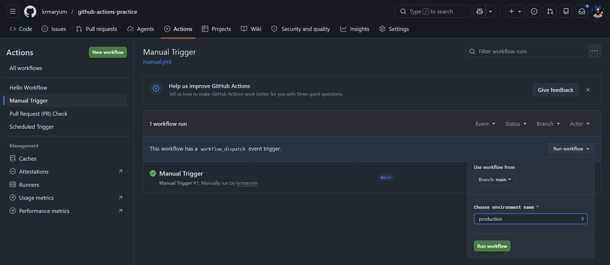

## Workflow Video Clip

<video src="videos/task3-manual-trigger-success.mp4" controls width="700"></video>

---

# 23. Real DevOps Meaning

In real DevOps projects, manual triggers are often used for deployments.

For example:

```text
Deploy to staging
Deploy to production
Run rollback
Run database migration
Run cleanup job
```

Manual triggers are useful because they give engineers control before running important actions.

For production deployments, this is very important because we do not always want deployment to happen automatically.

---

# Task 4: Matrix Builds

## Topic

GitHub Actions Matrix Builds

---

# Task 4: Matrix Builds

## Task Requirement

Create this workflow file:

```text
.github/workflows/matrix.yml
```

The workflow should:

1. Use a matrix strategy.
2. Run the same job across multiple Python versions:
   - Python 3.10
   - Python 3.11
   - Python 3.12
3. Install Python in each job.
4. Print the Python version.
5. Watch all 3 jobs run in parallel.
6. Then extend the matrix to include 2 operating systems.
7. Answer: how many total jobs run now?

---

# 1. Task Overview

In this task, I created a GitHub Actions workflow that uses a **matrix strategy**.

A matrix build allows the same job to run multiple times using different values.

For example, instead of writing three separate jobs for:

```text
Python 3.10
Python 3.11
Python 3.12
```

GitHub Actions can automatically create three jobs using one matrix.

Later, I extended the matrix to include operating systems:

```text
ubuntu-latest
windows-latest
```

When we combine:

```text
3 Python versions
```

with:

```text
2 operating systems
```

GitHub Actions creates:

```text
3 × 2 = 6 jobs
```

This is useful in real DevOps because applications need to be tested across different versions and environments.

---

# 2. Task Objectives

By the end of this task, I should understand:

1. What a matrix build is.
2. Why matrix builds are useful.
3. How to use `strategy.matrix`.
4. How to run one job multiple times.
5. How to test multiple Python versions.
6. How to use `actions/setup-python`.
7. How to print the Python version.
8. How to extend the matrix with operating systems.
9. How to calculate total matrix jobs.
10. How to verify parallel jobs in the GitHub Actions UI.

---

# 3. What Is a Matrix Build?

A **matrix build** runs the same job multiple times with different combinations of values.

Example:

```yaml
strategy:
  matrix:
    python-version: ["3.10", "3.11", "3.12"]
```

This tells GitHub Actions:

```text
Run this same job once for Python 3.10
Run this same job once for Python 3.11
Run this same job once for Python 3.12
```

So one job definition becomes three real jobs.

---

# 4. Why Matrix Builds Are Useful

Matrix builds are useful because they save time and reduce repeated YAML code.

Without a matrix, I would need to write separate jobs like:

```text
job-python-310
job-python-311
job-python-312
```

With a matrix, I only write one job and GitHub Actions runs it multiple times automatically.

Matrix builds are commonly used for:

- Testing multiple Python versions
- Testing multiple Node.js versions
- Testing on Ubuntu, Windows, and macOS
- Testing different dependency versions
- Checking application compatibility

---

# 5. Part 1: Create Python Version Matrix

In the first part, I created a workflow that runs across three Python versions:

```text
3.10
3.11
3.12
```

This creates three jobs.

---

## Step 1: Go to Repository Folder

Open terminal and go to the repository:

```bash
cd /c/Linux/github-actions-practice
```

Check Git status:

```bash
git status
```

Make sure I am on the `main` branch:

```bash
git branch
```

Expected output:

```text
* main
```

If I am not on `main`, switch to main:

```bash
git switch main
```

or:

```bash
git checkout main
```

---

## Step 2: Create Workflow Folder

GitHub Actions workflow files must be inside:

```text
.github/workflows/
```

Create the folder if it does not exist:

```bash
mkdir -p .github/workflows
```

---

## Step 3: Create `matrix.yml`

Create the workflow file:

```bash
touch .github/workflows/matrix.yml
```

Open it in VS Code:

```bash
code .github/workflows/matrix.yml
```

---

# 6. First Version of `matrix.yml`

Paste this YAML into:

```text
.github/workflows/matrix.yml
```

```yaml
name: Matrix Build

on:
  push:
  workflow_dispatch:

jobs:
  python-version-test:
    runs-on: ubuntu-latest

    strategy:
      matrix:
        python-version: ["3.10", "3.11", "3.12"]

    steps:
      - name: Checkout code
        uses: actions/checkout@v4

      - name: Set up Python ${{ matrix.python-version }}
        uses: actions/setup-python@v5
        with:
          python-version: ${{ matrix.python-version }}

      - name: Print Python version
        run: python --version
```

---

# 7. First YAML Explanation

## Workflow Name

```yaml
name: Matrix Build
```

This is the workflow name shown in the GitHub Actions tab.

## Triggers

```yaml
on:
  push:
  workflow_dispatch:
```

This workflow can run in two ways:

| Trigger | Meaning |
|---|---|
| `push` | Workflow runs automatically when code is pushed |
| `workflow_dispatch` | Workflow can be run manually from GitHub UI |

## Job Name

```yaml
jobs:
  python-version-test:
```

This defines one job named:

```text
python-version-test
```

Even though we define one job, the matrix will create three job runs.

## Runner

```yaml
runs-on: ubuntu-latest
```

This means the job runs on a GitHub-hosted Ubuntu runner.

## Matrix Strategy

```yaml
strategy:
  matrix:
    python-version: ["3.10", "3.11", "3.12"]
```

This creates a matrix variable named:

```text
python-version
```

The variable has three values:

```text
3.10
3.11
3.12
```

So GitHub Actions creates three jobs:

```text
python-version-test (3.10)
python-version-test (3.11)
python-version-test (3.12)
```

## Checkout Step

```yaml
- name: Checkout code
  uses: actions/checkout@v4
```

This downloads the repository code into the GitHub Actions runner.

Without checkout, the runner may not have the repository files.

## Setup Python Step

```yaml
- name: Set up Python ${{ matrix.python-version }}
  uses: actions/setup-python@v5
  with:
    python-version: ${{ matrix.python-version }}
```

This installs the Python version from the matrix.

When the matrix value is `3.10`, it installs Python 3.10.

When the matrix value is `3.11`, it installs Python 3.11.

When the matrix value is `3.12`, it installs Python 3.12.

## Print Python Version Step

```yaml
- name: Print Python version
  run: python --version
```

This prints the installed Python version in the workflow logs.

Expected examples:

```text
Python 3.10.x
Python 3.11.x
Python 3.12.x
```

---

# 8. Important Concept: Matrix Variable

This line:

```yaml
python-version: ["3.10", "3.11", "3.12"]
```

creates a matrix variable.

We use it like this:

```yaml
${{ matrix.python-version }}
```

Meaning:

```text
Use the current Python version from the matrix.
```

For each job, GitHub Actions replaces it with a real value.

| Matrix Job | Value of `${{ matrix.python-version }}` |
|---|---|
| Job 1 | 3.10 |
| Job 2 | 3.11 |
| Job 3 | 3.12 |

---

# 9. Commit and Push First Matrix Workflow

Check status:

```bash
git status
```

Add file:

```bash
git add .github/workflows/matrix.yml
```

Commit:

```bash
git commit -m "Add Python matrix build workflow"
```

Push:

```bash
git push
```

---

# 10. Verify First Matrix Workflow

Go to GitHub:

```text
Repository → Actions → Matrix Build
```

You should see three jobs running.

Expected jobs:

```text
python-version-test (3.10)
python-version-test (3.11)
python-version-test (3.12)
```

Click each job and check the output.

Expected output:

```text
Python 3.10.x
Python 3.11.x
Python 3.12.x
```

---

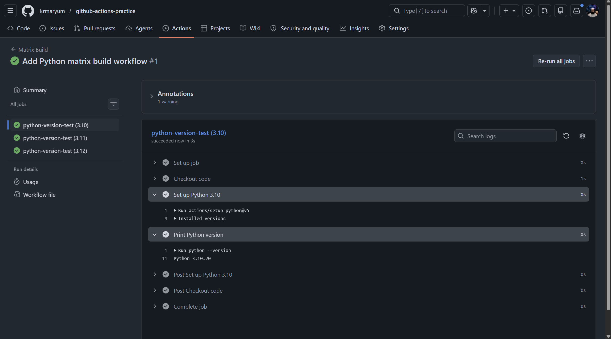


<video src="videos/task4-matrix.mp4" controls width="700"></video>

---

# 12. Part 2: Extend Matrix with Operating Systems

Now I extend the matrix to include two operating systems:

```text
ubuntu-latest
windows-latest
```

The Python versions are still:

```text
3.10
3.11
3.12
```

So now the matrix combines every operating system with every Python version.

---

# 13. Final Version of `matrix.yml`

Create a new workflow named extended-matrix.yml

```yaml
name: Extended Matrix Build Py-OS

on:
  push:
  workflow_dispatch:

jobs:
  python-version-test:
    runs-on: ${{ matrix.os }}

    strategy:
      matrix:
        os: [ubuntu-latest, windows-latest]
        python-version: ["3.10", "3.11", "3.12"]

    steps:
      - name: Checkout code
        uses: actions/checkout@v4

      - name: Set up Python ${{ matrix.python-version }}
        uses: actions/setup-python@v5
        with:
          python-version: ${{ matrix.python-version }}

      - name: Print OS and Python version
        run: |
          echo "Running on OS: ${{ matrix.os }}"
          python --version
```

---

# 14. Final YAML Explanation

## Dynamic Runner

Before:

```yaml
runs-on: ubuntu-latest
```

Now:

```yaml
runs-on: ${{ matrix.os }}
```

This means the runner will come from the matrix.

When the matrix OS is:

```text
ubuntu-latest
```

the job runs on Ubuntu.

When the matrix OS is:

```text
windows-latest
```

the job runs on Windows.

## Extended Matrix

```yaml
matrix:
  os: [ubuntu-latest, windows-latest]
  python-version: ["3.10", "3.11", "3.12"]
```

This creates combinations.

GitHub Actions combines every OS with every Python version.

---

# 15. How Many Jobs Run Now?

We have:

```text
2 operating systems
```

and:

```text
3 Python versions
```

Formula:

```text
2 × 3 = 6
```

So total jobs:

```text
6 jobs
```

---

# 16. All Matrix Job Combinations

| Job Number | Operating System | Python Version |
|---|---|---|
| 1 | ubuntu-latest | 3.10 |
| 2 | ubuntu-latest | 3.11 |
| 3 | ubuntu-latest | 3.12 |
| 4 | windows-latest | 3.10 |
| 5 | windows-latest | 3.11 |
| 6 | windows-latest | 3.12 |

---

# 17. Commit and Push Extended Matrix Workflow

Check status:

```bash
git status
```

Add updated file:

```bash
git add .github/workflows/matrix.yml
```

Commit:

```bash
git commit -m "Extend matrix build with multiple operating systems"
```

Push:

```bash
git push
```

---

# 18. Verify Extended Matrix Workflow

Go to GitHub:

```text
Repository → Actions → Matrix Build
```

Open the latest run.

You should see six jobs.

Expected jobs:

```text
python-version-test (ubuntu-latest, 3.10)
python-version-test (ubuntu-latest, 3.11)
python-version-test (ubuntu-latest, 3.12)
python-version-test (windows-latest, 3.10)
python-version-test (windows-latest, 3.11)
python-version-test (windows-latest, 3.12)
```

Click each job and check the logs.

Expected output examples:

```text
Running on OS: ubuntu-latest
Python 3.10.x
```

```text
Running on OS: windows-latest
Python 3.12.x
```

---

# 19. Screenshot Placeholder for Extended Matrix

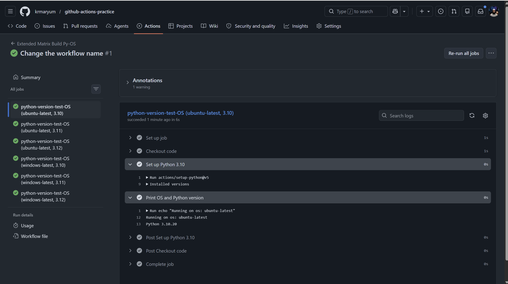

<video src="videos/task4-extended-matrix.mp4" controls width="700"></video>

---

# 20. What Does Parallel Mean?

In GitHub Actions, matrix jobs usually run in parallel.

This means GitHub does not wait for Python 3.10 to finish before starting Python 3.11.

Instead, jobs can start at the same time.

Example:

```text
Python 3.10 job running
Python 3.11 job running
Python 3.12 job running
```

This saves time.

---

# 21. What to Add in `day-41-triggers.md`

Add this section:

```markdown
## Task 4: Matrix Builds

### Task Overview

In this task, I created a GitHub Actions matrix workflow.

A matrix build allows the same job to run multiple times using different values.

First, I created a matrix for three Python versions:

- Python 3.10
- Python 3.11
- Python 3.12

This created 3 jobs.

Then I extended the matrix with two operating systems:

- ubuntu-latest
- windows-latest

This created 6 jobs total.

Formula:

```text
3 Python versions × 2 operating systems = 6 jobs
```

### Workflow File

```text
.github/workflows/matrix.yml
```

### Verification

The first matrix workflow ran 3 jobs because it used 3 Python versions.

After adding 2 operating systems, the workflow ran 6 jobs.

```text
3 Python versions × 2 operating systems = 6 jobs
```

---

# 22. Common Mistakes and Fixes

## Mistake 1: Wrong Indentation

Wrong:

```yaml
strategy:
matrix:
python-version: ["3.10", "3.11", "3.12"]
```

Correct:

```yaml
strategy:
  matrix:
    python-version: ["3.10", "3.11", "3.12"]
```

YAML depends on spaces.

Indentation is very important.

---

## Mistake 2: Forgetting `matrix.`

Wrong:

```yaml
python-version: ${{ python-version }}
```

Correct:

```yaml
python-version: ${{ matrix.python-version }}
```

The value comes from the matrix, so we must use:

```text
matrix.python-version
```

---

## Mistake 3: Using Fixed Runner After Adding OS Matrix

Wrong:

```yaml
runs-on: ubuntu-latest
```

If I add an OS matrix but keep this line fixed, all jobs will still run on Ubuntu.

Correct:

```yaml
runs-on: ${{ matrix.os }}
```

This tells GitHub Actions to use the OS from the matrix.

---

## Mistake 4: Expecting Only 3 Jobs After Adding OS

After adding:

```yaml
os: [ubuntu-latest, windows-latest]
python-version: ["3.10", "3.11", "3.12"]
```

The total is not 3.

The total is:

```text
2 × 3 = 6 jobs
```

---

# 23. Commands Summary

```bash
# Go to repo
cd /c/Linux/github-actions-practice

# Check status
git status

# Make sure I am on main
git branch

# Create workflow folder
mkdir -p .github/workflows

# Create matrix workflow file
touch .github/workflows/matrix.yml

# Open in VS Code
code .github/workflows/matrix.yml

# Add first matrix file
git add .github/workflows/matrix.yml

# Commit first matrix workflow
git commit -m "Add Python matrix build workflow"

# Push first workflow
git push

# After updating matrix with OS
git status

# Add updated matrix file
git add .github/workflows/matrix.yml

# Commit updated workflow
git commit -m "Extend matrix build with multiple operating systems"

# Push updated workflow
git push
```

---

# 24. Final Answer for Task Question

Question:

```text
Then extend the matrix to also include 2 operating systems — how many total jobs run now?
```

Answer:

```text
6 jobs run.
```

Reason:

```text
3 Python versions × 2 operating systems = 6 total jobs
```

---

# 25. Final Task 4 Summary

In Task 4, I learned how to use matrix builds in GitHub Actions.

I created:

```text
.github/workflows/matrix.yml
```

First, I tested three Python versions:

```text
3.10, 3.11, 3.12
```

This created three jobs.

Then I added two operating systems:

```text
ubuntu-latest, windows-latest
```

This created six jobs.

Final formula:

```text
3 Python versions × 2 operating systems = 6 jobs
```

Matrix builds help DevOps teams test applications across multiple environments using less YAML code.

---

# Task 5: Exclude & Fail-Fast

## Topic

GitHub Actions Matrix Build: `exclude` and `fail-fast`

---

# Task 5: Exclude & Fail-Fast

## Task Requirement

In the existing matrix workflow:

1. Exclude one specific matrix combination.
   - Example: Python 3.10 on Windows
2. Set:

```yaml
fail-fast: false
```

3. Trigger a failure in one matrix job.
4. Observe what happens to the rest of the jobs.
5. Write in notes:
   - What does `fail-fast: true` do?
   - What does `fail-fast: false` do?

---

# 1. Task Overview

In Task 4, I created a matrix workflow that ran across:

```text
2 operating systems
```

and:

```text
3 Python versions
```

The matrix was:

```yaml
os: [ubuntu-latest, windows-latest]
python-version: ["3.10", "3.11", "3.12"]
```

This created:

```text
2 × 3 = 6 jobs
```

In Task 5, I learned two more important matrix features:

1. `exclude`
2. `fail-fast`

The `exclude` option is used when I want to remove one specific combination from the matrix.

The `fail-fast` option controls what happens when one matrix job fails.

---

# 2. Task Objectives

By the end of this task, I should understand:

1. How to exclude one matrix combination.
2. How `exclude` works in GitHub Actions matrix builds.
3. How many jobs run after excluding a combination.
4. What `fail-fast` means.
5. Difference between `fail-fast: true` and `fail-fast: false`.
6. How to intentionally fail one job.
7. How to observe that other jobs continue running.
8. How to document the result in `day-41-triggers.md`.

---

# 3. Important Concept: What Is `exclude`?

In a matrix build, GitHub Actions creates jobs from all combinations.

Example matrix:

```yaml
os: [ubuntu-latest, windows-latest]
python-version: ["3.10", "3.11", "3.12"]
```

This creates these combinations:

| Job | Operating System | Python Version |
|---|---|---|
| 1 | ubuntu-latest | 3.10 |
| 2 | ubuntu-latest | 3.11 |
| 3 | ubuntu-latest | 3.12 |
| 4 | windows-latest | 3.10 |
| 5 | windows-latest | 3.11 |
| 6 | windows-latest | 3.12 |

Sometimes I do not want to run one specific combination.

For example:

```text
windows-latest + Python 3.10
```

To remove it, I use:

```yaml
exclude:
  - os: windows-latest
    python-version: "3.10"
```

Now this job will not be created:

```text
windows-latest, 3.10
```

---

# 4. Important Concept: What Is `fail-fast`?

`fail-fast` controls what GitHub Actions does when one matrix job fails.

By default, GitHub Actions uses:

```yaml
fail-fast: true
```

This means if one matrix job fails, GitHub Actions may cancel remaining queued or running matrix jobs.

If I set:

```yaml
fail-fast: false
```

then even if one matrix job fails, the other matrix jobs continue running.

---

# 5. Simple Difference Between `fail-fast: true` and `fail-fast: false`

| Setting | Meaning |
|---|---|
| `fail-fast: true` | If one matrix job fails, GitHub Actions may cancel the remaining matrix jobs |
| `fail-fast: false` | If one matrix job fails, other matrix jobs continue running |

---

# 6. Real-Life Example

Imagine I am testing an application on:

```text
Ubuntu + Python 3.10
Ubuntu + Python 3.11
Ubuntu + Python 3.12
Windows + Python 3.10
Windows + Python 3.11
Windows + Python 3.12
```

If one job fails, for example:

```text
Ubuntu + Python 3.11
```

With:

```yaml
fail-fast: true
```

GitHub Actions may cancel the remaining matrix jobs.

With:

```yaml
fail-fast: false
```

GitHub Actions lets all other jobs finish.

This is useful because I can see the full result for all operating systems and Python versions.

---

# 7. How Many Jobs Before Exclude?

Before excluding any combination, the matrix has:

```text
2 operating systems × 3 Python versions = 6 jobs
```

Operating systems:

```text
ubuntu-latest
windows-latest
```

Python versions:

```text
3.10
3.11
3.12
```

Total:

```text
2 × 3 = 6 jobs
```

---

# 8. How Many Jobs After Exclude?

I excluded:

```text
windows-latest + Python 3.10
```

So:

```text
6 total combinations - 1 excluded combination = 5 jobs
```

Final jobs:

| Job | Operating System | Python Version |
|---|---|---|
| 1 | ubuntu-latest | 3.10 |
| 2 | ubuntu-latest | 3.11 |
| 3 | ubuntu-latest | 3.12 |
| 4 | windows-latest | 3.11 |
| 5 | windows-latest | 3.12 |

This job should not appear:

```text
windows-latest, 3.10
```

---

# 9. Step-by-Step Practical Work

## Step 1: Go to Repository

Open terminal and go to the repository folder:

```bash
cd /c/Linux/github-actions-practice
```

Check status:

```bash
git status
```

Make sure I am on `main`:

```bash
git branch
```

Expected:

```text
* main
```

If not on main:

```bash
git switch main
```

or:

```bash
git checkout main
```

---

## Step 2: Open Matrix Workflow File

Open the file:

```bash
code .github/workflows/matrix.yml
```

File path:

```text
.github/workflows/matrix.yml
```

---

# 10. Final YAML for Task 5

Replace the existing `matrix.yml` with this version:

```yaml
name: Matrix Build Exclude and Fail Fast

on:
  push:
  workflow_dispatch:

jobs:
  python-version-test:
    runs-on: ${{ matrix.os }}

    strategy:
      fail-fast: false
      matrix:
        os: [ubuntu-latest, windows-latest]
        python-version: ["3.10", "3.11", "3.12"]
        exclude:
          - os: windows-latest
            python-version: "3.10"

    steps:
      - name: Checkout code
        uses: actions/checkout@v4

      - name: Set up Python ${{ matrix.python-version }}
        uses: actions/setup-python@v5
        with:
          python-version: ${{ matrix.python-version }}

      - name: Print OS and Python version
        run: |
          echo "Running on OS: ${{ matrix.os }}"
          python --version

      - name: Force failure only on Ubuntu Python 3.11
        if: matrix.os == 'ubuntu-latest' && matrix.python-version == '3.11'
        run: |
          echo "This job is intentionally failing for testing fail-fast false"
          exit 1

      - name: Success message
        run: echo "This matrix job completed successfully"
```

---

# 11. YAML Explanation

## Workflow Name

```yaml
name: Matrix Build Exclude and Fail Fast
```

This is the name shown in the GitHub Actions tab.

## Triggers

```yaml
on:
  push:
  workflow_dispatch:
```

This workflow runs when code is pushed or when it is manually started from the GitHub UI.

## Dynamic Runner

```yaml
runs-on: ${{ matrix.os }}
```

This means the runner operating system comes from the matrix.

## Fail-Fast False

```yaml
fail-fast: false
```

This means if one matrix job fails, the other jobs should continue running.

## Exclude Section

```yaml
exclude:
  - os: windows-latest
    python-version: "3.10"
```

This excludes:

```text
windows-latest + Python 3.10
```

So GitHub Actions creates 5 jobs instead of 6.

## Force Failure Step

```yaml
- name: Force failure only on Ubuntu Python 3.11
  if: matrix.os == 'ubuntu-latest' && matrix.python-version == '3.11'
  run: |
    echo "This job is intentionally failing for testing fail-fast false"
    exit 1
```

This step runs only for:

```text
ubuntu-latest + Python 3.11
```

The command:

```bash
exit 1
```

forces the job to fail.

---

# 12. Commit and Push Task 5 Workflow

After saving the file, check status:

```bash
git status
```

Add the updated workflow:

```bash
git add .github/workflows/matrix.yml
```

Commit:

```bash
git commit -m "Add matrix exclude and fail-fast false test"
```

Push:

```bash
git push
```

---

# 13. Verify in GitHub Actions

Go to GitHub:

```text
Repository → Actions
```

Open workflow:

```text
Matrix Build Exclude and Fail Fast
```

Open the latest run.

---

# 14. Expected Result

You should see 5 jobs.

Expected jobs:

```text
python-version-test (ubuntu-latest, 3.10)
python-version-test (ubuntu-latest, 3.11)
python-version-test (ubuntu-latest, 3.12)
python-version-test (windows-latest, 3.11)
python-version-test (windows-latest, 3.12)
```

This job should be missing:

```text
python-version-test (windows-latest, 3.10)
```

That proves `exclude` worked.

---

# 15. Expected Failure

This job should fail intentionally:

```text
ubuntu-latest + Python 3.11
```

Expected log:

```text
This job is intentionally failing for testing fail-fast false
Error: Process completed with exit code 1.
```

---

# 16. Expected Behavior With `fail-fast: false`

Even though one job fails, the other jobs should continue running.

Expected result:

```text
1 job failed intentionally
4 jobs completed or continued
```

This proves:

```yaml
fail-fast: false
```

worked.

---

# 17. What to Observe Carefully

## Observation 1: Excluded Job

Check that this job is not present:

```text
windows-latest, 3.10
```

## Observation 2: Failed Job

Check that this job failed:

```text
ubuntu-latest, 3.11
```

## Observation 3: Other Jobs

Check that other jobs still continued and finished.

This is the main point of:

```yaml
fail-fast: false
```

---

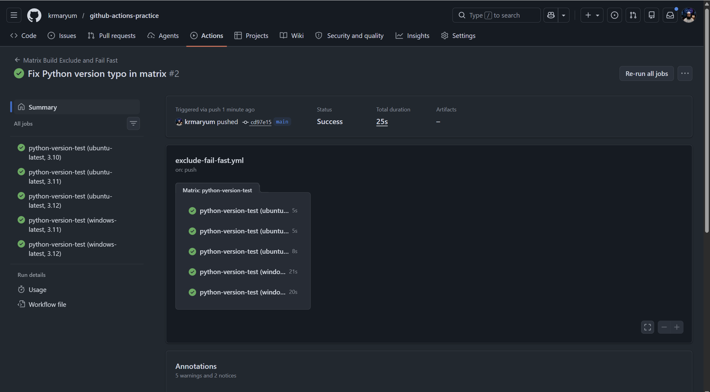

<video src="videos/task5-exclude-fail-fast.mp4" controls width="700"></video>


# 19. What to Write in `day-41-triggers.md`

Add this section:

```markdown
## Task 5: Exclude & Fail-Fast

### Task Overview

In this task, I learned how to exclude one specific matrix combination and how `fail-fast` works in GitHub Actions.

The original matrix had:

```text
2 operating systems × 3 Python versions = 6 jobs
```

Then I excluded:

```text
windows-latest + Python 3.10
```

So the matrix created:

```text
6 - 1 = 5 jobs
```

### Final YAML

```yaml
name: Matrix Build Exclude and Fail Fast

on:
  push:
  workflow_dispatch:

jobs:
  python-version-test:
    runs-on: ${{ matrix.os }}

    strategy:
      fail-fast: false
      matrix:
        os: [ubuntu-latest, windows-latest]
        python-version: ["3.10", "3.11", "3.12"]
        exclude:
          - os: windows-latest
            python-version: "3.10"

    steps:
      - name: Checkout code
        uses: actions/checkout@v4

      - name: Set up Python ${{ matrix.python-version }}
        uses: actions/setup-python@v5
        with:
          python-version: ${{ matrix.python-version }}

      - name: Print OS and Python version
        run: |
          echo "Running on OS: ${{ matrix.os }}"
          python --version

      - name: Force failure only on Ubuntu Python 3.11
        if: matrix.os == 'ubuntu-latest' && matrix.python-version == '3.11'
        run: |
          echo "This job is intentionally failing for testing fail-fast false"
          exit 1

      - name: Success message
        run: echo "This matrix job completed successfully"
```

### Verification

The workflow created 5 jobs because one combination was excluded.

Excluded combination:

```text
windows-latest + Python 3.10
```

The intentionally failed job was:

```text
ubuntu-latest + Python 3.11
```

Because `fail-fast` was set to `false`, the other matrix jobs continued running and completed.

### What does `fail-fast: true` do?

`fail-fast: true` is the default behavior.

If one matrix job fails, GitHub Actions may cancel the remaining queued or running matrix jobs.

This is useful when one failure means the whole matrix is not useful anymore.

### What does `fail-fast: false` do?

`fail-fast: false` means GitHub Actions will not cancel the other matrix jobs when one job fails.

Even if one job fails, the other jobs continue running.

This is useful when I want to see results from all operating systems and versions.

### Simple Difference

| Setting | Meaning |
|---|---|
| `fail-fast: true` | Stop or cancel remaining matrix jobs after one job fails |
| `fail-fast: false` | Continue running all matrix jobs even if one job fails |
```

---

# 20. Very Important: Clean Up After Testing

This task intentionally fails one job.

After taking screenshots and writing notes, I should remove the forced failure step if I want the workflow to become green again.

Remove this part:

```yaml
- name: Force failure only on Ubuntu Python 3.11
  if: matrix.os == 'ubuntu-latest' && matrix.python-version == '3.11'
  run: |
    echo "This job is intentionally failing for testing fail-fast false"
    exit 1
```

Then commit and push again:

```bash
git add .github/workflows/matrix.yml
git commit -m "Remove intentional matrix failure"
git push
```

Now the workflow should pass again.

---

# 21. Optional Clean Final YAML After Testing

After completing the task and taking screenshots, the clean version can be:

```yaml
name: Matrix Build Exclude and Fail Fast

on:
  push:
  workflow_dispatch:

jobs:
  python-version-test:
    runs-on: ${{ matrix.os }}

    strategy:
      fail-fast: false
      matrix:
        os: [ubuntu-latest, windows-latest]
        python-version: ["3.10", "3.11", "3.12"]
        exclude:
          - os: windows-latest
            python-version: "3.10"

    steps:
      - name: Checkout code
        uses: actions/checkout@v4

      - name: Set up Python ${{ matrix.python-version }}
        uses: actions/setup-python@v5
        with:
          python-version: ${{ matrix.python-version }}

      - name: Print OS and Python version
        run: |
          echo "Running on OS: ${{ matrix.os }}"
          python --version

      - name: Success message
        run: echo "This matrix job completed successfully"
```

This version keeps `exclude` and `fail-fast: false`, but removes the intentional failure.

---

# 22. Commands Summary

## For Testing Fail-Fast

```bash
cd /c/Linux/github-actions-practice

git status

code .github/workflows/matrix.yml

git add .github/workflows/matrix.yml

git commit -m "Add matrix exclude and fail-fast false test"

git push
```

## For Cleaning After Testing

```bash
code .github/workflows/matrix.yml

git add .github/workflows/matrix.yml

git commit -m "Remove intentional matrix failure"

git push
```

---

# 23. Final Answer for Notes

Question:

```text
What does fail-fast: true do vs false?
```

Answer:

```text
fail-fast: true is the default behavior. If one matrix job fails, GitHub Actions may cancel the remaining queued or running matrix jobs.

fail-fast: false means GitHub Actions will not cancel the other matrix jobs when one job fails. Other jobs continue running, so I can see the results for all matrix combinations.
```

---

# 24. Final Task 5 Summary

In Task 5, I learned how to control matrix combinations and matrix failure behavior.

I used:

```yaml
exclude:
  - os: windows-latest
    python-version: "3.10"
```

to exclude:

```text
Windows + Python 3.10
```

The original matrix had 6 jobs.

After excluding one combination, it created 5 jobs.

I also used:

```yaml
fail-fast: false
```

Then I intentionally failed:

```text
Ubuntu + Python 3.11
```

Because fail-fast was false, the other matrix jobs continued running.

This helped me understand how GitHub Actions handles failures in matrix builds.

---

# Task 5 Troubleshooting Note: Python Version Typo in Matrix Build

## Issue

During Task 5: **Exclude & Fail-Fast**, the workflow failed because of a small typo in the Python version value.

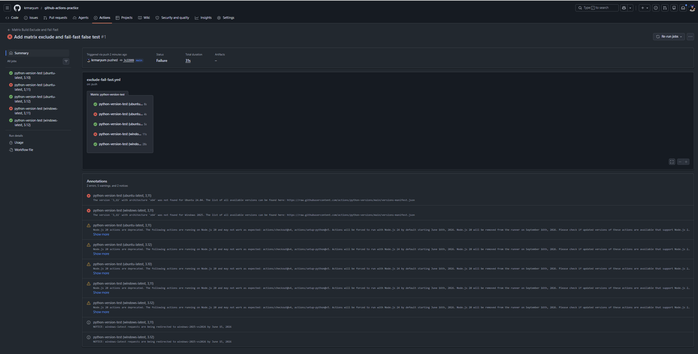


The incorrect value was:

```yaml
python-version: ["3.10", "3,11", "3.12"]
```

The problem was this part:

```text
3,11
```

It used a comma `,` instead of a dot `.`.

The correct Python version should be:

```text
3.11
```

---

# 1. What Happened?

The matrix workflow was expected to run 5 jobs after excluding one combination.

The matrix was supposed to include:

```text
Python 3.10
Python 3.11
Python 3.12
```

But because of the typo, GitHub Actions read one Python version as:

```text
3,11
```

Instead of:

```text
3.11
```

So GitHub Actions tried to install Python version:

```text
3,11
```

But this version does not exist.

Because of this, the `actions/setup-python@v5` step failed.

---

# 2. Error Seen in GitHub Actions

GitHub Actions showed an error similar to:

```text
The version '3,11' with architecture 'x64' was not found
```

This means GitHub Actions could not find Python version:

```text
3,11
```

because valid Python versions use a dot:

```text
3.11
```

not a comma:

```text
3,11
```

---

# 3. Incorrect YAML

This was the incorrect matrix line:

```yaml
python-version: ["3.10", "3,11", "3.12"]
```

Problem:

```text
3,11
```

The comma makes it invalid as a Python version.

---

# 4. Correct YAML

The correct line is:

```yaml
python-version: ["3.10", "3.11", "3.12"]
```

Correct version:

```text
3.11
```

---

# 5. Correct Matrix Section

The correct matrix section should be:

```yaml
strategy:
  fail-fast: false
  matrix:
    os: [ubuntu-latest, windows-latest]
    python-version: ["3.10", "3.11", "3.12"]
    exclude:
      - os: windows-latest
        python-version: "3.10"
```

---

# 6. Why This Caused Extra Failures

The task was designed to intentionally fail only one job:

```text
ubuntu-latest + Python 3.11
```

This intentional failure was controlled by this condition:

```yaml
if: matrix.os == 'ubuntu-latest' && matrix.python-version == '3.11'
```

This condition only matches when the Python version is exactly:

```text
3.11
```

But because the matrix had:

```text
3,11
```

the condition did not match correctly.

Also, the job failed earlier during the Python setup step because GitHub Actions could not install Python `3,11`.

So instead of only the intentional failure happening, extra jobs failed because of the typo.

---

# 7. Important Difference

| Value | Meaning | Correct? |
|---|---|---|
| `3.11` | Python version 3.11 | Yes |
| `3,11` | Invalid Python version | No |

---

# 8. How I Fixed It

I opened the workflow file:

```bash
code .github/workflows/matrix.yml
```

Then I changed this:

```yaml
python-version: ["3.10", "3,11", "3.12"]
```

To this:

```yaml
python-version: ["3.10", "3.11", "3.12"]
```

Then I saved the file.

---

# 9. Commands Used After Fix

After correcting the typo, I ran:

```bash
git status
```

Then staged the file:

```bash
git add .github/workflows/matrix.yml
```

Then committed the fix:

```bash
git commit -m "Fix Python version typo in matrix"
```

Then pushed it to GitHub:

```bash
git push
```

---

# 10. Expected Result After Fix

After fixing the typo, the workflow should create 5 jobs:

```text
ubuntu-latest, 3.10
ubuntu-latest, 3.11
ubuntu-latest, 3.12
windows-latest, 3.11
windows-latest, 3.12
```

This job should still be excluded:

```text
windows-latest, 3.10
```

Only this job should fail intentionally:

```text
ubuntu-latest, 3.11
```

The other jobs should continue because:

```yaml
fail-fast: false
```

---

# 11. Correct Expected Result

| Job | Expected Status | Reason |
|---|---|---|
| `ubuntu-latest, 3.10` | Success | Normal matrix job |
| `ubuntu-latest, 3.11` | Failed intentionally | Testing `fail-fast: false` |
| `ubuntu-latest, 3.12` | Success | Normal matrix job |
| `windows-latest, 3.11` | Success | Normal matrix job |
| `windows-latest, 3.12` | Success | Normal matrix job |
| `windows-latest, 3.10` | Not created | Excluded combination |

---

# 12. Lesson Learned

A very small typo in YAML can break a GitHub Actions workflow.

In this case:

```text
3,11
```

looked similar to:

```text
3.11
```

but GitHub Actions treated it as a completely different value.

Python versions must use a dot:

```text
3.11
```

not a comma:

```text
3,11
```

---

# 13. Checklist to Avoid This Issue

Before committing a matrix workflow, check:

1. Python versions use dots, not commas.
2. Matrix values match the `if` condition exactly.
3. Excluded values match the matrix values exactly.
4. YAML indentation is correct.
5. The workflow file is saved before commit.
6. Run `git diff` before committing.

Useful command:

```bash
git diff .github/workflows/matrix.yml
```

This helps review changes before commit.

---

# 14. Quick Fix Summary

Incorrect:

```yaml
python-version: ["3.10", "3,11", "3.12"]
```

Correct:

```yaml
python-version: ["3.10", "3.11", "3.12"]
```

Fix commands:

```bash
code .github/workflows/matrix.yml
git status
git add .github/workflows/matrix.yml
git commit -m "Fix Python version typo in matrix"
git push
```

---

# 15. Note for My Study Notes

This issue happened because I accidentally typed:

```text
3,11
```

instead of:

```text
3.11
```

GitHub Actions could not find Python version `3,11`, so the job failed during the `actions/setup-python@v5` step.

After correcting it to `3.11`, the matrix workflow should behave as expected:

- `windows-latest + Python 3.10` is excluded.
- `ubuntu-latest + Python 3.11` fails intentionally.
- Other jobs continue because `fail-fast: false` is enabled.

---

