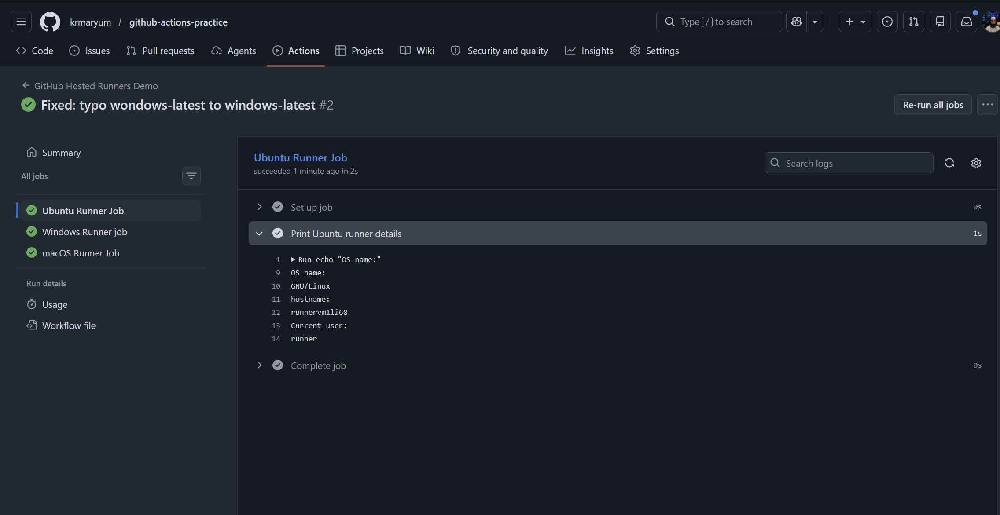
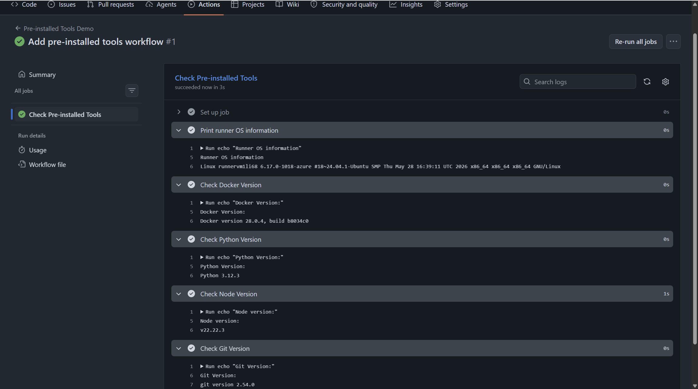
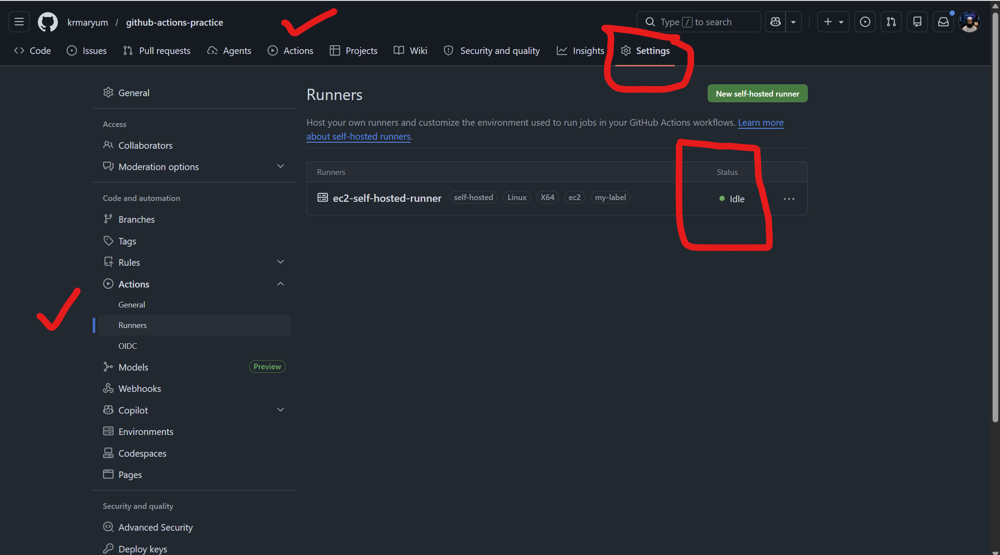
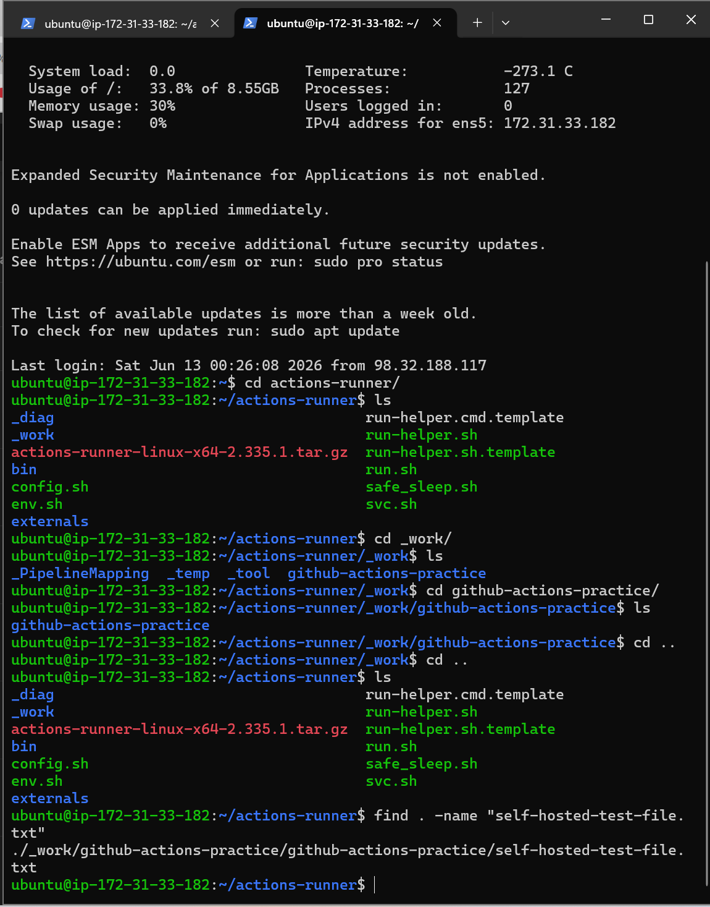
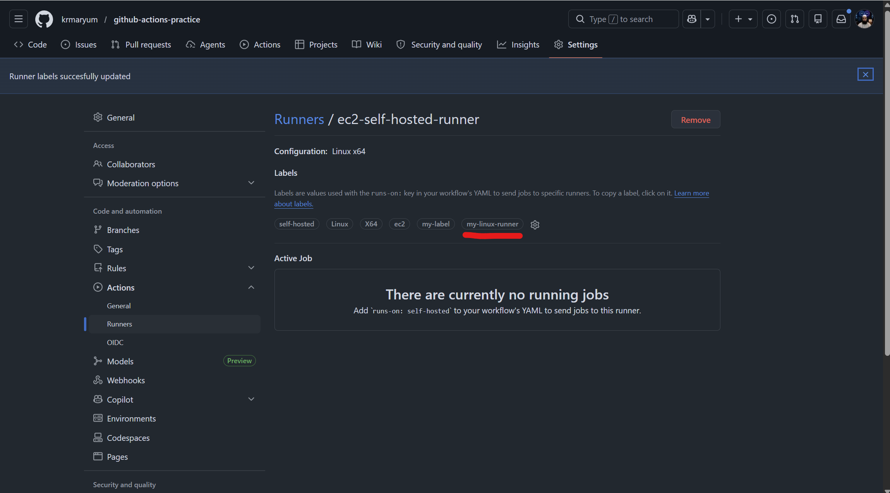

# Day 42 – Runners: GitHub-Hosted & Self-Hosted

---

# Table of Contents

| Task | Topic | Summary | Link |
|---|---|---|---|
| Day Overview | Runners Introduction | Learned what GitHub Actions runners are and why every job needs a machine to run on. | [Go to Day Overview](#day-overview) |
| Day Objectives | Learning Goals | Listed the main goals for understanding GitHub-hosted and self-hosted runners. | [Go to Day Objectives](#day-objectives) |
| Task 1 | GitHub-Hosted Runners | Created a workflow with three jobs running on Ubuntu, Windows, and macOS GitHub-hosted runners. | [Go to Task 1](#task-1-github-hosted-runners) |
| Task 2 | Explore What’s Pre-installed | Checked Docker, Python, Node.js, and Git versions on the `ubuntu-latest` runner. | [Go to Task 2](#task-2-explore-whats-pre-installed) |
| Task 3 | Set Up a Self-Hosted Runner | Registered an EC2 Linux machine as a self-hosted runner and verified it showed `Idle` in GitHub. | [Go to Task 3](#task-3-set-up-a-self-hosted-runner) |
| Task 4 | Use Your Self-Hosted Runner | Created a workflow using `runs-on: self-hosted`, printed hostname, printed working directory, and created a test file. | [Go to Task 4](#task-4-use-your-self-hosted-runner) |
| Task 5 | Labels | Added a custom runner label and used `runs-on: [self-hosted, my-linux-runner]` to target a specific runner. | [Go to Task 5](#task-5-labels) |
| Task 6 | GitHub-Hosted vs Self-Hosted | Compared GitHub-hosted and self-hosted runners by management, cost, tools, use cases, and security concerns. | [Go to Task 6](#task-6-github-hosted-vs-self-hosted-runners) |
| Final Submission | Git Commands and Final Summary | Added final folder location, git commands, expected output, and Day 42 summary. | [Go to Final Submission](#final-submission-steps) |

---

## Day Overview

Today I learned about GitHub Actions runners.

**A runner is the machine that executes a GitHub Actions job. Every job in a workflow needs a runner. Without a runner, the job has no machine where commands can run.**

There are two main types of runners:

| Runner Type          | Description                                                  |
| -------------------- | ------------------------------------------------------------ |
| GitHub-hosted runner | A runner provided and managed by GitHub                      |
| Self-hosted runner   | A runner installed and managed on your own server or machine |

In this task, I practiced GitHub-hosted runners by creating a workflow that runs jobs on Ubuntu, Windows, and macOS.

---

## Day Objectives

By the end of this day, I should be able to:

| Objective                      | Description                                                             |
| ------------------------------ | ----------------------------------------------------------------------- |
| Understand runners             | Explain why every job needs a runner                                    |
| Use GitHub-hosted runners      | Run jobs on GitHub-managed machines                                     |
| Use multiple operating systems | Run jobs on Ubuntu, Windows, and macOS                                  |
| Understand `runs-on`           | Use `runs-on` to choose the runner                                      |
| Observe parallel jobs          | Watch multiple jobs run at the same time                                |
| Compare runner types           | Understand the difference between GitHub-hosted and self-hosted runners |

---

# Task 1: GitHub-Hosted Runners

## Task Overview

In this task, I created a GitHub Actions workflow with three jobs.

Each job used a different GitHub-hosted runner:

| Job Name           | Runner           |
| ------------------ | ---------------- |
| Ubuntu Runner Job  | `ubuntu-latest`  |
| Windows Runner Job | `windows-latest` |
| macOS Runner Job   | `macos-latest`   |

Each job printed:

| Output       | Command Purpose                                    |
| ------------ | -------------------------------------------------- |
| OS name      | Shows which operating system the job is running on |
| Hostname     | Shows the runner machine hostname                  |
| Current user | Shows the user account running the job             |

---

## Task Objectives

The objectives of this task were:

| Objective                     | Explanation                                                                |
| ----------------------------- | -------------------------------------------------------------------------- |
| Learn GitHub-hosted runners   | Understand that GitHub provides temporary machines for workflow jobs       |
| Use different runner OS types | Practice using Ubuntu, Windows, and macOS runners                          |
| Understand `runs-on`          | Learn how the runner is selected in a workflow                             |
| Observe parallel execution    | See that independent jobs can run at the same time                         |
| Compare command differences   | Understand that Linux/macOS commands and Windows commands can be different |

---

## Workflow File Location

I created the workflow file at:

```text
.github/workflows/github-hosted-runners.yml
```

---

## Workflow Code

```yaml
name: GitHub Hosted Runners Demo

on:
  push:
  workflow_dispatch:

jobs:
  ubuntu-runner:
    name: Ubuntu Runner Job
    runs-on: ubuntu-latest

    steps:
      - name: Print Ubuntu runner details
        run: |
          echo "OS name:"
          uname -o
          echo "Hostname:"
          hostname
          echo "Current user:"
          whoami

  windows-runner:
    name: Windows Runner Job
    runs-on: windows-latest

    steps:
      - name: Print Windows runner details
        shell: pwsh
        run: |
          Write-Host "OS name:"
          Get-ComputerInfo | Select-Object WindowsProductName, WindowsVersion, OsArchitecture
          Write-Host "Hostname:"
          hostname
          Write-Host "Current user:"
          whoami

  macos-runner:
    name: macOS Runner Job
    runs-on: macos-latest

    steps:
      - name: Print macOS runner details
        run: |
          echo "OS name:"
          sw_vers
          echo "Hostname:"
          hostname
          echo "Current user:"
          whoami
```

---

## Commands Used

```bash
git add .github/workflows/github-hosted-runners.yml
git commit -m "Add GitHub-hosted runners workflow"
git push
```

---

## What Happened

After pushing the workflow file, GitHub Actions started the workflow automatically because the workflow has this trigger:

```yaml
on:
  push:
```

The workflow also supports manual execution because it has:

```yaml
workflow_dispatch:
```

This means I can run it manually from the GitHub Actions UI.

---

## Jobs Created

The workflow created three jobs:

| Job                | Runner OS    | Status                              |
| ------------------ | ------------ | ----------------------------------- |
| Ubuntu Runner Job  | Ubuntu Linux | Ran on GitHub-hosted Ubuntu runner  |
| Windows Runner Job | Windows      | Ran on GitHub-hosted Windows runner |
| macOS Runner Job   | macOS        | Ran on GitHub-hosted macOS runner   |

Because these jobs do not depend on each other, GitHub Actions can run them in parallel.

---

## What is a GitHub-hosted runner?

A GitHub-hosted runner is a temporary machine provided by GitHub to run a workflow job.

For example:

```yaml
runs-on: ubuntu-latest
```

This tells GitHub Actions to run the job on an Ubuntu machine managed by GitHub.

---

## Who manages GitHub-hosted runners?

GitHub manages GitHub-hosted runners.

GitHub is responsible for:

| Managed By GitHub   | Description                                         |
| ------------------- | --------------------------------------------------- |
| Operating system    | GitHub provides Ubuntu, Windows, and macOS machines |
| Updates             | GitHub updates runner images                        |
| Pre-installed tools | Many common tools are already installed             |
| Machine cleanup     | The runner is removed after the job completes       |
| Infrastructure      | GitHub provides the compute resources               |

---

## Important Concept: `runs-on`

The `runs-on` keyword tells GitHub Actions which runner should execute the job.

Examples:

```yaml
runs-on: ubuntu-latest
```

```yaml
runs-on: windows-latest
```

```yaml
runs-on: macos-latest
```

Each job must have a `runs-on` value.

---

## Screenshot Placeholder

### Screenshot 1: Workflow with 3 Jobs

Add screenshot here:

```text
GitHub Actions workflow showing Ubuntu, Windows, and macOS jobs
```



<video src="videos/task1-hosted-runner-demo.mp4" controls width="700"></video>

https://youtu.be/xUFh5xAGhQc

---

## Screenshot: GitHub-Hosted Runners Workflow Completed

This screenshot shows my GitHub Actions workflow named **GitHub Hosted Runners Demo** completed successfully.

The workflow had three jobs:

| Job Name | Runner Used | Status |
|---|---|---|
| Ubuntu Runner Job | `ubuntu-latest` | Successful |
| Windows Runner Job | `windows-latest` | Successful |
| macOS Runner Job | `macos-latest` | Successful |

In the Ubuntu job logs, I verified that the job printed:

| Detail | Output |
|---|---|
| OS name | GNU/Linux |
| Hostname | runner machine hostname |
| Current user | runner |

This confirms that the job ran on a GitHub-hosted Ubuntu runner.

I also fixed a typo in the workflow file. I had written `wondows-latest` by mistake, but the correct runner label is `windows-latest`.

This task helped me understand that GitHub-hosted runners are temporary machines provided by GitHub to run workflow jobs.

## Task 1 Summary

In this task, I created a workflow with three jobs running on three different GitHub-hosted runners:

- Ubuntu
- Windows
- macOS

Each job printed the operating system information, hostname, and current user.

I learned that a GitHub-hosted runner is a temporary machine managed by GitHub. GitHub provides the operating system, tools, updates, and cleanup after the job finishes.

I also learned that independent jobs can run in parallel because they do not depend on each other.

---

# Task 2: Explore What’s Pre-installed

## Task Overview

In this task, I explored what tools are already pre-installed on the `ubuntu-latest` GitHub-hosted runner.

GitHub-hosted runners come with many common tools already installed. This is useful because workflows can start running commands immediately without installing every tool manually.

For this task, I checked the versions of:

| Tool    | Purpose                                              |
| ------- | ---------------------------------------------------- |
| Docker  | Used for containers and image builds                 |
| Python  | Used for scripting, automation, and testing          |
| Node.js | Used for JavaScript applications and frontend builds |
| Git     | Used for version control and repository operations   |

---

## Task Objectives

The objectives of this task were:

| Objective                      | Description                                                        |
| ------------------------------ | ------------------------------------------------------------------ |
| Understand pre-installed tools | Learn that GitHub-hosted runners already include many common tools |
| Check tool versions            | Print the installed versions of Docker, Python, Node.js, and Git   |
| Read runner logs               | Verify tool availability from GitHub Actions job logs              |
| Use official documentation     | Find where GitHub documents the installed software                 |
| Understand CI/CD benefits      | Learn why pre-installed tools make pipelines faster and easier     |

---

## Workflow File Location

I created the workflow file at:

```text
.github/workflows/preinstalled-tools.yml
```

---

## Workflow Code

```yaml
name: Pre-installed Tools Demo

on:
  push:
  workflow_dispatch:

jobs:
  check-tools:
    name: Check Pre-installed Tools
    runs-on: ubuntu-latest

    steps:
      - name: Print runner OS information
        run: |
          echo "Runner OS information:"
          uname -a

      - name: Check Docker version
        run: |
          echo "Docker version:"
          docker --version

      - name: Check Python version
        run: |
          echo "Python version:"
          python3 --version

      - name: Check Node version
        run: |
          echo "Node version:"
          node --version

      - name: Check Git version
        run: |
          echo "Git version:"
          git --version
```

---

## Commands Used

```bash
git add .github/workflows/preinstalled-tools.yml
git commit -m "Add pre-installed tools workflow"
git push
```

---

## What Happened

After I pushed the workflow file, GitHub Actions started the workflow automatically because the workflow has this trigger:

```yaml
on:
  push:
```

The workflow can also be started manually because it has:

```yaml
workflow_dispatch:
```

The job ran on:

```yaml
runs-on: ubuntu-latest
```

This means GitHub provided an Ubuntu GitHub-hosted runner for the job.

---

## Output Checked

The workflow printed the versions of these tools:

| Tool    | Command Used        |
| ------- | ------------------- |
| Docker  | `docker --version`  |
| Python  | `python3 --version` |
| Node.js | `node --version`    |
| Git     | `git --version`     |

---

## Official Documentation

GitHub provides official documentation for the software installed on GitHub-hosted runners.

Official runner images repository:

```text
https://github.com/actions/runner-images
```

Ubuntu runner image documentation includes the full installed software list for Ubuntu GitHub-hosted runners.

---

## Why Pre-installed Tools Matter

Pre-installed tools are important because they make CI/CD workflows faster and easier.

| Reason          | Explanation                                                      |
| --------------- | ---------------------------------------------------------------- |
| Saves time      | The workflow does not need to install common tools every run     |
| Reduces errors  | There are fewer installation problems during pipeline execution  |
| Simplifies YAML | Workflow files are shorter and easier to read                    |
| Speeds up CI/CD | Jobs can start testing, building, or deploying quickly           |
| Helps debugging | Version commands show exactly which tool versions are being used |

---

## My Understanding

A GitHub-hosted runner is not an empty machine. It already has many tools installed.

For example, when I use:

```yaml
runs-on: ubuntu-latest
```

GitHub gives me an Ubuntu machine with common DevOps tools such as Git, Docker, Python, and Node.js already available.

This matters because CI/CD pipelines should be fast, repeatable, and easy to maintain.

---



<video src="videos/task1-pre-installed-tools.mp4" controls width="900"></video>

https://youtu.be/BQDFcNDVEfQ

---

## Screenshot: Pre-installed Tools on Ubuntu Runner

This screenshot shows my workflow named **Pre-installed Tools Demo** completed successfully.

The job ran on the `ubuntu-latest` GitHub-hosted runner and printed the versions of common pre-installed tools.

| Tool / Information | Output |
|---|---|
| Runner OS | Ubuntu Linux |
| Kernel | `6.17.0-1018-azure` |
| Docker | `Docker version 28.0.4` |
| Python | `Python 3.12.3` |
| Node.js | `v22.22.3` |
| Git | `git version 2.54.0` |

This confirms that the Ubuntu GitHub-hosted runner already comes with important DevOps tools installed.

These tools are available before I install anything manually in the workflow.

---

## Task 2 Summary

In this task, I explored the tools pre-installed on the `ubuntu-latest` GitHub-hosted runner.

I created a workflow that checked the versions of Docker, Python, Node.js, and Git.

The workflow completed successfully and confirmed that these common DevOps tools were already installed on the runner.

This task helped me understand that GitHub-hosted runners are ready-to-use environments with many useful tools already available.

---

# Task 3: Set Up a Self-Hosted Runner

## Task Overview

In this task, I learned how to set up a **self-hosted runner** for my GitHub repository.

A self-hosted runner is a machine that I manage myself and connect to GitHub Actions. Instead of GitHub providing the machine, my own Linux machine, WSL system, EC2 instance, VPS, or cloud VM can run GitHub Actions jobs.

For this task, I went to my GitHub repository settings and used GitHub’s generated setup commands to download, configure, and start the runner.

---

## Task Objectives

The objectives of this task were:

| Objective                      | Description                                                                   |
| ------------------------------ | ----------------------------------------------------------------------------- |
| Understand self-hosted runners | Learn that a self-hosted runner is my own machine connected to GitHub Actions |
| Register a runner              | Add my Linux machine as a runner for my GitHub repository                     |
| Use GitHub-generated commands  | Follow the commands provided by GitHub                                        |
| Start the runner               | Run the runner using `./run.sh`                                               |
| Verify runner status           | Confirm that the runner appears as `Idle` with a green dot                    |
| Prepare for workflow execution | Use this runner later with `runs-on: self-hosted`                             |

---

## What is a Self-Hosted Runner?

A self-hosted runner is a machine that I own or manage and connect to GitHub Actions.

It can be:

| Machine Type   | Example                                 |
| -------------- | --------------------------------------- |
| Local machine  | Linux laptop or WSL Ubuntu              |
| Cloud VM       | AWS EC2, Utho, DigitalOcean, or any VPS |
| Company server | Internal Linux server                   |
| Lab server     | Personal DevOps practice server         |

When a workflow job uses:

```yaml
runs-on: self-hosted
```

GitHub sends that job to my registered self-hosted runner.

---

## GitHub Path Used

To create the runner, I opened my GitHub repository and went to:

```text
Repository → Settings → Actions → Runners → New self-hosted runner
```

Then I selected:

```text
Operating System: Linux
Architecture: x64
```

GitHub generated the runner setup commands automatically.

---

## Setup Process

The self-hosted runner setup included these main steps:

| Step                    | Purpose                                       |
| ----------------------- | --------------------------------------------- |
| Create runner directory | Store the runner files                        |
| Download runner package | Download GitHub Actions runner software       |
| Extract the package     | Prepare the runner files                      |
| Configure the runner    | Register the runner with my GitHub repository |
| Start the runner        | Connect the runner and wait for jobs          |

---

## Example Commands

Important: The actual token is secret and should not be shared.

```bash
mkdir actions-runner
cd actions-runner
curl -o actions-runner-linux-x64.tar.gz -L "GitHub runner download URL"
tar xzf ./actions-runner-linux-x64.tar.gz
./config.sh --url https://github.com/krmaryum/github-actions-practice --token SECRET_TOKEN
./run.sh
```

---

## Configuration Questions

During runner configuration, GitHub may ask some questions.

| Question          | What I Can Do                                   |
| ----------------- | ----------------------------------------------- |
| Runner group      | Press Enter for default                         |
| Runner name       | Press Enter or give a custom name               |
| Additional labels | Press Enter or add labels like `linux,my-label` |
| Work folder       | Press Enter for default `_work`                 |

Example runner name:

```text
ec2-self-hosted-runner
```

Example custom labels:

```text
linux,my-label
```

---

## Starting the Runner

After configuration, I started the runner with:

```bash
./run.sh
```

When the runner starts successfully, the terminal shows a message similar to:

```text
Listening for Jobs
```

This means the runner is online and waiting for GitHub Actions jobs.

---

## Verifying the Runner in GitHub

After starting the runner, I went back to:

```text
Repository → Settings → Actions → Runners
```

The runner should appear with:

| Status    | Meaning                                  |
| --------- | ---------------------------------------- |
| Green dot | Runner is online                         |
| Idle      | Runner is connected and waiting for jobs |
| Active    | Runner is currently running a job        |
| Offline   | Runner is not connected                  |

For this task, the expected result is:

```text
Green dot + Idle
```

---




<video src="videos/task1-selfhosted-runner-ec2.mp4" controls width="700"></video>

https://youtu.be/Ao8_pBEou1k

---

## Screenshot: Self-Hosted Runner Showing Idle

This screenshot shows that my self-hosted runner was registered successfully with my GitHub repository.

The runner appeared under:

```text
Repository → Settings → Actions → Runners
```
Runner details:

| Item             | Value                    |
| ---------------- | ------------------------ |
| Runner name      | `ec2-self-hosted-runner` |
| Runner type      | `self-hosted`            |
| Operating system | Linux                    |
| Architecture     | X64                      |
| Custom labels    | `ec2`, `my-label`        |
| Status           | Idle                     |

The green dot and `Idle` status confirm that the runner is online and connected to GitHub.

This means GitHub Actions can now send workflow jobs to this self-hosted runner.

---


## Important Security Note

The runner configuration token is secret.

I should not:

| Do Not Do This                 | Reason                               |
| ------------------------------ | ------------------------------------ |
| Share the token in screenshots | Someone else could register a runner |
| Commit the token to GitHub     | It exposes secret access             |
| Add the token in notes         | Notes may be shared publicly         |
| Post the token on LinkedIn     | Public exposure is dangerous         |

The token should only be used during runner configuration.

---

## Running Runner as a Background Service

For basic practice, running the runner with this command is enough:

```bash
./run.sh
```

But this requires the terminal to stay open.

To keep the runner running in the background, it can be installed as a service:

```bash
sudo ./svc.sh install
sudo ./svc.sh start
```

To check service status:

```bash
sudo ./svc.sh status
```

To stop the service:

```bash
sudo ./svc.sh stop
```

To uninstall the service:

```bash
sudo ./svc.sh uninstall
```

---

## Why Self-Hosted Runners Matter

Self-hosted runners are useful because they give more control over the CI/CD environment.

| Benefit                | Explanation                                                 |
| ---------------------- | ----------------------------------------------------------- |
| More control           | I manage the machine, operating system, and tools           |
| Custom software        | I can install special tools required by my project          |
| Private network access | The runner can access internal servers or private resources |
| Real-world practice    | Many companies use self-hosted runners in DevOps pipelines  |
| Persistent environment | Some tools and configurations can remain on the machine     |

---

## Difference Between GitHub-Hosted and Self-Hosted Runners

| Feature          | GitHub-Hosted Runner                              | Self-Hosted Runner            |
| ---------------- | ------------------------------------------------- | ----------------------------- |
| Managed by       | GitHub                                            | Me or my organization         |
| Machine location | GitHub infrastructure                             | My machine, VM, or server     |
| Setup required   | No manual runner setup                            | Manual setup required         |
| Tools            | Many tools pre-installed                          | I install and manage tools    |
| Updates          | GitHub handles updates                            | I handle updates              |
| Security         | GitHub manages runner security                    | I am responsible for security |
| Runner label     | `ubuntu-latest`, `windows-latest`, `macos-latest` | `self-hosted`                 |

---

## My Understanding

A self-hosted runner allows me to use my own machine to run GitHub Actions jobs.

This gives me more control than GitHub-hosted runners, but it also means I am responsible for maintaining the machine.

I must keep the runner online if I want jobs to run on it.

If the runner is offline, workflows using:

```yaml
runs-on: self-hosted
```

will wait until the runner becomes available.

---

## Task 3 Summary

In this task, I set up a self-hosted runner for my GitHub repository.

I used GitHub’s generated commands to download and configure the runner on a Linux machine.

Then I started the runner using:

```bash
./run.sh
```

After starting it, the runner appeared in GitHub under:

```text
Settings → Actions → Runners
```

with a green dot and `Idle` status.

This confirmed that my self-hosted runner was connected successfully and ready to run workflow jobs.

---

# Task 4: Use Your Self-Hosted Runner

## Task Overview

In this task, I created a GitHub Actions workflow that runs on my self-hosted runner.

Previously, I registered my EC2 Linux machine as a self-hosted runner. In this task, I used that runner in a workflow by setting:

```yaml
runs-on: self-hosted
```

This tells GitHub Actions to send the job to my own connected runner instead of using a GitHub-hosted runner.

---

## Task Objectives

The objectives of this task were:

| Objective                | Description                                      |
| ------------------------ | ------------------------------------------------ |
| Use a self-hosted runner | Run a GitHub Actions job on my own machine       |
| Verify the hostname      | Confirm the job is running on my EC2 VM          |
| Print working directory  | See where the job runs on the self-hosted runner |
| Create a file            | Create a test file from the workflow             |
| Verify file on machine   | Check the file manually from the EC2 terminal    |

---

## Workflow File Location

I created the workflow file at:

```text
.github/workflows/self-hosted.yml
```

---

## Workflow Code

```yaml
name: Self-Hosted Runner Demo

on:
  push:
  workflow_dispatch:

jobs:
  run-on-self-hosted:
    name: Run Job on Self-Hosted Runner
    runs-on: self-hosted

    steps:
      - name: Print hostname
        run: |
          echo "Hostname of this machine:"
          hostname

      - name: Print working directory
        run: |
          echo "Current working directory:"
          pwd

      - name: Create a test file
        run: |
          echo "This file was created by GitHub Actions on my self-hosted runner." > self-hosted-test-file.txt
          echo "File created successfully."

      - name: Verify file exists
        run: |
          echo "Checking if file exists:"
          ls -l self-hosted-test-file.txt
          echo "File content:"
          cat self-hosted-test-file.txt

      - name: Find the file 
        run: |
          cd ~/actions-runner
          find . -name "self-hosted-test-file.txt"
          find ~/actions-runner -name "self-hosted-test-file.txt" -exec ls -l {} \; -exec cat {} \;
          ls     
```

---

## Commands Used

```bash
git add .github/workflows/self-hosted.yml
git commit -m "Add self-hosted runner workflow"
git push
```

---

## What Happened

After I pushed the workflow file, GitHub Actions triggered the workflow.

The job used:

```yaml
runs-on: self-hosted
```

This means the job did not run on a GitHub-hosted runner. Instead, it ran on my registered self-hosted runner.

My runner name was:

```text
ec2-self-hosted-runner
```

---

## What the Workflow Printed

The workflow printed:

| Step       | Purpose                                  |
| ---------- | ---------------------------------------- |
| `hostname` | Shows the machine name where the job ran |
| `pwd`      | Shows the current working directory      |
| `ls -l`    | Verifies the created file exists         |
| `cat`      | Shows the file content                   |

---

## Why Hostname Matters

The hostname proves where the job actually ran.

If the hostname matches my EC2 machine, then it confirms that GitHub Actions used my self-hosted runner.

Example hostname:

```text
ip-172-31-38-202
```

This is different from GitHub-hosted runners, where the hostname usually looks like a GitHub-provided runner machine.

---

## Working Directory

The workflow printed the current working directory using:

```bash
pwd
```

On a self-hosted runner, the working directory is usually inside the runner’s `_work` folder.

Example path:

```text
/home/ubuntu/actions-runner/_work/github-actions-practice/github-actions-practice
```

This is the workspace where GitHub Actions runs the job commands.

---

## File Created by Workflow

The workflow created this file:

```text
self-hosted-test-file.txt
```

The file content was:

```text
This file was created by GitHub Actions on my self-hosted runner.
```

This proves that the workflow created a real file on my self-hosted runner machine.

---

## How I Verified the File on EC2

From my EC2 terminal, I searched for the file:

```bash
cd ~/actions-runner
find . -name "self-hosted-test-file.txt"
```

Then I checked the file content:

```bash
cat ./_work/github-actions-practice/github-actions-practice/self-hosted-test-file.txt
```

The file existed on my EC2 machine, confirming that the job ran on my self-hosted runner.

---




<video src="videos/task3-self-hosted-runner.mp4" controls width="700"></video>

https://youtu.be/guAhnVDYIbA

---

## Important Note About File Location

The created file is not usually placed directly inside:

```text
/home/ubuntu/actions-runner
```

It is usually created inside the runner workspace:

```text
/home/ubuntu/actions-runner/_work/repo-name/repo-name
```

For my repository, the expected path is:

```text
/home/ubuntu/actions-runner/_work/github-actions-practice/github-actions-practice
```

---

## Task 4 Summary

In this task, I successfully used my self-hosted runner in a GitHub Actions workflow.

I created a workflow file named:

```text
.github/workflows/self-hosted.yml
```

The workflow used:

```yaml
runs-on: self-hosted
```

It printed the hostname of the machine, printed the working directory, created a test file, and verified that the file existed.

After the workflow completed, I checked my EC2 machine and confirmed that the file was created inside the runner workspace.

This task helped me understand how GitHub Actions can run jobs on my own hardware or cloud VM using a self-hosted runner.

---

# Task 5: Labels

## Task Overview

In this task, I learned how to use labels with a self-hosted runner.

A label is a tag assigned to a runner. GitHub Actions uses labels to decide which runner should execute a job.

In the previous task, I used:

```yaml
runs-on: self-hosted
```

This means GitHub Actions can use any available self-hosted runner.

In this task, I used a custom label to target a specific runner:

```yaml
runs-on: [self-hosted, my-linux-runner]
```

This means the job will run only on a self-hosted runner that has both labels:

```text
self-hosted
my-linux-runner
```

---

## Task Objectives

The objectives of this task were:

| Objective                   | Description                                                        |
| --------------------------- | ------------------------------------------------------------------ |
| Understand runner labels    | Learn that labels are used to identify runner capabilities         |
| Add a custom label          | Add a label such as `my-linux-runner` to my self-hosted runner     |
| Target a labeled runner     | Update workflow using `runs-on: [self-hosted, my-linux-runner]`    |
| Verify job execution        | Confirm that the workflow still runs successfully                  |
| Understand multiple runners | Learn why labels are important when many self-hosted runners exist |

---

## Runner Label Used

I added or used the following custom label:

```text
my-linux-runner
```



<video src="videos/task5-label.mp4" controls width="700"></video>

https://youtu.be/thjYWVXquW4


My runner already had default labels such as:

| Label         | Meaning                      |
| ------------- | ---------------------------- |
| `self-hosted` | This is a self-hosted runner |
| `Linux`       | Runner operating system      |
| `X64`         | Runner architecture          |

I also added a custom label to target this runner more specifically.

---

## Updated Workflow File

The workflow file location was:

```text
.github/workflows/self-hosted-label.yml
```

---

## Updated Workflow Code

```yaml
name: Self Hosted Runner Demo

on:
  push:
  workflow_dispatch:

jobs:
  run-on-self-hosted:
    name: Run Job on self-hosted Runner
    runs-on: [self-hosted, my-linux-runner]

    steps:
      - name: Print hostname
        run: |
          echo "Hostname of this machine:"
          hostname

      - name: Print working directory
        run: |
          echo "Current working directory:"
          pwd

      - name: Create a test file
        run: |
          echo "This file was created by GitHub Actions on my labeled self-hosted runner." > self-hosted-test-file.txt
          echo "File created successfully."

      - name: Verify file exists
        run: |
          echo "Checking if file exists:"
          ls -l self-hosted-test-file.txt
          echo "File content:"
          cat self-hosted-test-file.txt
```

---

## Commands Used

```bash
git add .github/workflows/self-hosted-label.yml
git commit -m "Use custom label for self-hosted runner named my-linux-runner "
git push
```

---

## What Happened

After I updated the workflow and pushed the change, GitHub Actions triggered the workflow again.

This time the job used:

```yaml
runs-on: [self-hosted, my-linux-runner]
```

GitHub searched for a runner that had both required labels.

Because my self-hosted runner had the label `my-linux-runner`, the job was picked up successfully and ran on my EC2 self-hosted runner.

---

## Why Labels Are Useful

Labels are useful when there are multiple self-hosted runners.

For example, an organization may have different runners for different purposes:

| Runner Type           | Example Labels                    |
| --------------------- | --------------------------------- |
| Linux runner          | `self-hosted`, `linux`            |
| Windows runner        | `self-hosted`, `windows`          |
| Docker runner         | `self-hosted`, `docker`           |
| AWS deployment runner | `self-hosted`, `aws`, `terraform` |
| GPU runner            | `self-hosted`, `gpu`              |

Without labels, GitHub may send a job to any available self-hosted runner.

With labels, I can control exactly which runner should run a job.

Example:

```yaml
runs-on: [self-hosted, docker]
```

This job will run only on a self-hosted runner that has the `docker` label.

---

## Important Label Rule

The labels in the workflow must match the labels on the runner.

Example:

```yaml
runs-on: [self-hosted, my-linux-runner]
```

This will only work if the runner has this label:

```text
my-linux-runner
```

If the label does not match, the job may stay queued because GitHub cannot find a matching runner.

---


---

## Task 5 Summary

In this task, I added a custom label to my self-hosted runner and updated my workflow to target that label.

I changed:

```yaml
runs-on: self-hosted
```

to:

```yaml
runs-on: [self-hosted, my-linux-runner]
```

The workflow still ran successfully because my runner had the required label.

This task helped me understand that labels are important when managing multiple self-hosted runners. Labels help GitHub Actions select the correct runner based on operating system, tools, environment, or purpose.

---

# Task 6: GitHub-Hosted vs Self-Hosted Runners

## Task Overview

In this task, I compared GitHub-hosted runners and self-hosted runners.

Both runners are used to execute GitHub Actions jobs, but they are managed differently.

---

## Comparison Table

| Topic | GitHub-Hosted Runner | Self-Hosted Runner |
|---|---|---|
| Who manages it? | GitHub manages the runner machine, operating system, updates, and cleanup. | I or my organization manage the machine, operating system, updates, tools, and security. |
| Cost | GitHub provides free minutes depending on the account plan, but extra usage may cost money. | I pay for my own machine, VM, EC2 instance, VPS, electricity, storage, and maintenance. |
| Pre-installed tools | Many common tools are already installed, such as Git, Docker, Python, Node.js, and build tools. | Tools depend on what I install manually on my server or VM. |
| Good for | General CI/CD, testing, building applications, open-source projects, and quick automation. | Custom environments, private networks, special tools, deployment servers, internal company infrastructure, and real-world DevOps pipelines. |
| Security concern | GitHub controls the environment, and each job runs on a temporary clean runner. I have less direct control over the machine. | I have full control, but I am responsible for securing the machine, protecting secrets, updating packages, and preventing unauthorized access. |

---

## My Understanding

A GitHub-hosted runner is easier to use because GitHub manages everything. I only choose the runner using values such as:

```yaml
runs-on: ubuntu-latest
```

A self-hosted runner gives more control because the job runs on my own machine or server. I use it with:

```yaml
runs-on: self-hosted
```

or with labels:

```yaml
runs-on: [self-hosted, my-linux-runner]
```

GitHub-hosted runners are best when I want a quick, clean, ready-to-use environment.

Self-hosted runners are best when I need a custom machine, private network access, special software, or more control over the CI/CD environment.

---

## Task 6 Summary

In this task, I learned the main differences between GitHub-hosted and self-hosted runners.

GitHub-hosted runners are managed by GitHub and are easy to use.

Self-hosted runners are managed by me and give more control, but they also require more responsibility for security, updates, and maintenance.

---

# Final Submission Steps

## Expected Output

For Day 42, the expected output is:

| Requirement | Status |
|---|---|
| Self-hosted runner registered to GitHub repo | Completed |
| Workflow runs on self-hosted runner | Completed |
| Screenshot of runner showing Idle | Completed |
| Screenshot of job running on self-hosted runner | Completed |
| Comparison table from Task 6 | Completed |
| Markdown file `day-42-runners.md` | Completed |

---

## Folder Location

The notes should be saved inside:

```text
2026/day-42/
```

File name:

```text
day-42-runners.md
```

---

## Add File to Repository

Create the folder if it does not exist:

```bash
mkdir -p 2026/day-42
```

Move or save the markdown file here:

```text
2026/day-42/day-42-runners.md
```

---

## Git Commands for Submission

```bash
git status
git add 2026/day-42/day-42-runners.md
git commit -m "Add Day 42 runners notes"
git push
```

---

## Final Day 42 Summary

In Day 42, I learned about GitHub Actions runners.

I first practiced GitHub-hosted runners by running jobs on Ubuntu, Windows, and macOS.

Then I checked pre-installed tools on the `ubuntu-latest` runner, including Docker, Python, Node.js, and Git.

After that, I configured my own EC2 Linux machine as a self-hosted runner and verified that it appeared in GitHub with a green dot and `Idle` status.

I created a workflow using:

```yaml
runs-on: self-hosted
```

The workflow ran successfully on my EC2 machine, printed the hostname, printed the working directory, created a test file, and verified that the file existed.

Finally, I practiced runner labels using:

```yaml
runs-on: [self-hosted, my-linux-runner]
```

This helped me understand how labels allow GitHub Actions to select the correct self-hosted runner when multiple runners are available.

Day 42 helped me understand one of the most important CI/CD concepts: every job needs a runner, and I can either use GitHub-managed machines or my own self-hosted infrastructure.


