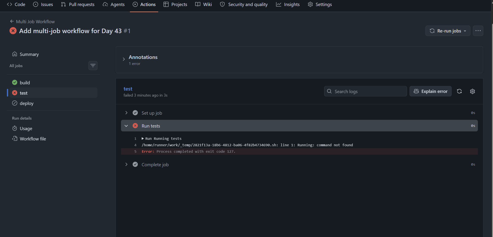
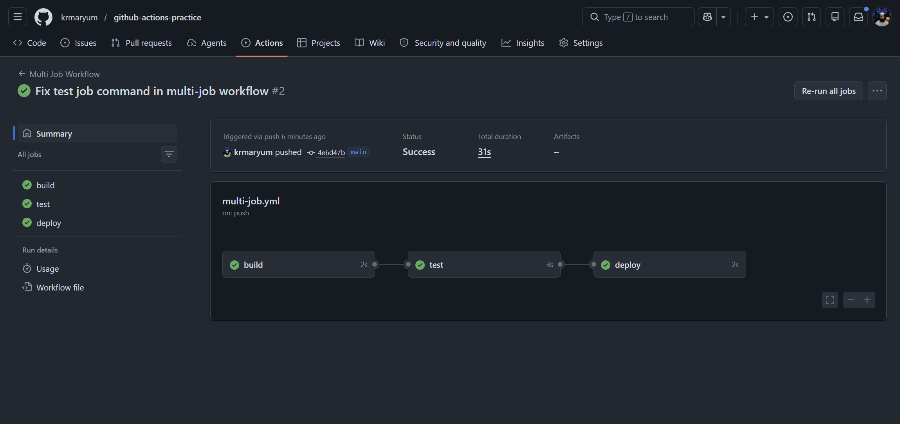
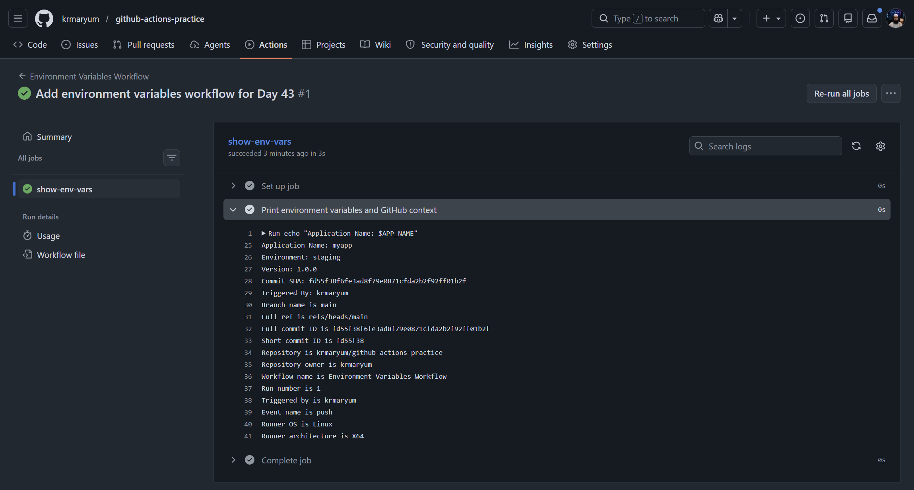
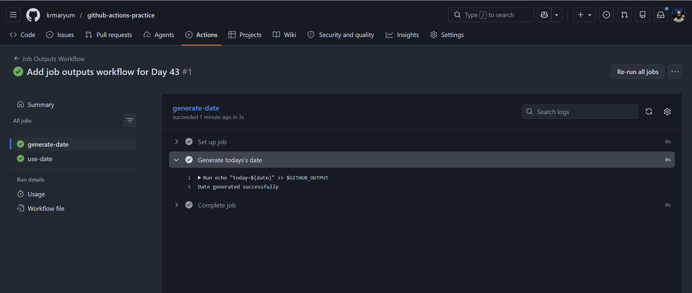
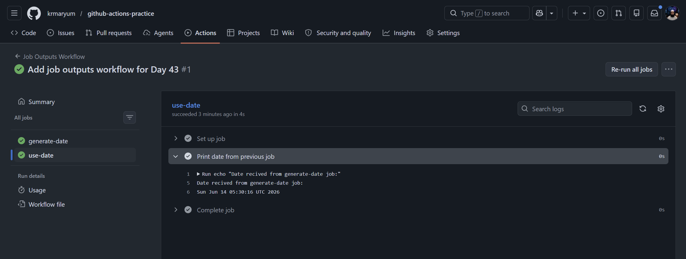
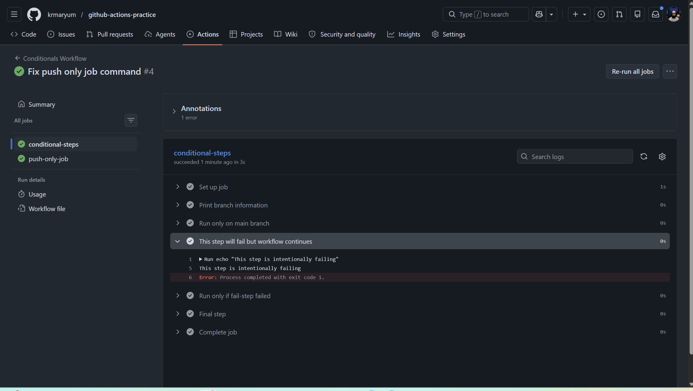
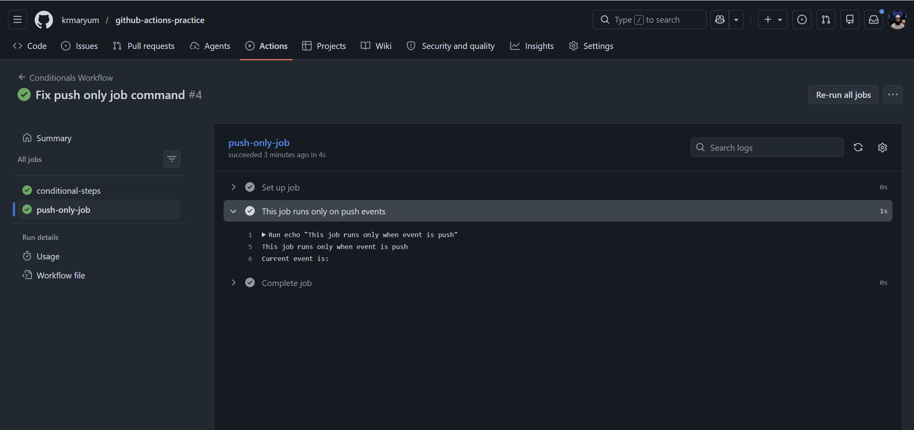
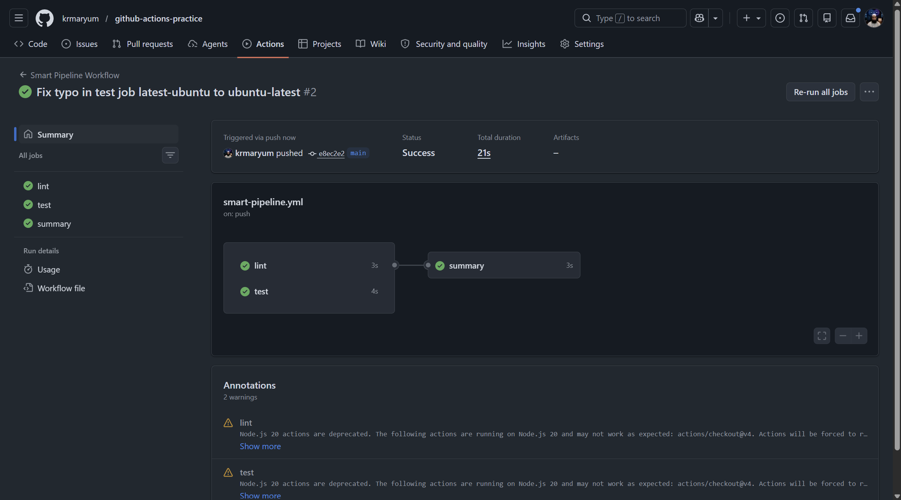

# Day 43 – Jobs, Steps, Env Vars & Conditionals

---

## Table of Contents

| Task | Topic | Summary | Link |
|---|---|---|---|
| Day Overview | Jobs, Steps, Env Vars & Conditionals | Introduction to controlling GitHub Actions workflow flow using jobs, dependencies, variables, outputs, and conditions. | [Go to Day Overview](#day-overview) |
| Day Objectives | Learning Goals | Lists what should be learned by the end of Day 43. | [Go to Day 43 Objectives](#day-43-objectives) |
| Task 1 | Multi-Job Workflow | Created a workflow with `build`, `test`, and `deploy` jobs using `needs:` to control job order. | [Go to Task 1](#task-1-multi-job-workflow) |
| Task 2 | Environment Variables | Practiced workflow-level, job-level, and step-level environment variables, plus GitHub context variables. | [Go to Task 2](#task-2-environment-variables) |
| Task 3 | Job Outputs | Passed today’s date from one job to another using `$GITHUB_OUTPUT`, `outputs:`, and `needs.<job>.outputs.<name>`. | [Go to Task 3](#task-3-job-outputs) |
| Task 4 | Conditionals | Used `if:` conditions, `failure()`, push-only jobs, and `continue-on-error: true`. | [Go to Task 4](#task-4-conditionals) |
| Task 5 | Smart Pipeline | Combined Day 43 concepts into one pipeline with parallel `lint` and `test` jobs and a dependent `summary` job. | [Go to Task 5](#task-5-putting-it-together) |
| Final Summary | Day 43 Review | Final review of what was learned from all Day 43 tasks. | [Go to Final Summary](#final-summary) |

---

## Day Overview

In Day 43, you will learn how to control the flow of a GitHub Actions pipeline.

Until now, your workflows mostly ran simple jobs and steps. Today, you will learn how to make workflows more realistic by using:

* Multiple jobs
* Job dependencies
* Environment variables
* Outputs between jobs
* Conditional steps
* Conditional jobs
* GitHub context values like branch name and commit message

This is important because real CI/CD pipelines do not run everything blindly.

Some jobs should run only after another job succeeds. Some steps should run only on the `main` branch. Some values need to be shared from one job to another.

---

## Day 43 Objectives

By the end of Day 43, you should be able to:

1. Create a multi-job GitHub Actions workflow.
2. Understand the difference between jobs and steps.
3. Use `needs:` to control job order.
4. Pass data from one job to another using job outputs.
5. Use environment variables inside workflows.
6. Use `if:` conditions to control when steps or jobs run.
7. Read GitHub context values such as branch name and commit message.
8. Verify job dependency flow from the GitHub Actions workflow graph.
9. Document your learning in `day-43-jobs-steps.md`.
10. Commit and push your Day 43 work to your fork.

---

# Task 1: Multi-Job Workflow

## Topic

**Jobs, Steps, Environment Variables & Conditionals**

## Task Name

**Task 1: Multi-Job Workflow**

---

# 1. Task 1 Overview

In this task, we create a GitHub Actions workflow with **three separate jobs**:

```text
build → test → deploy
```

This is an important step in understanding how real CI/CD pipelines are structured.

In real-world DevOps projects, a pipeline usually does not run everything in one place. Instead, it is divided into stages such as:

```text
Build the application
Test the application
Deploy the application
```

For this practice task, we are using simple `echo` commands, but the concept is very important. Later, these same jobs can run real commands such as:

- Installing dependencies
- Running tests
- Building Docker images
- Uploading artifacts
- Deploying to staging or production servers

The main goal of this task is to understand how one job can depend on another job using the `needs:` keyword.

---

# 2. Task 1 Objectives

By the end of this task, you will be able to:

1. Create a workflow file inside `.github/workflows/`.
2. Define multiple jobs in one GitHub Actions workflow.
3. Understand that jobs can run independently.
4. Use `needs:` to control the order of jobs.
5. Make the `test` job run only after the `build` job succeeds.
6. Make the `deploy` job run only after the `test` job succeeds.
7. Verify the job dependency chain in the GitHub Actions graph.
8. Explain the meaning of this flow:

```text
build → test → deploy
```

---

# 3. Simple Concept

By default, GitHub Actions may run multiple jobs at the same time.

If we want to control the order of jobs, we use:

```yaml
needs:
```

Example:

```yaml
test:
  needs: build
```

This means:

```text
The test job depends on the build job.
The test job will run only after the build job completes successfully.
```

So our pipeline becomes:

```text
build first
↓
test second
↓
deploy third
```

---

# 4. Task 1 Expected Workflow Flow

The workflow should work like this:

```text
Push code to GitHub
        ↓
GitHub Actions starts
        ↓
build job runs
        ↓
test job waits for build
        ↓
test job runs
        ↓
deploy job waits for test
        ↓
deploy job runs
        ↓
Workflow completes successfully
```

---

# 5. File to Create

Create this workflow file:

```text
.github/workflows/multi-job.yml
```

This file will contain the workflow code for Task 1.

---

# 6. Step-by-Step Hands-On Practice

## Step 1: Go to Your Repository Folder

Open Git Bash or your terminal and go to your repository folder:

```bash
cd /c/Linux/github-actions-practice
```

Check your files:

```bash
ls
```

You should see your repository files such as:

```text
README.md
```

---

## Step 2: Create the GitHub Actions Workflow Folder

GitHub Actions workflow files must be stored inside:

```text
.github/workflows/
```

Create the folder using this command:

```bash
mkdir -p .github/workflows
```

Explanation:

- `.github` is the GitHub configuration folder.
- `workflows` is the folder where GitHub Actions workflow files are stored.
- `mkdir -p` creates the full folder path if it does not already exist.

---

## Step 3: Create the Workflow File

Create a new workflow file:

```bash
nano .github/workflows/multi-job.yml
```

This opens the file in the nano editor.

---

## Step 4: Add the Workflow Code

Paste this code into the file:

```yaml
name: Multi Job Workflow

on:
  push:
    branches:
      - main

jobs:
  build:
    runs-on: ubuntu-latest

    steps:
      - name: Build the app
        run: echo "Building the app"

  test:
    runs-on: ubuntu-latest
    needs: build

    steps:
      - name: Run tests
        run: echo "Running tests"

  deploy:
    runs-on: ubuntu-latest
    needs: test

    steps:
      - name: Deploy the app
        run: echo "Deploying"
```

---

## Step 5: Save and Exit Nano

To save the file in nano:

```text
CTRL + O
Enter
CTRL + X
```

Meaning:

- `CTRL + O` saves the file.
- `Enter` confirms the file name.
- `CTRL + X` exits nano.

---

## Step 6: Check the Workflow File

Run:

```bash
cat .github/workflows/multi-job.yml
```

This command displays the file content in the terminal.

Make sure the YAML indentation is correct.

---

# 7. Workflow Code Explanation

## Workflow Name

```yaml
name: Multi Job Workflow
```

This is the name of the workflow. It will appear in the GitHub Actions tab.

---

## Trigger Section

```yaml
on:
  push:
    branches:
      - main
```

This means the workflow will run when code is pushed to the `main` branch.

---

## Jobs Section

```yaml
jobs:
```

This starts the jobs section.

A workflow can have one job or multiple jobs.

In this task, we created three jobs:

```text
build
test
deploy
```

---

# 8. Job 1: build

```yaml
build:
  runs-on: ubuntu-latest

  steps:
    - name: Build the app
      run: echo "Building the app"
```

Explanation:

- `build:` is the job name.
- `runs-on: ubuntu-latest` means this job runs on a GitHub-hosted Ubuntu runner.
- `steps:` contains the commands that run inside the job.
- `run: echo "Building the app"` prints a message in the workflow logs.

Expected output:

```text
Building the app
```

---

# 9. Job 2: test

```yaml
test:
  runs-on: ubuntu-latest
  needs: build

  steps:
    - name: Run tests
      run: echo "Running tests"
```

Explanation:

- `test:` is the job name.
- `needs: build` means the test job depends on the build job.
- The test job will run only after the build job succeeds.

Expected output:

```text
Running tests
```

Important line:

```yaml
needs: build
```

Meaning:

```text
Run test only after build completes successfully.
```

---

# 10. Job 3: deploy

```yaml
deploy:
  runs-on: ubuntu-latest
  needs: test

  steps:
    - name: Deploy the app
      run: echo "Deploying"
```

Explanation:

- `deploy:` is the job name.
- `needs: test` means the deploy job depends on the test job.
- The deploy job will run only after the test job succeeds.

Expected output:

```text
Deploying
```

Important line:

```yaml
needs: test
```

Meaning:

```text
Run deploy only after test completes successfully.
```

---

# 11. What `needs:` Does

The `needs:` keyword is used to create a dependency between jobs.

Without `needs:`, jobs may run at the same time.

With `needs:`, we can control the job order.

Example:

```yaml
test:
  needs: build
```

This means:

```text
test depends on build
```

Another example:

```yaml
deploy:
  needs: test
```

This means:

```text
deploy depends on test
```

So the final dependency chain becomes:

```text
build → test → deploy
```

---

# 12. Add, Commit, and Push

After creating the workflow file, check Git status:

```bash
git status
```

Add the workflow file:

```bash
git add .github/workflows/multi-job.yml
```

Commit the change:

```bash
git commit -m "Add multi-job workflow for Day 43"
```

Push to GitHub:

```bash
git push
```

---

# 13. Verify on GitHub

After pushing your code:

1. Open your GitHub repository.
2. Click the **Actions** tab.
3. Open **Multi Job Workflow**.
4. Click the latest workflow run.
5. Check the workflow graph.

You should see the dependency chain:

```text
build → test → deploy
```

This confirms that the workflow is running in the correct order.



The test job failed because I wrote plain text inside run: instead of a real shell command. GitHub Actions tried to execute "Running" as a command and failed with exit code 127. I fixed it by using echo "Running tests".


---

# 14. Expected Result

The workflow should complete successfully.

You should see three jobs:

```text
build
test
deploy
```

Expected output messages:

```text
Building the app
Running tests
Deploying
```



<video src="videos/task1-multijob-workflow.mp4" controls width="700"></video>

https://youtu.be/BFrla4qwEZU

---

# 15. What I Learned

In this task, I learned that a GitHub Actions workflow can have multiple jobs.

I also learned that jobs can run in parallel by default, but we can control the order using the `needs:` keyword.

The `needs:` keyword helps create a proper CI/CD flow where one job waits for another job to finish successfully.

In this task, I created this dependency chain:

```text
build → test → deploy
```

This is similar to a real CI/CD pipeline where the application is built first, tested second, and deployed last.

---

# 16. Quick Summary

| Item | Details |
|---|---|
| Day | Day 43 |
| Task | Task 1 |
| Topic | Multi-Job Workflow |
| Workflow file | `.github/workflows/multi-job.yml` |
| Jobs created | `build`, `test`, `deploy` |
| Key keyword | `needs:` |
| Main concept | Job dependency |
| Final flow | `build → test → deploy` |

---

# 17. Final Notes

This task is a foundation for understanding advanced GitHub Actions pipelines.

In real projects, the same structure can be used for:

```text
build → test → security scan → docker build → deploy
```

The commands may become more advanced later, but the structure remains the same.

---

## Task 1 – Question and Answer for Study Notes

### Question 1: In Task 1, how many machines or servers are used when each job has `runs-on: ubuntu-latest`?

### Answer:

In Task 1, the workflow has three jobs:

```yaml
jobs:
  build:
    runs-on: ubuntu-latest

  test:
    runs-on: ubuntu-latest
    needs: build

  deploy:
    runs-on: ubuntu-latest
    needs: test
```

Each job uses:

```yaml
runs-on: ubuntu-latest
```

This means GitHub provides a separate fresh Ubuntu runner environment for each job.

So in this workflow, GitHub Actions uses three separate runner environments:

```text
build job  → Ubuntu runner 1
test job   → Ubuntu runner 2
deploy job → Ubuntu runner 3
```

Even though all jobs use `ubuntu-latest`, they do not automatically run on the same machine. Each job starts in a clean runner environment.

The `needs:` keyword controls the order of the jobs, but it does not make them run on the same machine.

The workflow order is:

```text
build → test → deploy
```

Because of:

```yaml
test:
  needs: build
```

and:

```yaml
deploy:
  needs: test
```

This means:

* `test` runs only after `build` succeeds.
* `deploy` runs only after `test` succeeds.

Important note:

If a file is created in the `build` job, it will not automatically be available in the `test` job, because the `test` job runs on a different fresh runner environment.

To share files between jobs, we use artifacts.

To share small values between jobs, we use outputs.

---

### Question 2: Can this same workflow run on a self-hosted runner?

### Answer:

Yes, this workflow can run on a self-hosted runner.

For GitHub-hosted runners, we use:

```yaml
runs-on: ubuntu-latest
```

For a self-hosted runner, we can use:

```yaml
runs-on: self-hosted
```

Example:

```yaml
jobs:
  build:
    runs-on: self-hosted

    steps:
      - name: Build the app
        run: echo "Building the app"

  test:
    runs-on: self-hosted
    needs: build

    steps:
      - name: Run tests
        run: echo "Running tests"

  deploy:
    runs-on: self-hosted
    needs: test

    steps:
      - name: Deploy the app
        run: echo "Deploying"
```

If there is only one self-hosted runner available, all three jobs can run on the same self-hosted machine one by one.

The flow will still be:

```text
build → test → deploy
```

because `needs:` controls the job order.

In this case:

```text
build job  → self-hosted runner
test job   → same self-hosted runner
deploy job → same self-hosted runner
```

A more specific way to target a self-hosted Linux runner is:

```yaml
runs-on: [self-hosted, Linux, X64]
```

This tells GitHub Actions to run the job on a self-hosted runner that matches those labels.

The main difference is:

```text
ubuntu-latest   → GitHub-provided temporary machine
self-hosted     → My own registered machine, such as EC2, VM, or local server
```

### Summary:

* `ubuntu-latest` means GitHub provides the runner.
* `self-hosted` means my own machine runs the job.
* With GitHub-hosted runners, each job usually gets a fresh separate runner.
* With one self-hosted runner, multiple jobs can run on the same machine one after another.
* `needs:` controls the order of jobs, not the machine itself.


---

# Task 2: Environment Variables

## Task 2 Overview

In this task, you will learn how to use **environment variables** in GitHub Actions.

Environment variables are reusable values that can be used inside workflows, jobs, and steps.

In this task, you will create a new workflow and use environment variables at **three levels**:

```text
Workflow level
Job level
Step level
```

You will also use GitHub context variables to print:

```text
Commit SHA
Actor / user who triggered the workflow
```

This is useful in real CI/CD pipelines because you often need to know:

```text
Which app is running?
Which environment is being used?
Which version is being deployed?
Who triggered the workflow?
Which commit started the workflow?
```
[Some Common Environment Variables](md/GitHub-Actions-Common-Variables-Table.md)

---

## Task 2 Objectives

By the end of this task, you will be able to:

1. Create a new GitHub Actions workflow file.
2. Define environment variables at workflow level.
3. Define environment variables at job level.
4. Define environment variables at step level.
5. Print all environment variables inside one step.
6. Understand variable scope in GitHub Actions.
7. Use GitHub context values.
8. Print the commit SHA using `${{ github.sha }}`.
9. Print the actor using `${{ github.actor }}`.
10. Verify the output in the GitHub Actions logs.

---

## Simple Concept

Environment variables can be defined in different places.

### 1. Workflow-Level Variable

A workflow-level variable is available to all jobs and all steps in the workflow.

Example:

```yaml
env:
  APP_NAME: myapp
```

### 2. Job-Level Variable

A job-level variable is available only inside that specific job.

Example:

```yaml
jobs:
  show-env-vars:
    env:
      ENVIRONMENT: staging
```

### 3. Step-Level Variable

A step-level variable is available only inside that specific step.

Example:

```yaml
steps:
  - name: Print variables
    env:
      VERSION: 1.0.0
```

---

# Task 2 Hands-On Steps

## Step 1: Go to Your Repository Folder

Open your terminal and go to your GitHub Actions practice repository.

```bash
cd /c/Linux/github-actions-practice
```

Check your files:

```bash
ls
```

---

## Step 2: Make Sure the Workflow Folder Exists

GitHub Actions workflow files must be inside this folder:

```text
.github/workflows/
```

Run this command:

```bash
mkdir -p .github/workflows
```

---

## Step 3: Create a New Workflow File

Create a new workflow file named `env-vars.yml`:

```bash
nano .github/workflows/env-vars.yml
```

---

## Step 4: Add the Workflow Code

Copy and paste this full workflow code into the file:

```yaml
name: Environment Variables Workflow

on:
  push:
    branches:
      - main

  workflow_dispatch:

env:
  APP_NAME: myapp

jobs:
  show-env-vars:
    runs-on: ubuntu-latest

    env:
      ENVIRONMENT: staging

    steps:
      - name: Print environment variables and GitHub context
        env:
          VERSION: 1.0.0
        run: |
          echo "Application Name: $APP_NAME"
          echo "Environment: $ENVIRONMENT"
          echo "Version: $VERSION"
          echo "Commit SHA: ${{ github.sha }}"
          echo "Triggered By: ${{ github.actor }}"

          echo "Branch name is ${{ github.ref_name }}"
          echo "Full ref is ${{ github.ref }}"
          echo "Full commit ID is ${{ github.sha }}"
          echo "Short commit ID is ${GITHUB_SHA::7}"
          echo "Repository is ${{ github.repository }}"
          echo "Repository owner is ${{ github.repository_owner }}"
          echo "Workflow name is ${{ github.workflow }}"
          echo "Run number is ${{ github.run_number }}"
          echo "Triggered by is ${{ github.actor }}"
          echo "Event name is ${{ github.event_name }}"
          echo "Runner OS is ${{ runner.os }}"
          echo "Runner architecture is ${{ runner.arch }}"

```

---

## Step 5: Save the File

If you are using `nano`, save the file like this:

```text
CTRL + O
Enter
CTRL + X
```

---

## Step 6: Check the File Content

Run:

```bash
cat .github/workflows/env-vars.yml
```

Make sure the indentation is correct.

YAML is indentation-sensitive, so spaces matter.

---

## Step 7: Add, Commit, and Push

Check Git status:

```bash
git status
```

Add the workflow file:

```bash
git add .github/workflows/env-vars.yml
```

Commit the file:

```bash
git commit -m "Add environment variables workflow for Day 43"
```

Push to GitHub:

```bash
git push
```

---

## Step 8: Verify in GitHub Actions

Go to your GitHub repository.

Then open:

```text
Repository → Actions tab → Environment Variables Workflow
```

Open the latest workflow run.

Then open the job:

```text
show-env-vars
```

Then open the step:

```text
Print environment variables and GitHub context
```

You should see output similar to this:

```text
Application Name: myapp
Environment: staging
Version: 1.0.0
Commit SHA: abc123...
Triggered By: your-github-username
```

The commit SHA will be long. That is normal.

---

# Explanation of the Workflow

## Workflow-Level Environment Variable

```yaml
env:
  APP_NAME: myapp
```

This is defined at the top level of the workflow.

It can be used by all jobs and all steps in this workflow.

Inside the step, we print it using:

```bash
echo "Application Name: $APP_NAME"
```

---

## Job-Level Environment Variable

```yaml
env:
  ENVIRONMENT: staging
```

This is defined inside the job.

It can be used by all steps inside this job only.

Inside the step, we print it using:

```bash
echo "Environment: $ENVIRONMENT"
```

---

## Step-Level Environment Variable

```yaml
env:
  VERSION: 1.0.0
```

This is defined inside one step.

It can be used only inside that specific step.

Inside the step, we print it using:

```bash
echo "Version: $VERSION"
```

---

# GitHub Context Variables

GitHub also provides built-in context values.

These are not normal shell environment variables. They are GitHub Actions expression values.

## Commit SHA

```yaml
${{ github.sha }}
```

This prints the commit ID that triggered the workflow.

Example:

```bash
echo "Commit SHA: ${{ github.sha }}"
```

---

## Actor

```yaml
${{ github.actor }}
```

This prints the GitHub username of the person who triggered the workflow.

Example:

```bash
echo "Triggered By: ${{ github.actor }}"
```

---

# Important Difference

Environment variables are usually accessed like this inside shell commands:

```bash
$APP_NAME
$ENVIRONMENT
$VERSION
```

GitHub context variables are accessed like this:

```yaml
${{ github.sha }}
${{ github.actor }}
```

Remember:

```text
env variable       → $VARIABLE_NAME
GitHub context     → ${{ github.context_name }}
```

---

# Expected Result

Your workflow should run successfully and print all five values:

```text
Application Name: myapp
Environment: staging
Version: 1.0.0
Commit SHA: commit-id
Triggered By: github-username
```

---

# Common Mistakes

## Mistake 1: Wrong YAML Indentation

Wrong indentation can break the workflow.

Correct example:

```yaml
env:
  APP_NAME: myapp
```

## Mistake 2: Using GitHub Context Like a Shell Variable

Wrong:

```bash
echo "$github.sha"
```

Correct:

```bash
echo "${{ github.sha }}"
```

## Mistake 3: Forgetting `workflow_dispatch:`

If you want to run the workflow manually from GitHub Actions, add:

```yaml
workflow_dispatch:
```

---

# What I Learned

In this task, I learned how environment variables work at different levels in GitHub Actions.

Workflow-level variables are available everywhere in the workflow.

Job-level variables are available only inside that job.

Step-level variables are available only inside that step.

I also learned how to use GitHub context variables such as:

```yaml
${{ github.sha }}
${{ github.actor }}
```

These context values help identify which commit triggered the workflow and who triggered it.




---

# Study Notes Summary

## Environment Variable Levels

| Level | Example Variable | Scope |
|---|---|---|
| Workflow level | `APP_NAME: myapp` | Available to all jobs and steps |
| Job level | `ENVIRONMENT: staging` | Available only inside that job |
| Step level | `VERSION: 1.0.0` | Available only inside that step |

---

## GitHub Context Variables Used

| Context Variable | Meaning |
|---|---|
| `${{ github.sha }}` | Commit SHA that triggered the workflow |
| `${{ github.actor }}` | GitHub username of the person who triggered the workflow |

---

## Final Workflow File Path

```text
.github/workflows/env-vars.yml
```

---

## Final Commands Used

```bash
cd /c/Linux/github-actions-practice
mkdir -p .github/workflows
nano .github/workflows/env-vars.yml
cat .github/workflows/env-vars.yml
git status
git add .github/workflows/env-vars.yml
git commit -m "Add environment variables workflow for Day 43"
git push
```

---

# Final Verification Checklist

- [x] Workflow file created: `.github/workflows/env-vars.yml`
- [x] Workflow-level variable added: `APP_NAME: myapp`
- [x] Job-level variable added: `ENVIRONMENT: staging`
- [x] Step-level variable added: `VERSION: 1.0.0`
- [x] Commit SHA printed successfully
- [x] Actor printed successfully
- [x] Workflow ran successfully in the Actions tab
- [x] Output verified in logs

---

# Task 3: Job Outputs

## Task 3 Overview

In this task, you will learn how to **pass data from one job to another job** in GitHub Actions.

In Task 1, you learned that each job can run on a separate runner environment. Because of that, one job cannot automatically share its values with another job.

For example, if one job generates a value like today's date, build version, image tag, or deployment ID, another job may need to use that value.

That is where **job outputs** are used.

In this task, you will create:

```text
Job 1: generate-date
```

This job will create today's date as an output.

Then you will create:

```text
Job 2: use-date
```

This job will read the output from the first job and print it.

The flow will be:

```text
generate-date → use-date
```

---

## Task 3 Objectives

By the end of this task, you will be able to:

1. Create a new workflow file for job outputs.
2. Create one job that generates an output.
3. Use `$GITHUB_OUTPUT` to save a step output.
4. Convert a step output into a job output.
5. Use `needs:` to make the second job wait for the first job.
6. Read output from another job using `needs.<job-name>.outputs.<output-name>`.
7. Understand why outputs are useful in real CI/CD pipelines.
8. Verify the output in GitHub Actions logs.

---

## Important Concept

There are two levels here:

```text
Step output
Job output
```

First, a step creates an output using:

```bash
echo "today=$(date)" >> $GITHUB_OUTPUT
```

Then the job exposes that step output as a job output:

```yaml
outputs:
  current_date: ${{ steps.date-step.outputs.today }}
```

Then another job reads it using:

```yaml
${{ needs.generate-date.outputs.current_date }}
```

---

## Task 3 Hands-On Steps

### Step 1: Go to Your Repository Folder

```bash
cd /c/Linux/github-actions-practice
```

Check your files:

```bash
ls
```

---

### Step 2: Make Sure Workflow Folder Exists

```bash
mkdir -p .github/workflows
```

---

### Step 3: Create a New Workflow File

Create this file:

```bash
nano .github/workflows/job-outputs.yml
```

---

### Step 4: Add This Workflow Code

```yaml
name: Job Outputs Workflow

on:
  push:
    branches:
      - main

  workflow_dispatch:

jobs:
  generate-date:
    runs-on: ubuntu-latest

    outputs:
      current_date: ${{ steps.date-step.outputs.today }}

    steps:
      - name: Generate today's date
        id: date-step
        run: |
          echo "today=$(date)" >> $GITHUB_OUTPUT
          echo "Date generated successfully"

  use-date:
    runs-on: ubuntu-latest
    needs: generate-date

    steps:
      - name: Print date from previous job
        run: |
          echo "Date received from generate-date job:"
          echo "${{ needs.generate-date.outputs.current_date }}"
```

Save the file:

```text
CTRL + O
Enter
CTRL + X
```

---

### Step 5: Check the File

```bash
cat .github/workflows/job-outputs.yml
```

Make sure indentation is correct.

---

### Step 6: Add, Commit, and Push

```bash
git status
git add .github/workflows/job-outputs.yml
git commit -m "Add job outputs workflow for Day 43"
git push
```





<video src="videos/task3-outputs.mp4" controls width="700"></video>

https://youtu.be/1H4L3i48AlY

---

### Step 7: Verify in GitHub Actions

Go to your GitHub repository:

```text
Repository → Actions tab → Job Outputs Workflow
```

Open the latest workflow run.

You should see two jobs:

```text
generate-date
use-date
```

Because of `needs: generate-date`, the second job will run only after the first job succeeds.

The graph should look like this:

```text
generate-date → use-date
```

Now open the `use-date` job and check the step:

```text
Print date from previous job
```

Expected output will look similar to:

```text
Date received from generate-date job:
Sat Jun 13 22:30:00 UTC 2026
```

Your date and time will be different. That is normal.

---

## Explanation of Workflow

# Block-by-Block Explanation

## 1. Workflow Name

```yaml
name: Job Outputs Workflow
```

This is the name of the workflow.

This name appears in the GitHub Actions tab.

In GitHub, you will see this workflow as:

```text
Job Outputs Workflow
```

---

## 2. Workflow Triggers

```yaml
on:
  push:
    branches:
      - main

  workflow_dispatch:
```

This block tells GitHub when to run this workflow.

This workflow has two triggers:

1. Push trigger
2. Manual trigger

---

## 3. Push Trigger

```yaml
push:
  branches:
    - main
```

This means the workflow will run automatically whenever you push code to the `main` branch.

Example:

```bash
git push
```

If your push goes to the `main` branch, the workflow will start automatically.

---

## 4. Manual Trigger

```yaml
workflow_dispatch:
```

This allows you to run the workflow manually from the GitHub Actions UI.

To run it manually:

```text
GitHub Repository → Actions tab → Select workflow → Run workflow
```

This is useful when you want to test a workflow without pushing new code.

---

## 5. Jobs Section

```yaml
jobs:
```

The `jobs` section defines the work GitHub Actions will perform.

A workflow can have one job or multiple jobs.

In this workflow, there are two jobs:

```text
1. generate-date
2. use-date
```

---

# Job 1: generate-date

## 6. First Job Name

```yaml
generate-date:
```

This is the name of the first job.

The purpose of this job is to generate today's date and make it available for another job.

---

## 7. Runner for First Job

```yaml
runs-on: ubuntu-latest
```

This tells GitHub to run this job on a fresh Ubuntu Linux runner.

A runner is the machine where the GitHub Actions job runs.

GitHub provides this temporary machine for the workflow.

---

## 8. Job Output Block

```yaml
outputs:
  current_date: ${{ steps.date-step.outputs.today }}
```

This block creates a job output.

The output name is:

```text
current_date
```

This line means:

```yaml
current_date: ${{ steps.date-step.outputs.today }}
```

Take the output called `today` from the step with the ID `date-step`, and expose it as a job output named `current_date`.

Simple flow:

```text
Step output name: today
Job output name: current_date
```

So the first job is saying:

```text
I will create an output called current_date, and other jobs can use it.
```

---

## 9. Steps Section in First Job

```yaml
steps:
```

The `steps` section contains the actual commands or actions that run inside the job.

A job can have one step or many steps.

---

## 10. Step Name

```yaml
- name: Generate today's date
```

This is the step name.

In GitHub Actions logs, this step will appear as:

```text
Generate today's date
```

---

## 11. Step ID

```yaml
id: date-step
```

This is very important.

The `id` gives this step a reference name.

Because the step has this ID, we can access its output later using:

```yaml
steps.date-step.outputs.today
```

Without the `id`, it would be difficult to reference this step output.

---

## 12. Run Commands in First Job

```yaml
run: |
  echo "today=$(date)" >> $GITHUB_OUTPUT
  echo "Date generated successfully"
```

The `run` block runs shell commands.

The pipe symbol:

```yaml
|
```

means multiple commands are written under the same `run` block.

---

## 13. Creating a Step Output

```bash
echo "today=$(date)" >> $GITHUB_OUTPUT
```

This command creates a step output.

Breakdown:

```bash
date
```

The `date` command prints the current date and time.

Example output:

```text
Sun Jun 14 10:30:22 UTC 2026
```

This part:

```bash
today=$(date)
```

creates an output named `today` and stores the date inside it.

This part:

```bash
>> $GITHUB_OUTPUT
```

saves the output into GitHub Actions' special output file.

So the full command means:

```text
Create a step output called today and store the current date inside it.
```

---

## 14. Printing a Confirmation Message

```bash
echo "Date generated successfully"
```

This command prints a message in the workflow logs.

It does not create an output.

It is only for confirmation.

---

# Job 2: use-date

## 15. Second Job Name

```yaml
use-date:
```

This is the name of the second job.

The purpose of this job is to read the date from the first job and print it.

---

## 16. Runner for Second Job

```yaml
runs-on: ubuntu-latest
```

This job also runs on a fresh Ubuntu Linux runner.

Important point:

```text
generate-date and use-date run on separate runner machines.
```

They do not automatically share files, variables, or command results.

That is why we use job outputs.

---

## 17. needs Keyword

```yaml
needs: generate-date
```

This is one of the most important lines in this workflow.

It means the `use-date` job depends on the `generate-date` job.

So GitHub runs the jobs in this order:

```text
1. generate-date
2. use-date
```

Without `needs`, GitHub may run both jobs at the same time.

The `needs` keyword does two things:

1. It makes the second job wait for the first job.
2. It allows the second job to access outputs from the first job.

---

## 18. Steps Section in Second Job

```yaml
steps:
```

This starts the list of steps inside the second job.

---

## 19. Print Date Step

```yaml
- name: Print date from previous job
```

This is the step name.

In GitHub Actions logs, this step will appear as:

```text
Print date from previous job
```

---

## 20. Reading the Output from the First Job

```yaml
run: |
  echo "Date received from generate-date job:"
  echo "${{ needs.generate-date.outputs.current_date }}"
```

This block prints the date received from the previous job.

---

## 21. First Echo Command

```bash
echo "Date received from generate-date job:"
```

This prints a simple message in the logs.

---

## 22. Second Echo Command

```bash
echo "${{ needs.generate-date.outputs.current_date }}"
```

This prints the output from the first job.

Breakdown:

```yaml
needs
```

This means access a job listed in `needs`.

```yaml
generate-date
```

This is the previous job name.

```yaml
outputs
```

This means access the outputs from that job.

```yaml
current_date
```

This is the job output name created in the first job.

So this line means:

```text
Print the current_date output from the generate-date job.
```

---

# Complete Workflow Flow

```text
Workflow starts
        |
        v
Job 1: generate-date
        |
        | Creates step output: today
        |
        | Converts step output into job output: current_date
        v
Job 2: use-date
        |
        | Reads current_date using needs.generate-date.outputs.current_date
        v
Prints the date
```

---

# Simple Real-Life Example

Think of it like this:

```text
generate-date job = Worker 1
use-date job      = Worker 2
```

Worker 1 writes today's date on a note.

Worker 2 cannot directly see Worker 1's computer.

So Worker 1 must officially pass the note using `outputs`.

That is what job outputs do.

---

# Why Do We Pass Outputs Between Jobs?

We pass outputs between jobs when one job creates a value that another job needs.

Examples:

```text
Job 1 builds an app version number.
Job 2 deploys that same version.
```

```text
Job 1 creates a Docker image tag.
Job 2 uses that image tag to deploy.
```

```text
Job 1 generates today's date.
Job 2 prints or uses that date.
```

In this workflow:

```text
generate-date creates the date.
use-date receives and prints the date.
```

---

# Most Important Lines to Remember

## Step ID

```yaml
id: date-step
```

This gives the step a reference name.

---

## Create Step Output

```bash
echo "today=$(date)" >> $GITHUB_OUTPUT
```

This creates a step output called `today`.

---

## Convert Step Output into Job Output

```yaml
outputs:
  current_date: ${{ steps.date-step.outputs.today }}
```

This exposes the step output as a job output called `current_date`.

---

## Make Second Job Depend on First Job

```yaml
needs: generate-date
```

This makes the second job wait for the first job.

---

## Read Output from Previous Job

```yaml
${{ needs.generate-date.outputs.current_date }}
```

This reads the output from the previous job.
---

## Why Would You Pass Outputs Between Jobs?

You pass outputs between jobs when one job generates a value that another job needs.

In GitHub Actions, jobs often run on separate runner environments, so values are not automatically shared between jobs.

Outputs provide a clean way to pass small values from one job to another.

For example:

```text
Build job creates an app version
Test job uses that version
Docker job creates an image tag
Deploy job uses that image tag
Security scan job creates a report status
Deploy job decides what to do based on that status
```

## Why would you pass outputs between jobs?

I would pass outputs between jobs when one job creates a value that another job needs.

In GitHub Actions, jobs often run on separate runner environments, so values are not automatically shared between jobs.

Outputs provide a clean way to pass small values from one job to another.

For example, a build job can create a version number, date, Docker image tag, or deployment ID. A later job can read that output and use it for testing, deployment, or reporting.

---


```bash
git status
git add .github/workflows/job-outputs.yml
git commit -m "Add job outputs workflow for Day 43"
git push
```

---

## Final Verification Checklist

- [x] Workflow file created: `.github/workflows/job-outputs.yml`
- [x] First job created: `generate-date`
- [x] Step output created using `$GITHUB_OUTPUT`
- [x] Job output created using `outputs:`
- [x] Second job created: `use-date`
- [x] Second job used `needs: generate-date`
- [x] Output read using `needs.generate-date.outputs.current_date`
- [x] Workflow ran successfully in the Actions tab
- [x] Date output verified in logs


---

## Summary

In this task, I learned how to pass data from one job to another job in GitHub Actions.

The first job generated today's date and saved it as a step output using `$GITHUB_OUTPUT`.

Then the job exposed that value as a job output using `outputs:`.

The second job used `needs: generate-date` to wait for the first job and then read the output using:

```yaml
${{ needs.generate-date.outputs.current_date }}
```

This is useful in real CI/CD pipelines when one job creates a value that another job needs, such as a version number, Docker image tag, date, deployment ID, or test result.

---

# Task 4: Conditionals

## Task 4 Overview

In this task, you will learn how to control **when a job or step should run** in GitHub Actions.

In real CI/CD pipelines, we do not always want every step to run every time.

For example:

```text
Deploy only from main branch
Run cleanup only when something fails
Run a job only on push, not pull request
Allow one step to fail but continue the workflow
```

This is where GitHub Actions conditionals are used.

Conditionals use the `if:` keyword.

---

## Task 4 Objectives

By the end of this task, you will be able to:

1. Create a workflow that uses conditional steps.
2. Run a step only when the branch is `main`.
3. Run a step only when the previous step fails.
4. Create a job that runs only on `push` events.
5. Understand `continue-on-error: true`.
6. Verify skipped, failed, and successful steps in GitHub Actions logs.
7. Understand why conditionals are important in CI/CD pipelines.

---

## Important Concepts

### 1. Step Only Runs on Main Branch

```yaml
if: github.ref == 'refs/heads/main'
```

This means the step runs only when the workflow is running on the `main` branch.

---

### 2. Step Only Runs When a Previous Step Failed

```yaml
if: failure()
```

This means the step runs only if an earlier step in the job failed.

---

### 3. Job Only Runs on Push Event

```yaml
if: github.event_name == 'push'
```

This means the job runs only when the workflow is triggered by a `push` event.

---

### 4. Continue Even If a Step Fails

```yaml
continue-on-error: true
```

This means if that step fails, the workflow will continue instead of stopping immediately.

---

## Task 4 Hands-On Steps

## Step 1: Go to Your Repository Folder

```bash
cd /c/Linux/github-actions-practice
```

Check your files:

```bash
ls
```

---

## Step 2: Make Sure Workflow Folder Exists

```bash
mkdir -p .github/workflows
```

---

## Step 3: Create a New Workflow File

```bash
nano .github/workflows/conditionals.yml
```

---

## Step 4: Paste This Workflow Code

```yaml
name: Conditionals Workflow

on:
  push:
    branches:
      - main

  pull_request:
    branches:
      - main

  workflow_dispatch:

jobs:
  conditional-steps:
    runs-on: ubuntu-latest

    steps:
      - name: Print branch information
        run: |
          echo "Branch ref is: ${{ github.ref }}"
          echo "Event name is: ${{ github.event_name }}"

      - name: Run only on main branch
        if: github.ref == 'refs/heads/main'
        run: echo "This step runs only on the main branch"

      - name: This step will fail but workflow continues
        continue-on-error: true
        run: |
          echo "This step is intentionally failing"
          exit 1

      - name: Run only if previous step failed
        if: failure()
        run: echo "A previous step failed, so this step is running"

      - name: Final step
        run: echo "Workflow continued after failure because continue-on-error was true"

  push-only-job:
    runs-on: ubuntu-latest
    if: github.event_name == 'push'

    steps:
      - name: This job runs only on push events
        run: |
          echo "This job runs only when event is push"
          echo "Current event is: ${{ github.event_name }}"
```

Save the file:

```text
CTRL + O
Enter
CTRL + X
```

---

## Step 5: Check the File

```bash
cat .github/workflows/conditionals.yml
```

Make sure the indentation is correct.

---

## Step 6: Add, Commit, and Push

```bash
git status
git add .github/workflows/conditionals.yml
git commit -m "Add conditionals workflow for Day 43"
git push
```

---

## Step 7: Verify in GitHub Actions

Go to:

```text
GitHub repository → Actions → Conditionals Workflow
```

Open the latest run.

You should see two jobs:

```text
conditional-steps
push-only-job
```

Because this workflow was triggered by `push`, both jobs should run.

---

## Expected Output

In the `conditional-steps` job, you should see:

```text
Branch ref is: refs/heads/main
Event name is: push
This step runs only on the main branch
This step is intentionally failing
A previous step failed, so this step is running
Workflow continued after failure because continue-on-error was true
```

In the `push-only-job`, you should see:

```text
This job runs only when event is push
Current event is: push
```

---

## Explanation of Each Part

| Option                    | Used For        | Meaning                                                 |
| ------------------------- | --------------- | ------------------------------------------------------- |
| `continue-on-error: true` | Step or job     | Continue even if this step/job fails                    |
| `fail-fast: false`        | Matrix strategy | Do not cancel other matrix jobs if one matrix job fails |


[Explanation in more detail](md/day-43-task-4-conditionals-workflow.md)

## 1. Trigger Section

```yaml
on:
  push:
    branches:
      - main

  pull_request:
    branches:
      - main

  workflow_dispatch:
```

This workflow can run three ways:

```text
push
pull_request
manual run
```

We added `pull_request` also so you can later test how the push-only job behaves when the event is not `push`.

---

## 2. Step That Runs Only on Main Branch

```yaml
- name: Run only on main branch
  if: github.ref == 'refs/heads/main'
  run: echo "This step runs only on the main branch"
```

This step checks the branch reference.

If the branch is `main`, it runs.

If the branch is not `main`, it is skipped.

---

## 3. Step with `continue-on-error: true`

```yaml
- name: This step will fail but workflow continues
  continue-on-error: true
  run: |
    echo "This step is intentionally failing"
    exit 1
```

Normally, `exit 1` means the step failed, and GitHub Actions would stop the job.

But because we added:

```yaml
continue-on-error: true
```

GitHub Actions allows the job to continue to the next step.

---

## 4. What Does `continue-on-error: true` Do?

`continue-on-error: true` allows a workflow or job to continue even if that step fails.

Normally, if a step fails, the job stops. But with `continue-on-error: true`, GitHub Actions marks that step as failed or warning-like, but continues running the next steps.

This is useful when a step is helpful but not critical.

Examples:

```text
Optional scan
Optional test
Experimental check
Warning-only validation
```

---

## 5. Step That Runs Only When Previous Step Failed

```yaml
- name: Run only if previous step failed
  if: failure()
  run: echo "A previous step failed, so this step is running"
```

This step runs only when a previous step has failed.

In this workflow, the previous step uses:

```bash
exit 1
```

So this step should run.

---

## 6. Final Step

```yaml
- name: Final step
  run: echo "Workflow continued after failure because continue-on-error was true"
```

This proves that the workflow continued even after the failed step.

---

## 7. Job That Runs Only on Push Events

```yaml
push-only-job:
  runs-on: ubuntu-latest
  if: github.event_name == 'push'
```

This job runs only when the event name is `push`.

If the workflow runs from a pull request, this job will be skipped.

---

## Copy-Paste Commands

```bash
cd /c/Linux/github-actions-practice
mkdir -p .github/workflows
nano .github/workflows/conditionals.yml
```

Paste this:

```yaml
name: Conditionals Workflow

on:
  push:
    branches:
      - main

  pull_request:
    branches:
      - main

  workflow_dispatch:

jobs:
  conditional-steps:
    runs-on: ubuntu-latest

    steps:
      - name: Print branch information
        run: |
          echo "Branch ref is: ${{ github.ref }}"
          echo "Event name is: ${{ github.event_name }}"

      - name: Run only on main branch
        if: github.ref == 'refs/heads/main'
        run: echo "This step runs only on the main branch"

      - name: This step will fail but workflow continues
        continue-on-error: true
        run: |
          echo "This step is intentionally failing"
          exit 1

      - name: Run only if previous step failed
        if: failure()
        run: echo "A previous step failed, so this step is running"

      - name: Final step
        run: echo "Workflow continued after failure because continue-on-error was true"

  push-only-job:
    runs-on: ubuntu-latest
    if: github.event_name == 'push'

    steps:
      - name: This job runs only on push events
        run: |
          echo "This job runs only when event is push"
          echo "Current event is: ${{ github.event_name }}"
```

Then run:

```bash
git status
git add .github/workflows/conditionals.yml
git commit -m "Add conditionals workflow for Day 43"
git push
```

---

## What to Write in Notes

## Task 4: Conditionals

### Overview

In this task, I learned how to control when jobs and steps run in GitHub Actions using the `if:` keyword.

I created a workflow that includes:

- A step that runs only on the `main` branch
- A step that runs only when a previous step failed
- A job that runs only on push events
- A step with `continue-on-error: true`

---

### Key Conditional Examples

Run only on main branch:

```yaml
if: github.ref == 'refs/heads/main'
```

Run only when a previous step failed:

```yaml
if: failure()
```

Run job only on push events:

```yaml
if: github.event_name == 'push'
```

Allow workflow to continue even if a step fails:

```yaml
continue-on-error: true
```

---

### What Does `continue-on-error: true` Do?

`continue-on-error: true` allows the workflow to continue even if that step fails.

Normally, if a step fails, the job stops. But with `continue-on-error: true`, GitHub Actions continues running the next steps.

This is useful for optional checks, experimental commands, or non-critical validations.

---

### Why Are Conditionals Useful?

Conditionals are useful because real pipelines should not run every step every time.

For example:

- Deployment should run only from the `main` branch.
- Cleanup or debugging steps may run only after failure.
- Certain jobs may run only on push events.
- Optional checks can fail without stopping the whole workflow.

---






### Verification

I checked the GitHub Actions logs and verified that the conditional steps worked correctly.

---

## Final Verification Checklist

After successful run, mark the checklist like this:

```markdown
## Final Verification Checklist

- [x] Workflow file created: `.github/workflows/conditionals.yml`
- [x] Step added that runs only on `main`
- [x] Step added with `continue-on-error: true`
- [x] Step added that runs only when previous step failed
- [x] Job added that runs only on push events
- [x] Workflow ran successfully in the Actions tab
- [x] Conditional step output verified in logs
- [x] Push-only job verified in logs
```

---

## Important Note

When `continue-on-error: true` is used, the failed step may not make the whole job red. That is expected.

The workflow continues because the failure is allowed.

---

## Final Summary

In this task, I learned how to control workflow execution using conditionals.

I used `if: github.ref == 'refs/heads/main'` to run a step only on the main branch.

I used `continue-on-error: true` to allow the workflow to continue even when a step failed.

I used `if: failure()` to run a step only when a previous step failed.

I used `if: github.event_name == 'push'` to run a job only on push events.

Branch condition ✅

continue-on-error ✅

specific failed step check using id ✅

push-only job ✅

workflow tested in GitHub Actions ✅

This is useful in real CI/CD pipelines because deployment, cleanup, testing, and notification steps often depend on branch name, event type, or failure status.

---

# Task 5: Putting It Together

## Task 5 Overview

In this task, you will combine the main concepts learned in Day 43:

- Jobs
- Steps
- Parallel jobs
- Job dependencies with `needs:`
- GitHub context variables
- Branch detection
- Commit message printing

You will create a smart pipeline workflow named:

```text
.github/workflows/smart-pipeline.yml
```

This workflow will trigger on a push to **any branch**.

It will have three jobs:

```text
lint
test
summary
```

The `lint` and `test` jobs will run in parallel.

The `summary` job will run after both `lint` and `test` finish.

The `summary` job will print:

- Whether this is a main branch push
- Whether this is a feature branch push
- The branch name
- The full Git reference
- The event name
- The commit message

---

## Task 5 Objectives

By the end of this task, you will be able to:

1. Create a workflow that triggers on push to any branch.
2. Create multiple jobs in one workflow.
3. Understand how jobs run in parallel.
4. Create a `lint` job.
5. Create a `test` job.
6. Use `needs:` with multiple jobs.
7. Make a `summary` job wait for both `lint` and `test`.
8. Use GitHub context variables to read branch information.
9. Print the commit message that triggered the workflow.
10. Verify the workflow graph in the GitHub Actions tab.

---

## Important Concept 1: Push to Any Branch

To trigger a workflow on push to any branch, use:

```yaml
on:
  push:
```

Do not add this:

```yaml
branches:
  - main
```

If you add `branches: main`, the workflow will run only on the `main` branch.

For this task, we want the workflow to run on **any branch**.

---

## Important Concept 2: Parallel Jobs

Jobs run in parallel when they do not depend on each other.

Example:

```yaml
jobs:
  lint:
    runs-on: ubuntu-latest

  test:
    runs-on: ubuntu-latest
```

Here, `lint` and `test` do not have `needs:`.

That means GitHub Actions can start both jobs at the same time.

This is useful because it saves time in real CI/CD pipelines.

---

## Important Concept 3: Summary Job After Multiple Jobs

To make a job wait for multiple jobs, use:

```yaml
needs: [lint, test]
```

This means:

```text
Run this job only after both lint and test finish successfully.
```

So the pipeline flow becomes:

```text
lint ─┐
      ├── summary
test ─┘
```

---

## Important Concept 4: GitHub Context Variables

GitHub provides built-in context values.

In this task, you will use:

```yaml
${{ github.ref_name }}
${{ github.ref }}
${{ github.event_name }}
${{ github.event.head_commit.message }}
```

### Meaning

| GitHub Context | Meaning |
|---|---|
| `${{ github.ref_name }}` | Branch name, such as `main` or `feature-test` |
| `${{ github.ref }}` | Full branch reference, such as `refs/heads/main` |
| `${{ github.event_name }}` | Event that triggered the workflow, such as `push` |
| `${{ github.event.head_commit.message }}` | Commit message that triggered the workflow |

---

# Task 5 Hands-On Steps

## Step 1: Go to Your Repository Folder

```bash
cd /c/Linux/github-actions-practice
```

Check your files:

```bash
ls
```

---

## Step 2: Make Sure Workflow Folder Exists

```bash
mkdir -p .github/workflows
```

---

## Step 3: Create a New Workflow File

```bash
nano .github/workflows/smart-pipeline.yml
```

---

## Step 4: Paste This Workflow Code

```yaml
name: Smart Pipeline Workflow

on:
  push:

  workflow_dispatch:

jobs:
  lint:
    runs-on: ubuntu-latest

    steps:
      - name: Checkout repository
        uses: actions/checkout@v4

      - name: Run lint check
        run: |
          echo "Running lint job"
          echo "Lint check completed successfully"

  test:
    runs-on: ubuntu-latest

    steps:
      - name: Checkout repository
        uses: actions/checkout@v4

      - name: Run tests
        run: |
          echo "Running test job"
          echo "Tests completed successfully"

  summary:
    runs-on: ubuntu-latest
    needs: [lint, test]

    steps:
      - name: Print pipeline summary
        run: |
          echo "Pipeline Summary"
          echo "----------------"
          echo "Branch name is: ${{ github.ref_name }}"
          echo "Full ref is: ${{ github.ref }}"
          echo "Event name is: ${{ github.event_name }}"
          echo "Commit message is: ${{ github.event.head_commit.message }}"

          if [ "${{ github.ref }}" = "refs/heads/main" ]; then
            echo "This is a main branch push"
          else
            echo "This is a feature branch push"
          fi
```

---

## Step 5: Save the File

In `nano`, save the file using:

```text
CTRL + O
Enter
CTRL + X
```

---

## Step 6: Check the File

```bash
cat .github/workflows/smart-pipeline.yml
```

Make sure the indentation is correct.

YAML is indentation-sensitive, so spaces are important.

---

## Step 7: Add, Commit, and Push

Check Git status:

```bash
git status
```

Add the workflow file:

```bash
git add .github/workflows/smart-pipeline.yml
```

Commit the file:

```bash
git commit -m "Add smart pipeline workflow for Day 43"
```

Push to GitHub:

```bash
git push
```

---

## Step 8: Verify in GitHub Actions

Go to your GitHub repository:

```text
GitHub Repository → Actions → Smart Pipeline Workflow
```

Open the latest workflow run.

You should see three jobs:

```text
lint
test
summary
```

The graph should show `lint` and `test` running first, then `summary` running after both.

Expected graph:

```text
lint ─┐
      ├── summary
test ─┘
```

---

# Expected Output

## Lint Job Output

```text
Running lint job
Lint check completed successfully
```

## Test Job Output

```text
Running test job
Tests completed successfully
```

## Summary Job Output on Main Branch

If you pushed to the `main` branch, the output should look similar to this:

```text
Pipeline Summary
----------------
Branch name is: main
Full ref is: refs/heads/main
Event name is: push
Commit message is: Add smart pipeline workflow for Day 43
This is a main branch push
```

## Summary Job Output on Feature Branch

If you pushed to a feature branch, for example `feature-test`, the output should look similar to this:

```text
Pipeline Summary
----------------
Branch name is: feature-test
Full ref is: refs/heads/feature-test
Event name is: push
Commit message is: Add smart pipeline workflow for Day 43
This is a feature branch push
```



<video src="videos/task5-smart-pipline.mp4" controls width="700"></video>

https://youtu.be/KioGguLMpyA

---

# Explanation of Workflow

## Workflow Name

```yaml
name: Smart Pipeline Workflow
```

This is the name that appears in the GitHub Actions tab.

---

## Trigger Section

```yaml
on:
  push:

  workflow_dispatch:
```

This workflow can run in two ways:

1. Automatically when code is pushed to any branch.
2. Manually from the GitHub Actions tab because of `workflow_dispatch:`.

---

## Lint Job

```yaml
lint:
  runs-on: ubuntu-latest
```

This creates a job named `lint`.

It runs on a GitHub-hosted Ubuntu runner.

In real projects, a lint job checks code quality, formatting, and syntax.

For practice, this job prints:

```bash
echo "Running lint job"
echo "Lint check completed successfully"
```

---

## Test Job

```yaml
test:
  runs-on: ubuntu-latest
```

This creates a job named `test`.

It also runs on a GitHub-hosted Ubuntu runner.

In real projects, this job can run unit tests, integration tests, or application checks.

For practice, this job prints:

```bash
echo "Running test job"
echo "Tests completed successfully"
```

---

## Why Lint and Test Run in Parallel

The `lint` job does not have `needs:`.

The `test` job also does not have `needs:`.

Because neither job depends on the other, GitHub Actions can run them at the same time.

This is called parallel execution.

```text
lint and test run in parallel
```

---

## Summary Job

```yaml
summary:
  runs-on: ubuntu-latest
  needs: [lint, test]
```

This creates a job named `summary`.

The important line is:

```yaml
needs: [lint, test]
```

This means the `summary` job waits for both jobs:

- `lint`
- `test`

The `summary` job will run only after both jobs finish successfully.

---

## Branch Name

```yaml
${{ github.ref_name }}
```

This prints only the branch name.

Example:

```text
main
```

or:

```text
feature-test
```

---

## Full Git Reference

```yaml
${{ github.ref }}
```

This prints the full Git reference.

Example:

```text
refs/heads/main
```

or:

```text
refs/heads/feature-test
```

---

## Event Name

```yaml
${{ github.event_name }}
```

This prints the event that triggered the workflow.

Example:

```text
push
```

---

## Commit Message

```yaml
${{ github.event.head_commit.message }}
```

This prints the commit message that triggered the workflow.

Example:

```text
Add smart pipeline workflow for Day 43
```

---

## Branch Detection Logic

```bash
if [ "${{ github.ref }}" = "refs/heads/main" ]; then
  echo "This is a main branch push"
else
  echo "This is a feature branch push"
fi
```

This shell condition checks whether the workflow is running on the `main` branch.

If the branch is `main`, it prints:

```text
This is a main branch push
```

If the branch is anything else, it prints:

```text
This is a feature branch push
```

---

# Why This Task Is Important

This task is important because it combines many real CI/CD pipeline concepts.

A real pipeline may run linting and testing at the same time to save time.

After both jobs finish, a summary, package, deploy, or notification job can run.

This task teaches how to build smarter workflows instead of running every job randomly.

---

# Copy-Paste Commands

Use this section when you want to quickly create the workflow.

```bash
cd /c/Linux/github-actions-practice
mkdir -p .github/workflows
nano .github/workflows/smart-pipeline.yml
```

Paste this workflow:

```yaml
name: Smart Pipeline Workflow

on:
  push:

  workflow_dispatch:

jobs:
  lint:
    runs-on: ubuntu-latest

    steps:
      - name: Run lint check
        run: |
          echo "Running lint job"
          echo "Lint check completed successfully"

  test:
    runs-on: ubuntu-latest

    steps:
      - name: Run tests
        run: |
          echo "Running test job"
          echo "Tests completed successfully"

  summary:
    runs-on: ubuntu-latest
    needs: [lint, test]

    steps:
      - name: Print pipeline summary
        run: |
          echo "Pipeline Summary"
          echo "----------------"
          echo "Branch name is: ${{ github.ref_name }}"
          echo "Full ref is: ${{ github.ref }}"
          echo "Event name is: ${{ github.event_name }}"
          echo "Commit message is: ${{ github.event.head_commit.message }}"

          if [ "${{ github.ref }}" = "refs/heads/main" ]; then
            echo "This is a main branch push"
          else
            echo "This is a feature branch push"
          fi
```

Save:

```text
CTRL + O
Enter
CTRL + X
```

Then run:

```bash
git status
git add .github/workflows/smart-pipeline.yml
git commit -m "Add smart pipeline workflow for Day 43"
git push
```

---

# What to Write in Notes

## Task 5: Putting It Together

### Overview

In this task, I created a smart GitHub Actions pipeline that combines jobs, parallel execution, job dependencies, conditionals, and GitHub context variables.

The workflow triggers on push to any branch.

It has three jobs:

- `lint`
- `test`
- `summary`

The `lint` and `test` jobs run in parallel because they do not depend on each other.

The `summary` job waits for both `lint` and `test` using:

```yaml
needs: [lint, test]
```

---

### Key Concepts

#### Push to Any Branch

```yaml
on:
  push:
```

This means the workflow runs on push to any branch.

---

#### Parallel Jobs

The `lint` and `test` jobs run in parallel because neither job has a `needs:` dependency.

---

#### Summary Job

```yaml
needs: [lint, test]
```

This means the `summary` job runs only after both `lint` and `test` complete successfully.

---

#### Branch Detection

```bash
if [ "${{ github.ref }}" = "refs/heads/main" ]; then
  echo "This is a main branch push"
else
  echo "This is a feature branch push"
fi
```

This checks whether the workflow ran on the `main` branch or another branch.

---

#### Commit Message

```yaml
${{ github.event.head_commit.message }}
```

This prints the commit message that triggered the workflow.

---

### Why This Task Is Important

This task shows how real CI/CD pipelines are structured.

A real pipeline may run linting and testing in parallel to save time.

After both finish, a summary or deploy job can run.

This helps create faster and smarter automation.

---

### Verification

I checked the GitHub Actions workflow graph and verified that `lint` and `test` ran first, then `summary` ran after both jobs.

---

# Final Verification Checklist


- [x] Workflow file created: `.github/workflows/smart-pipeline.yml`
- [x] Workflow triggers on push to any branch
- [x] `lint` job created
- [x] `test` job created
- [x] `lint` and `test` jobs ran in parallel
- [x] `summary` job created
- [x] `summary` job used `needs: [lint, test]`
- [x] Workflow ran successfully in the Actions tab

---

# Final Summary

In Task 5, I created a smart pipeline workflow that triggers on push to any branch.

The workflow has a `lint` job and a `test` job that run in parallel.

After both finish, the `summary` job runs using:

```yaml
needs: [lint, test]
```

The summary job prints branch information and the commit message.

This task helped me understand how to combine multiple GitHub Actions concepts into one real pipeline.


