# Day 44 – Secrets, Artifacts & Running Real Tests in CI

---

---

## Table of Contents

| Task | Topic | Summary | Link |
|---|---|---|---|
| Day 44 Overview | Secrets, Artifacts & Real Tests in CI | Overview of Day 44 topics including secrets, artifacts, caching, and real CI testing. | [Go to Overview](#day-44-overview) |
| Task 1 | GitHub Secrets | Created `MY_SECRET_MESSAGE`, used it in a workflow, and verified that GitHub masks secret values as `***` in logs. | [Go to Task 1](#task-1-github-secrets) |
| Task 2 | Use Secrets as Environment Variables | Added `DOCKER_USERNAME` and `DOCKER_TOKEN` as repository secrets and passed them safely into workflow steps using `env:`. | [Go to Task 2](#task-2-use-secrets-as-environment-variables) |
| Task 3 | Upload Artifacts | Generated `reports/test-report.txt` inside CI and uploaded it using `actions/upload-artifact@v4`. | [Go to Task 3](#task-3-upload-artifacts) |
| Task 4 | Download Artifacts Between Jobs | Used Job 1 to upload an artifact and Job 2 to download and print its contents using `actions/download-artifact@v4`. | [Go to Task 4](#task-4-download-artifacts-between-jobs) |
| Task 5 | Run Real Tests in CI | Ran a real shell script in CI, intentionally broke it, verified the red pipeline, fixed it, and verified the green pipeline again. | [Go to Task 5](#task-5-run-real-tests-in-ci) |
| Task 6 | Caching | Used `actions/cache@v4` to cache Python pip dependencies from `~/.cache/pip` and verified cache restore on a later run. | [Go to Task 6](#task-6-caching) |

---

## Day 44 Overview

Today your GitHub Actions pipeline starts becoming more realistic.

Until now, we mostly printed messages, used variables, ran jobs, and controlled workflow flow. Today, we will learn how CI/CD pipelines handle real DevOps work.

In Day 44, we will learn about:

1. Storing sensitive values securely using **GitHub Secrets**
2. Saving output files using **artifacts**
3. Downloading artifacts between jobs
4. Using cache to make pipelines faster
5. Running real tests inside CI
6. Creating proper documentation with screenshots

---

## Day 44 Main Objectives

By the end of Day 44, you should understand:

| Topic | Objective |
|---|---|
| Secrets | How to store sensitive values safely in GitHub |
| Secret masking | How GitHub hides secret values in workflow logs |
| Artifacts | How to save files generated by a workflow |
| Artifact download | How to download saved workflow output |
| Cache | How to speed up CI by reusing dependencies |
| Tests in CI | How to run actual test commands automatically |
| Documentation | How to document your CI work in markdown |

---

## Expected Final Output for Day 44

By the end of Day 44, the repository should have:

```text
github-actions-practice/
├── .github/
│   └── workflows/
│       ├── secrets-demo.yml
│       ├── artifact-demo.yml
│       └── real-tests.yml
│
└── 2026/
    └── day-44/
        └── day-44-secrets-artifacts.md
```

---

## Final Day 44 Checklist

| Requirement | Status |
|---|---|
| New workflow files | Created during tasks |
| Passing CI test run | Verified in GitHub Actions |
| Artifact download screenshot | Added to notes |
| Passing test screenshot | Added to notes |
| Secrets management explanation | Added to notes |
| Commit and push | Final step |

---

# Task 1: GitHub Secrets

---

## Task 1 Objective

In this task, I will learn how to store a sensitive value in GitHub safely and use it inside a GitHub Actions workflow without exposing the real value in logs.

---

## What is a GitHub Secret?

A **GitHub Secret** is a secure value stored inside GitHub repository settings.

Secrets are used to store sensitive values such as passwords, API keys, access tokens, private keys, and other confidential information.

Examples:

| Secret Type | Example |
|---|---|
| API token | DockerHub token |
| Password | Database password |
| SSH key | Private deployment key |
| Cloud key | AWS access key |
| Custom secret | `MY_SECRET_MESSAGE` |

The important point is:

> We should never hard-code passwords, tokens, or keys directly inside a workflow file.

---

## Why Do We Use Secrets?

### Bad Practice

```yaml
run: echo "My password is 12345"
```

This is bad because the password is written directly inside the workflow file.

Anyone who can see the repository or workflow logs may see the sensitive value.

---

### Good Practice

```yaml
run: echo "Secret is stored safely"
```

This is better because we do not expose the actual secret value.

---

## Why Secrets Are Important in CI/CD

Secrets help protect sensitive information from being exposed.

| Risk | Meaning |
|---|---|
| Public logs | Anyone may see workflow output |
| Git history | Committed secrets are hard to remove |
| Team exposure | Not everyone should see sensitive values |
| Security leaks | Tokens can be stolen and misused |

---

# Step 1: Create the Secret in GitHub

Go to your repository:

```text
github-actions-practice
```

Then follow this path:

```text
Settings
→ Secrets and variables
→ Actions
→ New repository secret
```

Create this secret:

| Field | Value |
|---|---|
| Name | `MY_SECRET_MESSAGE` |
| Secret | `Alhamdulillah Day 44 secret is working` |

Then click:

```text
Add secret
```

<video src="videos/task1-step1-secretinGithub.mp4" controls width="700"></video>


---

## Important Note

After creating a GitHub secret, you cannot view the secret value again.

GitHub will only allow you to update or delete the secret.

This is for security.

---

# Step 2: Create the Workflow File

Inside your repository, create this workflow file:

```text
.github/workflows/secrets-demo.yml
```

---

## Complete Workflow Code

```yaml
name: Secrets Demo

on:
  push:
    branches:
      - "**"
  workflow_dispatch:

jobs:
  check-secret:
    runs-on: ubuntu-latest

    steps:
      - name: Check if secret is set
        run: |
          if [ -n "${{ secrets.MY_SECRET_MESSAGE }}" ]; then
            echo "The secret is set: true"
          else
            echo "The secret is set: false"
          fi

      - name: Try to print secret directly
        run: |
          echo "Trying to print secret:"
          echo "${{ secrets.MY_SECRET_MESSAGE }}"
```

---

# Step 3: Understand the Workflow

---

## Workflow Name

```yaml
name: Secrets Demo
```

This is the name that will appear in the GitHub Actions tab.

---

## Workflow Trigger

```yaml
on:
  push:
    branches:
      - "**"
  workflow_dispatch:
```

This workflow runs in two ways:

| Trigger | Meaning |
|---|---|
| `push` | Runs when code is pushed to any branch |
| `workflow_dispatch` | Allows manual run from the GitHub Actions UI |

---

## Job Name

```yaml
jobs:
  check-secret:
    runs-on: ubuntu-latest
```

This creates one job called:

```text
check-secret
```

The job runs on a GitHub-hosted Ubuntu runner.

---

## Step 1: Check if Secret is Set

```yaml
- name: Check if secret is set
  run: |
    if [ -n "${{ secrets.MY_SECRET_MESSAGE }}" ]; then
      echo "The secret is set: true"
    else
      echo "The secret is set: false"
    fi
```

This step checks whether the secret exists and has a value.

If the secret has a value, the workflow prints:

```text
The secret is set: true
```

This is safe because we are not printing the actual secret value.

---

## What Does `-n` Mean?

In Bash, `-n` checks whether a string is not empty.

Example:

```bash
if [ -n "hello" ]; then
  echo "Value exists"
fi
```

In our workflow:

```bash
if [ -n "${{ secrets.MY_SECRET_MESSAGE }}" ]; then
```

This means:

> If the secret value is not empty, print that the secret is set.

---

## Step 2: Try to Print the Secret Directly

```yaml
- name: Try to print secret directly
  run: |
    echo "Trying to print secret:"
    echo "${{ secrets.MY_SECRET_MESSAGE }}"
```

This step tries to print the real secret value.

But GitHub should hide it in the logs.

Instead of showing the real secret, GitHub usually shows:

```text
***
```

This means GitHub automatically masks secret values in workflow logs.

---

# Step 4: Add, Commit, and Push

Run these commands from your repository folder:

```bash
git status
```

Add the workflow file:

```bash
git add .github/workflows/secrets-demo.yml
```

Commit the workflow:

```bash
git commit -m "Add Day 44 secrets demo workflow"
```

Push to GitHub:

```bash
git push
```

---

# Step 5: Verify in GitHub Actions

Go to your GitHub repository.

Then go to:

```text
Actions
→ Secrets Demo
→ Latest workflow run
→ check-secret job
```

Open the job logs.

You should see:

```text
The secret is set: true
```

When the workflow tries to print the secret directly, GitHub should show:

```text
***
```

The real secret value should not appear in the logs.

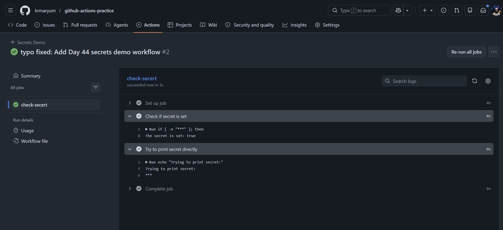


---

# Step 6: Expected Result

| Check | Expected Result |
|---|---|
| Secret created | `MY_SECRET_MESSAGE` exists in repo secrets |
| Workflow file created | `.github/workflows/secrets-demo.yml` |
| Workflow triggered | Runs after push |
| Secret check output | `The secret is set: true` |
| Direct print output | `***` |
| CI status | Green check / passing |

---

# What I Learned

In this task, I learned how to store sensitive values securely in GitHub Actions using repository secrets.

I created a repository secret called:

```text
MY_SECRET_MESSAGE
```

Instead of printing the actual secret value, I checked whether the secret was set and printed:

```text
The secret is set: true
```

I also tested what happens when a secret is printed directly in workflow logs.

GitHub automatically masked the secret and displayed it as:

```text
***
```

This showed me that GitHub protects secret values from being exposed in logs.

---

# Why Should We Never Print Secrets in CI Logs?

Secrets should never be printed in CI logs because logs may be visible to team members or stored in workflow history.

If a secret is exposed, attackers can use it to access private systems, cloud accounts, DockerHub, servers, APIs, databases, or deployment environments.

Even though GitHub masks secrets automatically, we should still follow best practice and never intentionally print secret values.

---

# Task 1 Final Summary

In this task, I created a GitHub repository secret called `MY_SECRET_MESSAGE`.

I used the secret inside a GitHub Actions workflow and checked whether the secret was set without printing the actual value.

The workflow printed:

`The secret is set: true`

Then I tested printing the secret directly. GitHub automatically masked the secret value and displayed:

`***`

This means GitHub protects secret values in workflow logs.

### Why should we never print secrets in CI logs?

We should never print secrets in CI logs because logs may be visible to team members or stored in workflow history. If a secret is exposed, attackers can use it to access private systems, cloud accounts, DockerHub, servers, APIs, databases, or deployment environments.

---

# Task 1 Completion Checklist

| Task | Status |
|---|---|
| Created `MY_SECRET_MESSAGE` secret | Done |
| Created `.github/workflows/secrets-demo.yml` | Done |
| Added workflow code | Done |
| Committed workflow file | Done |
| Pushed to GitHub | Done |
| Verified workflow run | Done |
| Confirmed secret shows as `***` | Done |
| Wrote notes about secrets management | Done |

---

# Task 2: Use Secrets as Environment Variables

## Task Title

Use GitHub Secrets as Environment Variables in GitHub Actions

---

## Task Objective

In this task, I learned how to pass GitHub Secrets into a GitHub Actions workflow step as environment variables.

The main goal is to use sensitive values securely without hardcoding them inside the workflow file.

By the end of this task, I should be able to:

| Goal | Meaning |
|---|---|
| Add Docker secrets | Store DockerHub username and token securely in GitHub |
| Use secrets as environment variables | Pass secrets into workflow steps using `env:` |
| Avoid hardcoding | Never write username or token directly inside workflow code |
| Prepare for Day 45 | Use these secrets later for Docker login and Docker image push |

---

## Why This Task Is Important

In real DevOps projects, CI/CD pipelines often need sensitive values.

Examples include:

| Secret Type | Example |
|---|---|
| DockerHub credentials | Docker username and access token |
| Cloud credentials | AWS access key and secret key |
| Database password | MySQL or PostgreSQL password |
| SSH key | Private key for server access |
| API token | GitHub token, Docker token, or cloud token |

These values should never be written directly inside workflow files because workflow files are part of the Git repository.

If a secret is hardcoded, it can be exposed through:

- Git history
- Pull requests
- Workflow logs
- Public repositories
- Team member access
- Accidental screenshots

So the correct method is to store secrets in GitHub Secrets and use them securely inside workflows.

---

## What Are GitHub Secrets?

GitHub Secrets are encrypted values stored inside a GitHub repository or organization.

They are used to safely store sensitive data such as passwords, tokens, and keys.

In GitHub Actions, secrets are accessed using this syntax:

```yaml
${{ secrets.SECRET_NAME }}
```

Example:

```yaml
${{ secrets.DOCKER_TOKEN }}
```

---

## What Are Environment Variables?

An environment variable is a temporary value available inside a running shell or process.

In Linux shell, environment variables are usually accessed with `$`.

Example:

```bash
echo "$DOCKER_USERNAME"
```

In GitHub Actions, we can pass secrets into environment variables like this:

```yaml
env:
  DOCKER_USERNAME: ${{ secrets.DOCKER_USERNAME }}
  DOCKER_TOKEN: ${{ secrets.DOCKER_TOKEN }}
```

Then inside the shell command, we can use them like this:

```bash
echo "$DOCKER_USERNAME"
```

Important security rule:

Never print the actual token value.

---

## Secrets Needed for This Task

For this task, I need to create two GitHub repository secrets:

| Secret Name | Purpose |
|---|---|
| `DOCKER_USERNAME` | Stores my DockerHub username |
| `DOCKER_TOKEN` | Stores my DockerHub access token |

These secrets will also be used on Day 45 when working with Docker image build and push.

---

# Step 1: Create DockerHub Access Token

Before adding the Docker token to GitHub, I need to create a DockerHub access token.

Go to DockerHub:

```text
DockerHub → Account Settings → Personal access tokens → Generate new token
```

Suggested token name:

```text
github-actions-day-45
```

Suggested permission:

```text
Read & Write
```

After generating the token, copy it immediately.

Important:

DockerHub usually shows the token only once. If I lose it, I need to generate a new token.

---

# Step 2: Add Secrets in GitHub Repository

Go to the repository:

```text
github-actions-practice
```

Then go to:

```text
Settings → Secrets and variables → Actions → Repository secrets → New repository secret
```

Create the first secret:

| Field | Value |
|---|---|
| Name | `DOCKER_USERNAME` |
| Secret | My DockerHub username |

Create the second secret:

| Field | Value |
|---|---|
| Name | `DOCKER_TOKEN` |
| Secret | My DockerHub access token |

Important:

Do not use the DockerHub password as the token. Use a DockerHub access token.

---

# Step 3: Create Workflow File

Create a new workflow file:

```text
.github/workflows/secrets-env-demo.yml
```

---

# Step 4: Add Workflow Code

Add the following code inside `secrets-env-demo.yml`:

```yaml
name: Secrets as Environment Variables

on:
  push:
    branches:
      - "**"
  workflow_dispatch:

jobs:
  use-secret-env:
    runs-on: ubuntu-latest

    steps:
      - name: Check Docker secrets safely
        env:
          DOCKER_USERNAME: ${{ secrets.DOCKER_USERNAME }}
          DOCKER_TOKEN: ${{ secrets.DOCKER_TOKEN }}
        run: |
          echo "Checking Docker secrets..."

          if [ -n "$DOCKER_USERNAME" ]; then
            echo "Docker username is set: true"
          else
            echo "Docker username is set: false"
          fi

          if [ -n "$DOCKER_TOKEN" ]; then
            echo "Docker token is set: true"
          else
            echo "Docker token is set: false"
          fi

      - name: Use Docker username safely
        env:
          DOCKER_USERNAME: ${{ secrets.DOCKER_USERNAME }}
        run: |
          echo "Using Docker username without hardcoding it"
          echo "Docker username length: ${#DOCKER_USERNAME}"

      - name: Never print Docker token
        env:
          DOCKER_TOKEN: ${{ secrets.DOCKER_TOKEN }}
        run: |
          echo "Docker token is available to this step"
          echo "We will not print the token value"
```

---

# Step 5: Understand the Workflow

## Workflow Name

```yaml
name: Secrets as Environment Variables
```

This is the name that appears in the GitHub Actions tab.

---

## Workflow Trigger

```yaml
on:
  push:
    branches:
      - "**"
  workflow_dispatch:
```

This workflow runs in two ways:

| Trigger | Meaning |
|---|---|
| `push` | Runs automatically when code is pushed to any branch |
| `workflow_dispatch` | Allows the workflow to run manually from GitHub Actions UI |

---

## Job Name

```yaml
jobs:
  use-secret-env:
```

This creates a job called:

```text
use-secret-env
```

---

## Runner

```yaml
runs-on: ubuntu-latest
```

This means the job runs on a GitHub-hosted Ubuntu machine.

---

## Passing Secrets as Environment Variables

This is the most important part:

```yaml
env:
  DOCKER_USERNAME: ${{ secrets.DOCKER_USERNAME }}
  DOCKER_TOKEN: ${{ secrets.DOCKER_TOKEN }}
```

Here, GitHub reads the secrets and makes them available inside the shell as environment variables.

Inside the shell, they are used like this:

```bash
$DOCKER_USERNAME
$DOCKER_TOKEN
```

This means I do not need to hardcode the real values in the workflow file.

---

# Step 6: Safe Secret Check

This part checks if `DOCKER_USERNAME` exists:

```bash
if [ -n "$DOCKER_USERNAME" ]; then
  echo "Docker username is set: true"
else
  echo "Docker username is set: false"
fi
```

Meaning:

| Command | Meaning |
|---|---|
| `-n` | Checks if the variable is not empty |
| `$DOCKER_USERNAME` | Reads the environment variable |
| `true` | Secret exists |
| `false` | Secret is missing or empty |

---

# Step 7: Safe Docker Token Check

This part checks if `DOCKER_TOKEN` exists:

```bash
if [ -n "$DOCKER_TOKEN" ]; then
  echo "Docker token is set: true"
else
  echo "Docker token is set: false"
fi
```

This is safe because it does not print the actual token.

It only checks whether the token exists.

---

# Step 8: Why We Do Not Print the Token

Do not do this:

```yaml
run: echo "$DOCKER_TOKEN"
```

Even though GitHub usually masks secrets and displays them as:

```text
***
```

it is still bad practice to print secrets intentionally.

Reasons:

- Logs may be visible to other users
- Logs may be stored in workflow history
- Masking may not protect modified or partial values
- Accidental exposure can create security risk
- Tokens can give access to DockerHub or other systems

Correct method:

```bash
if [ -n "$DOCKER_TOKEN" ]; then
  echo "Docker token is set: true"
fi
```

---

# Step 9: Add, Commit, and Push

Check Git status:

```bash
git status
```

Add the workflow file:

```bash
git add .github/workflows/secrets-env-demo.yml
```

Commit the change:

```bash
git commit -m "Add Day 44 secrets environment variables workflow"
```

Push to GitHub:

```bash
git push
```

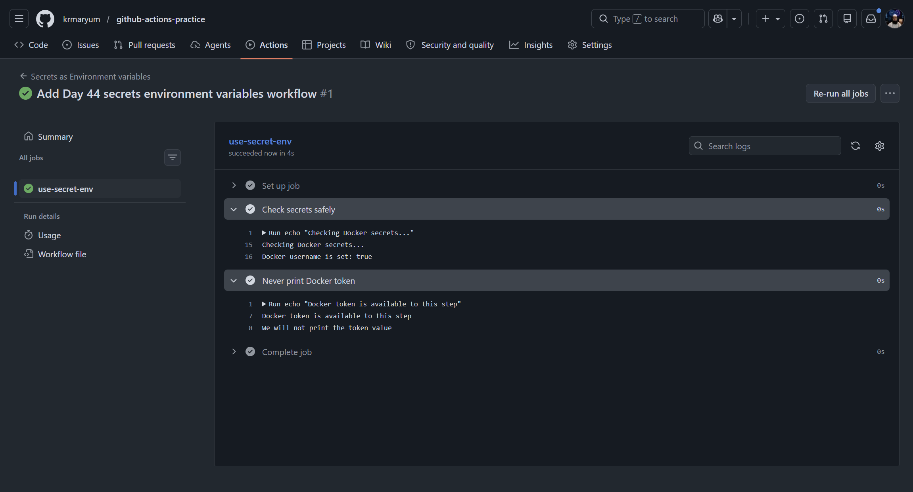


---

# Step 10: Verify in GitHub Actions

Go to:

```text
GitHub repository → Actions → Secrets as Environment Variables
```

Open the latest workflow run.

Then open the job:

```text
use-secret-env
```

Expected output:

```text
Checking Docker secrets...
Docker username is set: true
Docker token is set: true
Using Docker username without hardcoding it
Docker username length: 8
Docker token is available to this step
We will not print the token value
```

Note:

The Docker username length may be different depending on the username.

---

# Step 11: Expected Result

The workflow should pass successfully.

Expected CI result:

```text
Green check mark / successful workflow run
```

Expected secret checks:

| Check | Expected Result |
|---|---|
| Docker username secret | `Docker username is set: true` |
| Docker token secret | `Docker token is set: true` |
| Token printed directly | No |
| Workflow status | Passed |

---

# Common Mistakes and Fixes

## Mistake 1: Secret name mismatch

Wrong:

```yaml
${{ secrets.DOCKER_USER }}
```

Correct:

```yaml
${{ secrets.DOCKER_USERNAME }}
```

Secret names must match exactly.

---

## Mistake 2: Forgetting to create the secret

If the secret is not created, the output may show:

```text
Docker username is set: false
Docker token is set: false
```

Fix:

Go back to GitHub repository secrets and create the missing secret.

---

## Mistake 3: Printing the token

Wrong:

```bash
echo "$DOCKER_TOKEN"
```

Correct:

```bash
echo "Docker token is set: true"
```

Never intentionally print secret values.

---

## Mistake 4: Using DockerHub password instead of token

Wrong:

```text
DOCKER_TOKEN = DockerHub account password
```

Correct:

```text
DOCKER_TOKEN = DockerHub access token
```

Use access tokens for automation.

---

# What I Learned

In this task, I learned that GitHub Secrets can be passed into workflow steps as environment variables.

I created two secrets:

| Secret Name | Purpose |
|---|---|
| `DOCKER_USERNAME` | DockerHub username |
| `DOCKER_TOKEN` | DockerHub access token |

I used the `env:` block to pass these secrets into the workflow step.

Inside the shell command, I used them as normal Linux environment variables.

I did not hardcode my DockerHub username or token in the workflow file.

I also learned that secrets should not be printed in CI logs. Even if GitHub masks secrets, the best security practice is to avoid printing them completely.

---

## Summary

In this task, I learned how to pass GitHub Secrets into a workflow step as environment variables.

I created two repository secrets:

| Secret Name | Purpose |
|---|---|
| `DOCKER_USERNAME` | Stores my DockerHub username |
| `DOCKER_TOKEN` | Stores my DockerHub access token |

I used the `env:` block in GitHub Actions to pass these secrets into a step:

```yaml
env:
  DOCKER_USERNAME: ${{ secrets.DOCKER_USERNAME }}
  DOCKER_TOKEN: ${{ secrets.DOCKER_TOKEN }}
```

Inside the shell command, I used them like normal Linux environment variables:

```bash
$DOCKER_USERNAME
$DOCKER_TOKEN
```

I did not hardcode my DockerHub username or token inside the workflow file.

I also did not print the Docker token value. Instead, I only checked whether the secret was set.

### What I Learned

Secrets can be safely passed into GitHub Actions steps as environment variables.

This is useful because many tools, such as Docker, AWS CLI, Terraform, Ansible, and Kubernetes, use environment variables for authentication.

For security, we should never print secret values in CI logs. Even though GitHub masks secrets, the best practice is to avoid exposing them at all.


---

# Task 2 Success Checklist

| Check | Expected Result |
|---|---|
| `DOCKER_USERNAME` secret created | Yes |
| `DOCKER_TOKEN` secret created | Yes |
| Workflow file created | `.github/workflows/secrets-env-demo.yml` |
| Workflow triggered | Yes |
| Workflow passed | Green check |
| Username check | `Docker username is set: true` |
| Token check | `Docker token is set: true` |
| Token printed directly | No |

---

# Final Summary

Task 2 helped me understand how secrets are used safely in GitHub Actions.

Instead of hardcoding sensitive values inside the workflow file, I stored them in GitHub Secrets and passed them into the workflow using environment variables.

This is a real DevOps practice because CI/CD pipelines often need credentials to log in to DockerHub, AWS, Kubernetes, or other platforms.

The most important security lesson is:

Never print secrets in CI logs.

---

# Task 3: Upload Artifacts

## Task Title

**Upload Artifacts in GitHub Actions**

---

## Task Objective

In this task, you will learn how to generate a file inside a GitHub Actions workflow and save that file as an artifact.

By the end of this task, you should be able to:

| Goal | Meaning |
|---|---|
| Generate a file in CI | Create a report or log file during a workflow run |
| Upload artifact | Save the generated file using GitHub Actions |
| Download artifact | Download the saved file from the GitHub Actions UI |
| Verify output | Open the downloaded file and confirm its contents |

---

## What Is an Artifact?

An **artifact** is a file or folder created during a GitHub Actions workflow that you want to save after the job finishes.

Examples of artifacts:

| Artifact Type | Example |
|---|---|
| Test report | `test-report.txt` |
| Build output | `dist/` folder |
| Logs | `app.log` |
| Coverage report | `coverage.html` |
| Compiled application | `.jar`, `.zip`, `.tar.gz` |

---

## Why Do We Use Artifacts?

GitHub-hosted runners are temporary machines.

When a workflow job finishes, the runner is destroyed. Any files created during the job will disappear unless we upload them as artifacts.

Artifacts help us save useful workflow outputs such as:

- Test reports
- Build files
- Log files
- Coverage reports
- Deployment packages

Basic flow:

```text
CI job runs
↓
Generates a report file
↓
Uploads the report as an artifact
↓
Developer downloads it from GitHub Actions
```

---

## What We Are Going to Create

We will create this workflow file:

```text
.github/workflows/upload-artifact-demo.yml
```

This workflow will:

1. Create a folder called `reports`
2. Generate a file called `test-report.txt`
3. Print the report content in workflow logs
4. Upload the report as an artifact
5. Allow us to download the artifact from the GitHub Actions UI

---

## Step 1: Create the Workflow File

Inside your repository, create this file:

```text
.github/workflows/upload-artifact-demo.yml
```

Full workflow code:

```yaml
name: Upload Artifact Demo

on:
  push:
    branches:
      - "**"
  workflow_dispatch:

jobs:
  generate-report:
    runs-on: ubuntu-latest

    steps:
      - name: Create reports folder
        run: mkdir -p reports

      - name: Generate test report file
        run: |
          echo "Day 44 Artifact Report" > reports/test-report.txt
          echo "Repository: $GITHUB_REPOSITORY" >> reports/test-report.txt
          echo "Branch: $GITHUB_REF_NAME" >> reports/test-report.txt
          echo "Commit SHA: $GITHUB_SHA" >> reports/test-report.txt
          echo "Workflow: $GITHUB_WORKFLOW" >> reports/test-report.txt
          echo "Job status: success" >> reports/test-report.txt
          echo "Generated at: $(date)" >> reports/test-report.txt

      - name: Show report content in logs
        run: cat reports/test-report.txt

      - name: Upload test report artifact
        uses: actions/upload-artifact@v4
        with:
          name: day-44-test-report
          path: reports/test-report.txt
```

---

# Step 2: Understand the Workflow

## Workflow Name

```yaml
name: Upload Artifact Demo
```

This is the name that will appear in the GitHub Actions tab.

---

## Workflow Trigger

```yaml
on:
  push:
    branches:
      - "**"
  workflow_dispatch:
```

This workflow can run in two ways:

| Trigger | Meaning |
|---|---|
| `push` | Runs automatically when you push code |
| `workflow_dispatch` | Allows you to run the workflow manually from GitHub Actions UI |

---

## Job Name

```yaml
jobs:
  generate-report:
    runs-on: ubuntu-latest
```

This creates one job called:

```text
generate-report
```

The job runs on a GitHub-hosted Ubuntu runner.

---

## Step: Create Reports Folder

```yaml
- name: Create reports folder
  run: mkdir -p reports
```

This creates a folder named:

```text
reports
```

The command `mkdir -p reports` means:

| Part | Meaning |
|---|---|
| `mkdir` | Make directory |
| `-p` | Create parent folders if needed and do not fail if the folder already exists |
| `reports` | Folder name |

---

## Step: Generate Test Report File

```yaml
- name: Generate test report file
  run: |
    echo "Day 44 Artifact Report" > reports/test-report.txt
    echo "Repository: $GITHUB_REPOSITORY" >> reports/test-report.txt
    echo "Branch: $GITHUB_REF_NAME" >> reports/test-report.txt
    echo "Commit SHA: $GITHUB_SHA" >> reports/test-report.txt
    echo "Workflow: $GITHUB_WORKFLOW" >> reports/test-report.txt
    echo "Job status: success" >> reports/test-report.txt
    echo "Generated at: $(date)" >> reports/test-report.txt
```

This creates a file called:

```text
reports/test-report.txt
```

The report contains:

| Information | GitHub Actions Variable |
|---|---|
| Repository owner/ Repo name | `$GITHUB_REPOSITORY` |
| Branch name | `$GITHUB_REF_NAME` |
| Commit SHA | `$GITHUB_SHA` |
| Workflow name | `$GITHUB_WORKFLOW` |
| Date and time | `$(date)` |

---

## Important Difference Between `>` and `>>`

| Symbol | Meaning |
|---|---|
| `>` | Create or overwrite a file |
| `>>` | Append new content to an existing file |

Example:

```bash
echo "First line" > file.txt
```

This creates or overwrites `file.txt`.

```bash
echo "Second line" >> file.txt
```

This adds another line to the same file.

---

## Step: Show Report Content in Logs

```yaml
- name: Show report content in logs
  run: cat reports/test-report.txt
```

The `cat` command displays the content of the file in the workflow logs.

This helps verify that the file was created before uploading it as an artifact.

---

## Step: Upload Test Report Artifact

```yaml
- name: Upload test report artifact
  uses: actions/upload-artifact@v4
  with:
    name: day-44-test-report
    path: reports/test-report.txt
```

This is the main artifact upload step.

`with:`

This passes input values to the action.

| Line | Meaning |
|---|---|
| `uses: actions/upload-artifact@v4` | Uses GitHub's official artifact upload action |
| `name: day-44-test-report` | Artifact name shown in GitHub Actions |
| `path: reports/test-report.txt` | File that will be uploaded |

---

# Step 3: Add, Commit, and Push

Run these commands from your repository:

```bash
git status
```

Add the workflow file:

```bash
git add .github/workflows/upload-artifact-demo.yml
```

Commit the change:

```bash
git commit -m "Add Day 44 upload artifact workflow"
```

Push to GitHub:

```bash
git push
```

---

# Step 4: Verify the Workflow Run

Go to your GitHub repository:

```text
github-actions-practice
```

Then go to:

```text
Actions
→ Upload Artifact Demo
→ Latest workflow run
```

The workflow should pass with a green check.

Open the job logs and expand this step:

```text
Show report content in logs
```

Expected output should look similar to this:

```text
Day 44 Artifact Report
Repository: krmaryum/github-actions-practice
Branch: main
Commit SHA: abc123...
Workflow: Upload Artifact Demo
Job status: success
Generated at: Mon Jun 15 00:00:00 UTC 2026
```

Your branch name, commit SHA, and date may be different. That is normal.

---

# Step 5: Download the Artifact from GitHub

After the workflow finishes successfully, go to:

```text
Actions
→ Upload Artifact Demo
→ Latest successful run
→ Summary
```

Scroll down to the **Artifacts** section.

You should see an artifact named:

```text
day-44-test-report
```

Click the artifact name to download it.

GitHub will download a `.zip` file.

After downloading, unzip the file.

You should see:

```text
test-report.txt
```

Open the file and verify that it contains your generated report.

---

# Step 6: Screenshots for Notes

For your main Day 44 notes file, take screenshots of:

| Screenshot | What to Capture |
|---|---|
| Passing workflow run | Green check on `Upload Artifact Demo` |
| Artifact section | `day-44-test-report` visible in the Summary page |
| Downloaded artifact | `test-report.txt` visible after unzip |
| File content | Opened report file showing generated content |

Suggested folder path:

```text
2026/day-44/images/
```

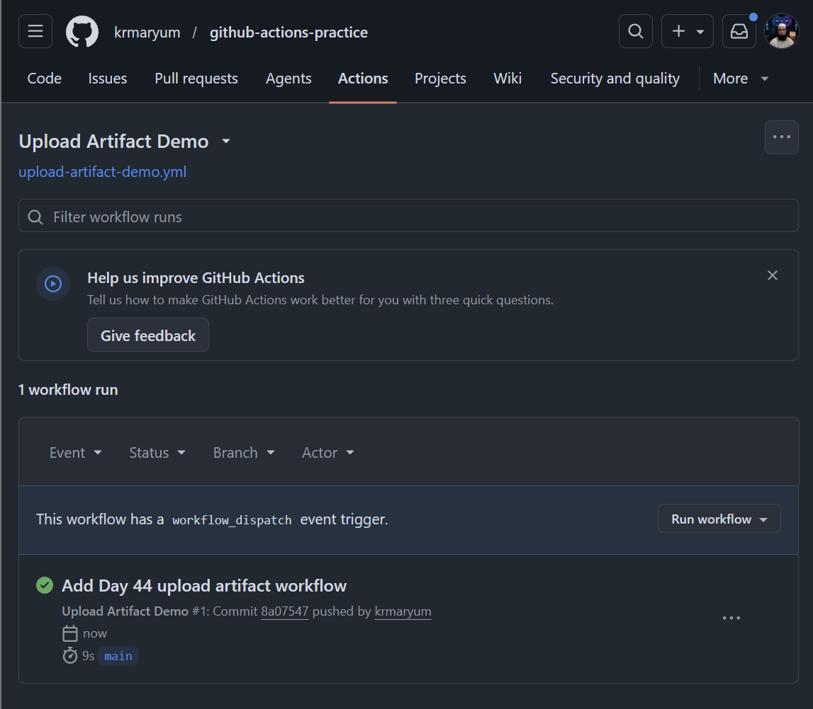

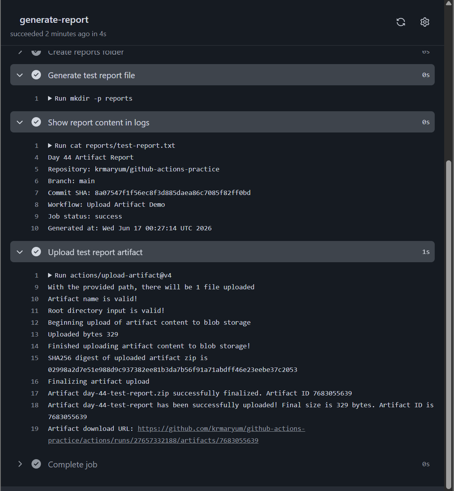

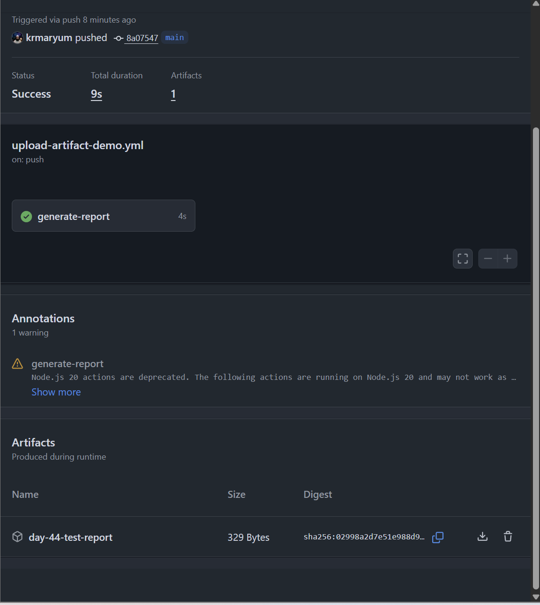

---

# Step 7: Notes for `day-44-secrets-artifacts.md`

Add this section to your main Day 44 markdown file:

## Task 3: Upload Artifacts

In this task, I learned how to generate a file during a GitHub Actions workflow and save it as an artifact.

I created a workflow called `Upload Artifact Demo`.

The workflow created a folder called `reports` and generated a file called:

`reports/test-report.txt`

The report included repository name, branch name, commit SHA, workflow name, job status, and generation time.

Then I uploaded the report using:

```yaml
uses: actions/upload-artifact@v4
```

I gave the artifact this name:

`day-44-test-report`

After the workflow completed, I went to the workflow summary page and downloaded the artifact from the Artifacts section.

When I unzipped the downloaded artifact, I was able to see the `test-report.txt` file.

### What I Learned

Artifacts are useful when we want to save files created during a CI/CD workflow.

GitHub-hosted runners are temporary machines, so any file created during the job disappears after the job ends unless we upload it as an artifact.

Artifacts are commonly used for test reports, build files, logs, coverage reports, and deployment packages.


---

# Task 3 Success Checklist

| Check | Expected Result |
|---|---|
| Workflow file created | `.github/workflows/upload-artifact-demo.yml` |
| Workflow triggered | Yes |
| Report folder created | `reports` |
| Report file generated | `reports/test-report.txt` |
| Report displayed in logs | Yes |
| Artifact uploaded | `day-44-test-report` |
| Workflow passed | Green check |
| Artifact visible in summary | Yes |
| Artifact downloaded | Yes |
| Downloaded file opened | Yes |

---

# Final Summary

## Task 3: Upload Artifacts

In this task, I learned how to generate a file inside a GitHub Actions workflow and save it as an artifact.

The workflow created a report file called:

`reports/test-report.txt`

The report included the repository name, branch name, commit SHA, workflow name, job status, and generation time.

I used the following GitHub Action to upload the file:

```yaml
uses: actions/upload-artifact@v4
```
The artifact name was:

day-44-test-report

After the workflow completed successfully, I opened the GitHub Actions Summary page and verified that the artifact was available for download.

I downloaded the artifact and verified the file content.

GitHub downloaded the artifact as a `.zip` file. After extracting it, I verified that it contained `test-report.txt` with the expected report content.

This confirmed that artifacts are useful for saving reports, logs, build files, and other outputs after the CI runner finishes.

This is an important CI/CD skill because real pipelines often generate test reports, logs, build outputs, coverage reports, and release packages.

---

# Task 4: Download Artifacts Between Jobs

## Task Title

Download Artifacts Between Jobs in GitHub Actions

---

## Task Objective

In this task, I learned how to pass a file from one GitHub Actions job to another job using artifacts.

The main goal was:

| Job | Purpose |
|---|---|
| Job 1 | Generate a file and upload it as an artifact |
| Job 2 | Download the artifact from Job 1 and use it by printing its contents |

This is an important CI/CD concept because every GitHub Actions job runs on a separate fresh runner. A file created in one job is not automatically available in another job.

To share files between jobs, we use:

```yaml
actions/upload-artifact@v4
```

and:

```yaml
actions/download-artifact@v4
```

---

# What is an Artifact?

An artifact is a file or folder created during a workflow run that can be saved and used later.

Examples of artifacts:

| Artifact Type | Example |
|---|---|
| Test report | `test-report.txt` |
| Build output | `dist/` folder |
| Logs | `app.log` |
| Coverage report | `coverage.html` |
| Release package | `.zip`, `.tar.gz`, `.jar` |

In GitHub Actions, artifacts are useful because workflow runners are temporary. When a job finishes, the runner is destroyed. If we want to keep or share a file, we must upload it as an artifact.

---

# Why Download Artifacts Between Jobs?

Each job in GitHub Actions runs separately.

For example:

```text
Job 1: Build application
↓
Upload build package as artifact
↓
Job 2: Download package
↓
Deploy application
```

Without artifacts, Job 2 cannot automatically access the files created by Job 1.

---

# Workflow File Location

Create this workflow file:

```text
.github/workflows/download-artifact-between-jobs.yml
```

---

# Complete Workflow Code

```yaml
name: Download Artifact Between Jobs

on:
  push:
    branches:
      - "**"
  workflow_dispatch:

jobs:
  generate-artifact:
    runs-on: ubuntu-latest

    steps:
      - name: Create report folder
        run: mkdir -p reports

      - name: Generate report file
        run: |
          echo "Day 44 Artifact Shared Between Jobs" > reports/shared-report.txt
          echo "Created by Job 1: generate-artifact" >> reports/shared-report.txt
          echo "Repository: $GITHUB_REPOSITORY" >> reports/shared-report.txt
          echo "Branch: $GITHUB_REF_NAME" >> reports/shared-report.txt
          echo "Commit SHA: $GITHUB_SHA" >> reports/shared-report.txt
          echo "Generated at: $(date)" >> reports/shared-report.txt

      - name: Show report before upload
        run: cat reports/shared-report.txt

      - name: Upload report artifact
        uses: actions/upload-artifact@v4
        with:
          name: shared-day-44-report
          path: reports/shared-report.txt

  download-and-use-artifact:
    runs-on: ubuntu-latest
    needs: generate-artifact

    steps:
      - name: Download artifact from Job 1
        uses: actions/download-artifact@v4
        with:
          name: shared-day-44-report
          path: downloaded-report

      - name: Show downloaded files
        run: ls -R downloaded-report

      - name: Print downloaded artifact content
        run: cat downloaded-report/shared-report.txt
```

---

# Step-by-Step Explanation

## Step 1: Workflow Name

```yaml
name: Download Artifact Between Jobs
```

This is the workflow name that appears in the GitHub Actions tab.

---

## Step 2: Workflow Triggers

```yaml
on:
  push:
    branches:
      - "**"
  workflow_dispatch:
```

This workflow runs in two ways:

| Trigger | Meaning |
|---|---|
| `push` | Runs when code is pushed to any branch |
| `workflow_dispatch` | Allows the workflow to be started manually from GitHub Actions UI |

---

# Job 1: Generate and Upload Artifact

## Job Name

```yaml
generate-artifact:
  runs-on: ubuntu-latest
```

This creates the first job called:

```text
generate-artifact
```

It runs on a GitHub-hosted Ubuntu runner.

---

## Step 1: Create Report Folder

```yaml
- name: Create report folder
  run: mkdir -p reports
```

This creates a folder called:

```text
reports
```

The `-p` option means:

```text
Create the folder if it does not exist.
Do not show an error if it already exists.
```

---

## Step 2: Generate Report File

```yaml
- name: Generate report file
  run: |
    echo "Day 44 Artifact Shared Between Jobs" > reports/shared-report.txt
    echo "Created by Job 1: generate-artifact" >> reports/shared-report.txt
    echo "Repository: $GITHUB_REPOSITORY" >> reports/shared-report.txt
    echo "Branch: $GITHUB_REF_NAME" >> reports/shared-report.txt
    echo "Commit SHA: $GITHUB_SHA" >> reports/shared-report.txt
    echo "Generated at: $(date)" >> reports/shared-report.txt
```

This creates the file:

```text
reports/shared-report.txt
```

Important symbols:

| Symbol | Meaning |
|---|---|
| `>` | Create or overwrite a file |
| `>>` | Append more content to the file |

The report includes:

| Line | Meaning |
|---|---|
| Day 44 Artifact Shared Between Jobs | Report title |
| Created by Job 1 | Shows which job created the file |
| Repository | Shows the GitHub repository |
| Branch | Shows the branch name |
| Commit SHA | Shows the commit ID |
| Generated at | Shows the date and time |

---

## Step 3: Show Report Before Upload

```yaml
- name: Show report before upload
  run: cat reports/shared-report.txt
```

This prints the file content in the logs before uploading it.

This helps verify that Job 1 created the file correctly.

---

## Step 4: Upload Report Artifact

```yaml
- name: Upload report artifact
  uses: actions/upload-artifact@v4
  with:
    name: shared-day-44-report
    path: reports/shared-report.txt
```

This uploads the file as an artifact.

| Field | Meaning |
|---|---|
| `uses: actions/upload-artifact@v4` | Uses GitHub's artifact upload action |
| `name: shared-day-44-report` | Name of the artifact |
| `path: reports/shared-report.txt` | File to upload |

---

# Job 2: Download and Use Artifact

## Job Name

```yaml
download-and-use-artifact:
  runs-on: ubuntu-latest
  needs: generate-artifact
```

This creates the second job called:

```text
download-and-use-artifact
```

The important line is:

```yaml
needs: generate-artifact
```

This means Job 2 will wait until Job 1 finishes successfully.

Without `needs`, both jobs may run at the same time. If Job 2 starts too early, it may try to download an artifact that does not exist yet.

---

## Step 1: Download Artifact from Job 1

```yaml
- name: Download artifact from Job 1
  uses: actions/download-artifact@v4
  with:
    name: shared-day-44-report
    path: downloaded-report
```

This downloads the artifact created in Job 1.

| Field | Meaning |
|---|---|
| `uses: actions/download-artifact@v4` | Uses GitHub's artifact download action |
| `name: shared-day-44-report` | Artifact to download |
| `path: downloaded-report` | Folder where the artifact will be downloaded |

After this step, the file should be available here:

```text
downloaded-report/shared-report.txt
```

---

## Step 2: Show Downloaded Files

```yaml
- name: Show downloaded files
  run: ls -R downloaded-report
```

This lists the downloaded folder and confirms that the artifact file exists.

Expected output:

```text
downloaded-report:
shared-report.txt
```

---

## Step 3: Print Downloaded Artifact Content

```yaml
- name: Print downloaded artifact content
  run: cat downloaded-report/shared-report.txt
```

This prints the downloaded file content.

This proves that Job 2 successfully received and used the file created by Job 1.

---

# Commands to Add, Commit, and Push

Run these commands from the root of the repository:

```bash
git status
```

```bash
git add .github/workflows/download-artifact-between-jobs.yml
```

```bash
git commit -m "Add Day 44 download artifact between jobs workflow"
```

```bash
git push
```

---

# Verification Steps in GitHub

Go to your repository:

```text
github-actions-practice
```

Then open:

```text
Actions
→ Download Artifact Between Jobs
→ Latest workflow run
```

You should see two jobs:

```text
generate-artifact
download-and-use-artifact
```

The second job should run after the first job.

Open the second job and check this step:

```text
Print downloaded artifact content
```

Expected output:

```text
Day 44 Artifact Shared Between Jobs
Created by Job 1: generate-artifact
Repository: krmaryum/github-actions-practice
Branch: main
Commit SHA: ...
Generated at: ...
```

---

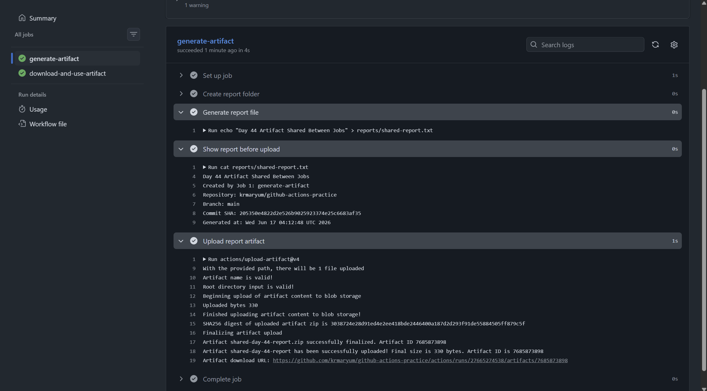


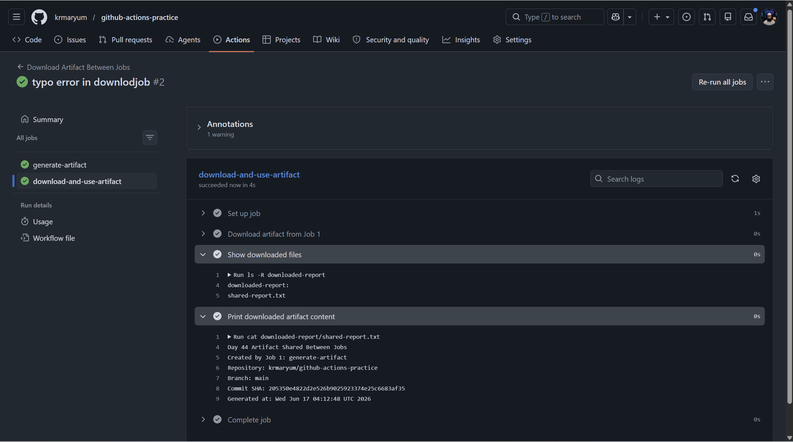

---

# Important Concept

Artifacts can move files between jobs.

Each GitHub Actions job runs on a separate runner. Files created in one job are not automatically available in another job.

That is why we use:

```yaml
actions/upload-artifact@v4
```

in Job 1, and:

```yaml
actions/download-artifact@v4
```

in Job 2.

---

# Real Pipeline Use Cases

Artifacts are used in real pipelines when one job creates files that another job needs.

Examples:

| Real Pipeline Stage | Artifact Example |
|---|---|
| Build job | Application package |
| Test job | Test report |
| Security scan job | Scan report |
| Coverage job | Coverage report |
| Deploy job | Download build package |
| Release job | ZIP or TAR file |

---

# Notes Answer: When Would You Use Artifacts in a Real Pipeline?

```markdown
## When would I use artifacts in a real pipeline?

I would use artifacts in a real pipeline when one job creates files that another job needs.

For example, a build job may create an application package, and a deploy job may download that package and deploy it.

Artifacts are also useful for sharing test reports, logs, coverage reports, compiled files, release packages, and security scan reports between jobs.

Because each GitHub Actions job runs on a separate runner, files from one job are not automatically available in another job.

Artifacts solve this problem by saving files from one job and making them available to another job.
```

---

## Summary

In this task, I learned how to share files between two GitHub Actions jobs using artifacts.

Job 1 generated a report file called:

`reports/shared-report.txt`

Then Job 1 uploaded the file as an artifact named:

`shared-day-44-report`

Job 2 used:

`needs: generate-artifact`

This made Job 2 wait for Job 1 to finish successfully.

Then Job 2 downloaded the artifact using:

`actions/download-artifact@v4`

The artifact was downloaded into:

`downloaded-report`

Finally, Job 2 printed the artifact content using:

`cat downloaded-report/shared-report.txt`

This confirmed that the artifact was successfully passed from Job 1 to Job 2.

### When would I use artifacts in a real pipeline?

I would use artifacts in a real pipeline when one job creates files that another job needs.

For example, a build job may create an application package, and a deploy job may download that package and deploy it.

Artifacts are also useful for sharing test reports, logs, coverage reports, compiled files, release packages, and security scan reports between jobs.

Because each GitHub Actions job runs on a separate runner, files from one job are not automatically available in another job. Artifacts solve this problem by saving files from one job and making them available to another job.

---

# Task 4 Success Checklist

| Check | Expected Result |
|---|---|
| Workflow file created | `.github/workflows/download-artifact-between-jobs.yml` |
| Job 1 created report | `reports/shared-report.txt` |
| Job 1 uploaded artifact | `shared-day-44-report` |
| Job 2 waited for Job 1 | `needs: generate-artifact` |
| Job 2 downloaded artifact | `actions/download-artifact@v4` |
| Job 2 printed file content | Yes |
| Workflow status | Green / success |
| Notes updated | Yes |

---

# Task 5: Run Real Tests in CI

## Task Title

Run Real Tests in CI using GitHub Actions

---

## Task Objective

In this task, I learned how to run a real shell script inside GitHub Actions.

The goal was to take a script from earlier practice and run it automatically in CI.

The workflow should:

| Requirement | Meaning |
|---|---|
| Add a script to the repo | Store a real shell script in the repository |
| Checkout the code | Download repository files into the GitHub runner |
| Install dependencies if needed | Prepare anything required by the script |
| Run the script | Execute the script in CI |
| Fail on error | Pipeline fails if script exits with a non-zero exit code |
| Break intentionally | Verify the pipeline turns red |
| Fix again | Verify the pipeline turns green |

---

# Script Used for This Task

For this task, I used a shell script called:

```text
system-health-check.sh
```

In the repository, I placed it here:

```text
scripts/system-health-check.sh
```

This script checks basic Linux system health information and verifies that required commands are installed.

---

# What the Script Does

The script checks:

| Check | Purpose |
|---|---|
| `hostname` | Shows the runner hostname |
| `whoami` | Shows the current user |
| `pwd` | Shows the current working directory |
| `uname -a` | Shows operating system information |
| `df -h` | Shows disk usage |
| Required commands | Verifies important commands are installed |

The required commands are:

```text
bash
git
pwd
hostname
df
```

If any required command is missing, the script prints an error and exits with:

```bash
exit 1
```

That is important because GitHub Actions marks a workflow as failed when a command exits with a non-zero exit code.

---

# Complete Script

Create this file:

```text
scripts/system-health-check.sh
```

Add this script:

```bash
#!/bin/bash

# ==========================================================
# Script Title : Simple System Health Check
# Description  : This script checks basic Linux system info
#                and verifies required commands are installed.
# Author       : Khalid Khan
# ==========================================================

echo "===================================="
echo " Simple System Health Check Started "
echo "===================================="

echo
echo "Checking hostname..."
hostname

echo
echo "Checking current user..."
whoami

echo
echo "Checking current directory..."
pwd

echo
echo "Checking operating system..."
uname -a

echo
echo "Checking disk usage..."
df -h

echo
echo "Checking required commands..."

required_commands=("bash" "git" "pwd" "hostname" "df")

for command in "${required_commands[@]}"
do
  if command -v "$command" >/dev/null 2>&1; then
    echo "$command is installed"
  else
    echo "Error: $command is not installed" >&2
    exit 1
  fi
done

echo
echo "All required commands are available."
echo "System health check completed successfully."
```

[script explanation](md/day-44-task5-required-commands-study-notes.md)


---

# Step 1: Add the Script to the Repository

Go to the repository:

```bash
cd github-actions-practice
```

Create a `scripts` folder:

```bash
mkdir -p scripts
```

Create the script file:

```bash
nano scripts/system-health-check.sh
```

Paste the script content into the file.

Save and exit.

---

# Step 2: Make the Script Executable

Run:

```bash
chmod +x scripts/system-health-check.sh
```

This gives execute permission to the script.

Without execute permission, the script may not run using:

```bash
./scripts/system-health-check.sh
```

---

# Step 3: Test the Script Locally

Run:

```bash
./scripts/system-health-check.sh
```

Expected result:

```text
All required commands are available.
System health check completed successfully.
```

If the script runs successfully on the local machine, it is ready for CI.

---

# Workflow File Location

Create this workflow file:

```text
.github/workflows/real-tests.yml
```

---

# Complete Workflow Code

```yaml
name: Real Tests in CI

on:
  push:
    branches:
      - "**"
  workflow_dispatch:

jobs:
  run-shell-script-test:
    runs-on: ubuntu-latest

    steps:
      - name: Checkout repository
        uses: actions/checkout@v4

      - name: Show repository files
        run: ls -R

      - name: Make script executable
        run: chmod +x scripts/system-health-check.sh

      - name: Run system health check script
        run: ./scripts/system-health-check.sh
```

---

# Step-by-Step Workflow Explanation

## Workflow Name

```yaml
name: Real Tests in CI
```

This is the workflow name that appears in the GitHub Actions tab.

---

## Workflow Triggers

```yaml
on:
  push:
    branches:
      - "**"
  workflow_dispatch:
```

This workflow runs in two ways:

| Trigger | Meaning |
|---|---|
| `push` | Runs when code is pushed to any branch |
| `workflow_dispatch` | Allows manual run from the GitHub Actions UI |

---

## Job Name

```yaml
run-shell-script-test:
  runs-on: ubuntu-latest
```

This creates a job called:

```text
run-shell-script-test
```

It runs on a GitHub-hosted Ubuntu runner.

---

## Step 1: Checkout Repository

```yaml
- name: Checkout repository
  uses: actions/checkout@v4
```

This downloads the repository files into the GitHub Actions runner.

This step is very important because without checkout, the runner will not have access to the script in the repository.

---

## Step 2: Show Repository Files

```yaml
- name: Show repository files
  run: ls -R
```

This lists the files in the runner.

It helps confirm that the script exists at:

```text
scripts/system-health-check.sh
```

---

## Step 3: Make Script Executable

```yaml
- name: Make script executable
  run: chmod +x scripts/system-health-check.sh
```

This gives execute permission to the shell script inside the CI runner.

---

## Step 4: Run the Script

```yaml
- name: Run system health check script
  run: ./scripts/system-health-check.sh
```

This runs the real shell script in CI.

If the script succeeds, the pipeline turns green.

If the script exits with a non-zero code, the pipeline turns red.

---

# Commands to Add, Commit, and Push

Run these commands from the root of the repository:

```bash
git status
```

```bash
git add scripts/system-health-check.sh .github/workflows/real-tests.yml
```

```bash
git commit -m "Add Day 44 real tests workflow"
```

```bash
git push
```

---

# Step 4: Verify the Green Pipeline

Go to GitHub:

```text
github-actions-practice
→ Actions
→ Real Tests in CI
→ Latest workflow run
```

Open the job:

```text
run-shell-script-test
```

Expected output:

```text
All required commands are available.
System health check completed successfully.
```

The workflow should pass with a green check.

---

# Step 5: Intentionally Break the Script

Now break the script on purpose to verify that CI catches the error.

Open:

```text
scripts/system-health-check.sh
```

Find this line:

```bash
required_commands=("bash" "git" "pwd" "hostname" "df")
```

Change it to:

```bash
required_commands=("bash" "git" "pwd" "hostname" "df" "fakecommand123")
```

The command `fakecommand123` does not exist, so the script should fail.

---

# Step 6: Commit and Push the Broken Script

Run:

```bash
git add scripts/system-health-check.sh
```

```bash
git commit -m "Break Day 44 real test intentionally"
```

```bash
git push
```

---

# Step 7: Verify the Red Pipeline

Go to GitHub Actions again:

```text
Actions
→ Real Tests in CI
→ Latest workflow run
```

Expected output:

```text
Error: fakecommand123 is not installed
```

The workflow should fail and show a red X.

This proves that the CI pipeline can detect problems in the script.

---

# Step 8: Fix the Script

Open:

```text
scripts/system-health-check.sh
```

Change this:

```bash
required_commands=("bash" "git" "pwd" "hostname" "df" "fakecommand123")
```

Back to this:

```bash
required_commands=("bash" "git" "pwd" "hostname" "df")
```

---

# Step 9: Commit and Push the Fix

Run:

```bash
git add scripts/system-health-check.sh
```

```bash
git commit -m "Fix Day 44 real test workflow"
```

```bash
git push
```

---

# Step 10: Verify the Green Pipeline Again

Go back to:

```text
Actions
→ Real Tests in CI
→ Latest workflow run
```

Expected output:

```text
All required commands are available.
System health check completed successfully.
```

The workflow should pass again and show a green check.

---

# Important Concept: Exit Codes

GitHub Actions uses exit codes to decide if a step passed or failed.

| Exit Code | Meaning |
|---|---|
| `0` | Success |
| Non-zero, such as `1` | Failure |

In the script, this line is very important:

```bash
exit 1
```

It tells GitHub Actions:

```text
Something failed. Mark the step and workflow as failed.
```

This is how CI/CD pipelines catch errors automatically.

---

# Screenshots to Add to Notes

Take screenshots of:

| Screenshot | What to Capture |
|---|---|
| First green run | Script passed successfully |
| Red run | Script failed after adding fake command |
| Error log | `fakecommand123 is not installed` |
| Final green run | Script passed again after fix |

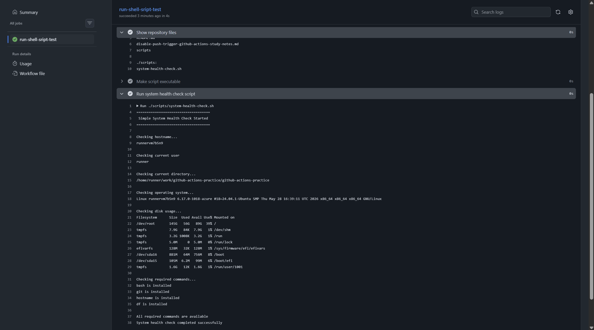

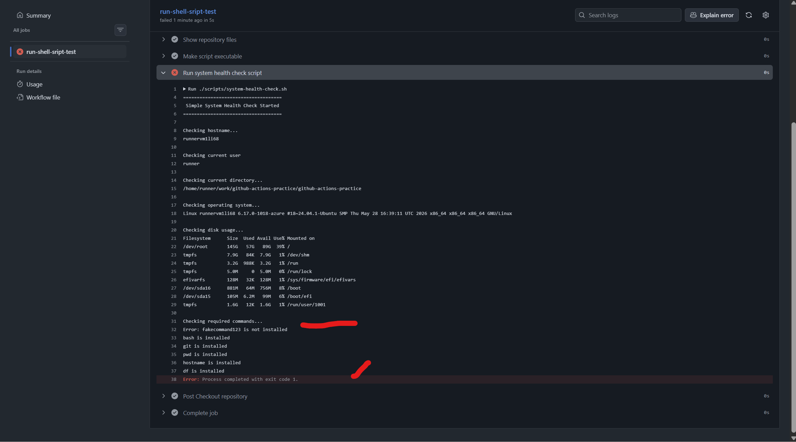

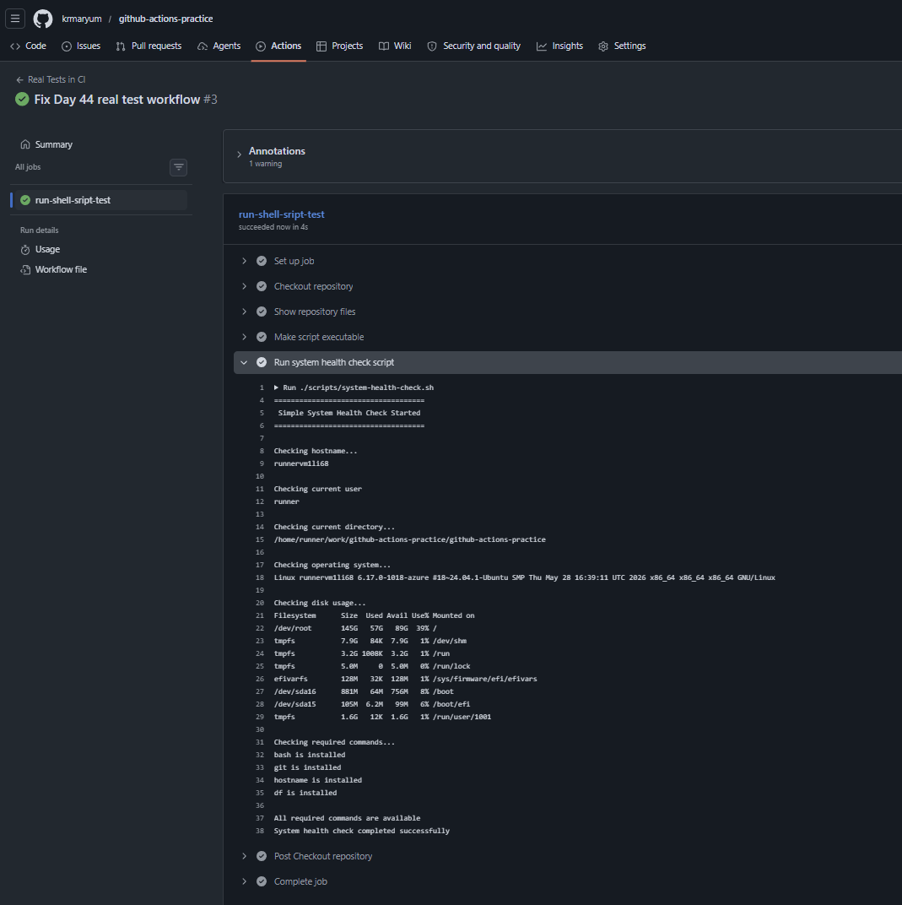


---

# Final Summary

In this task, I learned how to run a real shell script inside GitHub Actions.

I used a script called:

```text
scripts/system-health-check.sh
```

The script checks basic Linux system information such as hostname, current user, current directory, operating system, and disk usage.

It also verifies that required commands are installed:

```text
bash
git
pwd
hostname
df
```

If any command is missing, the script prints an error message and exits with:

```bash
exit 1
```

This causes the GitHub Actions pipeline to fail.

I created a workflow called:

```text
.github/workflows/real-tests.yml
```

The workflow checked out the repository, made the script executable, and ran the script.

First, the pipeline passed successfully.

Then I intentionally broke the script by adding a fake command:

```text
fakecommand123
```

The pipeline failed and turned red.

After that, I removed the fake command and pushed again.

The pipeline passed and turned green.


---

# What I Learned

Real CI pipelines should run actual scripts or tests, not only print messages.

A pipeline passes when the script exits with code `0`.

A pipeline fails when the script exits with a non-zero code such as `1`.

This is important because CI helps catch errors automatically before code is merged or deployed.

---

# Task 5 Success Checklist

| Check | Expected Result |
|---|---|
| Script added | `scripts/system-health-check.sh` |
| Workflow added | `.github/workflows/real-tests.yml` |
| Checkout step used | Yes |
| Script made executable | Yes |
| Script ran in CI | Yes |
| First run | Green |
| Fake command added | Pipeline red |
| Fake command removed | Pipeline green again |
| Notes updated | Yes |

---

# Task 6: Caching

## Task Title

Caching Dependencies in GitHub Actions

---

## Task Objective

In this task, I learned how to use **GitHub Actions cache** to save downloaded dependencies so future workflow runs become faster.

The goal was to:

| Step | Purpose |
|---|---|
| Create a dependency file | Add a file like `requirements.txt` |
| Install dependencies | Install Python packages in CI |
| Add cache | Cache downloaded packages |
| Run workflow twice | First run creates cache, second run uses cache |
| Compare time | Observe the dependency installation time difference |
| Write notes | Explain what is cached and where it is stored |

---

# What is Caching?

Caching means saving files from one workflow run so they can be reused in future workflow runs.

Example:

```text
First run:
Install packages from internet
↓
Save packages in cache

Second run:
Restore packages from cache
↓
Install faster
```

In CI/CD, caching helps reduce repeated downloads and makes pipelines faster.

---

# Why Do We Use Cache?

Without cache, every workflow run downloads dependencies again.

With cache, GitHub Actions can reuse previously downloaded dependencies.

Caching is useful for:

| Tool | Cache Example |
|---|---|
| Python | pip packages |
| Node.js | npm packages |
| Maven | Java dependencies |
| Gradle | Gradle cache |
| Docker | Build layers |
| Terraform | Plugin cache |

For this task, I used a simple **Python pip cache**.

---

# What We Will Create

Create this file in the root of the repository:

```text
requirements.txt
```

Create this workflow file:

```text
.github/workflows/cache-demo.yml
```

---

# Step 1: Create `requirements.txt`

In the root of the repo, create:

```text
requirements.txt
```

Add this content:

```text
requests==2.32.3
pytest==8.3.4
```

These are Python dependencies.

| Package | Purpose |
|---|---|
| `requests` | Python package used for HTTP requests |
| `pytest` | Python testing framework |

---

# Step 2: Create Cache Workflow

Create this file:

```text
.github/workflows/cache-demo.yml
```

Add this workflow:

```yaml
name: Cache Demo

on:
  push:
    branches:
      - "**"
  workflow_dispatch:

jobs:
  python-cache-test:
    runs-on: ubuntu-latest

    steps:
      - name: Checkout repository
        uses: actions/checkout@v4

      - name: Set up Python
        uses: actions/setup-python@v5
        with:
          python-version: "3.12"

      - name: Cache pip dependencies
        uses: actions/cache@v4
        with:
          path: ~/.cache/pip
          key: pip-cache-${{ runner.os }}-${{ hashFiles('requirements.txt') }}
          restore-keys: |
            pip-cache-${{ runner.os }}-

      - name: Install dependencies
        run: |
          python -m pip install --upgrade pip
          pip install -r requirements.txt

      - name: Verify installed packages
        run: |
          python -c "import requests; print('requests installed successfully')"
          pytest --version
```

---

# Step-by-Step Workflow Explanation

## Workflow Name

```yaml
name: Cache Demo
```

This is the workflow name that appears in the GitHub Actions tab.

## Workflow Triggers

```yaml
on:
  push:
    branches:
      - "**"
  workflow_dispatch:
```

| Trigger | Meaning |
|---|---|
| `push` | Runs when code is pushed to any branch |
| `workflow_dispatch` | Allows manual run from GitHub Actions UI |

## Job Name

```yaml
python-cache-test:
  runs-on: ubuntu-latest
```

This creates one job called `python-cache-test`.

## Checkout Repository

```yaml
- name: Checkout repository
  uses: actions/checkout@v4
```

This downloads the repository files into the GitHub Actions runner.

## Set Up Python

```yaml
- name: Set up Python
  uses: actions/setup-python@v5
  with:
    python-version: "3.12"
```

This installs and configures Python 3.12 on the GitHub-hosted runner.

## Cache pip Dependencies

```yaml
- name: Cache pip dependencies
  uses: actions/cache@v4
  with:
    path: ~/.cache/pip
    key: pip-cache-${{ runner.os }}-${{ hashFiles('requirements.txt') }}
    restore-keys: |
      pip-cache-${{ runner.os }}-
```

This is the main cache step.

It uses:

```yaml
uses: actions/cache@v4
```

---

# Understanding the Cache Step

## `path`

```yaml
path: ~/.cache/pip
```

This tells GitHub Actions which folder to cache.

For Python pip, downloaded package files are stored in:

```text
~/.cache/pip
```

So this workflow caches that folder.

---

## `key`

```yaml
key: pip-cache-${{ runner.os }}-${{ hashFiles('requirements.txt') }}
```

The `key` is the unique name of the cache.

It includes:

| Part | Meaning |
|---|---|
| `pip-cache` | Custom cache name |
| `${{ runner.os }}` | Operating system, such as Linux |
| `${{ hashFiles('requirements.txt') }}` | Hash of the dependency file |

If `requirements.txt` changes, the hash changes. That creates a new cache.

This is useful because if dependencies change, GitHub Actions should not use an old cache only.

---

## `restore-keys`

```yaml
restore-keys: |
  pip-cache-${{ runner.os }}-
```

This is a fallback key.

If GitHub Actions cannot find the exact cache key, it tries to find another cache that starts with:

```text
pip-cache-Linux-
```

This can still speed up dependency installation even when the exact cache key is different.

---

# Install Dependencies

```yaml
- name: Install dependencies
  run: |
    python -m pip install --upgrade pip
    pip install -r requirements.txt
```

This installs the Python packages listed in `requirements.txt`.

On the first run, packages are downloaded normally.

On the second run, pip can reuse the cached package files.

---

# Verify Installed Packages

```yaml
- name: Verify installed packages
  run: |
    python -c "import requests; print('requests installed successfully')"
    pytest --version
```

Expected output:

```text
requests installed successfully
pytest 8.3.4
```

---

# Commands to Add, Commit, and Push

Run these commands from the root of the repository:

```bash
git status
```

```bash
git add requirements.txt .github/workflows/cache-demo.yml
```

```bash
git commit -m "Add Day 44 caching workflow"
```

```bash
git push
```

---

# First Workflow Run

Go to GitHub:

```text
github-actions-practice
→ Actions
→ Cache Demo
→ Latest workflow run
```

Open the job:

```text
python-cache-test
```

In the cache step, the first run may show:

```text
Cache not found for input keys
```

This is normal because it is the first run and there is no existing cache yet.

After the job completes successfully, GitHub saves the cache.

---

# Second Workflow Run

Run the workflow again.

You can do this by:

```text
Actions
→ Cache Demo
→ Run workflow
```

or by pushing another commit.

## How to Trigger GitHub Actions Again Using a Fake Commit

Sometimes we need to run a GitHub Actions workflow again without changing any file.

For example, in Task 6 caching practice, we need to run the workflow more than once so we can observe the cache behavior.

A simple way to trigger the workflow again is by creating an empty commit.

### Command

```bash
git commit --allow-empty -m "Trigger CI workflow"
git push
```

On the second run, the cache step should show something like:

```text
Cache restored successfully
```

or:

```text
Cache hit occurred
```

That means GitHub found and reused the cache.

---

# Observe the Time Difference

Compare the time for this step in both runs:

```text
Install dependencies
```

Expected behavior:

| Run | Result |
|---|---|
| First run | Slower because dependencies are downloaded |
| Second run | Faster because packages are restored from cache |

For small packages like `requests` and `pytest`, the time difference may be small. That is okay.

The important thing is to observe the cache restore message.

---

# What is Being Cached?

The workflow caches the pip dependency folder:

```text
~/.cache/pip
```

This folder stores downloaded Python package files used by pip.

So, instead of downloading packages again from the internet every time, pip can reuse cached package files.

---

# Where is the Cache Stored?

During the workflow run, the cache folder is located on the runner at:

```text
~/.cache/pip
```

After the workflow finishes, GitHub saves that cache in **GitHub Actions cache storage**.

Future workflow runs can restore the cache using the cache key.

---

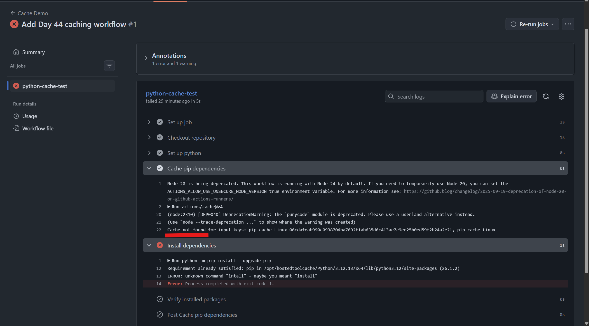

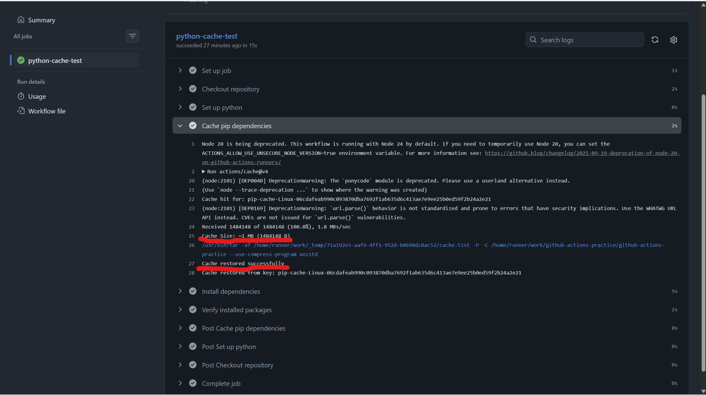

---

# Notes Answer: What is Being Cached and Where is it Stored?

```markdown
## What is being cached and where is it stored?

In this task, the pip dependency cache is being cached.

The cached path is:

`~/.cache/pip`

This folder contains downloaded Python package files used by pip.

During the workflow run, this cache exists on the GitHub-hosted runner.

After the workflow finishes, GitHub stores the cache in GitHub Actions cache storage.

On future workflow runs, GitHub restores this cache using the cache key:

`pip-cache-${{ runner.os }}-${{ hashFiles('requirements.txt') }}`

This helps avoid downloading the same dependencies again and can make the workflow faster.
```

---

# Final Summary

In this task, I learned how to use caching in GitHub Actions.

I created a `requirements.txt` file with Python dependencies:

```text
requests==2.32.3
pytest==8.3.4
```

Then I created a workflow called:

```text
.github/workflows/cache-demo.yml
```

The workflow used:

```yaml
actions/cache@v4
```

The cached folder was:

```text
~/.cache/pip
```

On the first run, GitHub Actions did not find a cache, so it installed dependencies normally and saved the cache after the job completed.

On the second run, GitHub Actions restored the cache and reused the downloaded dependencies.

This showed me how caching can make CI workflows faster, especially for projects with many dependencies.

---

# What I Learned

Caching helps avoid downloading the same dependencies again and again.

The first run usually creates the cache.

The second run can restore and reuse the cache.

Cache keys are important because they control when GitHub should reuse an old cache or create a new one.

If `requirements.txt` changes, the cache key changes because of:

```yaml
hashFiles('requirements.txt')
```

This helps keep the cache correct and updated.

---

# Task 6 Success Checklist

| Check | Expected Result |
|---|---|
| `requirements.txt` created | Yes |
| Cache workflow created | `.github/workflows/cache-demo.yml` |
| `actions/cache@v4` used | Yes |
| Cache path used | `~/.cache/pip` |
| First run | Cache not found or cache saved |
| Second run | Cache restored or cache hit |
| Dependencies installed | Yes |
| Workflow status | Green |
| Notes updated | Yes |
