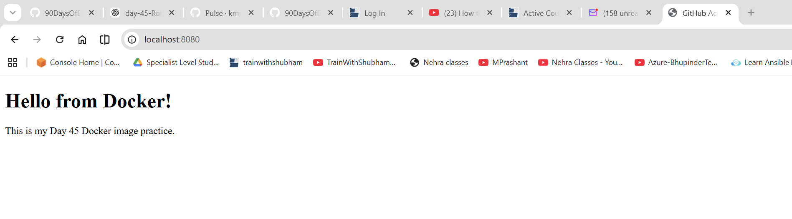
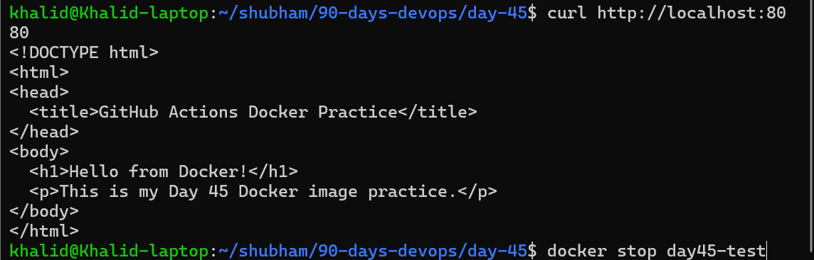
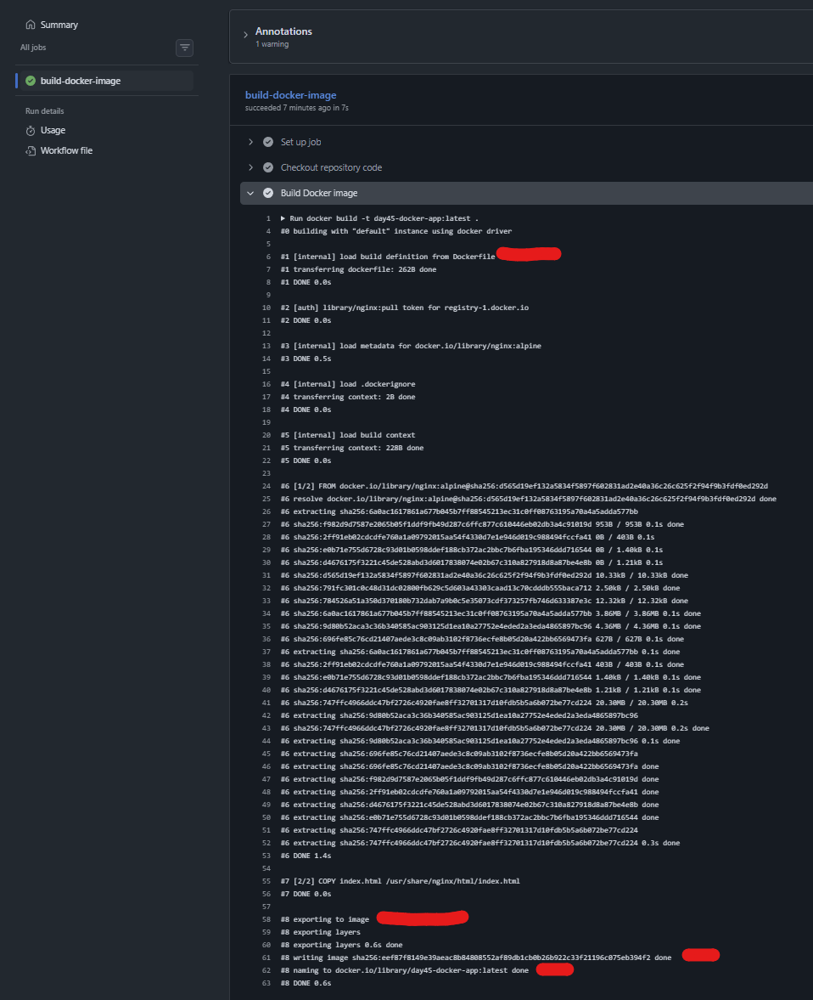
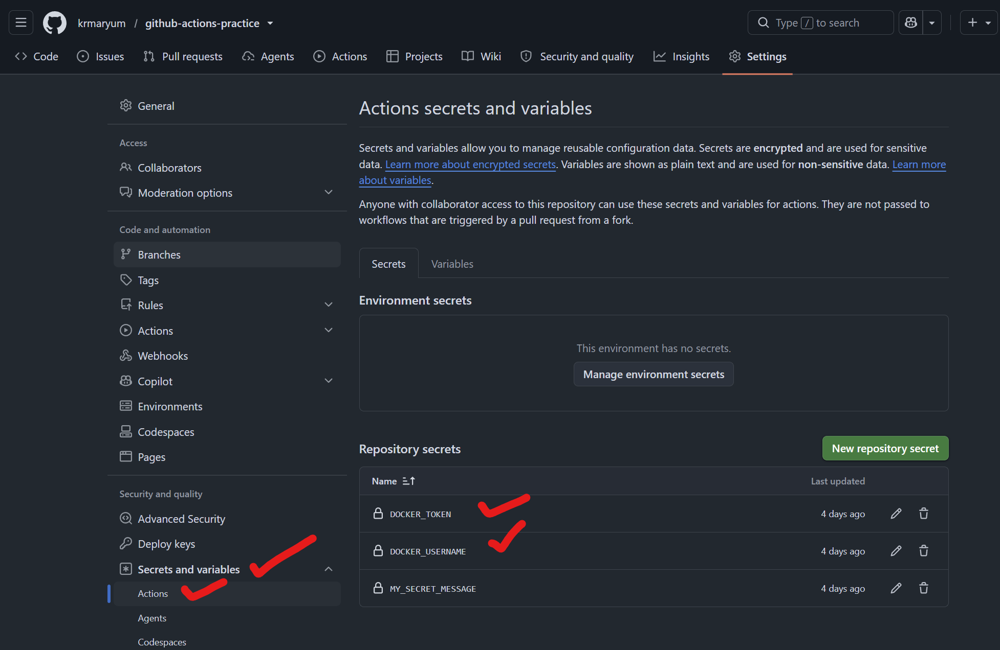
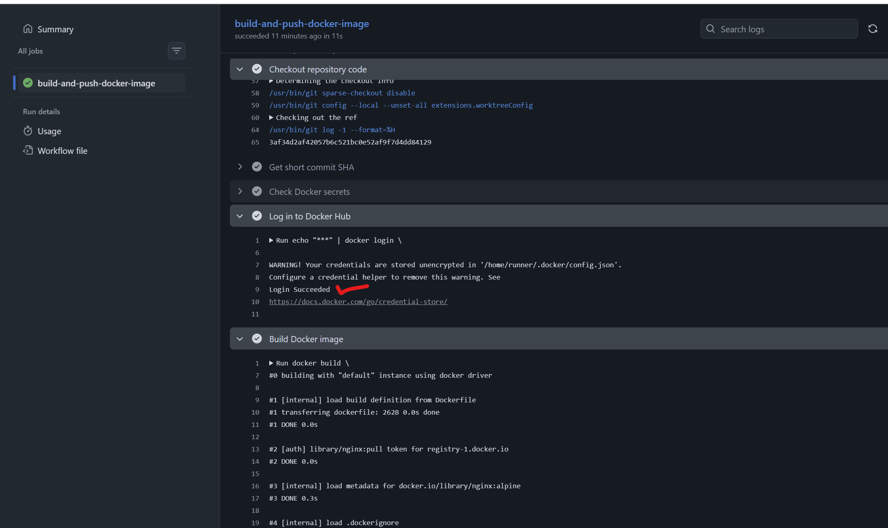
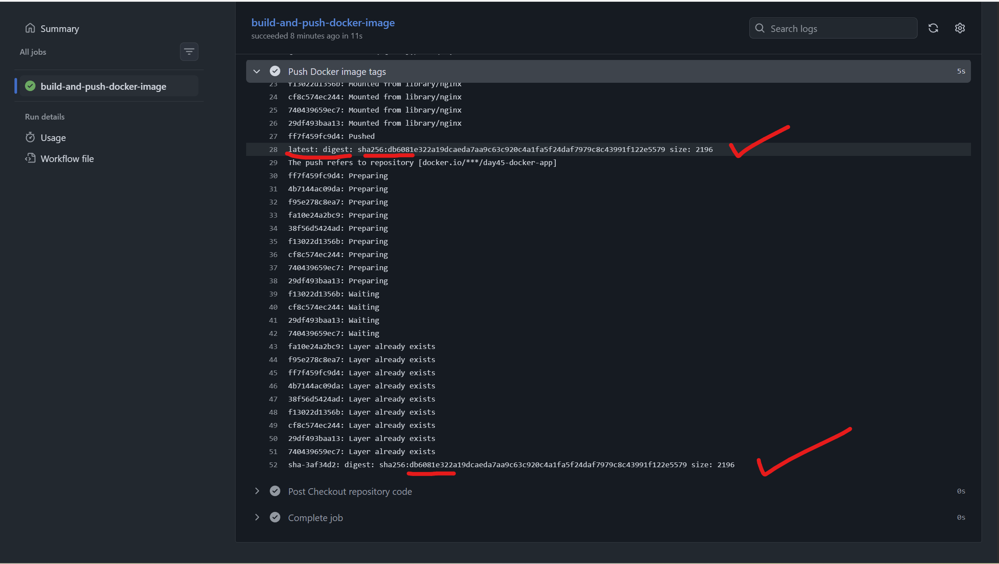
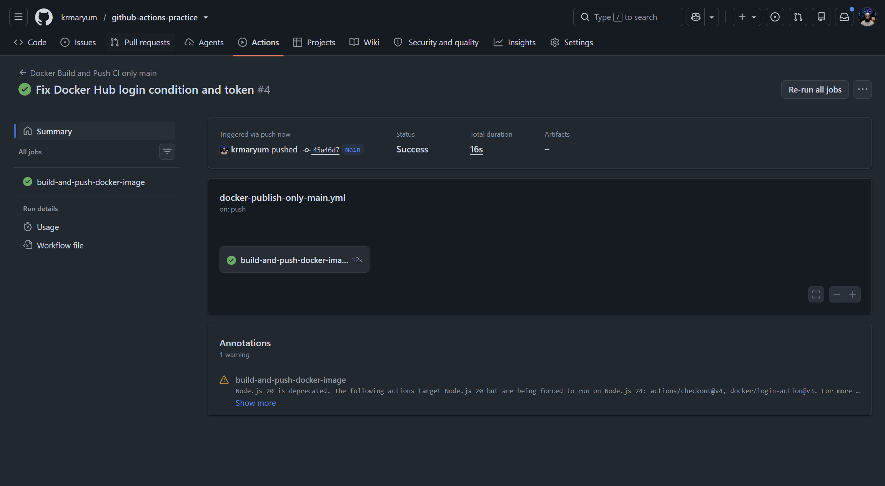
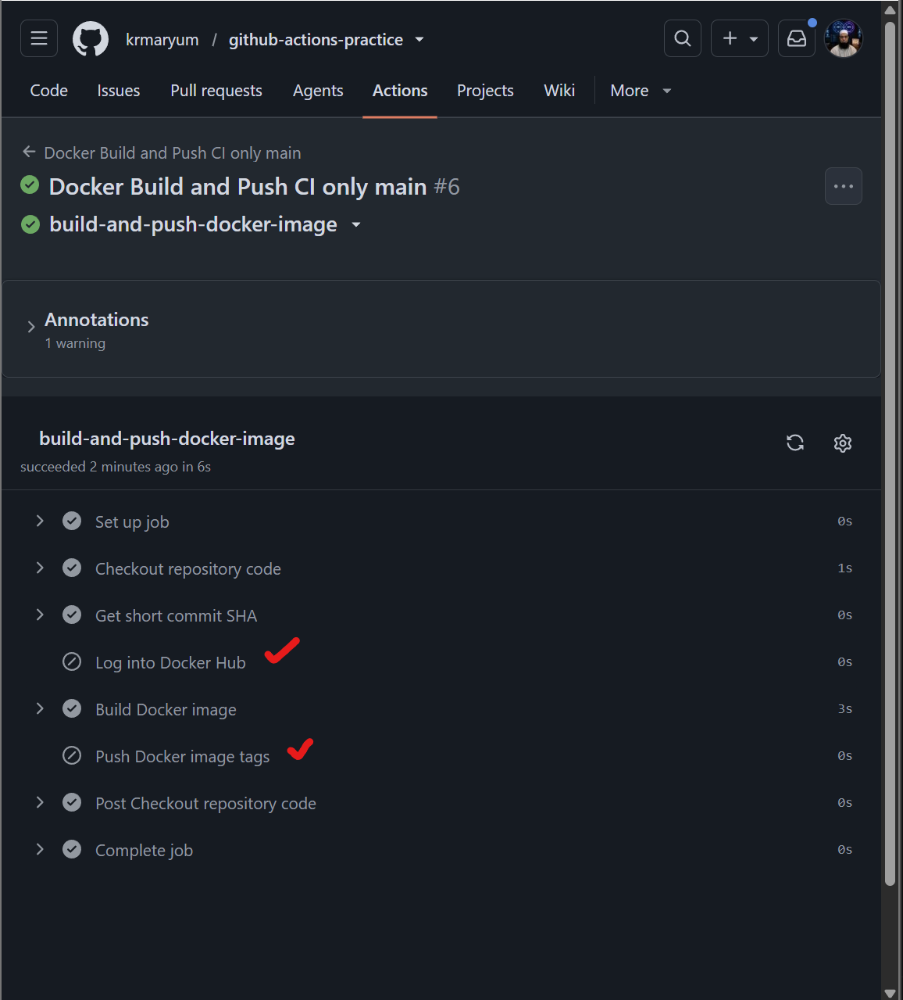
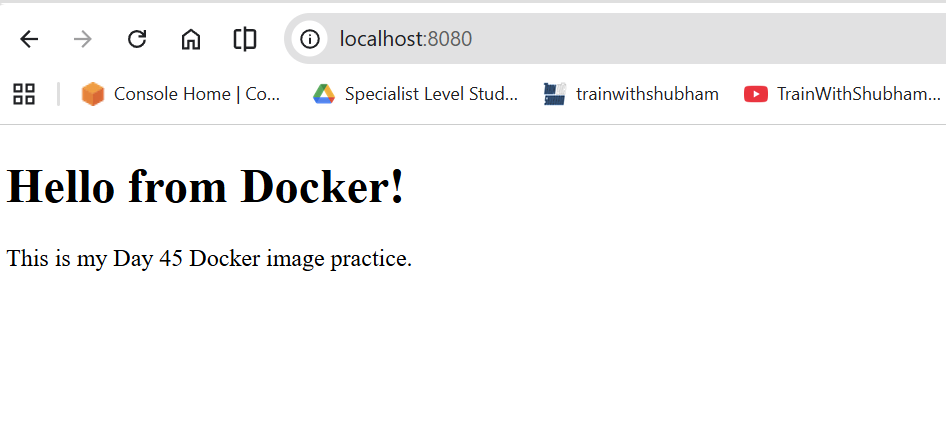

# Day 45 – Docker Build & Push in GitHub Actions  

## Table of Contents

| Task | Topic | Summary | Link |
|---|---|---|---|
| Day Overview | Docker Build & Push in GitHub Actions | Introduction to the complete CI/CD pipeline where GitHub Actions builds a Docker image and pushes it to Docker Hub. | [Go to Day Overview](#day-45-overview) |
| Task 1 | Prepare | Created a simple Docker application using `index.html` and `Dockerfile`, then tested it locally using Docker, browser, and curl. | [Go to Task 1](#task-1-prepare) |
| Task 2 | Build the Docker Image in CI | Created a GitHub Actions workflow that runs on push to `main`, checks out the code, and builds the Docker image inside CI. | [Go to Task 2](#task-2-overview) |
| Task 3 | Push to Docker Hub | Updated the workflow to log in to Docker Hub using GitHub Secrets, build the Docker image, tag it as `latest` and `sha-<short-sha>`, and push both tags. | [Go to Task 3](#task-3-push-to-docker-hub) |
| Task 4 | Only Push on Main | Added a condition so Docker images build on all branches, but Docker Hub login and push only run on the `main` branch. Tested with a feature branch. | [Go to Task 4](#task-4-only-push-on-main) |
| Task 5 | Add a Status Badge | Added a GitHub Actions status badge to `README.md` so the repository shows the Docker workflow status as green/passing. | [Go to Task 5](#task-5-add-a-status-badge) |
| Task 6 | Pull and Run It | Pulled the Docker image from Docker Hub, ran it locally as a container, tested it with browser and curl, and explained the full journey from `git push` to running container. | [Go to Task 6](#task-6-pull-and-run-it) |
| Final Journey | Git Push to Running Container | Explained the complete CI/CD flow from code commit, GitHub Actions build, Docker Hub push, Docker pull, Docker run, and final app verification. | [Go to Full Journey](#full-journey-from-git-push-to-running-container) |

## Task 1: Prepare

---

## Day 45 Overview

Today we are building a complete CI/CD pipeline.

CI/CD means:

- **CI** = Continuous Integration  
- **CD** = Continuous Delivery or Continuous Deployment  

In this Day 45 task, whenever we push code to GitHub, GitHub Actions will automatically build a Docker image and later push it to Docker Hub.

This is very similar to what happens in real production DevOps pipelines.

---

## Day 45 Main Goal

The main goal of Day 45 is:

> Code pushed to GitHub should automatically build a Docker image and push it to Docker Hub without manual steps.

---

## Day 45 Expected Output

By the end of Day 45, we should have:

| Expected Output | Meaning |
|---|---|
| `.github/workflows/docker-publish.yml` | GitHub Actions workflow file |
| Docker image on Docker Hub | Image should be pushed automatically |
| Status badge in README | Shows workflow success or failure |
| `day-45-docker-cicd.md` | Documentation file for the full journey |

---

## Day 45 Objectives

By the end of Day 45, I should understand:

| Objective | Meaning |
|---|---|
| Dockerfile | A file that contains instructions to build a Docker image |
| Docker image | A packaged version of an application |
| Docker Hub | A registry where Docker images are stored |
| GitHub Actions | Automation tool used for CI/CD |
| Docker login in pipeline | Secure login using GitHub Secrets |
| Build and push | Build an image and upload it to Docker Hub |
| Image tags | Names like `latest` or short commit SHA |
| Status badge | A badge that shows pipeline status in README |

---

# Task 1: Prepare

---

## Task 1 Overview

In Task 1, we prepare the basic application files before creating the GitHub Actions workflow.

We need a simple Docker app inside the `github-actions-practice` repository.

For this task, we can use:

- The app Dockerized on Day 36  
- Or any simple Dockerfile  

For this practice, we are using a simple Nginx-based Docker application.

---

## Task 1 Objective

The objective of Task 1 is to make sure the repository has all files required to build a Docker image.

Before GitHub Actions can build and push an image, the repository must contain:

1. A `Dockerfile`
2. An application file, such as `index.html`
3. Docker Hub secrets in GitHub

---

## Required Files

The repository should look like this:

```text
github-actions-practice/
├── Dockerfile
├── index.html
└── .github/
    └── workflows/
```

---

# File 1: index.html

Create an `index.html` file in the root of the repository.

```html
<!DOCTYPE html>
<html>
<head>
  <title>GitHub Actions Docker Practice</title>
</head>
<body>
  <h1>Hello from Docker!</h1>
  <p>This is my Day 45 Docker image practice.</p>
</body>
</html>
```

---

## Explanation of index.html

| Code | Meaning |
|---|---|
| `<!DOCTYPE html>` | Tells the browser this is an HTML document |
| `<html>` | Starts the HTML page |
| `<head>` | Contains page information |
| `<title>` | Browser tab title |
| `<body>` | Visible content of the webpage |
| `<h1>` | Main heading |
| `<p>` | Paragraph text |

---

# File 2: Dockerfile

Create a file named `Dockerfile` in the root of the repository.

```dockerfile
# Use a lightweight nginx image
FROM nginx:alpine

# Copy simple HTML file into nginx web directory
COPY index.html /usr/share/nginx/html/index.html

# Expose port 80
EXPOSE 80

# Start nginx
CMD ["nginx", "-g", "daemon off;"]
```

---

# Dockerfile Explanation

---

## Block 1

```dockerfile
FROM nginx:alpine
```

### What?

This line tells Docker to use the official Nginx Alpine image as the base image.

### Why?

We need a web server to serve our HTML file.

Nginx is a popular web server, and Alpine is a small lightweight Linux image.

### How?

Docker downloads the `nginx:alpine` image from Docker Hub and uses it as the starting point for our custom image.

---

## Block 2

```dockerfile
COPY index.html /usr/share/nginx/html/index.html
```

### What?

This line copies our local `index.html` file into the Nginx web directory inside the image.

### Why?

Nginx serves website files from this default folder:

```text
/usr/share/nginx/html/
```

If we put our `index.html` there, Nginx will show it in the browser.

### How?

Docker copies the file during the image build process.

---

## Block 3

```dockerfile
EXPOSE 80
```

### What?

This line documents that the container listens on port 80.

### Why?

Port 80 is the default HTTP web server port.

### How?

When the container runs, Nginx listens on port 80 inside the container.

Important note:

`EXPOSE 80` does not automatically publish the port to your computer.  
We still need `-p` when running the container manually.

Example:

```bash
docker run -p 8080:80 image-name
```

---

## Block 4

```dockerfile
CMD ["nginx", "-g", "daemon off;"]
```

### What?

This line starts Nginx when the container runs.

### Why?

A Docker container needs a main process to keep running.

If Nginx runs in the background, the container may stop immediately.

### How?

`daemon off;` keeps Nginx running in the foreground.

---

# Step-by-Step Practice

---

## Step 1: Go to the Repository

```bash
cd ~/github-actions-practice
```

Or on Windows Git Bash:

```bash
cd /c/Linux/github-actions-practice
```

Use your actual repository path.

---

## Step 2: Create index.html

```bash
cat > index.html <<'EOF'
<!DOCTYPE html>
<html>
<head>
  <title>GitHub Actions Docker Practice</title>
</head>
<body>
  <h1>Hello from Docker!</h1>
  <p>This is my Day 45 Docker image practice.</p>
</body>
</html>
EOF
```

---

## Step 3: Create Dockerfile

```bash
cat > Dockerfile <<'EOF'
# Use a lightweight nginx image
FROM nginx:alpine

# Copy simple HTML file into nginx web directory
COPY index.html /usr/share/nginx/html/index.html

# Expose port 80
EXPOSE 80

# Start nginx
CMD ["nginx", "-g", "daemon off;"]
EOF
```

---

## Step 4: Check Files

```bash
ls -al
```

Expected files:

```text
Dockerfile
index.html
```

---

# Optional Local Docker Test

This step is optional.

Run it only if Docker is installed and running on your machine.

---

## Step 1: Build Docker Image

```bash
docker build -t day-45-docker-test .
```

### Explanation

| Part | Meaning |
|---|---|
| `docker build` | Builds a Docker image |
| `-t day-45-docker-test` | Gives the image a name |
| `.` | Uses the current directory as build context |

---

## Step 2: Run Container

```bash
docker run -d -p 8080:80 --name day45-test day-45-docker-test
```

### Explanation

| Part | Meaning |
|---|---|
| `docker run` | Runs a container |
| `-d` | Detached mode, runs in background |
| `-p 8080:80` | Maps local port 8080 to container port 80 |
| `--name day45-test` | Gives the container a name |
| `day-45-docker-test` | Image name |

---

## Step 3: Open in Browser

Open:

```text
http://localhost:8080
```




---

## Step 4: Test with curl

```bash
curl http://localhost:8080
```



---

## Step 5: Stop and Remove Container

```bash
docker stop day45-test
docker rm day45-test
```

---

# GitHub Secrets Check

Before creating the Docker workflow, make sure Docker Hub secrets are available in GitHub.

Go to:

```text
GitHub Repository
→ Settings
→ Secrets and variables
→ Actions
→ Repository secrets
```

Make sure these secrets exist:

```text
DOCKER_USERNAME
DOCKER_TOKEN
```

---

## Meaning of Secrets

| Secret | Meaning |
|---|---|
| `DOCKER_USERNAME` | Docker Hub username |
| `DOCKER_TOKEN` | Docker Hub access token or password |

---

## Why We Use Secrets

We should never write private credentials directly inside workflow YAML files.

Wrong way:

```yaml
username: myusername
password: mypassword
```

Correct way:

```yaml
username: ${{ secrets.DOCKER_USERNAME }}
password: ${{ secrets.DOCKER_TOKEN }}
```

GitHub Secrets keep sensitive values safe.

---

# Git Commands for Task 1

After creating the files, run:

```bash
git status
git add Dockerfile index.html
git commit -m "Add Docker app for Day 45 CI/CD"
git push
```

---

# How to Verify Task 1

Task 1 is complete when:

| Check | Status |
|---|---|
| `Dockerfile` exists | Done |
| `index.html` exists | Done |
| Dockerfile uses `nginx:alpine` | Done |
| HTML file copied into Nginx directory | Done |
| Docker Hub secrets exist | Done |
| Files committed and pushed | Done |

---

# Common Mistakes

| Mistake | Fix |
|---|---|
| File named `dockerfile` instead of `Dockerfile` | Rename it to `Dockerfile` |
| `index.html` not in repo root | Move it to same folder as Dockerfile |
| Wrong COPY path | Use `COPY index.html /usr/share/nginx/html/index.html` |
| Missing Docker Hub secrets | Add `DOCKER_USERNAME` and `DOCKER_TOKEN` |
| Docker not running locally | Local test is optional; GitHub Actions can still build later |

---

# Final Summary

In Task 1, I prepared a simple Docker application for the Day 45 CI/CD pipeline.

I created:

```text
Dockerfile
index.html
```

The Dockerfile uses the lightweight `nginx:alpine` image.

It copies the `index.html` file into the Nginx web directory:

```text
/usr/share/nginx/html/index.html
```

When the container runs, Nginx serves the HTML page on port 80.

This prepares the repository for the next task, where GitHub Actions will automatically build and push the Docker image to Docker Hub.

---

# Roman Urdu Summary

Is task mein hum ne Day 45 ke CI/CD pipeline ke liye basic Docker app prepare ki.

Hum ne do files banayi:

```text
Dockerfile
index.html
```

`Dockerfile` Docker ko batata hai ke image kaise build karni hai.

Hum ne `nginx:alpine` image use ki, jo ek lightweight web server image hai.

Phir hum ne apni `index.html` file ko Nginx ke web directory mein copy kiya:

```text
/usr/share/nginx/html/index.html
```

Jab container run hota hai, Nginx port 80 par website serve karta hai.

Ab repository GitHub Actions workflow ke liye ready hai.

Next task mein hum workflow file banayenge jo Docker image build aur Docker Hub par push karegi.

---


# Task 2 Overview

In this task, we create a GitHub Actions workflow that builds our Docker image automatically.

The workflow file will be:

```text
.github/workflows/docker-publish.yml
```

This workflow will:

1. Trigger on push to the `main` branch
2. Checkout the repository code
3. Build the Docker image
4. Tag the Docker image
5. Show build logs in GitHub Actions

Important:

In this task, we are only building the Docker image.

We are not pushing the image to Docker Hub yet.

---

# Task 2 Objective

The objective of Task 2 is to confirm that Docker image build works successfully inside GitHub Actions.

This means GitHub Actions should be able to:

| Requirement | Meaning |
|---|---|
| Read the workflow file | GitHub Actions detects `.github/workflows/docker-publish.yml` |
| Trigger on push to `main` | Workflow runs automatically after push |
| Checkout code | Repository files are downloaded into the runner |
| Find Dockerfile | Dockerfile is available in the runner |
| Build Docker image | Docker image is created successfully |
| Tag image | Image gets a name and tag |
| Show green status | Pipeline completes successfully |

---

# Required Repository Structure

Before starting Task 2, the repo should look like this:

```text
github-actions-practice/
├── Dockerfile
├── index.html
└── .github/
    └── workflows/
        └── docker-publish.yml
```

---

# Step 1: Go to Your Repository

Example:

```bash
cd ~/shubham/90-days-devops/day-45
```

Or use your actual repo path.

Check current location:

```bash
pwd
```

---

# Step 2: Create Workflow Directory

If the `.github/workflows` directory does not already exist, create it:

```bash
mkdir -p .github/workflows
```

---

# Step 3: Create `docker-publish.yml`

Create the workflow file:

```bash
nano .github/workflows/docker-publish.yml
```

Paste this complete YAML:

```yaml
name: Docker Build CI

on:
  push:
    branches:
      - main

jobs:
  build-docker-image:
    runs-on: ubuntu-latest

    steps:
      - name: Checkout repository code
        uses: actions/checkout@v4

      - name: Build Docker image
        run: |
          docker build -t day45-docker-app:latest .
```

Save and exit:

```text
CTRL + O
Enter
CTRL + X
```

---

# Complete Workflow YAML

```yaml
name: Docker Build CI

on:
  push:
    branches:
      - main

jobs:
  build-docker-image:
    runs-on: ubuntu-latest

    steps:
      - name: Checkout repository code
        uses: actions/checkout@v4

      - name: Build Docker image
        run: |
          docker build -t day45-docker-app:latest .
```

---

# Workflow Explanation

## Block 1: Workflow Name

```yaml
name: Docker Build CI
```

### What?

This gives a name to the workflow.

### Why?

This name appears in the GitHub Actions tab, so we can easily identify the workflow.

### How?

GitHub reads this name and displays it in the Actions page.

---

## Block 2: Trigger

```yaml
on:
  push:
    branches:
      - main
```

### What?

This tells GitHub Actions when to run the workflow.

### Why?

For this task, we want the workflow to run when code is pushed to the `main` branch.

### How?

Whenever we push a commit to `main`, GitHub automatically starts this workflow.

---

## Block 3: Job Name

```yaml
jobs:
  build-docker-image:
```

### What?

This creates a job named `build-docker-image`.

### Why?

A job is a group of steps that run together on a runner.

### How?

GitHub Actions will start this job when the workflow runs.

---

## Block 4: Runner

```yaml
runs-on: ubuntu-latest
```

### What?

This tells GitHub Actions to run the job on an Ubuntu machine.

### Why?

Docker is available on GitHub-hosted Ubuntu runners, so it is a good choice for Docker builds.

### How?

GitHub creates a temporary Ubuntu runner for the job.

After the job finishes, the runner is removed.

---

## Block 5: Checkout Code

```yaml
- name: Checkout repository code
  uses: actions/checkout@v4
```

### What?

This step downloads the repository code into the GitHub Actions runner.

### Why?

The runner starts empty.

Without this step, the runner will not have:

```text
Dockerfile
index.html
```

If the runner does not have these files, Docker build will fail.

### How?

`actions/checkout@v4` pulls the current repository code into the runner workspace.

---

## Block 6: Build Docker Image

```yaml
- name: Build Docker image
  run: |
    docker build -t day45-docker-app:latest .
```

### What?

This step builds the Docker image.

### Why?

We need to confirm that the Dockerfile works in CI, not only on our local machine.

### How?

The runner executes:

```bash
docker build -t day45-docker-app:latest .
```

---

# Docker Build Command Explanation

```bash
docker build -t day45-docker-app:latest .
```

| Part | Meaning |
|---|---|
| `docker build` | Builds a Docker image |
| `-t` | Adds a tag/name to the image |
| `day45-docker-app` | Image name |
| `latest` | Image tag |
| `.` | Build context, meaning current directory |

---

# What Is a Docker Image Tag?

A tag is a label for a Docker image.

Example:

```text
day45-docker-app:latest
```

This has two parts:

| Part | Meaning |
|---|---|
| `day45-docker-app` | Image name |
| `latest` | Tag name |

For now, this image exists only inside the GitHub Actions runner.

It is not pushed to Docker Hub yet.

---

# Step 4: Check the Workflow File

Run:

```bash
cat .github/workflows/docker-publish.yml
```

Make sure indentation looks correct.

YAML is sensitive to spaces, so use spaces instead of tabs.

---

# Step 5: Check Git Status

```bash
git status
```

You should see the new workflow file:

```text
.github/workflows/docker-publish.yml
```

---

# Step 6: Add, Commit, and Push

```bash
git add .github/workflows/docker-publish.yml
git commit -m "Add Day 45 task-2 Docker build CI workflow"
git push
```

---


# Step 7: Verify in GitHub Actions

Go to your GitHub repository.

Then open:

```text
Actions
```

Click the workflow:

```text
Docker Build CI
```

Then open the latest run.

Click the job:

```text
build-docker-image
```

Then open the step:

```text
Build Docker image
```

---

# Expected Build Logs

You should see logs similar to this:

```text
#1 [internal] load build definition from Dockerfile
#2 [internal] load metadata for docker.io/library/nginx:alpine
#3 [internal] load build context
#4 [1/2] FROM docker.io/library/nginx:alpine
#5 [2/2] COPY index.html /usr/share/nginx/html/index.html
#6 exporting to image
#6 naming to docker.io/library/day45-docker-app:latest
```

If you see these types of logs, it means Docker build is working successfully.

---

# Expected Result

The workflow run should be green.

| Check | Expected Status |
|---|---|
| Workflow triggered after push | Passed |
| Code checkout completed | Passed |
| Docker build started | Passed |
| Dockerfile found | Passed |
| Nginx image downloaded | Passed |
| `index.html` copied | Passed |
| Docker image tagged | Passed |
| Workflow completed successfully | Passed |

---

# How to Confirm the Image Built Successfully

In the GitHub Actions logs, check for these signs:

```text
Successfully built
```

or newer BuildKit style logs like:

```text
exporting to image
naming to docker.io/library/day45-docker-app:latest
```

Also check that the workflow status is green.



The most important lines in your build log are:
```text
load build definition from Dockerfile
```
This means GitHub Actions found your Dockerfile.
```text
FROM docker.io/library/nginx:alpine
```
This means it used the Nginx Alpine base image.
```text
COPY index.html /usr/share/nginx/html/index.html
```
This means your HTML file was copied correctly into the Docker image.
```text
exporting to image
writing image sha256:...
```
This means the Docker image was built successfully.

## Task 2 Verification

I checked the GitHub Actions build logs.

The workflow successfully checked out the repository code and built the Docker image using the Dockerfile.

The logs showed that the Dockerfile was loaded, the `nginx:alpine` base image was pulled, the `index.html` file was copied into `/usr/share/nginx/html/index.html`, and the final Docker image was exported successfully.

The workflow completed with a green status, so the Docker image build in CI was successful.

---

# Important Note

In Task 2, the Docker image is built inside the GitHub Actions runner only.

The image is not available on Docker Hub yet.

Why?

Because we have not added Docker Hub login and push steps yet.

That will come in the next task.

---

# Common Errors and Fixes

| Error | Possible Reason | Fix |
|---|---|---|
| Workflow does not run | You pushed to a branch other than `main` | Push to `main` |
| `Dockerfile not found` | Dockerfile is missing from repo root | Move Dockerfile to repo root |
| `index.html not found` | `index.html` is missing from repo root | Add `index.html` |
| YAML syntax error | Indentation problem | Use 2 spaces and no tabs |
| `COPY failed` | Wrong file name or path | Make sure `index.html` exists |
| Build fails pulling image | Temporary Docker Hub or network issue | Re-run the workflow |

---

# Difference Between Local Build and CI Build

| Local Build | CI Build |
|---|---|
| Runs on your laptop | Runs on GitHub-hosted runner |
| You manually run command | GitHub runs automatically |
| Uses your local Docker | Uses Docker on GitHub runner |
| Good for testing | Good for automation |
| Image stays on your machine | Image stays on temporary runner |

---

# Task 2 Final Summary

In Task 2, I created a GitHub Actions workflow file:

```text
.github/workflows/docker-publish.yml
```

The workflow runs on push to the `main` branch.

It performs two main steps:

1. Checks out the repository code
2. Builds a Docker image using the Dockerfile

The Docker image is tagged as:

```text
day45-docker-app:latest
```

The successful GitHub Actions run proves that the Docker image can build correctly inside CI.

At this stage, the image is not pushed to Docker Hub yet.

That will be done in the next task.

---

# Roman Urdu Summary

Task 2 mein hum ne GitHub Actions workflow banaya jo Docker image ko CI environment mein build karta hai.

Workflow file ka naam hai:

```text
.github/workflows/docker-publish.yml
```

Ye workflow tab run hota hai jab hum `main` branch par code push karte hain.

Is workflow ke andar pehle repository code checkout hota hai.

Phir Docker image build hoti hai using:

```bash
docker build -t day45-docker-app:latest .
```

Agar GitHub Actions ka run green ho jaye aur build logs mein image successfully build hoti nazar aaye, to Task 2 complete hai.

Is task mein image sirf GitHub Actions runner ke andar build hoti hai.

Abhi Docker Hub par push nahi hoti.

Docker Hub push next task mein hoga.

---

# Docker Build & Push in GitHub Actions
## Task 3: Push to Docker Hub

---

## Day 45 Quick Review

In Day 45, we are building a complete CI/CD pipeline using GitHub Actions and Docker.

The final goal is:

> When code is pushed to GitHub, GitHub Actions should automatically build a Docker image and push it to Docker Hub.

So far:

| Task | Status |
|---|---|
| Task 1: Prepare Docker app | Completed |
| Local Docker browser test | Completed |
| Local Docker curl test | Completed |
| Task 2: Build Docker image in CI | Completed |

Now in Task 3, we will push the Docker image to Docker Hub.

---

# Task 3: Push to Docker Hub

---

## Task 3 Overview

In Task 2, GitHub Actions successfully built the Docker image inside the CI runner.

Now in Task 3, we will update the workflow to:

1. Log in to Docker Hub using GitHub Secrets
2. Build the Docker image
3. Tag the image as `username/repo:latest`
4. Tag the image as `username/repo:sha-<short-commit-hash>`
5. Push both tags to Docker Hub

This is the first real CD step because the image will be delivered to an external registry.

---

## Task 3 Objective

The objective of Task 3 is to make the Docker image available on Docker Hub automatically.

After this task, every push to the `main` branch should create and push Docker image tags like:

```text
username/day45-docker-app:latest
username/day45-docker-app:sha-abc1234
```

Example:

```text
krmaryum/day45-docker-app:latest
krmaryum/day45-docker-app:sha-a1b2c3d
```

---

# Why This Task Is Important

In real DevOps pipelines, we do not usually build Docker images manually on our laptop.

Instead, the pipeline does it automatically.

A typical production pipeline may look like this:

```text
Developer pushes code
        ↓
GitHub Actions starts
        ↓
Code is checked out
        ↓
Docker image is built
        ↓
Docker image is tagged
        ↓
Docker image is pushed to registry
        ↓
Deployment system pulls the image
```

In this task, we are focusing on the build and push part.

---

# Required GitHub Secrets

Before editing the workflow, confirm that these GitHub repository secrets exist:

```text
DOCKER_USERNAME
DOCKER_TOKEN
```

Go to:

```text
GitHub Repository
→ Settings
→ Secrets and variables
→ Actions
→ Repository secrets
```

---

## Meaning of Secrets

| Secret | Meaning |
|---|---|
| `DOCKER_USERNAME` | Your Docker Hub username |
| `DOCKER_TOKEN` | Docker Hub access token or password |




---

## Why We Use Secrets

We should never write Docker Hub credentials directly in a workflow file.

Wrong:

```yaml
username: myusername
password: mypassword
```

Correct:

```yaml
username: ${{ secrets.DOCKER_USERNAME }}
password: ${{ secrets.DOCKER_TOKEN }}
```

GitHub Secrets protect sensitive values.

---

# Recommended Docker Image Name

For this lab, use:

```text
${{ secrets.DOCKER_USERNAME }}/day45-docker-app
```

Example:

```text
krmaryum/day45-docker-app
```

This means:

| Part | Meaning |
|---|---|
| `krmaryum` | Docker Hub username |
| `day45-docker-app` | Docker image repository name |

---

# Step 1: Open the Workflow File

From the repository root:

```bash
nano .github/workflows/docker-publish.yml
```

---

# Step 2: Replace the Workflow with This YAML

```yaml
name: Docker Build and Push CI

on:
  push:
    branches:
      - main
  workflow_dispatch:

jobs:
  build-and-push-docker-image:
    runs-on: ubuntu-latest

    steps:
      - name: Checkout repository code
        uses: actions/checkout@v4

      - name: Get short commit SHA
        id: vars
        run: echo "SHORT_SHA=$(echo $GITHUB_SHA | cut -c1-7)" >> $GITHUB_OUTPUT

      - name: Check Docker secrets
        run: |
          if [ -n "${{ secrets.DOCKER_USERNAME }}" ]; then
            echo "Docker username is set"
          else
            echo "Docker username is missing"
            exit 1
          fi

          if [ -n "${{ secrets.DOCKER_TOKEN }}" ]; then
            echo "Docker token is set"
          else
            echo "Docker token is missing"
            exit 1
          fi

      - name: Log in to Docker Hub
        run: |
          echo "${{ secrets.DOCKER_TOKEN }}" | docker login \
            --username "${{ secrets.DOCKER_USERNAME }}" \
            --password-stdin

      - name: Set up Docker Buildx
        uses: docker/setup-buildx-action@v3

      - name: Build and push multi-platform Docker image
        run: |
          docker buildx build \
            --platform linux/amd64,linux/arm64 \
            -t ${{ secrets.DOCKER_USERNAME }}/day45-docker-app:latest \
            -t ${{ secrets.DOCKER_USERNAME }}/day45-docker-app:sha-${{ steps.vars.outputs.SHORT_SHA }} \
            --push \
            .}}
```

---

# Workflow Explanation

## Block 1: Workflow Name

```yaml
name: Docker Build and Push CI
```

### What?

This is the name of the workflow.

### Why?

It helps us identify the workflow in the GitHub Actions tab.

### How?

GitHub shows this name on the Actions page.

---

## Block 2: Trigger

```yaml
on:
  push:
    branches:
      - main
```

### What?

This workflow runs when code is pushed to the `main` branch.

### Why?

We only want to publish images from the main branch.

### How?

When a commit is pushed to `main`, GitHub Actions automatically starts the workflow.

---

## Block 3: Job Name

```yaml
jobs:
  build-and-push-docker-image:
```

### What?

This creates a job called `build-and-push-docker-image`.

### Why?

The job contains all steps needed to build and push the Docker image.

### How?

GitHub Actions runs this job on the selected runner.

---

## Block 4: Runner

```yaml
runs-on: ubuntu-latest
```

### What?

This job runs on a GitHub-hosted Ubuntu runner.

### Why?

Ubuntu runners are commonly used for Docker builds and already include Docker.

### How?

GitHub creates a temporary Ubuntu machine for the workflow run.

---

## Block 5: Checkout Repository Code

```yaml
- name: Checkout repository code
  uses: actions/checkout@v4
```

### What?

This step downloads the repository code into the runner.

### Why?

The runner needs access to:

```text
Dockerfile
index.html
```

Without checkout, Docker build will fail.

### How?

`actions/checkout@v4` pulls the repo files into the workflow workspace.

---

## Block 6: Get Short Commit SHA

```yaml
- name: Get short commit SHA
  id: vars
  run: echo "SHORT_SHA=$(echo $GITHUB_SHA | cut -c1-7)" >> $GITHUB_OUTPUT
```

### What?

This step creates a short 7-character commit SHA.

### Why?

A short SHA is useful for versioning Docker images.

Instead of only using:

```text
latest
```

We also use:

```text
sha-abc1234
```

This helps identify exactly which commit created the image.

### How?

`$GITHUB_SHA` contains the full commit SHA.

Example full SHA:

```text
a1b2c3d4e5f67890123456789abcdef123456789
```

This command gets the first 7 characters:

```bash
echo $GITHUB_SHA | cut -c1-7
```

Result:

```text
a1b2c3d
```

Then it saves it as an output:

```text
SHORT_SHA=a1b2c3d
```

Because the step has:

```yaml
id: vars
```

We can use the output later:

```yaml
${{ steps.vars.outputs.SHORT_SHA }}
```

---

## Block 7: Log in to Docker Hub

```yaml
- name: Log in to Docker Hub
  uses: docker/login-action@v3
  with:
    username: ${{ secrets.DOCKER_USERNAME }}
    password: ${{ secrets.DOCKER_TOKEN }}
```

### What?

This step logs in to Docker Hub.

### Why?

To push Docker images to Docker Hub, the workflow must be authenticated.

### How?

It uses the official Docker login action.

The username and token are taken from GitHub Secrets.

---

## Block 8: Build Docker Image with Two Tags

```yaml
- name: Build Docker image
  run: |
    docker build \
      -t ${{ secrets.DOCKER_USERNAME }}/day45-docker-app:latest \
      -t ${{ secrets.DOCKER_USERNAME }}/day45-docker-app:sha-${{ steps.vars.outputs.SHORT_SHA }} \
      .
```

### What?

This builds one Docker image and applies two tags to it.

### Why?

Using two tags is a good real-world practice:

| Tag | Purpose |
|---|---|
| `latest` | Points to the newest image |
| `sha-<short-sha>` | Points to the image created from a specific commit |

### How?

The same image is built once, but tagged twice using two `-t` options.

Example:

```text
krmaryum/day45-docker-app:latest
krmaryum/day45-docker-app:sha-a1b2c3d
```

---

## Purpose of This Note

This note explains the following GitHub Actions step block by block:

```yaml
- name: Build and push multi-platform Docker image
  run: |
    docker buildx build \
      --platform linux/amd64,linux/arm64 \
      -t ${{ secrets.DOCKER_USERNAME }}/day45-docker-app:latest \
      -t ${{ secrets.DOCKER_USERNAME }}/day45-docker-app:sha-${{ steps.vars.outputs.SHORT_SHA }} \
      --push \
      .
```

This command is useful when you want GitHub Actions to build a Docker image and push it to Docker Hub with support for more than one CPU architecture.

---

# Corrected Workflow Block

Before using `docker buildx build`, make sure your workflow includes these steps:

```yaml
- name: Log in to Docker Hub
  uses: docker/login-action@v3
  with:
    username: ${{ secrets.DOCKER_USERNAME }}
    password: ${{ secrets.DOCKER_TOKEN }}

- name: Set up Docker Buildx
  uses: docker/setup-buildx-action@v3

- name: Build and push multi-platform Docker image
  run: |
    docker buildx build \
      --platform linux/amd64,linux/arm64 \
      -t ${{ secrets.DOCKER_USERNAME }}/day45-docker-app:latest \
      -t ${{ secrets.DOCKER_USERNAME }}/day45-docker-app:sha-${{ steps.vars.outputs.SHORT_SHA }} \
      --push \
      .
```

## Important Correction

Do **not** write this at the end:

```yaml
.}}
```

Correct ending:

```yaml
.
```

The dot `.` means Docker should use the current repository folder as the build context.

---

# Block-by-Block Explanation

---

## Block 1: Step Name

```yaml
- name: Build and push multi-platform Docker image
```

### What?

This is the name of the GitHub Actions step.

### Why?

It makes the workflow easier to read in the GitHub Actions logs.

### How?

When the workflow runs, GitHub Actions shows this step name in the Actions tab.

### Simple Meaning

> This step will build the Docker image and push it to Docker Hub.

---

## Block 2: Run Multi-Line Shell Commands

```yaml
run: |
```

### What?

This tells GitHub Actions to run shell commands.

The pipe symbol `|` means the command will continue on multiple lines.

### Why?

The Docker build command is long, so writing it on multiple lines makes it easier to read.

### How?

GitHub Actions runs everything under `run: |` as a shell script.

Example:

```yaml
run: |
  echo "First command"
  echo "Second command"
```

### Simple Meaning

> Run the following commands in the Ubuntu runner terminal.

---

## Block 3: Docker Buildx Build Command

```bash
docker buildx build \
```

### What?

This starts a Docker Buildx build.

`buildx` is an advanced Docker builder.

### Why?

Normal `docker build` usually builds for one platform only.

`docker buildx build` can build images for multiple platforms, such as:

```text
linux/amd64
linux/arm64
```

### How?

GitHub Actions uses Buildx to create images that can run on different machine architectures.

### Simple Meaning

> Use Docker Buildx to build a more professional multi-platform Docker image.

---

## Block 4: Backslash `\`

```bash
docker buildx build \
```

### What?

The backslash `\` means the command continues on the next line.

### Why?

Without the backslash, the shell may think the command ended.

### How?

This:

```bash
docker buildx build \
  --platform linux/amd64,linux/arm64 \
  --push \
  .
```

is the same as writing everything on one line:

```bash
docker buildx build --platform linux/amd64,linux/arm64 --push .
```

### Simple Meaning

> The backslash is only for readability. It lets us split one long command into multiple lines.

---

## Block 5: Platform Option

```bash
--platform linux/amd64,linux/arm64 \
```

### What?

This tells Docker which CPU architectures to build for.

### Why?

Different computers may use different architectures.

| Platform | Common Use |
|---|---|
| `linux/amd64` | Most Intel/AMD servers, GitHub Actions Ubuntu runners, many cloud servers |
| `linux/arm64` | ARM machines, Apple Silicon, some WSL/Docker Desktop setups, some cloud servers |

### How?

Buildx creates a multi-platform image manifest.

When a user runs:

```bash
docker pull krmaryum/day45-docker-app:latest
```

Docker automatically pulls the correct image for that user’s machine.

### Why This Was Needed in Our Case

Your local machine showed this type of issue earlier:

```text
exec /docker-entrypoint.sh: exec format error
```

That happened because the image architecture did not match the local machine architecture.

Building for both `linux/amd64` and `linux/arm64` fixes that problem.

### Simple Meaning

> Build the image for both normal x86_64 Linux machines and ARM64 Linux machines.

---

## Block 9: Push Docker Image Tags

```yaml
- name: Push Docker image tags
  run: |
    docker push ${{ secrets.DOCKER_USERNAME }}/day45-docker-app:latest
    docker push ${{ secrets.DOCKER_USERNAME }}/day45-docker-app:sha-${{ steps.vars.outputs.SHORT_SHA }}
```

### What?

This pushes both image tags to Docker Hub.

### Why?

Building the image inside CI is not enough.

The image must be pushed to a registry so other machines can pull and run it.

### How?

The `docker push` command uploads each tag to Docker Hub.

---

# Docker Tags Explained

## latest Tag

Example:

```text
krmaryum/day45-docker-app:latest
```

This usually points to the newest build.

Useful when you want to quickly pull the latest image:

```bash
docker pull krmaryum/day45-docker-app:latest
```

---

## sha Tag

Example:

```text
krmaryum/day45-docker-app:sha-a1b2c3d
```

This points to a specific commit build.

Useful for:

- Tracking which commit created an image
- Rollbacks
- Debugging
- Release history
- Production deployments

---

# Why Use Both Tags?

| Tag | Advantage |
|---|---|
| `latest` | Easy to pull newest image |
| `sha-<short-sha>` | Exact image version tracking |

Using only `latest` can be risky because it changes every time.

Using SHA tags gives better traceability.

---

# Step 3: Check Workflow File

Run:

```bash
cat .github/workflows/docker-publish.yml
```

Make sure:

- Indentation is correct
- There are no tabs
- Docker image name is correct
- Secret names are correct
- Workflow trigger is set to `main`

---

# Step 4: Commit and Push

Run:

```bash
git status
git add .github/workflows/docker-publish.yml
git commit -m "Push Docker image to Docker Hub"
git push
```

---

# Good Commit Messages

You can use:

```bash
git commit -m "Push Docker image to Docker Hub"
```

Or:

```bash
git commit -m "Add Docker Hub publish steps"
```

Or:

```bash
git commit -m "Publish Docker image with latest and SHA tags"
```

---

# Step 5: Verify in GitHub Actions

Go to your GitHub repository.

Open:

```text
Actions
```

Click:

```text
Docker Build and Push CI
```

Open the latest workflow run.

Check these steps:

| Step | Expected Status |
|---|---|
| Checkout repository code | Green |
| Get short commit SHA | Green |
| Log in to Docker Hub | Green |
| Build Docker image | Green |
| Push Docker image tags | Green |

---

# Expected GitHub Actions Logs

You should see something similar to:

```text
Login Succeeded
```




During build:

```text
docker build -t username/day45-docker-app:latest -t username/day45-docker-app:sha-abc1234 .
```



During push:

```text
docker push username/day45-docker-app:latest
docker push username/day45-docker-app:sha-abc1234
```

---

# Step 6: Verify on Docker Hub

Go to Docker Hub.

Open your Docker Hub repository:

```text
day45-docker-app
```

Then open the Tags section.

You should see both tags:

```text
latest
sha-<short-commit-hash>
```

Example:

```text
latest
sha-a1b2c3d
```

---

# Optional: Pull and Test Image from Docker Hub

After the image is pushed, you can test it locally.

Replace `krmaryum` with your Docker Hub username if needed.

```bash
docker pull krmaryum/day45-docker-app:latest
```

Run it:

```bash
docker run -d -p 8080:80 --name dockerhub-test krmaryum/day45-docker-app:latest
```

Test it:

```bash
curl http://localhost:8080
```

Open in browser:

```text
http://localhost:8080
```

Clean up:

```bash
docker stop dockerhub-test
docker rm dockerhub-test
```

---

# Task 3 Verification Note

You can write this in your final Day 45 notes:

```markdown
## Task 3 Verification

I updated the GitHub Actions workflow to log in to Docker Hub using GitHub Secrets.

The workflow successfully built the Docker image and pushed it to Docker Hub with two tags:

- latest
- sha-3af34d2

I verified the image on Docker Hub and also pulled the image locally using:

docker pull krmaryum/day45-docker-app:latest

Then I ran the image locally on port 8080 and tested it with both browser and curl.

The application showed the expected HTML page, confirming that the Docker image was successfully pushed and pulled from Docker Hub.

---

# Expected Result

| Check | Expected Status |
|---|---|
| Docker Hub login successful | Passed |
| Docker image built | Passed |
| Image tagged as `latest` | Passed |
| Image tagged as `sha-<short-sha>` | Passed |
| `latest` pushed to Docker Hub | Passed |
| `sha-<short-sha>` pushed to Docker Hub | Passed |
| Docker Hub shows both tags | Passed |

---

# Common Errors and Fixes

| Error | Possible Reason | Fix |
|---|---|---|
| `unauthorized: incorrect username or password` | Wrong Docker Hub secret value | Recheck `DOCKER_USERNAME` and `DOCKER_TOKEN` |
| `denied: requested access to the resource is denied` | Image name does not match Docker Hub username | Use `${{ secrets.DOCKER_USERNAME }}/day45-docker-app` |
| Workflow does not run | Pushed to wrong branch | Push to `main` |
| `SHORT_SHA` is empty | Output step issue | Make sure step has `id: vars` |
| Docker Hub tag missing | Push step failed or only one tag pushed | Check push logs |
| YAML error | Indentation problem | Use spaces, not tabs |
| Secret not found | Secret name is incorrect | Use exact names: `DOCKER_USERNAME`, `DOCKER_TOKEN` |

---

# Difference Between Build Only and Build + Push

| Task 2: Build Only | Task 3: Build and Push |
|---|---|
| Image is built in CI | Image is built in CI |
| Image stays inside temporary runner | Image is pushed to Docker Hub |
| Image disappears after job finishes | Image is saved in Docker Hub |
| Good for testing Dockerfile | Good for real CI/CD |
| No Docker Hub login needed | Docker Hub login required |

---

# Real Production Example

In a real company, this process may look like this:

```text
Developer pushes code to main
        ↓
GitHub Actions runs tests
        ↓
Docker image is built
        ↓
Image is tagged with commit SHA
        ↓
Image is pushed to registry
        ↓
Kubernetes or server pulls the new image
        ↓
Application is deployed
```

This task teaches the image build and registry push part of that process.

---

# Task 3 Final Summary

In Task 3, I updated the GitHub Actions workflow to push Docker images to Docker Hub.

The workflow now:

1. Checks out the repository code
2. Creates a short commit SHA
3. Logs in to Docker Hub using GitHub Secrets
4. Builds the Docker image
5. Tags the image as `latest`
6. Tags the image as `sha-<short-commit-hash>`
7. Pushes both tags to Docker Hub

The image tags are:

```text
username/day45-docker-app:latest
username/day45-docker-app:sha-<short-commit-hash>
```

After the workflow run completes successfully, Docker Hub should show both tags.

This means the CI/CD pipeline can now build and publish Docker images automatically.

---

# Roman Urdu Summary

Task 3 mein hum ne GitHub Actions workflow ko update kiya taake Docker image Docker Hub par push ho sake.

Is task mein workflow ye kaam karta hai:

1. Repository code checkout karta hai
2. Short commit SHA banata hai
3. Docker Hub mein login karta hai using GitHub Secrets
4. Docker image build karta hai
5. Image ko `latest` tag deta hai
6. Image ko `sha-<short-commit-hash>` tag deta hai
7. Dono tags Docker Hub par push karta hai

GitHub Secrets use karne ka faida ye hai ke username aur token workflow file mein openly visible nahi hote.

Task complete tab hota hai jab GitHub Actions green ho jaye aur Docker Hub par image ke dono tags nazar aaye:

```text
latest
sha-<short-commit-hash>
```

Ye real CI/CD pipeline ka important step hai.

---

## Task 4: Only Push on Main

---

## Day 45 Quick Review

In Day 45, we are building a complete Docker CI/CD pipeline using GitHub Actions.

The main goal is:

> When code is pushed to GitHub, GitHub Actions should automatically build a Docker image and push it to Docker Hub.

So far:

| Task | Status |
|---|---|
| Task 1: Prepare Docker app | Completed |
| Task 2: Build Docker image in CI | Completed |
| Task 3: Push Docker image to Docker Hub | Completed |

Now in Task 4, we will improve the workflow so it builds on all branches but only pushes Docker images from the `main` branch.

---

# Task 4: Only Push on Main

---

## Task 4 Overview

In Task 3, the workflow was able to build and push Docker images to Docker Hub.

In Task 4, we add a condition so that Docker Hub login and push only happen on the `main` branch.

This means:

| Branch Type | Build Docker Image | Push to Docker Hub |
|---|---|---|
| `main` branch | Yes | Yes |
| Feature branch | Yes | No |
| Pull request | Yes | No |

This is a real production practice.

---

## Task 4 Objective

The objective is to make the workflow safer and more professional.

We want GitHub Actions to:

1. Build Docker image on every branch
2. Validate Dockerfile on feature branches
3. Push Docker image only from `main`
4. Skip Docker Hub login and push on feature branches
5. Avoid publishing test images from incomplete branches

---

# Why This Task Is Important

In real DevOps and production pipelines, developers often work on feature branches.

Examples:

```text
feature/login-page
feature/docker-update
bugfix/nginx-config
```

We want CI to check these branches.

But we do not want every feature branch to publish a Docker image to the production registry.

So the safe pattern is:

```text
Build everywhere
Push only from main
```

This helps prevent accidental image publishing.

---

# Important Concept

## Current Problem

If the workflow only has this trigger:

```yaml
on:
  push:
    branches:
      - main
```

Then it will only run on `main`.

That means we cannot test feature branches.

---

## Better Task 4 Approach

For Task 4, we should allow the workflow to run on all branches:

```yaml
on:
  push:
    branches:
      - "**"
  pull_request:
    branches:
      - main
```

Then add a condition to only push on `main`:

```yaml
if: github.ref == 'refs/heads/main'
```

---

# Updated Workflow

File path:

```text
.github/workflows/docker-publish-only-main.yml
```

Use this full workflow:

```yaml
name: Docker Build and Push CI

on:
  push:
    branches:
      - "**"
  pull_request:
    branches:
      - main

jobs:
  build-and-push-docker-image:
    runs-on: ubuntu-latest

    steps:
      - name: Checkout repository code
        uses: actions/checkout@v4

      - name: Get short commit SHA
        id: vars
        run: echo "SHORT_SHA=$(echo $GITHUB_SHA | cut -c1-7)" >> $GITHUB_OUTPUT

      - name: Build Docker image
        run: |
          docker build \
            -t ${{ secrets.DOCKER_USERNAME }}/day45-docker-app:latest \
            -t ${{ secrets.DOCKER_USERNAME }}/day45-docker-app:sha-${{ steps.vars.outputs.SHORT_SHA }} \
            .

      - name: Log in to Docker Hub
        if: github.ref == 'refs/heads/main'
        uses: docker/login-action@v3
        with:
          username: ${{ secrets.DOCKER_USERNAME }}
          password: ${{ secrets.DOCKER_TOKEN }}

      - name: Push Docker image tags
        if: github.ref == 'refs/heads/main'
        run: |
          docker push ${{ secrets.DOCKER_USERNAME }}/day45-docker-app:latest
          docker push ${{ secrets.DOCKER_USERNAME }}/day45-docker-app:sha-${{ steps.vars.outputs.SHORT_SHA }}
```

---

# Workflow Explanation

## Block 1: Workflow Name

```yaml
name: Docker Build and Push CI
```

### What?

This is the workflow name.

### Why?

It appears in the GitHub Actions tab.

### How?

GitHub reads this value and displays it as the workflow title.

---

## Block 2: Trigger on All Branches

```yaml
on:
  push:
    branches:
      - "**"
```

### What?

This tells GitHub Actions to run the workflow on push to any branch.

### Why?

We want feature branches to also test Docker builds.

### How?

The pattern `"**"` means all branches.

Examples that will trigger the workflow:

```text
main
feature/test-docker-build
bugfix/dockerfile-fix
dev
```

---

## Block 3: Pull Request Trigger

```yaml
pull_request:
  branches:
    - main
```

### What?

This runs the workflow when a pull request is opened or updated against `main`.

### Why?

Before merging feature branch code into `main`, we want to make sure the Docker image can build successfully.

### How?

When a PR targets `main`, GitHub Actions runs the workflow.

---

## Block 4: Checkout Repository Code

```yaml
- name: Checkout repository code
  uses: actions/checkout@v4
```

### What?

This downloads your repository code into the runner.

### Why?

Docker needs the `Dockerfile` and `index.html` files to build the image.

### How?

The `actions/checkout@v4` action checks out the repository contents.

---

## Block 5: Get Short Commit SHA

```yaml
- name: Get short commit SHA
  id: vars
  run: echo "SHORT_SHA=$(echo $GITHUB_SHA | cut -c1-7)" >> $GITHUB_OUTPUT
```

### What?

This creates a short 7-character commit SHA.

### Why?

We use the short SHA to tag Docker images uniquely.

Example:

```text
sha-3af34d2
```

### How?

`$GITHUB_SHA` contains the full commit SHA. This command cuts the first 7 characters and saves the result to `$GITHUB_OUTPUT`.

Because this step has:

```yaml
id: vars
```

we can use the output later:

```yaml
${{ steps.vars.outputs.SHORT_SHA }}
```

---

## Block 6: Build Docker Image

```yaml
- name: Build Docker image
  run: |
    docker build \
      -t ${{ secrets.DOCKER_USERNAME }}/day45-docker-app:latest \
      -t ${{ secrets.DOCKER_USERNAME }}/day45-docker-app:sha-${{ steps.vars.outputs.SHORT_SHA }} \
      .
```

### What?

This builds the Docker image and gives it two tags.

### Why?

We want to confirm the Dockerfile builds correctly on every branch.

### How?

This step runs on:

```text
main
feature branches
pull requests
```

This is the key idea:

> Build always, push only on main.

---

## Block 7: Docker Hub Login Only on Main

```yaml
- name: Log in to Docker Hub
  if: github.ref == 'refs/heads/main'
  uses: docker/login-action@v3
  with:
    username: ${{ secrets.DOCKER_USERNAME }}
    password: ${{ secrets.DOCKER_TOKEN }}
```

### What?

This logs in to Docker Hub only when the workflow is running on the `main` branch.

### Why?

Feature branches do not need Docker Hub login because they should not publish images.

### How?

The condition checks the current Git reference.

If the branch is `main`, this step runs.

If the branch is not `main`, this step is skipped.

---

## Block 8: Push Docker Image Only on Main

```yaml
- name: Push Docker image tags
  if: github.ref == 'refs/heads/main'
  run: |
    docker push ${{ secrets.DOCKER_USERNAME }}/day45-docker-app:latest
    docker push ${{ secrets.DOCKER_USERNAME }}/day45-docker-app:sha-${{ steps.vars.outputs.SHORT_SHA }}
```

### What?

This pushes both Docker image tags to Docker Hub.

### Why?

Only production-ready code from `main` should be published.

### How?

This step uses the same condition:

```yaml
if: github.ref == 'refs/heads/main'
```

So it only runs on `main`.

---

# The Main Condition Explained

```yaml
if: github.ref == 'refs/heads/main'
```

## What is `github.ref`?

`github.ref` is a GitHub Actions context value.

It tells us the full reference that triggered the workflow.

Examples:

| Branch | `github.ref` value |
|---|---|
| `main` | `refs/heads/main` |
| `feature/test` | `refs/heads/feature/test` |
| `dev` | `refs/heads/dev` |

So this condition means:

```text
Run only when the branch is main.
```

---

# Why Login and Push Both Need the Condition

We add the condition to both steps:

```text
Log in to Docker Hub
Push Docker image tags
```

Why?

Because if the push step is skipped, Docker login is not needed.

This keeps the workflow cleaner and safer.

---

# Step 1: Edit the Workflow

Open the workflow file:

```bash
nano .github/workflows/docker-publish-only-main.yml
```

Update it with the Task 4 workflow.

Save and exit:

```text
CTRL + O
Enter
CTRL + X
```

---

# Step 2: Commit and Push to Main

First commit the workflow change to `main`:

```bash
git status
git add .github/workflows/docker-publish-only-main.yml
git commit -m "Only push Docker image from main branch"
git push
```

This run should:

| Step | Expected |
|---|---|
| Build Docker image | Runs |
| Log in to Docker Hub | Runs |
| Push Docker image tags | Runs |

Because this push is on `main`.



---

# Step 3: Create a Feature Branch for Testing

Create a feature branch:

```bash
git checkout -b feature/test-docker-build
```
means:

Create a new branch named `feature/test-docker-build` and switch to it immediately.
```bash
$ git status
```
```text
On branch feature/test-docker-build
nothing to commit, working tree clean
```

---

# Step 4: Make a Small Test Change

Open `index.html`:

```bash
nano index.html
```

Change this:

```html
<p>This is my Day 45 Docker image practice.</p>
```

To something like this:

```html
<p>This is my Day 45 Docker feature branch test.</p>
```

Save and exit.

---

# Step 5: Commit and Push Feature Branch

```bash
git status
git add index.html
git commit -m "Test Docker build on feature branch"
git push -u origin feature/test-docker-build
```
### Little Explanation about 'git push -u origin feature/test-docker-build'

This means:

> `git push -u origin feature/test-docker-build` pushes your new feature branch to GitHub and sets tracking so future git push works easily.

---

# Step 6: Verify in GitHub Actions

Go to:

```text
GitHub Repository
→ Actions
→ Docker Build and Push CI
```

Open the workflow run for the feature branch.

Expected result:

| Step | Expected Status |
|---|---|
| Checkout repository code | Passed |
| Get short commit SHA | Passed |
| Build Docker image | Passed |
| Log in to Docker Hub | Skipped |
| Push Docker image tags | Skipped |

This proves the condition is working.



<video src="videos/task4-featu-branch.mp4" controls width="700"></video>

---

# Optional: Create Pull Request Test

You can also open a pull request from your feature branch to `main`.

Expected result:

| Step | Expected Status |
|---|---|
| Build Docker image | Passed |
| Log in to Docker Hub | Skipped |
| Push Docker image tags | Skipped |

This is correct because pull requests should validate builds but not publish images.

---

# After Testing

Go back to main:

```bash
git checkout main
```

Optional local branch cleanup:

```bash
git branch -d feature/test-docker-build
```

Optional remote branch cleanup:

```bash
git push origin --delete feature/test-docker-build
```

Only delete the branch if you do not need it anymore.

---

# Task 4 Verification Note

You can write this in your final notes:

```markdown
## Task 4 Verification

I updated the Docker publish workflow so Docker images build on all branches, but Docker Hub login and push steps only run on the main branch.

I added this condition to the Docker Hub login and push steps:

if: github.ref == 'refs/heads/main'

Then I pushed a test commit to a feature branch.

The GitHub Actions workflow successfully built the Docker image, but the Docker Hub login and push steps were skipped.

This confirmed that feature branches can validate the Docker build without publishing images to Docker Hub.
```

---

# Expected Result

| Check | Expected Status |
|---|---|
| Workflow runs on main | Passed |
| Workflow runs on feature branches | Passed |
| Docker image builds on feature branch | Passed |
| Docker Hub login skipped on feature branch | Passed |
| Docker push skipped on feature branch | Passed |
| Docker Hub login runs on main | Passed |
| Docker push runs on main | Passed |

---

# Common Mistakes and Fixes

| Mistake | Reason | Fix |
|---|---|---|
| Feature branch workflow does not run | Trigger still only allows `main` | Use `branches: - "**"` |
| Push still happens on feature branch | Missing `if` condition | Add `if: github.ref == 'refs/heads/main'` |
| Login skipped on main | Branch name is not `main` | Check default branch name |
| YAML error | Indentation issue | Use spaces, not tabs |
| Pull request push runs unexpectedly | Condition not correct for PR | Keep push step condition on `refs/heads/main` |
| Docker build fails on feature branch | Dockerfile or index.html issue | Check build logs |

---

# Important Difference

## Before Task 4

```text
main branch → build and push
feature branch → maybe no workflow or unsafe push
```

## After Task 4

```text
main branch → build and push
feature branch → build only
pull request → build only
```

This is better and safer.

---

# Real Production Example

In a real company, the pipeline may work like this:

```text
Developer creates feature branch
        ↓
Pushes code
        ↓
CI builds Docker image for validation
        ↓
No image is pushed
        ↓
Pull request is reviewed
        ↓
Code merges to main
        ↓
Pipeline builds and pushes Docker image
        ↓
Deployment system pulls the published image
```

This prevents accidental publishing from incomplete branches.

---

# Good Commit Messages

Use one of these:

```bash
git commit -m "Only push Docker image from main branch"
```

```bash
git commit -m "Add main branch condition for Docker push"
```

```bash
git commit -m "Build on all branches and push only from main"
```

---

# Task 4 Final Summary

In Task 4, I updated the Docker publish workflow to run on all branches and pull requests.

The Docker image build step runs on every branch.

The Docker Hub login and push steps only run on the `main` branch because of this condition:

```yaml
if: github.ref == 'refs/heads/main'
```

I tested the workflow by pushing to a feature branch.

The feature branch workflow built the Docker image successfully, but Docker Hub login and push steps were skipped.

This confirms that the workflow follows a safe CI/CD pattern:

```text
Build everywhere, push only from main.
```

---

# Roman Urdu Summary

Task 4 mein hum ne workflow ko zyada professional aur safe banaya.

Ab workflow har branch par Docker image build karta hai.

Lekin Docker Hub par image sirf `main` branch se push hoti hai.

Hum ne Docker Hub login aur push steps par ye condition lagayi:

```yaml
if: github.ref == 'refs/heads/main'
```

Iska matlab hai ke ye steps sirf main branch par run honge.

Feature branch par workflow image build karega, lekin Docker Hub login aur push steps skip ho jayenge.

Ye real production pipelines ka common pattern hai:

```text
Har branch par build karo
Sirf main branch se publish karo
```

---

## Task 5: Add a Status Badge

---

## Day 45 Quick Review

In Day 45, we are building a complete Docker CI/CD pipeline using GitHub Actions.

The goal is:

> When code is pushed to GitHub, GitHub Actions automatically builds a Docker image and pushes it to Docker Hub.

So far:

| Task | Status |
|---|---|
| Task 1: Prepare Docker app | Completed |
| Task 2: Build Docker image in CI | Completed |
| Task 3: Push Docker image to Docker Hub | Completed |
| Docker Hub image pull test | Completed |
| Browser and curl test | Completed |

Now in Task 5, we will add a status badge to the repository `README.md`.

---

# Task 5: Add a Status Badge

---

## Task 5 Overview

A GitHub Actions status badge shows the current status of a workflow directly in the `README.md` file.

The badge helps visitors quickly see whether the CI/CD pipeline is passing or failing.

Example:

```text
Green badge = workflow passed
Red badge = workflow failed
Yellow badge = workflow running
```

For this task, we will add a badge for:

```text
.github/workflows/docker-publish.yml
```

---

## Task 5 Objective

The objective of Task 5 is to add a GitHub Actions workflow badge to the top of the repository README.

The badge should:

1. Point to the Docker publish workflow
2. Show the latest workflow status
3. Be visible on the GitHub repository homepage
4. Show green if the latest workflow run passed

---

# Why Status Badges Are Important

Status badges make a repository look more professional.

They also help developers quickly understand project health.

In real DevOps projects, badges are commonly used for:

| Badge Type | Meaning |
|---|---|
| Build status | Shows if CI/CD pipeline passed or failed |
| Test status | Shows if tests passed |
| Docker status | Shows if image build/push passed |
| Code coverage | Shows test coverage percentage |
| Deployment status | Shows if deployment succeeded |

For this task, we are adding a GitHub Actions workflow status badge.

---

# Badge URL Format

GitHub Actions badge URL format:

```text
https://github.com/<user>/<repo>/actions/workflows/<workflow-file>.yml/badge.svg
```

Example:

```text
https://github.com/krmaryum/github-actions-practice/actions/workflows/docker-publish.yml/badge.svg
```

---

# Badge Markdown Format

Basic badge format:

```markdown

```

Better clickable badge format:

```markdown
[](https://github.com/krmaryum/github-actions-practice/actions/workflows/docker-publish.yml)
```

The clickable version is better because clicking the badge opens the workflow page.

---

# Your Badge Markdown

For this repository:

```text
krmaryum/github-actions-practice
```

and this workflow file:

```text
docker-publish.yml
```

Use this badge:

```markdown
[](https://github.com/krmaryum/github-actions-practice/actions/workflows/docker-publish.yml)
```

---

# Step 1: Go to Your Repository

From terminal:

```bash
cd ~/shubham/90-days-devops/day-45
```

Or use your actual repository path.

Check location:

```bash
pwd
```

---

# Step 2: Open README.md

Open the README file:

```bash
nano README.md
```

If the file does not exist, create it:

```bash
touch README.md
nano README.md
```

---

# Step 3: Add Badge at the Top

Add the badge near the top of the README.

Recommended format:

```markdown
# GitHub Actions Practice

[](https://github.com/krmaryum/github-actions-practice/actions/workflows/docker-publish.yml)
```

If your README already has a title, keep the title and place the badge under it.

Example:

```markdown
# GitHub Actions Practice

[](https://github.com/krmaryum/github-actions-practice/actions/workflows/docker-publish.yml)

This repository contains my GitHub Actions practice workflows.
```

---

# Step 4: Save and Exit Nano

To save:

```text
CTRL + O
Enter
CTRL + X
```

---

# Step 5: Check README.md

Run:

```bash
cat README.md
```

Make sure the badge markdown is visible near the top.

---

# Step 6: Git Add, Commit, and Push

Run:

```bash
git status
git add README.md
git commit -m "Add Docker workflow status badge"
git push
```

---

# Good Commit Messages

You can use:

```bash
git commit -m "Add Docker workflow status badge"
```

Or:

```bash
git commit -m "Add GitHub Actions status badge"
```

Or:

```bash
git commit -m "Add CI status badge to README"
```

---

# Step 7: Verify on GitHub

Go to your GitHub repository homepage:

```text
https://github.com/krmaryum/github-actions-practice
```

Open the main repo page.

Check the README area.

You should see a badge like:

```text
Docker Build and Push CI passing
```

If the latest workflow run passed, the badge should be green.

---

# How to Get the Badge from GitHub UI

You can also get the badge directly from GitHub Actions.

Steps:

```text
Repository
→ Actions
→ Select workflow
→ Click the three dots ...
→ Create status badge
→ Copy Markdown
→ Paste into README.md
```

<video src="videos/task4-featu-branch.mp4" controls width="700"></video>


This method is useful because GitHub gives the exact badge markdown.

---

# Badge Status Meaning

| Badge Color / Status | Meaning |
|---|---|
| Green / passing | Latest workflow run passed |
| Red / failing | Latest workflow run failed |
| Yellow / in progress | Workflow is currently running |
| Gray / no status | Workflow has not run or URL is wrong |

---

# Important Note About Workflow File Name

Your workflow file is:

```text
docker-publish.yml
```

So the badge URL must also use:

```text
docker-publish.yml
```

If your file is `.yml`, do not write `.yaml`.

Wrong:

```text
docker-publish.yaml
```

Correct:

```text
docker-publish.yml
```

---

# Important Note About Branch

The badge usually reflects the workflow status for the default branch.

For most repositories, the default branch is:

```text
main
```

If your workflow runs only on `main`, make sure your latest push was also to `main`.

---

# Common Mistakes and Fixes

| Mistake | Reason | Fix |
|---|---|---|
| Badge not showing | Wrong URL | Check username, repo name, and workflow file name |
| Badge shows red | Latest workflow failed | Open Actions tab and fix failing workflow |
| Badge link gives 404 | Workflow file name is wrong | Use exact file name: `docker-publish.yml` |
| Badge does not update | GitHub cache or old page | Refresh page or wait a minute |
| Badge markdown appears as text | Markdown syntax is wrong | Use correct markdown format |
| Used `.yaml` instead of `.yml` | Wrong extension | Match the real workflow file extension |

---

# Basic Badge vs Clickable Badge

## Basic Badge

```markdown

```

This only shows the badge.

## Clickable Badge

```markdown
[](https://github.com/krmaryum/github-actions-practice/actions/workflows/docker-publish.yml)
```

This shows the badge and links to the workflow page.

Recommended:

> Use the clickable badge.

---

# Task 5 Verification Note

You can add this to your Day 45 documentation:

```markdown
## Task 5 Verification

I added a GitHub Actions status badge to the top of my README.md file.

The badge points to my Docker publish workflow:

.github/workflows/docker-publish.yml

After committing and pushing the README update, I opened my GitHub repository and confirmed that the badge appeared successfully.

Since the latest workflow run passed, the badge showed green/passing status.
```

---

# Expected Result

| Check | Expected Status |
|---|---|
| README.md updated | Done |
| Badge markdown added | Done |
| Badge points to `docker-publish.yml` | Done |
| README committed | Done |
| README pushed | Done |
| Badge visible on GitHub repo | Done |
| Badge shows green/passing | Done |

---

# Final README Example

```markdown
# GitHub Actions Practice

[](https://github.com/krmaryum/github-actions-practice/actions/workflows/docker-publish.yml)

This repository contains my GitHub Actions practice workflows.

## Day 45 – Docker Build & Push

This project demonstrates how to build and push a Docker image to Docker Hub using GitHub Actions.
```

---

## Task 5 Verification

I added a GitHub Actions status badge to my README.md file.

The badge points to my Docker Build and Push CI workflow.

After committing and pushing the README update, I opened the GitHub repository and confirmed that the badge appeared successfully.

The badge showed green/passing status, which means the latest Docker CI/CD workflow completed successfully.

---

# Roman Urdu Summary

Task 5 mein hum ne README.md file mein GitHub Actions status badge add kiya.

Ye badge Docker publish workflow ka status show karta hai.

Agar workflow pass ho jaye to badge green/passing show hota hai.

Agar workflow fail ho jaye to badge red/failing show hota hai.

Badge add karne se repository professional lagti hai aur visitors ko quickly pata chal jata hai ke CI/CD pipeline working hai ya nahi.

Hum ne badge ko README ke top par add kiya aur commit push kiya.

Task complete tab hota hai jab GitHub repository page par badge visible ho aur green/passing show kare.

---


## Task 6: Pull and Run It

---

## Day 45 Quick Review

In Day 45, we are building a complete Docker CI/CD pipeline using GitHub Actions.

The main goal is:

> When code is pushed to GitHub, GitHub Actions automatically builds a Docker image, pushes it to Docker Hub, and then the image can be pulled and run on another machine.

So far:

| Task | Status |
|---|---|
| Task 1: Prepare Docker app | Completed |
| Task 2: Build Docker image in CI | Completed |
| Task 3: Push Docker image to Docker Hub | Completed |
| Task 4: Only push on main | Completed |
| Task 5: Add status badge | Completed |

Now in Task 6, we will pull the Docker image from Docker Hub and run it locally.

---

# Task 6: Pull and Run It

## Task 6 Overview

In this task, we test the final result of the CI/CD pipeline.

The Docker image was already built and pushed to Docker Hub by GitHub Actions.

Now we will:

1. Pull the image from Docker Hub
2. Run the image as a container
3. Confirm the container is running
4. Test the application with `curl`
5. Test the application in a browser
6. Understand the full journey from `git push` to running container

This proves that the Docker image created by GitHub Actions is usable outside GitHub Actions.

---

## Task 6 Objective

The objective of Task 6 is to confirm that the Docker image pushed to Docker Hub can be pulled and run successfully.

| Requirement | Meaning |
|---|---|
| Pull image from Docker Hub | Download the image created by GitHub Actions |
| Run container locally | Start the app from the Docker Hub image |
| Confirm container status | Use `docker ps` to verify it is running |
| Test with curl | Confirm the container returns HTML |
| Test in browser | Confirm the page opens successfully |
| Understand full journey | Explain git push to running container |

---

# Docker Image Used

The Docker image used in this task is:

```text
krmaryum/day45-docker-app:latest
```

This image was created and pushed by the GitHub Actions workflow.

---

# Step 1: Remove Old Test Container

Before running a new container, remove any old container with the same name.

```bash
docker rm -f dockerhub-test
```

## Explanation

| Part | Meaning |
|---|---|
| `docker rm` | Removes a container |
| `-f` | Force remove even if it is running |
| `dockerhub-test` | Name of the container |

If the container does not exist, it may show an error. That is okay.

---

# Step 2: Pull Image from Docker Hub

Run:

```bash
docker pull krmaryum/day45-docker-app:latest
```

## Explanation

| Part | Meaning |
|---|---|
| `docker pull` | Downloads an image from a registry |
| `krmaryum` | Docker Hub username |
| `day45-docker-app` | Docker image repository name |
| `latest` | Image tag |

```text
khalid@Khalid-laptop:~/shubham/90-days-devops/day-45$ docker pull krmaryum/day45-docker-app:latest
latest: Pulling from krmaryum/day45-docker-app
caa8830cbeef: Pull complete
0e1a5fa510fc: Download complete
Digest: sha256:346e6756820371fe8ed0f61f106251a4c75ee205366928298e7592bbf1079865
Status: Downloaded newer image for krmaryum/day45-docker-app:latest
docker.io/krmaryum/day45-docker-app:latest
khalid@Khalid-laptop:~/shubham/90-days-devops/day-45$
```

---

# Step 3: Run the Container

Run:

```bash
docker run -d -p 8080:80 --name dockerhub-test krmaryum/day45-docker-app:latest
```

## Command Explanation

| Part | Meaning |
|---|---|
| `docker run` | Starts a new container |
| `-d` | Detached mode, runs container in background |
| `-p 8080:80` | Maps local port 8080 to container port 80 |
| `--name dockerhub-test` | Gives the container a name |
| `krmaryum/day45-docker-app:latest` | Image to run |

## Port Mapping Explanation

```text
-p 8080:80
```

This means:

| Local Machine | Container |
|---|---|
| Port 8080 | Port 80 |

Nginx runs on port 80 inside the container.

We access it from the local machine using port 8080:

```text
http://localhost:8080
```

---

# Step 4: Confirm Container Is Running

Run:

```bash
docker ps
```

```text
khalid@Khalid-laptop:~/shubham/90-days-devops/day-45$ docker ps
CONTAINER ID   IMAGE                              COMMAND                  CREATED          STATUS          PORTS                                     NAMES
fba4ecb01bc1   krmaryum/day45-docker-app:latest   "/docker-entrypoint.…"   28 seconds ago   Up 27 seconds   0.0.0.0:8080->80/tcp, [::]:8080->80/tcp   dockerhub-test
```

This confirms that the container is running and port 8080 is mapped to container port 80.

---

# Step 5: Test with curl

Run:

```bash
curl http://localhost:8080
```

```text
khalid@Khalid-laptop:~/shubham/90-days-devops/day-45$ curl http://localhost:8080
<!DOCTYPE html>
<html>
<head>
  <title>GitHub Actions Docker Practice</title>
</head>
<body>
  <h1>Hello from Docker!</h1>
  <p>This is my Day 45 Docker image practice.</p>
</body>
</html>
khalid@Khalid-laptop:~/shubham/90-days-devops/day-45$
```


This confirms that the application is responding from inside the container.

---

# Step 6: Test in Browser

Open this URL in the browser:

```text
http://localhost:8080
```




If the browser shows this page, the Docker container is working successfully.

---

# Step 7: Cleanup After Testing

After testing, remove the container:

```bash
docker rm -f dockerhub-test
```

## Why Cleanup Is Important

Cleanup is useful because:

- It stops unused containers
- It frees system resources
- It avoids port conflicts
- It keeps Docker environment clean

---

# Task 6 Verification Note

You can add this to your Day 45 notes:

```markdown
## Task 6 Verification

I pulled the Docker image from Docker Hub using:

docker pull krmaryum/day45-docker-app:latest

Then I ran the container locally using:

docker run -d -p 8080:80 --name dockerhub-test krmaryum/day45-docker-app:latest

I confirmed the container was running with:

docker ps

Then I tested the application using:

curl http://localhost:8080

The curl command returned the expected HTML page.

I also opened the application in the browser at:

http://localhost:8080

The page displayed successfully, confirming that the Docker image pushed by GitHub Actions works correctly when pulled and run locally.
```

---

# Full Journey from Git Push to Running Container

```text
Developer writes code
        ↓
Developer commits changes
        ↓
Developer pushes code to GitHub
        ↓
GitHub Actions workflow starts automatically
        ↓
GitHub Actions checks out the repository code
        ↓
Workflow gets the short commit SHA
        ↓
Docker image is built from the Dockerfile
        ↓
Image is tagged as latest
        ↓
Image is tagged as sha-<short-commit-hash>
        ↓
Workflow logs in to Docker Hub using GitHub Secrets
        ↓
Workflow pushes both Docker image tags to Docker Hub
        ↓
Docker image becomes available in Docker Hub
        ↓
Local machine or server pulls the image
        ↓
Container is started from the pulled image
        ↓
Application runs inside the container
        ↓
User opens the app in browser or tests with curl
```

---

# Full Journey Written Explanation

The full CI/CD journey starts when I push code to GitHub.

After the push, GitHub Actions automatically starts the Docker workflow.

The workflow checks out the repository code and reads the Dockerfile.

Then it builds the Docker image using the Dockerfile.

The image is tagged with two tags:

```text
latest
sha-<short-commit-hash>
```

The `latest` tag points to the newest image.

The `sha-<short-commit-hash>` tag points to the image created from a specific commit.

On the `main` branch, the workflow logs in to Docker Hub using GitHub Secrets.

Then it pushes both Docker image tags to Docker Hub.

After the image is available on Docker Hub, any machine with Docker installed can pull it using:

```bash
docker pull krmaryum/day45-docker-app:latest
```

Then the image can be started as a container using:

```bash
docker run -d -p 8080:80 --name dockerhub-test krmaryum/day45-docker-app:latest
```

Finally, the application can be verified using:

```bash
curl http://localhost:8080
```

or by opening:

```text
http://localhost:8080
```

in the browser.

This completes the full journey from code pushed to GitHub to a running Docker container.

---

# What This Task Proves

| Proof | Meaning |
|---|---|
| Docker image exists on Docker Hub | CI/CD push worked |
| Image can be pulled | Registry access works |
| Image can run locally | Docker image is valid |
| Container serves webpage | Application works |
| Browser and curl work | End-to-end test passed |

---

# Common Errors and Fixes

| Error | Possible Reason | Fix |
|---|---|---|
| `pull access denied` | Image name is wrong or private | Check Docker Hub repo name |
| `container name already in use` | Old container exists | Run `docker rm -f dockerhub-test` |
| Port already allocated | Port 8080 is already used | Use another port like `8081:80` |
| Browser not loading | Container not running | Check `docker ps` |
| curl fails | Wrong port or container stopped | Check port mapping |
| Image old version | Local image cache | Run `docker pull` again |

---

# Useful Commands

## Pull Image

```bash
docker pull krmaryum/day45-docker-app:latest
```

## Run Container

```bash
docker run -d -p 8080:80 --name dockerhub-test krmaryum/day45-docker-app:latest
```

## Check Running Containers

```bash
docker ps
```

## Test App

```bash
curl http://localhost:8080
```

## Open in Browser

```text
http://localhost:8080
```

## Stop and Remove Container

```bash
docker rm -f dockerhub-test
```

---

# Good Commit Message for Notes

When adding final Day 45 notes:

```bash
git add 2026/day-45/day-45-docker-cicd.md
git commit -m "Document Docker image pull and run verification"
git push
```

Another good option:

```bash
git commit -m "Add Day 45 Docker CI/CD final verification notes"
```

---

# Task 6 Final Summary

In Task 6, I pulled the Docker image from Docker Hub and ran it locally.

The image used was:

```text
krmaryum/day45-docker-app:latest
```

I pulled the image using:

```bash
docker pull krmaryum/day45-docker-app:latest
```

Then I ran the container using:

```bash
docker run -d -p 8080:80 --name dockerhub-test krmaryum/day45-docker-app:latest
```

I confirmed the container was running with:

```bash
docker ps
```

Then I tested the app with:

```bash
curl http://localhost:8080
```

I also opened the app in the browser at:

```text
http://localhost:8080
```

The app displayed successfully.

This confirmed that the Docker image built and pushed by GitHub Actions can be pulled and run successfully.

---

# Roman Urdu Summary

Task 6 mein hum ne Docker Hub se apni image pull ki aur local machine par run ki.

Image ka naam tha:

```text
krmaryum/day45-docker-app:latest
```

Pehle hum ne image pull ki:

```bash
docker pull krmaryum/day45-docker-app:latest
```

Phir hum ne container run kiya:

```bash
docker run -d -p 8080:80 --name dockerhub-test krmaryum/day45-docker-app:latest
```

Phir hum ne check kiya:

```bash
docker ps
```

Is se confirm hua ke container running hai.

Phir hum ne test kiya:

```bash
curl http://localhost:8080
```

Aur browser mein open kiya:

```text
http://localhost:8080
```

Page successfully open ho gaya.

Iska matlab hai ke GitHub Actions ne image build aur push sahi ki, Docker Hub se image pull ho gayi, aur container local machine par successfully run ho gaya.

Ye complete CI/CD journey hai:

```text
git push
→ GitHub Actions build
→ Docker Hub push
→ docker pull
→ docker run
→ running container
```

