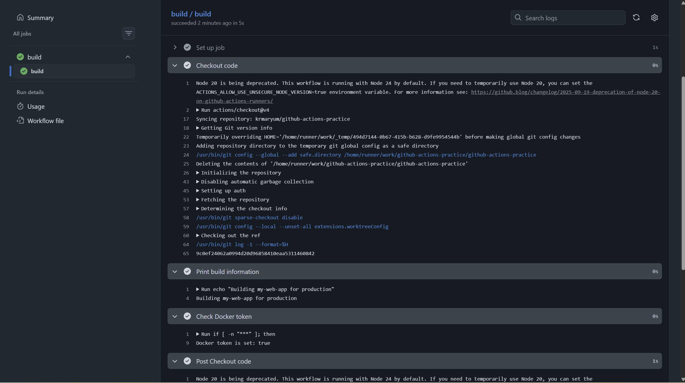
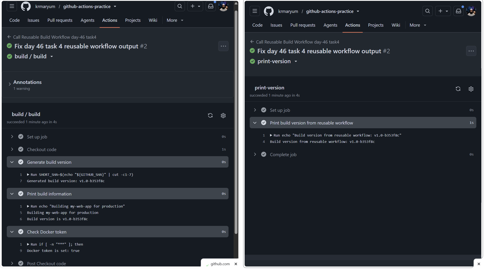
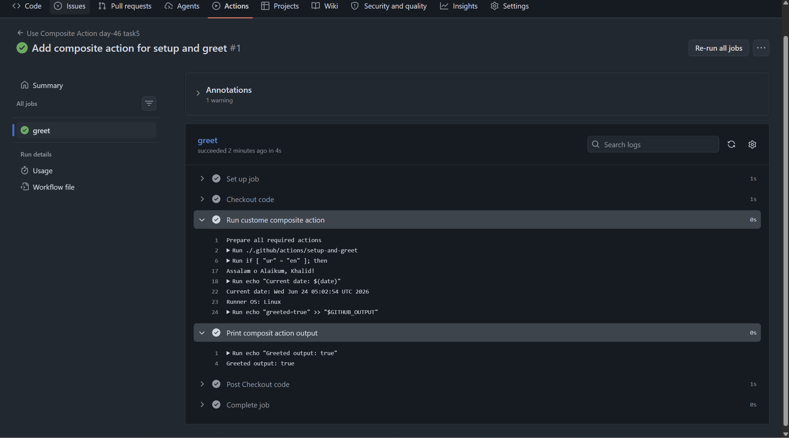

# Day 46 – Reusable Workflows & Composite Actions

## Table of Contents

| Task | Topic | Summary | Link |
|---|---|---|---|
| Day 46 Overview | Reusable Workflows & Composite Actions | Introduction to avoiding repeated GitHub Actions code using reusable workflows and composite actions. | [Go to Overview](#overview) |
| Day 46 Objectives | Learning Goals | Lists the main goals for Day 46, including `workflow_call`, caller workflows, outputs, and composite actions. | [Go to Objectives](#day-46-objectives) |
| Task 1 | Understand `workflow_call` | Learned what reusable workflows are, how `workflow_call` works, and where reusable workflows must live. | [Go to Task 1](#task-1--understand-workflow_call) |
| Task 2 | Create Your First Reusable Workflow | Created `reusable-build.yml` with inputs, secrets, checkout, and safe Docker token checking. | [Go to Task 2](#task-2-create-your-first-reusable-workflow) |
| Task 3 | Create a Caller Workflow | Created `call-build.yml` to call the reusable workflow and pass inputs and secrets. | [Go to Task 3](#task-3-create-a-caller-workflow) |
| Task 4 | Add Outputs to the Reusable Workflow | Added `build_version` output and passed it from reusable workflow to caller workflow using `needs`. | [Go to Task 4](#task-4-add-outputs-to-the-reusable-workflow) |
| Task 5 | Create a Composite Action | Created a custom composite action at `.github/actions/setup-and-greet/action.yml` and used it in a workflow. | [Go to Task 5](#task-5-create-a-composite-action) |
| Task 6 | Reusable Workflow vs Composite Action | Compared reusable workflows and composite actions in a table with use cases and differences. | [Go to Task 6](#task-6-reusable-workflow-vs-composite-action) |
| Final Summary | What I Learned | Summarizes the difference between reusable workflows and composite actions and why both are useful in DevOps. | [Go to Final Summary](#what-i-learned) |

## Overview

In previous GitHub Actions tasks, we wrote workflows from scratch for each task.  
In real DevOps teams, repeated workflow code is avoided.

Instead of copying the same CI/CD steps in every repository, teams create:

- Reusable workflows
- Composite actions

Reusable workflows allow one workflow to call another workflow, similar to calling a function in programming.

Composite actions allow multiple steps to be packaged together as one custom action.

The goal of Day 46 is to understand how to reuse GitHub Actions logic in a clean, professional, and maintainable way.

---

## Why Day 46 Is Important

In real-world DevOps work, teams usually manage many repositories.

If every repository has its own copied workflow, then maintaining CI/CD becomes difficult.

For example, if 10 repositories all use the same testing process, and later the testing process changes, then we would need to update all 10 workflow files manually.

Reusable workflows solve this problem.

They allow teams to write the workflow once and call it from other workflows or repositories.

---

## Day 46 Main Concepts

| Concept | Meaning |
|---|---|
| Reusable Workflow | A complete workflow that another workflow can call |
| `workflow_call` | A special trigger that makes a workflow reusable |
| Caller Workflow | The workflow that calls the reusable workflow |
| Composite Action | A custom action created from multiple steps |
| `action.yml` | The file used to define a custom action |
| DRY Principle | Do Not Repeat Yourself |

---

## Day 46 Objectives

By the end of Day 46, I should be able to:

- Explain what a reusable workflow is
- Explain what the `workflow_call` trigger does
- Understand how a caller workflow calls a reusable workflow
- Understand where reusable workflow files must be stored
- Create a custom composite action
- Compare reusable workflows and composite actions
- Document all YAML files and screenshots in a markdown file

---

## Expected Final Output

By the end of Day 46, the repository should contain:

```text
github-actions-practice/
├── .github/
│   ├── workflows/
│   │   ├── reusable-basic.yml
│   │   └── caller-workflow.yml
│   └── actions/
│       └── my-composite-action/
│           └── action.yml
└── 2026/
    └── day-46/
        └── day-46-reusable-workflows.md
```

---

## Day 46 Task Overview

| Task | Topic | Objective |
|---|---|---|
| Task 1 | Understand `workflow_call` | Learn the concept before writing code |
| Task 2 | Create reusable workflow | Create a workflow that can be called by another workflow |
| Task 3 | Create caller workflow | Call the reusable workflow from another workflow |
| Task 4 | Inputs and outputs | Pass data into and out of reusable workflows |
| Task 5 | Composite action | Create a custom action using `action.yml` |
| Task 6 | Comparison table | Compare reusable workflows and composite actions |
| Final Documentation | Markdown notes | Create `day-46-reusable-workflows.md` |

---

# Task 1 – Understand `workflow_call`

## Task 1 Objective

Before writing any code, the goal of Task 1 is to understand the concept of reusable workflows.

In this task, I need to answer:

1. What is a reusable workflow?
2. What is the `workflow_call` trigger?
3. How is calling a reusable workflow different from using a regular action with `uses:`?
4. Where must a reusable workflow file live?

---

## What Is a Reusable Workflow?

A reusable workflow is a GitHub Actions workflow that can be called by another workflow.

Simple meaning:

```text
Reusable workflow = workflow used like a function
```

Instead of writing the same workflow again and again, we can create one reusable workflow and call it from another workflow.

---

## Real-Life Example

Imagine a company has many repositories:

```text
frontend-app
backend-api
payment-service
user-service
admin-dashboard
```

Each repository may need the same CI steps:

```text
checkout code
install dependencies
run tests
build project
print summary
```

Without reusable workflows, we would copy the same workflow YAML into every repository.

With reusable workflows, we write the common workflow one time and call it from other workflows.

---

## Why Do We Need Reusable Workflows?

Reusable workflows are useful because they help avoid duplication.

| Benefit | Explanation |
|---|---|
| Avoid duplication | No need to copy the same YAML into many repositories |
| Easy maintenance | Update one reusable workflow instead of updating many workflows |
| Consistency | All repositories can follow the same CI/CD process |
| Team standards | DevOps teams can create approved workflow patterns |
| Cleaner workflows | Caller workflows become shorter and easier to understand |

---

## What Is the `workflow_call` Trigger?

`workflow_call` is a special GitHub Actions trigger that allows a workflow to be called by another workflow.

Example:

```yaml
on:
  workflow_call:
```

This means:

```text
This workflow is reusable.
Another workflow can call it.
```

A normal workflow may run on:

```yaml
on:
  push:
```

or:

```yaml
on:
  pull_request:
```

But a reusable workflow uses:

```yaml
on:
  workflow_call:
```

This tells GitHub Actions that this workflow is not mainly triggered by a direct push or pull request.  
It is triggered when another workflow calls it.

---

## Simple Reusable Workflow Example

```yaml
name: Reusable Basic Workflow

on:
  workflow_call:

jobs:
  reusable-job:
    runs-on: ubuntu-latest

    steps:
      - name: Say hello from reusable workflow
        run: echo "Hello from reusable workflow"
```

Explanation:

| Line | Meaning |
|---|---|
| `name:` | Name of the workflow |
| `on: workflow_call:` | Makes the workflow reusable |
| `jobs:` | Defines the jobs inside the workflow |
| `runs-on: ubuntu-latest` | Runs the job on an Ubuntu GitHub-hosted runner |
| `steps:` | Commands or actions that run inside the job |
| `run:` | Executes a shell command |

---

## How Is Calling a Reusable Workflow Different from Using a Regular Action?

This is one of the most important parts of Task 1.

A regular action is usually used inside `steps`.

Example:

```yaml
steps:
  - uses: actions/checkout@v4
```

A reusable workflow is called at the `jobs` level.

Example:

```yaml
jobs:
  call-reusable-workflow:
    uses: ./.github/workflows/reusable-basic.yml
```

---

## Regular Action vs Reusable Workflow

| Topic | Regular Action | Reusable Workflow |
|---|---|---|
| Used where? | Inside `steps` | Inside `jobs` |
| Example | `uses: actions/checkout@v4` | `uses: ./.github/workflows/reusable-basic.yml` |
| Purpose | Reuse one action or small task | Reuse a complete workflow |
| Can contain jobs? | No | Yes |
| Can define runner? | No, the workflow job defines runner | Yes, reusable workflow can define jobs and runners |
| Trigger needed? | No `workflow_call` needed | Must use `workflow_call` |
| File location | Can come from Marketplace, repo, or local action folder | Must be in `.github/workflows/` |
| Best for | Small reusable steps | Full CI/CD workflow reuse |

---

## Important Difference in Simple Words

### Regular Action

A regular action is like one tool.

Example:

```text
Use checkout action to download the repository code.
```

### Reusable Workflow

A reusable workflow is like a full process.

Example:

```text
Run a complete CI workflow that checks out code, installs dependencies, runs tests, and prints a summary.
```

---

## Where Must a Reusable Workflow File Live?

A reusable workflow must be stored inside:

```text
.github/workflows/
```

Example:

```text
.github/workflows/reusable-basic.yml
```

Reusable workflows cannot be placed anywhere in the repository.

Correct location:

```text
.github/workflows/reusable-basic.yml
```

Incorrect location:

```text
.github/actions/reusable-basic.yml
```

Incorrect location:

```text
workflows/reusable-basic.yml
```

Incorrect location:

```text
2026/day-46/reusable-basic.yml
```

---

## How to Call a Reusable Workflow from the Same Repository

If the reusable workflow is in the same repository, use this syntax:

```yaml
jobs:
  call-reusable:
    uses: ./.github/workflows/reusable-basic.yml
```

Notice:

- It is used under `jobs`
- It uses a relative path
- It points to a workflow file inside `.github/workflows/`

---

## How to Call a Reusable Workflow from Another Repository

If the reusable workflow is in another repository, use this syntax:

```yaml
jobs:
  call-reusable:
    uses: owner/repo/.github/workflows/reusable-basic.yml@main
```

Example:

```yaml
jobs:
  call-reusable:
    uses: krmaryum/github-actions-practice/.github/workflows/reusable-basic.yml@main
```

Explanation:

| Part | Meaning |
|---|---|
| `krmaryum` | GitHub username or organization |
| `github-actions-practice` | Repository name |
| `.github/workflows/reusable-basic.yml` | Path to reusable workflow |
| `@main` | Branch name |

---

## Important Note About Limits

The challenge mentions:

```text
A reusable workflow can be called by at most 20 unique caller workflows in a single run.
```

Study note:

```text
GitHub limits can change over time.
Always confirm reusable workflow limits from the official GitHub Actions documentation.
```

For practice, I will remember the challenge hint, but in real work I should always check the latest official GitHub documentation.

https://docs.github.com/en/actions/reference/limits

---

## Task 1 Key Points

- A reusable workflow is a workflow that another workflow can call.
- The `workflow_call` trigger makes a workflow reusable.
- A reusable workflow is called at the `jobs` level.
- A regular action is used inside `steps`.
- A reusable workflow must live inside `.github/workflows/`.
- Reusable workflows help avoid repeated YAML code.
- Reusable workflows make CI/CD easier to maintain across multiple repositories.

---

## Task 1 Summary

In this task, I learned that a reusable workflow is a complete GitHub Actions workflow that can be called by another workflow.

The `workflow_call` trigger allows a workflow to become reusable.

The main difference between a regular action and a reusable workflow is where they are used:

```text
Regular action = used inside steps
Reusable workflow = used inside jobs
```

A reusable workflow must be stored inside the `.github/workflows/` directory.

This concept is important because real DevOps teams use reusable workflows to avoid duplication, keep CI/CD consistent, and make workflow maintenance easier.

---

## Commands for Creating the Day 46 Folder and Markdown File

From the root of the repository:

```bash
mkdir -p 2026/day-46
touch 2026/day-46/day-46-reusable-workflows.md
```

After adding notes:

```bash
git status
git add 2026/day-46/day-46-reusable-workflows.md
git commit -m "Add Day 46 reusable workflows notes"
git push
```

---

## Good Git Commit Message

```bash
git commit -m "Add Day 46 reusable workflows overview and task 1 notes"
```

---

# Task 2: Create Your First Reusable Workflow

## Task Title

Create Your First Reusable Workflow

---

## Task Objective

In this task, I created my first reusable workflow in GitHub Actions.

The main goal is to understand how to create a workflow that does not run by itself, but can be called by another workflow.

This is done by using:

```yaml
on:
  workflow_call:
```

This makes the workflow reusable.

---

## What We Are Creating

Create this file:

```text
.github/workflows/reusable-build.yml
```

This reusable workflow will:

1. Use the `workflow_call` trigger
2. Accept inputs from a caller workflow
3. Accept a secret from a caller workflow
4. Check out the repository code
5. Print the application name and environment
6. Safely check whether the Docker token is set
7. Never print the actual secret value

---

## Important Concept

A reusable workflow is like a function.

It waits for another workflow to call it.

```text
Caller Workflow  --->  Reusable Workflow
```

This workflow does not run from `push` or `pull_request` because we only use:

```yaml
on:
  workflow_call:
```

So this workflow needs a caller workflow.

---

## File Path

Reusable workflow file:

```text
.github/workflows/reusable-build.yml
```

Reusable workflows must be stored inside:

```text
.github/workflows/
```

They cannot be stored in random folders.

---

## Complete YAML Code

```yaml
name: Reusable Build Workflow

on:
  workflow_call:
    inputs:
      app_name:
        description: "Name of the application"
        required: true
        type: string

      environment:
        description: "Target environment"
        required: true
        default: "staging"
        type: string

    secrets:
      docker_token:
        required: true

jobs:
  build:
    runs-on: ubuntu-latest

    steps:
      - name: Checkout code
        uses: actions/checkout@v4

      - name: Print build information
        run: |
          echo "Building ${{ inputs.app_name }} for ${{ inputs.environment }}"

      - name: Check Docker token
        run: |
          if [ -n "${{ secrets.docker_token }}" ]; then
            echo "Docker token is set: true"
          else
            echo "Docker token is set: false"
            exit 1
          fi
```

---

[Mermaid flowchart with block name for Reuseable Workflow](md/reusable-build-workflow-block-diagram.md)

[Mermaid flowchart with block name for Regular Workflow](md/regular-github-actions-workflow-block-diagram.md)

## Block-by-Block Explanation

## 1. Workflow Name

```yaml
name: Reusable Build Workflow
```

This gives a name to the workflow.

This name appears in GitHub Actions.

---

## 2. `workflow_call` Trigger

```yaml
on:
  workflow_call:
```

This is the most important part of this task.

It means:

```text
This workflow can be called by another workflow.
```

This workflow will not run automatically on push because we did not use:

```yaml
on:
  push:
```

---

## 3. Inputs Section

```yaml
inputs:
  app_name:
    description: "Name of the application"
    required: true
    type: string
```

This creates an input called:

```text
app_name
```

The caller workflow must provide this value.

Example later in the caller workflow:

```yaml
with:
  app_name: "github-actions-practice"
```

---

## 4. Environment Input

```yaml
environment:
  description: "Target environment"
  required: true
  default: "staging"
  type: string
```

This creates another input called:

```text
environment
```

The default value is:

```text
staging
```

This means if the caller does not provide a value, GitHub Actions can use the default value.

For this challenge, we kept both:

```yaml
required: true
default: "staging"
```

because the task requested it.

---

## 5. Secrets Section

```yaml
secrets:
  docker_token:
    required: true
```

This means the reusable workflow expects a secret named:

```text
docker_token
```

The caller workflow must pass this secret.

Important:

Never print the actual secret value.

Wrong example:

```yaml
run: echo "${{ secrets.docker_token }}"
```

Correct example:

```yaml
run: |
  if [ -n "${{ secrets.docker_token }}" ]; then
    echo "Docker token is set: true"
  fi
```

---

## 6. Job Section

```yaml
jobs:
  build:
    runs-on: ubuntu-latest
```

This creates a job named:

```text
build
```

The job runs on a GitHub-hosted Ubuntu runner.

---

## 7. Checkout Step

```yaml
- name: Checkout code
  uses: actions/checkout@v4
```

This step downloads the repository code into the runner.

Without checkout, the runner may not have access to the repository files.

---

## 8. Print Build Information

```yaml
- name: Print build information
  run: |
    echo "Building ${{ inputs.app_name }} for ${{ inputs.environment }}"
```

This prints a message using the input values.

Example output:

```text
Building github-actions-practice for staging
```

The values come from the caller workflow.

---

## 9. Check Docker Token Safely

```yaml
- name: Check Docker token
  run: |
    if [ -n "${{ secrets.docker_token }}" ]; then
      echo "Docker token is set: true"
    else
      echo "Docker token is set: false"
      exit 1
    fi
```

This checks whether the Docker token exists.

If the secret is available, it prints:

```text
Docker token is set: true
```

If the secret is missing, it prints:

```text
Docker token is set: false
```

Then it exits with error.

This is safe because it does not print the real secret.

---

## Commands to Create the File

From the root of the repository:

```bash
mkdir -p .github/workflows
nano .github/workflows/reusable-build.yml
```

Paste the YAML code.

Save the file in nano:

```text
CTRL + O
Enter
CTRL + X
```

---

## Verify the File Exists

Run:

```bash
ls -l .github/workflows/reusable-build.yml
```

Expected result:

```text
.github/workflows/reusable-build.yml
```

---

## Check Git Status

Run:

```bash
git status
```

You should see:

```text
new file:   .github/workflows/reusable-build.yml
```

or if the file already existed:

```text
modified:   .github/workflows/reusable-build.yml
```

---

## Important Verification

This file alone will not run.

Reason:

```yaml
on:
  workflow_call:
```

It does not have:

```yaml
on:
  push:
```

It also does not have:

```yaml
on:
  workflow_dispatch:
```

So GitHub Actions will wait for another workflow to call it.

That caller workflow will be created in Task 3.

---

## Common Mistakes

| Mistake | Problem |
|---|---|
| Putting reusable workflow outside `.github/workflows/` | GitHub will not treat it as a reusable workflow |
| Using `workflow_call` under the wrong indentation | YAML error |
| Calling inputs with wrong name | Workflow fails |
| Printing the secret directly | Security risk |
| Calling reusable workflow inside `steps` | Wrong location |
| Forgetting to pass required secret | Caller workflow fails |

---

## Correct Mental Model

Think of reusable workflow like this:

```text
Reusable workflow = function definition
Caller workflow = function call
```

Task 2 creates the function.

Task 3 will call the function.

---

## Task 2 Summary

In this task, I created a reusable workflow file:

```text
.github/workflows/reusable-build.yml
```

This workflow uses the `workflow_call` trigger.

It accepts two inputs:

| Input | Type | Required | Default | Purpose |
|---|---|---|---|---|
| `app_name` | string | yes | none | Name of the application |
| `environment` | string | yes | staging | Target environment |

It also accepts one secret:

| Secret | Required | Purpose |
|---|---|---|
| `docker_token` | yes | Docker authentication secret |

The workflow has one job called `build`.

The job:

1. Checks out the code
2. Prints the app name and environment
3. Checks whether the Docker token is set
4. Does not print the actual secret value

Important note:

This reusable workflow will not run by itself because it only has the `workflow_call` trigger.

It needs a caller workflow, which will be created in Task 3.

---

## Git Commands

After creating the file, run:

```bash
git status
git add .github/workflows/reusable-build.yml
git commit -m "Add reusable build workflow"
git push
```

---

## Good Git Commit Message

```bash
git commit -m "Add reusable build workflow"
```

---

# Task 3: Create a Caller Workflow

## Task Title

Create a Caller Workflow

---

## Task Objective

In this task, I created a caller workflow that calls the reusable workflow from Task 2.

In Task 2, I created this reusable workflow:

```text
.github/workflows/reusable-build.yml
```

That reusable workflow uses:

```yaml
on:
  workflow_call:
```

Because of that, it does not run by itself.

In Task 3, I created another workflow that runs on push to the `main` branch and calls the reusable workflow.

---

## What We Are Creating

Create this file:

```text
.github/workflows/call-build.yml
```

This caller workflow will:

1. Run on push to the `main` branch
2. Call the reusable workflow
3. Pass input values to the reusable workflow
4. Pass a Docker token secret to the reusable workflow
5. Trigger the reusable workflow job

---

## Important Concept

A reusable workflow is like a function definition.

A caller workflow is like a function call.

```text
Reusable workflow = function definition
Caller workflow   = function call
```

Task 2 created the reusable workflow.

Task 3 calls that reusable workflow.

---

## File Path

Create the caller workflow here:

```text
.github/workflows/call-build.yml
```

---

## Complete YAML Code

```yaml
name: Call Reusable Build Workflow

on:
  push:
    branches:
      - main

jobs:
  build:
    uses: ./.github/workflows/reusable-build.yml
    with:
      app_name: "my-web-app"
      environment: "production"
    secrets:
      docker_token: ${{ secrets.DOCKER_TOKEN }}
```

---

# Block-by-Block Explanation

## 1. Workflow Name

```yaml
name: Call Reusable Build Workflow
```

This gives the workflow a name.

This name appears in the GitHub Actions tab.

---

## 2. Trigger on Push to Main

```yaml
on:
  push:
    branches:
      - main
```

This means the workflow will run when code is pushed to the `main` branch.

This is different from the reusable workflow.

The reusable workflow used:

```yaml
on:
  workflow_call:
```

The caller workflow uses:

```yaml
on:
  push:
```

So the caller workflow starts the process.

---

## 3. Jobs Section

```yaml
jobs:
  build:
```

This creates a job named:

```text
build
```

Normally, a job has:

```yaml
runs-on:
steps:
```

But in this caller workflow, the job does not define its own runner or steps.

Why?

Because this job calls another workflow.

---

## 4. Calling the Reusable Workflow

```yaml
uses: ./.github/workflows/reusable-build.yml
```

This line calls the reusable workflow from Task 2.

The reusable workflow file is located at:

```text
.github/workflows/reusable-build.yml
```

Because it is in the same repository, we use a relative path:

```text
./.github/workflows/reusable-build.yml
```

Important:

Reusable workflows are called at the `jobs` level, not inside `steps`.

Correct:

```yaml
jobs:
  build:
    uses: ./.github/workflows/reusable-build.yml
```

Wrong:

```yaml
jobs:
  build:
    runs-on: ubuntu-latest
    steps:
      - uses: ./.github/workflows/reusable-build.yml
```

---

## 5. Passing Inputs

```yaml
with:
  app_name: "my-web-app"
  environment: "production"
```

The `with:` section passes input values to the reusable workflow.

In Task 2, the reusable workflow expected these inputs:

```yaml
inputs:
  app_name:
  environment:
```

In Task 3, the caller workflow provides values for them.

| Input | Value |
|---|---|
| `app_name` | `my-web-app` |
| `environment` | `production` |

Expected output in the reusable workflow logs:

```text
Building my-web-app for production
```

---

## 6. Passing Secrets

```yaml
secrets:
  docker_token: ${{ secrets.DOCKER_TOKEN }}
```

This passes a repository secret into the reusable workflow.

Important difference:

| Location | Secret Name |
|---|---|
| GitHub repository secret | `DOCKER_TOKEN` |
| Reusable workflow secret name | `docker_token` |

In Task 2, the reusable workflow expected:

```yaml
secrets:
  docker_token:
    required: true
```

In Task 3, the caller passes:

```yaml
docker_token: ${{ secrets.DOCKER_TOKEN }}
```

This means:

```text
Take the repository secret named DOCKER_TOKEN
and pass it into the reusable workflow as docker_token.
```

---

## Secret Safety

Never print the actual Docker token.

Wrong:

```yaml
run: echo "${{ secrets.DOCKER_TOKEN }}"
```

Correct:

```yaml
run: |
  if [ -n "${{ secrets.docker_token }}" ]; then
    echo "Docker token is set: true"
  fi
```

Expected safe output:

```text
Docker token is set: true
```

---

# Commands to Create the Caller Workflow

From the root of your repository:

```bash
mkdir -p .github/workflows
nano .github/workflows/call-build.yml
```

Paste this code:

```yaml
name: Call Reusable Build Workflow

on:
  push:
    branches:
      - main

jobs:
  build:
    uses: ./.github/workflows/reusable-build.yml
    with:
      app_name: "my-web-app"
      environment: "production"
    secrets:
      docker_token: ${{ secrets.DOCKER_TOKEN }}
```

Save in nano:

```text
CTRL + O
Enter
CTRL + X
```

---

# Before Pushing: Check Secret Exists

The caller workflow uses:

```yaml
${{ secrets.DOCKER_TOKEN }}
```

So the repository must have a secret named:

```text
DOCKER_TOKEN
```

Check in GitHub:

```text
Repository
Settings
Secrets and variables
Actions
Repository secrets
```

Make sure this secret exists:

```text
DOCKER_TOKEN
```

If the secret is missing, the reusable workflow will fail because `docker_token` is required.

---

# Git Commands

Run:

```bash
git status
git add .github/workflows/call-build.yml
git commit -m "Add caller workflow for reusable build"
git push
```

---

# Verification in GitHub Actions

After pushing to `main`:

1. Go to your GitHub repository.
2. Click the **Actions** tab.
3. Open **Call Reusable Build Workflow**.
4. Click the latest workflow run.
5. Click the `build` job.
6. Open the logs.

You should see this output:

```text
Building my-web-app for production
```

You should also see:

```text
Docker token is set: true
```




---

# Important Verification Question

The task asks:

```text
In the Actions tab, do you see the caller triggering the reusable workflow?
Click into the job — can you see the inputs printed?
```

Answer for notes:

```text
Yes. The caller workflow triggered the reusable workflow.
Inside the build job logs, I can see the input values printed:

Building my-web-app for production

I can also see that the Docker token was safely checked:

Docker token is set: true
```

---

# Workflow Relationship

After Task 3, we have two workflow files:

```text
.github/workflows/reusable-build.yml
.github/workflows/call-build.yml
```

## reusable-build.yml

This workflow uses:

```yaml
on:
  workflow_call:
```

It waits to be called.

## call-build.yml

This workflow uses:

```yaml
on:
  push:
    branches:
      - main
```

It runs on push to `main` and calls the reusable workflow.

---

# Visual Flow

```text
git push to main
      |
      v
.github/workflows/call-build.yml
      |
      v
uses: ./.github/workflows/reusable-build.yml
      |
      v
Reusable Build Workflow runs
      |
      v
Prints:
Building my-web-app for production
Docker token is set: true
```

---

# Common Mistakes

| Mistake | Problem |
|---|---|
| Calling reusable workflow inside `steps` | Reusable workflows must be called at the `jobs` level |
| Forgetting `branches: main` | Workflow may run on all branches |
| Missing `DOCKER_TOKEN` secret | Reusable workflow will fail |
| Passing wrong secret name | Secret will not be available |
| Typo in workflow path | Caller cannot find reusable workflow |
| Reusable workflow not in `.github/workflows/` | GitHub will not recognize it correctly |

---

# Task 3 Summary

In this task, I created a caller workflow:

```text
.github/workflows/call-build.yml
```

This workflow runs on push to the `main` branch.

It calls the reusable workflow from Task 2:

```yaml
uses: ./.github/workflows/reusable-build.yml
```

The caller passes two inputs:

| Input | Value |
|---|---|
| `app_name` | `my-web-app` |
| `environment` | `production` |

The caller also passes one secret:

| Reusable Workflow Secret | Repository Secret |
|---|---|
| `docker_token` | `${{ secrets.DOCKER_TOKEN }}` |

Expected output in GitHub Actions logs:

```text
Building my-web-app for production
Docker token is set: true
```

Important:

The caller workflow runs on `push` to `main`.

The reusable workflow does not run by itself. It runs only when the caller workflow calls it.

---

# Good Git Commit Message

```bash
git commit -m "Add caller workflow for reusable build"
```

---

# What I Learned

In Task 3, I learned how to call a reusable workflow from another workflow.

I learned that reusable workflows are called at the `jobs` level using `uses:`.

I also learned how to pass inputs and secrets from the caller workflow into the reusable workflow.

This is useful in real DevOps work because teams can create one common workflow and call it from many repositories.

---

# Task 4: Add Outputs to the Reusable Workflow

## Task Title

Add Outputs to the Reusable Workflow

---

## Task Objective

In this task, I extended the reusable workflow so it can send a value back to the caller workflow.

The value we are sending back is:

```text
build_version
```

The reusable workflow will generate a version string like:

```text
v1.0-<short-sha>
```

Example:

```text
v1.0-9c0ef24
```

Then the caller workflow will use a second job to read and print that output.

---

## What We Are Updating

In this task, we update two workflow files:

```text
.github/workflows/reusable-build.yml
.github/workflows/call-build.yml
```

> The reusable workflow will generate and expose the output.

> The caller workflow will read and print the output.

---

## Important Concept

The output flow works like this:

```text
Step output → Job output → Workflow output → Caller workflow reads it
```

In simple words:

1. A step generates the value.
2. The job exposes that step value as a job output.
3. The reusable workflow exposes that job output as a workflow output.
4. The caller workflow reads that output using `needs`.

---

# Part 1 – Update `reusable-build.yml`

Open the reusable workflow file:

```bash
nano .github/workflows/reusable-build-day-46-task4.yml
```

Replace the file with this updated version:

```yaml
name: Reusable Build Workflow day-46 task4

on:
  workflow_call:
    inputs:
      app_name:
        description: "Name of the application"
        required: true
        type: string

      environment:
        description: "Target environment"
        required: true
        default: "staging"
        type: string

    secrets:
      docker_token:
        required: true

    outputs:
      build_version:
        description: "Generated build version"
        value: ${{ jobs.build.outputs.build_version }}

jobs:
  build:
    runs-on: ubuntu-latest

    outputs:
      build_version: ${{ steps.version.outputs.build_version }}

    steps:
      - name: Checkout code
        uses: actions/checkout@v4

      - name: Generate build version
        id: version
        run: |
          SHORT_SHA=$(echo "${GITHUB_SHA}" | cut -c1-7)
          BUILD_VERSION="v1.0-${SHORT_SHA}"
          echo "build_version=${BUILD_VERSION}" >> "$GITHUB_OUTPUT"
          echo "Generated build version: ${BUILD_VERSION}"

      - name: Print build information
        run: |
          echo "Building ${{ inputs.app_name }} for ${{ inputs.environment }}"
          echo "Build version is ${{ steps.version.outputs.build_version }}"

      - name: Check Docker token
        run: |
          if [ -n "${{ secrets.docker_token }}" ]; then
            echo "Docker token is set: true"
          else
            echo "Docker token is set: false"
            exit 1
          fi
```

---

# Explanation of Changes in `reusable-build-day-46-task4.yml`

## 1. Added Workflow Output

```yaml
outputs:
  build_version:
    description: "Generated build version"
    value: ${{ jobs.build.outputs.build_version }}
```

This exposes the output from the reusable workflow to the caller workflow.

Meaning:

```text
The caller workflow can read build_version from this reusable workflow.
```

---

## 2. Added Job Output

```yaml
outputs:
  build_version: ${{ steps.version.outputs.build_version }}
```

This exposes the output from the step named `version` to the job.

The job output name is:

```text
build_version
```

---

## 3. Added Version Generation Step

```yaml
- name: Generate build version
  id: version
  run: |
    SHORT_SHA=$(echo "${GITHUB_SHA}" | cut -c1-7)
    BUILD_VERSION="v1.0-${SHORT_SHA}"
    echo "build_version=${BUILD_VERSION}" >> "$GITHUB_OUTPUT"
    echo "Generated build version: ${BUILD_VERSION}"
```

This step creates a version string.

Example:

```text
v1.0-9c0ef24
```

The `id: version` is very important because later we read the output using:

```yaml
${{ steps.version.outputs.build_version }}
```

---

## 4. Why We Use `$GITHUB_OUTPUT`

This line sets the output:

```bash
echo "build_version=${BUILD_VERSION}" >> "$GITHUB_OUTPUT"
```

`$GITHUB_OUTPUT` is the modern GitHub Actions method for setting step outputs.

This makes the value available to other parts of the workflow.

---

# Part 2 – Update `call-build.yml`

Open the caller workflow file:

```bash
nano .github/workflows/call-build-day-46-task4.yml
```

```yaml
name: Call Reusable Build Workflow day-46 task4

on:
  push:
    branches:
      - main

jobs:
  build:
    uses: ./.github/workflows/reusable-build.yml
    with:
      app_name: "my-web-app"
      environment: "production"
    secrets:
      docker_token: ${{ secrets.DOCKER_TOKEN }}

  print-version:
    runs-on: ubuntu-latest
    needs: build

    steps:
      - name: Print build version from reusable workflow
        run: |
          echo "Build version from reusable workflow: ${{ needs.build.outputs.build_version }}"
```

---

# Explanation of Changes in `call-build.yml`

## 1. Existing Build Job

```yaml
build:
  uses: ./.github/workflows/reusable-build.yml
```

This job calls the reusable workflow.

It passes inputs and secrets to the reusable workflow.

---

## 2. Added Second Job

```yaml
print-version:
  runs-on: ubuntu-latest
  needs: build
```

This creates a second job named:

```text
print-version
```

The line:

```yaml
needs: build
```

means this job depends on the `build` job.

So `print-version` will run only after the reusable workflow job finishes successfully.

---

## 3. Read Output from Reusable Workflow

```yaml
echo "Build version from reusable workflow: ${{ needs.build.outputs.build_version }}"
```

This reads the output from the `build` job.

The output came from the reusable workflow.

Expected output:

```text
Build version from reusable workflow: v1.0-9c0ef24
```

Your short SHA will be different.

---

# Full Output Flow

This is the full flow:

```text
Step creates output
      |
      v
steps.version.outputs.build_version
      |
      v
jobs.build.outputs.build_version
      |
      v
on.workflow_call.outputs.build_version
      |
      v
needs.build.outputs.build_version
```

Simple version:

```text
Step output → Job output → Reusable workflow output → Caller job reads it
```

---

# Commands to Update and Push

After updating both files, run:

```bash
git status
git add .github/workflows/reusable-build-day-46-task4.yml .github/workflows/call-build-day-46-task4.yml
git commit -m "Add build version output to reusable workflow"
git push
```



---

# Verification in GitHub Actions

After pushing to `main`:

1. Go to your GitHub repository.
2. Click **Actions**.
3. Open **Call Reusable Build Workflow**.
4. Open the latest workflow run.
5. First check the reusable `build` job.
6. Then check the second job named `print-version`.

In the reusable build job, you should see something like:

```text
Generated build version:  v1.0-b353f8c
Building my-web-app for production
Build version is  v1.0-b353f8c
```

In the second job, you should see:

```text
Build version from reusable workflow: v1.0-9c0ef24
```

---

# Verification Answer for Notes

The task asks:

```text
Does the second job print the version from the reusable workflow?
```

Answer:

```text
Yes. The second job printed the build version generated by the reusable workflow.

The reusable workflow generated a version using the short commit SHA.

The caller workflow read the output using:

${{ needs.build.outputs.build_version }}

Then it printed the version in the print-version job.
```

---

# Common Mistakes

| Mistake | Problem |
|---|---|
| Forgetting `id: version` | Cannot read `steps.version.outputs.build_version` |
| Forgetting `$GITHUB_OUTPUT` | Step output will not be created |
| Forgetting job `outputs:` | Workflow output cannot access the value |
| Forgetting `on.workflow_call.outputs` | Caller workflow cannot read the output |
| Forgetting `needs: build` | Second job cannot read build job output |
| Typo in output name | Output will be empty |
| Using `steps.version.outputs` in caller workflow | Caller must use `needs.build.outputs` |

---

# Important Notes

## Step Output

Created here:

```bash
echo "build_version=${BUILD_VERSION}" >> "$GITHUB_OUTPUT"
```

## Job Output

Created here:

```yaml
outputs:
  build_version: ${{ steps.version.outputs.build_version }}
```

## Workflow Output

Created here:

```yaml
outputs:
  build_version:
    description: "Generated build version"
    value: ${{ jobs.build.outputs.build_version }}
```

## Caller Reads Output

Read here:

```yaml
${{ needs.build.outputs.build_version }}
```

---

# Task 4 Summary

In this task, I learned how to return data from a reusable workflow back to the caller workflow.

I added an output named:

```text
build_version
```

The reusable workflow generated a version string using the short commit SHA:

```text
v1.0-<short-sha>
```

The reusable workflow exposed this value as a workflow output.

Then the caller workflow added a second job named:

```text
print-version
```

This job depends on the reusable workflow job using:

```yaml
needs: build
```

The second job reads the reusable workflow output using:

```yaml
${{ needs.build.outputs.build_version }}
```

Expected output:

```text
Build version from reusable workflow: v1.0-<short-sha>
```

Task 4 is complete when the second job prints the build version from the reusable workflow.

---

# Good Git Commit Message

```bash
git commit -m "Add build version output to reusable workflow"
```

---

# What I Learned

In Task 4, I learned how outputs work with reusable workflows.

I learned that outputs move through multiple levels:

```text
Step output → Job output → Workflow output → Caller workflow
```

This is useful in real DevOps because one workflow can build something and return useful information, such as a build version, image tag, artifact name, or deployment URL, to another workflow.

---

# Task 5: Create a Composite Action

## Task Title

Create a Composite Action

---

## Task Objective

In this task, I created my own custom GitHub Action using a composite action.

A composite action allows us to combine multiple steps into one reusable action.

Instead of writing the same steps again and again in different workflows, we can create one custom action and call it using `uses:`.

---

## What We Are Creating

In this task, we create two things:

```text
.github/actions/setup-and-greet/action.yml
.github/workflows/use-composite-action-day-46-task5.yml
```

The first file defines the composite action.

The second file is a workflow that uses the composite action.

---

## Important Concept

A composite action is like a small reusable action made from multiple steps.

Example:

```text
Composite Action
      |
      |-- Print greeting
      |-- Print current date
      |-- Print runner OS
      |-- Set output
```

A composite action is different from a reusable workflow.

A composite action is used inside `steps`.

Example:

```yaml
steps:
  - uses: ./.github/actions/setup-and-greet
```

A reusable workflow is used at the `jobs` level.

Example:

```yaml
jobs:
  build:
    uses: ./.github/workflows/reusable-build.yml
```

---

# Part 1 – Create the Composite Action

## Folder Path

Create this folder:

```text
.github/actions/setup-and-greet/
```

Command:

```bash
mkdir -p .github/actions/setup-and-greet
```

---

## Action File

Create this file:

```text
.github/actions/setup-and-greet/action.yml
```

Command:

```bash
nano .github/actions/setup-and-greet/action.yml
```

---

## Complete `action.yml` Code

```yaml
name: "Setup and Greet"
description: "A custom composite action that prints a greeting, date, runner OS, and sets an output"

inputs:
  name:
    description: "Name of the person to greet"
    required: true

  language:
    description: "Greeting language"
    required: false
    default: "en"

outputs:
  greeted:
    description: "Whether the greeting was printed"
    value: ${{ steps.set-output.outputs.greeted }}

runs:
  using: "composite"
  steps:
    - name: Print greeting
      shell: bash
      run: |
        if [ "${{ inputs.language }}" = "en" ]; then
          echo "Hello, ${{ inputs.name }}!"
        elif [ "${{ inputs.language }}" = "ur" ]; then
          echo "Assalamu Alaikum, ${{ inputs.name }}!"
        elif [ "${{ inputs.language }}" = "es" ]; then
          echo "Hola, ${{ inputs.name }}!"
        else
          echo "Hello, ${{ inputs.name }}!"
        fi

    - name: Print date and runner OS
      shell: bash
      run: |
        echo "Current date: $(date)"
        echo "Runner OS: $RUNNER_OS"

    - name: Set greeted output
      id: set-output
      shell: bash
      run: |
        echo "greeted=true" >> "$GITHUB_OUTPUT"
```

---

# Block-by-Block Explanation of `action.yml`

## 1. Action Name

```yaml
name: "Setup and Greet"
```

This is the name of the custom action.

---

## 2. Description

```yaml
description: "A custom composite action that prints a greeting, date, runner OS, and sets an output"
```

This explains what the action does.

---

## 3. Inputs Section

```yaml
inputs:
  name:
    description: "Name of the person to greet"
    required: true
```

This defines an input called:

```text
name
```

This input is required.

The workflow must provide a value for it.

Example:

```yaml
with:
  name: "Khalid"
```

---

## 4. Language Input

```yaml
language:
  description: "Greeting language"
  required: false
  default: "en"
```

This defines an optional input called:

```text
language
```

If the workflow does not provide a value, the default will be:

```text
en
```

Supported examples in this action:

| Language | Greeting |
|---|---|
| `en` | Hello |
| `ur` | Assalamu Alaikum |
| `es` | Hola |

---

## 5. Outputs Section

```yaml
outputs:
  greeted:
    description: "Whether the greeting was printed"
    value: ${{ steps.set-output.outputs.greeted }}
```

This defines an output called:

```text
greeted
```

The value comes from the step with this ID:

```yaml
id: set-output
```

---

## 6. Composite Action Syntax

```yaml
runs:
  using: "composite"
```

This tells GitHub Actions:

```text
This is a composite action.
```

A composite action is made from multiple steps.

---

## 7. Print Greeting Step

```yaml
- name: Print greeting
  shell: bash
  run: |
    if [ "${{ inputs.language }}" = "en" ]; then
      echo "Hello, ${{ inputs.name }}!"
    elif [ "${{ inputs.language }}" = "ur" ]; then
      echo "Assalamu Alaikum, ${{ inputs.name }}!"
    elif [ "${{ inputs.language }}" = "es" ]; then
      echo "Hola, ${{ inputs.name }}!"
    else
      echo "Hello, ${{ inputs.name }}!"
    fi
```

This step checks the selected language and prints a greeting.

Example output:

```text
Assalamu Alaikum, Khalid!
```

---

## 8. Print Date and Runner OS

```yaml
- name: Print date and runner OS
  shell: bash
  run: |
    echo "Current date: $(date)"
    echo "Runner OS: $RUNNER_OS"
```

This prints the current date and the runner operating system.

Example output:

```text
Current date: Tue Jun 23 10:30:00 UTC 2026
Runner OS: Linux
```

---

## 9. Set Output

```yaml
- name: Set greeted output
  id: set-output
  shell: bash
  run: |
    echo "greeted=true" >> "$GITHUB_OUTPUT"
```

This creates an output called:

```text
greeted
```

with the value:

```text
true
```

The output is set using:

```bash
$GITHUB_OUTPUT
```

---

# Part 2 – Create a Workflow to Use the Composite Action

## Workflow File

Create this file:

```text
.github/workflows/use-composite-action-day-46-task5.yml
```

Command:

```bash
nano .github/workflows/use-composite-action-day-46-task5.yml
```

---

## Complete Workflow Code

```yaml
name: Use Composite Action day-46 task5

on:
  push:
    branches:
      - main

  workflow_dispatch:

jobs:
  greet:
    runs-on: ubuntu-latest

    steps:
      - name: Checkout code
        uses: actions/checkout@v4

      - name: Run custom composite action
        id: greet-action
        uses: ./.github/actions/setup-and-greet
        with:
          name: "Khalid"
          language: "ur"

      - name: Print composite action output
        run: |
          echo "Greeted output: ${{ steps.greet-action.outputs.greeted }}"
```

---

# Block-by-Block Explanation of Workflow

## 1. Workflow Name

```yaml
name: Use Composite Action day-46 task5
```

This is the name that appears in the GitHub Actions tab.

---

## 2. Trigger

```yaml
on:
  push:
    branches:
      - main

  workflow_dispatch:
```

This workflow runs when code is pushed to the `main` branch.

It can also be run manually because of:

```yaml
workflow_dispatch:
```

---

## 3. Job

```yaml
jobs:
  greet:
    runs-on: ubuntu-latest
```

This creates a job named:

```text
greet
```

It runs on a GitHub-hosted Ubuntu runner.

---

## 4. Checkout Code

```yaml
- name: Checkout code
  uses: actions/checkout@v4
```

This step is very important.

Because the composite action is inside the same repository, the runner must first download the repository code.

Without checkout, GitHub Actions may not find this local action:

```text
.github/actions/setup-and-greet
```

---

## 5. Use Local Composite Action

```yaml
- name: Run custom composite action
  id: greet-action
  uses: ./.github/actions/setup-and-greet
  with:
    name: "Khalid"
    language: "ur"
```

This step runs the local custom composite action.

It passes two inputs:

| Input | Value |
|---|---|
| `name` | `Khalid` |
| `language` | `ur` |

Expected greeting:

```text
Assalamu Alaikum, Khalid!
```

---

## 6. Print Composite Action Output

```yaml
- name: Print composite action output
  run: |
    echo "Greeted output: ${{ steps.greet-action.outputs.greeted }}"
```

This prints the output from the composite action.

Expected output:

```text
Greeted output: true
```

---

# Important Difference: Composite Action vs Reusable Workflow

| Topic | Composite Action | Reusable Workflow |
|---|---|---|
| Used where? | Inside `steps` | At the `jobs` level |
| File location | Usually `.github/actions/action-name/action.yml` | Must be inside `.github/workflows/` |
| Main keyword | `runs: using: "composite"` | `on: workflow_call` |
| Can contain jobs? | No | Yes |
| Good for | Reusing repeated steps | Reusing complete workflows |
| Example call | `uses: ./.github/actions/setup-and-greet` | `uses: ./.github/workflows/reusable-build.yml` |

---

# Commands to Create Files

From the root of the repository:

```bash
mkdir -p .github/actions/setup-and-greet
nano .github/actions/setup-and-greet/action.yml
nano .github/workflows/use-composite-action-day-46-task5.yml
```

---

# Git Commands

After creating both files:

```bash
git status
git add .github/actions/setup-and-greet/action.yml .github/workflows/use-composite-action-day-46-task5.yml
git commit -m "Add composite action for setup and greet"
git push
```




---

# Verification in GitHub Actions

After pushing:

1. Go to your GitHub repository.
2. Click **Actions**.
3. Open **Use Composite Action day-46 task5**.
4. Click the latest workflow run.
5. Click the `greet` job.
6. Open the step named **Run custom composite action**.

You should see:

```text
Assalamu Alaikum, Khalid!
```

You should also see:

```text
Current date: ...
Runner OS: Linux
```

Then open the step named **Print composite action output**.

You should see:

```text
Greeted output: true
```

---

# Visual Flow

```text
git push to main
      |
      v
use-composite-action-day-46-task5.yml
      |
      v
Checkout code
      |
      v
uses: ./.github/actions/setup-and-greet
      |
      v
action.yml runs composite steps
      |
      v
Print greeting
Print date and runner OS
Set output greeted=true
      |
      v
Workflow prints output
```

---

# Common Mistakes

| Mistake | Problem |
|---|---|
| Forgetting `actions/checkout` | Local action cannot be found |
| Wrong action path | Workflow cannot locate action |
| Missing `runs: using: "composite"` | GitHub will not treat it as a composite action |
| Missing `shell: bash` | `run` steps in composite action may fail |
| Wrong output step ID | Output will be empty |
| Using workflow path instead of action folder path | Composite action uses folder path, not workflow file path |
| Putting composite action in `.github/workflows/` | Composite actions should live in an action folder with `action.yml` |

---

# Task 5 Verification Answer

The task asks:

```text
Does your custom action run and print the greeting?
```

Answer:

```text
Yes. The custom composite action ran successfully.

It printed the greeting:

Assalamu Alaikum, Khalid!

It also printed the current date and runner OS.

The action set an output called greeted with the value true.

The workflow printed:

Greeted output: true
```

---

# Task 5 Summary

In this task, I created a custom composite action.

The action file is:

```text
.github/actions/setup-and-greet/action.yml
```

The composite action accepts two inputs:

| Input | Required | Default | Purpose |
|---|---|---|---|
| `name` | yes | none | Name of the person to greet |
| `language` | no | `en` | Greeting language |

The composite action has one output:

| Output | Value |
|---|---|
| `greeted` | `true` |

The action performs these steps:

1. Prints a greeting in the selected language
2. Prints the current date
3. Prints the runner OS
4. Sets an output called `greeted` with value `true`

I also created a workflow to use the composite action:

```text
.github/workflows/use-composite-action-day-46-task5.yml
```

The workflow uses the local composite action:

```yaml
uses: ./.github/actions/setup-and-greet
```

Expected output:

```text
Assalamu Alaikum, Khalid!
Current date: ...
Runner OS: Linux
Greeted output: true
```

Task 5 is complete when the custom action runs and prints the greeting.

---

# Good Git Commit Message

```bash
git commit -m "Add composite action for setup and greet"
```

---

# What I Learned

In Task 5, I learned how to create my own custom composite action.

I learned that a composite action is defined in an `action.yml` file.

I also learned that composite actions use:

```yaml
runs:
  using: "composite"
```

Composite actions are useful when I want to reuse multiple steps in different workflows.

This is helpful in real DevOps work because teams can create their own internal actions for repeated setup, validation, testing, or deployment steps.


---

# Task 6: Reusable Workflow vs Composite Action

## Task Title

Reusable Workflow vs Composite Action

---

## Task Objective

In this task, I compared reusable workflows and composite actions.

Both are used to avoid repeated GitHub Actions code, but they are used in different situations.

A reusable workflow is used when we want to reuse a complete workflow.

A composite action is used when we want to reuse multiple steps inside a job.

---

## Completed Comparison Table

| Topic | Reusable Workflow | Composite Action |
|---|---|---|
| Triggered by | `workflow_call` | `uses:` inside a step |
| Can contain jobs? | Yes | No |
| Can contain multiple steps? | Yes | Yes |
| Lives where? | `.github/workflows/` | Usually `.github/actions/<action-name>/action.yml` |
| Can accept secrets directly? | Yes, through `on.workflow_call.secrets` | Not directly like reusable workflows; secrets are passed as inputs or environment variables from the workflow |
| Best for | Reusing complete CI/CD workflows with jobs, runners, inputs, secrets, and outputs | Reusing repeated steps inside a job |

---

## Simple Explanation

## Reusable Workflow

A reusable workflow is a complete workflow that can be called by another workflow.

It uses:

```yaml
on:
  workflow_call:
```

It is called at the `jobs` level.

Example:

```yaml
jobs:
  build:
    uses: ./.github/workflows/reusable-build.yml
```

A reusable workflow can contain full jobs, runners, steps, inputs, secrets, and outputs.

---

## Composite Action

A composite action is a custom action made from multiple steps.

It uses:

```yaml
runs:
  using: "composite"
```

It is called inside `steps`.

Example:

```yaml
steps:
  - name: Run custom composite action
    uses: ./.github/actions/setup-and-greet
```

A composite action cannot contain jobs. It only contains steps.

---

## Trigger Difference

## Reusable Workflow

Triggered by:

```yaml
on:
  workflow_call:
```

This means another workflow can call it.

---

## Composite Action

Triggered by `uses:` inside a workflow step.

Example:

```yaml
steps:
  - uses: ./.github/actions/setup-and-greet
```

---

## Can Contain Jobs?

| Type | Can Contain Jobs? | Explanation |
|---|---|---|
| Reusable Workflow | Yes | It is a complete workflow, so it can define jobs |
| Composite Action | No | It is only a group of steps, not a full workflow |

---

## Can Contain Multiple Steps?

| Type | Can Contain Multiple Steps? | Explanation |
|---|---|---|
| Reusable Workflow | Yes | Jobs inside the workflow can contain many steps |
| Composite Action | Yes | A composite action can group multiple steps together |

---

## Where Do They Live?

## Reusable Workflow Location

Reusable workflows must live inside:

```text
.github/workflows/
```

Example:

```text
.github/workflows/reusable-build.yml
```

---

## Composite Action Location

Composite actions usually live inside:

```text
.github/actions/<action-name>/action.yml
```

Example:

```text
.github/actions/setup-and-greet/action.yml
```

---

## Can Accept Secrets Directly?

## Reusable Workflow

Yes.

Reusable workflows can define secrets directly under:

```yaml
on:
  workflow_call:
    secrets:
      docker_token:
        required: true
```

The caller workflow can pass the secret like this:

```yaml
secrets:
  docker_token: ${{ secrets.DOCKER_TOKEN }}
```

---

## Composite Action

Composite actions do not accept secrets directly in the same way reusable workflows do.

Secrets are usually passed from the workflow as:

- inputs
- environment variables

Example using environment variable:

```yaml
steps:
  - name: Run custom action
    uses: ./.github/actions/setup-and-greet
    env:
      MY_SECRET: ${{ secrets.MY_SECRET }}
```

Important:

Never print the actual secret value in logs.

---

## Best Use Cases

## Reusable Workflow Is Best For

Reusable workflows are best when we want to reuse a complete CI/CD process.

Examples:

```text
build job
test job
security scan job
deploy job
release job
```

Reusable workflows are useful for standardizing CI/CD across multiple repositories.

---

## Composite Action Is Best For

Composite actions are best when we want to reuse repeated steps inside a job.

Examples:

```text
print greeting
install tools
setup environment
validate files
run common shell commands
set outputs
```

Composite actions are useful when several workflows need the same group of steps.

---

## Easy Memory Trick

```text
Reusable Workflow = reusable full workflow
Composite Action = reusable group of steps
```

Another way:

```text
Reusable Workflow = jobs level
Composite Action = steps level
```

---

## Visual Difference

```text
Reusable Workflow
      |
      |-- job 1
      |     |-- step 1
      |     |-- step 2
      |
      |-- job 2
            |-- step 1
            |-- step 2
```

```text
Composite Action
      |
      |-- step 1
      |-- step 2
      |-- step 3
```

---

## Example From Day 46

## Reusable Workflow Example

File:

```text
.github/workflows/reusable-build-day-46-task4.yml
```

Called from caller workflow:

```yaml
jobs:
  build:
    uses: ./.github/workflows/reusable-build-day-46-task4.yml
```

Used for:

```text
building app
checking Docker token
generating build version
returning output to caller
```

---

## Composite Action Example

File:

```text
.github/actions/setup-and-greet/action.yml
```

Called from workflow step:

```yaml
steps:
  - name: Run custom composite action
    uses: ./.github/actions/setup-and-greet
```

Used for:

```text
printing greeting
printing date
printing runner OS
setting greeted=true output
```

---

## Important Interview-Style Answer

A reusable workflow is used to reuse an entire workflow. It is triggered by `workflow_call` and is called at the `jobs` level. It can contain jobs, steps, inputs, secrets, and outputs.

A composite action is used to reuse multiple steps. It is defined using `runs: using: "composite"` and is called inside `steps` using `uses:`. It cannot contain jobs.

---

## Common Mistakes

| Mistake | Explanation |
|---|---|
| Calling a reusable workflow inside `steps` | Reusable workflows must be called at the `jobs` level |
| Putting reusable workflow outside `.github/workflows/` | GitHub will not treat it as a reusable workflow |
| Expecting composite action to contain jobs | Composite actions can only contain steps |
| Forgetting `runs: using: "composite"` | GitHub will not recognize it as a composite action |
| Forgetting checkout before local composite action | The runner may not find the local action |
| Passing secrets carelessly | Secrets should never be printed in logs |

---

## Task 6 Summary

In this task, I learned the difference between reusable workflows and composite actions.

A reusable workflow is used when I want to reuse a complete workflow. It can contain jobs, runners, inputs, secrets, and outputs.

A composite action is used when I want to reuse a group of steps inside a job. It cannot contain jobs, but it can contain multiple steps.

The main difference is:

```text
Reusable Workflow = jobs level
Composite Action = steps level
```

---

## What I Learned

I learned that reusable workflows and composite actions both help follow the DRY principle:

```text
DRY = Do Not Repeat Yourself
```

Reusable workflows help teams standardize full CI/CD pipelines.

Composite actions help teams reuse repeated setup or command steps.

Both are important in real DevOps because they make GitHub Actions cleaner, easier to maintain, and more professional.
