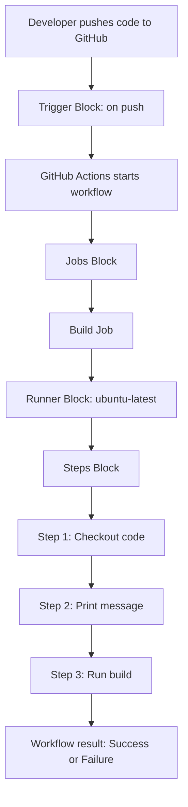
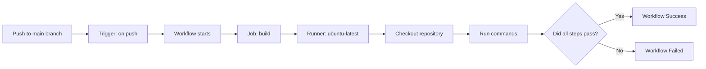
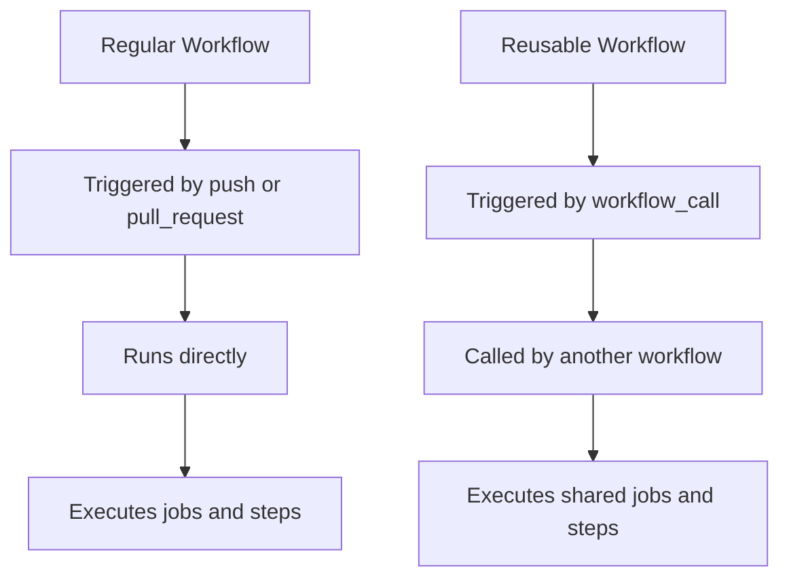

# Regular GitHub Actions Workflow Block Diagram

## Topic

Regular GitHub Actions Workflow using normal triggers such as `push`, `pull_request`, or `workflow_dispatch`.

---

## What Is This Diagram Called?

This type of diagram is called a:

```text
Workflow block diagram
```

It can also be called:

```text
Mermaid flowchart
GitHub Actions workflow flowchart
CI/CD pipeline block diagram
YAML workflow block diagram
```

For future requests, you can say:

```text
Can you create a workflow block diagram for this GitHub Actions file?
```

Or:

```text
Can you create a Mermaid flowchart for this workflow?
```

---

## Regular Workflow Example

```yaml
name: Regular Build Workflow

on:
  push:
    branches:
      - main

jobs:
  build:
    runs-on: ubuntu-latest

    steps:
      - name: Checkout code
        uses: actions/checkout@v4

      - name: Print message
        run: echo "Running regular workflow"

      - name: Run build
        run: echo "Build completed"
```

---

## Simple Block Diagram



---

## Regular Workflow Block Names

| Block | YAML Section | Purpose |
|---|---|---|
| Workflow Name Block | `name:` | Gives the workflow a display name |
| Trigger Block | `on:` | Decides when the workflow starts |
| Jobs Block | `jobs:` | Contains one or more jobs |
| Job Block | `build:` | Defines a specific job |
| Runner Block | `runs-on:` | Chooses the machine where the job runs |
| Steps Block | `steps:` | Contains commands/actions inside a job |
| Action Step | `uses:` | Runs a prebuilt GitHub Action |
| Command Step | `run:` | Runs shell commands |
| Result Block | Success/Failure | Shows final workflow status |

---

## Detailed Workflow Flow



---

## Block-by-Block Explanation

### 1. Workflow Name Block

```yaml
name: Regular Build Workflow
```

This gives the workflow a readable name in the GitHub Actions tab.

---

### 2. Trigger Block

```yaml
on:
  push:
    branches:
      - main
```

This means the workflow runs automatically when code is pushed to the `main` branch.

In a regular workflow, triggers are usually events such as:

```yaml
on: push
on: pull_request
on: workflow_dispatch
```

---

### 3. Jobs Block

```yaml
jobs:
```

This is where the real work begins. A workflow can have one job or many jobs.

---

### 4. Build Job Block

```yaml
  build:
```

This defines a job named `build`.

The job name can be changed, for example:

```yaml
test:
deploy:
lint:
```

---

### 5. Runner Block

```yaml
runs-on: ubuntu-latest
```

This tells GitHub Actions to run the job on an Ubuntu Linux machine.

Common runners are:

```text
ubuntu-latest
windows-latest
macos-latest
self-hosted
```

---

### 6. Steps Block

```yaml
steps:
```

Steps are the individual actions or commands that run inside the job.

Steps run from top to bottom.

---

### 7. Checkout Step

```yaml
- name: Checkout code
  uses: actions/checkout@v4
```

This downloads the repository code into the runner.

Without this step, the runner may not have your project files.

---

### 8. Command Step

```yaml
- name: Print message
  run: echo "Running regular workflow"
```

This runs a shell command on the runner.

The `run:` keyword is used when we want to execute commands directly.

---

### 9. Build Step

```yaml
- name: Run build
  run: echo "Build completed"
```

This represents the build process.

In a real project, this could be:

```bash
npm install
npm test
docker build .
python -m pytest
```

---

## Regular Workflow vs Reusable Workflow

| Feature | Regular Workflow | Reusable Workflow |
|---|---|---|
| Trigger | `push`, `pull_request`, `workflow_dispatch` | `workflow_call` |
| Runs by itself? | Yes | No |
| Needs caller workflow? | No | Yes |
| Purpose | Run CI/CD directly | Share workflow logic with other workflows |
| Example use | Build/test on push | Common build workflow used by many repos |

---

## Simple Comparison Diagram



---

## Easy Way to Remember

```text
Regular workflow = runs directly
Reusable workflow = called by another workflow
```

Regular workflow example:

```yaml
on: push
```

Reusable workflow example:

```yaml
on:
  workflow_call:
```

---

## Final Summary

A regular GitHub Actions workflow runs automatically based on events such as `push`, `pull_request`, or manual trigger using `workflow_dispatch`.

The main blocks are:

```text
name → on → jobs → job name → runs-on → steps → uses/run → result
```

This diagram is called a **workflow block diagram** or **Mermaid flowchart**.

For future study notes, you can ask:

```text
Create a workflow block diagram for this YAML file.
```

Or:

```text
Create a Mermaid flowchart with block names and step-by-step explanation.
```
