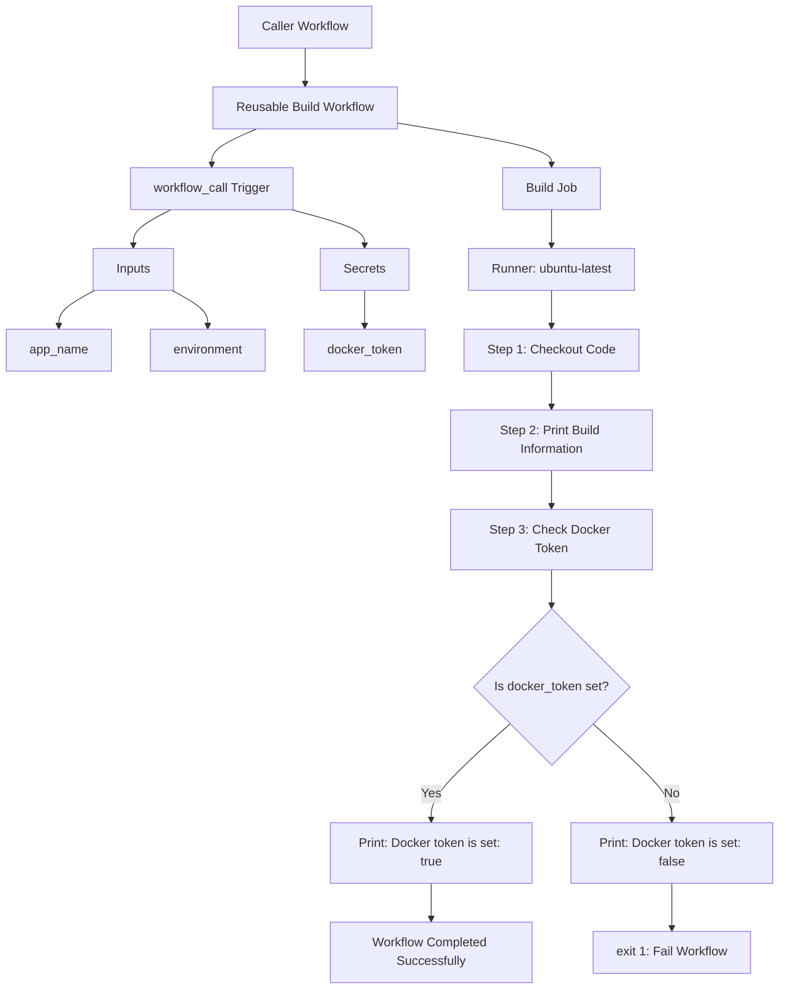

# Reusable Build Workflow – Block Diagram Study Notes

## Topic
GitHub Actions reusable workflow using `workflow_call`

---

## Simple Block Diagram



---

## Diagram Explanation

This reusable workflow works like a function.

Another workflow calls it and sends:

- `app_name`
- `environment`
- `docker_token`

The reusable workflow receives those values, runs a build job, prints build information, and checks whether the Docker token secret is available.

---

## Block 1: Caller Workflow

```text
Caller Workflow
```

The caller workflow is a normal GitHub Actions workflow that calls the reusable workflow.

Example:

```yaml
jobs:
  call-build:
    uses: ./.github/workflows/reusable-build.yml
    with:
      app_name: "my-app"
      environment: "staging"
    secrets:
      docker_token: ${{ secrets.DOCKER_TOKEN }}
```

The reusable workflow does not run by itself. It must be called by another workflow.

---

## Block 2: Reusable Build Workflow

```yaml
name: Reusable Build Workflow
```

This is the workflow name. It helps identify the workflow in the GitHub Actions tab.

---

## Block 3: workflow_call Trigger

```yaml
on:
  workflow_call:
```

This block makes the workflow reusable.

It means:

```text
This workflow can be called by another workflow.
```

This is different from normal triggers like:

```yaml
on: push
```

A `workflow_call` workflow behaves like a reusable function.

---

## Block 4: Inputs

```yaml
inputs:
```

Inputs are values passed from the caller workflow to the reusable workflow.

In this workflow, there are two inputs:

| Input Name | Purpose |
|---|---|
| `app_name` | Name of the application |
| `environment` | Target environment such as staging or production |

---

## Block 5: app_name Input

```yaml
app_name:
  description: "Name of the application"
  required: true
  type: string
```

This input stores the application name.

Example value:

```yaml
app_name: "web-app"
```

Because `required: true` is used, the caller workflow must provide this value.

---

## Block 6: environment Input

```yaml
environment:
  description: "Target environment"
  required: true
  default: "staging"
  type: string
```

This input stores the target environment.

Example values:

```text
staging
production
dev
test
```

If the caller does not provide an environment, the default value is:

```text
staging
```

---

## Block 7: Secrets

```yaml
secrets:
  docker_token:
    required: true
```

This block defines a required secret named:

```text
docker_token
```

Secrets are used for sensitive values like Docker tokens, API keys, and passwords.

Important:

Never print the actual secret value in logs.

---

## Block 8: Build Job

```yaml
jobs:
  build:
    runs-on: ubuntu-latest
```

This creates one job named `build`.

The job runs on a GitHub-hosted Ubuntu machine.

```yaml
runs-on: ubuntu-latest
```

means:

```text
Run this job on a temporary Ubuntu runner provided by GitHub.
```

---

## Block 9: Steps

```yaml
steps:
```

Steps are the commands or actions that run inside a job.

This workflow has three steps:

| Step | Name | Purpose |
|---|---|---|
| 1 | Checkout code | Download repository code into the runner |
| 2 | Print build information | Print app name and environment |
| 3 | Check Docker token | Verify that the secret exists |

---

## Block 10: Checkout Code Step

```yaml
- name: Checkout code
  uses: actions/checkout@v4
```

This step downloads the repository code into the GitHub Actions runner.

Without this step, the runner may not have access to your project files.

---

## Block 11: Print Build Information Step

```yaml
- name: Print build information
  run: |
    echo "Building ${{ inputs.app_name }} for ${{ inputs.environment }}"
```

This step prints the application name and target environment.

Example output:

```text
Building web-app for staging
```

Here:

```yaml
${{ inputs.app_name }}
```

means get the value of `app_name`.

```yaml
${{ inputs.environment }}
```

means get the value of `environment`.

---

## Block 12: Check Docker Token Step

```yaml
- name: Check Docker token
  run: |
    if [ -n "${{ secrets.docker_token }}" ]; then
      echo "Docker token is set: true"
    else
      echo "Docker token is set: false"
      exit 1
    fi
```

This step checks if the Docker token secret was passed correctly.

It does not print the actual token.

---

## Block 13: Decision Block

```bash
if [ -n "${{ secrets.docker_token }}" ]; then
```

The `-n` option checks if a string is not empty.

Meaning:

```text
If docker_token is not empty, continue successfully.
```

If the secret exists, it prints:

```text
Docker token is set: true
```

If the secret is missing, it prints:

```text
Docker token is set: false
```

Then it runs:

```bash
exit 1
```

`exit 1` fails the workflow.

---

## Simple Flow Summary

```text
Caller workflow
   |
   v
Reusable workflow starts using workflow_call
   |
   v
Inputs received: app_name and environment
   |
   v
Secret received: docker_token
   |
   v
Build job starts on ubuntu-latest
   |
   v
Checkout code
   |
   v
Print build information
   |
   v
Check Docker token
   |
   v
If token exists → success
If token missing → fail workflow
```

---

## Final Summary

This reusable workflow is designed to avoid repeating the same build logic in multiple repositories or branches.

Main concepts learned:

| Concept | Meaning |
|---|---|
| `workflow_call` | Makes a workflow reusable |
| `inputs` | Values passed from caller workflow |
| `secrets` | Sensitive values passed safely |
| `jobs` | Main work sections of the workflow |
| `steps` | Commands or actions inside a job |
| `actions/checkout@v4` | Downloads repository code into the runner |
| `exit 1` | Fails the workflow when something is wrong |

