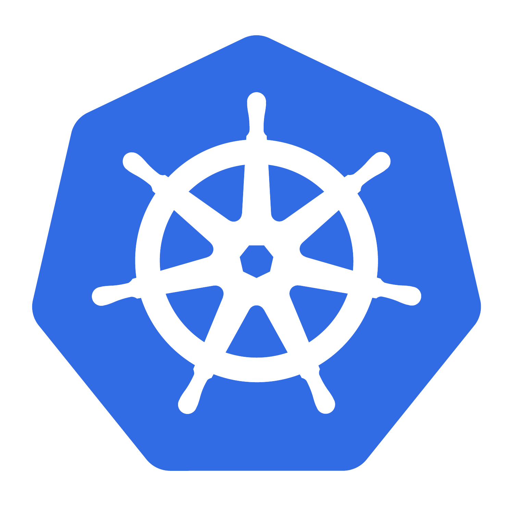
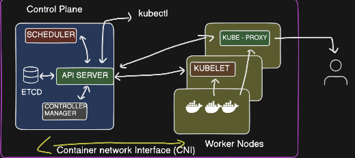
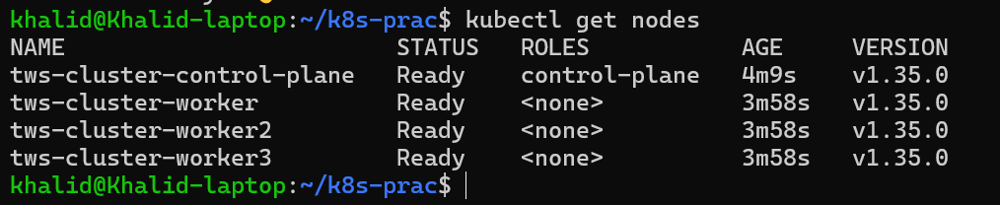
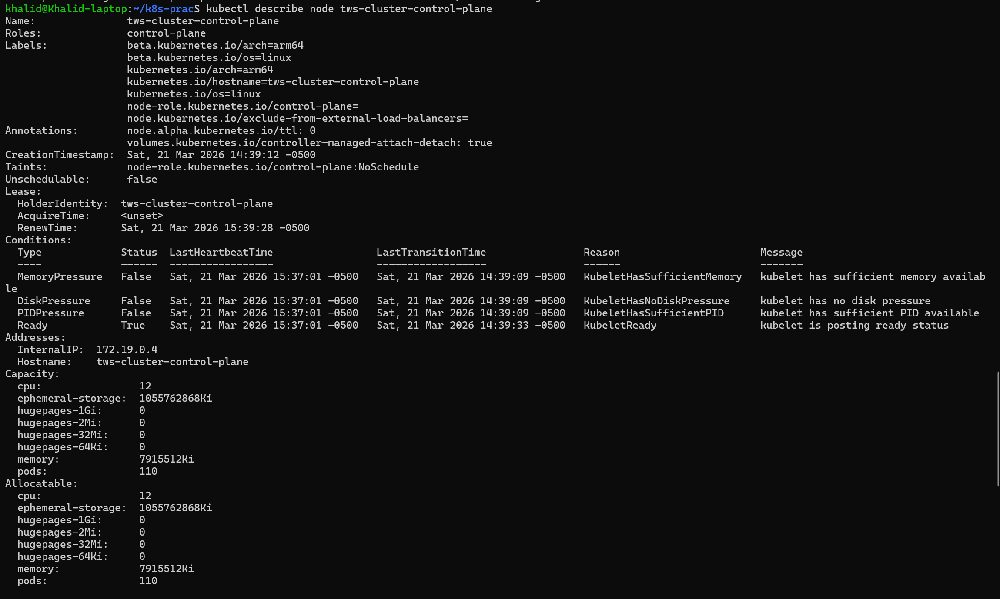
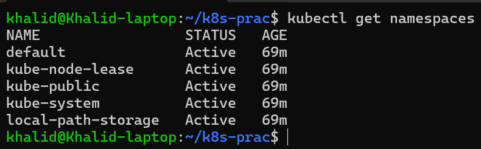
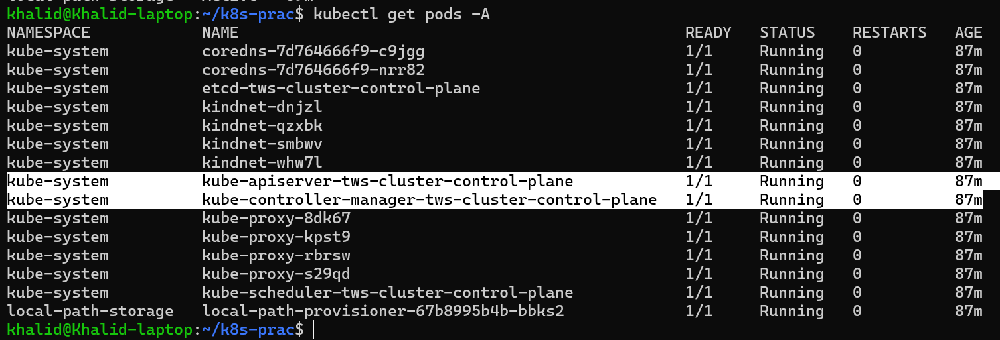

# Day 50 – Kubernetes Architecture and Cluster Setup

## Table of Contents

- [Task 1: Recall Kubernetes Story](#task-1-recall-kubernetes-story)
- [Task 2: Kubernetes Architecture](#task-2-draw-the-kubernetes-architecture)
- [Task 3: Install kubectl](#task-3-install-kubectl)
- [Task 4: Set Up Your Local Cluster](#task-4-set-up-your-local-cluster)
- [Task 5: Explore My Cluster](#task-5-explore-my-cluster)
- [Task 6: Practice Cluster Lifecycle](#task-6-practice-cluster-lifecycle)

[All day-50 Commands](day_50_k_8_s_commands.md)

[What is Manifest?](md/kubernetes_manifest_explained.md)

## Quick Commands Table (Day 50)

| Category | Command | Description |
|----------|--------|-------------|
| System Check | `nproc` | Check number of CPU cores |
| System Check | `free -h` | Check memory usage |
| kubectl Install | `kubectl version --client` | Verify kubectl installation |
| kind Install | `kind --version` | Verify kind installation |
| Cluster Create | `kind create cluster --config kind-config.yml` | Create cluster from config |
| Cluster Verify | `kubectl get nodes` | Check cluster nodes status |
| Cluster Info | `kubectl cluster-info` | Show API server & services |
| Node Details | `kubectl describe node <node-name>` | Detailed node info |
| Namespaces | `kubectl get namespaces` | List all namespaces |
| Pods (All) | `kubectl get pods -A` | List all pods across namespaces |
| System Pods | `kubectl get pods -n kube-system` | List system components |
| Pods with Node | `kubectl get pods -n kube-system -o wide` | Show pod placement |
| Delete Cluster | `kind delete cluster --name <name>` | Delete cluster |
| Recreate Cluster | `kind create cluster --name <name>` | Create new cluster |
| Context Check | `kubectl config current-context` | Show active cluster |
| Context List | `kubectl config get-contexts` | List all clusters |
| kubeconfig View | `kubectl config view` | Show full config |
| Debug Docker | `docker ps` | Show running containers |
| Help | `kubectl help` | Show kubectl help |

## Task-1: Recalling the memeories

### 1. Why was Kubernetes created?
Kubernetes was created to manage containers at scale.

Docker can run containers, but when we have:
- many containers
- across multiple servers

it becomes difficult to:
- manage them
- scale them
- keep them running

Kubernetes solves this by automating:
- deployment
  - Creating and updating pods
  - Rolling updates & rollbacks
  - Ensuring the desired state is maintained

- scaling

- self-healing
  - Kubernetes constantly checks if your containers (pods) are healthy
  - If something fails, it will:
    - Restart the container
    - Replace failed pods
    - Reschedule them on another node if needed

- load balancing
  - Distributes traffic

### Quick Understanding
- Deployment → Manages how apps are created/updated
- Scaling → Adjusts number of running instances
- Load balancing → Distributes traffic
- Self-healing → Ensures apps stay alive and running

### Simple memory trick
Think of Kubernetes like a caretaker:
- Deployment = hires workers
- Scaling = adds/removes workers
- Load balancing = assigns tasks
- Self-healing = makes sure workers don’t disappear and replaces them if they do

### 2. Who created Kubernetes & what inspired it?
Kubernetes was created by Google.

It was inspired by Google’s internal system:
Borg (later Omega)

Google used Borg to manage thousands of applications in their infrastructure.

### 3. What does "Kubernetes" mean?

“Kubernetes” means:

**Helmsman** (ship captain)

That’s why the logo looks like a ship wheel 

Meaning:

**It steers and manages containers** like a captain controls a ship.

### Kubernetes Key Definitions

- **Container**: A lightweight, portable unit that packages an application and its dependencies to run consistently anywhere.  
- **Pod**: The smallest deployable unit in Kubernetes that runs one or more containers sharing the same network and storage.  
- **Node**: A machine (virtual or physical) that provides resources to run pods in a Kubernetes cluster.  

**Bonus**: Containers run inside pods, and pods run on nodes in Kubernetes.

## Task-2 Draw the Kubernetes Architecture
[kubernetes_architecture](md/kubernetes_architecture.md)

https://github.com/LondheShubham153/kubestarter/tree/main

https://kubernetes.io/docs/concepts/architecture/



### Control Plane (Master Node)
- API Server
  - Entry point of cluster
  - All commands go through it

- etcd
  - Stores cluster state (like database)

- Scheduler
  - Decides which node runs a pod

- Controller Manager
  - Ensures desired state = actual state

---

### Worker Node

- kubelet
 - Talks to API Server
 - Runs and manages pods

kube-proxy
- Can talks to API Server
- Expose app to a user
- Handles networking
- Enables pod communication

- Container Runtime
 - Runs containers (containerd, CRI-O)

### [kind & kubectl Explanation](md/kind_and_kubectl.md)

### What Happens: `kubectl apply -f pod.yml
1. Run:
```bash
kubectl apply -f pod.yml
```
2. kubectl → API Server
- Request goes to API Server (front door)
3. API Server → etcd
- Stores desired state (pod defination)
4. Scheduler
- Sees new pod without node
- Chooses best node
5. API Server updates etcd
- Pod now assigned to a node
6. kubelet (on that node)
- Watches API Server
- Sees pod assigned to it
7. kublet → Container runtime
- Pulls image
- Starts container
8. Pods is now running

### Failure Scenarios (important)
**If API Server goes down**\
What happens:
- It cannot run:
  - kubectl commands
  - create/update/delete resources
- BUT:
  - Running pods keep running (on nodes)

Why?\
Because nodes already have onstructions.

**If Worker Node goes down**\
What happens:
- Pods on that node are lost
- Controller Manager detects mismatch:
   - Desired: 3 pods
   - Actual: 2 pods

- Kubernetes reacts:
  - Scheduler create new pod
  - Assigns to another node
  - System heals itself

### Real DevOps Insight (Important)
Kubernetes is NOT:
- About running containers

It IS:
- A self-healing system
- A state management engine

### If etcd data is lost completely…
what happens to your cluster?
1. Entire Cluster state 
- All cogigurations gone:
   - Pods
   - Deployments
   - Services
   - Secrets
   - ConfigMaps

Because:\
**etcd = single source of truth**

2. Running Pods may Still Exist(Temporarily)
- Containers may still be running on nodes
- But Kubernetes does not know about them anymore

So:
- No Management
- No scaling
- No recovery

3. cluster Becomes "Brain Dead"
- API Server has no data
- scheduler can't schedule
- Controller can't reconcile

System is effectively broken/
etcd is the brain memory of Kubernetes\
Lose it = lose everything

4. Recovery?
Only if:
- Have etcd bacup

Otherwise:

Rebuild cluster from scratch

### If kubelet stops running on a node, what happens?
1. Node becomes NotReady
- API Server stops receiving updates from kubelet
- Kubernetes marks node as:
  - NotReady

2. Pods on that node?
- Existing containers may still be running (for some time)
- BUT Kubernetes:
  - Cannot monitor them 
  - Cannot restart them 
  - Cannot manage them 

3. Controller Manager reacts
- Kubernetes sees:
  - Desired: 3 pods
  - Actual (healthy): maybe 2

So it:
- Creates new pods
- Schedules them on other healthy nodes

4. That node is basically “dead” to cluster
- No scheduling happens there
- No new pods assigned
- Eventually pods are recreated elsewhere

### Understanding
kubelet = executor on node

If kubelet dies:
- Node becomes useless
- Kubernetes shifts workload elsewhere

---

## Task 3: Install kubectl
What is `kubectl` (Quick Mental Model)

kubectl = remote control for Kubernetes
- We don’t talk to nodes directly
- We don’t run containers manually

Sends commands → API Server → Kubernetes does the work

`kubectl` is the CLI tool you will use to talk to your Kubernetes cluster.

1. Install it:

https://kubernetes.io/docs/tasks/tools/install-kubectl-linux/
```bash
# Linux (ARM64)
curl -LO "https://dl.k8s.io/release/$(curl -L -s https://dl.k8s.io/release/stable.txt)/bin/linux/arm64/kubectl"

chmod +x kubectl

sudo mv kubectl /usr/local/bin/
```

2. Test to ensure the version you installed is up-to-date:
```bash
kubectl version --client
```
```text
khalid@Khalid-laptop:~$ kubectl version --client
Client Version: v1.35.3
Kustomize Version: v5.7.1
```

---

## Task 4: Set Up Your Local Cluster
Choose one of the following. Both give you a fully functional Kubernetes cluster on your machine.\
1. kind (Kubernetes in Docker)\
https://kind.sigs.k8s.io/docs/user/quick-start/
### For ARM64
```bash
# Install kind

# Linux
[ $(uname -m) = aarch64 ] && curl -Lo ./kind https://kind.sigs.k8s.io/dl/v0.31.0/kind-linux-arm64

chmod +x ./kind

sudo mv ./kind /usr/local/bin/kind
```
2. Create Cluster from Config File
Going to the folder where I need to practice
```bash
cd ~/k8s-prac
```
- Create a YMl file
```bash
vim kind-config.yml
```
```YAML
kind: Cluster
apiVersion: kind.x-k8s.io/v1alpha4
name: tws-cluster

nodes:
  - role: control-plane
    image: kindest/node:v1.35.0

  - role: worker
    image: kindest/node:v1.35.0

  - role: worker
    image: kindest/node:v1.35.0

  - role: worker
    image: kindest/node:v1.35.0
```
Create kind cluster:
```bash
# Create a local Kubernetes cluster named day50-cluster
# kind create cluster --name tws-cluster
kind create cluster --config kind-config.yml
```
### What Will Happen
kind will:
- Pull node images (if not already present)
- Create 4 Docker containers (1 control + 3 workers)
- Set up networking
- Configure kubeconfig automatically

 This may take 1–3 minutes first time


---

## Task 5: Explore My Cluster
Now that your cluster is running, explore it:

### Verify Cluster
After it completes, run:
```bash
kubectl get nodes
```



This confirms the API server is running and kubectl is talking to your cluster correctly.

**What output means**
- Kubernetes control plane is running at https://127.0.0.1:44263
  - This is the API server endpoint for your local kind cluster.
- CoreDNS is running
  - DNS inside the cluster is working too.
- Context is correct:
  - kind-tws-cluster

**Why this matters**

This proves:
- the control plane is alive 
- networking basics are set up 
- your cluster is healthy enough for next steps

It shows the cluster control plane endpoint and key cluster services like CoreDNS, confirming that the Kubernetes API server is reachable.

**Q. Write down: Which one did you choose and why?**
kind runs local Kubernetes nodes as Docker containers, which makes it lightweight and a very good fit for quick learning, testing, and CI-style workflows.

```bash
# Detailed info for one node
# kubectl describe node <node-name>
kubectl describe node tws-cluster-control-plane
kubectl describe node tws-cluster-worker
kubectl describe node tws-cluster-worker2
kubectl describe node tws-cluster-worker3
```


```bash
# List all namespaces
kubectl get namespaces
```


```bash
# See ALL pods running in the cluster (across all namespaces) 
kubectl get pods -A
```


```bash
# Control-plane/system pods
kubectl get pods -n kube-system
```


**This is the mental mapping:**
- `etcd-...` → etcd
  - stores the cluster state
- `kube-apiserver-...` → API Server
  - front door of the cluster
- `kube-scheduler-...` → Scheduler
  - decides which node a pod should run on
- `kube-controller-manager-...` → Controller Manager
  - keeps actual state aligned with desired state
- `coredns-...` → DNS service
  - lets pods/services find each other by name
- `kube-proxy-...` → kube-proxy
  - networking rules on each node


## Core Concepts

| Concept   | Definition |
|----------|------------|
| Cluster  | A group of nodes managed by Kubernetes that work together to run applications. |
| Node     | A machine (virtual or physical) that provides resources to run pods. |
| Pod      | The smallest deployable unit; runs one or more containers sharing network/storage. |
| Container| Lightweight unit packaging an app and its dependencies. |

**Bonus**: Cluster → Nodes → Pods → Containers

---

## Key Features

| Feature         | Purpose |
|----------------|--------|
| Deployment     | Manages application deployment and updates. |
| Scaling        | Adjusts the number of pods. |
| Load Balancing | Distributes traffic across pods. |
| Self-healing   | Restarts or replaces failed pods. |

---

## Tools

| Tool    | Description |
|---------|------------|
| kind    | Runs local Kubernetes clusters using Docker. |
| kubectl | CLI tool to manage Kubernetes clusters. |

---

## Architecture (1-liner)

Kubernetes automates deployment, scaling, load balancing, and self-healing of containerized applications.

Note:
Control plane components (API server, scheduler, controller manager, etcd)
run as pods inside kube-system namespace in kind clusters.
---

## Task 6: Practice Cluster Lifecycle
Part 1: Practice Cluster Lifecycle
1. Delete your cluster
```bash
kind delete cluster --name tws-cluster
```
```text
Deleting cluster "tws-cluster" ...
Deleted nodes: ["tws-cluster-worker3" "tws-cluster-worker" "tws-cluster-control-plane" "tws-cluster-worker2"]
```

2. Recreate cluster (as per task)
Now create a new one:
```bash
Now create a new one:
```bash
kind create cluster --name devops-cluster
```
```text
Creating cluster "devops-cluster" ...
 ✓ Ensuring node image (kindest/node:v1.35.0) 🖼
 ✓ Preparing nodes 📦
 ✓ Writing configuration 📜
 ✓ Starting control-plane 🕹️
 ✓ Installing CNI 🔌
 ✓ Installing StorageClass 💾
Set kubectl context to "kind-devops-cluster"
You can now use your cluster with:

kubectl cluster-info --context kind-devops-cluster

Thanks for using kind! 😊
```

3. Verify
```bash
kubectl get nodes
```
```text
NAME                           STATUS   ROLES           AGE     VERSION
devops-cluster-control-plane   Ready    control-plane   2m39s   v1.35.0
```

---

Part 2: Context Commands (VERY IMPORTANT)
1. Check current cluster
```bash
kubectl config current-context
```
```text
kind-devops-cluster
```

2. List all clusters (contexts)
```bash
kubectl config get-contexts
```
```text
CURRENT   NAME                  CLUSTER               AUTHINFO              NAMESPACE
*         kind-devops-cluster   kind-devops-cluster   kind-devops-cluster
```
Shows:
- all clusters you created
- which one is active (*)

3. View full kubeconfig
```bash
kubectl config view
```
```text
apiVersion: v1
clusters:
- cluster:
    certificate-authority-data: DATA+OMITTED
    server: https://127.0.0.1:37047
  name: kind-devops-cluster
contexts:
- context:
    cluster: kind-devops-cluster
    user: kind-devops-cluster
  name: kind-devops-cluster
current-context: kind-devops-cluster
kind: Config
users:
- name: kind-devops-cluster
  user:
    client-certificate-data: DATA+OMITTED
    client-key-data: DATA+OMITTED
```
Shows:
- clusters
- users
- contexts
- certificates

Part 3: What is kubeconfig?\
kubeconfig is a configuration file that tells kubectl how to connect to a Kubernetes cluster.\
**What it contains**
- Cluster endpoint (API Server URL)
- User credentials (certificates/tokens)
- Context (which cluster + user to use)

**Where is it stored?**\
Default location:
```bash
~/.kube/config
```
**Real DevOps Insight**\
kubeconfig = bridge between kubectl and cluster

Without it:
- kubectl doesn’t know where to connect 
- or how to authenticate 

**Example Mental Model**\
```bash
kubectl → kubeconfig → API Server → Cluster
```

**Quick Challenge**\
Q. If you have multiple clusters, how does kubectl know which one to use?\
A. kubectl uses something called a “context”\
What is a Context?
A context = (cluster + user + namespace)\
It tells kubectl:
- which cluster to talk to
- which credentials to use

### Example

Run:
```bash
kubectl config get-contexts
```
```text
CURRENT   NAME                    CLUSTER                 AUTHINFO
*         kind-devops-cluster     kind-devops-cluster     kind-devops-cluster
          kind-tws-cluster        kind-tws-cluster        kind-tws-cluster
```
`*` means:\
this is the active context

**How kubectl decides**

kubectl always uses:
```bash
CURRENT CONTEXT (*)
```
**Real Mental Model**
```bash
kubectl → kubeconfig → current context → cluster
```
