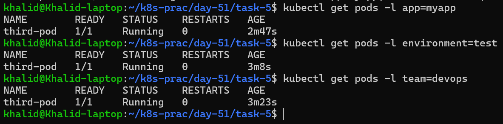

# Day 51 – Kubernetes Manifests and My First Pods

## 📊 Task-wise Summary

| Task | Topic | What I Did | Link |
|------|------|------------|------|
| Task 1 | Nginx Pod | Created and verified first Pod | [Go to Task 1](#task-1-create-my-first-pod-nginx) |
| Task 2 | BusyBox Pod | Ran custom command in container | [Go to Task 2](#task-2-create-a-custom-pod-busybox) |
| Task 3 | Imperative vs Declarative | Compared CLI vs YAML approaches | [Go to Task 3](#task-3-imperative-vs-declarative) |
| Task 4 | Validation | Used dry-run to validate YAML | [Go to Task 4](#task-4-validate-before-applying) |
| Task 5 | Labels | Added and filtered labels | [Go to Task 5](#task-5-labels-and-filtering) |
| Task 6 | Cleanup | Deleted all resources | [Go to Task 6](#task-6-clean-up) |
## Overview

In this task, I learned how to:
- Create Pods using YAML manifests
- Work with containers inside Pods
- Use labels for organization and filtering
- Understand imperative vs declarative approaches
- Validate configurations before applying
- Clean up resources

---

What I am going to Learn (Important) in Task-1
- I will deploy a Pod using declarative YAML
- Kubernetes will pull and run a container for me
- I will access the container internally
- I will verify service from inside the Pod

## Task 1: Nginx Pod (Quick Summary)

| Step                | Command / File                          | Purpose                                      |
|---------------------|----------------------------------------|----------------------------------------------|
| Create YAML         | nginx-pod.yml                         | Define the Pod configuration                 |
| Apply Manifest      | kubectl apply -f nginx-pod.yml        | Create the Pod in the cluster                |
| Check Pods          | kubectl get pods                       | Verify Pod status                            |
| Detailed View       | kubectl get pods -o wide               | See IP and Node info                         |
| Describe Pod        | kubectl describe pod nginx-pod         | Debug and view events                        |
| Check Logs          | kubectl logs nginx-pod                 | View container output                        |
| Access Container    | kubectl exec -it nginx-pod -- /bin/sh  | Enter inside the container                   |
| Test Nginx          | curl localhost:80                      | Verify Nginx is running                      |
| Exit Container      | exit                                   | Leave the container                          |

## Task 1: Create My First Pod (Nginx)

### 1. Create the YAML file 
Pod Manifest (nginx-pod.yaml)\
Create a file called `nginx-pod.yml`:\
[Plain nginx-pod.yml ](plain-yml/nginx-pod-plain.yml)
```yaml
apiVersion: v1          # Specifies the Kubernetes API version being used
kind: Pod               # Defines the type of resource (Pod = smallest deployable unit)
metadata:
  name: nginx-pod       # Name of the Pod
  labels:
    app: nginx          # Label used to identify/group this Pod (useful for selectors/services)

spec:                   # Specification of the desired state of the Pod
  containers:
  - name: nginx         # Name of the container inside the Pod
    image: nginx:latest # Docker image to run (latest version of Nginx)
    ports:
    - containerPort: 80 # Port exposed by the container (HTTP default port)
```

### 2. Apply the manifest
```bash
kubectl apply -f nginx-pod.yml
```
```text
pod/nginx-pod created
```

### 3. Verify Pod is running
```bash
kubectl get pods
```
```text
NAME        READY   STATUS    RESTARTS   AGE
nginx-pod   1/1     Running   0          2m41s
```

For more detail:
```bash
kubectl get pods -o wide
```
It lists pods with additional details like node location and pod IP, which helps in debugging, networking, and understanding where workloads are running in the cluster.

### kubectl get pods -o wide (Quick Explanation)

| Column            | Meaning                                                                 |
|------------------|-------------------------------------------------------------------------|
| NAME             | Name of the Pod                                                         |
| READY            | Number of containers ready vs total (e.g., 1/1)                         |
| STATUS           | Current state (Running, Pending, CrashLoopBackOff, etc.)                |
| RESTARTS         | Number of times containers have restarted                               |
| AGE              | How long the Pod has been running                                       |
| IP               | Internal Pod IP (used for communication inside the cluster)             |
| NODE             | Node (machine) where the Pod is running                                 |
| NOMINATED NODE   | Used for advanced scheduling (usually none)                             |
| READINESS GATES  | Advanced readiness checks (rarely used in basic setups)                 |

```text
NAME        READY   STATUS    RESTARTS   AGE    IP           NODE                           NOMINATED NODE   READINESS GATES
nginx-pod   1/1     Running   0          4m6s   10.244.0.5   devops-cluster-control-plane   <none>           <none>
```

### 4. Inspect the Pod
```bash
kubectl describe pod nginx-pod
```
This shows:
- Events (pulling image, starting container)
- IP address
- Node info

```text
Name:             nginx-pod
Namespace:        default
Priority:         0
Service Account:  default
Node:             devops-cluster-control-plane/172.19.0.2
Start Time:       Sat, 21 Mar 2026 20:28:34 -0500
Labels:           app=nginx
Annotations:      <none>
Status:           Running
IP:               10.244.0.5
IPs:
  IP:  10.244.0.5
Containers:
  nginx:
    Container ID:   containerd://
...
```

### 5. Check logs
```bash
kubectl logs nginx-pod
```
```text
/docker-entrypoint.sh: /docker-entrypoint.d/ is not empty, will attempt to perform configuration
/docker-entrypoint.sh: Looking for shell scripts in /docker-entrypoint.d/
/docker-entrypoint.sh: Launching /docker-e
...
```

### 6. Enter the container
```bash
kubectl exec -it nginx-pod -- /bin/bash
```
```text
root@nginx-pod:/# ls
bin   docker-entrypoint.d   home   mnt   product_name  run   sys  var
boot  docker-entrypoint.sh  lib    opt   product_uuid  sbin  tmp
dev   etc                   media  proc  root          srv   usr
```

### Test Nginx inside the pod
Inside the container:
```bash
curl localhost:80
```
```text
<!DOCTYPE html>
<html>
<head>
<title>Welcome to nginx!</title>
...
```

### 8. Exit container
```bash
exit
```
---

## Task 2: Create a Custom Pod (BusyBox)
## BusyBox Pod (Quick Summary)

| Step             | Command / File                           | Purpose                          |
|------------------|-----------------------------------------|----------------------------------|
| Create YAML      | busybox-pod.yaml                        | Define custom Pod                |
| Apply Manifest   | kubectl apply -f busybox-pod.yaml       | Create Pod                       |
| Check Pods       | kubectl get pods                        | Verify status                    |
| Check Logs       | kubectl logs busybox-pod                | See output message               |

### BusyBox container?
- A BusyBox container is a lightweight Linux container that provides basic Unix utilities in a single small executable.
- It’s like a mini Linux toolkit in one tiny container
- BusyBox containers exit immediately unless given a long-running command.  
- The `command` field allows overriding default container behavior.
- Use BusyBox when you want to:
  - Debug pods/services
  - Run simple scripts
  - Test Kubernetes networking

### 1. Create the YAML (from scratch)
```
vim busybox-pod.yml
```
[plain busybox-pod.yml](plain-yml/busybox-pod-plain.yml)
```YAML
apiVersion: v1                    # Kubernetes API version
kind: Pod                         # Resource type (Pod = single container or group of containers)
metadata:
  name: busybox-pod               # Name of the Pod
  labels:
    app: busybox                  # Label to identify the app
    environment: dev              # Label to indicate environment (dev/test/prod)

spec:                             # Desired state of the Pod
  containers:
  - name: busybox                 # Name of the container
    image: busybox:latest         # Lightweight BusyBox image (commonly used for testing/debugging)
    command:                      # Command to run inside the container
      - "sh"                      # Use shell
      - "-c"                      # Pass command as string
      - "echo Hello from BusyBox && sleep 3600"
      # Prints a message, then keeps container alive for 1 hour (3600 seconds)
```
### Quick understanding
This Pod:
- Runs a BusyBox container
- Prints: "Hello from BusyBox"
- Then stays alive for 1 hour (so I can inspect it)

### Apply the manifest
```bash
kubectl apply -f busybox-pod.yml
```
```text
pod/busybox-pod created
```
[step by step explanation of kubectl apply -f busybox-pod.yml](md/kubectl-apply-step-by-step.md)

### 3. Verify Pod status
```bash
kubectl get pods
```

```text
NAME          READY   STATUS    RESTARTS   AGE
busybox-pod   1/1     Running   0          85m
nginx-pod     1/1     Running   0          14h
```

### 4. Check logs (MOST IMPORTANT STEP)
```bash
kubectl logs busybox-pod
```

```text
Hello from BusyBox
```
### Important Concept (Don’t Skip This)
Why we used `command`

BusyBox is not a server like nginx.
- Nginx → runs continuously (web server)
- BusyBox → runs a command and exits

If you didn’t include:
```YAML
command: ["sh", "-c", "echo Hello from BusyBox && sleep 3600"]
```
Then:
- Container runs → prints → exits immediately ❌
- Kubernetes restarts it again → ❌
- Result = `CrashLoopBackOff`

### What this command does
```bash
echo Hello from BusyBox && sleep 3600
```
Step-by-step:
1. Prints message → visible in logs
2. Sleeps for 1 hour → keeps container alive

### Final Verification

✔ Pod status = `Running`\
✔ Logs show:
```text
Hello from BusyBox
```

---

## Task 3: Imperative vs Declarative
I am now learning the difference between:

Declarative → I write the desired state in YAML\
Imperative → I give a direct command to create something immediately

That distinction matters a lot in Kubernetes.

## Task 3: Imperative vs Declarative (Quick Summary)

| Step | Command | Purpose |
|------|---------|---------|
| Create Pod imperatively | `kubectl run redis-pod --image=redis:latest` | Create Pod without YAML |
| Verify Pod | `kubectl get pods` | Check Pod status |
| Extract live YAML | `kubectl get pod redis-pod -o yaml` | View full Kubernetes-generated manifest |
| Generate YAML only | `kubectl run test-pod --image=nginx --dry-run=client -o yaml` | Preview manifest without creating Pod |
| Save dry-run output | `kubectl run test-pod --image=nginx --dry-run=client -o yaml > test-pod.yaml` | Store generated YAML in a file |

### Comparison
| Feature         | Imperative    | Declarative                  |
| --------------- | ------------- | ---------------------------- |
| Method          | CLI command   | YAML file                    |
| Use case        | Quick testing | Production / version control |
| Flexibility     | Limited       | High                         |
| Reproducibility | Low           | High                         |


### Imperative Example

Create a Pod directly from the command line without writing YAML first:

```bash
kubectl run redis-pod --image=redis:latest
```

Check the Pod:

```bash
kubectl get pods
```

Extract its full YAML:

```bash
kubectl get pod redis-pod -o yml
```

This shows that Kubernetes automatically adds extra metadata such as `uid`, `resourceVersion`, `creationTimestamp`, and `status`.

---

### Dry-Run YAML Generation

Generate a Pod manifest without creating the Pod:

```bash
kubectl run test-pod --image=nginx --dry-run=client -o yml
```

Save it to a file:

```bash
kubectl run test-pod --image=nginx --dry-run=client -o yaml > test-pod.yml
```

This is useful for scaffolding a manifest quickly and then customizing it manually.

---

### Imperative vs Declarative

| Approach      | Example Command                              | Description |
|---------------|----------------------------------------------|-------------|
| Imperative    | `kubectl run redis-pod --image=redis:latest` | Creates resources directly using commands |
| Declarative   | `kubectl apply -f nginx-pod.yml`            | Creates or updates resources from YAML files |

---

### Comparison with Handwritten Manifest

#### Same fields
- `apiVersion`
- `kind`
- `metadata.name`
- `spec.containers`
- container `image`

#### Different fields
- Dry-run output may include default values such as `restartPolicy`
- Handwritten YAML includes custom fields like labels and ports only if you add them
- Live output from `kubectl get pod -o yml` includes runtime metadata such as:
  - `uid`
  - `resourceVersion`
  - `creationTimestamp`
  - `status`

### Conclusion

Declarative configuration is preferred for real-world Kubernetes because it is easier to track, edit, and store in version control.\
Imperative commands are useful for quick testing and for generating starter YAML using `--dry-run=client -o yml`.

**Q. What fields are the same? What is different?**\
**A. The same fields are `apiVersion`, `kind`, `metadata.name`, and `spec.containers.image`. The differences are that dry-run output may include default values like `restartPolicy`, while the live YAML from Kubernetes includes extra system-generated metadata such as `uid`, `resourceVersion`, `creationTimestamp`, and `status`.**

---

## Task 4: Validate Before Applying
### 1. Client-side validation
```bash
kubectl apply -f nginx-pod.yml --dry-run=client
```
What it does:
- Checks YAML structure locally
- Does NOT contact the cluster
- Fast validation

---

## Task 4: Validation (Quick Summary)

| Command | Purpose |
|--------|--------|
| kubectl apply --dry-run=client | Validate locally |
| kubectl apply --dry-run=server | Validate with cluster |
| Remove image field | Simulate error |
| Error observed | Missing required field "image" |

### 1. Client-side validation
```bash
kubectl apply -f nginx-pod.yml --dry-run=client
```
```text
pod/nginx-pod configured (dry run)
```
What it does:
- Checks YAML structure locally
- Does NOT contact the cluster
- Fast validation

### 2. Server-side validation
```bash
kubectl apply -f nginx-pod.yml --dry-run=server
```
```text
pod/nginx-pod unchanged (server dry run)
```
What it does:
- Sends request to Kubernetes API
- Validates against actual cluster rules
- More accurate

### 3. Now Break the YAML (Important Part)
Edit my file:
```bash
vim nginx-pod.yml
```
Remove this line:
```YAML
image: nginx:latest
```
Now my container looks like:
```YAML
containers:
- name: nginx
  ports:
  - containerPort: 80
```
Run dry-run again
```bash
kubectl apply -f nginx-pod.yml --dry-run=client
```
```text
pod/nginx-pod configured (dry run)
```
Why you DIDN’T get an error

I ran:
```bash
kubectl apply -f nginx-pod.yml --dry-run=client
```
And it said:
```text
pod/nginx-pod configured (dry run)
```
**Even though image is missing.**

What’s happening?

Client-side dry-run is NOT strict validation
- It only checks:
  - YAML syntax ✅
  - Basic structure ✅
- It does NOT fully validate required fields

So it missed the missing `image`.

**Now run the correct validation**/
Try this:
```bash
kubectl apply -f nginx-pod.yml --dry-run=server
```
**Expected output**
```text
The Pod "nginx-pod" is invalid: spec.containers[0].image: Required value
```

**Key Learning (Very Important)**

| Validation Type    | Behavior                                      |
| ------------------ | --------------------------------------------- |
| `--dry-run=client` | Checks syntax only (weak validation)          |
| `--dry-run=server` | Full validation using Kubernetes API (strict) |

**Real-World Rule**

Always trust:
```bash
kubectl apply --dry-run=server
```
**NOT just client.**

**Q. Why did client dry-run not fail?**\
**A.Client-side dry-run performs only basic validation, while server-side dry-run validates against the Kubernetes API schema, which enforces required fields like `image`.**

**Why This Matters**
- Every container must have an image
- Kubernetes cannot run a container without it
- Validation prevents bad configs from being applied

---

## Task 5: Labels and Filtering

### Commands Will Use

| Command | Purpose |
|--------|--------|
| kubectl get pods --show-labels | Show all labels |
| kubectl get pods -l app=nginx | Filter by app |
| kubectl get pods -l environment=dev | Filter by environment |
| kubectl label pod nginx-pod environment=production | Add label |
| kubectl label pod nginx-pod environment- | Remove label |

---

### 1. View all pod labels
```bash
kubectl get pods --show-labels
```
```text
NAME          READY   STATUS    RESTARTS      AGE   LABELS
busybox-pod   1/1     Running   5 (33m ago)   12h   app=busybox,environment=dev
nginx-pod     1/1     Running   0             25h   app=nginx
redis-pod     1/1     Running   0             10h   run=redis-pod
```

### 2. Filter pods using labels
**Filter by app**
```bash
kubectl get pods -l app=nginx
```
### `-l app=nginx`
**This is a label selector**
It means:

**“Show me only Pods where label `app=nginx` exists”**
```text
NAME        READY   STATUS    RESTARTS   AGE
nginx-pod   1/1     Running   0          25h
```
**Filter by environment**
```bash
kubectl get pods -l environment=dev
```
```text
NAME          READY   STATUS    RESTARTS      AGE
busybox-pod   1/1     Running   5 (40m ago)   12h
```

### 3. Add a label to an existing pod
```bash
kubectl label pod nginx-pod environment=production
```
```text
pod/nginx-pod labeled
```

### 4. Verify label added
```bash
kubectl get pods --show-labels
```
Now nginx-pod should show:
```text
NAME          READY   STATUS    RESTARTS      AGE   LABELS
busybox-pod   1/1     Running   5 (48m ago)   12h   app=busybox,environment=dev
nginx-pod     1/1     Running   0             26h   app=nginx,environment=production
redis-pod     1/1     Running   0             10h   run=redis-pod
```

### 5. Remove a label
```bash
kubectl label pod nginx-pod environment-
```
Yes, the `-` removes the label.

---

### Create Third Pod (My Own Manifest)
Third Pod Manifest
```YAML
apiVersion: v1
kind: Pod
metadata:
  name: third-pod
  labels:
    app: myapp
    environment: test
    team: devops
spec:
  containers:
  - name: nginx
    image: nginx:latest
    ports:
    - containerPort: 80
```
**Apply it**
```bash
kubectl apply -f third-pod.yaml
```
```text
pod/third-pod created
```
**Verify**
```bash
kubectl get pods --show-labels
```
```text
third-pod     1/1     Running   0               68s   app=myapp,environment=test,team=devops
```
**Practice filtering**
```bash
kubectl get pods -l app=myapp
kubectl get pods -l environment=test
kubectl get pods -l team=devops
```


**Verification**

✔ Third pod created\
✔ Has at least 3 labels\
✔ Can filter using each label

---

## Task 6: Clean Up

### Commands Used

| Command                          | Purpose                        |
| -------------------------------- | ------------------------------ |
| kubectl delete pod <name>        | Delete a specific Pod          |
| kubectl delete -f file.yaml      | Delete resource using manifest |
| kubectl delete pods --all        | Delete all Pods in namespace   |
| kubectl get pods                 | Verify deletion                |
| kubectl delete deployment <name> | Delete Deployment and its Pods |

---

### Delete All Pods
```bash
kubectl delete pods --all
```
```text
pod "busybox-pod" deleted from default namespace
pod "nginx-pod" deleted from default namespace
pod "redis-pod" deleted from default namespace
pod "third-pod" deleted from default namespace
```
### Verify Deletion
```bash
No resources found in default namespace.
```
```text
No resources found in default namespace.
```
### Result
- All Pods were successfully deleted  
- No resources remain in the cluster  

---

### Key Observation
- Standalone Pods are not recreated after deletion
- Kubernetes does not maintain them without a controller
- Deployments automatically recreate Pods when deleted

## Final Conclusion

In this lab, I successfully:
- Created and managed multiple Pods
- Understood Kubernetes manifest structure
- Used labels for filtering and organization
- Compared imperative and declarative approaches
- Validated configurations before applying
- Cleaned up resources properly

This builds a strong foundation for working with Deployments in the next stage.


