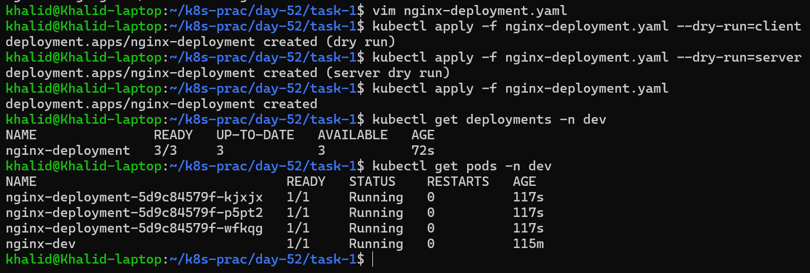
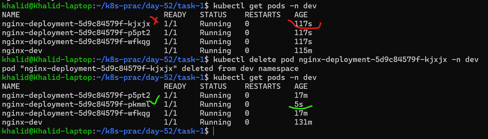
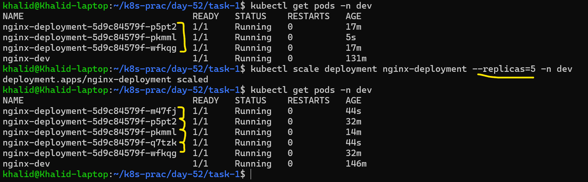
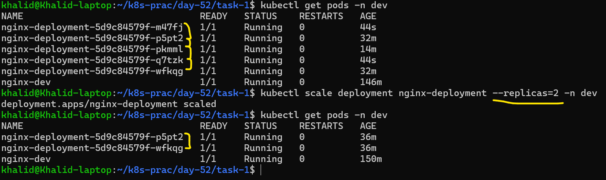
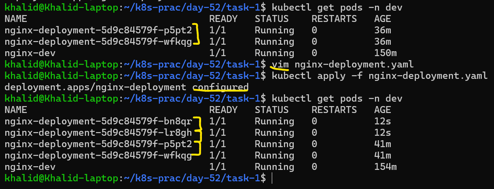
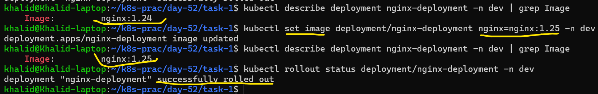
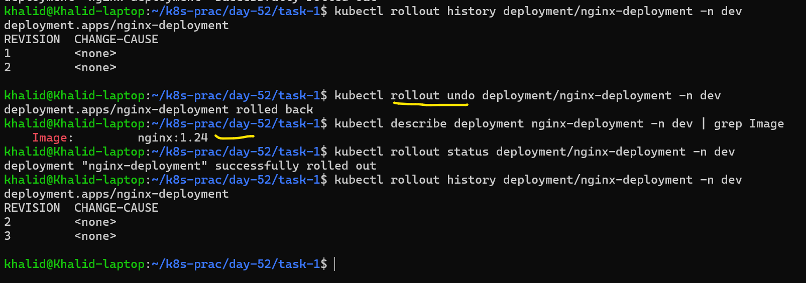

# Day 52 – Kubernetes Namespaces and Deployments

## Table of Contents


---

###  Tasks

1. [Task 1: Explore Default Namespaces](#task-1-explore-default-namespaces)
2. [Task 2: Create and Use Custom Namespaces](#task-2-create-and-use-custom-namespaces)
3. [Task 3: Create Your First Deployment](#task-3-create-your-first-deployment)
4. [Task 4: Self-Healing — Delete a Pod and Watch It Come Back](#task-4-self-healing--delete-a-pod-and-watch-it-come-back)
5. [Task 5: Scale the Deployment](#task-5-scale-the-deployment)
6. [Task 6: Rolling Update and Rollback](#task-6-rolling-update-and-rollback)
7. [Task 7: Clean Up](#task-7-clean-up)

---

##  Summary

In this lab, I learned the core concepts of Kubernetes resource management and application lifecycle:

* **Namespaces** → Used to organize and isolate resources within a cluster
* **Deployments** → Manage applications with self-healing and desired state
* **Self-Healing** → Automatically recreates Pods if they fail or are deleted
* **Scaling** → Adjusts the number of running Pods dynamically
* **Rolling Updates** → Updates applications with zero downtime
* **Rollback** → Reverts to a previous stable version if needed
* **Cleanup** → Removes resources and namespaces safely

This exercise demonstrated how Kubernetes maintains system stability and ensures applications remain available even during failures or updates.


## Task 1: Explore Default Namespaces
### Step 1: What is a Namespace?

A namespace in Kubernetes is like a logical partition inside a cluster. It helps you:
- Organize resources (pods, services, deployments)
- Avoid naming conflicts
- Separate environments (dev, test, prod)
- Control access (RBAC)

### List Default Namespaces
```bash
kubectl get namespaces
```
This command asks Kubernetes to list all namespaces in your cluster.

### Output

```
NAME                 STATUS   AGE
default              Active   43h
kube-node-lease      Active   43h
kube-public          Active   43h
kube-system          Active   43h
local-path-storage   Active   43h
```
- `default` — where your resources go if you do not specify a namespace
- `kube-system` — Kubernetes internal components (API server, scheduler, etc.)
- `kube-public` — publicly readable resources
- `kube-node-lease` — node heartbeat tracking
### Explanation of Default Namespaces

1. **default**
- The default namespace where resources are created if no namespace is specified.
- Most beginner workloads run here.

Example:
```bash
kubectl run nginx --image=nginx
```
This goes into `default` unless you specify another namespace.

2. **kube-system**
- Contains core Kubernetes components
- Examples:
  - DNS (CoreDNS)
  - kube-proxy
  - controller manager

Usually don’t touch this namespace manually.

3. **kube-public**
- Accessible by all users (even unauthenticated in some setups)
- Stores public cluster info (rarely used in practice)

4. **kube-node-lease**
- Used internally for node heartbeats
- Helps Kubernetes know if a node is alive or not
- Improves cluster performance vs older methods

5. **local-path-storage**
- Created by local storage provisioners (like in Minikube, K3s, or local setups)
- Used for dynamic volume provisioning
- Stores PersistentVolume data on local disk

6. **Key Takeaway**

Your cluster currently has:
- 4 default system namespaces (created automatically)
- 1 storage-related namespace (local-path-storage)
- No custom namespaces yet
---

### Step 2: Check Pods in kube-system

```bash
kubectl get pods -n kube-system
```

### Output

```
NAME                                                   READY   STATUS    RESTARTS        AGE
coredns-7d764666f9-4rpz4                               1/1     Running   1 (5h43m ago)   2d1h
coredns-7d764666f9-5dh2l                               1/1     Running   1 (5h43m ago)   2d1h
etcd-devops-cluster-control-plane                      1/1     Running   1 (5h43m ago)   2d1h
kindnet-klvmw                                          1/1     Running   1 (5h43m ago)   2d1h
kube-apiserver-devops-cluster-control-plane            1/1     Running   1 (5h43m ago)   2d1h
kube-controller-manager-devops-cluster-control-plane   1/1     Running   1 (5h43m ago)   2d1h
kube-proxy-plp75                                       1/1     Running   1 (5h43m ago)   2d1h
kube-scheduler-devops-cluster-control-plane            1/1     Running   1 (5h43m ago)   2d1h
```
This command lists all pods running in the kube-system namespace, which contains core Kubernetes components required for the cluster to function.

These are the control plane components keeping your cluster alive. Do not touch them.

### Final Takeaway
The `kube-system` namespace contains critical system components:
- Control Plane → API server, scheduler, controller manager
- Storage → etcd
- Networking → kube-proxy, kindnet
- DNS → CoreDNS
If these pods are healthy, your cluster is healthy.

---

### Step 3: Count the Pods 
To answer the verification question:

**Option 1: Manual Count**

Just count the rows in the output (excluding header).

**Option 2: Faster (recommended)**

```bash
kubectl get pods -n kube-system --no-headers | wc -l
```
```text
8
```

### Notes

* The `kube-system` namespace contains critical components.
* These pods should not be modified or deleted, as they are essential for cluster functionality.

---

## Task 2: Create and Use Custom Namespaces
Normally:
```bash
kubectl get pods
```
Shows pods only in the default namespace
``text
No resources found in default namespace.
```
With `-A`or `--all-namespaces`:
```bash
kubectl get pods -A
OR
kubectl get pods --all-namespaces
```
`kubectl get pods -A` = See every pod in the entire cluster\
Shows pods in:
- default
- kube-system
- kube-public
- any custom namespaces

### Create Namespaces

Commands used:

```bash id="1a2b3c"
kubectl create namespace dev
kubectl create namespace staging
```

### Verify Namespaces

```bash id="4d5e6f"
kubectl get namespaces
```
```text
NAME                 STATUS   AGE
default              Active   2d2h
dev                  Active   71s
kube-node-lease      Active   2d2h
kube-public          Active   2d2h
kube-system          Active   2d2h
local-path-storage   Active   2d2h
staging              Active   38s
```

### Create Namespace Using Manifest

**namespace.yaml**

```yaml id="7g8h9i"
apiVersion: v1
kind: Namespace
metadata:
  name: production
```

Apply the manifest:

```bash id="0j1k2l"
kubectl apply -f namespace.yaml
```
```text
namespace/production created
---
### Verify it
```bash
kubectl get namespaces
```
```text
NAME                 STATUS   AGE
......
production           Active   4m45s
.....
```

### Run Pods in Specific Namespaces

```bash id="3m4n5o"
kubectl run nginx-dev --image=nginx:latest -n dev
kubectl run nginx-staging --image=nginx:latest -n staging
```
This command creates a Pod running an Nginx container named `nginx-dev/nginx-staging` inside the `dev/staging` namespace. Quick way to launch a container.

Tells Kubernetes to create the pod in the dev/staging namespace
Without this, it would go into the `default` namespace

---

### List Pods Across Namespaces

```bash id="6p7q8r"
kubectl get pods -A
```
```text
NAMESPACE            NAME                                                   READY   STATUS    RESTARTS     AGE
dev                  nginx-dev                                              1/1     Running   0            58m
kube-system          coredns-7d764666f9-4rpz4                               1/1     Running   1 (8h ago)   2d4h
kube-system          coredns-7d764666f9-5dh2l                               1/1     Running   1 (8h ago)   2d4h
kube-system          etcd-devops-cluster-control-plane                      1/1     Running   1 (8h ago)   2d4h
kube-system          kindnet-klvmw                                          1/1     Running   1 (8h ago)   2d4h
kube-system          kube-apiserver-devops-cluster-control-plane            1/1     Running   1 (8h ago)   2d4h
kube-system          kube-controller-manager-devops-cluster-control-plane   1/1     Running   1 (8h ago)   2d4h
kube-system          kube-proxy-plp75                                       1/1     Running   1 (8h ago)   2d4h
kube-system          kube-scheduler-devops-cluster-control-plane            1/1     Running   1 (8h ago)   2d4h
local-path-storage   local-path-provisioner-67b8995b4b-vvj45                1/1     Running   1 (8h ago)   2d4h
staging              nginx-staging                                          1/1     Running   0            8s
```
```bash
kubectl get pods -n staging
```
```text
NAME            READY   STATUS    RESTARTS   AGE
nginx-staging   1/1     Running   0          3m1s
```
---

### Verification

* `kubectl get pods`:

  * Shows pods only in the **default namespace**
  * Does **not** display `nginx-dev` or `nginx-staging`

* `kubectl get pods -n staging`

  * Shows pods only in the **staging namespace**

* `kubectl get pods -A`:

  * Shows pods across **all namespaces**
  * Displays both `nginx-dev` and `nginx-staging`

---

### Key Learning

* Namespaces help isolate resources within a cluster.
* By default, Kubernetes operates in the `default` namespace.
* To view or manage resources in other namespaces:

  * Use `-n <namespace>` for a specific namespace
  * Use `-A` for all namespaces

---

## Task 3: Create Your First Deployment

### Deployment Manifest
[Explanation of nginx-deployment.yaml ](md/kubernetes_deployment_explanation_detailed_markdown.md)

**nginx-deployment.yaml**

```yaml id="dep123"
apiVersion: apps/v1
kind: Deployment
metadata:
  name: nginx-deployment
  namespace: dev
  labels:
    app: nginx
spec:
  replicas: 3
  selector:
    matchLabels:
      app: nginx
  template:
    metadata:
      labels:
        app: nginx
    spec:
      containers:
      - name: nginx
        image: nginx:1.24
        ports:
        - containerPort: 80
```

---

### Apply Deployment

```bash id="apply123"
kubectl apply -f nginx-deployment.yaml
```
```text
deployment.apps/nginx-deployment created
```

---

### Verify Deployment

```bash id="check123"
kubectl get deployments -n dev
kubectl get pods -n dev
```
Expected: 3 pods running with names like:



---

### Explanation of Key Fields

* **apiVersion: apps/v1**\
  Required API version for Deployments.\
  apiVersion = Instruction for Kubernetes API\
  It tells:\
  “How should I understand this YAML?”

* **kind: Deployment**
  Defines a Deployment resource.

* **metadata**
  Contains name, namespace, and labels.

* **replicas: 3**
  Ensures 3 identical Pods are always running.

* **selector.matchLabels**
  Connects the Deployment to the Pods it manages.

* **template**
  Blueprint for creating Pods.

* **containers**
  Defines container image (`nginx:1.24`) and exposed port.

---

### Verification

Deployment output columns:

* **READY**
  Number of Pods ready vs desired (e.g., 3/3 means all Pods are healthy)

* **UP-TO-DATE**
  Number of Pods running the latest configuration

* **AVAILABLE**
  Number of Pods available to serve traffic

---

### Key Learning

* Deployments automatically recreate Pods if they fail.
* They maintain the desired number of replicas.
* They enable scaling and rolling updates.

---

## Task 4: Self-Healing — Delete a Pod and Watch It Come Back

### List Pods

```bash id="t4cmd1"
kubectl get pods -n dev
```

---

### Delete a Pod

```bash id="t4cmd2"
kubectl delete pod nginx-deployment-5d9c84579f-kjxjx -n dev
```

---

### Check Pods Again

```bash id="t4cmd3"
kubectl get pods -n dev
```

---

### Observation

* After deleting one Pod, a new Pod is automatically created.
* The total number of Pods remains equal to the desired replicas (3).

---

### Verification

* The replacement Pod has a **different name** from the deleted Pod.

---

### Explanation

* Deployments manage Pods through ReplicaSets.
* When a Pod is deleted, the ReplicaSet detects that the number of running Pods is below the desired count.
* It immediately creates a new Pod to maintain the desired state.
* The new Pod gets a new unique name.

---

### Key Learning

* Pods are ephemeral and can be replaced at any time.
* Deployments provide self-healing capabilities.
* Kubernetes ensures the desired state is always maintained automatically.

## Real-world takeaway

This is why Kubernetes is powerful:

Even if a pod crashes, gets deleted, or a node dies → your app keeps running

---

## Task 5: Scale the Deployment

### Scale Up

```bash id="scaleup123"
kubectl scale deployment nginx-deployment --replicas=5 -n dev
kubectl get pods -n dev
```


Observation:

* Kubernetes created additional Pods to reach 5 replicas.

---

### Scale Down

```bash id="scaledown123"
kubectl scale deployment nginx-deployment --replicas=2 -n dev
kubectl get pods -n dev
```


Observation:

* Kubernetes terminated extra Pods to reduce the count to 2 replicas.

---

### Declarative Scaling

I can also scale by modifying the YAML file:

```yaml id="declscale123"
replicas: 4
```

Then apply:

```bash id="applyscale123"
kubectl apply -f nginx-deployment.yaml
```


---

### Verification

* When scaling down from 5 to 2:

  * The extra Pods were **automatically terminated**.

---

### Explanation

* Kubernetes compares the desired state (replicas) with the current state.
* If there are more Pods than needed, it deletes the excess Pods.
* If there are fewer Pods, it creates new ones.

---

### Key Learning

* Scaling can be done **imperatively** (kubectl scale) or **declaratively** (YAML).
* Kubernetes automatically adjusts resources to match the desired state.
* This ensures efficient resource usage.

### Big Picture (what I just learned today)

I now understand:
- Namespaces → isolation
- Deployments → self-healing
- Scaling → dynamic control

That’s literally core Kubernetes fundamentals

---

## Task 6: Rolling Update and Rollback
A rolling update means:

Kubernetes updates your application gradually, without stopping everything.

A rollback means:

Go back to the previous working version if something breaks.

### Easiest Way to chek the nginx-deployment version
```bash
kubectl describe deployment nginx-deployment -n dev | grep Image
```
```text
Image: nginx:1.24
```
This tells you the current image version running

### Update the Deployment Image

```bash
kubectl set image deployment/nginx-deployment nginx=nginx:1.25 -n dev
```

---

### Watch Rollout Status

```bash
kubectl rollout status deployment/nginx-deployment -n dev
```


Observation:

* Kubernetes performs a **rolling update**.
* Pods are updated one by one.
* New Pods are created before old ones are deleted.
* This ensures **zero downtime**.

---

### Check Rollout History

```bash
kubectl rollout history deployment/nginx-deployment -n dev
```

Observation:

* Shows previous revisions of the Deployment.
* Each change creates a new revision.

---

### Roll Back to Previous Version

```bash
kubectl rollout undo deployment/nginx-deployment -n dev
kubectl rollout status deployment/nginx-deployment -n dev
```


Observation:

* Kubernetes restores the previous version of the application.
* Pods are again updated gradually.

---

### Verify Image After Rollback

```bash
kubectl describe deployment nginx-deployment -n dev | grep Image
```

Output:

```bash
Image: nginx:1.24
```

---

### Verification

* After rollback, the running image version is:

  * **nginx:1.24**

---

### Explanation

* **Rolling Update**:

  * Gradually replaces old Pods with new ones.
  * Ensures application availability during updates.

* **Rollback**:

  * Reverts the Deployment to the previous stable version.
  * Useful when a new update introduces issues.

---

### Key Learning

* Rolling updates allow safe, zero-downtime deployments.
* Rollbacks provide a quick recovery mechanism.
* Kubernetes automatically manages version history for Deployments.

---

## Task 7: Clean Up

### Delete Deployment

```bash id="del1"
kubectl delete deployment nginx-deployment -n dev
```
This command deletes a Deployment named `nginx-deployment` from the `dev` namespace.
```text
deployment.apps "nginx-deployment" deleted from dev namespace
```
---

### Delete Standalone Pods

```bash id="del2"
kubectl delete pod nginx-dev -n dev
kubectl delete pod nginx-staging -n staging
```
This command deletes a Pod named `nginx-dev/staging` from the `dev/staging` namespace.
```text
pod "nginx-dev" deleted from dev namespace
pod "nginx-staging" deleted from staging namespace
```

---

### Delete Namespaces

```bash id="del3"
kubectl delete namespace dev staging production
```
This command deletes multiple namespaces at once:
- dev
- staging
- production
```text
namespace "dev" deleted
namespace "staging" deleted
namespace "production" deleted
```
---

### Verify Cleanup

```bash id="verify1"
kubectl get namespaces
kubectl get pods -A
```
```text
NAME                 STATUS   AGE
default              Active   2d6h
kube-node-lease      Active   2d6h
kube-public          Active   2d6h
kube-system          Active   2d6h
local-path-storage   Active   2d6h
```

---

### Verification

* All custom namespaces (`dev`, `staging`, `production`) are deleted.
* All application Pods and Deployments are removed.
* Only default/system namespaces and Pods remain.

---

### Explanation

* Deleting a namespace removes all resources within it.
* This includes Pods, Deployments, and other objects.
* This operation should be used carefully, especially in production environments.

---

### Key Learning

* Kubernetes allows complete cleanup using namespace deletion.
* Namespaces act as logical boundaries for resources.
* Proper cleanup helps maintain a clean and organized cluster.

## Final Thought (important)

I just completed:

Namespaces ✅\
Deployments ✅\
Self-healing ✅\
Scaling ✅\
Rolling updates & rollback ✅\
Cleanup ✅

**This is literally core Kubernetes workflow**
