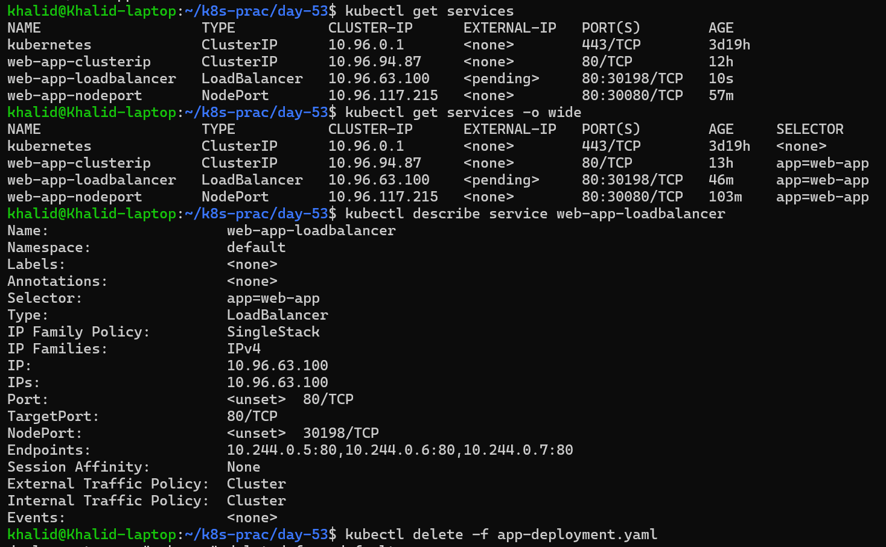

# Day 53 – Kubernetes Services

# Table of Contents

| Section              | Link                    | Summary                                                                 |
| -------------------- | ----------------------- | ----------------------------------------------------------------------- |
| **Project Overview** | [Go](#project-overview) | Explains why Kubernetes Services are needed and the problems they solve |
| **Objective**        | [Go](#objective)        | Describes the goals of Day 53 tasks                                     |
| **Key Definitions**  | [Go](#key-definitions)  | Covers Service, LoadBalancer, and Load Balancer concepts                |

---

## Tasks

| Task                                   | Link                                                     | Summary                                                               |
| -------------------------------------- | -------------------------------------------------------- | --------------------------------------------------------------------- |
| **Task 1: Deploy the Application**     | [Go](#task-1-deploy-the-application)                     | Created Deployment with 3 Pods and observed dynamic Pod IPs           |
| **Task 2: ClusterIP Service**          | [Go](#task-2-clusterip-service-internal-access)          | Exposed Pods internally and verified communication within the cluster |
| **Task 3: Discover Services with DNS** | [Go](#task-3-discover-services-with-dns)                 | Verified DNS resolution using short and full service names            |
| **Task 4: NodePort Service**           | [Go](#task-4-nodeport-service-external-access-via-node)  | Exposed application externally via `<NodeIP>:NodePort`                |
| **Task 5: LoadBalancer Service**       | [Go](#task-5-loadbalancer-service-cloud-external-access) | Created LoadBalancer Service and observed `<pending>` external IP     |
| **Task 6: Service Types Comparison**   | [Go](#task-6-understand-service-types-side-by-side)      | Compared all Service types and understood their hierarchy             |
| **Task 7: Clean Up**                   | [Go](#task-7-clean-up)                                   | Deleted all resources and verified clean cluster state                |

---

## 🔥 Quick Tip

* Click on **Go** to jump directly to the section
* Make sure headings match exactly for links to work

---


## Project Overview

In Kubernetes, Pods are temporary and their IP addresses are not stable. When a Pod restarts or gets replaced, its IP changes. Also, a Deployment runs multiple Pods, so it becomes unclear which Pod IP to connect to.

Kubernetes Services solve this problem by providing:

* A **stable IP address**
* A **DNS name**
* **Load balancing** across multiple Pods

This allows clients to communicate reliably with applications running inside the cluster.

---

## Objective

The goal of Day 53 is to:

* Understand why Services are needed
* Create different types of Services (ClusterIP, NodePort, LoadBalancer)
* Verify communication between Pods and Services
* Learn how Kubernetes handles service discovery

## Key Definitions

### 🔹 Service (Kubernetes Service)

**Definition:**
A Service in Kubernetes is an abstraction that provides a **stable IP address and DNS name** to access a group of Pods. It also performs **load balancing** across those Pods.

**Why it exists:**

* Pod IPs change (not stable)
* Multiple Pods exist (no single entry point)

A Service solves both problems.

**Analogy:**
Think of a Service like a **restaurant phone number 📞**

* Customers call the restaurant (Service)
* The restaurant assigns a waiter/driver (Pod)
* Customers don’t care which waiter — they just want service

---

### 🔹 Load Balancer (General Concept)

**Definition:**
A Load Balancer is a system that **distributes incoming traffic across multiple servers** to ensure reliability, scalability, and performance.

**Analogy:**
Think of a **traffic cop 🚦**

* Cars (requests) come in
* Cop directs them to different roads (servers)
* Prevents traffic jams and overload

---

### 🔹 LoadBalancer (Kubernetes Service Type)

**Definition:**
A LoadBalancer is a type of Kubernetes Service that:

* Exposes your application **to the internet**
* Provides a **public IP address**
* Uses a **cloud provider’s load balancer**
* Routes traffic to your Pods

**Analogy:**
Think of it like a **main entrance gate to a mall 🏢**

* People from outside (internet) enter through the gate
* Security/gate system (LoadBalancer) directs them inside
* Then they are distributed to different shops (Pods)

---

## Quick Summary

| Concept       | What it does                         | Analogy             |
| ------------- | ------------------------------------ | ------------------- |
| Service       | Stable access to Pods                | Restaurant phone 📞 |
| Load Balancer | Distributes traffic                  | Traffic cop 🚦      |
| LoadBalancer  | Public access + cloud load balancing | Mall entrance 🏢    |

---

## Task 1: Deploy the Application

### Deployment Configuration

We created a Deployment named **web-app** using the NGINX image with 3 replicas.

```yaml
apiVersion: apps/v1
kind: Deployment
metadata:
  name: web-app
  labels:
    app: web-app
spec:
  replicas: 3
  selector:
    matchLabels:
      app: web-app
  template:
    metadata:
      labels:
        app: web-app
    spec:
      containers:
      - name: nginx
        image: nginx:1.25
        ports:
        - containerPort: 80
```
[kubernetes_apply_explanation](md/kubernetes_apply_explanation.md)
[rest_api_kubernetes_notes](md/rest_api_kubernetes_notes.md)

---

### Commands Used

```bash
kubectl apply -f app-deployment.yaml
kubectl get pods -o wide
```

---

###  Output Verification

All 3 Pods are running successfully:

| Pod Name                 | Status  | IP         |
| ------------------------ | ------- | ---------- |
| web-app-6cffb4b956-cvmsz | Running | 10.244.0.5 |
| web-app-6cffb4b956-gn9nx | Running | 10.244.0.7 |
| web-app-6cffb4b956-wt5ln | Running | 10.244.0.6 |

---

###  Key Observations

* Each Pod has a **unique IP address**
* Pod IPs are **not stable**
* If a Pod restarts, its IP will change
* With multiple Pods, there is **no single stable endpoint**

This highlights the need for **Kubernetes Services**, which will be implemented in the next tasks.

---

# Task 2: ClusterIP Service (Internal Access)

### Overview

A `ClusterIP` Service is the default Kubernetes Service type. It creates a **stable internal IP and DNS name** that allows Pods inside the cluster to communicate reliably.

---

### Service Manifest

```yaml
apiVersion: v1
kind: Service
metadata:
  name: web-app-clusterip
spec:
  type: ClusterIP
  selector:
    app: web-app
  ports:
  - port: 80
    targetPort: 80
```

---

### Commands Used

```bash
kubectl apply -f clusterip-service.yaml
kubectl get services
```
```text
service/web-app-clusterip created
NAME                TYPE        CLUSTER-IP    EXTERNAL-IP   PORT(S)   AGE
kubernetes          ClusterIP   10.96.0.1     <none>        443/TCP   3d6h
web-app-clusterip   ClusterIP   10.96.94.87   <none>        80/TCP    11s
```

Testing from inside cluster:

```bash
kubectl run test-client --image=busybox:latest --rm -it --restart=Never -- sh
```
Creates a temporary interactive BusyBox Pod for testing.

Think:

“Launch a quick debug container → use it → auto-delete”

[kubectl_run_debug_notes](md/kubectl_run_debug_notes.md)

```text
All commands and output from this session will be recorded in container logs, including credentials and sensitive information passed through the command prompt.
If you don't see a command prompt, try pressing enter.
/ #
```
Inside pod:

```sh
wget -qO- http://web-app-clusterip
```

It sends an HTTP request to a Kubernetes Service (web-app-clusterip) and prints the response directly to the terminal.

```text
<!DOCTYPE html>
<html>
<head>
<title>Welcome to nginx!</title>
<style>
html { color-scheme: light dark; }
body { width: 35em; margin: 0 auto;
font-family: Tahoma, Verdana, Arial, sans-serif; }
</style>
</head>
<body>
<h1>Welcome to nginx!</h1>
<p>If you see this page, the nginx web server is successfully installed and
working. Further configuration is required.</p>

<p>For online documentation and support please refer to
<a href="http://nginx.org/">nginx.org</a>.<br/>
Commercial support is available at
<a href="http://nginx.com/">nginx.com</a>.</p>

<p><em>Thank you for using nginx.</em></p>
</body>
</html>
```

---

### Output Verification

* Service created successfully:

  * `web-app-clusterip` → `10.96.94.87`
* No external IP (correct for ClusterIP)

---

### Key Observations

* Service provides a **stable internal IP**
* DNS name `web-app-clusterip` works inside cluster
* No need to use Pod IPs
* Service automatically **load balances** across Pods

---

### Test Result

The request returned the **Nginx welcome page**, confirming:

* Service is reachable
* Selector matched Pods correctly
* Traffic was routed to one of the Pods

---

## Summary (So Far)

* Pods are **dynamic and unstable**
* Services provide a **stable entry point**
* ClusterIP allows **internal communication only**
* Kubernetes DNS resolves Service names automatically

---

# Task 3: Discover Services with DNS

## Overview

Kubernetes has a built-in DNS system that automatically assigns a DNS name to every Service. This allows Pods to communicate using Service names instead of relying on IP addresses.

Each Service gets a DNS entry in the format:

```
<service-name>.<namespace>.svc.cluster.local
```

For this project:

```
web-app-clusterip.default.svc.cluster.local
```

---

## Objective

* Verify Kubernetes DNS resolution
* Access Service using both short and full DNS names
* Confirm DNS resolves to the correct ClusterIP

---

## Commands Used

```bash
kubectl run dns-test --image=busybox:latest --rm -it --restart=Never -- sh
```

Inside the pod:

```sh
wget -qO- http://web-app-clusterip
```
```sh
wget -qO- http://web-app-clusterip.default.svc.cluster.local
```
This command accesses a Kubernetes service using its fully qualified DNS name, which includes service name, namespace, and cluster domain, ensuring proper resolution across namespaces.

wget stands for “Web Get” and is used to retrieve content from web servers via HTTP, HTTPS, or FTP.

```sh
nslookup web-app-clusterip
```
nslookup web-app-clusterip is used to verify that a Kubernetes Service name resolves to its ClusterIP via CoreDNS.

If this fails → DNS issue

---

## Output Verification

`nslookup` result:

```
Name:   web-app-clusterip.default.svc.cluster.local
Address: 10.96.94.87
```

---

## Key Observations

* DNS successfully resolved the Service name
* Returned IP (`10.96.94.87`) matches the Service ClusterIP
* Short name works within the same namespace
* Full DNS name works universally across namespaces
* NXDOMAIN messages appear because multiple DNS paths are attempted before resolution (this is normal)

---

## Conclusion

Kubernetes DNS enables seamless service discovery by allowing Pods to communicate using Service names instead of dynamic IP addresses, making the system more stable and scalable.

---

# Task 4: NodePort Service (External Access via Node)

## Overview

A `NodePort` Service exposes an application on a fixed port on every node in the Kubernetes cluster. This allows external access to the application using the node’s IP address and the specified port.

Traffic flow:

```id="flow4"
<NodeIP>:30080 -> Service -> Pod:80
```

---

## Objective

* Expose the application outside the cluster
* Access the Service using node IP and port
* Verify external connectivity

---

## Service Manifest

Create `nodeport-service.yaml`

```yaml id="np1"
apiVersion: v1
kind: Service
metadata:
  name: web-app-nodeport
spec:
  type: NodePort
  selector:
    app: web-app
  ports:
  - port: 80
    targetPort: 80
    nodePort: 30080
```

---

## Commands Used

```bash id="np2"
kubectl apply -f nodeport-service.yaml

kubectl get services

kubectl get nodes -o wide
```
```text
service/web-app-nodeport created

NAME                TYPE        CLUSTER-IP      EXTERNAL-IP   PORT(S)        AGE
kubernetes          ClusterIP   10.96.0.1       <none>        443/TCP        3d18h
web-app-clusterip   ClusterIP   10.96.94.87     <none>        80/TCP         11h
web-app-nodeport    NodePort    10.96.117.215   <none>        80:30080/TCP   10s

NAME                           STATUS   ROLES           AGE     VERSION   INTERNAL-IP   EXTERNAL-IP   OS-IMAGE                         KERNEL-VERSION                     CONTAINER-RUNTIME
devops-cluster-control-plane   Ready    control-plane   3d18h   v1.35.0   172.19.0.2    <none>        Debian GNU/Linux 12 (bookworm)   6.6.87.2-microsoft-standard-WSL2   containerd://2.2.0
```

Access the service:

```bash id="np3"
curl http://172.19.0.2:30080
```
```text
.....
<h1>Welcome to nginx!</h1>
....
```
---

## Output Verification

Service details:

* Name: `web-app-nodeport`
* Type: `NodePort`
* ClusterIP: `10.96.117.215`
* Port mapping: `80:30080/TCP`

Node details:

* Internal IP: `172.19.0.2`

---

## Test Result

Running:

```bash id="np4"
curl http://172.19.0.2:30080
```

returned the **Nginx welcome page**, confirming successful external access.

---

## Key Observations

* `NodePort` exposes the application outside the cluster
* The application is accessible via `<NodeIP>:30080`
* The Service forwards traffic to Pods using the selector `app: web-app`
* Load balancing still works across multiple Pods

---

## Conclusion

The `NodePort` Service successfully exposed the application externally, allowing access through the node’s IP address and port. This confirms that traffic is correctly routed from outside the cluster to the running Pods.

---

# Task 5: LoadBalancer Service (Cloud External Access)

## Overview

A `LoadBalancer` Service exposes an application to the internet using a cloud provider’s load balancer (AWS, GCP, Azure). It automatically provisions an external load balancer and assigns a public IP.

---

## Objective

* Create a LoadBalancer Service
* Observe external IP behavior
* Understand cloud vs local differences

---

## Service Manifest

```yaml
apiVersion: v1
kind: Service
metadata:
  name: web-app-loadbalancer
spec:
  type: LoadBalancer
  selector:
    app: web-app
  ports:
  - port: 80
    targetPort: 80
```

---

## Commands Used

```bash
kubectl apply -f loadbalancer-service.yaml
kubectl get services
```
```text
service/web-app-loadbalancer created
web-app-loadbalancer   LoadBalancer   10.96.63.100    <pending>     80:30198/TCP   10s
```

---

## Output Verification

Service details:

* Name: `web-app-loadbalancer`
* Type: `LoadBalancer`
* ClusterIP: `10.96.63.100`
* External IP: `<pending>`

---

## Key Observations

* The Service was created successfully
* Kubernetes attempted to provision an external load balancer
* The `EXTERNAL-IP` shows `<pending>`

---

## Why EXTERNAL-IP is `<pending>`

This cluster is running locally (Kind/WSL), not in a cloud environment.

* No cloud provider integration
* Kubernetes cannot create a real load balancer
* Therefore, the external IP remains `<pending>`

---

## Real Cloud Behavior

In AWS/GCP/Azure:

* A real load balancer is created automatically
* A public IP or hostname is assigned
* The application becomes accessible from the internet

---

## Conclusion

The `LoadBalancer` Service was created successfully, but since the cluster is running locally without cloud integration, the external IP remains `<pending>`. This behavior is expected and confirms understanding of how LoadBalancer works in different environments.

---

# Task 6: Understand Service Types Side by Side

## Overview

Kubernetes provides three main Service types: ClusterIP, NodePort, and LoadBalancer. Each type builds on the previous one and adds more accessibility.

A LoadBalancer Service internally creates a NodePort, which itself uses a ClusterIP.

---

## Comparison

| Type         | Accessible From                 | Use Case                |
| ------------ | ------------------------------- | ----------------------- |
| ClusterIP    | Inside the cluster only         | Internal communication  |
| NodePort     | Outside via <NodeIP>:<NodePort> | Development and testing |
| LoadBalancer | Outside via cloud load balancer | Production environments |

---

## Service Hierarchy

* ClusterIP → base Service
* NodePort → ClusterIP + external port
* LoadBalancer → NodePort + cloud integration

---

## Commands Used

```bash
kubectl get services -o wide
```
```text
NAME                   TYPE           CLUSTER-IP      EXTERNAL-IP   PORT(S)        AGE     SELECTOR
kubernetes             ClusterIP      10.96.0.1       <none>        443/TCP        3d19h   <none>
web-app-clusterip      ClusterIP      10.96.94.87     <none>        80/TCP         13h     app=web-app
web-app-loadbalancer   LoadBalancer   10.96.63.100    <pending>     80:30198/TCP   46m     app=web-app
web-app-nodeport       NodePort       10.96.117.215   <none>        80:30080/TCP   103m    app=web-app
```


```bash
kubectl describe service web-app-loadbalancer
```
```text
Name:                     web-app-loadbalancer
Namespace:                default
Labels:                   <none>
Annotations:              <none>
Selector:                 app=web-app
Type:                     LoadBalancer
IP Family Policy:         SingleStack
IP Families:              IPv4
IP:                       10.96.63.100
IPs:                      10.96.63.100
Port:                     <unset>  80/TCP
TargetPort:               80/TCP
NodePort:                 <unset>  30198/TCP
Endpoints:                10.244.0.5:80,10.244.0.6:80,10.244.0.7:80
Session Affinity:         None
External Traffic Policy:  Cluster
Internal Traffic Policy:  Cluster
Events:                   <none>
```

---

## Output Verification

The LoadBalancer Service showed:

* ClusterIP assigned
* NodePort assigned
* External IP as `<pending>`

Example:

* ClusterIP: `10.96.63.100`
* NodePort: `30198`

---

## Key Observations

* LoadBalancer includes both ClusterIP and NodePort
* Even without a cloud provider, NodePort still works
* Services are layered abstractions in Kubernetes

---

## Conclusion

Kubernetes Service types build on each other. A LoadBalancer Service internally uses NodePort and ClusterIP, providing multiple levels of access to the application depending on the environment.

---

# Task 7: Clean Up

## Overview

After completing all Kubernetes Service tasks, it is important to clean up all created resources. This ensures the cluster remains organized and free of unnecessary workloads.

---

## Objective

* Delete all created Deployments and Services
* Verify that no custom resources remain
* Confirm the cluster is returned to a clean state

---

## Commands Used

```bash
kubectl delete -f app-deployment.yaml
```
```text
deployment.apps "web-app" deleted from default namespace
```

kubectl delete -f removes all resources defined in the YAML file, and Kubernetes automatically cleans up dependent resources like ReplicaSets and Pods through cascading deletion.

[kubectl delete notes](md/kubectl_delete_notes.md)

```bash
kubectl delete -f clusterip-service.yaml
kubectl delete -f nodeport-service.yaml
kubectl delete -f loadbalancer-service.yaml
```
```text
service "web-app-clusterip" deleted from default namespace
service "web-app-nodeport" deleted from default namespace
service "web-app-loadbalancer" deleted from default namespace
```
```bash
kubectl get pods
kubectl get services
```
```text
No resources found in default namespace.
NAME         TYPE        CLUSTER-IP   EXTERNAL-IP   PORT(S)   AGE
kubernetes   ClusterIP   10.96.0.1    <none>        443/TCP   3d20h
```

---

## Output Verification

### Deletion Results

* Deployment `web-app` deleted successfully
* Service `web-app-clusterip` deleted successfully
* Service `web-app-nodeport` deleted successfully
* Service `web-app-loadbalancer` deleted successfully

---

### Pods Status

```text
No resources found in default namespace.
```

---

### Services Status

```text
NAME         TYPE        CLUSTER-IP   EXTERNAL-IP   PORT(S)   AGE
kubernetes   ClusterIP   10.96.0.1    <none>        443/TCP
```

---

## Key Observations

* All user-created resources have been removed
* No Pods are running in the default namespace
* Only the default Kubernetes Service remains
* The cluster is now clean and ready for future tasks

---

## Conclusion

The cleanup process was completed successfully. All Deployments and Services created during the exercise were removed, and the cluster has been restored to its default state.

---


