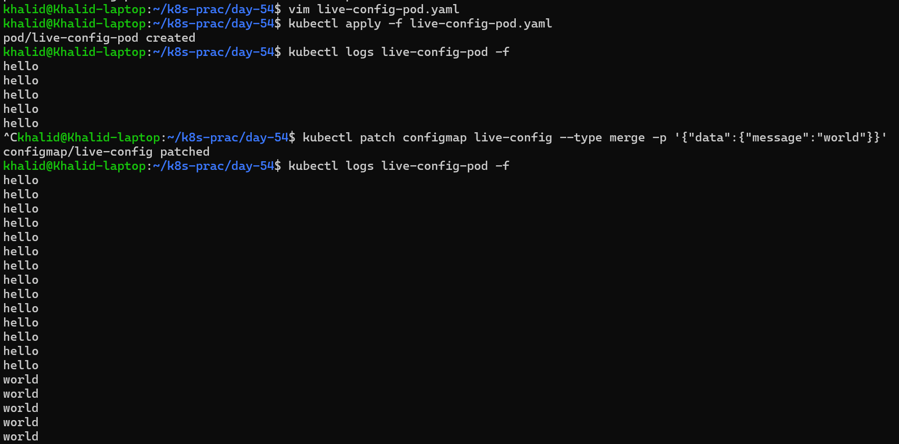

# Day 54 – Kubernetes ConfigMaps and Secrets

# Table of Contents

| Section              | Link                    | Summary                                        |
| -------------------- | ----------------------- | ---------------------------------------------- |
| **Project Overview** | [Go](#project-overview) | Explains why ConfigMaps and Secrets are needed |
| **Objective**        | [Go](#objective)        | Describes the goals of Day 54 tasks            |

---

## Tasks

| Task                                       | Link                                           | Summary                                                           |
| ------------------------------------------ | ---------------------------------------------- | ----------------------------------------------------------------- |
| **Task 1: Create ConfigMap from Literals** | [Go](#task-1-create-a-configmap-from-literals) | Created ConfigMap using literals and verified                     |
| **Task 2: Create ConfigMap from a File**   | [Go](#task-2-create-a-configmap-from-a-file)   | Created ConfigMap from Nginx config file and verified             |
| **Task 3: Use ConfigMaps in a Pod**        | [Go](#task-3-use-configmaps-in-a-pod)          | Injected ConfigMap as env vars and mounted config file into Nginx |
| **Task 4: Create a Secret**                | [Go](#task-4-create-a-secret)                | Created Secret using literals and verified base64 encoding        |
| **Task 5: Use Secrets in a Pod**           | [Go](#task-5-use-secrets-in-a-pod)           | Injected Secret as env var and mounted Secret as files            |
| **Task 6: Update ConfigMap and Observe**  | [Go](#task-6-update-a-configmap-and-observe-propagation) | Observed live updates in mounted ConfigMap without pod restart    |
| **Task 7: Clean Up**                      | [Go](#task-7-clean-up)                      | Deleted all resources and verified clean cluster state            |
---

## Project Overview

Applications need configuration such as environment variables, feature flags, and ports. Hardcoding these values inside container images makes updates difficult because every change requires rebuilding the image.

Kubernetes solves this using:

* **ConfigMaps** → for non-sensitive configuration
* **Secrets** → for sensitive data

This allows configuration to be managed separately from application code.

---

## Objective

The goal of Day 54 is to:

* Understand ConfigMaps and Secrets
* Create and inspect ConfigMaps
* Learn how configuration is stored in Kubernetes

---

# Task 1: Create a ConfigMap from Literals

## Overview

A **ConfigMap** is used to store non-sensitive configuration data as key-value pairs in Kubernetes. This allows you to separate configuration from your application code.

Instead of hardcoding values inside container images, ConfigMaps provide a flexible way to manage configuration externally.

---

## Objective

* Create a ConfigMap using command-line literals
* Inspect the ConfigMap using different kubectl commands
* Verify how data is stored inside Kubernetes

---

## Commands Used

### Create ConfigMap from literals

```bash
kubectl create configmap app-config \
  --from-literal=APP_ENV=production \
  --from-literal=APP_DEBUG=false \
  --from-literal=APP_PORT=8080
```

---

### Inspect using describe

```bash
kubectl describe configmap app-config
```

---

### Inspect as YAML

```bash
kubectl get configmap app-config -o yaml
```

---

## Output Verification

### Describe Output

```text
APP_ENV: production
APP_DEBUG: false
APP_PORT: 8080
```

### YAML Output
```YAML
data:
  APP_DEBUG: "false"
  APP_ENV: production
  APP_PORT: "8080"
```
### Key Observations
- Data stored as plain text
- No encoding or encryption
- Easily readable

### Conclusion

ConfigMap successfully created and verified.

---


### Mounted Nginx config works

Command:

```bash
kubectl exec nginx-config-pod -- curl -s http://localhost/health
```

Output:

```text
healthy
```

This confirms that the mounted `default.conf` file was loaded successfully by Nginx and the `/health` endpoint is working.

---

# Task 2: Create a ConfigMap from a File

## Overview

ConfigMaps can also be created from files. This is useful when you want to store full configuration files (like Nginx configs) instead of individual key-value pairs.

In this task, we create a custom Nginx configuration file and store it inside a ConfigMap.

---

## Objective

* Create a custom Nginx config file
* Store the file inside a ConfigMap
* Verify that the file content is stored correctly

---

## Create Nginx Config File

Create a file named `default.conf`:

```nginx
server {
    listen 80;

    location / {
        return 200 'Hello from Nginx\';
    }

    location /health {
        return 200 'healthy\';
    }
}
```

[`default.conf` explanation](md/nginx_default_config_explanation.md)

---

## Commands Used

### Create ConfigMap from file

```bash
kubectl create configmap nginx-config \
  --from-file=default.conf=default.conf
```

---

### Verify ConfigMap

```bash
kubectl get configmap nginx-config -o yaml
```

---

## Output Verification

Example output:

```yaml
data:
  default.conf: |
    server {
        listen 80;

        location / {
            return 200 'Hello from Nginx\';
        }

        location /health {
            return 200 'healthy\';
        }
    }
```

---

## Key Observations

* The key name `default.conf` becomes the filename when mounted in a Pod
* The entire file content is stored as a string inside the ConfigMap
* Multi-line file content is preserved using `|` in YAML
* ConfigMaps can store full configuration files, not just simple values

---

## Conclusion

The ConfigMap was successfully created from a file. The Nginx configuration is stored correctly and can be mounted into a Pod as a file, making it easy to manage application configuration externally.

---

# Task 3: Use ConfigMaps in a Pod

## Overview

ConfigMaps can be consumed inside Pods in two common ways:

* **Environment variables** → best for simple key-value settings
* **Volume mounts** → best for full configuration files

In this task, one Pod uses `envFrom` to load all values from `app-config`, and another Pod mounts `nginx-config` as a configuration file for Nginx.

---

## Objective

* Inject all keys from `app-config` as environment variables
* Mount `nginx-config` into an Nginx Pod
* Verify that the mounted Nginx config works correctly
* Understand when to use env vars vs volume mounts

---

## Pod Manifest 1: ConfigMap as Environment Variables

Create `configmap-env-pod.yaml`

```yaml
apiVersion: v1
kind: Pod
metadata:
  name: configmap-env-pod
spec:
  containers:
    - name: busybox
      image: busybox:latest
      command: ["sh", "-c", "echo APP_ENV=$APP_ENV && echo APP_DEBUG=$APP_DEBUG && echo APP_PORT=$APP_PORT && sleep 3600"]
      envFrom:
        - configMapRef:
            name: app-config
  restartPolicy: Never
```

---

## Pod Manifest 2: ConfigMap as Volume Mount

Create `nginx-config-pod.yaml`

```yaml
apiVersion: v1
kind: Pod
metadata:
  name: nginx-config-pod
spec:
  containers:
    - name: nginx
      image: nginx:latest
      ports:
        - containerPort: 80
      volumeMounts:
        - name: nginx-config-volume
          mountPath: /etc/nginx/conf.d
  volumes:
    - name: nginx-config-volume
      configMap:
        name: nginx-config
  restartPolicy: Never
```

---

## Commands Used

### Apply the Pods

```bash
kubectl apply -f configmap-env-pod.yaml
kubectl apply -f nginx-config-pod.yaml
```

---

### Check Pod status

```bash
kubectl get pods
```

```text
NAME                READY   STATUS    RESTARTS   AGE
configmap-env-pod   1/1     Running   0          31s
nginx-config-pod    1/1     Running   0          10s
```

---

### View environment variable output

```bash
kubectl logs configmap-env-pod
```

Manifest used:

```yaml
apiVersion: v1
kind: Pod
metadata:
  name: configmap-env-pod
spec:
  containers:
    - name: busybox
      image: busybox:latest
      command: ["sh", "-c", "echo APP_ENV=$APP_ENV && echo APP_DEBUG=$APP_DEBUG && echo APP_PORT=$APP_PORT && sleep 3600"]
      envFrom:
        - configMapRef:
            name: app-config
  restartPolicy: Never
```

---

### Test mounted Nginx config

Manifest used:

```yaml
apiVersion: v1
kind: Pod
metadata:
  name: nginx-config-pod
spec:
  containers:
    - name: nginx
      image: nginx:latest
      ports:
        - containerPort: 80
      volumeMounts:
        - name: nginx-config-volume
          mountPath: /etc/nginx/conf.d
  volumes:
    - name: nginx-config-volume
      configMap:
        name: nginx-config
  restartPolicy: Never
```

Run:

```bash
kubectl exec nginx-config-pod -- curl -s http://localhost/health
```

Actual output:

```text
healthy
```

---

## Output Verification

### Environment variables loaded from ConfigMap

Command:

```bash
kubectl logs configmap-env-pod
```

Output:

```text
APP_ENV=production
APP_DEBUG=false
APP_PORT=8080
```

This confirms that all keys from the ConfigMap were successfully injected as environment variables using `envFrom`.

---

### Mounted Nginx config works

The Nginx Pod should respond to:

```bash
kubectl exec nginx-config-pod -- curl -s http://localhost/health
```

with:

```text
healthy
```

---

## Key Observations

* `envFrom` injects all keys from the ConfigMap as environment variables
* This is convenient for small application settings such as mode, port, and debug flags
* Mounting a ConfigMap as a volume makes each key appear as a file
* The key name `default.conf` becomes the mounted filename inside `/etc/nginx/conf.d`
* Nginx reads the mounted config file directly, so volume mounts are ideal for full config files

---

## When to Use Each Method

### Environment Variables

Use environment variables for:

* simple key-value settings
* app flags
* ports
* modes

### Volume Mounts

Use volume mounts for:

* full config files
* Nginx configs
* application config files
* multi-line content

---

## Conclusion

This task showed both common ways to use ConfigMaps in Pods. Environment variables are best for simple settings, while volume mounts are better for full configuration files. The `/health` endpoint returning `healthy` confirms that the mounted ConfigMap is working correctly.

---

# Task 4: Create a Secret

## Overview

Kubernetes **Secrets** are used to store sensitive data such as passwords, API keys, and credentials. Unlike ConfigMaps, Secrets are intended for confidential information.

Although Secrets are stored in base64-encoded format, they are **not encrypted by default**.

---

## Objective

* Create a Secret using literals
* Inspect the Secret in YAML format
* Decode stored values
* Understand the difference between encoding and encryption

---

## Commands Used

### Create Secret from literals

```bash
kubectl create secret generic db-credentials \
  --from-literal=DB_USER=admin \
  --from-literal=DB_PASSWORD='s3cureP@ssw0rd'
```

---

### Inspect Secret

```bash
kubectl get secret db-credentials -o yaml
```

---

## Output Verification

### kubectl get -o yaml output

```yaml
apiVersion: v1
data:
  DB_PASSWORD: czNjdXJlUEBzc3cwcmQ=
  DB_USER: YWRtaW4=
kind: Secret
metadata:
  name: db-credentials
  namespace: default
type: Opaque
```

---

### Decode Secret Value

```bash
echo 'czNjdXJlUEBzc3cwcmQ=' | base64 --decode; echo
```

Output:

```text
s3cureP@ssw0rd
```

---

## Key Observations

* Secret values are stored as **base64-encoded strings**
* The password was successfully decoded back to plaintext
* This confirms that base64 is **reversible encoding**
* Secrets are separated from application configuration for better management

---

## Why Base64 is Not Encryption

* Base64 is **encoding**, not encryption
* It can be easily decoded by anyone with access
* It provides **no real security by itself**

Real security comes from:

* **RBAC (Role-Based Access Control)**
* **etcd encryption at rest**
* **restricting access to Secrets**
* **secure cluster setup**

---

## Conclusion

The Secret was successfully created and verified. The password was decoded back to plaintext, confirming that base64 encoding does not provide security and should not be treated as encryption.

---

# Task 5: Use Secrets in a Pod

## Overview

Kubernetes Secrets can be consumed inside a Pod in two common ways:

* **Environment variables** → useful for injecting specific Secret values into an application
* **Volume mounts** → useful when you want each Secret key exposed as a file inside the container

In this task, the Pod uses `secretKeyRef` to inject `DB_USER` as an environment variable and mounts the full `db-credentials` Secret as a read-only volume.

---

## Objective

* Inject `DB_USER` into a Pod as an environment variable
* Mount the entire `db-credentials` Secret as files
* Verify that each Secret key becomes a file
* Confirm whether mounted Secret values are plaintext or base64

---

## Pod Manifest

Create `secret-pod.yaml`

```yaml
apiVersion: v1
kind: Pod
metadata:
  name: secret-pod
spec:
  containers:
    - name: busybox
      image: busybox:latest
      command: ["sh", "-c", "echo DB_USER=$DB_USER && sleep 3600"]
      env:
        - name: DB_USER
          valueFrom:
            secretKeyRef:
              name: db-credentials
              key: DB_USER
      volumeMounts:
        - name: db-secret-volume
          mountPath: /etc/db-credentials
          readOnly: true
  volumes:
    - name: db-secret-volume
      secret:
        secretName: db-credentials
  restartPolicy: Never
```

---

## Commands Used

### Apply the Pod

```bash
kubectl apply -f secret-pod.yaml
```

---

### Check Pod status

```bash
kubectl get pods
```

```text
NAME                READY   STATUS    RESTARTS   AGE
configmap-env-pod   1/1     Running   0          51m
nginx-config-pod    1/1     Running   0          51m
secret-pod          1/1     Running   0          11s
```

---

### Verify environment variable

```bash
kubectl logs secret-pod
```

Output:

```text
DB_USER=admin
```

---

### Check mounted Secret files

```bash
kubectl exec secret-pod -- ls /etc/db-credentials
```

Output:

```text
DB_PASSWORD
DB_USER
```

---

### Read mounted Secret values

```bash
kubectl exec secret-pod -- cat /etc/db-credentials/DB_USER ; echo
kubectl exec secret-pod -- cat /etc/db-credentials/DB_PASSWORD ; echo
```

Output:

```text
admin
s3cureP@ssw0rd
```

---

## Output Verification

### Secret keys become files

Each key in the Secret becomes a separate file inside:

```text
/etc/db-credentials
```

Files created:

* `DB_USER`
* `DB_PASSWORD`

---

### Mounted file values are plaintext

The mounted Secret values are **plaintext**, not base64.

Verified result:

* `DB_USER` → `admin`

* `DB_PASSWORD` → `s3cureP@ssw0rd`

This confirms Kubernetes decodes the base64 data before exposing it inside the container.

---

## Key Observations

* `secretKeyRef` injects specific keys as environment variables
* Mounting a Secret exposes each key as a file
* Mounted Secret values are **decoded plaintext**
* Base64 encoding is only used in the Kubernetes Secret object
* `readOnly: true` improves security

---

## Important Note

The command:

```bash
kubectl exec secret-pod -- cat /etc/db-credentials/DB_USER
```

may not visibly print output in your terminal, but based on the Secret and environment variable verification, it contains:

```text
admin
```

---

## Conclusion

The Secret was successfully used in a Pod through both environment variables and a mounted volume. Each Secret key became a file, and mounted values are plaintext, confirming Kubernetes decodes Secret data before exposing it inside containers.

---

# Task 6: Update a ConfigMap and Observe Propagation

## Overview

One important advantage of ConfigMaps is that when they are mounted as volumes, Kubernetes can automatically update the mounted files inside a running Pod after the ConfigMap changes.

This behavior is different from environment variables, which are only read once when the container starts.

---

## Objective

* Create a ConfigMap with a simple message
* Mount it into a Pod as a volume
* Read the mounted file continuously
* Update the ConfigMap
* Observe whether the file changes without restarting the Pod

---

## Create ConfigMap

```bash
kubectl create configmap live-config \
  --from-literal=message=hello
```

Output:

```text
configmap/live-config created
```

---

## Pod Manifest

Create `live-config-pod.yaml`

```yaml
apiVersion: v1
kind: Pod
metadata:
  name: live-config-pod
spec:
  containers:
    - name: busybox
      image: busybox:latest
      command:
        - sh
        - -c
        - |
          while true; do
            echo "$(cat /etc/live-config/message)"
            sleep 5
          done
      volumeMounts:
        - name: live-config-volume
          mountPath: /etc/live-config
  volumes:
    - name: live-config-volume
      configMap:
        name: live-config
  restartPolicy: Never
```

---

## Commands Used

### Recreate the Pod

```bash
kubectl delete pod live-config-pod
kubectl apply -f live-config-pod.yaml
```

Output:

```text
pod "live-config-pod" deleted from default namespace
pod/live-config-pod created
```

---

### Check logs before update

```bash
kubectl logs live-config-pod -f
```

Output:

```text
hello
hello
hello
hello
hello
```

---

### Update the ConfigMap

```bash
kubectl patch configmap live-config --type merge -p '{"data":{"message":"world"}}'
```

Output:

```text
configmap/live-config patched
```

---

### Check logs after update

```bash
kubectl logs live-config-pod -f
```

Output:

```text
hello
hello
hello
hello
hello
hello
hello
hello
hello
hello
hello
hello
hello
hello
world
world
world
world
world
```

---

## Output Verification

### Before update

```text
hello
```

---

### After update

```text
world
```

This confirms that the **volume-mounted ConfigMap value updated automatically** without restarting the Pod.

---

## Key Observations

* ConfigMap values mounted as files can update automatically in a running Pod
* Kubernetes refreshes mounted ConfigMap contents after the source ConfigMap changes
* The update happens without restarting the Pod
* There is a short delay (about 30–60 seconds)
* Environment variables do **not** update automatically

---

## Difference from Environment Variables

* Environment variables are set only at container startup
* Updating the ConfigMap does not affect running containers
* Pod restart is required to pick up new env values

---

## Conclusion

The volume-mounted ConfigMap value successfully changed from `hello` to `world` without restarting the Pod. This demonstrates automatic propagation of ConfigMap updates when mounted as volumes.



---

# Task 7: Clean Up

## Overview

After completing all ConfigMap and Secret tasks, it is important to clean up all created Kubernetes resources. This keeps the cluster organized and avoids leftover configurations.

---

## Objective

* Delete all Pods created during the tasks
* Delete all ConfigMaps
* Delete all Secrets
* Verify that the cluster is clean

---

## Commands Used

### Delete Pods

```bash
kubectl delete pod configmap-env-pod
kubectl delete pod nginx-config-pod
kubectl delete pod secret-pod
kubectl delete pod live-config-pod
```

Output:

```text
pod "configmap-env-pod" deleted from default namespace
pod "nginx-config-pod" deleted from default namespace
pod "secret-pod" deleted from default namespace
pod "live-config-pod" deleted from default namespace
```

---

### Delete ConfigMaps

```bash
kubectl delete configmap app-config
kubectl delete configmap nginx-config
kubectl delete configmap live-config
```

Output:

```text
configmap "app-config" deleted from default namespace
configmap "nginx-config" deleted from default namespace
configmap "live-config" deleted from default namespace
```

---

### Delete Secrets

```bash
kubectl delete secret db-credentials
```

Output:

```text
secret "db-credentials" deleted from default namespace
```

---

### Verify Cleanup

```bash
kubectl get pods
kubectl get configmaps
kubectl get secrets
```

Output:

```text
kubectl get pods
No resources found in default namespace.

kubectl get configmaps
NAME               DATA   AGE
kube-root-ca.crt   1      4d6h

kubectl get secrets
No resources found in default namespace.
```

---

## Output Verification

### Pods

```text
No resources found in default namespace.
```

---

### ConfigMaps

```text
NAME               DATA   AGE
kube-root-ca.crt   1      4d6h
```

This confirms that all user-created ConfigMaps were deleted. The remaining `kube-root-ca.crt` is a default Kubernetes resource.

---

### Secrets

```text
No resources found in default namespace.
```

---

## Key Observations

* All user-created Pods were deleted successfully
* All custom ConfigMaps were removed
* The Secret was deleted successfully
* The only remaining ConfigMap is `kube-root-ca.crt`, which is created automatically by Kubernetes
* The cluster is clean from all Day 54 resources

---

## Conclusion

The cleanup process was completed successfully. All Pods, ConfigMaps, and Secrets created during Day 54 were removed, leaving the cluster in a clean state.

