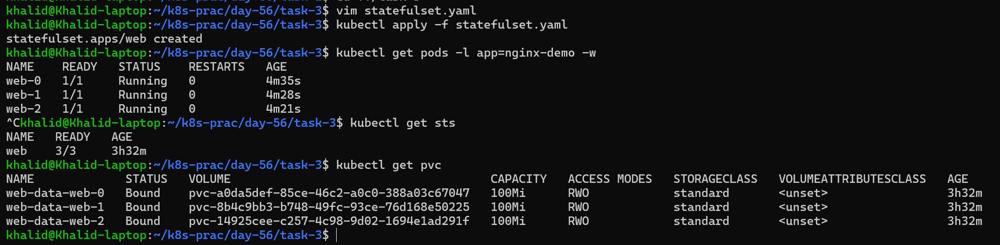
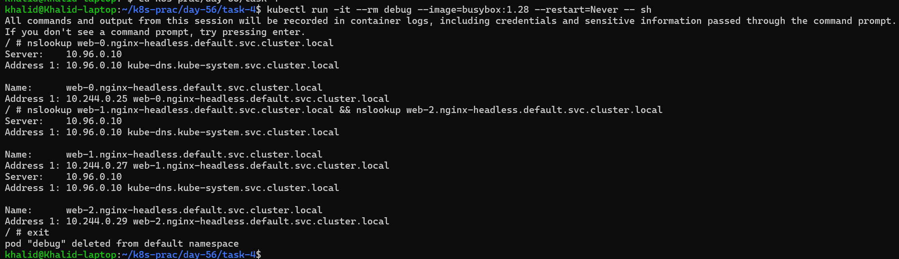
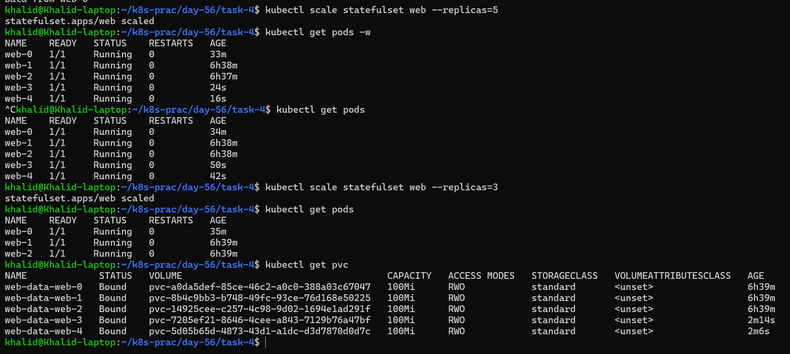
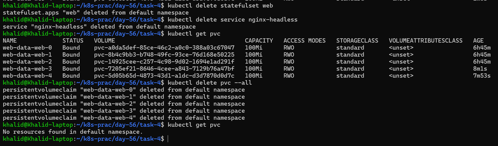

# Day 56 – Kubernetes StatefulSets

## Table of Contents

| Task | Title                     | Summary                                                                 | Link                                                               |
| ---- | ------------------------- | ----------------------------------------------------------------------- | ------------------------------------------------------------------ |
| 1    | Understand the Problem    | Learn why Deployments fail for stateful apps due to random pod identity | [Go to Task 1](#task-1-understand-the-problem)                     |
| 2    | Create a Headless Service | Create a Service with `clusterIP: None` to enable per-pod DNS           | [Go to Task 2](#task-2-create-a-headless-service)                  |
| 3    | Create a StatefulSet      | Deploy StatefulSet with stable pod names and persistent storage         | [Go to Task 3](#task-3-create-a-statefulset)                       |
| 4    | Stable Network Identity   | Verify DNS resolution for each pod using `nslookup`                     | [Go to Task 4](#task-4-stable-network-identity)                    |
| 5    | Stable Storage            | Ensure data persists even after pod deletion                            | [Go to Task 5](#task-5-stable-storage--data-survives-pod-deletion) |
| 6    | Ordered Scaling           | Observe ordered scale-up and reverse scale-down with PVC retention      | [Go to Task 6](#task-6-ordered-scaling)                            |
| 7    | Clean Up                  | Delete resources and verify PVCs are not auto-deleted                   | [Go to Task 7](#task-7-clean-up)                                   |


## Key Definitions

### Stateless Application

A stateless application does not store any data or session information within the application itself. Each request is independent, and any instance of the application can handle it without relying on previous interactions.

### Stateful Application

A stateful application stores data or session information and depends on that state across multiple requests. Each instance has a unique identity and often requires persistent storage to maintain its data.

#### Examples

**Stateless Applications:**

* nginx (web server)
* REST APIs
* Frontend applications

**Stateful Applications:**

* MySQL (database)
* PostgreSQL (database)
* Kafka (messaging system)
* Redis (when persistence is enabled)

## Overview

In Kubernetes, Deployments are ideal for stateless applications where Pods are interchangeable and do not require persistent identity. However, stateful applications such as databases, messaging systems, and distributed clusters need more control over Pod identity, storage, and startup behavior.

StatefulSets are designed specifically for these use cases. They provide:

* Stable and predictable Pod names
* Ordered Pod creation and termination
* Persistent storage per replica
* Stable network identity through DNS

In this lab, we explore why Deployments fall short for stateful workloads and how StatefulSets solve these challenges by ensuring consistency, reliability, and data persistence across Pod restarts and rescheduling.

## Objective

* Understand the limitations of Deployments for stateful applications
* Learn the key features of StatefulSets
* Deploy a StatefulSet with multiple replicas
* Verify stable Pod naming and ordered deployment
* Configure and test Headless Services for stable DNS
* Validate persistent storage using volumeClaimTemplates
* Confirm data persistence even after Pod deletion

---

# Task 1: Understand the Problem

## Overview

Before using StatefulSets, it is important to understand why Deployments are not suitable for stateful applications like databases.

Deployments are designed for stateless workloads such as web servers, where each Pod is interchangeable.

In this task, we create a Deployment with 3 replicas using nginx and observe:

* Pod names are random
* Deleting a Pod creates a replacement automatically
* The replacement Pod gets a different name

This behavior is acceptable for stateless applications but becomes a problem for systems that require stable identity.

## Objective

* Create a Deployment with 3 replicas using nginx
* Check the Pod names
* Delete a Pod and observe replacement behavior
* Understand why this works for stateless apps but not for databases

## Deployment Manifest
Create `deployment-nginx.yaml`

```yaml
apiVersion: apps/v1
kind: Deployment
metadata:
  name: nginx-deployment
spec:
  replicas: 3
  selector:
    matchLabels:
      app: nginx-demo
  template:
    metadata:
      labels:
        app: nginx-demo
    spec:
      containers:
        - name: nginx
          image: nginx:latest
          ports:
            - containerPort: 80
```

## Commands Used

### Apply Deployment

```bash
kubectl apply -f deployment-nginx.yaml
```
```text
deployment.apps/nginx-deployment created
```
### Check Pods

```bash
kubectl get pods
```
```text
NAME                                READY   STATUS    RESTARTS   AGE
nginx-deployment-5c68fc4647-76p8x   1/1     Running   0          44s
nginx-deployment-5c68fc4647-ngswl   1/1     Running   0          44s
nginx-deployment-5c68fc4647-slb64   1/1     Running   0          44s
```

### Delete a Pod

```bash
kubectl delete pod nginx-deployment-5c68fc4647-76p8x
```
```text
pod "nginx-deployment-5c68fc4647-76p8x" deleted from default namespace
```

### Check Pods Again

```bash
kubectl get pods
```
```text
nginx-deployment-5c68fc4647-ngswl   1/1     Running   0          4m2s
nginx-deployment-5c68fc4647-slb64   1/1     Running   0          4m2s
nginx-deployment-5c68fc4647-wppc4   1/1     Running   0          74s
```

## Key Observation

When a Pod is deleted, Kubernetes creates a new one to maintain the desired number of replicas. However, the new Pod does not retain the old name and instead gets a new random name.

This shows that:

* Pods are interchangeable
* Identity is not preserved
* Only the replica count matters

## Why This Is Fine for Stateless Apps

For applications like nginx:

* Any Pod can handle requests
* No dependency on Pod identity
* No local data is required

## Why This Is a Problem for Databases

Stateful applications require:

* Stable Pod identity
* Predictable hostnames
* Persistent storage per instance

Random Pod names can cause:

* Issues in cluster communication
* Broken replication setups
* Difficulty in identifying nodes

Example expected (stateful):

```text
db-0
db-1
db-2
```

Actual (Deployment):

```text
db-7d8f748c9c-8kzj2
db-7d8f748c9c-zpq7n
```

## Comparison Table

| Feature          | Deployment      | StatefulSet     |
| ---------------- | --------------- | --------------- |
| Pod names        | Random          | Stable, ordered |
| Startup order    | Parallel        | Ordered         |
| Storage          | Shared/external | Per Pod PVC     |
| Network identity | None            | Stable DNS      |

## Cleanup
```bash
kubectl get deployments
```
```text
nginx-deployment   3/3     3            3           9m46s
```
```bash
kubectl delete deployment nginx-deployment
```
```text
deployment.apps "nginx-deployment" deleted from default namespace
```
```bash
kubectl get deployments
```
```text
No resources found in default namespace.
```

## Verification Answer

Random Pod names are a problem for database clusters because they rely on stable identity for communication, replication, and storage mapping. Without consistent naming, cluster coordination becomes unreliable.

## Conclusion

This task highlights why Deployments are not suitable for stateful workloads. Stateful applications need stable identity, ordered behavior, and persistent storage, which are provided by StatefulSets.

---

# Task 2: Create a Headless Service

## Overview

A Headless Service in Kubernetes is a Service without a cluster IP. Instead of routing traffic to a single IP address, it provides direct access to individual Pods through DNS records.

This is essential for StatefulSets because each Pod requires a stable network identity.

---

## Objective

* Create a Service with `clusterIP: None`
* Match the selector with StatefulSet Pod labels
* Apply the Service and verify configuration
* Understand how DNS works with Headless Services

---
Create `headless-service.yaml`
## Service Manifest

```yaml
apiVersion: v1
kind: Service
metadata:
  name: nginx-headless
spec:
  clusterIP: None
  selector:
    app: nginx-demo
  ports:
    - port: 80
      targetPort: 80
```

---

## Commands Used

### Apply the Service

```bash
kubectl apply -f headless-service.yaml
```
```text
service/nginx-headless created
```

### Verify the Service

```bash
kubectl get svc
```
```text
nginx-headless   ClusterIP   None         <none>        80/TCP    94s
```

---

## Key Observation

The `CLUSTER-IP` is set to `None`, which confirms that this is a Headless Service.

---

## Why Headless Service is Required

* Provides DNS entries for each Pod
* Enables direct Pod-to-Pod communication
* Required for StatefulSets to maintain stable identity

Example DNS pattern:

```text
<pod-name>.<service-name>.<namespace>.svc.cluster.local
```

---

## Verification Answer

**What does the CLUSTER-IP column show?**

It shows `None`.

---

## Conclusion

Headless Services allow Kubernetes to expose individual Pods instead of a single load-balanced IP. This is critical for StatefulSets where each Pod must be uniquely identifiable.

---

# Task 3: Create a StatefulSet

## Overview

A StatefulSet is used for stateful applications that need stable Pod names, ordered deployment, and persistent storage for each replica.

Unlike a Deployment, a StatefulSet gives each Pod:

* A fixed and predictable name
* Its own PersistentVolumeClaim
* Stable network identity
* Ordered startup and shutdown

In this task, we create a StatefulSet with 3 replicas using the `nginx` image and attach storage to each Pod using `volumeClaimTemplates`.

---

## Objective

* Create a StatefulSet with 3 replicas
* Connect it to the existing Headless Service
* Use `nginx` as the container image
* Add persistent storage with `volumeClaimTemplates`
* Observe ordered Pod creation
* Verify Pod names and PVC names

---

## StatefulSet Manifest
Create `statefulset.yaml`
```yaml
apiVersion: apps/v1
kind: StatefulSet
metadata:
  name: web
spec:
  serviceName: nginx-headless
  replicas: 3
  selector:
    matchLabels:
      app: nginx-demo
  template:
    metadata:
      labels:
        app: nginx-demo
    spec:
      containers:
        - name: nginx
          image: nginx:latest
          ports:
            - containerPort: 80
          volumeMounts:
            - name: web-data
              mountPath: /usr/share/nginx/html
  volumeClaimTemplates:
    - metadata:
        name: web-data
      spec:
        accessModes: ["ReadWriteOnce"]
        resources:
          requests:
            storage: 100Mi
```

---

## Commands Used

### Apply the StatefulSet

```bash
kubectl apply -f statefulset.yaml
```

### Watch Pod Creation

```bash
kubectl get pods -l app=nginx-demo -w
```
Show me all pods with label app=nginx-demo and keep updating the list live as things change

Quick summary
- get pods → list pods
- -l → filter by label
- -w → live updates

### Check StatefulSet

```bash
kubectl get sts
```
```text
NAME   READY   AGE
web    3/3     3h32m
```
The StatefulSet web is running successfully with 3 healthy pods.

Explanation
- sts → StatefulSet
- web → Name of StatefulSet
- 3/3 → All 3 pods are ready
- Pods created:
   - web-0
   - web-1
   - web-2

### Check PersistentVolumeClaims

```bash
kubectl get pvc
```
```text
NAME             STATUS   VOLUME                                     CAPACITY   ACCESS MODES   STORAGECLASS   VOLUMEATTRIBUTESCLASS   AGE
web-data-web-0   Bound    pvc-a0da5def-85ce-46c2-a0c0-388a03c67047   100Mi      RWO            standard       <unset>                 3h32m
web-data-web-1   Bound    pvc-8b4c9bb3-b748-49fc-93ce-76d168e50225   100Mi      RWO            standard       <unset>                 3h32m
web-data-web-2   Bound    pvc-14925cee-c257-4c98-9d02-1694e1ad291f   100Mi      RWO            standard       <unset>                 3h32m
```

---

Kubernetes first creates `web-0`. After `web-0` becomes Ready, it creates `web-1`. Then after `web-1` becomes Ready, it creates `web-2`.

---

## Expected PVC Names

Since the `volumeClaimTemplates` name is `web-data`, the PVC names follow this format:

```text
<template-name>-<pod-name>
web-data-web-0
```

So the PVCs will be:

```text
web-data-web-0
web-data-web-1
web-data-web-2
```

---

## Key Observation

The Pods do not get random names like a Deployment. Instead, they get stable names with ordinals:

* `web-0`
* `web-1`
* `web-2`

Each Pod also gets its own dedicated PVC:

* `web-data-web-0`
* `web-data-web-1`
* `web-data-web-2`

This is what makes StatefulSets suitable for databases and clustered applications.

---

## Verification Answer

**What are the exact pod names and PVC names?**

### Pod names

```text
web-0
web-1
web-2
```

### PVC names

```text
web-data-web-0
web-data-web-1
web-data-web-2
```

---

## Conclusion

This task shows the core behavior of a StatefulSet:

* stable Pod identity
* ordered Pod creation
* separate persistent storage for each replica

These features are essential for stateful applications where each Pod must keep its own identity and data.



---

# Task 4: Stable Network Identity

## Overview

StatefulSets provide stable network identity to each Pod. Unlike Deployments, where Pod names are random, StatefulSet Pods have fixed and predictable names such as `web-0`, `web-1`, and `web-2`.

With the help of a Headless Service, Kubernetes assigns a unique DNS entry to each Pod using the format:

```text
<pod-name>.<service-name>.<namespace>.svc.cluster.local
```

This allows applications to reliably communicate with specific Pods.

---

## Objective

* Use a temporary BusyBox Pod to test DNS
* Resolve DNS for each StatefulSet Pod
* Compare resolved IPs with actual Pod IPs
* Verify stable network identity

---

## Run Debug Pod

```bash
kubectl run -it --rm debug --image=busybox:1.28 --restart=Never -- sh
```
[kubectl-debug](md/kubectl-debug.md)

---

## DNS Lookup Commands

Inside the BusyBox shell:

```bash
nslookup web-0.nginx-headless.default.svc.cluster.local
nslookup web-1.nginx-headless.default.svc.cluster.local
nslookup web-2.nginx-headless.default.svc.cluster.local
```

```text
Server:    10.96.0.10
Address 1: 10.96.0.10 kube-dns.kube-system.svc.cluster.local

Name:      web-0.nginx-headless.default.svc.cluster.local
Address 1: 10.244.0.25 web-0.nginx-headless.default.svc.cluster.local
```


---

## Check Pod IPs

```bash
kubectl get pods -o wide
```
[-o-wide](md/kubectl-get-pods-wide.md)

```text
NAME    READY   STATUS    RESTARTS   AGE   IP           NODE
khalid@Khalid-laptop:~/k8s-prac/day-56/task-4$ kubectl get pods -o wide
NAME    READY   STATUS    RESTARTS   AGE     IP            NODE                           NOMINATED NODE   READINESS GATES
web-0   1/1     Running   0          5h38m   10.244.0.25   devops-cluster-control-plane   <none>           <none>
web-1   1/1     Running   0          5h38m   10.244.0.27   devops-cluster-control-plane   <none>           <none>
web-2   1/1     Running   0          5h38m   10.244.0.29   devops-cluster-control-plane   <none>           <none>
```

---

## Key Observation

Each DNS entry resolves to the exact IP of the corresponding Pod.

* `web-0.nginx-headless.default.svc.cluster.local` → `10.244.0.12`
* `web-1.nginx-headless.default.svc.cluster.local` → `10.244.0.13`
* `web-2.nginx-headless.default.svc.cluster.local` → `10.244.0.14`
These IPs should match the Pod IPs shown by:
```bash
kubectl get pods -o wide
```
---

## Why This Matters

Stable DNS enables:

* Reliable Pod-to-Pod communication
* Cluster formation in distributed systems
* Predictable service discovery

---

## Verification Answer

**Does the nslookup IP match the pod IP?**

Yes, the IP returned by `nslookup` matches the Pod IP from `kubectl get pods -o wide`.

---

## Conclusion

StatefulSets ensure that each Pod has a stable and predictable network identity. This is essential for stateful applications that depend on consistent communication between specific instances.

---

# Task 5: Stable Storage — Data Survives Pod Deletion

## Overview

StatefulSets provide persistent storage for each Pod using PersistentVolumeClaims (PVCs). Even if a Pod is deleted, its storage is not removed. When the Pod is recreated, it reconnects to the same volume and retains its data.

This ensures that applications like databases do not lose data during restarts or failures.

---

## Objective

* Write unique data to a StatefulSet Pod
* Delete the Pod
* Wait for the Pod to be recreated
* Verify that the data still exists
* Confirm persistence of storage

---

## Write Data to Pod

```bash
kubectl exec web-0 -- sh -c "echo 'Data from web-0' > /usr/share/nginx/html/index.html"
```

---

## Verify Data

```bash
kubectl exec web-0 -- cat /usr/share/nginx/html/index.html
```
```text
Data from web-0
```

---

## Delete the Pod

```bash
kubectl delete pod web-0
```

---

## Wait for Pod Recreation

```bash
kubectl get pods -w
```
```text
NAME    READY   STATUS    RESTARTS   AGE
web-0   1/1     Running   0          19s
web-1   1/1     Running   0          6h4m
web-2   1/1     Running   0          6h4m
```
Wait until `web-0` is back in `Running` state.

---

## Verify Data Again

```bash
kubectl exec web-0 -- cat /usr/share/nginx/html/index.html
```
```text
Data from web-0
```

---

## Key Observation

* Pod `web-0` is deleted and recreated
* The same PVC is reattached to the new Pod
* The data remains unchanged

---

## Why This Matters

Stateful applications require data durability. StatefulSets ensure:

* Data is not lost when Pods restart
* Each Pod keeps its own storage
* Storage lifecycle is independent of Pod lifecycle

---

## Verification Answer

**Is the data identical after pod recreation?**

Yes, the data remains identical after Pod recreation because the Pod reconnects to the same PersistentVolumeClaim.

---

## Conclusion

This task confirms that StatefulSets provide stable and persistent storage. Even after Pod deletion, data remains intact because the storage is preserved and reattached to the recreated Pod.

---

# Task 6: Ordered Scaling

## Overview

StatefulSets scale in a predictable and ordered manner. When scaling up, Pods are created one by one in ascending order. When scaling down, Pods are terminated in reverse order.

This ensures safe scaling for stateful applications where order and data consistency matter.

---

## Objective

* Scale the StatefulSet up to 5 replicas
* Observe ordered Pod creation
* Scale down to 3 replicas
* Observe reverse Pod termination
* Verify that PersistentVolumeClaims are preserved

---

## Scale Up

```bash
kubectl scale statefulset web --replicas=5
```

---

## Observe Pod Creation

```bash
kubectl get pods -w
```

Expected order:

```text
web-3
web-4
```

---

## Scale Down

```bash
kubectl scale statefulset web --replicas=3
```

---

## Observe Pod Termination

```bash
kubectl get pods -w
```

Expected order:

```text
web-4
web-3
```

---

## Check PVCs

```bash
kubectl get pvc
```

Expected output:

```text
web-data-web-0
web-data-web-1
web-data-web-2
web-data-web-3
web-data-web-4
```


---

## Key Observation

* Pods scale up in order (`web-3`, then `web-4`)
* Pods scale down in reverse order (`web-4`, then `web-3`)
* PVCs are NOT deleted during scale-down

---

## Why This Matters

Stateful applications require safe scaling behavior:

* Prevents data corruption
* Maintains predictable cluster state
* Ensures data is preserved even after scaling down

---

## Verification Answer

**After scaling down, how many PVCs exist?**

Five PVCs still exist even after scaling down to 3 replicas.

---

## Conclusion

StatefulSets provide ordered scaling and retain storage even after Pods are removed. This ensures that data is preserved and can be reused if the application is scaled up again.

---

# Task 7: Clean Up

## Overview

In Kubernetes, deleting a StatefulSet does not automatically delete its associated PersistentVolumeClaims (PVCs). This is a safety feature to prevent accidental data loss.

In this task, we delete the StatefulSet and Headless Service, verify that PVCs still exist, and then manually remove them.

---

## Objective

* Delete the StatefulSet
* Delete the Headless Service
* Verify that PVCs still exist
* Manually delete PVCs
* Understand Kubernetes data safety behavior

---

## Delete StatefulSet

```bash
kubectl delete statefulset web
```

---

## Delete Headless Service

```bash
kubectl delete service nginx-headless
```

---

## Check PVCs

```bash
kubectl get pvc
```

Example output:

```text
web-data-web-0
web-data-web-1
web-data-web-2
web-data-web-3
web-data-web-4
```

---

## Delete PVCs Manually

```bash
kubectl delete pvc --all
```


---

## Key Observation

* StatefulSet deletion removes Pods but NOT PVCs
* PVCs remain to protect stored data
* Manual cleanup is required to remove storage

---

## Why This Matters

Kubernetes avoids automatic deletion of storage to:

* Prevent accidental data loss
* Allow recovery or reuse of data
* Give administrators control over storage lifecycle

---

## Verification Answer

**Were PVCs auto-deleted with the StatefulSet?**

No, PVCs were not automatically deleted. They remained in the cluster and had to be deleted manually.

---

## Conclusion

This task demonstrates Kubernetes' safety mechanism for persistent storage. Even after deleting a StatefulSet, data is preserved unless explicitly removed, ensuring protection against unintended data loss.


