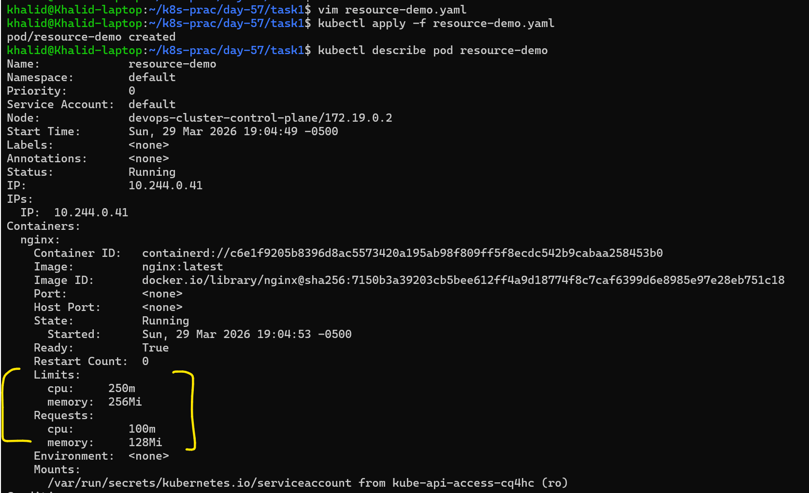
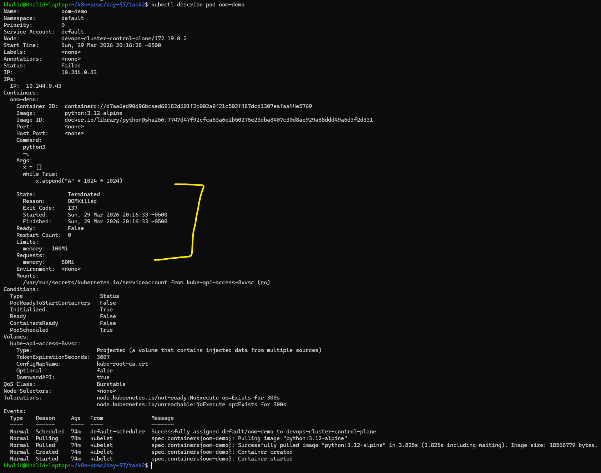
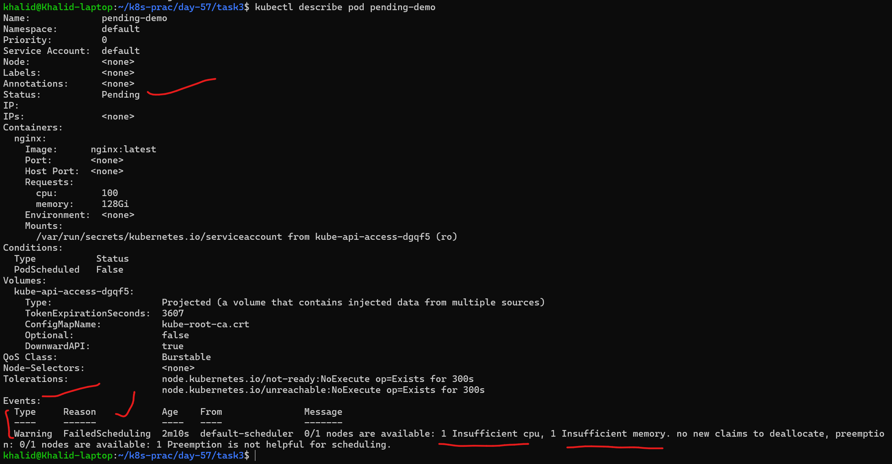

# Day 57 – Resource Requests, Limits, and Probes

## Table of Contents

| Task | Title                          | Summary                                                                 | Link |
| ---- | ------------------------------ | ----------------------------------------------------------------------- | ---- |
| 1    | Resource Requests and Limits   | Configure CPU/memory requests & limits and verify QoS classification   | [Go to Task 1](#task-1-resource-requests-and-limits) |
| 2    | OOMKilled — Exceeding Memory   | Exceed memory limits and observe OOMKilled with exit code 137          | [Go to Task 2](#task-2-oomkilled--exceeding-memory-limits) |
| 3    | Pending Pod — Requesting Too Much | Create unschedulable Pod and analyze scheduler failure events        | [Go to Task 3](#task-3-pending-pod--requesting-too-much) |
| 4    | Liveness Probe                | Detect unhealthy container and observe automatic restarts              | [Go to Task 4](#task-4-liveness-probe) |
| 5    | Readiness Probe               | Control traffic flow and observe endpoint removal without restart      | [Go to Task 5](#task-5-readiness-probe) |
| 6    | Startup Probe                 | Protect slow-starting container and delay liveness checks              | [Go to Task 6](#task-6-startup-probe) |
| 7    | Clean Up                      | Delete all resources and verify cluster cleanup                        | [Go to Task 7](#task-7-clean-up) |

---

## Overview

In Kubernetes, simply running Pods is not enough for production-grade applications. The system must also understand how much CPU and memory each Pod requires and whether the application inside the Pod is functioning correctly.

Resource requests and limits allow Kubernetes to make intelligent scheduling decisions and enforce resource usage boundaries. Requests define the minimum resources a Pod needs, while limits prevent it from consuming more than allowed.

Additionally, Kubernetes uses probes to monitor the health and readiness of containers. These probes enable automatic recovery by restarting unhealthy containers, removing unready Pods from service endpoints, and ensuring applications start properly before receiving traffic.

In this lab, we configure resource requests and limits, observe behavior when limits are exceeded (such as OOMKilled), and implement liveness, readiness, and startup probes to build self-healing and resilient applications.

- Probes = health checks (Is it alive? Is it ready? Has it started?)
- OOMKilled = used too much memory → container is killed

[Kubernetes Probes Overview](md/kubernetes_probes_overview.md)

---

## Objective

* Understand the difference between resource requests and limits  
* Configure CPU and memory requests and limits in a Pod  
* Observe behavior when CPU and memory limits are exceeded  
* Learn how Kubernetes enforces resource constraints  
* Implement liveness, readiness, and startup probes  
* Test probe behavior and failure handling  
* Understand how Kubernetes ensures application reliability and self-healing  


---

# Task 1: Resource Requests and Limits

## Overview

In Kubernetes, resource management ensures that Pods get the necessary CPU and memory while preventing any single Pod from consuming excessive resources.

Each container can define:

* **Requests** → minimum resources guaranteed (used by scheduler)  
* **Limits** → maximum resources allowed (enforced by kubelet)  

This helps Kubernetes make better scheduling decisions and maintain cluster stability.

---

## Objective

* Create a Pod with CPU and memory requests and limits  
* Apply the Pod manifest  
* Inspect resource configuration using `kubectl describe pod`  
* Identify the QoS (Quality of Service) class  

---

## Pod Manifest  
Create `resource-demo.yaml`

```yaml
apiVersion: v1
kind: Pod
metadata:
  name: resource-demo
spec:
  containers:
    - name: nginx
      image: nginx:latest
      resources:
        requests:
          cpu: "100m"
          memory: "128Mi"
        limits:
          cpu: "250m"
          memory: "256Mi"
```

---

## Commands Used

### Apply the Pod

```bash
kubectl apply -f resource-demo.yaml
```
```text
pod/resource-demo created
```

---

### Describe the Pod

```bash
kubectl describe pod resource-demo
```


---

## Key Output Sections

```text
Requests:
  cpu:     100m
  memory:  128Mi

Limits:
  cpu:     250m
  memory:  256Mi

QoS Class: Burstable
```

---

## Key Observation

* Requests define the minimum guaranteed resources  
* Limits define the maximum usage allowed  
* CPU can be throttled if it exceeds limits  
* Memory exceeding limits results in Pod termination (OOMKilled)  

Since requests and limits are different, the Pod falls into the **Burstable QoS class**

---

## QoS Classes Explained

| QoS Class    | Condition |
|-------------|----------|
| Guaranteed  | requests == limits |
| Burstable   | requests < limits |
| BestEffort  | no requests or limits |

[QoS Classes Explained](md/kubernetes_qo_s_class_burstable.md)

---

## Why This Matters

* Ensures fair resource allocation  
* Prevents resource starvation  
* Helps Kubernetes make better scheduling decisions  
* Improves cluster stability  

---

## Verification Answer

**What QoS(Quality of Service) class does your Pod have?**

**Burstable**

---

## Conclusion

This task demonstrates how Kubernetes uses resource requests and limits to manage workloads efficiently. By defining these values, we ensure predictable performance and controlled resource usage, while the QoS class determines how the Pod is treated under resource pressure.

---

# Task 2: OOMKilled — Exceeding Memory Limits

## Overview

In Kubernetes, memory is a non-compressible resource. If a container exceeds its memory limit, it is immediately terminated by the system.

Unlike CPU (which can be throttled), memory violations result in a hard kill using the Linux Out-Of-Memory (OOM) mechanism.

In this task, we intentionally exceed the memory limit to observe how Kubernetes handles such situations.

---

## Objective

* Create a Pod with a strict memory limit  
* Force the container to consume more memory than allowed  
* Observe Pod failure behavior  
* Identify OOMKilled status and exit code  

---

## Pod Manifest  
Create `oom-demo.yaml`

```yaml
apiVersion: v1
kind: Pod
metadata:
  name: oom-demo
spec:
  restartPolicy: Never
  containers:
    - name: oom-demo
      image: python:3.12-alpine
      command: ["python3", "-c"]
      args:
        - |
          x = []
          while True:
              x.append("A" * 1024 * 1024)
      resources:
        requests:
          memory: "50Mi"
        limits:
          memory: "100Mi"
```

---

## Commands Used

### Apply the Pod

```bash
kubectl apply -f oom-demo.yaml
```

```text
pod/oom-demo created
```

---

### Watch Pod Status

```bash
kubectl get pods -w
```
```text
NAME            READY   STATUS      RESTARTS   AGE
oom-demo        0/1     OOMKilled   0          6s
resource-demo   1/1     Running     0          71m
```

---

### Describe the Pod

```bash
kubectl describe pod oom-demo
```

---

## Key Output Sections

```text
State:          Terminated
Reason:         OOMKilled
Exit Code:      137
```

---

## Key Observation

* The container continuously allocates memory until it exceeds the limit  
* The limit is 100Mi  
* Kubernetes immediately terminates the container  
* This results in OOMKilled  

---

## Important Concept

* CPU → Compressible → throttled when exceeding limits  
* Memory → Not compressible → container is killed instantly  

---

## Why Exit Code 137?

* 137 = 128 + 9  
* 9 = SIGKILL signal from Linux  
* Indicates the container was forcefully terminated  

---

## Why This Matters

* Prevents one container from crashing the entire node  
* Ensures strict resource isolation  
* Helps detect memory leaks and misconfigured applications  

---

## Verification Answer

**What exit code does an OOMKilled container have?**

**137**

---

## Conclusion

This task demonstrates how Kubernetes strictly enforces memory limits. When a container exceeds its memory allocation, it is terminated immediately with an OOMKilled status and exit code 137, ensuring cluster stability and resource protection.

---

# Task 3: Pending Pod — Requesting Too Much

## Overview

In Kubernetes, the scheduler places Pods onto nodes only if enough requested resources are available.

If a Pod requests more CPU or memory than any node in the cluster can provide, Kubernetes cannot schedule it. In that case, the Pod remains in the Pending state.

In this task, we intentionally create a Pod with extremely high CPU and memory requests so that the scheduler rejects it and reports the reason in the Events section.

---

## Objective

* Create a Pod with very high CPU and memory requests  
* Apply the Pod manifest  
* Observe that the Pod remains in Pending state  
* Inspect scheduler Events using kubectl describe pod  
* Identify the scheduler error message  

---

## Pod Manifest  
Create `pending-demo.yaml`

```yaml
apiVersion: v1
kind: Pod
metadata:
  name: pending-demo
spec:
  containers:
    - name: nginx
      image: nginx:latest
      resources:
        requests:
          cpu: "100"
          memory: "128Gi"
```
[kubernetes_pending_pod_demo](md/kubernetes_pending_pod_demo.md)

---

## Commands Used

### Apply the Pod

```bash
kubectl apply -f pending-demo.yaml
```
```text
pod/pending-demo created
```

---

### Check Pod Status

```bash
kubectl get pods
```
```text
NAME            READY   STATUS    RESTARTS   AGE
pending-demo    0/1     Pending     0          55s
```

---

### Describe the Pod

```bash
kubectl describe pod pending-demo
```


```text
Warning  FailedScheduling  default-scheduler  0/1 nodes are available: 1 Insufficient cpu, 1 Insufficient memory.
```

---

## Key Observation

* The Pod stays in Pending  
* The container never starts  
* No node has enough resources  
* Scheduler reports failure in Events  

---

## Why This Happens

The Pod requests:

* CPU: 100 cores  
* Memory: 128Gi  

These exceed available node capacity, so scheduling fails.

---

## Why This Matters

* Requests control scheduling  
* Over-requesting blocks Pods from running  
* Events help diagnose scheduling failures  

---

## Verification Answer

**What event message does the scheduler produce?**

**0/1 nodes are available: 1 Insufficient cpu, 1 Insufficient memory.**

---

## Conclusion

This task demonstrates how Kubernetes scheduling fails when resource requests exceed cluster capacity, leaving the Pod in Pending state with clear diagnostic messages.

---

# Task 4: Liveness Probe

## Overview

A liveness probe checks whether a container is still functioning properly. If the probe fails repeatedly, Kubernetes assumes the container is unhealthy and restarts it automatically.

In this task, we create a BusyBox container that writes a file named `/tmp/healthy` when it starts, then deletes it after 30 seconds. A liveness probe uses `exec` to run `cat /tmp/healthy`. Once the file is removed, the probe begins to fail. After 3 consecutive failures, Kubernetes restarts the container.

---

## Objective

* Create a Pod with a BusyBox container  
* Create `/tmp/healthy` on startup  
* Delete the file after 30 seconds  
* Add a liveness probe using `exec`  
* Watch the container restart after probe failures  
* Verify the restart count  

---

## Pod Manifest  
Create `liveness-demo.yaml`

```yaml
apiVersion: v1
kind: Pod
metadata:
  name: liveness-demo
spec:
  containers:
    - name: busybox
      image: busybox:1.28
      command:
        - sh
        - -c
        - touch /tmp/healthy; sleep 30; rm -f /tmp/healthy; sleep 600
      livenessProbe:
        exec:
          command:
            - cat
            - /tmp/healthy
        periodSeconds: 5
        failureThreshold: 3
```
[kubernetes_liveness_probe_demo](md/kubernetes_liveness_probe_demo.md)
---

## Commands Used

### Apply the Pod

```bash
kubectl apply -f liveness-demo.yaml
```

```text
pod/liveness-demo created
```

---

### Watch the Pod

```bash
kubectl get pod -w
```

Observed output:

```text
liveness-demo   1/1   Running   1 (1s ago)   76s
```

---

### Describe the Pod

```bash
kubectl describe pod liveness-demo
```

---

## Key Output Sections

```text
Warning  Unhealthy  ...  Liveness probe failed: cat: can't open '/tmp/healthy': No such file or directory
Normal   Killing    ...  Container busybox failed liveness probe, will be restarted
```

---

## Key Observation

* The container creates `/tmp/healthy` at startup  
* After 30 seconds, the file is deleted  
* The liveness probe fails every 5 seconds  
* After 3 failures, Kubernetes restarts the container  
* Restart count increases  

---

## Verification Answer

**How many times has the container restarted?**

**1 time**

---

## Conclusion

This task demonstrates how liveness probes detect unhealthy containers and automatically restart them, enabling Kubernetes self-healing behavior.

---

# Task 5: Readiness Probe

## Overview

A readiness probe determines whether a container is ready to receive traffic. If the probe fails, Kubernetes removes the Pod from the Service endpoints, but it does not restart the container.

In this task, we create an `nginx` Pod with a readiness probe using `httpGet` on port 80. We then expose the Pod through a Service and verify that its IP appears in the endpoints. After removing the default `index.html` file, the readiness probe fails. The Pod becomes NotReady, its endpoint is removed from the Service, but the container keeps running.

---

## Objective

* Create an `nginx` Pod with a readiness probe  
* Expose the Pod using a Service  
* Verify that the Pod IP appears in the Service endpoints  
* Break the readiness probe by deleting `index.html`  
* Observe that the Pod becomes NotReady  
* Confirm that the endpoint is removed without restarting the container  

---

## Pod Manifest  
Create `readiness-demo.yaml`

```yaml
apiVersion: v1
kind: Pod
metadata:
  name: readiness-demo
  labels:
    app: readiness-demo
spec:
  containers:
    - name: nginx
      image: nginx:latest
      readinessProbe:
        httpGet:
          path: /
          port: 80
        periodSeconds: 5
        failureThreshold: 3
```
[kubernetes_readiness_probe_demo](md/kubernetes_readiness_probe_demo.md)

---

## Commands Used

### Apply the Pod

```bash
kubectl apply -f readiness-demo.yaml
```

```text
pod/readiness-demo created
```

---

### Expose the Pod as a Service

```bash
kubectl expose pod readiness-demo --port=80 --name=readiness-svc
```

```text
service/readiness-svc exposed
```

---

### Check Service Endpoints

```bash
kubectl get endpoints readiness-svc
```

Expected output before failure:

```text
Warning: v1 Endpoints is deprecated in v1.33+; use discovery.k8s.io/v1 EndpointSlice
NAME            ENDPOINTS        AGE
readiness-svc   10.244.0.45:80   31s
```

---

### Break the Readiness Probe

```bash
kubectl exec readiness-demo -- rm /usr/share/nginx/html/index.html
```

---

### Check Pod Status

```bash
kubectl get pod readiness-demo
```

```text
NAME             READY   STATUS    RESTARTS   AGE
readiness-demo   0/1     Running   0          9m
```

---

### Check Endpoints Again

```bash
kubectl get endpoints readiness-svc
```

Expected output after failure:

```text
Warning: v1 Endpoints is deprecated in v1.33+; use discovery.k8s.io/v1 EndpointSlice
NAME            ENDPOINTS   AGE
readiness-svc               3m14s
```

---

## Key Observation

* The Pod starts as Ready and is added to the Service endpoints  
* After deleting `index.html`, the readiness probe fails  
* The Pod changes from `1/1 READY` to `0/1 READY`  
* The Service endpoints become empty  
* The container is not restarted  

---

## Important Concept

* **Readiness probe failure** → removes Pod from Service endpoints  
* **Liveness probe failure** → restarts the container  

Readiness affects traffic routing, not container lifecycle.

---

## Verification Answer

**When readiness failed, was the container restarted?**

**No**

After deleting `/usr/share/nginx/html/index.html`, the Pod showed:

```text
readiness-demo   0/1   Running   0   9m
```
This confirms that the readiness probe failed and the Pod was marked NotReady, but the container was not restarted because the restart count remained `0`.

The Service endpoints also became empty:
```text
readiness-svc
```
This shows that readiness probe failure removes the Pod from traffic without restarting the container.

---

## Difference from Liveness Probe

| Feature | Readiness Probe | Liveness Probe |
|--------|----------------|----------------|
| Purpose | Ready for traffic | Container health |
| Action on failure | Remove from service | Restart container |
| Restart | No | Yes |

---

## Conclusion

This task demonstrates that readiness probes control whether a Pod receives traffic. When the probe fails, Kubernetes removes the Pod from the Service endpoints without restarting the container.

---

# Task 6: Startup Probe

## Overview

A startup probe is used for containers that take time to become ready. While the startup probe is still failing, Kubernetes disables both liveness and readiness probes. This prevents slow-starting applications from being killed too early.

In this task, we create a container that waits 20 seconds before creating a file named `/tmp/started`. A startup probe checks for that file every 5 seconds. Once the file appears, the startup probe succeeds, and only then does the liveness probe begin running.

---

## Objective

* Create a Pod with a slow-starting container  
* Delay startup for 20 seconds  
* Add a startup probe to allow enough startup time  
* Add a liveness probe that checks the same file  
* Understand how startup probes protect slow applications  
* Verify behavior with different failure thresholds  

---

## Pod Manifest  
Create `startup-demo.yaml`

```yaml
apiVersion: v1
kind: Pod
metadata:
  name: startup-demo
spec:
  containers:
    - name: busybox
      image: busybox:1.28
      command:
        - sh
        - -c
        - sleep 20 && touch /tmp/started && sleep 600
      startupProbe:
        exec:
          command:
            - cat
            - /tmp/started
        periodSeconds: 5
        failureThreshold: 12
      livenessProbe:
        exec:
          command:
            - cat
            - /tmp/started
        periodSeconds: 5
        failureThreshold: 3
```

---

## Commands Used

### Apply the Pod

```bash
kubectl apply -f startup-demo.yaml
```

```text
pod/startup-demo created
```

---

### Watch the Pod

```bash
kubectl get pod -w
```

Observed output:

```text
startup-demo   1/1   Running   0   25s
```

---

### Describe the Pod

```bash
kubectl describe pod startup-demo
```

---

## Key Output Sections

```text
Warning  Unhealthy  ...  Startup probe failed: cat: can't open '/tmp/started': No such file or directory
```

---

## Key Observation

* The container initially fails the startup probe  
* Kubernetes allows multiple failures (up to 12)  
* After ~20 seconds, `/tmp/started` is created  
* The startup probe succeeds  
* The container becomes Ready  
* Restart count remains 0  

---

## Important Concept

* Startup probe disables liveness and readiness until it succeeds  
* Prevents premature restarts for slow applications  
* Ensures proper initialization before health checks begin  

---

## Verification Answer

**What would happen if `failureThreshold` were 2 instead of 12?**

If `failureThreshold` were `2`, the startup probe would allow only:

- `2 × 5 seconds = 10 seconds`

But the container needs **20 seconds** to create `/tmp/started`.

So Kubernetes would assume the container failed to start and restart it before startup completed. This would likely cause a restart loop, because the container would be killed after 10 seconds and never reach the 20-second mark required to pass the startup probe.

---

## Conclusion

This task demonstrates how startup probes protect slow-starting containers. By allowing enough time for initialization, Kubernetes avoids unnecessary restarts and ensures stable application startup.

---

# Task 7: Clean Up

## Overview

After completing all tasks, it is important to clean up Kubernetes resources to free cluster capacity and avoid interference with future exercises.

In this task, we delete all Pods and Services created during the lab.

---

## Objective

* Delete all Pods created in previous tasks  
* Delete all Services created  
* Verify that no resources remain  

---

## Commands Used

### Delete All Pods

```bash
kubectl delete pod --all
```
```text
pod "liveness-demo" deleted from default namespace
pod "oom-demo" deleted from default namespace
pod "pending-demo" deleted from default namespace
pod "readiness-demo" deleted from default namespace
pod "resource-demo" deleted from default namespace
pod "startup-demo" deleted from default namespace
```

---

### Delete Services

```bash
kubectl delete service readiness-svc
```
```text
service "readiness-svc" deleted from default namespace
```

---

### Verify Cleanup

```bash
kubectl get pods
```
```text
No resources found in default namespace.
```

```bash
kubectl get svc
```
```text
NAME         TYPE        CLUSTER-IP   EXTERNAL-IP   PORT(S)   AGE
kubernetes   ClusterIP   10.96.0.1    <none>        443/TCP   13d
```

That `kubernetes` service is default system service, not mine — so I am clean.

---

## Key Observation

* All Pods are successfully deleted  
* Services are removed  
* Cluster is clean and ready for next tasks  

---

## Why This Matters

* Frees up cluster resources  
* Prevents conflicts in future labs  
* Keeps the environment clean and manageable  

---

## Verification Answer

**Are all resources deleted successfully?**

**Yes**

All Pods were deleted successfully:

```text
No resources found in default namespace.
```
The custom Service `readiness-svc` was also deleted. The only remaining Service is the default Kubernetes service:
```text
kubernetes   ClusterIP   10.96.0.1
```

---

## Conclusion

This task ensures proper cleanup of Kubernetes resources. Regular cleanup is a good practice to maintain a healthy and efficient cluster environment.

