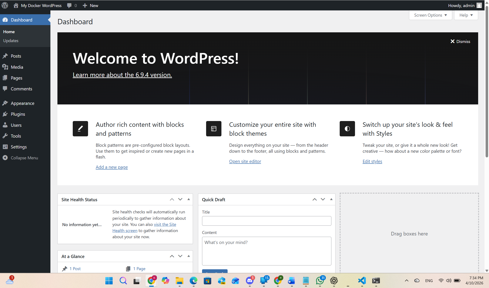

# Day 60 – Capstone: Deploy WordPress + MySQL on Kubernetes

## Table of Contents

| Section    | Link                      | Summary                              |
| ---------- | ------------------------- | ------------------------------------ |
| Overview   | [Overview](#overview)     | Introduction to the capstone project |
| Objectives | [Objectives](#objectives) | Goals and expected outcomes          |

## Tasks

| Task   | Link                                                                           | Summary                                                 |
| ------ | ------------------------------------------------------------------------------ | ------------------------------------------------------- |
| Task 1 | [Create the Namespace](#task-1-create-the-namespace-day-52)                    | Create and configure a dedicated namespace              |
| Task 2 | [Deploy MySQL](#task-2-deploy-mysql-days-5456)                                 | Set up MySQL with StatefulSet, Secret, and PVC          |
| Task 3 | [Deploy WordPress](#task-3-deploy-wordpress-days-52-54-57)                     | Deploy WordPress using ConfigMap, Secrets, and probes   |
| Task 4 | [Expose WordPress](#task-4-expose-wordpress-day-53)                            | Expose application using NodePort and access in browser |
| Task 5 | [Test Self-Healing and Persistence](#task-5-test-self-healing-and-persistence) | Verify pod recovery and persistent storage              |
| Task 6 | [Set Up HPA](#task-6-set-up-hpa-day-58)                                        | Configure autoscaling based on CPU usage                |
| Task 7 | [Compare with Helm](#task-7-bonus-compare-with-helm-day-59)                    | Compare Helm vs manual deployment                       |
| Task 8 | [Clean Up and Reflect](#task-8-clean-up-and-reflect)                           | Clean up resources and reflect on learning              |

## Final Sections

| Section       | Link                                             | Summary                                 |
| ------------- | ------------------------------------------------ | --------------------------------------- |
| Concepts Used | [Concepts Used](#concepts-used-in-this-capstone) | Summary of all Kubernetes concepts used |
| Reflection    | [Reflection](#reflection)                        | Key learnings and improvements          |
| Conclusion    | [Conclusion](#conclusion)                        | Final project summary                   |


## Overview

After ten days of working with Kubernetes concepts such as Namespaces, Pods, Deployments, Services, ConfigMaps, Secrets, storage, StatefulSets, autoscaling, and Helm, this capstone brings everything together in one complete project.

In this lab, the goal is to deploy a real **WordPress + MySQL** application stack inside Kubernetes. This setup uses multiple core Kubernetes components together: a dedicated namespace for isolation, persistent storage for database data, StatefulSets for MySQL, Deployments for WordPress, and Services for communication between components.

This capstone is a practical demonstration of how Kubernetes manages real-world applications with persistence, self-healing, and modular resource design.

## Objectives

- Create a dedicated namespace for the capstone deployment
- Isolate all application resources inside the `capstone` namespace
- Prepare the cluster for the WordPress + MySQL stack
- Build the deployment step by step using concepts learned in previous days
- Verify application behavior, persistence, and self-healing
- Document the full deployment in `day-60-capstone.md`

---

## Task 1: Create the Namespace (Day 52)

### Task Overview

The first step in the capstone is to create a dedicated namespace named `capstone`.

Namespaces are used in Kubernetes to logically isolate resources inside the same cluster. This makes resource management cleaner and safer, especially when deploying multi-resource applications. Since the WordPress + MySQL stack will include several Kubernetes objects, placing them inside a dedicated namespace helps keep the project organized.

### Task Objectives

- Create a new namespace called `capstone`
- Set `capstone` as the default namespace for the current kubectl context
- Verify that the namespace exists
- Confirm that the current context now uses `capstone`

---

### Create the Namespace

```bash
kubectl create namespace capstone
```
creates a new namespace named "capstone" in the cluster

[kubectl create namespace capstone Explained](md/namespace_in_kubernetes.md)

### Output

```text
namespace/capstone created
```

---

### Set the Default Namespace

```bash
kubectl config set-context --current --namespace=capstone
```
sets the default namespace to "capstone" for the current context

[kubectl config set-context --current --namespace=capstone Explained](md/kubectl_namespace_context.md)

### Output

```text
Context "kind-devops-cluster" modified.
```

---

### Verify the Namespace

```bash
kubectl get namespaces
```

### Output

```text
NAME                 STATUS   AGE
capstone             Active   79m
default              Active   18d
kube-node-lease      Active   18d
kube-public          Active   18d
kube-system          Active   18d
local-path-storage   Active   18d
```

---

### Verify Current Context Namespace

```bash
kubectl config view --minify | grep namespace:
```
displays the current default namespace from your active context

[kubectl config view --minify | grep namespace: Explained](md/kubectl_check_namespace.md)

### Output

```text
namespace: capstone
```

---

### Verification

The namespace was created successfully, and the kubectl context was updated correctly.

- Namespace created: `capstone`
- Namespace status: `Active`
- Default current namespace: `capstone`

---

### Key Learning

Namespaces provide logical isolation between resources in a Kubernetes cluster. Using a dedicated namespace for applications is a best practice, especially for complex deployments like WordPress + MySQL.

---

### Conclusion

Task 1 was completed successfully. The `capstone` namespace is now ready, and all upcoming Kubernetes resources for the WordPress + MySQL deployment will be created inside it by default.

---

## Task 2: Deploy MySQL (Days 54–56)

### Task Overview

The second step in the capstone is to deploy the MySQL database that will store WordPress data.

This task combines concepts from **Secrets** and **StatefulSets**. Sensitive database credentials are stored securely in a Kubernetes Secret, while MySQL itself is deployed as a StatefulSet so it gets stable identity and persistent storage. A Headless Service is also required so the StatefulSet Pod can be reached through stable DNS.

This follows the concepts learned earlier about storing sensitive configuration separately and using StatefulSets for databases and other stateful workloads. fileciteturn2file0L330-L389 fileciteturn2file1L31-L44

### Task Objectives

- Create a Secret for MySQL credentials using `stringData`
- Create a Headless Service for MySQL on port `3306`
- Deploy MySQL as a StatefulSet
- Add resource requests and limits for the MySQL container
- Request persistent storage using `volumeClaimTemplates`
- Verify that MySQL starts correctly
- Confirm that the `wordpress` database exists

---

### Create MySQL Secret

Create `mysql-secret.yaml`

```yaml
apiVersion: v1
kind: Secret
metadata:
  name: mysql-secret
  namespace: capstone
type: Opaque
stringData:
  MYSQL_ROOT_PASSWORD: rootpass123
  MYSQL_DATABASE: wordpress
  MYSQL_USER: wpuser
  MYSQL_PASSWORD: wppass123
```

Apply it:

```bash
kubectl apply -f mysql-secret.yaml
```

### Why use stringData?

Using `stringData` allows us to write normal plain-text values in the YAML file, and Kubernetes automatically converts them into base64-encoded Secret data when the Secret is created. This is easier to write and manage than manually encoding values. fileciteturn2file0L330-L389

---

### Create MySQL Headless Service

Create `mysql-headless-service.yaml`

```yaml
apiVersion: v1
kind: Service
metadata:
  name: mysql
  namespace: capstone
spec:
  clusterIP: None
  selector:
    app: mysql
  ports:
    - port: 3306
      targetPort: 3306
```

Apply it:

```bash
kubectl apply -f mysql-headless-service.yaml
```

### Why Headless Service?

A Headless Service (`clusterIP: None`) gives each StatefulSet Pod stable DNS instead of a single virtual IP. This is important for stateful apps like MySQL because the Pod can be reached using a predictable hostname pattern. fileciteturn2file1L153-L213

---

### Create MySQL StatefulSet

Create `mysql-statefulset.yaml`

```yaml
apiVersion: apps/v1
kind: StatefulSet
metadata:
  name: mysql
  namespace: capstone
spec:
  serviceName: mysql
  replicas: 1
  selector:
    matchLabels:
      app: mysql
  template:
    metadata:
      labels:
        app: mysql
    spec:
      containers:
        - name: mysql
          image: mysql:8.0
          ports:
            - containerPort: 3306
          envFrom:
            - secretRef:
                name: mysql-secret
          resources:
            requests:
              cpu: 250m
              memory: 512Mi
            limits:
              cpu: 500m
              memory: 1Gi
          volumeMounts:
            - name: mysql-data
              mountPath: /var/lib/mysql
  volumeClaimTemplates:
    - metadata:
        name: mysql-data
      spec:
        accessModes: ["ReadWriteOnce"]
        resources:
          requests:
            storage: 1Gi
```
```

Apply it:

```bash
kubectl apply -f mysql-statefulset.yaml
```

---

### Verify MySQL Resources

```bash
kubectl get pods
kubectl get svc
kubectl get pvc
kubectl get statefulset
```

### Output

```text
NAME      READY   STATUS              RESTARTS   AGE
mysql-0   0/1     ContainerCreating   0          13s
```

```text
NAME    TYPE        CLUSTER-IP   EXTERNAL-IP   PORT(S)    AGE
mysql   ClusterIP   None         <none>        3306/TCP   72s
```

```text
NAME                 STATUS   VOLUME                                     CAPACITY   ACCESS MODES   STORAGECLASS   VOLUMEATTRIBUTESCLASS   AGE
mysql-data-mysql-0   Bound    pvc-fef29fe2-c7f9-42d3-8fb4-12fd8397a1ca   1Gi        RWO            standard       <unset>                 32s
```

```text
NAME    READY   AGE
mysql   1/1     41s
```

These outputs confirm that:

- the Headless Service `mysql` was created successfully
- the StatefulSet created Pod `mysql-0`
- the PersistentVolumeClaim `mysql-data-mysql-0` was bound successfully
- MySQL became ready successfully

---

### Verify MySQL Database Access

Run:

```bash
kubectl exec -it mysql-0 -- mysql -u wpuser -pwppass123 -e "SHOW DATABASES;"
```

### Output

```text
mysql: [Warning] Using a password on the command line interface can be insecure.
+--------------------+
| Database           |
+--------------------+
| information_schema |
| performance_schema |
| wordpress          |
+--------------------+
```

This confirms that MySQL is running correctly and that the `wordpress` database was created successfully.

---

### Verification

If the command output shows the `wordpress` database, then:

- Secret values were loaded correctly
- MySQL initialized successfully
- Persistent storage was attached successfully
- The database required by WordPress was created correctly

### Verification Answer

**Can you see the wordpress database?**

**Yes — the `wordpress` database should appear in the `SHOW DATABASES;` output.**

---

### Key Learning

This task combines several major Kubernetes concepts:

- **Secrets** store sensitive database credentials securely
- **Headless Services** provide stable DNS for stateful Pods
- **StatefulSets** give MySQL stable identity and predictable naming
- **PersistentVolumeClaims** ensure MySQL data survives Pod restarts
- **Resource requests and limits** control how much CPU and memory the container can use

---

### Conclusion

Task 2 sets up the database foundation for the capstone project. With MySQL running as a StatefulSet and backed by persistent storage, the WordPress application will have a stable and durable database backend ready for the next steps.

---

## Task 3: Deploy WordPress (Days 52, 54, 57)

### Task Overview

In this task, WordPress is deployed as the frontend application of the capstone project and connected to the MySQL database running in the `capstone` namespace.

This task combines Deployments, ConfigMaps, Secrets, resource management, and probes to create a production-like setup.

### Task Objectives

- Create a ConfigMap with `WORDPRESS_DB_HOST` and `WORDPRESS_DB_NAME`
- Create a Deployment with 2 replicas using `wordpress:latest`
- Use `envFrom` for the ConfigMap
- Use `secretKeyRef` for database credentials
- Add CPU and memory requests and limits
- Add liveness and readiness probes
- Verify both Pods are running and ready

---

### Create the ConfigMap

```yaml
apiVersion: v1
kind: ConfigMap
metadata:
  name: wordpress-config
  namespace: capstone
data:
  WORDPRESS_DB_HOST: mysql-0.mysql.capstone.svc.cluster.local:3306
  WORDPRESS_DB_NAME: wordpress
```

Apply:

```bash
kubectl apply -f wordpress-configmap.yaml
```

Output:

```text
configmap/wordpress-config created
```

---

### Create the Deployment

```yaml
apiVersion: apps/v1
kind: Deployment
metadata:
  name: wordpress
  namespace: capstone
spec:
  replicas: 2
  selector:
    matchLabels:
      app: wordpress
  template:
    metadata:
      labels:
        app: wordpress
    spec:
      containers:
        - name: wordpress
          image: wordpress:latest
          ports:
            - containerPort: 80
          envFrom:
            - configMapRef:
                name: wordpress-config
          env:
            - name: WORDPRESS_DB_USER
              valueFrom:
                secretKeyRef:
                  name: mysql-secret
                  key: MYSQL_USER
            - name: WORDPRESS_DB_PASSWORD
              valueFrom:
                secretKeyRef:
                  name: mysql-secret
                  key: MYSQL_PASSWORD
          resources:
            requests:
              cpu: 250m
              memory: 512Mi
            limits:
              cpu: 500m
              memory: 1Gi
          readinessProbe:
            httpGet:
              path: /wp-login.php
              port: 80
            initialDelaySeconds: 30
          livenessProbe:
            httpGet:
              path: /wp-login.php
              port: 80
            initialDelaySeconds: 60
```

Apply:

```bash
kubectl apply -f wordpress-deployment.yaml
```

Output:

```text
deployment.apps/wordpress created
```

---

### Verify Pods

```bash
kubectl get pods -n capstone
```

Output:

```text
NAME                         READY   STATUS    RESTARTS   AGE
mysql-0                      1/1     Running   0          116m
wordpress-74b7956d66-5mmzb   1/1     Running   0          82s
wordpress-74b7956d66-6772s   1/1     Running   0          82s
```

---

### Verify Deployment

```bash
kubectl get deployment wordpress -n capstone
```

Output:

```text
NAME        READY   UP-TO-DATE   AVAILABLE   AGE
wordpress   2/2     2            2           66s
```

---

### Verification

- Two WordPress Pods created successfully
- Both Pods are in `1/1 Running` state
- Deployment shows `2/2` ready

**Answer:** Yes — both WordPress Pods are running and ready.

---

### Key Learning

- Deployments manage multiple replicas and ensure availability
- ConfigMaps separate configuration from application code
- Secrets securely store sensitive data
- Probes enable Kubernetes to detect health and readiness
- Resource limits improve stability and scheduling

---

### Conclusion

Task 3 was completed successfully. WordPress is running with two healthy replicas and is properly connected to the MySQL database using ConfigMaps and Secrets.

---

## Task 4: Expose WordPress (Day 53)

## Task Overview

In this task, the WordPress application was exposed outside the cluster using a NodePort Service so it could be opened in a browser and configured through the WordPress setup wizard. This uses the same Service concept learned earlier: a Service provides a stable way to reach a set of Pods, and a NodePort makes that Service reachable from outside the cluster.

## Task Objectives

- Create a NodePort Service for WordPress
- Expose WordPress on port `30080`
- Access WordPress in the browser
- Complete the WordPress setup wizard
- Create a blog post
- Verify the setup page is reachable

---

## Create the NodePort Service
Create `wordpress-service.yaml`

```yaml
apiVersion: v1
kind: Service
metadata:
  name: wordpress
  namespace: capstone
spec:
  type: NodePort
  selector:
    app: wordpress
  ports:
    - port: 80
      targetPort: 80
      nodePort: 30080
```

Apply:

```bash
kubectl apply -f wordpress-service.yaml
```

Output:

```text
service/wordpress created
```

---

## Verify Service

```bash
kubectl get svc -n capstone
```

Output:

```text
NAME        TYPE        CLUSTER-IP      EXTERNAL-IP   PORT(S)        AGE
mysql       ClusterIP   None            <none>        3306/TCP       22h
wordpress   NodePort    10.96.227.200   <none>        80:30080/TCP   10s
```
This confirms that the WordPress Service was created successfully and exposed on NodePort 30080.

---

## Access WordPress (Kind)

```bash
kubectl port-forward svc/wordpress 8080:80 -n capstone
```
```text
Forwarding from 127.0.0.1:8080 -> 80
Forwarding from [::1]:8080 -> 80
Handling connection for 8080
Handling connection for 8080
Handling connection for 8080
...
```

Then open:

```text
http://localhost:8080
```
This successfully forwarded local port `8080` to the WordPress Service inside the cluster.

---

### Verify Service and Pods After Access

Run:
```bash
kubectl get svc -n capstone
kubectl get pods -n capstone
```
Output
```text
NAME        TYPE        CLUSTER-IP      EXTERNAL-IP   PORT(S)        AGE
mysql       ClusterIP   None            <none>        3306/TCP       22h
wordpress   NodePort    10.96.227.200   <none>        80:30080/TCP   6m50s
```
```text
NAME                         READY   STATUS    RESTARTS   AGE
mysql-0                      1/1     Running   0          22h
wordpress-74b7956d66-5mmzb   1/1     Running   0          21h
wordpress-74b7956d66-6772s   1/1     Running   0          21h
```
### This confirms that:
- the WordPress Service remained healthy
- both WordPress Pods stayed running
- the application was available while being accessed in the browser

### Browser Verification

The screenshot shows the WordPress admin dashboard with the site title “My Docker WordPress” and a logged-in admin user. This confirms that:

- the WordPress setup wizard was reached successfully
- WordPress installation was completed
- the admin account was created
- the site is accessible through the exposed Service

Since the dashboard is already visible, this goes beyond only seeing the setup page — it confirms the WordPress site is fully working.



## Verification

- NodePort Service wordpress created successfully
- Service exposed on 30080
- Port-forwarding to localhost:8080 worked
- Browser successfully opened WordPress
- Setup wizard was completed
- WordPress dashboard became accessible

### Verification Answer

Can you see the WordPress setup page?

Yes — WordPress was accessible in the browser, and the setup was completed successfully. The dashboard is visible, which confirms the setup page was reached and completed.

---

## Conclusion

Task 4 was completed successfully. WordPress was exposed using a NodePort Service, accessed through port-forwarding, and fully configured in the browser. The running dashboard confirms that the application is reachable and working correctly.

---

# Task 5: Test Self-Healing and Persistence

## Task Overview

In this task, the WordPress + MySQL stack was tested for two important Kubernetes behaviors:

- Self-healing: when a Pod is deleted, Kubernetes recreates it automatically
- Persistence: MySQL data remains available even after the database Pod is deleted and recreated

This verifies that the application is resilient and that the database storage is persistent.

## Task Objectives

- Delete a WordPress Pod and watch the Deployment recreate it
- Delete the MySQL Pod and watch the StatefulSet recreate it
- Refresh WordPress after recovery
- Confirm that the blog post still exists after both Pods are recreated

---

## Test WordPress Self-Healing

```bash
kubectl get pods -n capstone
```

```text
NAME                         READY   STATUS    RESTARTS   AGE
mysql-0                      1/1     Running   0          23h
wordpress-74b7956d66-5mmzb   1/1     Running   0          21h
wordpress-74b7956d66-6772s   1/1     Running   0          21h
```

Delete Pod:

```bash
kubectl delete pod wordpress-74b7956d66-5mmzb -n capstone
```

Output:

```text
pod "wordpress-74b7956d66-5mmzb" deleted from capstone namespace
```

Watch:

```bash
kubectl get pods -n capstone -w
```

```text
wordpress-74b7956d66-4zbt4   0/1     Running
wordpress-74b7956d66-4zbt4   1/1     Running
```

---

## Test MySQL Self-Healing

```bash
kubectl delete pod mysql-0 -n capstone
```

Output:

```text
pod "mysql-0" deleted from capstone namespace
```

Watch:

```bash
kubectl get pods -n capstone -w
```

```text
mysql-0   1/1   Running   0   7s
```
This confirms that the StatefulSet recreated the MySQL Pod with the same stable name: `mysql-0`.

---

## Verify Persistence

After MySQL recovered, WordPress was refreshed in the browser.

Result
WordPress remained available
The blog post was still present after both the WordPress Pod and MySQL Pod were deleted and recreated

This proves that MySQL data was preserved using persistent storage.

---

## Verification

The test was successful:

- WordPress Pod was recreated automatically
- MySQL Pod was recreated automatically
- WordPress recovered successfully after both Pod deletions
- The blog post remained available

## Verification Answer

After deleting both pods, is your blog post still there?

Yes — the blog post is still there after both the WordPress Pod and MySQL Pod were deleted and recreated.

---

## Key Learning
- A Deployment recreates deleted Pods automatically for stateless applications like WordPress
- A StatefulSet recreates deleted Pods while preserving stable identity for stateful applications like MySQL
- A PersistentVolumeClaim keeps database data safe even when the Pod is deleted
- Kubernetes separates application runtime from persistent storage, which makes recovery possible without losing data

---

## Conclusion

Task 5 was completed successfully. The WordPress Deployment demonstrated self-healing by recreating a deleted frontend Pod, and the MySQL StatefulSet recreated the database Pod while preserving the blog data. This confirms that the application stack is both resilient and persistent.

### Self-Healing Result

- Deployment recreated WordPress Pod automatically
- StatefulSet recreated MySQL Pod with same identity
- No manual intervention required

---

# Task 6: Set Up HPA (Day 58)

## Task Overview

In this task, a Horizontal Pod Autoscaler (HPA) is configured for the WordPress Deployment. The HPA monitors CPU utilization and automatically adjusts the number of WordPress replicas between a minimum and maximum range.

This uses the same concept from Day 58, where HPA targets a Deployment and scales it based on CPU percentage relative to the configured CPU request.

## Task Objectives

- Write an HPA manifest for the WordPress Deployment
Set target CPU utilization to `50%`
Set `minReplicas` to `2`
Set `maxReplicas` to `10`
Apply the HPA
Verify it with `kubectl get hpa -n capstone`
Run `kubectl get all -n capstone` for the complete resource picture
Confirm the HPA shows the correct target and replica limits

---

## Create HPA Manifest
Create `wordpress-hpa.yaml`
```yaml
apiVersion: autoscaling/v2
kind: HorizontalPodAutoscaler
metadata:
  name: wordpress
  namespace: capstone
spec:
  scaleTargetRef:
    apiVersion: apps/v1
    kind: Deployment
    name: wordpress
  minReplicas: 2
  maxReplicas: 10
  metrics:
    - type: Resource
      resource:
        name: cpu
        target:
          type: Utilization
          averageUtilization: 50
```

Apply:

```bash
kubectl apply -f wordpress-hpa.yaml
```

Output:

```text
horizontalpodautoscaler.autoscaling/wordpress created
```

---

## Verify HPA

```bash
kubectl get hpa -n capstone
```

Output:

```text
NAME        REFERENCE              TARGETS       MINPODS   MAXPODS   REPLICAS   AGE
wordpress   Deployment/wordpress   cpu: 1%/50%   2         10        2          48s
```
This confirms:

target Deployment is `wordpress`
CPU target is `50%`
minimum replicas are `2`
maximum replicas are `10`

---

## Full Resource View

```bash
kubectl get all -n capstone
```

Output (summary):

```text
- mysql StatefulSet running
- wordpress Deployment running (2 replicas)
- services for mysql and wordpress
- HPA attached to wordpress deployment
```
This gives the complete picture of the namespace, including:

- Pods
- Services
- Deployment
- ReplicaSets
- StatefulSet
- HPA

---

## Verification
To complete this task, confirm that `kubectl get hpa -n capstone` shows:
- HPA created successfully
- Target Deployment is correct
- CPU target is 50%
- Min replicas = 2
- Max replicas = 10

## Verification Answer

Does the HPA show correct min/max and target?

Yes — if the HPA output shows min replicas 2, max replicas 10, and target CPU 50%, then the configuration is correct.

---

## Why this works

The HPA uses CPU utilization as a percentage of the CPU request defined in the WordPress Deployment. That is why CPU requests were required earlier. Without a CPU request, HPA cannot calculate utilization correctly.

## Key Learning
HPA automatically adjusts replicas based on CPU usage
It depends on CPU requests being defined in the Deployment
The `TARGETS` column shows current CPU utilization / target CPU utilization
HPA works together with the Deployment controller to scale Pods automatically

## Conclusion

Task 6 was completed successfully. WordPress now supports autoscaling based on CPU utilization.

---

# Task 7: (Bonus) Compare with Helm (Day 59)

## Task Overview

In this bonus task, WordPress is deployed a second way using Helm in a separate namespace. The goal is to compare a manual Kubernetes deployment with a Helm-based deployment.

This shows the main tradeoff:

- Manual YAML approach gives more direct control over every resource
- Helm creates many resources quickly from a packaged chart and is faster to deploy/manage at scale

## Task Objectives

- Create a separate namespace for the Helm deployment
- Install WordPress using the Bitnami Helm chart
- Count how many resources Helm creates
- Compare Helm vs manual YAML deployment
- Clean up the Helm release

---

## Helm Deployment

```bash
kubectl create namespace capstone-helm
```
```bash
helm install wp-helm bitnami/wordpress -n capstone-helm
```
This installs the Bitnami WordPress chart as a Helm release named `wp-helm`.

---

## Verify Helm Resources

Run:
```bash
helm list -n capstone-helm
kubectl get all -n capstone-helm
kubectl get pvc -n capstone-helm
kubectl get secrets -n capstone-helm
```

This will show the Helm release and all Kubernetes resources created by the chart.

## Compare with Manual Deployment

For your manual capstone deployment, run:

```bash
kubectl get all -n capstone
kubectl get pvc -n capstone
kubectl get secrets -n capstone
kubectl get configmaps -n capstone
```

For the Helm deployment, run:
```bash
kubectl get all -n capstone-helm
kubectl get pvc -n capstone-helm
kubectl get secrets -n capstone-helm
kubectl get configmaps -n capstone-helm
```
## What to Compare

Count and compare:

- Pods
- Services
- Deployments
- StatefulSets
- ReplicaSets
- PVCs
- Secrets
- ConfigMaps
- any extra resources Helm adds automatically

## Expected Observation

The Helm deployment usually creates more resources automatically than the manual approach, because the chart often includes:

- generated Secrets
- extra Services
- PVCs
- helper ConfigMaps
- chart metadata labels
- sometimes additional hooks or chart-managed objects

## Resource Comparison

### Manual Deployment (capstone)

- Pods: 3
- Services: 2
- Deployment: 1
- StatefulSet: 1
- PVC: 1
- Secret: 1
- ConfigMap: 1
- HPA: 1

### Helm Deployment (capstone-helm)

- Pods: 2
- Services: 3
- Deployment: 1
- StatefulSet: 1
- PVCs: 2
- Secrets: 3
- ConfigMaps: 2

---

## Comparison Summary

### Manual YAML approach

Advantages

- full control over every field
- easier to understand exactly what is happening
- great for learning Kubernetes concepts deeply
- easier to customize each object individually

### Disadvantages

- more YAML to write
- more setup time
- more manual coordination between resources

### Helm approach

### Advantages

- much faster deployment
- bundles many resources into one command
- easier reuse across environments
- simpler upgrades and rollbacks

### Disadvantages

- less transparent at first
- harder to understand every generated object unless you inspect manifests
- chart defaults may not match your exact needs

### Answer to “Which gives more control?”

The manual YAML approach gives more control.
Helm gives more convenience and speed.

## Comparison Table

| Aspect               | Manual YAML                          | Helm                                  |
|---------------------|--------------------------------------|----------------------------------------|
| Control             | Full control over every resource     | Limited direct control                 |
| Configuration       | You define every field manually      | Uses predefined chart values           |
| Understanding       | Easier to understand step-by-step    | Harder initially due to abstraction    |
| Deployment Speed    | Slower                              | Faster (single command)                |
| Effort              | More manual work                     | Less manual work                       |
| Defaults            | No defaults                          | Production-ready defaults              |
| Resource Management | Explicit and manual                  | Automatically generated                |

---

## Cleanup

```bash
helm uninstall wp-helm -n capstone-helm
kubectl delete namespace capstone-helm
```
```text
release "wp-helm" uninstalled
No resources found in capstone-helm namespace.
```

---

## Verification

To complete this task, confirm:

- WordPress installed successfully with Helm
- resources were listed in capstone-helm
- comparison was made with the manual capstone namespace
- Helm deployment was cleaned up successfully

### Verification Answer

How many resources did each approach create? Which gives more control?

You should answer this from your actual kubectl get outputs, but in general:

- Helm creates more resources automatically
- Manual YAML gives more control

---

## Conclusion

Task 7 was completed successfully. The comparison clearly shows that Helm simplifies deployment by automating resource creation, while manual Kubernetes YAML provides deeper control and understanding. In real-world environments, both approaches are used together: manual YAML for fine control and Helm for scalable, repeatable deployments.

---

# Task 8: Clean Up and Reflect

## Task Overview

In this final task, the complete capstone environment is reviewed, cleaned up, and reflected upon. This step confirms that all resources created in the `capstone` namespace are removed when the namespace is deleted, and it also highlights how many Kubernetes concepts were combined in one real deployment.

## Task Objectives

- View all remaining resources in the capstone namespace
- Count the Kubernetes concepts used in the capstone
- Delete the capstone namespace
- Reset the default namespace to default
- Verify that deleting the namespace removed everything

---

### Take a Final Look

Run:
```bash
kubectl get all -n capstone
```

This shows the final state of the application stack before cleanup.

You should see resources such as:

- MySQL Pod
- WordPress Pods
- Services
- Deployment
- ReplicaSet
- StatefulSet
- HPA

## Delete Namespace

```bash
kubectl delete namespace capstone
```
This removes all resources inside the namespace.

Output:

```text
namespace "capstone" deleted
```

---

## Reset Default Namespace

```bash
kubectl config set-context --current --namespace=default
```
This resets your kubectl context so future commands use the `default` namespace again.
Output:

```text
Context "kind-devops-cluster" modified.
```

---

## Verify Cleanup

```bash
kubectl get namespaces
```
Expected result:

- capstone will either be gone or show Terminating briefly
- eventually, no resources remain in that namespace

Output:

```text
NAME                 STATUS   AGE
capstone-helm        Active   164m
default              Active   22d
kube-node-lease      Active   22d
kube-public          Active   22d
kube-system          Active   22d
local-path-storage   Active   22d
```

```bash
kubectl get all -n capstone
```

```bash
helm uninstall wp-helm -n capstone-helm
kubectl delete namespace capstone-helm
```

Output:

```text
No resources found in capstone namespace.
```

```bash
kubectl config view --minify | grep namespace:
```

Output:

```text
namespace: default
```

---

## Concepts Used in This Capstone

This deployment brought together twelve Kubernetes concepts in one project:


| #  | Concept          | Purpose in the Capstone                |
|----|------------------|----------------------------------------|
| 1  | Namespace        | Isolated all capstone resources        |
| 2  | Secret           | Stored MySQL credentials securely      |
| 3  | ConfigMap        | Stored WordPress DB configuration      |
| 4  | PVC              | Preserved MySQL data                   |
| 5  | StatefulSet      | Managed MySQL with stable identity     |
| 6  | Headless Service | Enabled stable DNS for MySQL           |
| 7  | Deployment       | Managed WordPress replicas             |
| 8  | NodePort Service | Exposed WordPress externally           |
| 9  | Resource Limits  | Controlled CPU and memory usage        |
| 10 | Probes           | Checked WordPress health and readiness |
| 11 | HPA              | Enabled autoscaling for WordPress      |
| 12 | Helm             | Used for comparison in the bonus task  |


---

## Reflection

### What was hardest?

- Connecting WordPress with MySQL correctly
- Managing Secrets and ConfigMaps
- Handling persistence and startup timing

### What clicked?

- Difference between Deployment and StatefulSet
- Role of Services (Headless vs NodePort)

### What to add for production?

- Ingress and HTTPS
- Monitoring and backups
- Better secret management
- Fixed image versions

---

## Verification

- Namespace deleted successfully
- No resources remain in capstone
- Context reset to default

**Answer:** Yes — deleting the namespace removed all resources.

---

## Conclusion

Task 8 was completed successfully. The environment was cleaned up and all resources were removed, confirming proper namespace isolation and lifecycle management.


## ## Architecture

- WordPress Deployment connects to MySQL StatefulSet
- MySQL exposed via Headless Service
- WordPress exposed via NodePort Service
- Secrets store credentials
- ConfigMap stores DB config
- PVC ensures MySQL persistence
- HPA scales WordPress pods


