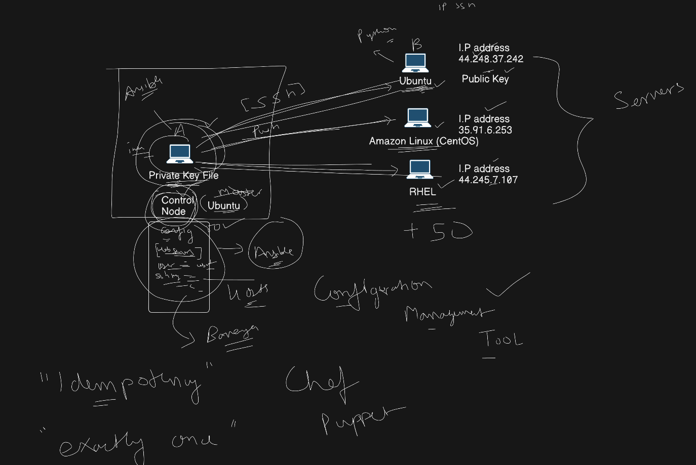
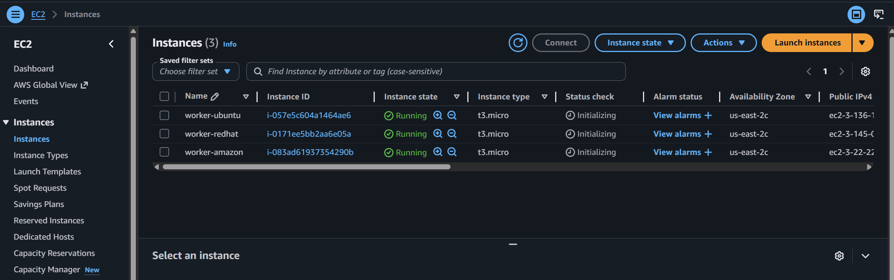
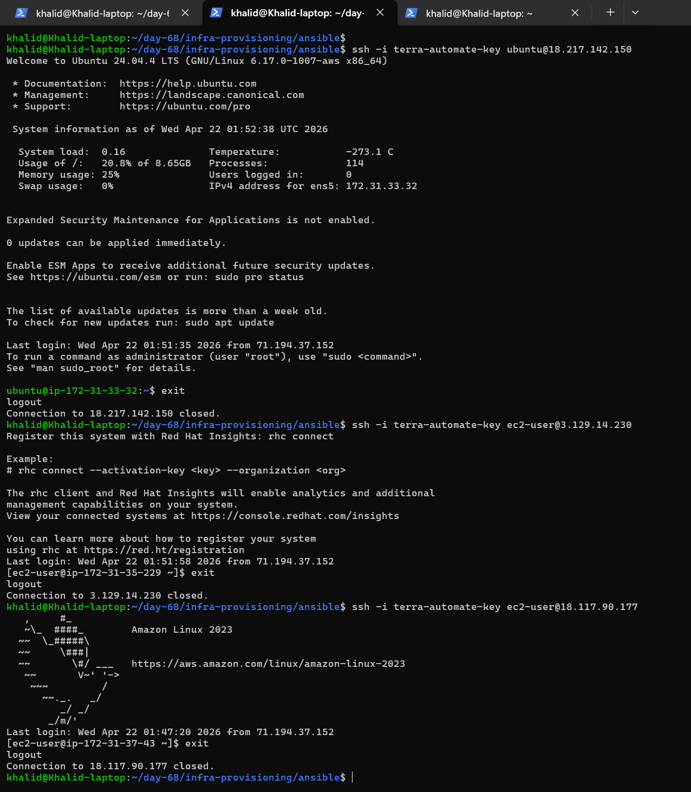
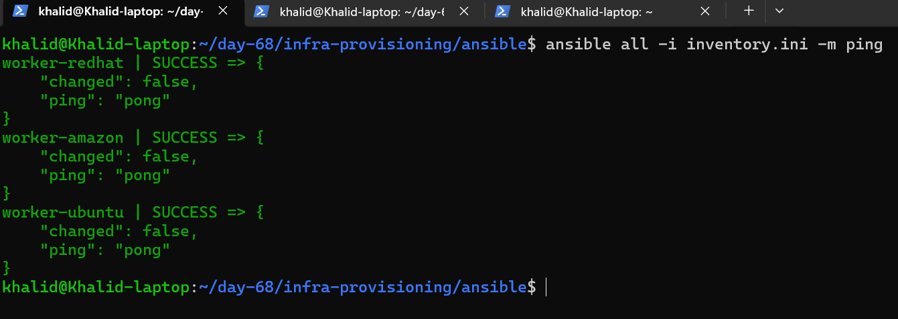
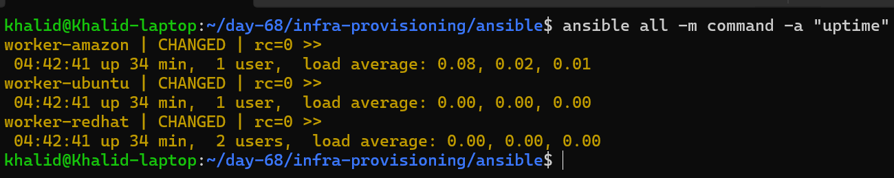
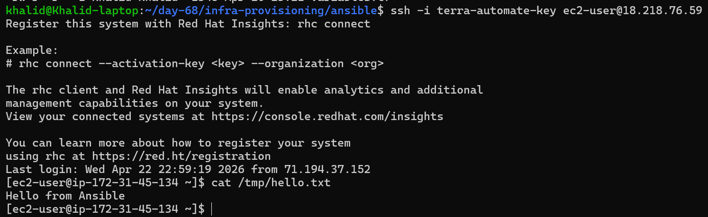
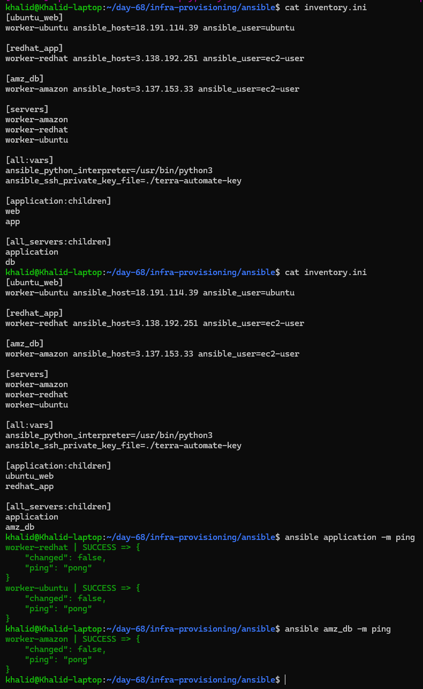

# Day 68 - Introduction to Ansible

# Table of Contents

## Project Summary

| Section | Description |
|--------|------------|
| Overview | This project demonstrates a complete DevOps workflow using Terraform, Shell scripting, and Ansible for automated infrastructure provisioning and configuration management. |

---

## Tasks Overview

| Task | Title | Summary | Link |
|------|------|--------|------|
| Task 1 | Understand Ansible | Learned fundamentals of configuration management, Ansible architecture, and differences from other tools | [Go](#task-1-understand-ansible) |
| Task 2 | Set Up Lab Environment | Provisioned 3 EC2 instances (Ubuntu, RedHat, Amazon Linux) using Terraform and verified SSH connectivity | [Go](#task-2-objective-set-up-lab-environment) |
| Task 3 | Install Ansible | Installed and verified Ansible on control node (WSL Ubuntu) and understood agentless concept | [Go](#task-3-install-ansible) |
| Task 4 | Create Inventory File | Created inventory.ini, grouped hosts, and automated inventory generation using Terraform + script | [Go](#task-4---ansible-inventory-setup) |
| Task 5 | Run Ad-Hoc Commands | Executed commands to check system info, install packages, copy files, and learned `--become` | [Go](#task-5---ansible-ad-hoc-commands) |
| Task 6 | Inventory Groups & Patterns | Used group-of-groups and patterns for efficient host targeting and simplified execution | [Go](#task-6-inventory-groups-and-patterns) |

---

## Workflow Overview

| Step | Tool | Description |
|------|------|------------|
| 1 | Terraform | Provision EC2 infrastructure |
| 2 | Shell Script | Automate setup and deployment |
| 3 | Inventory | Organize hosts dynamically |
| 4 | Ansible | Configure and manage servers |

---

## Key Takeaways

| Area | Insight |
|------|--------|
| Automation | Infrastructure and configuration should be automated |
| Ansible | Agentless, SSH-based configuration management |
| Scalability | Groups and patterns simplify multi-server management |
| Efficiency | Scripts reduce manual work |
| Best Practice | Ad-hoc for quick tasks, Playbooks for repeatable automation |

---

In this project, I explored Ansible as a configuration management tool and understood how it complements infrastructure provisioning tools like Terraform.

While Terraform is used to create infrastructure (such as EC2 instances), Ansible is used to configure and manage those systems after they are created.

This project focuses on setting up a basic Ansible environment, creating a lab with multiple servers, and learning how to interact with them using Ansible without installing any agents.

---

## Project Objective

The objective of this project is to:

- Understand the fundamentals of configuration management
- Learn how Ansible works and its architecture
- Set up a lab environment using EC2 instances
- Connect to remote servers using SSH
- Prepare for automation using Ansible inventory and commands


## Task 1: Understand Ansible

The goal of Task 1 is to build a strong conceptual foundation by learning:

- What configuration management is and why it is important
- How Ansible differs from tools like Chef, Puppet, and Salt
- What "agentless" means and how Ansible communicates with servers
- The core components of Ansible:
  - Control Node
  - Managed Nodes
  - Inventory
  - Modules
  - Playbooks

---

## What is Configuration Management? Why do we need it?

Configuration management is the process of:

- Installing software
- Managing system settings
- Ensuring servers stay in a desired and consistent state

Why it is needed:
- Manual configuration is slow and error-prone
- Difficult to maintain consistency across multiple servers
- Hard to reproduce environments
- Automation improves reliability and scalability

Configuration management tools solve this by:

- Automating setup
- Making systems consistent
- Allowing repeatable deployments

---

## How is Ansible different from Chef, Puppet, and Salt?

| Tool    | Type        | Agent Required | Language Used |
|---------|------------|----------------|---------------|
| Ansible | Push-based | No             | YAML          |
| Puppet  | Pull-based | Yes            | Puppet DSL    |
| Chef    | Pull-based | Yes            | Ruby          |
| Salt    | Hybrid     | Usually Yes    | YAML/Python   |

Key differences:
- Ansible is agentless
- Uses simple YAML syntax
- Uses SSH for communication
- Faster and easier to set up

---

## What does "agentless" mean?

Agentless means:

- No software (agent) needs to be installed on the managed nodes.
- Ansible connects using SSH

How Ansible connects:
1. Control node runs Ansible commands
2. Connects to remote servers using SSH
3. Executes tasks
4. Returns output

---

## Ansible Architecture


### Control Node
The machine where Ansible is installed and executed.
Example: your laptop or WSL system

### Managed Nodes
The servers managed by Ansible.
Example: EC2 instances

### Inventory
- A file that contains a list of managed nodes.
- Can group servers
Example:
```ini
[web]
server1
server2

[db]
server3
```

### Modules
Small units of work executed by Ansible.

Examples:
- Install package
- Start service
- Copy file

Example modules:
- ping
- apt
- yum
- copy

### Playbooks
YAML files that define automation tasks.

Example:
```yaml
- hosts: web
  tasks:
    - name: Install nginx
      apt:
        name: nginx
        state: present
```

---

## Architecture Flow

Control Node → SSH → Managed Nodes → Execute Modules → Return Results

---

## Summary

Ansible is an agentless configuration management tool that uses SSH to automate server setup and maintenance. It uses inventory files, modules, and playbooks to ensure systems stay in a desired state.

---

## Task 2 Objective: Set Up Lab Environment

The goal of Task 2 is to create a practical environment for Ansible by:

- Provisioning 3 EC2 instances using Terraform
- Using different Linux distributions:
  - Ubuntu (web server)
  - Red Hat (app server)
  - Amazon Linux (db server)
- Configuring a security group to allow SSH access
- Attaching a key pair for secure login
- Verifying SSH connectivity from the control node to all instances

This lab setup will be used in the next tasks to practice Ansible inventory and command execution.

---

## Control Node

I used my local laptop as the Ansible control node. The system is running Ubuntu 24.04 inside WSL (Windows Subsystem for Linux).

All Ansible commands were executed from this WSL environment, which connects to the EC2 instances using SSH.

---

## Lab Setup

I set up my lab environment using Terraform and provisioned three EC2 instances for Ansible practice.

Control Node:
- Local laptop (WSL - Ubuntu 24.04)

Managed Nodes:
- ubuntu-web — Ubuntu server
- redhat-app — Red Hat server
- amz-db — Amazon Linux server

I used `t3.micro` instances because `t2.micro` was not available in my setup.

Each instance was created with:
- a security group allowing SSH on port 22
- a key pair for SSH access
- a public IP address for remote connection

After provisioning, I verified SSH access from my control node to all three instances.

---
## Step 1: Infrastructure Provisioning using Terraform

Create 3 EC2 instances that you will later manage with Ansible.

### The Terraform file is used to provision infrastructure, including EC2 instances, security groups, and SSH access. Once the infrastructure is created, Ansible is used to configure and manage the servers.

Create `ec2.tf`

```hcl
# Region

provider "aws" {

  region = "us-east-2"

}

# Key Value pair

resource "aws_key_pair" "my_key_pair" {

  key_name   = "terra-automate-key"
  public_key = file("terra-automate-key.pub")
}

# VPC Default

resource "aws_default_vpc" "default" {
}

# Terraform AWS Security Group and EC2 Configuration

# Security Group

resource "aws_security_group" "my_security_group" {
  name        = "terra-security-group"
  vpc_id      = aws_default_vpc.default.id # interpolation
  description = "this is Inbound and outbound rules for EC2 instances Security group"

}

# Inbound & Outbount port rules

# Inbound rule - HTTP (web traffic, e.g. Nginx/Apache)

resource "aws_vpc_security_group_ingress_rule" "allow_http" {
  security_group_id = aws_security_group.my_security_group.id
  cidr_ipv4         = "0.0.0.0/0" # That means HTTP is open to the entire internet
  from_port         = 80
  ip_protocol       = "tcp"
  to_port           = 80
}

# Inbound rule - SSH (remote access)
# Inbound rule - SSH (remote administration - restrict to your IP)

resource "aws_vpc_security_group_ingress_rule" "allow_ssh" {
  security_group_id = aws_security_group.my_security_group.id
  cidr_ipv4         = "0.0.0.0/0" # That means SSH is open to the entire internet
  # # cidr_ipv4         = "YOUR_IP/32"  # Replace with your public IP (restrict to your IP)
  from_port   = 22
  ip_protocol = "tcp"
  to_port     = 22
}

# Outbound rule - allow all traffic

resource "aws_vpc_security_group_egress_rule" "allow_all_traffic" {
  security_group_id = aws_security_group.my_security_group.id
  cidr_ipv4         = "0.0.0.0/0"
  ip_protocol       = "-1" # semantically equivalent to all ports
}


# --------------------------------------------------
# EC2 Instance Configuration
# --------------------------------------------------

# EC2 instance - multi instances setup

resource "aws_instance" "my_instance" {

  # count = 3 # uses when we need to use same machines

  for_each = var.instances # 4 instances

  ami           = each.value.ami                    # iterate through each instance and gives its ami value (OS AMI ID)
  instance_type = each.value.instance_type          # Instance Type
  key_name      = aws_key_pair.my_key_pair.key_name # Key pair

  vpc_security_group_ids = [aws_security_group.my_security_group.id] # VPC & Security Group

  # root storage (EBS)
  root_block_device {
    volume_size = 10
    volume_type = "gp3"
  }

  tags = {
    Name      = each.key
    os_family = each.value.os_family
  }
}


# ================================
# EC2 Instance Power Control
# ================================

resource "aws_ec2_instance_state" "workers_power" {
  for_each = aws_instance.my_instance

  instance_id = each.value.id
  state       = var.instance_state
}

# ================================
# Outputs all public IPs
# ================================

output "public_ips" {
  value = {
    for name, instance in aws_instance.my_instance :
    name => instance.public_ip
  }
}


# ================================
# Ansible Inventory Output
# ================================

output "ansible_inventory" {
  value = {
    for name, instance in aws_instance.my_instance :
    name => {
      ip   = instance.public_ip
      user = var.instances[name].user
      os   = var.instances[name].os_family
    }
  }
}
```

[ec2.tf outlines](md/ec2_explanation.md)

[ec2.tf Explained in detail](md/ec2_explanation_detailed.md)

---

### The variables.tf file is used to define input values so that my Terraform code is reusable and not hardcoded.

Create `variables.tf`

```hcl
# This is a simple variable of type map

variable "instances" {
  description = "Map of instance names to AMI IDs, SSH users, and OS family"

  type = map(object({
    ami           = string
    user          = string
    os_family     = string
    instance_type = string
  }))

  # Default values for instances
  default = {
    #"master-ubuntu" = {
    #ami       = "ami-07062e2a343acc423" # Ubuntu Server 24.04 LTS (HVM)
    #user      = "ubuntu"
    #os_family = "ubuntu"
    #}

    "worker-ubuntu" = {
      ami           = "ami-07062e2a343acc423" # Ubuntu Server 24.04 LTS (HVM)
      user          = "ubuntu"
      os_family     = "ubuntu"
      instance_type = "t3.micro"
    }

    "worker-redhat" = {
      ami           = "ami-0a951f007be151ff9" # Red Hat Enterprise Linux 10 (HVM)
      user          = "ec2-user"
      os_family     = "redhat"
      instance_type = "t3.micro"
    }

    "worker-amazon" = {
      ami           = "ami-0a1b6a02658659c2a" # Amazon Linux 2023
      user          = "ec2-user"
      os_family     = "amazon"
      instance_type = "t3.micro"
    }
  }
}

# ================================
# Instance Power Control Variable
# ================================

variable "instance_state" {
  description = "Control EC2 instance state (running or stopped)"
  type        = string
  default     = "running"
}
```

[variables.tf Explanation](md/variables_explanation.md)

### How it connects to your project

In your setup:

- ec2.tf → creates EC2 instances
- variables.tf → provides values to that configuration

So:

variables.tf = inputs
ec2.tf = implementation


---

## Step 2: Automation using Shell Script

## Automation Script

To simplify the infrastructure setup process, I created a shell script to automate Terraform execution.

The script performs the following tasks:

- Cleans previous Terraform state files
- Generates an SSH key pair if not already present
- Initializes Terraform
- Validates the configuration
- Creates an execution plan
- Applies the infrastructure automatically

This script reduces manual effort and ensures consistent deployment of the lab environment.

This approach follows DevOps best practices by automating repetitive tasks and ensuring consistent infrastructure deployment.

Example script name:
setup_apply_and_connect.sh

Create `setup_apply_and_connect.sh`
```Bash
#!/bin/bash

set -e


KEY_NAME="terra-automate-key"

echo "Cleaning old Terraform state..."
rm -rf .terraform terraform.tfstate terraform.tfstate.backup 2>/dev/null || true

echo "===== STEP 1: SSH Key Setup ====="

if [ -f "$KEY_NAME" ] || [ -f "$KEY_NAME.pub" ]; then
  echo "Key already exists."
  read -p "Do you want to overwrite it? (yes/no): " confirm

  if [ "$confirm" = "yes" ]; then
    rm -f "$KEY_NAME" "$KEY_NAME.pub"
    echo "Old key removed."
  else
    echo "Skipping key creation."
  fi
fi

if [ ! -f "$KEY_NAME" ]; then
  echo "Creating SSH key..."
  ssh-keygen -t ed25519 -f "./$KEY_NAME" -N "" -C "terraform-key"
  echo "SSH key created."
fi

echo "Private key: $(pwd)/$KEY_NAME"
echo "Public key:  $(pwd)/$KEY_NAME.pub"

echo ""
echo "===== STEP 2: Terraform Execution ====="

echo "Initializing Terraform..."
terraform init

echo "Validating Terraform..."
terraform validate

echo "Planning Terraform changes..."
terraform plan

echo "Applying Terraform..."
terraform apply -auto-approve
```
[setup_apply_and_connect.sh Explanation](md/setup_apply_and_connect.md)

### To install jq (the JSON parser your script needs), use the command based on your system:

### Ubuntu / WSL (your setup)
```bash
sudo apt update
sudo apt install jq -y
```

### Amazon Linux / RHEL / CentOS

```bash
sudo yum update -y
sudo yum/dnf install jq -y
```

### Verify installation
```bash
jq --version
```
You should see something like:
```text
jq-1.6
```

### Why you need jq

In your script, jq is used to:

- Read Terraform JSON output
- Extract:
   - IP addresses
  - usernames
  - OS types
- Generate your inventory.ini automatically

- Without jq, your inventory script won’t work.



## Step 3: Verify SSH Connectivity

### Verify you can SSH into each one from your control node:

```bash
ssh -i terra-automate-key ubuntu@18.217.142.150
ssh -i terra-automate-key ec2-user@3.129.14.230
ssh -i terra-automate-key ec2-user@18.117.90.177
```



---

## Task 3: Install Ansible

### Task Overview

In this task, I set up Ansible on my control node to begin managing remote servers. Ansible is a configuration management tool that allows automation of server configuration without requiring any agent installation on managed nodes.

The installation was performed on my local machine running Ubuntu 24.04 in WSL, which acts as the control node. From this node, Ansible connects to remote EC2 instances using SSH to execute commands and manage configurations.

This step ensures that the control node is ready to communicate with managed nodes and perform automation tasks.

---

### Task Objective

The objective of this task is to:

- Install Ansible on the control node
- Verify the installation using `ansible --version`
- Understand that Ansible operates in an agentless manner
- Prepare the control node to manage multiple remote servers via SSH
- Build the foundation for running Ansible commands and playbooks in upcoming tasks

# Ansible Installation Guide

## System Information

- OS: Ubuntu 24.04.4 LTS (WSL2)
- Architecture: ARM64
- Python: 3.12.3
- Ansible: core 2.20.4 (already installed)

---

[Ansible Docs Link](https://docs.ansible.com/projects/ansible/latest/installation_guide/intro_installation.html#control-node-requirements)

# 1. Ubuntu / WSL Installation

## Install Ansible (APT)

```bash
sudo apt-add-repository ppa:ansible/ansible
sudo apt update
sudo apt install ansible -y
```

## Verify Installation

```bash
ansible --version
```
```text
ansible [core 2.20.4]
  config file = /etc/ansible/ansible.cfg
  configured module search path = ['/home/khalid/.ansible/plugins/modules', '/usr/share/ansible/plugins/modules']
  ansible python module location = /usr/lib/python3/dist-packages/ansible
  ansible collection location = /home/khalid/.ansible/collections:/usr/share/ansible/collections
  executable location = /usr/bin/ansible
  python version = 3.12.3 (main, Mar  3 2026, 12:15:18) [GCC 13.3.0] (/usr/bin/python3)
  jinja version = 3.1.2
  pyyaml version = 6.0.1 (with libyaml v0.2.5)
```

## Install Latest Version Using pipx (Recommended)

```bash
sudo apt install pipx -y
pipx ensurepath
pipx install ansible
```

---

# 2. CentOS / Red Hat / Rocky / AlmaLinux Installation

## Method 1: Install Using DNF

### Install Ansible Core

```bash
sudo dnf install ansible-core -y
```

### Install Full Ansible Package

```bash
sudo dnf install ansible -y
```

---

## Method 2: Enable EPEL Repository (if required)

```bash
sudo dnf install epel-release -y
sudo dnf install ansible -y
```

---

## Method 3: Install Using pip

### Install pip

```bash
sudo dnf install python3-pip -y
```

### Install Ansible

```bash
python3 -m pip install --user ansible
```

| Part    | Meaning                       |
| ------- | ----------------------------- |
| python3 | Use Python 3                  |
| -m pip  | Run pip via Python            |
| install | Install a package             |
| ansible | The package name              |
| --user  | Install only for current user (no `sudo`needed). |


---

## Method 4: Install Using pipx (Recommended)

```bash
python3 -m pip install --user pipx
python3 -m pipx ensurepath
pipx install ansible
```

---

# 3. Verify Installation (All Systems)

```bash
ansible --version
```

---

# Notes

- Ubuntu uses APT package manager.
- CentOS, Red Hat, Rocky, and AlmaLinux use DNF or YUM.
- The command `apt-add-repository` is only for Ubuntu-based systems.
- pipx is recommended for isolated and up-to-date installations.

---

# Recommendation Summary

| System        | Recommended Method |
|--------------|-------------------|
| Ubuntu (WSL) | pipx              |
| RHEL/CentOS  | dnf or pipx       |

---

# File Name

ansible_installation_guide.md

---

# Usage

This guide can be used to install Ansible on:
- Ubuntu systems
- WSL environments
- CentOS / Red Hat based servers
- Rocky Linux and AlmaLinux systems

---

## Workflow Overview

Terraform → Provision EC2 instances  
↓  
Generate inventory (dynamic or script)  
↓  
Update inventory.ini  
↓  
Ansible → SSH → Execute tasks  

## Control Node Setup

Ansible was installed on my local laptop running Ubuntu 24.04 inside WSL (Windows Subsystem for Linux).

This machine acts as the **control node**, where all Ansible commands are executed.

---

## Why Ansible is Installed Only on the Control Node

Ansible is an **agentless configuration management tool**, which means it does not require any software to be installed on the managed nodes.

Instead, Ansible uses SSH to connect to remote servers and execute tasks.

Because of this:

- Ansible only needs to be installed on the control node
- Managed nodes only need:
  - SSH access
  - Python installed (usually pre-installed)

This makes Ansible lightweight and easy to set up compared to tools like Puppet or Chef, which require agents on each server.

---

# Task 4 - Ansible Inventory Setup

## Task Overview

In this task, I created an Ansible inventory file to define and organize the managed nodes (EC2 instances). The inventory acts as a bridge between the control node and the remote servers, allowing Ansible to know which hosts to manage and how to connect to them.

The inventory was structured using logical groups based on server roles such as web, app, and database, while maintaining separate hostnames for each instance. I also automated inventory generation using a shell script that reads Terraform output and dynamically builds the inventory file.

This setup enables Ansible to connect to multiple servers using SSH and execute tasks across different operating systems.

---

## Task Objective

The objective of this task is to:

- Create an inventory file (`inventory.ini`) to define managed nodes
- Organize hosts into logical groups based on their roles
- Configure connection details such as:
  - public IP addresses using `ansible_host`
  - SSH user using `ansible_user`
  - SSH private key
- Automate inventory generation using Terraform output and a shell script
- Verify connectivity to all managed nodes using `ansible all -m ping`
- Ensure successful communication between the control node and all EC2 instances

---

## Inventory Setup

### Hosts
- worker-ubuntu
- worker-redhat
- worker-amazon

### Groups
- ubuntu_web
- redhat_app
- amz_db

Each host was assigned:
- its public IP using `ansible_host`
- the correct SSH user based on the operating system

Global variables were defined to:
- specify the SSH private key file
- ensure Python 3 is used on all managed nodes

---

## Create `inventory.ini`

```ini
[ubuntu_web]
worker-ubuntu ansible_host=18.217.142.150 ansible_user=ubuntu

[redhat_app]
worker-redhat ansible_host=3.129.14.230 ansible_user=ec2-user

[amz_db]
worker-amazon ansible_host=18.117.90.177 ansible_user=ec2-user

[servers]
worker-ubuntu
worker-redhat
worker-amazon

[all:vars]
ansible_ssh_private_key_file=./terra-automate-key
ansible_python_interpreter=/usr/bin/python3
```
[inventory-Explained](md/ansible_inventory_explained.md)

[ansible_inventory_setup](md/ansible_inventory_setup.md)

---

## Verifying Connectivity

To verify that all managed nodes were reachable from the control node, I ran:

```bash
ansible all -i inventory.ini -m ping
```

I also tested the grouped hosts using:

```bash
ansible servers -i inventory.ini -m ping
```

All hosts responded successfully with "pong".




---

## Inventory Generation

Since EC2 public IP addresses can change, I created a shell script to automatically generate the inventory file from Terraform output.

### Create `generate_inventory.sh`

```bash
#!/bin/bash
set -euo pipefail

OUTPUT_FILE="inventory.ini"
TEMP_FILE="$(mktemp)"

if ! command -v jq >/dev/null 2>&1; then
  echo "Error: jq is not installed."
  exit 1
fi

echo "Getting Terraform output..."
terraform output -json ansible_inventory > "$TEMP_FILE"

if [ ! -s "$TEMP_FILE" ]; then
  echo "Error: ansible_inventory output is empty."
  rm -f "$TEMP_FILE"
  exit 1
fi

{
  echo "[ubuntu_web]"
  jq -r 'to_entries[]
    | select(.value.os=="ubuntu")
    | "\(.key) ansible_host=\(.value.ip) ansible_user=\(.value.user)"' "$TEMP_FILE"

  echo
  echo "[redhat_app]"
  jq -r 'to_entries[]
    | select(.value.os=="redhat")
    | "\(.key) ansible_host=\(.value.ip) ansible_user=\(.value.user)"' "$TEMP_FILE"

  echo
  echo "[amz_db]"
  jq -r 'to_entries[]
    | select(.value.os=="amazon")
    | "\(.key) ansible_host=\(.value.ip) ansible_user=\(.value.user)"' "$TEMP_FILE"

  echo
  echo "[servers]"
  jq -r 'keys[]' "$TEMP_FILE"

  echo
  echo "[all:vars]"
  echo "ansible_python_interpreter=/usr/bin/python3"
  echo "ansible_ssh_private_key_file=./terra-automate-key"
} > "$OUTPUT_FILE"

rm -f "$TEMP_FILE"

echo "Inventory generated successfully: $OUTPUT_FILE"
```

[generate_inventory.sh Explanation](md/terraform_ansible_inventory_script_explained.md)

---

## Summary

The inventory file organizes infrastructure into logical groups and enables Ansible to connect and manage multiple servers efficiently. Automating the inventory creation ensures that it remains up-to-date with infrastructure changes.

---

# Task 5 - Ansible Ad-Hoc Commands

## Task Overview

In this task, I used Ansible ad-hoc commands to perform quick, one-time operations on remote servers without writing playbooks. These commands allow direct interaction with managed nodes using different Ansible modules.

I executed various commands to:
- check system information
- install packages
- transfer files
- verify changes across multiple servers

This helped me understand how Ansible modules work and how tasks can be executed remotely using SSH.

---

## Task Objective

The objective of this task is to:

- Run ad-hoc commands using Ansible modules
- Execute commands across all servers or specific groups
- Perform system checks such as uptime, memory, and disk usage
- Install packages on remote servers
- Copy files to managed nodes
- Verify execution results
- Understand the purpose of `--become` for privilege escalation

---

## Ad-Hoc Commands Executed

### 1. Check uptime on all servers
```bash
ansible all -m command -a "uptime"
```



### 2. Check memory usage (Ubuntu group)
```bash
ansible ubuntu_web -m command -a "free -h"
```

### 3. Check disk space
```bash
ansible all -m command -a "df -h"
```

### 4. Install Git package

#### Ubuntu:
```bash
ansible ubuntu_web -m apt -a "name=git state=present" --become
```

#### RedHat / Amazon Linux:
```bash
ansible redhat_app -m yum -a "name=git state=present" --become
```

### 5. Copy a file to all servers
```bash
echo "Hello from Ansible" > hello.txt
ansible all -m copy -a "src=hello.txt dest=/tmp/hello.txt"
```



### 6. Verify file content
```bash
ansible all -m command -a "cat /tmp/hello.txt"
```

---

## Detailed Command Explanation

### Command:
```bash
ansible ubuntu_web -m apt -a "name=git state=present" --become
```

### Meaning:
Run an Ansible command on all servers in the `ubuntu_web` group to install the `git` package using root privileges.

### Breakdown:

- `ansible` → Ansible CLI tool  
- `ubuntu_web` → target group of servers  
- `-m apt` → use the apt module (for Ubuntu/Debian)  
- `-a "name=git state=present"` → install git if not present  
- `--become` → execute command as root (sudo)

---

## What does `--become` do?

The `--become` flag allows Ansible to execute commands with elevated privileges (similar to `sudo`).

### Why it is needed:
- Installing packages requires root access
- Managing services requires admin permissions
- Writing to system directories requires elevated privileges

### Example:
```bash
ansible all -m apt -a "name=nginx state=present" --become
```

Without `--become`, the command may fail due to insufficient permissions.

### Key takeaway

| Part       | Meaning                  |
| ---------- | ------------------------ |
| ansible    | CLI tool                 |
| ubuntu_web | target group             |
| -m apt     | module (package manager) |
| -a         | module arguments (parameters passed to the module)         |
| --become   | run as root              |

## Ansible Output Colors Summary Table

| Color     | Status                 | Meaning        |
| --------- | ---------------------- | -------------- |
| 🟢 Green  | SUCCESS / OK / CHANGED | Task worked    |
| 🔴 Red    | FAILED                 | Task error     |
| 🟡 Yellow | UNREACHABLE            | Cannot connect |
| 🔵 Blue   | Info                   | General output |

## Real-world mindset

| Color          | What you think             |
| -------------- | -------------------------- |
| 🟡 UNREACHABLE | "Connection issue"         |
| 🔴 FAILED      | "Command issue"            |
| 🟢 OK          | "Already done / no change" |
| 🟢 CHANGED     | "Task executed"            |

[How to debug each color step-by-step](md/ansible-debugging-guide.md)

---

## Summary

Ad-hoc commands are useful for quick tasks and system checks across multiple servers. They allow fast execution without writing playbooks. The `--become` flag ensures that administrative tasks can be performed when required.

---

## Task 6: Inventory Groups and Patterns

### Task Overview

In this task, I explored advanced Ansible inventory features such as group hierarchies and host patterns. These features allow flexible targeting of multiple servers based on logical groupings instead of individual hostnames.

I created group-of-groups to organize servers by roles and used Ansible patterns to run commands across different combinations of hosts.

---

### Task Objective

The objective of this task is to:

- Create group hierarchies using `:children`
- Organize servers into logical parent groups
- Run Ansible commands on grouped hosts
- Use patterns to target specific combinations of servers
- Configure `ansible.cfg` to simplify command execution
- Verify Ansible works without specifying the inventory file

---

## Group of Groups (Inventory Design)

I updated my `inventory.ini` to include group hierarchies:

```ini
[application:children]
ubuntu_web
redhat_app

[all_servers:children]
application
amz_db
```
### Simple Explanation

| Line                     | Meaning                        |
| ------------------------ | ------------------------------ |
| `[application:children]` | create group from other groups |
| `ubuntu_web`             | include this group             |
| `redhat_app`             | include this group             |
| `[all_servers:children]` | top-level group                |
| `application`            | include previous group         |
| `amz_db`                 | include db group               |

### Why this is useful
Instead of running:
```bash
ansible ubuntu_web:redhat_app -m ping
```

You can simply run:
```bash
ansible application -m ping
```

### Run on application servers (web + app)
```bash
ansible application -m ping
```

### Run on database server
```bash
ansible amz_db -m ping
```

### Run on all servers
```bash
ansible all_servers -m ping
```

---

## Using Patterns

### OR condition (web OR app)
```bash
ansible 'ubuntu_web:redhat_app' -m ping
```

### NOT condition (all except db)
```bash
ansible 'all:!amz_db' -m ping
```




### Real-world analogy

Think of it like:

- `worker-ubuntu` → employee
- `ubuntu_web` → team
- `application` → department
- `all_servers` → company

In Ansible, :children is used to create hierarchical groups. It allows grouping multiple groups under a parent group, making it easier to target multiple sets of hosts with a single command.

---

## Configuration Explanation

### inventory = inventory.ini
Sets the default inventory file.

You can run:
```bash
ansible all -m ping
```
Instead of:
```bash
ansible all -i inventory.ini -m ping
```

---

### private_key_file = ./terra-automate-key
Specifies the SSH private key used to connect to managed nodes.

---

### host_key_checking = False
Disables SSH host key verification.

This is useful in a lab environment where instances are frequently recreated.

Note: In production, this should be enabled for security.

---

### timeout = 30
Sets SSH connection timeout to 30 seconds.

---

### forks = 10
Allows Ansible to run tasks on multiple hosts in parallel.

---

## Verification

To verify the configuration, run:

```bash
ansible all -m ping
```

If configured correctly:
- Ansible uses the default inventory
- SSH key is automatically applied
- All hosts respond successfully

---

## Summary

In this task, I configured `ansible.cfg` to define default Ansible behavior. This simplified command execution, improved workflow efficiency, and prepared the environment for running future automation tasks.

---

## This project demonstrates a complete DevOps workflow by combining infrastructure provisioning (Terraform), automation scripting, and configuration management (Ansible) to create a scalable and reproducible environment.

“Ad-hoc → for quick tasks, Playbooks → for repeatable automation”

Simulate a mock DevOps interview based on this project\
[Markdown File](md/devops-mock-interview.md)\
[DOCX File](md/devops-mock-interview.docx)\
[PDF File](md/devops-mock-interview.pdf)\
[Day 68 MCQ quiz](./day-68-ansible-mcqs.html)

