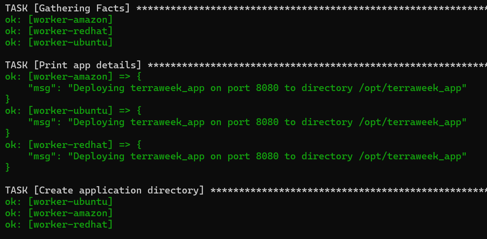
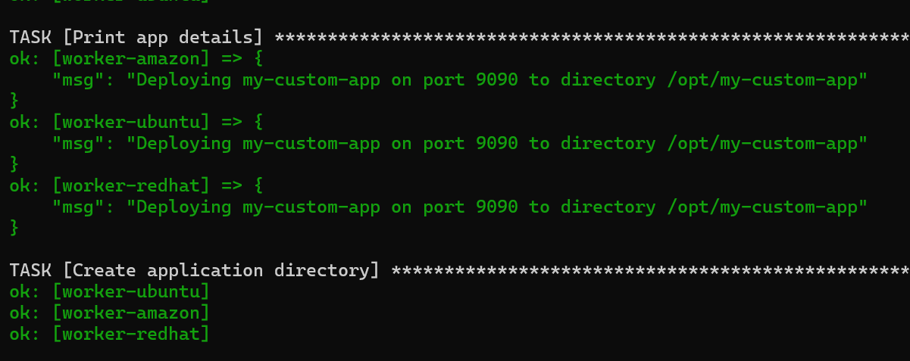

# Day 70 - Variables, Facts, Conditionals, and Loops


### Overview

In Day 70, the focus shifts from static playbooks to dynamic and flexible automation. In Day 69, playbooks executed the same tasks on every server. However, real-world infrastructure requires different configurations based on operating systems, environments, and server roles.

This day introduces variables, facts, conditionals, and loops, which allow playbooks to adapt automatically. These features make Ansible powerful for managing diverse systems using a single playbook.

### Objective

The objective of this day is to:

- Understand how to use variables in playbooks
- Learn how to use Ansible facts to make decisions
- Apply conditional logic (when) to control task execution
- Use loops to handle repetitive tasks efficiently
- Build flexible playbooks that behave differently per host

## Key Outcome

By the end of Day 70, I built dynamic Ansible playbooks that:
- Adapt based on OS and host groups
- Use variables from multiple sources
- Execute conditionally
- Perform bulk operations using loops
- Generate real-world server reports

---

## Table of Contents

| Task | Topic | Summary | Link |
|------|------|--------|------|
| Task 1 | Variables in Playbooks | Defined variables, used Jinja templating, handled package installation based on OS, and tested CLI overrides | [Go to Task 1](#task-1-variables-in-playbooks) |
| Task 2 | group_vars & host_vars | Externalized variables, applied group-level and host-level configs, and understood variable precedence | [Go to Task 2](#task-2-group_vars-and-host_vars) |
| Task 3 | Ansible Facts | Gathered system information using facts and used them dynamically in playbooks | [Go to Task 3](#task-3-ansible-facts----gathering-system-information) |
| Task 4 | Conditionals (`when`) | Controlled task execution based on OS, groups, and system facts using conditions | [Go to Task 4](#task-4-conditionals-with-when) |
| Task 5 | Loops | Automated repetitive tasks like user creation, directory setup, and package installation using loops | [Go to Task 5](#task-5-loops) |
| Task 6 | Server Health Report | Combined facts, register, conditionals, and debug to generate real-world server reports | [Go to Task 6](#task-6-server-health-report-register-debug-combine-everything) |

---

# Task 1: Variables in Playbooks
### Task Overview

In this task, I created a playbook that uses variables defined at the play level. These variables are used to configure application details such as name, port, directory, and required packages.

I also tested how variables can be overridden from the command line and verified variable resolution using debug output.

Additionally, I applied conditional logic to install packages based on the operating system, making the playbook cross-platform.

### Task Objective

The objective of this task is to:

- Define variables inside a playbook
- Use variables in tasks using Jinja templating
- Work with list variables (for packages)
- Understand variable resolution in different tasks
- Override variables using command-line arguments (`-e`)
- Use conditionals with facts to control execution based on OS

I created a playbook using variables defined at the play level.

- Variables included:
  - app_name
  - app_port
  - app_dir (using Jinja templating)
  - packages (list variable)

I verified:
- Variables correctly resolved in debug output
- Directory path dynamically created using variables
- Package installation worked based on OS using conditionals

Create 'varibles-demo.yml'
```YAML
---
- name: Variable demo
  hosts: all_servers
  become: true
  gather_facts: true

  vars:
    app_name: terraweek_app
    app_port: 8080
    app_dir: "/opt/{{ app_name }}"
    packages:
      - git
      - curl
      - wget


  tasks:
    - name: Print app details
      debug:
        msg: "Deploying {{ app_name }} on port {{ app_port }} to directory {{ app_dir }}"

    - name: Create application directory
      file:
        path: "{{ app_dir }}"
        state: directory
        owner: root
        group: root
        mode: '0755'

    - name: Install required packages on RedHat
      yum:
        name: "{{ packages }}"
        state: present
      when: #ansible_facts['os_family'] == "RedHat" and ansible_facts['distribution'] != "Amazon"
        - ansible_facts['os_family'] == "RedHat"
        - ansible_facts['distribution'] != "Amazon"


    - name: Install required packages on Debian
      apt:
        name: "{{ packages }}"
        state: present
        update_cache: true
      when: ansible_facts['os_family'] == "Debian"

    # Use package module (simpler, cross-platform) , Instead of splitting into yum and apt, you can let Ansible handle it:
    # This works for both RedHat and Debian families, so you can remove the when conditions entirely.
    #     Alternative cross-platform package install:
    # - name: Install required packages
    #   package:
    #     name: "{{ packages }}"
    #     state: present
```

I used:
```YAML
ansible-playbook playbooks/variables-demo.yml --check --diff
```
This showed:
- Directory state change from absent → directory
- Tasks skipped/executed based on OS conditions

```bash
ansible-playbook playbooks/variables-demo.yml
```




I also tested CLI override:
```bash
ansible-playbook playbooks/variables-demo.yml -e "app_name=my_custom_app app_port=9090"
```
[Explain -e](md/ansible_extra_vars_explanation.md)



### Verification
CLI variables override all other variable sources, including playbook vars, group_vars, and host_vars.

The debug output confirmed:

"Deploying terraweek_app on port 8080 to directory /opt/terraweek_app"

After overriding:

"Deploying my_custom_app on port 9090 to directory /opt/my_custom_app"


`-e` variables have highest priority in Ansible.

Even if the same variable exists in:

- vars
- group_vars
- host_vars

`-e` will override all of them.

---

# Task 2: group_vars and host_vars

## Overview

In this task, I moved variables out of the playbook and organized them
into dedicated directories: `group_vars/` and `host_vars/`. This
separates configuration from logic and allows the same playbook to
behave differently for different hosts and groups.

## Objective

-   Understand `group_vars` and `host_vars`
-   Apply variables based on groups and hosts
-   Learn automatic variable loading
-   Understand variable precedence
-   Build reusable playbooks

## Directory Structure

```text
ansible-practice/
├── ansible.cfg
├── inventory.ini
├── group_vars/
│   ├── all.yml
│   ├── ubuntu_web.yml
│   └── amz_db.yml
├── host_vars/
│   └── worker-ubuntu.yml
└── playbooks/
    ├── site.yml
    └── variables-demo.yml
```

---

### Simple Analogy

Think:
```text
host = target machine
group = collection of hosts
```
Example:
```text
worker-ubuntu → host
ubuntu_web → group
```
### One-Line Answer

A host in Ansible is a server defined in your inventory that Ansible connects to and manages

### Iportant Distinction

| Term           | Meaning                       |
| -------------- | ----------------------------- |
| host           | Ansible concept               |
| target machine | general term                  |
| worker node    | depends on system (K8s, etc.) |


---

# group_vars and host_vars Explained

## Overview

In Ansible, variables should not be hardcoded inside playbooks. Instead,
they are stored in special directories called `group_vars` and
`host_vars` to make playbooks dynamic and reusable.

They are folders where you store variables outside the playbook.

Instead of writing variables inside YAML playbooks, you define them here.

------------------------------------------------------------------------

## 1. group_vars (Group-level variables)

### Definition

`group_vars` contains variables that apply to all hosts within a
specific group or a group of servers.

### Example

Inventory:
```INI
[ubuntu_web]
worker-ubuntu

[amz_db]
worker-amazon
```

File:
```text
group_vars/ubuntu_web.yml
```
```YAML
http_port: 80
max_connections: 1000
```

This applies to:
```text
worker-ubuntu
```
- Real Meaning

> “All web servers should use port 80”

> All hosts in the `ubuntu_web` group will use these values.

------------------------------------------------------------------------

## 2. host_vars (Host-level variables)

### Definition

`host_vars` contains variables that apply to a single host.

Variables that apply to one specific machine

### Example

File:
```text
host_vars/worker-ubuntu.yml
```

```YAML
max_connections: 2000
custom_message: "Primary server"
```

Applies ONLY to:
```text
worker-ubuntu
```
### Real Meaning
“This specific server is special — override config”

Only `worker-ubuntu` will use these values.

------------------------------------------------------------------------

## Key Difference

group_vars → applies to a group\
host_vars → applies to a specific host

| Feature   | group_vars       | host_vars                  |
| --------- | ---------------- | -------------------------- |
| Scope     | Group of servers | One server                 |
| File name | group name       | host name                  |
| Use case  | common config    | overrides / special config |


------------------------------------------------------------------------

## Important Rule (VERY IMPORTANT)
```text
host_vars > group_vars
```
Example (your case)
```YAML
# group_vars/ubuntu_web.yml
max_connections: 1000
```
```YAML
# host_vars/worker-ubuntu.yml
max_connections: 2000
```

Final value used:
```text
2000
```

## How Ansible Uses Them (Flow)

When you run:
```bash
ansible-playbook site.yml
```
Ansible does:
```text
1. Load group_vars/all.yml
2. Load group_vars/<group>.yml
3. Load host_vars/<host>.yml
4. Resolve conflicts (host wins)
5. Run playbook
```

---

## Simple Analogy

Think like this:
- group_vars = company policy
- host_vars = employee exception

Example:
```text
Company rule: work 8 hours
Employee exception: work 6 hours
```
Final: 6 hours

---

## Why This is Powerful

Before (bad way):
```YAML
vars:
  app_env: dev
```
- Hardcoded 

---

Now (correct way):
```text
group_vars/
host_vars/
```
Dynamic + scalable

---

## Real DevOps Usage

This is used for:

- dev / staging / prod environments
- web / app / db servers
- different configs per machine

Without changing playbook

--- 

## One-Line Summary

`group_vars` = shared config
`host_vars` = override config

---

## Variable Files
group_vars/all.yml (applies to all hosts)
```YAML
ntp_server: pool.ntp.org
app_env: development
common_packages:
  - vim
  - htop
  - tree
```

## group_vars/ubuntu_web.yml (applies only to web servers)

```YAML
---
http_port: 80
max_connections: 1000
web_packages:
  - nginx
```

## group_vars/amz_db.yml (applies only to database servers)

```YAML
---
db_port: 3306
db_packages:
  - mysql-server
```

## host_vars/worker-ubuntu.yml (applies only to this host)

```YAML
max_connections: 2000
custom_message: "This is the primary web server"
```
Create: playbook/site.yml

```YAML
---
- name: Apply common config
  hosts: all_servers
  become: true

  tasks:
    - name: Install common packages on RedHat
      yum:
        name: "{{ common_packages }}"
        state: present
      when: ansible_facts['os_family'] == "RedHat"

    - name: Install common packages on Debian
      apt:
        name: "{{ common_packages }}"
        state: present
        update_cache: true
      when: ansible_facts['os_family'] == "Debian"

    - name: Show environment
      debug:
        msg: "Environment: {{ app_env }}"

- name: Configure web servers
  hosts: ubuntu_web
  become: true

  tasks:
    - name: Show web config
      debug:
        msg: "HTTP port: {{ http_port }}, Max connections: {{ max_connections }}"

    - name: Show host-specific message
      debug:
        msg: "{{ custom_message }}"
```

### Execution

```bash
ansible-playbook playbooks/site.yml
```

## Output Verification

### Common configuration (all hosts)
```text
Environment: development
```

This confirms variables from:

```text
group_vars/all.yml
```

### Web server configuration (worker-ubuntu)
```text
HTTP port: 80, Max connections: 2000
This is the primary web server
```

This confirms:
- http_port → from group_vars/ubuntu_web.yml
- max_connections → overridden by host_vars/worker-ubuntu.yml
- custom_message → from host_vars/worker-ubuntu.yml

## Variable Precedence

Variable resolution follows this order:

```text
group_vars/all.yml
        ↓
group_vars/<group>.yml
        ↓
host_vars/<host>.yml
        ↓
playbook vars
        ↓
extra vars (-e)
```

### Key Rule
```text
host_vars > group_vars
```
---

### Proof of Precedence

group_vars/all → group_vars/group → host_vars/host → playbook vars →
extra vars (-e)

Host vars override group vars.

- `group_vars/ubuntu_web.yml` defines:
```text
max_connections = 1000
```

- `host_vars/worker-ubuntu.yml` overrides:
```text
max_connections = 2000
```

### Final Output:
```text
Max connections: 2000
```

### Idempotency Check

Running the playbook a second time:

```bash
ansible-playbook playbooks/site.yml
```

Output:
```text
changed=0
```

This confirms:

- No unnecessary changes
- Playbook is idempotent

---

## Key Learnings
- Variables should not be hardcoded in playbooks
- `group_vars` allows group-level configuration
- `host_vars` allows host-specific overrides
- Ansible automatically loads variables based on inventory
- Variable precedence ensures correct value resolution
- Same playbook can behave differently per host


## Conclusion

In this task, I successfully separated variables from the playbook and implemented dynamic configuration using `group_vars` and `host_vars`. This approach enables scalable and maintainable infrastructure automation.

This is a core concept in real-world DevOps and configuration management.

---

# Task 3: Ansible Facts -- Gathering System Information

## Task Overview

In this task, I explored Ansible facts. Facts are system information automatically collected from managed nodes, such as operating system, hostname, IP address, memory, CPU, and network interfaces.

I used the `setup` module to view facts directly and then created a playbook to print selected facts for all servers.

## Task Objective

The objective of this task is to:

- Understand what Ansible facts are
- Use the `setup` module to inspect facts
- Filter specific facts using `filter=`
- Use facts inside a playbook
- Identify useful facts for real-world automation


## 1. Run facts ad-hoc commands
Because your host is `worker-ubuntu`, use that instead of `web-server`:
```bash
ansible worker-ubuntu -m setup
```

Filtered facts:
```bash
ansible worker-ubuntu -m setup -a "filter=ansible_os_family"
ansible worker-ubuntu -m setup -a "filter=ansible_distribution*"
ansible worker-ubuntu -m setup -a "filter=ansible_memtotal_mb"
ansible worker-ubuntu -m setup -a "filter=ansible_default_ipv4"
```

## 2. 2. Create playbook
```bash
vim ansible-practice/playbooks/facts-demo.yml
```

```YAML
---
- name: Facts demo
  hosts: all_servers
  gather_facts: true

  tasks:
    - name: Show OS info
      debug:
        msg: >
          Hostname: {{ ansible_facts['hostname'] }},
          OS: {{ ansible_facts['distribution'] }} {{ ansible_facts['distribution_version'] }},
          RAM: {{ ansible_facts['memtotal_mb'] }}MB,
          IP: {{ ansible_facts['default_ipv4']['address'] }}

    - name: Show all network interfaces
      debug:
        var: ansible_facts['interfaces']
```
### Playbook

I created `facts-demo.yml` to display:

- Hostname
- Operating system and version
- Total memory
- Private IP address
- Network interfaces

### Output

The playbook successfully ran on all servers:

- worker-amazon: Amazon 2023, RAM 916MB, IP 172.31.36.2
- worker-ubuntu: Ubuntu 24.04, RAM 911MB, IP 172.31.42.165
- worker-redhat: RedHat 10.1, RAM 907MB, IP 172.31.36.121

### Key Learning

Facts allow playbooks to dynamically adapt to each host without hardcoding values.

### Five Useful Facts

1. ansible_facts['os_family']
   → Used to select package manager (apt/yum)

2. ansible_facts['distribution']
   → Used for OS-specific configuration

3. ansible_facts['memtotal_mb']
   → Used to tune applications based on memory

4. ansible_facts['default_ipv4']['address']
   → Used to configure internal networking

5. ansible_facts['interfaces']
   → Used to inspect or configure network interfaces

## Summary

Ansible facts make playbooks dynamic. Instead of hardcoding server details, facts allow playbooks to automatically detect system information and make decisions based on each host.

---

# Task 4: Conditionals with when

## Overview

In this task, I used `when` conditions to control task execution based on host groups, OS type, and system facts.

## Objective

- Run tasks only on specific hosts
- Use group-based conditions
- Use OS-based conditions
- Use facts like memory and distribution
- Combine conditions using AND and OR

## Implementation

I created `conditional-demo.yml` with multiple conditional tasks:

- Installed Nginx only on Ubuntu web servers
- Detected database servers using group membership
- Displayed warning for low-memory systems
- Executed tasks based on OS (Amazon, Ubuntu)
- Used AND condition for group + memory
- Used OR condition for multiple groups

Create 'conditional-demo.yml'
```YAML
---
- name: Conditional tasks demo
  hosts: all_servers
  become: true
  gather_facts: true

  tasks:
    - name: Install Nginx only on Ubuntu web servers
      apt:
        name: nginx
        state: present
        update_cache: true
      when:
        - "'ubuntu_web' in group_names"
        - ansible_facts['os_family'] == "Debian"

    - name: DB server detected
      debug:
        msg: "This is a database server"
      when:
        - "'amz_db' in group_names"
        - ansible_facts['os_family'] == "RedHat"
      

    - name: Show warning on low memory hosts
      debug:
        msg: "WARNING: This host has less than 1GB RAM"
      when: ansible_facts['memtotal_mb'] < 1024

    - name: Run only on Amazon Linux
      debug:
        msg: "This is an Amazon Linux machine"
      when: ansible_facts['distribution'] == "Amazon"

    - name: Run only on Ubuntu
      debug:
        msg: "This is an Ubuntu machine"
      when: ansible_facts['distribution'] == "Ubuntu"

    - name: Run only in production
      debug:
        msg: "Production settings applied"
      when: app_env == "production"

    - name: Multiple conditions AND
      debug:
        msg: "Web server with enough memory"
      when:
        - "'ubuntu_web' in group_names"
        - ansible_facts['memtotal_mb'] >= 512

    - name: OR condition
      debug:
        msg: "Either web or app server"
      when: "'ubuntu_web' in group_names or 'redhat_app' in group_names"
```

[conditional-demo.yml output](md/abc.txt)

### Output Verification

The playbook correctly:

- Executed tasks only on matching hosts
- Skipped tasks on non-matching hosts
- Applied conditions based on group, OS, and facts

Example:
- Nginx ran only on worker-ubuntu
- Database task ran only on worker-amazon
- Ubuntu message only on worker-ubuntu
- Amazon message only on worker-amazon

### Key Learning

The `when` condition acts as a filter that determines whether a task runs or is skipped.

### Conclusion

Conditionals make playbooks intelligent by allowing different behavior on different hosts using the same playbook.

---

## Task 5: Loops

### Overview

In this task, I used loops to automate repetitive tasks such as creating users, directories, and installing packages.

### Objective

- Use loop to reduce repetition
- Create multiple users dynamically
- Create multiple directories
- Install multiple packages
- Combine loop with conditions

### Implementation

Create `loops-demo.yml`
```YAML
---
- name: Loops demo
  hosts: all_servers
  become: true
  gather_facts: true

  vars:
    users:
      - name: deploy
        groups: "{{ 'wheel' if ansible_facts['os_family'] == 'RedHat' else 'sudo' }}"
      - name: monitor
        groups: "{{ 'wheel' if ansible_facts['os_family'] == 'RedHat' else 'sudo' }}"
      - name: appuser
        groups: users

    directories:
      - /opt/app/logs
      - /opt/app/config
      - /opt/app/data
      - /opt/app/tmp

    packages:
      - git
      - unzip
      - jq
      - wget

  tasks:
    - name: Create multiple users
      user:
        name: "{{ item.name }}"
        groups: "{{ item.groups }}"
        state: present
      loop: "{{ users }}"

    - name: Create multiple directories
      file:
        path: "{{ item }}"
        state: directory
        mode: '0755'
      loop: "{{ directories }}"

    - name: Install packages on RedHat
      yum:
        name: "{{ item }}"
        state: present
      loop: "{{ packages }}"
      when: ansible_facts['os_family'] == "RedHat"

    - name: Install packages on Ubuntu
      apt:
        name: "{{ item }}"
        state: present
        update_cache: true
      loop: "{{ packages }}"
      when: ansible_facts['os_family'] == "Debian"

    - name: Print each user created
      debug:
        msg: "Created user {{ item.name }} in group {{ item.groups }}"
      loop: "{{ users }}"

    - name: Print each packages
      debug:
        msg: "Packages Installed {{ item }}"
      loop: "{{ packages }}"
```
[loops-demo.yml output](md/abc-task-5.txt)

- Created users using a loop
- Assigned user groups dynamically based on OS
- Created multiple directories
- Installed packages using OS-specific conditions
- Printed output for each loop iteration

### Key Features

- Used `loop` with list of dictionaries for users
- Used conditional logic inside variables
- Combined `loop` with `when` for OS-specific tasks

### Example Output

Each loop iteration is shown separately:

- Created user deploy
- Created user monitor
- Created user appuser

- Installed packages: git, unzip, jq, wget

### loop vs with_items

| Feature | loop | with_items |
|--------|------|-----------|
| Syntax | Modern | Deprecated |
| Flexibility | High | Limited |
| Readability | Clean | Less clear |
| Recommendation |  Use |  Avoid |

### Key Learning

The `loop` keyword allows repeating a task for multiple values, making playbooks shorter, cleaner, and more powerful.

### Conclusion

Loops are essential for scalable automation and eliminate duplication in playbooks.

---

# Task 6: Server Health Report (Register, Debug, Combine Everything)

### Overview

In this task, I built a real-world Ansible playbook that combines multiple concepts including variables, facts, conditionals, loops, and the `register` keyword to generate a detailed server health report.

The playbook collects system information dynamically and saves it into a structured report file on each server.

---

### Objective

- Use `register` to capture command output
- Use Ansible facts for system information
- Combine multiple tasks into a meaningful workflow
- Generate readable reports
- Save reports to files on remote servers

---

### Playbook: `server-report.yml`

The playbook performs the following:

1. Checks disk usage using `df -h`
2. Checks memory usage using `free -m`
3. Lists running services using `systemctl`
4. Retrieves public IP using `curl`
5. Uses `register` to store outputs
6. Displays formatted output using `debug`
7. Saves the report to `/tmp/server-report-<hostname>.txt`

Create 'server-report.yml'
```YAML
---
- name: Server Health Report
  hosts: all_servers
  become: true
  gather_facts: true

  tasks:
    - name: Check disk space
      command: df -h /
      register: disk_result
      changed_when: false

    - name: Check memory
      command: free -m
      register: memory_result
      changed_when: false

    - name: Check running services
      shell: systemctl list-units --type=service --state=running | head -20
      register: services_result
      changed_when: false

    - name: Derive Public IP
      shell: curl -s ifconfig.me
      register: pub_ip
      changed_when: false

    - name: Generate Report
      debug:
        msg:
          - "========== {{ inventory_hostname }} =========="
          - "OS: {{ ansible_facts['os_family'] }} {{ ansible_facts['distribution'] }} {{ ansible_facts['distribution_version'] }}"
          - "PVT_IP: {{ ansible_facts['default_ipv4']['address'] }}"
          - "PUB_IP: {{ pub_ip.stdout }}"
          - "RAM: {{ ansible_facts['memtotal_mb'] }}MB"
          - "Disk:"
#         - "{{ disk_result.stdout | default('Disk output not available') }}" # --check
          - "{{ disk_result.stdout_lines[1] }}"
          - "Running services first 20 count: {{ services_result.stdout_lines | length }}"

    - name: Save report to file
      copy:
        content: |
          Server: {{ inventory_hostname }}
          OS: {{ ansible_facts['distribution'] }} {{ ansible_facts['distribution_version'] }}
          PVT_IP: {{ ansible_facts['default_ipv4']['address'] }}
          PUB_IP: {{ pub_ip.stdout }}
          RAM: {{ ansible_facts['memtotal_mb'] }}MB

          Disk:
          {{ disk_result.stdout }}

          Memory:
          {{ memory_result.stdout }}

          Running services:
          {{ services_result.stdout }}

          Checked at: {{ ansible_facts['date_time']['iso8601'] }}
        dest: "/tmp/server-report-{{ inventory_hostname }}.txt"
        mode: '0644'
```

[server-report output](md/task-6.txt)

---

### Key Concepts Used

#### 1. Register

The `register` keyword stores the output of a task:

    register: disk_result

This allows reuse of command output in later tasks.

---

#### 2. Ansible Facts

Used to retrieve system information dynamically:

    ansible_facts['distribution']
    ansible_facts['memtotal_mb']
    ansible_facts['default_ipv4']['address']

---

#### 3. Debug for Reporting

Used to print structured output:

    debug:
      msg:
        - "========== {{ inventory_hostname }} =========="
        - "OS: {{ ansible_facts['distribution'] }}"

---

#### 4. Safe Handling with `default()`

To prevent errors when data is unavailable (especially in check mode):

    {{ disk_result.stdout | default('Disk output not available') }}

---

#### 5. File Creation

Reports are saved on each server:

    dest: "/tmp/server-report-{{ inventory_hostname }}.txt"

---

### Output Verification

After running the playbook:

#### Files Created

    ansible all_servers -m shell -a "ls -l /tmp/server-report-*.txt"

Each server generated its own report file.

---

#### Sample Report Content

    Server: worker-ubuntu
    OS: Ubuntu 24.04
    PVT_IP: 172.31.33.4
    PUB_IP: 18.222.187.158
    RAM: 911MB

    Disk:
    Filesystem      Size  Used Avail Use% Mounted on
    /dev/root       8.7G  1.8G  6.9G  21% /

    Memory:
    Mem: 911MB

    Running services:
    ssh.service
    cron.service
    dbus.service
    ...

---

### Key Learning

- The `register` keyword captures task output for reuse
- Facts provide dynamic system information
- Command and shell modules help inspect system state
- `default()` prevents failures when data is missing
- Combining all concepts enables real-world automation

---

### Conclusion

This task demonstrated how to build a complete, real-world Ansible automation workflow. By combining facts, variables, conditionals, loops, and registered outputs, I created a dynamic server health reporting system that works across multiple hosts.

This represents practical configuration management and monitoring using Ansible.

---


