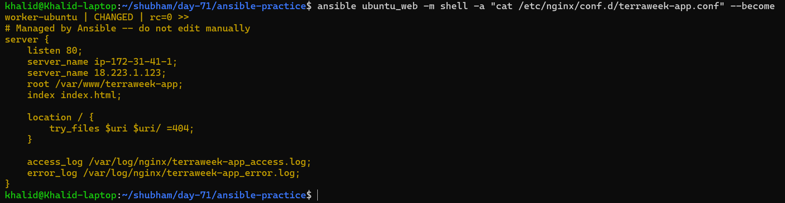
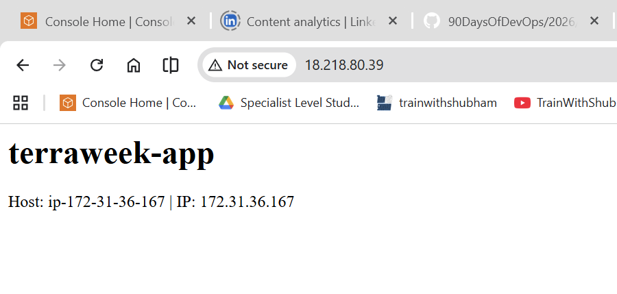

# Day 71 - Roles, Galaxy, Templates and Vault

## Day 71 Overview

In Day 71, the focus moves from writing large playbooks to organizing Ansible automation in a clean and reusable way.

As playbooks grow, it becomes difficult to manage everything in one YAML file. Real projects usually have separate responsibilities like web servers, database servers, load balancers, and monitoring agents.

Ansible roles help solve this problem by organizing tasks, variables, handlers, templates, and files into a standard directory structure.

Today also introduces Jinja2 templates for dynamic configuration files, Ansible Galaxy for using community roles, and Ansible Vault for protecting secrets.

### Jinja2 templates:
In Ansible, Jinja2 templates let you create dynamic configuration files using variables, conditions, and loops.\
[Jinja2 templates Explanation](md/ansible_jinja2_templates.md)

### Dynamic configuration files:
A dynamic configuration file is a file whose content is generated automatically based on variables, logic, or environment, instead of being completely fixed (static).\
[Dynamic configuration files Explanation](md/dynamic_configuration_files.md)

### Ansible Galaxy for using community roles:
Ansible Galaxy is a platform used to find, share, and reuse Ansible roles and collections created by the community.\
[Ansible Galaxy for using community roles Explanation](md/ansible_galaxy_community_roles.md)

Think of it like an app store for Ansible automation—instead of writing everything from scratch, you can download ready-made roles.

### Ansible Vault for protecting secrets:
Ansible Vault is a feature in Ansible that lets you encrypt sensitive data—like passwords, API keys, and private credentials—so they’re secure even if your code is shared.\
[Ansible Vault for protecting secrets Explanation](md/ansible_vault_secrets.md)

---

## Day 71 Objective

The objective of this task is to:

- Understand why roles are used in Ansible
- Create a custom Ansible role from scratch
- Use Jinja2 templates to generate dynamic config files
- Install and use a role from Ansible Galaxy
- Encrypt secrets using Ansible Vault
- Learn when to use roles, playbooks, and ad-hoc commands

---

# Table of Contents — Day 71

| Task | Title | Summary | Link |
|------|------|--------|------|
| Task 1 | Jinja2 Templates | Created dynamic Nginx configuration using Jinja2 templates, variables, and Ansible facts. Deployed and verified idempotent configuration. | [Task 1](#task-1-jinja2-templates) |
| Task 2 | Role Structure | Learned Ansible role directory structure and difference between defaults vs vars. Explored Galaxy-generated role skeleton. | [Task 2](#task-2-understanding-ansible-role-structure) |
| Task 3 | Custom Webserver Role | Built a reusable Nginx role using tasks, templates, handlers, and variables. Deployed a working web server. | [Task 3](#task-3-build-a-custom-webserver-role) |
| Task 4 | Ansible Galaxy | Used community roles (geerlingguy.docker), managed dependencies using requirements.yml, and applied roles in playbooks. | [Task 4](#task-4-ansible-galaxy--use-community-roles) |
| Task 5 | Ansible Vault | Secured sensitive data using Vault, created encrypted variables, and used them safely in playbooks. | [Task 5](#task-5-ansible-vault-encrypt-secrets) |
| Task 6 | Integration (Roles + Galaxy + Vault) | Combined all concepts into a single site.yml, deployed multi-tier setup, debugged Docker issue, and securely rendered DB config. | [Task 6](#task-6-combine-roles-templates-galaxy-and-vault) |

---

# Task 1: Jinja2 Templates

## Task Overview

In this task, I created a Jinja2 template for an Nginx virtual host configuration.

Templates are useful when the same configuration file is needed on multiple servers, but some values should change dynamically, such as application name, hostname, port number, or IP address.

Instead of writing a static config file, Ansible renders the template using variables and facts.

---

## Task Objective

The objective of this task is to:

- Create a Jinja2 template file ('.j2')
- Use variables inside a template
- Use Ansible facts inside a template
- Deploy the rendered config file using the `template` module
- Validate rendered output
- Run the playbook with `--diff`
- Verify that variables are replaced with real values
- Ensure idempotency

---

## Directory Structure

```bash
ansible-practice/
├── inventory.ini
├── playbooks/
│   └── template-demo.yml
└── templates/
    └── nginx-vhost.conf.j2
```
### Create Template Directory

```bash
mkdir -p templates
```

Create `templates/nginx-vhost.conf.j2`
```jinja
# Managed by Ansible -- do not edit manually
server {
    listen {{ http_port | default(80) }};
    server_name {{ ansible_facts['hostname'] | default(inventory_hostname) }};
    server_name {{ ansible_host | default(ansible_facts['hostname']) }};
    root /var/www/{{ app_name }};
    index index.html;

    location / {
        try_files $uri $uri/ =404;
    }

    access_log /var/log/nginx/{{ app_name }}_access.log;
    error_log /var/log/nginx/{{ app_name }}_error.log;
}
```

## Rendered Output (Generated Config):
```Nginx
# Managed by Ansible -- do not edit manually
server {
    listen 80;
    server_name ip-172-31-36-167;
    server_name 18.223.1.123;
    root /var/www/terraweek-app;
    index index.html;

    location / {
        try_files $uri $uri/ =404;
    }

    access_log /var/log/nginx/terraweek-app_access.log;
    error_log /var/log/nginx/terraweek-app_error.log;
}
```

### [URI vs URL vs URN](md/uri-url-urn.md)

---

### [Template Explanation](md/nginx_jinja2_template_explanation.md):
- {{ http_port }} inserts the port number
- default(80) uses port 80 if http_port is not defined
- {{ ansible_hostname }} inserts the managed server hostname
- {{ app_name }} inserts the application name
- .j2 is the common extension for Jinja2 templates

---

## Playbook`
File: `playbooks/template-demo.yml`
```YAML
---
- name: Deploy Nginx with template
  hosts: ubuntu_web
  become: true
  gather_facts: true

  vars:
    app_name: terraweek-app
    http_port: 80

  tasks:
    - name: Install Nginx
      apt:
        name: nginx
        state: present
        update_cache: true

    - name: Remove default nginx site
      file:
        path: /etc/nginx/sites-enabled/default
        state: absent

    - name: Create web root
      file:
        path: "/var/www/{{ app_name }}"
        state: directory
        mode: '0755'

    - name: Deploy vhost config from template
      template:
        src: ../templates/nginx-vhost.conf.j2
        dest: "/etc/nginx/conf.d/{{ app_name }}.conf"
        owner: root
        mode: '0644'
      notify: Restart Nginx

    - name: Deploy index page
      copy:
        content: |
          "<h1>{{ app_name }}</h1>
          <p>Host: {{ ansible_facts['hostname'] }} | IP: {{ ansible_facts['default_ipv4']['address'] }}</p>"
        dest: "/var/www/{{ app_name }}/index.html"

  handlers:
    - name: Restart Nginx
      service:
        name: nginx
        state: restarted
```

## Verification
### Check configuration file
```bash
ansible -i inventory.ini ubuntu_web -m shell -a "cat /etc/nginx/conf.d/terraweek-app.conf" --become
```


### Test application output
```bash
curl http://18.223.1.123
```
```output
khalid@Khalid-laptop:~/shubham/day-71/ansible-practice$ curl http://18.223.1.123
"<h1>terraweek-app</h1>
<p>Host: ip-172-31-41-1 | IP: 172.31.41.1</p>"
khalid@Khalid-laptop:~/shubham/day-71/ansible-practice$
```



## Idempotency Check
### Re-running the playbook:
```bash
ansible-playbook playbooks/template-demo.yml
```
Result:
```text
PLAY RECAP *********************************************************************
worker-ubuntu              : ok=6    changed=0    unreachable=0    failed=0    skipped=0    rescued=0    ignored=0
```
- Confirms no unnecessary changes
- Playbook is idempotent

## Key Learnings
- Jinja2 templates enable dynamic configuration
- {{ variable }} is used for value substitution
- default() provides fallback values
- Ansible facts allow system-specific configuration
- Default Nginx configuration must be removed to avoid conflicts
- Idempotency ensures stable and repeatable automation

## Conclusion

In this task, I successfully implemented Jinja2 templates to dynamically configure Nginx using Ansible. I validated template rendering, handled default configuration conflicts, and confirmed idempotent execution.

This forms the foundation for scalable and reusable infrastructure automation.

---

# Task 2: Understanding Ansible Role Structure

## Overview

In this task, we explored the structure of an Ansible Role and understood the purpose of each directory. Roles help organize automation into reusable and scalable components.

---

## Role Directory Structure

```
roles/
└── webserver/
    ├── tasks/
    │   └── main.yml        # The main task list
    ├── handlers/
    │   └── main.yml        # Handlers (restart services, etc.)
    ├── templates/
    |   └──nginx.conf.j2    # Jinja2 templates
    ├── files/
    |   └──index.html       # Static files to copy
    ├── vars/
    │   └── main.yml        # Role variables (high priority)
    ├── defaults/
    │   └── main.yml         # Default variables (low priority, easily overridden)
    ├── meta/
    │   └── main.yml         # Role metadata and dependencies
    └── README.md
```

---

## Directory Explanation

### tasks/
Contains the main list of tasks executed by the role.

### handlers/
Defines handlers such as restarting services.

### templates/
Stores Jinja2 template files used for dynamic configuration.

### files/
Stores static files to be copied without modification.

### vars/
Contains variables with **high priority**.

### defaults/
Contains variables with **low priority** (can be overridden).

### meta/
Defines role metadata and dependencies.

---

## Difference: vars/main.yml vs defaults/main.yml
### SIMPLE ANSWER (remember this)
```text
defaults → low priority (can be overridden easily)
vars     → high priority (hard to override)
```
## Deep Understanding
### defaults/main.yml
- Lowest priority variables
- Can be easily overridden
   - playbook
   - inventory
   - extra vars
- Used for configurable values

Example:
```YAML
# defaults/main.yml
http_port: 80
app_name: terraweek-app
```
### You can override:
```YAML
vars:
  http_port: 8080
```
Works easily

---

### vars/main.yml
- Higher priority variables
- Difficult to override
- Used for internal role configuration
- Should NOT be changed by user

Example:
```YAML
nginx_user: www-data
```
### Even if you try:
```YAML
vars:
  nginx_user: apache
```
It may NOT override (vars has higher priority)
---

## Comparison Table

| Feature          | defaults            | vars               |
| ---------------- | ------------------- | ------------------ |
| Priority         | Low                 | High               |
| Override allowed | Yes                 |  Difficult         |
| Purpose          | Configurable values | Internal constants |
| Use case         | Ports, app names    | System configs     |


---

## Easy Analogy

Think like:
- defaults/ → "User can change this"
- vars/ → "System rule, don’t touch"

---

## Real Example (your project)
defaults/main.yml
```YAML
app_name: terraweek-app
http_port: 80
```

vars/main.yml
```YAML
nginx_conf_path: /etc/nginx/conf.d/
```

## Common Mistake

Beginners put everything in vars/ 

- Then nothing can be overridden
- Role becomes useless

## Best Practice
```text
Put most variables in defaults/
Use vars/ only when necessary
```

## defaults/main.yml contains variables with the lowest priority and can be easily overridden by playbooks, inventory, or extra variables.

## vars/main.yml contains variables with higher priority and is used for internal role configuration that should not be overridden.

```
khalid@Khalid-laptop:~/shubham/day-71/ansible-practice$ ansible-galaxy init roles/webserver
- Role roles/webserver was created successfully
```

```bash
khalid@Khalid-laptop:~/shubham/day-71/ansible-practice$ tree roles/
roles/
└── webserver
    ├── README.md          # Documentation for the role (what it does, usage, variables)
    ├── defaults
    │   └── main.yml       # defaults/main.yml contains low-priority variables used as fallback values and can be overridden by playbooks or inventory.
    ├── files              # Static files (copied as-is using copy module, no templating)
    ├── handlers
    │   └── main.yml       # Handlers triggered by notify (e.g., restart nginx after config change)
    ├── meta
    │   └── main.yml       # Role metadata (author, dependencies, supported platforms)
    ├── tasks
    │   └── main.yml       # The main task list
    ├── templates          # Jinja2 templates (.j2 files rendered dynamically with variables)
    ├── tests
    │   ├── inventory      # Test inventory for validating the role
    │   └── test.yml       # Test playbook to verify role functionality
    └── vars
        └── main.yml       # Role variables (higher priority than defaults, harder to override)
        
10 directories, 8 files
```
## “Why use roles?”
Answer:
```text
To organize playbooks into reusable, modular, and maintainable components.
```
---

## Exploration of Generated Role
I used ansible-galaxy init roles/webserver to generate a role skeleton.

The generated structure included directories such as tasks, handlers, templates, files, vars, defaults, and meta. Each directory contains a main.yml file that Ansible automatically loads.

The README.md file provided a template for documenting the role, including sections for description, variables, dependencies, and example usage.

Galaxy gives you:
> A standard structure + documentation template
You are responsible for:

- filling tasks
- adding templates
- defining variables
- updating README

### “Explore directory” = check structure
### “Read README.md” = understand how to document a role

## Key Learning

- Roles provide structure and reusability
- defaults/ is flexible and user-friendly
- vars/ is strict and controlled
- Proper use of both ensures maintainable automation

---

## Conclusion

Understanding role structure is essential for building scalable Ansible projects. Using defaults and vars correctly helps balance flexibility and control in automation.

[Task-2](md/task-2.txt)

---

# Task 3: Build a Custom Webserver Role

## Overview

In this task, I built a complete Ansible role from scratch to configure a web server using Nginx. The role follows standard Ansible structure, making the automation reusable, scalable, and production-ready.

The role includes tasks for installing Nginx, deploying configuration files using Jinja2 templates, managing services, and serving a dynamic web page.

---

## Objectives

- Understand and implement Ansible role structure
- Create reusable automation using roles
- Use Jinja2 templates for dynamic configuration
- Manage services using handlers
- Apply variable precedence using defaults and playbook overrides
- Deploy a working Nginx web server using a role
- Verify output using curl

---

## Key Components Implemented

- **defaults/**: Configurable variables (`app_name`, `http_port`, `max_connections`)
- **tasks/**: Install Nginx, deploy configs, create directories, manage service
- **handlers/**: Restart Nginx when configuration changes
- **templates/**: Dynamic configs and HTML page using Jinja2
- **site.yml**: Calls role and overrides defaults

## Final Directory Flow
```bash
ansible-practice/
├── inventory.ini
├── site.yml    # this is the entry point of your entire automation. site.yml tells Ansible: which servers to target and which roles to apply
└── roles/
    └── webserver/
        ├── defaults/     
        │   └── main.yml      # defaults/main.yml contains low-priority variables used as fallback values and can be overridden by playbooks or inventory.
        ├── tasks/
        │   └── main.yml   # tasks/main.yml defines the step-by-step actions that Ansible will perform
        ├── handlers/
        │   └── main.yml  # handlers/main.yml contains handlers, which are special tasks that run only when triggered by other tasks. They are typically used to restart services or reload configurations when changes occur.
        │
        └── templates/
            ├── nginx.conf.j2  # Jinja2 template for the main Nginx configuration file, It controls how Nginx itself works (global settings)
            ├── vhost.conf.j2  # It creates the configuration that tells Nginx how to serve your website. An Nginx virtual host (server block) is a configuration that tells Nginx how to serve a specific website or application. 
            └── index.html.j2 # roles/webserver/templates/index.html.j2 is a Jinja2 template used to generate a dynamic HTML page. It contains variables and Ansible facts that are replaced with real values during execution, and the final output is saved as a static HTML file on the server. Saved to /var/www/terraweek/index.html
```
## Difference between site.yml vs playbook vs role

[dynamic_configuration_files](md/dynamic_configuration_files.md)

### 1. High-Level Idea
```text
site.yml = entry point (runs everything)
playbook = instructions for servers
role = reusable module (organized logic)
```
### 2. What is a Playbook?
A playbook is:

> A YAML file that defines tasks to run on servers
Example
```YAML
- hosts: ubuntu_web
  tasks:
    - name: Install nginx
      apt:
        name: nginx
```
This is a basic playbook

### 3. What is a Role?
A role is:

> A structured, reusable collection of tasks, templates, handlers, and variables

#### structure
```bash
roles/webserver/
├── tasks/
├── templates/
├── handlers/
├── defaults/
```

Instead of writing everything in one file → we organize it

### 4. What is site.yml?

site.yml is:

> A main playbook that calls roles
Example
```YAML
- hosts: ubuntu_web
  roles:
    - webserver
```
It doesn’t contain logic
It just connects roles to servers


### Relationship (VERY IMPORTANT)
> site.yml → calls role → role runs tasks → tasks configure server
### Easy Analogy
```text
site.yml = Manager
role = Team
tasks = Workers
```
Manager says:

"Team webserver, go configure these servers"

### Comparison Table

| Feature        | site.yml      | Playbook         | Role               |
| -------------- | ------------- | ---------------- | ------------------ |
| Purpose        | Entry point   | Defines tasks    | Reusable structure |
| Contains logic | ❌ Minimal     | ✅ Yes            | ✅ Yes              |
| Reusability    | Low           | Medium           | High               |
| Structure      | Simple        | Flat             | Organized          |
| Used for       | Running roles | Direct execution | Modular automation |


### Real Example (your case)
### Without role (playbook only)
```YAML
- hosts: ubuntu_web
  tasks:
    - install nginx
    - copy config
    - start service
```
#### Hard to manage

### With role
```YAML
# site.yml
- hosts: ubuntu_web
  roles:
    - webserver
```
#### Clean + scalable

## Key Differences
#### Playbook vs Role
```text
Playbook = flat script
Role = structured reusable component
```
#### site.yml vs Playbook
```text
site.yml is also a playbook,
but specifically used as the main entry point
```
#### Role vs site.yml
```text
Role = logic
site.yml = execution trigger
```

## Conclusion
```text
A playbook is a YAML file that defines tasks to run on servers. 
A role is a structured and reusable collection of tasks, templates, and variables. 
site.yml is the main playbook that acts as an entry point and calls roles to execute automation.
```
## 1. Create role skeleton
```bash
ansible-galaxy init roles/webserver
```

[nginx-filesystem-english](md/nginx-filesystem-english.md)

[nginx-filesystem-roman-urdu](md/nginx-filesystem-roman-urdu.md)

## 2. `roles/webserver/defaults/main.yml`

> defaults/main.yml contains low-priority variables used as fallback values and can be overridden by playbooks or inventory.


```YAML
---
http_port: 80
app_name: myapp
max_connections: 512
```

## 3. `roles/webserver/tasks/main.yml`

> tasks/main.yml defines the step-by-step actions that Ansible will perform

```YAML
---
- name: Install Nginx
  apt:
    name: nginx
    state: present
    update_cache: true

- name: Remove default nginx site
  file:
    path: /etc/nginx/sites-enabled/default
    state: absent

- name: Create web root
  file:
    path: "/var/www/{{ app_name }}"
    state: directory
    mode: '0755'

- name: Deploy Nginx config
  template:
    src: nginx.conf.j2
    dest: /etc/nginx/nginx.conf
    owner: root
    mode: '0644'
  notify: Restart Nginx

- name: Deploy vhost config
  template:
    src: vhost.conf.j2
    dest: "/etc/nginx/conf.d/{{ app_name }}.conf"
    owner: root
    mode: '0644'
  notify: Restart Nginx

- name: Deploy index page
  template:
    src: index.html.j2
    dest: "/var/www/{{ app_name }}/index.html"
    mode: '0644'

- name: Start and enable Nginx
  service:
    name: nginx
    state: started
    enabled: true
```

## 4. `roles/webserver/handlers/main.yml`

> handlers/main.yml contains handlers, which are special tasks that run only when triggered by other tasks. They are typically used to restart services or reload configurations when changes occur.

```YAML
---
- name: Restart Nginx
  service:
    name: nginx
    state: restarted
```

## 5. `roles/webserver/templates/index.html.j2`

> roles/webserver/templates/index.html.j2 is a Jinja2 template used to generate a dynamic HTML page. It contains variables and Ansible facts that are replaced with real values during execution, and the final output is saved as a static HTML file on the server. Saved to /var/www/terraweek/index.html

```HTML
<h1>{{ app_name }}</h1>
<p>Server: {{ ansible_facts['hostname'] }}</p>
<p>IP: {{ ansible_facts['default_ipv4']['address'] }}</p>
<p>Environment: {{ app_env | default('development') }}</p>
<p>Managed by Ansible</p>
```

## 6. `roles/webserver/templates/vhost.conf.j2`

> It creates the configuration that tells Nginx how to serve your website. An Nginx virtual host (server block) is a configuration that tells Nginx how to serve a specific website or application. 

[nginx-virtual-host](md/nginx-virtual-host.md)

```Nginx
server {
    listen {{ http_port | default(80) }};
    server_name {{ ansible_host | default(inventory_hostname) }};

    root /var/www/{{ app_name }};
    index index.html;

    location / {
        try_files $uri $uri/ =404;
    }

    access_log /var/log/nginx/{{ app_name }}_access.log;
    error_log /var/log/nginx/{{ app_name }}_error.log;
}
```

## 7. `roles/webserver/templates/nginx.conf.j2`

> Jinja2 template for the main Nginx configuration file, It controls how Nginx itself works (global settings)

[nginx-conf-template](md/nginx-conf-template.md)

```Nginx
user www-data;
worker_processes auto;
pid /run/nginx.pid;

events {
    worker_connections {{ max_connections }};
}

http {
    sendfile on;
    tcp_nopush on;
    types_hash_max_size 2048;

    include /etc/nginx/mime.types;
    default_type application/octet-stream;

    access_log /var/log/nginx/access.log;
    error_log /var/log/nginx/error.log;

    gzip on;

    include /etc/nginx/conf.d/*.conf;
}
```

## 8. `site.yml`

> this is the entry point of your entire automation. site.yml tells Ansible: which servers to target and which roles to apply

[site-yml-explanation](md/site-yml-explanation.md)

Create this in project root:
> site.yml/roles
```YAML
---
- name: Configure web servers
  hosts: ubuntu_web
  become: true

  roles:
    - role: webserver
      vars:
        app_name: terraweek
        http_port: 80
        app_env: development
```

## Run
From `ansible-practice/`:
```bash
ansible-playbook -i inventory.ini site.yml --diff
```

## Verify

```bash
curl http://18.223.1.123
```
```output
<h1>terraweek</h1>
<p>Server: ip-...</p>
<p>IP: 172...</p>
<p>Environment: development</p>
<p>Managed by Ansible</p>
```
---

[nginx-domain-based-multi-site](md/nginx-domain-based-multi-site.md)
[two-websites-nginx-ansible](md/two-websites-nginx-ansible.md)

---

## Outcome

- Successfully deployed a web server using a reusable Ansible role
- Verified dynamic content rendering using Jinja2 templates
- Confirmed idempotent execution (`changed=0` on re-run)
- Validated output using public IP and curl

---

## Conclusion

This task demonstrated how to convert playbooks into structured roles, enabling scalable and maintainable infrastructure automation.

---

# Task 4: Ansible Galaxy — Use Community Roles

## Task Overview

In this task, I learned how to use **Ansible Galaxy**, which is a community marketplace for reusable Ansible roles.

Instead of writing every role from scratch, Ansible Galaxy allows DevOps engineers to install pre-built roles created by the community. These roles can be used to configure common tools such as Docker, Nginx, MySQL, NTP, and many others.

For this task, I searched for Galaxy roles, installed a community Docker role, checked installed roles, and used the role inside a playbook.

---

## Task Objectives

The objectives of this task are to:

- Understand what Ansible Galaxy is
- Search for community roles
- Install a role from Ansible Galaxy
- Verify installed roles
- Use a Galaxy role inside a playbook
- Create a `requirements.yml` file for role dependency management
- Understand why `requirements.yml` is better than manual role installation

---

## What is Ansible Galaxy?

Ansible Galaxy is a public marketplace for Ansible roles and collections.

It allows users to download and reuse roles instead of writing everything manually.

Example use cases:

- Install Docker
- Configure Nginx
- Install MySQL
- Configure NTP
- Manage users and packages

### Instead of writing everything:
```text
Install Docker → already done by someone
Install Nginx → already done
Setup MySQL → already done
```

---

## Search for Roles

### Search for Nginx roles

```bash
ansible-galaxy search nginx --platforms EL
```
> This command searches Ansible Galaxy for roles related to nginx that support Enterprise Linux systems.

[ansible-galaxy search nginx --platforms EL Explanation](md/ansible-galaxy-search-nginx.md)

[How to pick the best role from search results](md/choose-best-ansible-galaxy-role.md)

### Search for MySQL roles

```bash
ansible-galaxy search mysql
```

These commands search Ansible Galaxy for available community roles.

---

## Install Docker Role

For this task, I installed the Docker role created by Jeff Geerling:
[Jeff Geerling](https://galaxy.ansible.com/ui/standalone/roles/geerlingguy/docker/documentation/)

## Two possible setups
### 1. Default/Global location

```bash
ansible-galaxy install geerlingguy.docker
```
It installs here:
```bash
~/.ansible/roles/
```

### 2. Locall/project location:

```bash
ansible-galaxy install -r requirements.yml -p roles/
```
```bash
ansible-practice
├──roles/
    ├── geerlingguy.docker/
    ├── geerlingguy.ntp/
```

## Option 2 (Project-based - recommended)
```bash
ansible-practice/
├── inventory.ini
├── docker-setup.yml
├── requirements.yml
└── roles/
    ├── geerlingguy.docker/
    └── geerlingguy.ntp/
```

---

## Check Installed Roles

```bash
ansible-galaxy list
```

Expected role:

```bash
geerlingguy.docker
```

This confirms that the Galaxy role was installed successfully.

---

## Inventory Adjustment

The task example uses:

```yaml
hosts: app
```

In my inventory, the application server group is:

```ini
[redhat_app]
worker-redhat ansible_host=<public-ip> ansible_user=ec2-user
```

So I used:

```yaml
hosts: redhat_app
```

This targets the app server from my actual inventory.

---

## Docker Setup Playbook

**File:** `docker-setup.yml`

```yaml
---
- name: Install Docker using Galaxy role
  hosts: redhat_app
  become: true

  roles:
    - geerlingguy.docker
```

## requirements.yml
```YAML
---
roles:
  - name: geerlingguy.docker
    version: "8.0.0"

  - name: geerlingguy.ntp
```

## DOCUMENTATION ANSWER
### Why use `requirements.yml` instead of manual install?
### Simple Answer
> requirements.yml allows you to manage and install multiple roles in a consistent, repeatable, and version-controlled way.

## Detailed Explanation
### 1. Reproducibility
Manual
```bash
ansible-galaxy install -r requirements.yml -p roles/
```
- You may forget version
- Different environments = different versio

With `requirements.yml`:
```YAML
version: "8.0.0"
```
- Same version everywhere
- Predictable setup

### 2. Install multiple roles at once
Instead of:
```bash
install role1
install role2
install role3
```
Just:
```bash
ansible-galaxy install -r requirements.yml -p roles/
```

### 3. Version control (VERY IMPORTANT)
You can commit this file to Git:
```bash
requirements.yml
```
- Team gets same roles
- No mismatch

### 4. Automation friendly
```bash
ansible-galaxy install -r requirements.yml -p roles/
```
- Auto setup
- No manual steps

### 5. Clean dependency management
Like:
```text
requirements.txt (Python)
package.json (Node)
```

## Comparison

| Feature            | Manual install | requirements.yml |
| ------------------ | -------------- | ---------------- |
| Repeatable         | No             | Yes              |
| Version control    | No             | Yes              |
| Multi-role install | No             | Yes              |
| Team-friendly      | No             |Yes               |
| Automation         | Hard           |Easy              |

## Easy Analogy
```text
Manual install = installing apps one by one
requirements.yml = installing all apps from a list
```

## Final Answer (for submission)
```text
Using requirements.yml allows you to manage multiple Ansible roles in a consistent and repeatable way. 
It ensures that specific versions of roles are installed, supports version control, and simplifies automation by allowing all roles to be installed with a single command.
```

---

## Run the Playbook

```bash
ansible-playbook -i inventory.ini docker-setup.yml
```

This runs the Galaxy role and installs Docker on the app server.

---

## Verify Docker Installation

```bash
ansible -i inventory.ini redhat_app -m command -a "docker --version" --become
```

Expected output:

```bash
Docker version ...
```

You can also verify the Docker service:

```bash
ansible -i inventory.ini redhat_app -m service -a "name=docker state=started" --become
```

---

## Key Learnings

- Ansible Galaxy provides reusable community roles
- Community roles reduce repeated manual work
- Galaxy roles can be called just like custom roles
- `requirements.yml` works like a dependency file
- Pinning versions improves stability
- Real projects should manage external roles through `requirements.yml`

---

## Conclusion

In this task, I used Ansible Galaxy to install and run a community Docker role. I also learned how to manage role dependencies using `requirements.yml`.

This is useful in real-world DevOps projects because it allows teams to reuse trusted automation and maintain consistent infrastructure setup across environments.

---

# Task 5: Ansible Vault (Encrypt Secrets)

## Overview
In this task, I learned how to secure sensitive data using Ansible Vault. Instead of storing passwords, API keys, or tokens in plain text, Ansible Vault encrypts them to protect sensitive information.

---

## Objectives
- Create encrypted files using Ansible Vault
- Edit and view encrypted data
- Encrypt existing files
- Use encrypted variables in playbooks
- Understand secure password handling for automation

---

## Create Encrypted File
My Inventory
```INI
[amz_db]
worker-amazon
```
---

## Directory Structure

```
ansible-practice/
├── group_vars/
│   └── amz_db/
│       └── vault.yml
├── playbooks/
│   └── db-setup.yml
├── .vault_pass
├── ansible.cfg
```

---

### Commands


## Step 1: Create Encrypted Vault File

```Bash
mkdir -p group_vars/amz_db
ansible-vault create group_vars/amz_db/vault.yml

### Stored Variables

```yaml
vault_db_password: SuperSecretP@ssw0rd
vault_db_root_password: R00tP@ssw0rd123
vault_api_key: sk-abc123xyz789
```

---

## Step 2: Verify Encryption

```
cat group_vars/amz_db/vault.yml
```

Output:

```
$ANSIBLE_VAULT;1.1;AES256
633835383562383237376536...
```

This confirms that the file is fully encrypted.

---

## Step 3: View Encrypted Content

```
ansible-vault view group_vars/amz_db/vault.yml
```

Output:

```yaml
vault_db_password: SuperSecretP@ssw0rd
vault_db_root_password: R00tP@ssw0rd123
vault_api_key: sk-abc123xyz789
```

---

## Step 4: Playbook Using Vault Variables

**File:** `playbooks/db-setup.yml`

```yaml
---
- name: Configure Database
  hosts: amz_db
  become: true
  gather_facts: true

  tasks:
    - name: Show DB password status
      debug:
        msg: "DB password is set: {{ vault_db_password | length > 0 }}"
```

---

## Step 5: Execute Playbook

```
ansible-playbook playbooks/db-setup.yml --ask-vault-pass
```

### Output

```
TASK [Show DB password status]
ok: [worker-amazon] => {
    "msg": "DB password is set: True"
}
```

This confirms:
- Vault file decrypted successfully
- Variables loaded correctly

## Final result

If password exists:
```text
DB password is set: True
```
If empty or missing:
```text
DB password is set: False
```

## Why this is used

You should never print real passwords in logs

So instead of:
```yaml
msg: "{{ vault_db_password }}" ❌
```
You safely check:
```yaml
msg: "password exists or not" ✅
```

## Important requirement

This will only work if you run with vault access:
```bash
ansible-playbook playbooks/db-setup.yml --ask-vault-pass
```
OR:
```bash
--vault-password-file .vault_pass
```
## Summary
- Runs on → `amz_db` (Amazon server)
- Uses → encrypted variable (`vault_db_password`)
- Checks → if password is present
- Prints → `True / False` (safe, no secrets exposed)
---

## Step 6: Setup Vault Password File (Automation)

```
echo "YourVaultPassword" > .vault_pass
chmod 600 .vault_pass
```

---

## Step 7: Secure the Password File

```
echo ".vault_pass" >> .gitignore
```

---

## Step 8: Configure ansible.cfg

```ini
[defaults]
vault_password_file = .vault_pass
```

Now vault password is automatically used during playbook execution.

---

## Why Use --vault-password-file Instead of --ask-vault-pass?

| Feature | --ask-vault-pass | --vault-password-file |
|--------|-----------------|----------------------|
| Automation | ❌ Not suitable | ✅ Suitable |
| CI/CD pipelines | ❌ Manual input required | ✅ Fully automated |
| Usability | Requires typing each time | One-time setup |
| Security | Depends on user input | Controlled via file permissions |

### Explanation

- `--ask-vault-pass` requires manual password input
- Not practical for automation pipelines
- `--vault-password-file` enables non-interactive execution
- Essential for CI/CD workflows

---

## Key Learnings

- Never store secrets in plain text
- Use Ansible Vault for encryption
- Group-based variables improve organization
- Vault integrates seamlessly with playbooks
- Password files enable automation

---

## Conclusion

I successfully implemented Ansible Vault to encrypt sensitive data, used it in a playbook, and configured automated password handling. This setup is aligned with real-world DevOps security practices.

---

# Task 6: Combine Roles, Templates, Galaxy, and Vault

## Overview

In this task, I combined the major Ansible concepts learned in Day 71 into one complete automation workflow.

This task used:

- A custom Ansible role for the web server
- A Galaxy role for Docker installation
- Jinja2 templates for dynamic configuration
- Ansible Vault for encrypted secrets
- A combined `site.yml` playbook to configure multiple server groups

---

## Objectives

- Configure web servers using a custom role
- Configure app servers using a Galaxy role
- Configure database servers using Vault secrets
- Render secrets into a protected configuration file
- Verify Docker service status
- Verify generated database configuration file permissions

---

## Inventory Mapping

The original task used generic groups:

| Task Group | My Inventory Group |
|-----------|-------------------|
| web | ubuntu_web |
| app | redhat_app |
| db | amz_db |

---

## Directory Structure

```bash
ansible-practice/
├── inventory.ini
├── site.yml
├── templates/
│   └── db-config.j2
├── group_vars/
│   └── amz_db/
│       └── vault.yml
└── roles/
    ├── webserver/
    ├── geerlingguy.docker/
    └── geerlingguy.ntp/
```

---

## Database Configuration Template

**File:** `templates/db-config.j2`

```jinja
# Database Configuration -- Managed by Ansible
DB_HOST={{ ansible_facts['default_ipv4']['address'] }}
DB_PORT={{ db_port | default(3306) }}
DB_PASSWORD={{ vault_db_password }}
DB_ROOT_PASSWORD={{ vault_db_root_password }}
```
[db-config.j2 Explanation](md/db_config_explanation.md)

This template uses Ansible facts, a default database port, and Vault-encrypted variables.

---

## Combined site.yml

**File:** `site.yml`

```yaml
---
- name: Configure web servers
  hosts: ubuntu_web
  become: true

  roles:
    - role: webserver
      vars:
        app_name: terraweek
        http_port: 80

- name: Configure app servers with Docker
  hosts: redhat_app
  become: true

  roles:
    - geerlingguy.docker

- name: Configure database servers
  hosts: amz_db
  become: true
  gather_facts: true

  tasks:
    - name: Create DB config with secrets
      template:
        src: db-config.j2
        dest: /etc/db-config.env
        owner: root
        group: root
        mode: '0600'
```
[site.yml Explanation](md/ansible_playbook_explanation.md)

---

## Execution

I first tried:

```bash
ansible-playbook playbooks/site.yml
```

This failed because `site.yml` was created in the project root, not inside `playbooks/`.

Correct command:

```bash
ansible-playbook -i inventory.ini site.yml --diff
```

---

## Web Server Result

The web server role successfully:

- Installed Nginx
- Removed the default site
- Created the web root
- Deployed the Nginx config
- Deployed the vhost config
- Deployed the index page
- Restarted Nginx through a handler

Example rendered vhost output:

```nginx
server {
    listen 80;
    server_name 18.219.52.33;

    root /var/www/terraweek;
    index index.html;

    location / {
        try_files $uri $uri/ =404;
    }

    access_log /var/log/nginx/terraweek_access.log;
    error_log /var/log/nginx/terraweek_error.log;
}
```

Example rendered index page:

```html
<h1>terraweek</h1>
<p>Server: ip-172-31-40-255</p>
<p>IP: 172.31.40.255</p>
<p>Environment: development</p>
<p>Managed by Ansible</p>
```

---

## App Server Docker Issue

While applying the Galaxy Docker role, Docker installed successfully but the Docker service failed to start.

Error:

```text
Unable to start service docker:
Job for docker.service failed because the control process exited with error code.
```

I checked the Docker service:

```bash
ansible redhat_app -m shell -a "systemctl status docker" --become
```

Docker was installed, but inactive:

```text
Active: failed (Result: exit-code)
```

I verified the Docker binary:

```bash
ansible redhat_app -m command -a "docker --version" --become
```

Output:

```bash
Docker version 29.4.2, build 055a478
```

This confirmed Docker was installed, but the daemon was not running.

---

## Root Cause

The Docker daemon failed because of an iptables / kernel module issue.

The important error was:

```text
failed to start daemon:
Error initializing network controller:
failed to add jump rules to ipv4 NAT table
Warning: Extension addrtype revision 0 not supported, missing kernel module?
```

I also tried:

```bash
ansible redhat_app -m shell -a "modprobe br_netfilter" --become
```

But the module was missing:

```text
modprobe: FATAL: Module br_netfilter not found
```

This showed that the system did not support the required Docker networking module.

---

## Docker Fix

I created Docker daemon configuration:

```bash
ansible redhat_app -m shell -a "mkdir -p /etc/docker" --become
```

Then created `/etc/docker/daemon.json`:

```bash
ansible redhat_app -m shell -a "cat > /etc/docker/daemon.json <<'EOF'
{\"iptables\": false}
EOF" --become
```

This disables Docker iptables management.

Then I restarted Docker:

```bash
ansible redhat_app -m shell -a "systemctl reset-failed docker && systemctl restart docker" --become
```

---

## Docker Verification

```bash
ansible redhat_app -m shell -a "systemctl is-active docker" --become
```

Output:

```bash
active
```

This confirmed Docker was running successfully.

---

## Database Server Vault Integration

The database configuration uses secrets from:

```bash
group_vars/amz_db/vault.yml
```

The playbook renders the secrets into:

```bash
/etc/db-config.env
```

The file is created with:

```yaml
mode: '0600'
```

This means only the owner can read and write the file.

Expected permission:

```bash
-rw------- root root /etc/db-config.env
```

---

## Verification Commands

### Check generated DB config

```bash
ansible amz_db -m shell -a "cat /etc/db-config.env" --become
```

Expected content:

```env
# Database Configuration -- Managed by Ansible
DB_HOST=<private-db-ip>
DB_PORT=3306
DB_PASSWORD=SuperSecretP@ssw0rd
DB_ROOT_PASSWORD=R00tP@ssw0rd123
```

### Check file permissions

```bash
ansible amz_db -m shell -a "ls -l /etc/db-config.env" --become
```

Expected:

```bash
-rw------- 1 root root ...
```

---

## Key Learnings

- A single `site.yml` can configure multiple server groups
- Custom roles and Galaxy roles can be used together
- Jinja2 templates can render both normal variables and Vault secrets
- Vault secrets are decrypted automatically during playbook execution
- File permissions are important when writing secrets to disk
- Docker service issues can happen even if Docker packages are installed
- Real debugging requires checking service status, logs, daemon errors, and system compatibility

---

## Conclusion

In this task, I successfully combined Ansible roles, templates, Galaxy roles, and Vault secrets into one complete automation workflow.

I also debugged and fixed a real Docker service issue caused by iptables and missing kernel module support by configuring Docker with `iptables: false`.

This task demonstrated a production-style Ansible workflow with multiple server groups and secure secret management.
