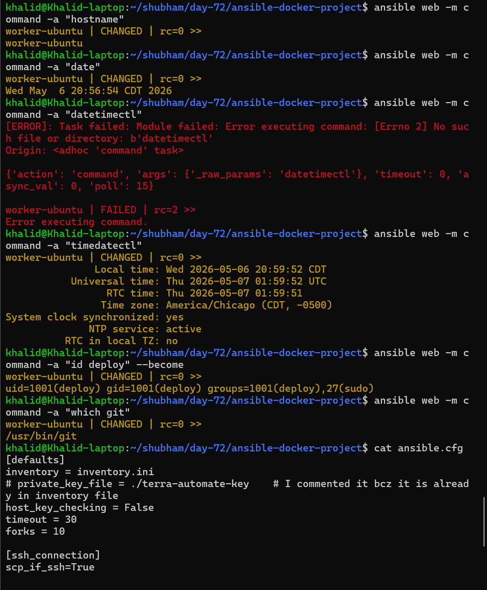
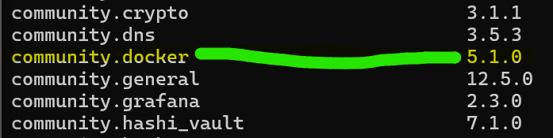
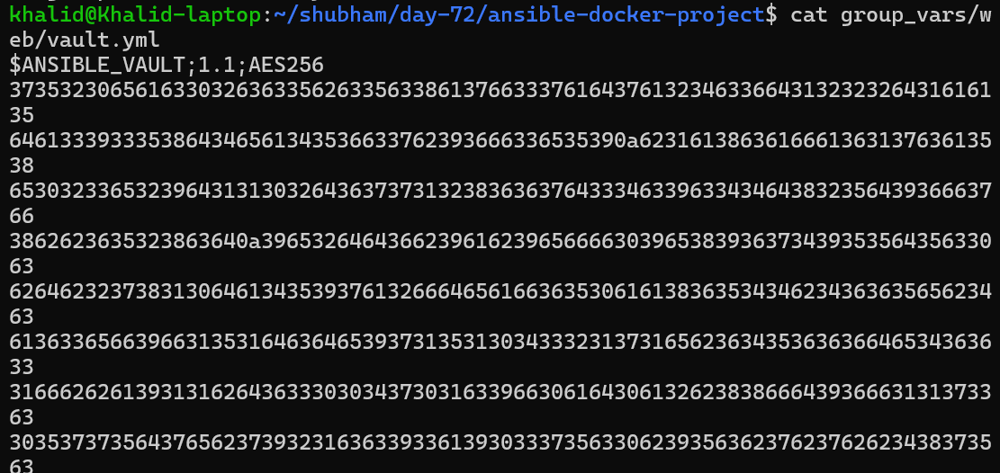

# Day 72 Overview

In Day 72, the focus shifts from learning individual Ansible concepts to applying them in a real-world deployment scenario.

This project combines everything learned in previous days — including roles, templates, variables, handlers, Ansible Galaxy, and Vault — to automate a complete application deployment from scratch.

The goal is to simulate what a DevOps engineer would actually do in production: provision a server, install Docker, deploy a containerized application, and configure Nginx as a reverse proxy — all using Ansible automation.

Instead of executing tasks manually, the entire setup is performed using a single Ansible playbook, ensuring consistency, repeatability, and scalability.

# Day 72 Objective

> The objective of this project is to build a complete, production-style automated deployment using Ansible.

The objective of this project is to:

- Automate a full application deployment using Ansible
- Install and configure Docker on managed nodes
- Deploy a containerized application using Docker
- Configure Nginx as a reverse proxy to the container
- Use Ansible roles to organize automation into reusable components
- Use Jinja2 templates for dynamic configuration
- Secure sensitive data using Ansible Vault
- Ensure idempotent execution of playbooks
- Build a production-style Ansible project structure
- Deploy an application accessible via port 80 through Nginx

# What This Project Demonstrates
- End-to-end infrastructure automation
- Real-world DevOps workflow
- Separation of concerns using roles
- Secure handling of credentials
- Scalable and maintainable automation design

# Architecture
```text
Ansible (Control Node)
        ↓
Managed Server
   ├── Nginx (Port 80)
   │       ↓
   └── Docker Container (Port 8080)
```

# Expected Outcome

By the end of this project:

- Docker is installed and running
- Application container is deployed
- Nginx is configured as reverse proxy
- Secrets are securely managed with Vault
- Entire setup is automated via site.yml
- Application is accessible via browser on port 80

---

# Table of Contents — Day 72 Ansible Project

| Section | Summary | Link |
|---|---|---|
| Day 72 Overview | Introduction to the complete production-style Ansible automation project | [Day 72 Overview](#day-72-overview) |
| Day 72 Objective | Goals and expected outcomes of the project | [Day 72 Objective](#day-72-objective) |
| Architecture | End-to-end deployment architecture using Ansible, Docker, and Nginx | [Architecture](#architecture) |
| Task 1: Plan the Project Structure | Created the complete Ansible project structure using roles, templates, handlers, and group variables | [Task 1](#task-1-plan-the-project-structure) |
| Task 2: Build the Common Role | Configured baseline server setup including packages, hostname, timezone, and deploy user | [Task 2](#task-2-build-the-common-role) |
| Task 3: Build the Docker Role | Installed Docker, configured services, deployed containers, and verified application health | [Task 3](#task-3-build-the-docker-role) |
| Task 4: Build the Nginx Role | Installed and configured Nginx as a reverse proxy for the Docker container | [Task 4](#task-4-build-the-nginx-role) |
| Task 5: Encrypt Docker Hub Credentials with Vault | Secured Docker Hub credentials using Ansible Vault and vault password files | [Task 5](#task-5-encrypt-docker-hub-credentials-with-vault) |
| Task 6: Write the Master Playbook and Deploy | Created the master playbook and deployed the full stack using Ansible roles | [Task 6](#task-6-write-the-master-playbook-and-deploy) |
| Task 7: Bonus — Deploy a Different App and Re-Run | Replaced the container image dynamically and verified idempotency | [Task 7](#task-7-bonus--deploy-a-different-app-and-re-run) |
| Ansible Quick Commands Reference (Day 68 → Day 72) | Important Ansible commands used throughout the project | [Quick Commands](#ansible-quick-commands-reference-day-68--day-72) |


---

# Task 1: Plan the Project Structure

## Task Overview

In this task, I created the complete project structure for automating
Docker and Nginx deployment using Ansible.

The goal is to organize the project in a production-style format using Ansible roles. Instead of keeping all tasks in one large playbook, the project is divided into separate roles for common setup, Docker management, and Nginx reverse proxy configuration.

This structure follows real-world DevOps practices and ensures the project is scalable, modular, and easy to maintain.

------------------------------------------------------------------------

## Task Objective

The objective of this task is to:

- Create the main project directory(ansible-docker-project)
- Set up a clean Ansible project layout
- Create custom roles for:(using ansible-galaxy )
   - `common`
   - `docker`
   - `nginx`
- Prepare `ansible.cfg`
- Prepare `inventory.ini`
- Create group variable folders
- Prepare the project for Docker, Nginx, templates, handlers, and Vault

------------------------------------------------------------------------

## Project Structure

    ansible-docker-project/
    ├── ansible.cfg
    ├── inventory.ini
    ├── site.yml                  # Master playbook
    ├── group_vars/
    │   ├── all.yml               # Common variables
    │   └── web/
    │       ├── vars.yml          # Nginx variables
    │       └── vault.yml         # Encrypted Docker Hub credentials
    ├── roles/
    │   ├── common/               # Shared setup for all servers
    │   ├── docker/               # Docker installation and container management
    │   │   └── templates/
    │   │       └── docker-compose.yml.j2
    │   └── nginx/                # Nginx reverse proxy
    │       └── templates/
    │           ├── nginx.conf.j2
    │           └── app-proxy.conf.j2

------------------------------------------------------------------------
## Create Project Directory
    ```bash
    mkdir -p ansible-docker-project
    cd ansible-docker-project
    ```

## Generate Role Skeletons

    ```bash
    ansible-galaxy init roles/common
    ansible-galaxy init roles/docker
    ansible-galaxy init roles/nginx
    ```
### Result

Each role contains:

- tasks/
- handlers/
- defaults/
- vars/
- templates/
- meta/

This matches standard Ansible role structure from Day 71

------------------------------------------------------------------------

## Create Group Variable Structure
    ```bash
    mkdir -p group_vars/web
    touch group_vars/all.yml
    touch group_vars/web/vars.yml
    touch group_vars/web/vault.yml
    ```
### Purpose

| File      | Use                                  |
| --------- | ------------------------------------ |
| all.yml   | Global variables                     |
| vars.yml  | Nginx / app config                   |
| vault.yml | Docker credentials (encrypted later) |


------------------------------------------------------------------------

## Create Required Template Files
    ```bash
    touch roles/docker/templates/docker-compose.yml.j2
    touch roles/nginx/templates/nginx.conf.j2
    touch roles/nginx/templates/app-proxy.conf.j2
    ```

### Purpose

| Template              | Use                  |
| --------------------- | -------------------- |
| docker-compose.yml.j2 | Container definition |
| nginx.conf.j2         | Main Nginx config    |
| app-proxy.conf.j2     | Reverse proxy        |


------------------------------------------------------------------------

## site.yml

``` yaml
---
- name: Deploy Docker application with Nginx reverse proxy
  hosts: web
  become: true
  gather_facts: true

  roles:
    - common
    - docker
    - nginx
```

---
## Verify Project Structure
```bash
tree ansible-docker-project
```
```text
ansible-docker-project/
├── ansible.cfg
├── inventory.ini
├── site.yml
├── group_vars/
│   ├── all.yml
│   └── web/
│       ├── vars.yml
│       └── vault.yml
├── roles/
│   ├── common/
│   ├── docker/
│   │   └── templates/
│   │       └── docker-compose.yml.j2
│   └── nginx/
│       └── templates/
│           ├── nginx.conf.j2
│           └── app-proxy.conf.j2
```
Verified from your terminal output — everything is correctly created

---

## What You Achieved

This is not just setup — this is foundation of entire project:
```text
roles/
  common  → base system setup
  docker  → app deployment
  nginx   → traffic routing
```

> Clean separation of responsibilities (REAL DEVOPS PRACTICE)

------------------------------------------------------------------------

## Key Learnings

-   Roles create modular automation
-   group_vars organize configuration
-   Templates enable dynamic configuration
-   site.yml is the entry point
- Proper structure = scalable project

------------------------------------------------------------------------

## Conclusion

In this task, I successfully created a complete Ansible project structure using roles, group variables, and templates. I prepared the foundation for automating Docker container deployment and configuring Nginx as a reverse proxy.

This structure ensures modular, reusable, and production-ready automation for the upcoming tasks.

---

# Task 2: Build the Common Role

## Task Overview

In this task, I built the `common` role, which is responsible for baseline setup on every managed server.

The common role contains tasks that should run before Docker or Nginx configuration, such as updating the package cache, installing basic tools, setting the hostname, configuring timezone, and creating a deploy user.

This role helps keep shared server configuration in one reusable location instead of repeating the same tasks in multiple playbooks.

[`Common` Role Explanation](md/common_role_ansible.md)

---

## Task Objective

The objective of this task is to:

- Update the package cache on the managed server
- Install common troubleshooting and utility packages
- Set the server hostname using the Ansible inventory name
- Configure the server timezone
- Create a `deploy` user for future deployments
- Use variables from `group_vars/all.yml`
- Add the `common` tag for selective execution
    - [`common-tags` Explanation](md/ansible_common_role_tags_notes.md)

---

## File: group_vars/all.yml

```yaml
---
timezone: America/Chicago
project_name: devops-app
app_env: development

common_packages:
  - vim
  - curl
  - wget
  - git
  - htop
  - tree
  - jq
  - unzip
```
## File: roles/common/tasks/main.yml
Since my managed server is Ubuntu, I used the `apt` module instead of `yum`.

```yaml
---
- name: Update package cache for Ubuntu
  apt:
    update_cache: true
  when: ansible_facts['os_family'] == "Debian"
  tags: common

- name: Update package for RedHat
  yum:
    name: "*"
    state: latest
    update_only: true
  when: ansible_facts['os_family'] == "RedHat"
  tags: common

- name: Install common packages
  package:
    name: "{{ common_packages }}"
    state: present
  tags: common

- name: Set hostname
  hostname:
    name: "{{ inventory_hostname }}"
  tags: common

- name: Set timezone
  timezone:
    name: "{{ timezone }}"
  tags: common

- name: Create deploy user for Ubuntu
  user:
    name: deploy
    groups: sudo
    shell: /bin/bash
    state: present
    append: true
  when: ansible_facts['os_family'] == "Debian"
  tags: common

- name: Create deploy user for RedHat
  user:
    name: deploy
    groups: wheel
    shell: /bin/bash
    state: present
    append: true
  when: ansible_facts['os_family'] == "RedHat"
  tags: common
```

[common_role_ansible](md/common_role_ansible.md)

[ansible_common_role_tags_notes](md/ansible_common_role_tags_notes.md)


## Run Only the Common Role
```bash
ansible-playbook site.yml --tags common
```
```text
TASK [common : Create deploy user for RedHat] **********************************
skipping: [worker-ubuntu]

PLAY RECAP *********************************************************************
worker-ubuntu              : ok=6    changed=5    unreachable=0    failed=0    skipped=2    rescued=0    ignored=0
```

## Verify Common Setup
```bash
ansible web -m command -a "hostname"
ansible web -m command -a "date"
ansible web -m command -a "timedatectl"
ansible web -m command -a "id deploy" --become
ansible web -m command -a "which git"
```


## Summary

In this task, I created the `common` role to perform baseline server setup. This role installs common packages, configures hostname and timezone, and creates a deploy user.

The `common` tag allows this setup to be executed independently without running Docker or Nginx tasks.

---

# Task 3: Build the Docker Role

## Overview

In this task, I built the `docker` role, which is responsible for installing Docker, starting the Docker service, pulling an application image, running the container, and verifying that the container is reachable.

This role represents the application layer of the project. Nginx will later sit in front of this container as a reverse proxy.

Since the managed server is Ubuntu, the Docker installation uses the official Docker APT repository.

## Task Objective

The objective of this task is to:

- Install Docker on the managed server
- Start and enable the Docker service
- Add the deploy user to the Docker group
- Install the required Python Docker SDK
- Use Docker Hub credentials from Ansible Vault
- Pull the application image
- Run the application container
- Expose the container on port 8080
- Verify the app using the uri module
- Tag all Docker tasks with docker

> Software Development Kit (SDK) is a collection of tools, libraries, and documentation that helps developers build applications for a specific platform or technology.
[sdk_notes](md/sdk_notes.md)

---

# Install Required Ansible Collection

```bash
ansible-galaxy collection install community.docker
```

This installs the `community.docker` collection from Ansible Galaxy.

The collection contains Docker-related Ansible modules such as:

- community.docker.docker_login
- community.docker.docker_image
- community.docker.docker_container

Without this collection, Ansible cannot manage Docker containers using those modules.

Verify installation:

```bash
ansible-galaxy collection list
```



---

# File: `roles/docker/defaults/main.yml`:

```yaml
---
docker_app_image: nginx
docker_app_tag: latest
docker_app_name: myapp
docker_app_port: 8080
docker_container_port: 80
```
# File: `group_vars/all.yml`:
```yml
---
timezone: America/Chicago
project_name: devops-app
app_env: development


docker_package:
  Debian: docker.io
  RedHat: docker-ce


docker_compose_package:
  Debian: docker-compose
  RedHat: docker-compose-plugin


common_packages:
  - vim
  - curl
  - wget
  - git
  - htop
  - tree
  - jq
  - unzip
```
[common_role_ansible](md/common_role_ansible.md)

---

# File: `roles/docker/tasks/main.yml`:

```yaml
---
- name: Install Docker dependencies on Debian/RedHat
  package:
    name:
      - ca-certificates
      - curl
      - gnupg
      - python3-pip
      - python3-docker
    state: present
  tags: docker 

- name: Update apt cache for Debian
  apt:
    update_cache: true
  when: ansible_facts['os_family'] == "Debian"
  tags: docker

- name: Update yum cache for RedHat
  yum:
    update_cache: true
  when: ansible_facts['os_family'] == "RedHat"
  tags: docker

# - name: Update yum cache for RedHat
#   yum:
#     name: "*"
#     state: latest
#   when: ansible_facts['os_family'] == "RedHat"
#   tags: docker

- name: Install Docker for Debian/RedHat
  package:
    name: "{{ docker_package[ansible_facts['os_family']] }}"
    state: present
  tags: docker

- name: Start and enable Docker service
  service:
    name: docker
    state: started
    enabled: true
  tags: docker

- name: Add deploy user to docker group
  user:
    name: deploy
    groups: docker
    append: true
  notify: Restart Docker
  tags: docker

- name: Log in to Docker Hub
  community.docker.docker_login:
    username: "{{ vault_docker_username }}"
    password: "{{ vault_docker_password }}"
  #become_user: deploy
  when:
    - vault_docker_username is defined
    - vault_docker_password is defined
  tags: docker

- name: Pull application image
  community.docker.docker_image:
    name: "{{ docker_app_image }}"
    tag: "{{ docker_app_tag }}"
    source: pull
  tags: docker

- name: Install Docker Compose
  package:
    name: "{{ docker_compose_package[ansible_os_family] }}"
    state: present
  tags: docker

- name: Run application container
  community.docker.docker_container:
    name: "{{ docker_app_name }}"
    image: "{{ docker_app_image }}:{{ docker_app_tag }}"  
    state: started
    restart_policy: always
    published_ports:
      - "{{ docker_app_port }}:{{ docker_container_port }}"  # host_port(8080):container_port(80)
  tags: docker

- name: Wait for container to be healthy
  uri:
    url: "http://localhost:{{ docker_app_port }}"
    status_code: 200
  retries: 5
  delay: 3
  register: health_check
  until: health_check.status == 200
  tags: docker
```
[Explanation](md/docker_role_block_by_block_explained.md)

---

# File: roles/docker/handlers/main.yml

```yaml
---
- name: Restart Docker
  service:
    name: docker
    state: restarted
```

---

# Run Only Docker Tasks

```bash
ansible-playbook site.yml --tags docker
```

---

# Verify Docker Installation

```bash
ansible web -m command -a "docker --version"
ansible web -m command -a "docker ps"
ansible web -m command -a "docker images"
```

---

# Summary

In this task, the Docker role was created to automate Docker installation and container deployment using Ansible.

The role:
- installs Docker
- configures the Docker repository
- starts the Docker service
- adds the deploy user to the docker group
- logs into Docker Hub
- pulls container images
- runs Docker containers
- verifies application health

All tasks are tagged with docker so they can be executed independently.

---

# Task 4: Build the Nginx Role

## Task Overview

In this task, I built the `nginx` role, which installs Nginx and configures it as a reverse proxy in front of the Docker container.

The Docker container listens on port `8080`, while Nginx listens on port `80`. When a user visits the server on port `80`, Nginx forwards the request to the Docker container running on port `8080`.

This creates a production-style setup where users access the application through Nginx instead of directly accessing the container port.

---

## Task Objective

The objective of this task is to:

- Install Nginx on the managed server
- Remove the default Nginx site configuration
- Deploy the main Nginx configuration from a template
- Deploy the reverse proxy configuration from a template
- Test Nginx configuration using `nginx -t`
- Reload Nginx only when configuration changes
- Start and enable the Nginx service
- Tag all Nginx tasks with `nginx`

---

## File: roles/nginx/defaults/main.yml

```yaml
---
nginx_http_port: 80
nginx_upstream_port: 8080
nginx_server_name: "_"
```

---

## File: roles/nginx/tasks/main.yml
```yaml
---
- name: Install Nginx
  package:
    name: nginx
    state: present
  tags: nginx

- name: Remove default Nginx site configuration
  file:
    path: /etc/nginx/sites-enabled/default
    state: absent
  when: ansible_facts['os_family'] == "Debian"
  tags: nginx

- name: Remove default Nginx config on RedHat
  file:
    path: "{{ item }}"
    state: absent
  loop:
    - /etc/nginx/conf.d/default.conf
    - /etc/nginx/conf.d/welcome.conf
  when: ansible_facts['os_family'] == "RedHat"
  notify: Reload Nginx
  tags: nginx

- name: Deploy main Nginx Configuration
  template:
    src: nginx.conf.j2
    dest: /etc/nginx/nginx.conf
    owner: root
    group: root
    mode: '0644'
  notify: Reload Nginx
  tags: nginx

- name: Deploy reverse proxy configuration
  template:
    src: app-proxy.conf.j2
    dest: /etc/nginx/conf.d/{{  project_name }}.conf
    owner: root
    group: root
    mode: '0644'
  notify: Reload Nginx
  tags: nginx
```
Your task flow is also correctly ordered:
```text
Install Nginx
    ↓
Remove default configs
    ↓
Deploy configs/templates
    ↓
Validate nginx -t
    ↓
Start/enable service
```

That is exactly how production Nginx deployments are usually done.


## File: `roles/nginx/templates/nginx.conf.j2`
```Nginx

user www-data;

user nginx;


worker_processes auto;
pid /run/nginx.pid;

events {
    worker_connections 1024;
}

http {
    sendfile on;
    tcp_nopush on;
    types_hash_max_size 2048;

    include /etc/nginx/mime.types;
    default_type application/octet-stream;

    access_log /var/log/nginx/access.log;
    error_log /var/log/nginx/error.log;

    gzip on;


    include /etc/nginx/sites-enabled/*;

    include /etc/nginx/conf.d/*.conf;

}
```
[roles/nginx/templates/nginx.conf.j2 Explanation](md/nginx_template_block_by_block_explained.md)

[What are Worker Processes in NGINX?](md/nginx_worker_processes_explained.md)

### Important Note for RedHat

On RedHat-based systems, the Nginx user is usually:

> nginx

On Ubuntu/Debian, the Nginx user is usually:

> www-data

Since your active server is Ubuntu, www-data is correct.

For cross-platform support later, we can convert this into a variable.

---

## File: roles/nginx/handlers/main.yml
```yaml
---
- name: Reload Nginx
  service:
    name: nginx
    state: reloaded

- name: Restart Nginx
  service:
    name: nginx
    state: restarted
```
## Important DevOps Practice

Always run before reload/restart:
```bash
nginx -t
```
because:
- catches syntax errors
- prevents broken deployments
- avoids downtime

Very common production workflow:
```text
Deploy config
      ↓
nginx -t
      ↓
Reload nginx
```

## Run Only Nginx Tasks
```bash
ansible-playbook site.yml --tags nginx
```
## Verify Nginx:
1. Validate Nginx Configuration
```bash
ansible web -m command -a "nginx -t" --become
```
checks:
- syntax errors
- configuration validity
- whether Nginx can successfully load config files

2. Check Nginx Binary Location/ Verify Nginx Installation
```bash
ansible web -m command -a "which nginx" --become
```
checks:
- whether Nginx is installed
- where the nginx executable exists
Example output:
```text
/usr/sbin/nginx
```

3. View Complete Nginx Configuration
```bash
ansible web -m command -a "nginx -T" --become
```
shows:
- entire active Nginx configuration
- loaded config files
- included virtual hosts
- all parsed settings

It is commonly used for:
- debugging
- configuration validation
- troubleshooting includes and templates.

4. Verify Nginx Service Status
because this command checks:
- whether Nginx is running
- service state
- startup status
- recent service logs
- process information

`--no-pager` shows the full output directly in terminal without opening a pager like `less`.

5. Verify Nginx Listening Ports/Sockets:
```bash
ansible web -m shell -a "ss -tulnp | grep nginx" --become
```
because this command checks:
- which ports Nginx is listening on
- active TCP sockets
- process binding information
Example:
```text
0.0.0.0:80
```
means Nginx is listening on port 80 on all network interfaces.

6. Verify Web Server Response
```bash
ansible web -m command -a "curl localhost"
```
because this command checks:
- whether the web server responds
- local HTTP connectivity
- returned webpage content

It is commonly used to quickly verify:
- Nginx is serving traffic
- reverse proxy is working
- application is reachable locally.

7. Verify Health Endpoint Response
```bash
ansible web -m uri -a "url=http://localhost/health status_code=200"
```
because this command checks:
- whether the application health endpoint is reachable
- HTTP status response
- application availability
Expected result:
```text
status: 200
```
which means the application is healthy and responding successfully.

8. Test Web Server Availability
```bash
ansible web -m uri -a "url=http://localhost status_code=200"
```
because this command checks:
- whether Nginx is reachable
- HTTP response status
- local web server connectivity

Expected result:
```text
status: 200
```
which means the web server is successfully responding.

## Expected Architecture After This Task
```text
User Request
    ↓
Nginx :80
    ↓
Docker Container :8080
```

## Use a password file (better for CI/CD):
```bash
echo "YourVaultPassword" > .vault_pass
chmod 600 .vault_pass
echo ".vault_pass" >> .gitignore
```
```bash
ansible-playbook db-setup.yml --vault-password-file .vault_pass
```

Or set it in ansible.cfg:
```bash
[defaults]
vault_password_file = .vault_pass
```

So the flow is working like this:
```text
Browser → Nginx on port 80 → proxy to Docker container on 8080 → nginx container welcome page
```

That welcome page may be coming from the container, not the host Nginx.

Also compare:
```bash
ansible web -m command -a "curl -I http://localhost" --become
ansible web -m command -a "curl -I http://localhost:8080" --become
```

[change_both_nginx_pages_guide](md/change_both_nginx_pages_guide.md)


[devops_project_debugging_summary](md/devops_project_debugging_summary.md)

## Summary

In this task, I created the nginx role to install and configure Nginx as a reverse proxy for the Docker container.

The role deploys both the main Nginx config and the reverse proxy config using Jinja2 templates. It also validates the configuration using `nginx -t` before the service is reloaded.

The `nginx` tag allows Nginx-specific configuration to be updated independently from Docker or common setup tasks.

---

## If machines are fresh follow these stepe:
your new servers are fresh. So /health returning 404 simply means your Nginx reverse proxy app config is not deployed yet, or /health route is not defined.

Run in order:
```bash
ansible all -m ping
```
```bash
ansible-playbook site.yml --tags common
```
```bash
ansible-playbook site.yml --tags docker
```
```bash
ansible-playbook site.yml --tags nginx
```

Then test:
```bash
ansible web -m command -a "docker ps" --become
ansible web -m command -a "nginx -t" --become
ansible web -m uri -a "url=http://localhost status_code=200"
ansible web -m uri -a "url=http://localhost:8080 status_code=200"
```

---

# Task 5: Encrypt Docker Hub Credentials with Vault

## Task Overview

In this task, I used Ansible Vault to securely store Docker Hub credentials.

Docker Hub credentials are sensitive information, so they should not be written in plain text inside normal variable files. Ansible Vault encrypts the secrets and allows the playbook to use them safely during execution.

These credentials are used by the Docker role when logging in to Docker Hub before pulling container images.

---

## Task Objective

The objective of this task is to:

- Create a Vault-encrypted variable file
- Store Docker Hub username securely
- Store Docker Hub token/password securely
- Create a Vault password file for convenience
- Protect the Vault password file with correct permissions
- Exclude the Vault password file from Git
- Reference the Vault password file in `ansible.cfg`

---

## Common Ansible Vault Commands

| Command                                                      | Purpose                                        |
| ------------------------------------------------------------ | ---------------------------------------------- |
| `ansible-vault create file.yml`                              | Create a new encrypted vault file              |
| `ansible-vault edit file.yml`                                | Edit encrypted vault file                      |
| `ansible-vault view file.yml`                                | View decrypted vault content                   |
| `ansible-vault encrypt file.yml`                             | Encrypt existing plain YAML file               |
| `ansible-vault decrypt file.yml`                             | Remove encryption from vault file              |
| `ansible-vault rekey file.yml`                               | Change vault password                          |
| `ansible-vault encrypt_string 'mypassword' --name 'db_pass'` | Encrypt a single variable                      |
| `ansible-playbook site.yml --ask-vault-pass`                 | Run playbook and ask for vault password        |
| `ansible-playbook site.yml`                                  | Run playbook using `.vault_pass` automatically |
| `ansible-vault view file.yml --ask-vault-pass`               | View vault file with manual password prompt    |
| `ansible-vault rekey file.yml --ask-vault-pass`              | Rekey vault with manual password prompt        |

## Useful files:

| File                       | Purpose                                                  |
| -------------------------- | -------------------------------------------------------- |
| `.vault_pass`              | Stores vault password for automation                     |
| `group_vars/web/vault.yml` | Encrypted variables file                                 |
| `.gitignore`               | Prevents vault password file from being pushed to GitHub |

---

## Create Vault File

```bash
ansible-vault create group_vars/web/vault.yml
```
Add the following variables:
```yaml
vault_docker_username: your-dockerhub-username
vault_docker_password: your-dockerhub-token
```

## Create Vault Password File
```bash
echo "YourVaultPassword" > .vault_pass
chmod 600 .vault_pass
```
The permission `600` means only the file owner can read and write the file.

## Add Vault Password File to .gitignore
```bash
echo ".vault_pass" >> .gitignore
```
This prevents the Vault password file from being committed to Git.

## Reference Vault Password File in ansible.cfg
File: `ansible.cfg`
```ini
[defaults]
inventory = inventory.ini
host_key_checking = False
vault_password_file = .vault_pass
```
## Verify Vault File
```bash
cat group_vars/web/vault.yml
```


## View Vault File Safely
```bash
ansible-vault view group_vars/web/vault.yml
```
## Edit Vault File
```bash
ansible-vault edit group_vars/web/vault.yml
```

## Why Vault Is Important

Vault protects sensitive values such as:
- Docker Hub username
- Docker Hub password
- Docker Hub access token
- API keys
- database passwords
- private credentials

Without Vault, secrets may accidentally be committed to GitHub.

## How Docker Role Uses Vault Variables

The Docker role uses these variables in the login task:
```yaml
- name: Log in to Docker Hub
  community.docker.docker_login:
    username: "{{ vault_docker_username }}"
    password: "{{ vault_docker_password }}"
  become_user: deploy
  when:
    - vault_docker_username is defined
    - vault_docker_password is defined
  tags: docker
```

## Run Playbook with Vault Password File

Because `vault_password_file` is configured in `ansible.cfg`, I can run the playbook normally:
```bash
ansible-playbook site.yml --tags docker
```
Without this setting, I would need:
```bash
ansible-playbook site.yml --tags docker --ask-vault-pass
```

## Security Note

The `.vault_pass` file should never be committed to GitHub. It must be included in `.gitignore`.

Never store real credentials directly inside Git repositories, screenshots, terminal recordings, or public documentation.

## Summary

In this task, I secured Docker Hub credentials using Ansible Vault. The encrypted `vault.yml` file stores the Docker Hub username and token, while `.vault_pass` allows Ansible to decrypt the file during playbook execution.

This keeps credentials protected while still allowing the Docker role to authenticate with Docker Hub automatically.

---

# Task 6: Write the Master Playbook and Deploy

## Task Overview

In this task, I created the master playbook `site.yml` to orchestrate
the complete deployment workflow using Ansible roles.

The deployment process includes:

1.  Common server configuration
2.  Docker installation and container deployment
3.  Nginx reverse proxy configuration

This allows the complete application stack to be deployed using a single
Ansible command.

------------------------------------------------------------------------

## Task Objective

The objective of this task is to:

-   Create the master playbook
-   Apply common configuration to all managed nodes
-   Install Docker and deploy containers
-   Configure Nginx as a reverse proxy
-   Use tags for selective execution
-   Perform dry-run validation before deployment
-   Verify Docker container accessibility
-   Verify Nginx reverse proxy functionality

------------------------------------------------------------------------

# File: site.yml

``` yaml
---
- name: Apply common configuration
  hosts: all
  become: true
  gather_facts: true
  roles:
    - common
  tags: common

- name: Install Docker and run containers
  hosts: web
  become: true
  gather_facts: true
  roles:
    - docker
  tags: docker

- name: Configure Nginx reverse proxy
  hosts: web
  become: true
  gather_facts: true
  roles:
    - nginx
  tags: nginx
```

------------------------------------------------------------------------

# Verify Inventory Connectivity

``` bash
ansible all -m ping
```

Result: - worker-amazon → SUCCESS - worker-redhat → SUCCESS -
worker-ubuntu → SUCCESS

------------------------------------------------------------------------

# Verify Project Structure

``` bash
tree ../ansible-docker-project/
```

The project contains: - ansible.cfg - inventory.ini - group_vars -
roles - templates - handlers - defaults - site.yml

------------------------------------------------------------------------

# Full Deployment

``` bash
ansible-playbook site.yml -f 1
```

Deployment sequence: - common role - docker role - nginx role

The deployment completed successfully without failed tasks.

------------------------------------------------------------------------

# Dry Run Before Deployment

``` bash
ansible-playbook site.yml --check --diff
```

## Purpose of --check

Runs Ansible in dry-run mode to preview changes without modifying the
server.

## Purpose of --diff

Shows configuration differences before deployment.

------------------------------------------------------------------------

# Selective Deployment Using Tags

## Run only Docker tasks

``` bash
ansible-playbook site.yml --tags docker
```

## Run only Nginx tasks

``` bash
ansible-playbook site.yml --tags nginx
```

## Skip common role

``` bash
ansible-playbook site.yml --skip-tags common
```

------------------------------------------------------------------------

# Verify Docker Container

``` bash
ansible web -m command -a "docker ps" --become
```

Output:

``` text
0.0.0.0:8080->80/tcp
```

This confirms: - host port 8080 - container port 80 - container running
successfully

------------------------------------------------------------------------

# Verify Docker Container Directly

``` bash
ansible web -m uri -a "url=http://localhost:8080 status_code=200"
```

Result: - HTTP Status: 200 - Container responded successfully

------------------------------------------------------------------------

# Verify Nginx Reverse Proxy

``` bash
ansible web -m uri -a "url=http://localhost status_code=200"
```

Result: - HTTP Status: 200 - Nginx successfully proxied traffic to the
container

------------------------------------------------------------------------

# Verify Services

## Check Nginx Service

``` bash
ansible web -m command -a "systemctl is-active nginx" --become
```

Expected output:

``` text
active
```

## Check Docker Service

``` bash
ansible web -m command -a "systemctl is-active docker" --become
```

Expected output:

``` text
active
```

------------------------------------------------------------------------

# Deployment Architecture

``` text
User Browser
      ↓
Nginx Reverse Proxy :80
      ↓
Docker Container :8080
      ↓
Application Response
```

------------------------------------------------------------------------

# Important Observation During --check Mode

Some command-based validation tasks such as:

``` bash
nginx -t
```

may be skipped during:

``` bash
--check
```

because they require actual command execution on the remote host.

------------------------------------------------------------------------

# Idempotency Verification

Running the playbook multiple times produced mostly `ok` results instead
of `changed`, confirming that the deployment is idempotent.

Example:

``` text
ok=24
changed=2
failed=0
```

The remaining changes were caused by package cache refresh tasks.

------------------------------------------------------------------------

## Key successful results from your log:

ansible-playbook site.yml -f 1 completed successfully
Docker container running on `8080`
Nginx reverse proxy working on `80`
`docker ps` shows active container
`systemctl is-active nginx `→ `active`
`systemctl is-active docker` → `active`
`uri`checks returned `200 OK`

Your final architecture is now:
```text
Browser
   ↓
Nginx :80
   ↓
Reverse Proxy
   ↓
Docker Container :8080
   ↓
NGINX Container :80
```

## Summary

In this task, I created the master playbook to orchestrate the complete
deployment workflow using Ansible roles.

The deployment successfully: - configured servers - installed Docker -
deployed the containerized application - configured Nginx reverse
proxy - validated services - verified application accessibility

The full application stack can now be deployed using:

``` bash
ansible-playbook site.yml
```

---

# Task 7: Bonus — Deploy a Different App and Re-Run
## Task Overview

In this task, the Docker container image was changed from the default Nginx image to an Apache HTTPD image using Ansible extra variables (`-e`).

The deployment was re-run without modifying the playbook itself. This demonstrates the flexibility of Ansible variables and proves that the automation is reusable and dynamic.

After updating the container image, the full playbook was executed again to verify idempotency.

This task also serves as a final reflection on all concepts learned from Day 68 through Day 72.

## Task Objective

The objective of this task is to:

- Replace the running Docker application with a different image
- Use extra variables (`-e`) to override default role variables
- Re-deploy containers without changing the playbook
- Verify that Nginx reverse proxy still works
- Confirm idempotency by re-running the playbook
- Reflect on all Ansible concepts learned across Days 68–72
- Identify production improvements for real-world deployments

## Deploy a Different Docker Application

I replaced the original container image with Apache HTTPD using:
```bash
ansible-playbook site.yml --tags docker \
  -e "docker_app_image=httpd docker_app_tag=latest docker_app_name=apache-app"
```
## What This Command Does

This command overrides default variables at runtime:

| Variable         | New Value  |
| ---------------- | ---------- |
| docker_app_image | httpd      |
| docker_app_tag   | latest     |
| docker_app_name  | apache-app |

The existing container is replaced automatically with the new application container.

This demonstrates variable overriding using:
```bash
-e
```
which has the highest precedence in Ansible.

## Why Nginx Did Not Need Changes

Nginx still proxies traffic to:
```text
localhost:8080
```

Since the new container also exposes port 80 internally and maps to host port 8080, the reverse proxy configuration remains unchanged.

Architecture remains:
```text
Nginx :80 → Docker Container :8080
```

## Re-Run Full Playbook

After deploying the new container, I re-ran the complete automation:
```bash
ansible-playbook site.yml
```

## Idempotency Verification

The second playbook execution showed mostly:
```text
ok
```
with minimal or zero:
```text
changed
```
This confirms that the project is idempotent.

Example:
```text
ok=24
changed=0
failed=0
```
This means:

- the desired state already existed
- Ansible detected no unnecessary changes
- repeated runs are safe

Idempotency is one of the most important principles in configuration management.

## Verification Steps
### Verify Running Container
```bash
ansible web -m command -a "docker ps" --become
```
```text
apache-app
0.0.0.0:8080->80/tcp
```

### Verify Direct Container Access
```bash
ansible web -m uri -a "url=http://localhost:8080 status_code=200"
```

### Verify Nginx Reverse Proxy
```bash
ansible web -m uri -a "url=http://localhost status_code=200"
```

- HTTP 200 response
- Apache page accessible through Nginx

# Total Tasks Executed

### The project now includes automation for:

- package installation
- service management
- user management
- Docker installation
- container deployment
- Nginx reverse proxy setup
- template rendering
- health checks
- Vault authentication
- multi-OS support

### Approximate total:

- 20+ automation tasks
- across multiple roles
- running on multiple Linux distributions

# Mapping Concepts Learned Across Days

| Day | Concepts Used                                |
| --- | -------------------------------------------- |
| 68  | Inventory, ad-hoc commands, SSH setup        |
| 69  | Playbooks, modules, handlers                 |
| 70  | Variables, facts, conditionals, loops        |
| 71  | Roles, templates, Galaxy, Vault              |
| 72  | Complete production-style automation project |


# Concepts Combined in This Project

This project combines:

- Infrastructure automation
- Configuration management
- Dynamic variables
- Role-based architecture
- Multi-platform support
- Secret management
- Reverse proxy configuration
- Container orchestration basics
- Health verification
- Idempotent automation

# Production Improvements

If this project were extended for production use, the following features could be added:

### SSL/TLS Encryption

Use:

- Certbot
- Let’s Encrypt

to enable HTTPS.

### Monitoring

Add:

- Prometheus
- Grafana
- Node Exporter

for infrastructure monitoring.

### Centralized Logging

Implement:

- ELK Stack
- Loki
- Fluentd

for log aggregation.

### Multi-Container Deployment

Use:

- Docker Compose
- Kubernetes

for multi-service applications.

### CI/CD Integration

Integrate with:

- GitHub Actions
- Jenkins
- GitLab CI/CD

for automated deployments.

### Security Improvements

Add:

- firewall rules
- fail2ban
- container scanning
- secret rotation

# Cleanup

After testing, cloud resources should be cleaned up to avoid unnecessary costs.

If Terraform was used:
```bash
terraform destroy
```
If instances were created manually:

- terminate EC2 instances from AWS Console

# Final Architecture
```text
Ansible Control Node
        ↓
Managed Servers
        ↓
Docker Container (Apache/Nginx)
        ↓
Nginx Reverse Proxy :80
        ↓
Client Request
```
# Task 7 Summary

In this final task, I demonstrated dynamic application deployment by replacing the Docker image using Ansible extra variables.

I verified:

- container replacement
- reverse proxy functionality
- health checks
- idempotent execution

This concludes the Day 72 Ansible project, combining all concepts learned from previous days into a complete production-style automation workflow.

---

# Ansible Quick Commands Reference (Day 68 → Day 72)

| Day | Topic | Command | Purpose |
| --- | ----- | ------- | ------- |
| 68 | Verify Ansible Installation | `ansible --version` | Check installed Ansible version |
| 68 | Ping All Hosts | `ansible all -m ping` | Test SSH connectivity |
| 68 | Ping Specific Group | `ansible web -m ping` | Test specific inventory group |
| 68 | Inventory View | `ansible-inventory --list` | Show parsed inventory |
| 68 | Ad-hoc Command | `ansible all -a "hostname"` | Run command on all hosts |
| 68 | Use Become | `ansible all -b -a "whoami"` | Run command with sudo |
| 68 | Install Package | `ansible all -b -m package -a "name=git state=present"` | Install package |
| 68 | Copy File | `ansible all -m copy -a "src=test.txt dest=/tmp/test.txt"` | Copy file to remote host |
| 68 | Gather Facts | `ansible all -m setup` | Collect system information |
| 68 | Filter Facts | `ansible all -m setup -a "filter=ansible_os_family"` | Show selected facts |
| 68 | Inventory Pattern | `ansible web:&prod -m ping` | Match multiple inventory patterns |
| 69 | Run Playbook | `ansible-playbook site.yml` | Execute playbook |
| 69 | Dry Run | `ansible-playbook site.yml --check` | Preview changes |
| 69 | Show Differences | `ansible-playbook site.yml --diff` | Show config differences |
| 69 | Verbose Output | `ansible-playbook site.yml -vvv` | Debug execution |
| 69 | Syntax Check | `ansible-playbook site.yml --syntax-check` | Validate YAML syntax |
| 69 | Limit Hosts | `ansible-playbook site.yml --limit web` | Run only on selected hosts |
| 69 | Run Specific Task | `ansible-playbook site.yml --start-at-task="Install nginx"` | Resume from task |
| 69 | List Tasks | `ansible-playbook site.yml --list-tasks` | Show playbook tasks |
| 69 | List Hosts | `ansible-playbook site.yml --list-hosts` | Show targeted hosts |
| 70 | Extra Variables | `ansible-playbook site.yml -e "app_port=8080"` | Override variables |
| 70 | Multiple Extra Vars | `ansible-playbook site.yml -e "app_name=myapp app_port=9090"` | Override multiple variables |
| 70 | Debug Variable | `ansible all -m debug -a "var=inventory_hostname"` | Print variable |
| 70 | Check Facts | `ansible all -m setup -a "filter=ansible_distribution*"` | Show OS details |
| 70 | Run Conditional Playbook | `ansible-playbook site.yml` | Execute dynamic tasks |
| 70 | Loop Example | `loop:` inside playbook | Repeat tasks |
| 71 | Create Role | `ansible-galaxy init roles/webserver` | Generate role skeleton |
| 71 | Install Galaxy Role | `ansible-galaxy install geerlingguy.docker` | Install community role |
| 71 | Install Collection | `ansible-galaxy collection install community.docker` | Install collection |
| 71 | Encrypt Vault File | `ansible-vault create secrets.yml` | Create encrypted file |
| 71 | Edit Vault File | `ansible-vault edit secrets.yml` | Edit encrypted file |
| 71 | View Vault File | `ansible-vault view secrets.yml` | Read encrypted file |
| 71 | Encrypt Existing File | `ansible-vault encrypt secrets.yml` | Encrypt plaintext file |
| 71 | Decrypt File | `ansible-vault decrypt secrets.yml` | Decrypt vault file |
| 71 | Run with Vault | `ansible-playbook site.yml --ask-vault-pass` | Use vault password |
| 72 | Run Master Playbook | `ansible-playbook site.yml` | Full deployment |
| 72 | Sequential Deployment | `ansible-playbook site.yml -f 1` | Run playbook one host at a time for safer controlled deployment and easier debugging |
| 72 | Dry Run Deployment | `ansible-playbook site.yml --check --diff` | Safe deployment preview |
| 72 | Run Docker Role Only | `ansible-playbook site.yml --tags docker` | Execute only Docker tasks |
| 72 | Run Nginx Role Only | `ansible-playbook site.yml --tags nginx` | Execute only Nginx tasks |
| 72 | Skip Common Tasks | `ansible-playbook site.yml --skip-tags common` | Skip selected tasks |
| 72 | Deploy Different App | `ansible-playbook site.yml --tags docker -e "docker_app_image=httpd docker_app_tag=latest docker_app_name=apache-app"` | Deploy a different container image |
| 72 | Verify Docker Containers | `ansible web -m command -a "docker ps" --become` | Check running containers |
| 72 | Verify Nginx | `ansible web -m uri -a "url=http://localhost status_code=200"` | Verify Nginx reverse proxy response |
| 72 | Verify Container | `ansible web -m uri -a "url=http://localhost:8080 status_code=200"` | Check container directly |
| 72 | Test Nginx Config | `ansible web -m command -a "nginx -t" --become` | Validate Nginx config on managed host |
| 72 | Destroy Infrastructure | `terraform destroy` | Clean up cloud resources |
